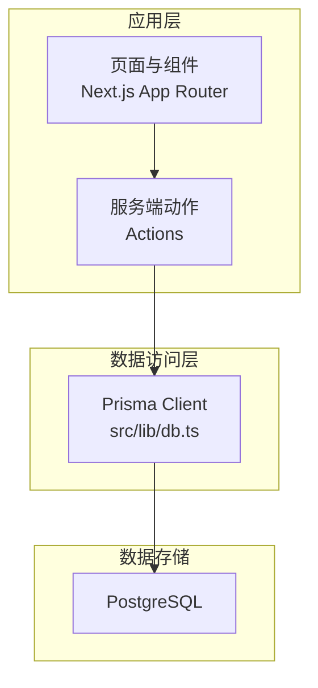
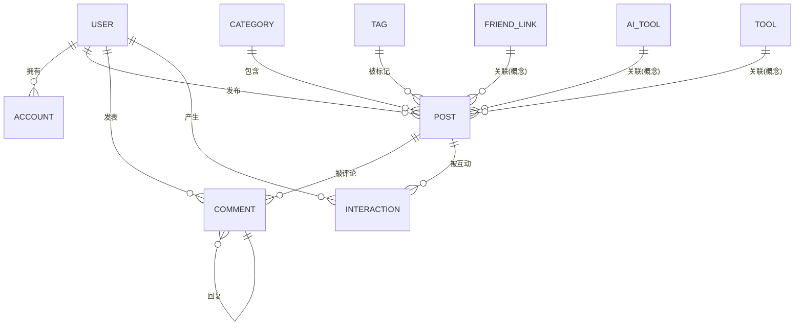
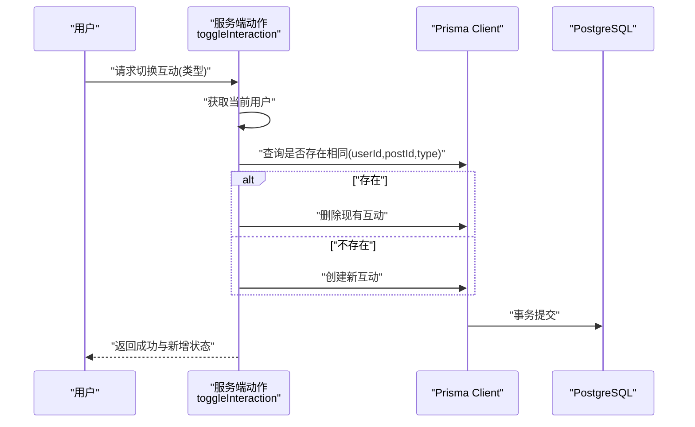
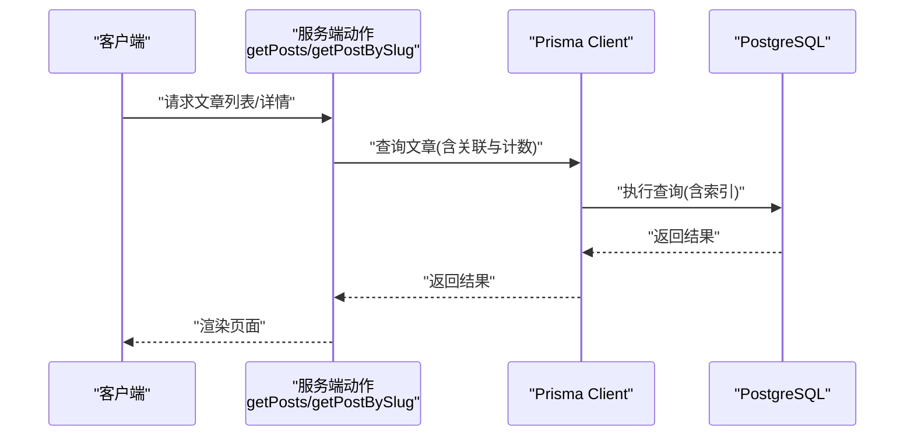
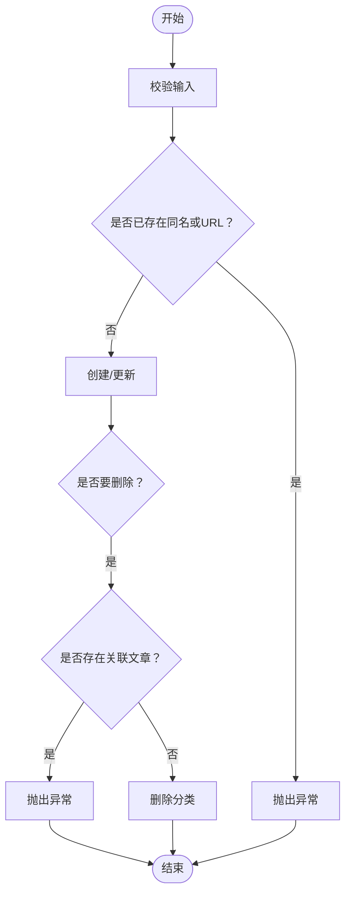
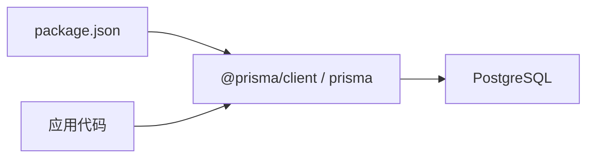

# 数据模型设计

<cite>
**本文引用的文件**
- [prisma/schema.prisma](file://prisma/schema.prisma)
- [src/lib/db.ts](file://src/lib/db.ts)
- [src/app/(site)/graph/actions.ts](file://src/app/(site)/graph/actions.ts)
- [src/app/dashboard/posts/actions.ts](file://src/app/dashboard/posts/actions.ts)
- [src/app/dashboard/categories/actions.ts](file://src/app/dashboard/categories/actions.ts)
- [src/app/dashboard/posts/schema.ts](file://src/app/dashboard/posts/schema.ts)
- [package.json](file://package.json)
</cite>

## 目录
1. [简介](#简介)
2. [项目结构](#项目结构)
3. [核心组件](#核心组件)
4. [架构总览](#架构总览)
5. [详细组件分析](#详细组件分析)
6. [依赖分析](#依赖分析)
7. [性能考量](#性能考量)
8. [故障排查指南](#故障排查指南)
9. [结论](#结论)
10. [附录](#附录)

## 简介
本文件系统化梳理“一梦五千年”项目基于 Prisma ORM 的数据模型设计，覆盖 User、Post、Category、Comment、FriendLink、AiTool、Tool、SiteVisit、VerificationCode、EmailLog 等核心实体，明确主键策略、唯一约束、索引设计、关系映射与级联规则，并解释 Role、PostStatus、InteractionType 等枚举在业务状态管理中的作用。同时给出实体关系图、字段类型说明、数据验证规则与默认值设置，以及模型扩展性与未来演进方向。

## 项目结构
- 数据模型定义位于 Prisma Schema 文件中，采用 PostgreSQL 作为数据源，启用 Prisma 关系连接预览特性以优化关联查询。
- 应用通过 Prisma Client 访问数据库，开发环境开启更详细的日志输出以便调试。
- 业务层通过 Actions 文件调用 Prisma 客户端执行读写操作，并结合 Next.js 缓存机制提升性能。

**图表来源**
- [src/lib/db.ts:1-16](file://src/lib/db.ts#L1-L16)
- [prisma/schema.prisma:1-13](file://prisma/schema.prisma#L1-L13)

**章节来源**
- [prisma/schema.prisma:1-13](file://prisma/schema.prisma#L1-L13)
- [src/lib/db.ts:1-16](file://src/lib/db.ts#L1-L16)
- [package.json:9](file://package.json#L9)

## 核心组件
本节概述各实体的职责边界与关键字段，便于快速理解整体数据结构。

- User：用户主体，支持用户名、邮箱、第三方账户绑定、角色与状态管理。
- Post：文章内容，包含标题、摘要、封面、状态、浏览计数与作者、分类关联。
- Category：文章分类，提供名称、URL 友好标识与图标信息。
- Comment：评论体系，支持树形回复，具备编辑标记与层级关系。
- Interaction：互动行为，如点赞、收藏，采用联合唯一索引防止重复。
- FriendLink：友链申请，支持待审核、通过、拒绝三种状态。
- AiTool：AI 工具收录，支持分类标签与状态管理。
- Tool：通用工具收录，区分本地与外部工具类型。
- SiteVisit：站点访问统计，记录 UV、页面 URL、设备、来源与 IP。
- VerificationCode：验证码，按邮箱与过期时间进行索引。
- EmailLog：邮件发送日志，记录发送状态与错误信息。

**章节来源**
- [prisma/schema.prisma:15-308](file://prisma/schema.prisma#L15-L308)

## 架构总览
下图展示实体间的关系与外键约束，体现一对一、一对多与多对多映射及级联规则。

**图表来源**
- [prisma/schema.prisma:54-152](file://prisma/schema.prisma#L54-L152)
- [prisma/schema.prisma:183-214](file://prisma/schema.prisma#L183-L214)

## 详细组件分析

### User 实体
- 主键策略：字符串主键，使用 cuid() 默认值。
- 唯一约束：username、email、phone。
- 索引设计：复合索引 [isDelete]，复合索引 [email, username]。
- 字段要点：
  - 角色：Role 枚举，默认 USER。
  - 激活状态：isActive 默认 true。
  - 删除状态：isDelete 默认 0（正常），deletedAt 记录删除时间。
  - 第三方登录：accounts 关系。
  - 交互与内容：posts、comments、interactions。
- 关系映射：与 Account、Post、Comment、Interaction 为一对多。

**章节来源**
- [prisma/schema.prisma:15-62](file://prisma/schema.prisma#L15-L62)

### Account 实体
- 主键策略：字符串主键，cuid()。
- 唯一约束：provider + providerAccountId 组合唯一。
- 外键关系：userId → User(id)，级联删除。
- 索引设计：userId 单列索引。
- 字段要点：令牌与过期时间等第三方登录信息。

**章节来源**
- [prisma/schema.prisma:64-82](file://prisma/schema.prisma#L64-L82)

### Category 实体
- 主键策略：字符串主键，cuid()。
- 唯一约束：name、slug。
- 字段要点：图标、颜色与创建/更新时间。
- 关系映射：与 Post 为一对多。

**章节来源**
- [prisma/schema.prisma:84-96](file://prisma/schema.prisma#L84-L96)

### Tag 实体
- 主键策略：字符串主键，cuid()。
- 唯一约束：name、slug。
- 关系映射：与 Post 为多对多。

**章节来源**
- [prisma/schema.prisma:98-107](file://prisma/schema.prisma#L98-L107)

### Post 实体
- 主键策略：字符串主键，cuid()。
- 唯一约束：slug。
- 字段要点：
  - 状态：PostStatus 枚举，默认 DRAFT。
  - 浏览计数：viewCount 默认 0。
  - 发布时间：publishedAt。
  - 作者与分类：userId → User(id)，categoryId → Category(id)。
- 索引设计：userId、categoryId。
- 关系映射：与 User、Category（可空）、Tag（多对多）、Comment、Interaction。

**章节来源**
- [prisma/schema.prisma:109-132](file://prisma/schema.prisma#L109-L132)

### Comment 实体
- 主键策略：字符串主键，cuid()。
- 字段要点：
  - 层级：parentId → Comment(id)，形成自引用。
  - 编辑标记：isEdited。
- 约束与关系：
  - userId → User(id)，onDelete: Cascade。
  - postId → Post(id)，onDelete: Cascade。
  - 自引用 parent → Comment，onDelete: Restrict。
- 索引设计：postId、userId、parentId。

**章节来源**
- [prisma/schema.prisma:134-152](file://prisma/schema.prisma#L134-L152)

### Interaction 实体
- 主键策略：字符串主键，cuid()。
- 唯一约束：userId + postId + type 联合唯一。
- 字段要点：type 为 InteractionType 枚举（LIKE、FAVORITE）。
- 约束与关系：
  - userId → User(id)，onDelete: Cascade。
  - postId → Post(id)，onDelete: Cascade。
- 索引设计：postId、userId。

**章节来源**
- [prisma/schema.prisma:154-167](file://prisma/schema.prisma#L154-L167)

### FriendLink 实体
- 主键策略：字符串主键，cuid()。
- 字段要点：状态为 FriendLinkStatus 枚举，默认 PENDING。
- 索引设计：无显式索引。

**章节来源**
- [prisma/schema.prisma:169-182](file://prisma/schema.prisma#L169-L182)

### AiTool 实体
- 主键策略：字符串主键，cuid()。
- 字段要点：状态为 AiToolStatus 枚举，默认 PENDING。
- 索引设计：无显式索引。

**章节来源**
- [prisma/schema.prisma:184-198](file://prisma/schema.prisma#L184-L198)

### Tool 实体
- 主键策略：字符串主键，cuid()。
- 字段要点：
  - 类型：ToolType 枚举，默认 EXTERNAL。
  - 状态：ToolStatus 枚举，默认 NORMAL。
- 索引设计：无显式索引。

**章节来源**
- [prisma/schema.prisma:200-214](file://prisma/schema.prisma#L200-L214)

### SiteVisit 实体
- 主键策略：整型自增主键。
- 字段要点：UV、页面 URL、设备、来源、IP。
- 索引设计：uv、pageUrl、createdAt。

**章节来源**
- [prisma/schema.prisma:216-229](file://prisma/schema.prisma#L216-L229)

### VerificationCode 实体
- 主键策略：字符串主键，cuid()。
- 字段要点：过期时间 expiresAt、使用标记 used。
- 索引设计：email + createdAt 复合索引。

**章节来源**
- [prisma/schema.prisma:231-241](file://prisma/schema.prisma#L231-L241)

### EmailLog 实体
- 主键策略：字符串主键，cuid()。
- 字段要点：状态为 EmailStatus 枚举，默认 PENDING。
- 索引设计：ip、createdAt、status。

**章节来源**
- [prisma/schema.prisma:243-260](file://prisma/schema.prisma#L243-L260)

### 枚举类型与业务状态
- Role：USER、ADMIN。
- PostStatus：DRAFT、PUBLISHED、ARCHIVED。
- InteractionType：LIKE、FAVORITE。
- FriendLinkStatus：PENDING、APPROVED、REJECTED。
- AiToolStatus：PENDING、APPROVED、REJECTED。
- ToolType：LOCAL、EXTERNAL。
- ToolStatus：PENDING、NORMAL、DEBUG、UPDATE、MAINTENANCE。
- EmailStatus：PENDING、SENT、FAILED。

这些枚举统一了业务状态表达，配合默认值与唯一约束，确保状态流转的可控性与一致性。

**章节来源**
- [prisma/schema.prisma:262-307](file://prisma/schema.prisma#L262-L307)

### 关系与级联规则
- User → Account：一对多，Account.userId 外键，onDelete: Cascade。
- User → Post/Comment/Interaction：一对多，外键 onDelete: Cascade。
- Post → Category（可空）：多对一，外键 onDelete: SetNull。
- Post → Tag：多对多（通过关系表实现）。
- Comment → Comment（自引用）：父子评论，onDelete: Restrict。
- Interaction：联合唯一（userId, postId, type）。

**章节来源**
- [prisma/schema.prisma:77](file://prisma/schema.prisma#L77)
- [prisma/schema.prisma:123-127](file://prisma/schema.prisma#L123-L127)
- [prisma/schema.prisma:143-146](file://prisma/schema.prisma#L143-L146)
- [prisma/schema.prisma:160-161](file://prisma/schema.prisma#L160-L161)

### 数据验证与默认值
- 主键默认值：cuid() 或 autoincrement()。
- 时间字段：Timestamptz 类型，统一使用默认 now()。
- 业务默认值：如 isActive 默认 true、isDelete 默认 0、viewCount 默认 0、used 默认 false、sendCount 默认 1。
- 文本长度与格式：Post.title、slug、content 的长度限制与正则约束由上层校验器定义。

**章节来源**
- [prisma/schema.prisma:17](file://prisma/schema.prisma#L17)
- [prisma/schema.prisma:217](file://prisma/schema.prisma#L217)
- [prisma/schema.prisma:116](file://prisma/schema.prisma#L116)
- [prisma/schema.prisma:235](file://prisma/schema.prisma#L235)
- [prisma/schema.prisma:252](file://prisma/schema.prisma#L252)
- [src/app/dashboard/posts/schema.ts:3-11](file://src/app/dashboard/posts/schema.ts#L3-L11)

### 使用示例与流程

#### 交互行为切换（点赞/收藏）
该流程演示如何根据当前用户与文章 ID 切换互动状态，并更新缓存。

**图表来源**
- [src/app/(site)/graph/actions.ts:55-87](file://src/app/(site)/graph/actions.ts#L55-L87)
- [prisma/schema.prisma:154-167](file://prisma/schema.prisma#L154-L167)

**章节来源**
- [src/app/(site)/graph/actions.ts:55-87](file://src/app/(site)/graph/actions.ts#L55-L87)

#### 文章列表与详情加载
该流程展示带缓存的文章列表与详情加载，包含关联数据的预取与计数统计。

**图表来源**
- [src/app/dashboard/posts/actions.ts:70-72](file://src/app/dashboard/posts/actions.ts#L70-L72)
- [src/app/dashboard/posts/actions.ts:134-164](file://src/app/dashboard/posts/actions.ts#L134-L164)

**章节来源**
- [src/app/dashboard/posts/actions.ts:70-72](file://src/app/dashboard/posts/actions.ts#L70-L72)
- [src/app/dashboard/posts/actions.ts:134-164](file://src/app/dashboard/posts/actions.ts#L134-L164)

#### 分类管理（创建/更新/删除）
该流程展示分类的创建、更新与删除逻辑，包含唯一性校验与依赖检查。

**图表来源**
- [src/app/dashboard/categories/actions.ts:33-77](file://src/app/dashboard/categories/actions.ts#L33-L77)
- [src/app/dashboard/categories/actions.ts:79-95](file://src/app/dashboard/categories/actions.ts#L79-L95)

**章节来源**
- [src/app/dashboard/categories/actions.ts:33-77](file://src/app/dashboard/categories/actions.ts#L33-L77)
- [src/app/dashboard/categories/actions.ts:79-95](file://src/app/dashboard/categories/actions.ts#L79-L95)

## 依赖分析
- 数据库驱动：@prisma/client 与 Prisma CLI 版本由 package.json 管理。
- 数据源：PostgreSQL，运行时通过 DATABASE_URL 连接，迁移直连 DIRECT_URL。
- 日志与缓存：开发环境开启 Prisma 查询日志；应用侧使用 Next.js 缓存 API。

**图表来源**
- [package.json:16](file://package.json#L16)
- [package.json:93](file://package.json#L93)
- [prisma/schema.prisma:7-13](file://prisma/schema.prisma#L7-L13)

**章节来源**
- [package.json:16](file://package.json#L16)
- [package.json:93](file://package.json#L93)
- [prisma/schema.prisma:7-13](file://prisma/schema.prisma#L7-L13)

## 性能考量
- 关系连接优化：启用 relationJoins 预览特性，减少多次往返查询。
- 索引策略：在高频过滤与排序字段建立索引（如 User.isDelete、Post.userId、Comment.parentId 等）。
- 缓存集成：利用 Next.js 缓存 API 对热点数据进行缓存，降低数据库压力。
- 时间字段：统一使用 Timestamptz，便于跨时区与统计分析。

**章节来源**
- [prisma/schema.prisma:1-5](file://prisma/schema.prisma#L1-L5)
- [prisma/schema.prisma:59](file://prisma/schema.prisma#L59)
- [prisma/schema.prisma:129-131](file://prisma/schema.prisma#L129-L131)
- [prisma/schema.prisma:148-150](file://prisma/schema.prisma#L148-L150)

## 故障排查指南
- 外键冲突：删除父实体前需检查子实体数量（如 Category 删除前需确认无关联 Post）。
- 唯一约束冲突：创建/更新时若违反唯一约束（如 username、email、slug、providerAccountId），将触发异常。
- 级联行为：删除用户会级联删除其账户、文章、评论与互动；删除文章不会影响用户与分类。
- 验证失败：上层校验器（如 PostSchema）不满足时会抛出错误，需修正输入后再试。

**章节来源**
- [src/app/dashboard/categories/actions.ts:80-86](file://src/app/dashboard/categories/actions.ts#L80-L86)
- [src/app/dashboard/posts/actions.ts:77-83](file://src/app/dashboard/posts/actions.ts#L77-L83)
- [src/app/dashboard/posts/actions.ts:101-110](file://src/app/dashboard/posts/actions.ts#L101-L110)
- [src/app/dashboard/posts/schema.ts:3-11](file://src/app/dashboard/posts/schema.ts#L3-L11)

## 结论
本数据模型围绕内容创作与社交互动展开，采用清晰的主键策略、严格的唯一约束与合理的索引设计，结合枚举化的业务状态与明确的级联规则，既保证了数据完整性，也为后续扩展提供了良好基础。通过与 Next.js 缓存与 Prisma 关系连接特性的协同，整体具备良好的性能与可维护性。

## 附录
- 扩展性建议：
  - 引入审计日志表记录关键实体的变更轨迹。
  - 对高频查询字段增加复合索引，如 Post.status + publishedAt。
  - 将部分枚举值纳入字典表，便于动态配置与国际化。
  - 对大字段（如 Post.content）考虑分表或对象存储策略。
- 未来演进：
  - 支持草稿箱与版本控制。
  - 引入标签与分类的层级结构。
  - 增强站内通知与消息队列集成。