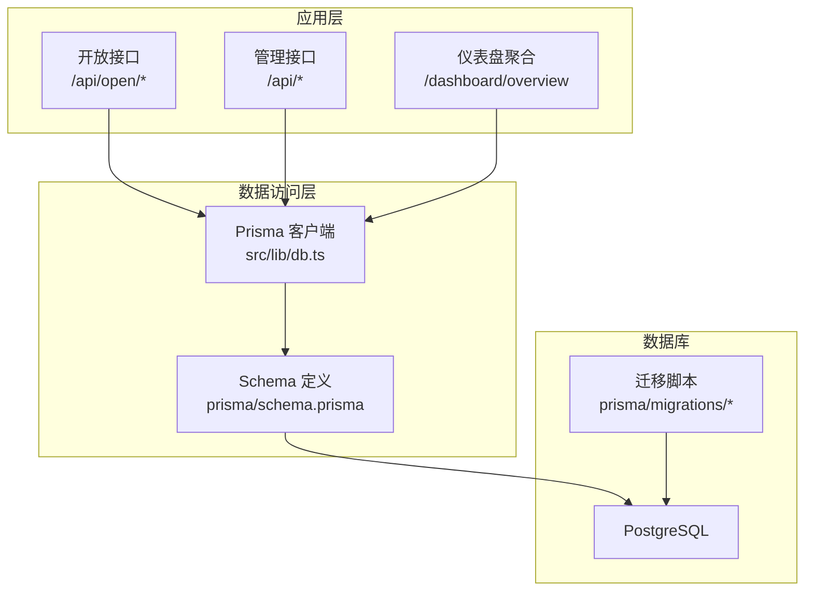
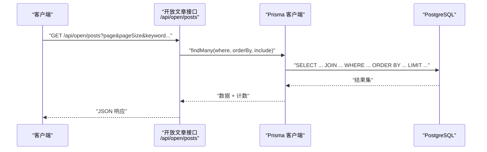
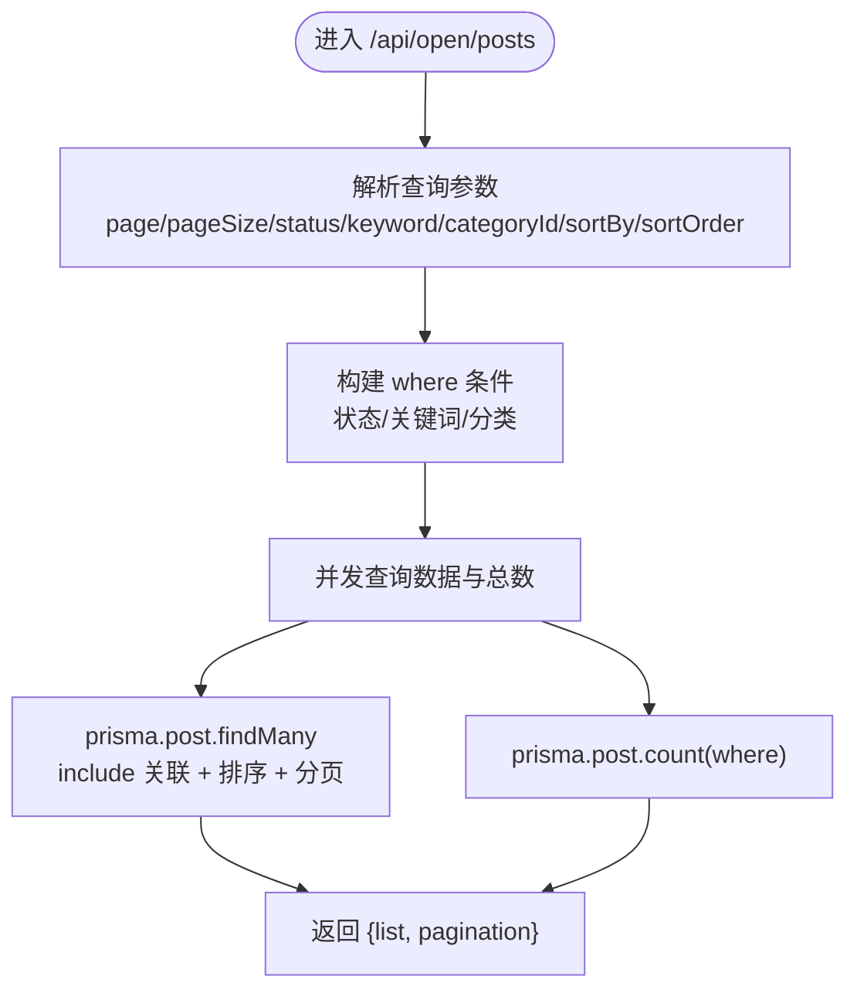
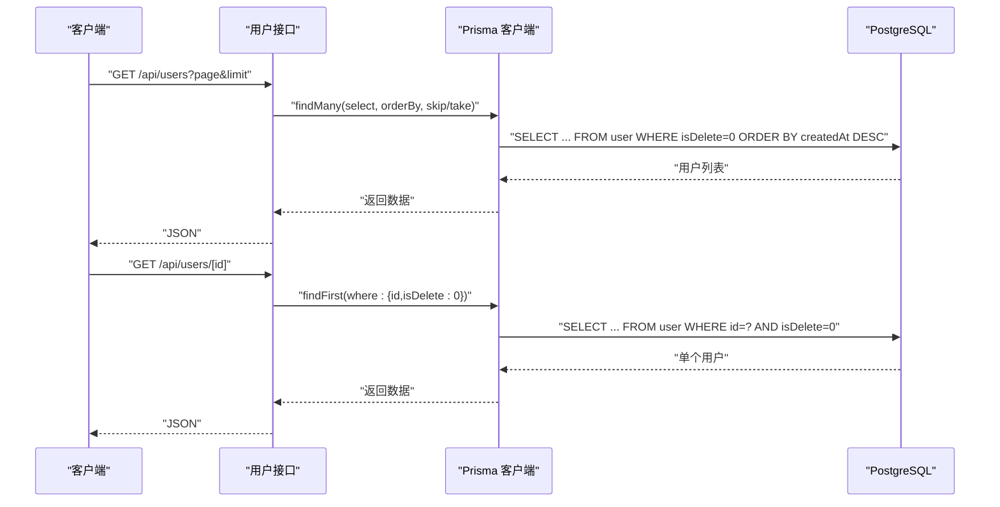
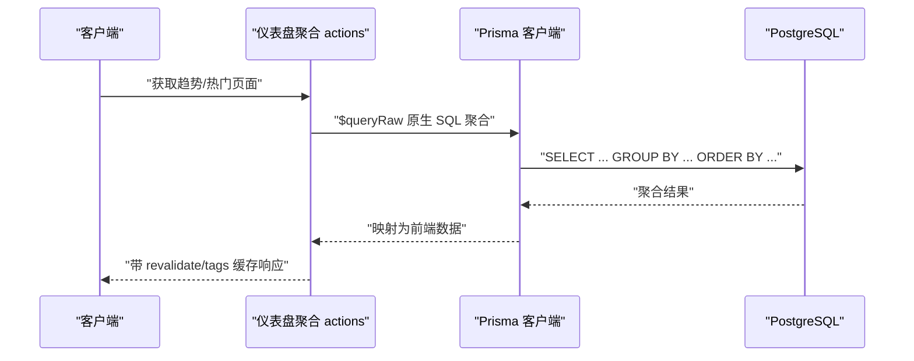
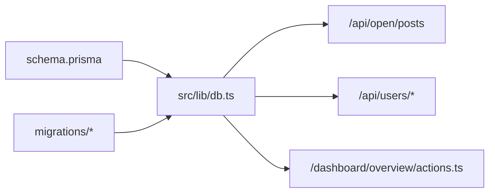

# 查询优化

<cite>
**本文引用的文件**
- [schema.prisma](file://prisma/schema.prisma)
- [db.ts](file://src/lib/db.ts)
- [actions.ts](file://src/app/dashboard/overview/actions.ts)
- [route.ts（用户列表）](file://src/app/api/users/route.ts)
- [route.ts（用户详情）](file://src/app/api/users/[id]/route.ts)
- [route.ts（开放文章列表）](file://src/app/api/open/posts/route.ts)
- [route.ts（分析事件追踪）](file://src/app/api/analytics/track/route.ts)
- [migration_20260122003154_add_miss_table/migration.sql](file://prisma/migrations/20260122003154_add_miss_table/migration.sql)
- [migration_20260122005608_add_site_visit/migration.sql](file://prisma/migrations/20260122005608_add_site_visit/migration.sql)
- [migration_20260201111652_fix_timezone/migration.sql](file://prisma/migrations/20260201111652_fix_timezone/migration.sql)
- [migration_20260202122338_add_email_log_table/migration.sql](file://prisma/migrations/20260202122338_add_email_log_table/migration.sql)
- [migration_lock.toml](file://prisma/migrations/migration_lock.toml)
- [set-db-timezone.ts](file://scripts/set-db-timezone.ts)
- [test-prisma-standard.ts](file://scripts/test-prisma-standard.ts)
</cite>

## 目录
1. [简介](#简介)
2. [项目结构](#项目结构)
3. [核心组件](#核心组件)
4. [架构总览](#架构总览)
5. [详细组件分析](#详细组件分析)
6. [依赖分析](#依赖分析)
7. [性能考量](#性能考量)
8. [故障排查指南](#故障排查指南)
9. [结论](#结论)
10. [附录](#附录)

## 简介
本文件面向“一梦五千年”项目的数据库查询优化，系统性梳理现有查询模式与潜在瓶颈，提出索引设计原则、复合索引使用场景、查询计划分析方法、Prisma 查询优化技巧（关系预加载、N+1 解决方案、批量操作）、PostgreSQL 特定优化技术（分区表、物化视图、查询重写），以及慢查询监控、执行计划分析、性能指标采集、缓存策略、读写分离与连接池优化、大数据量分页/全文搜索/聚合查询等方案。

## 项目结构
项目采用 Next.js App Router 架构，数据库访问通过 Prisma 客户端进行。查询主要分布在以下位置：
- 数据模型定义：Prisma Schema
- 数据库连接与客户端：src/lib/db.ts
- 前台开放接口：src/app/api/open/*
- 后台管理接口：src/app/api/*（含用户、文章、分析等）
- 仪表盘聚合查询：src/app/dashboard/overview/actions.ts
- 脚本与迁移：scripts/*、prisma/migrations/*

图表来源
- [db.ts](file://src/lib/db.ts)
- [schema.prisma](file://prisma/schema.prisma)
- [route.ts（开放文章列表）](file://src/app/api/open/posts/route.ts)
- [route.ts（用户列表）](file://src/app/api/users/route.ts)
- [route.ts（用户详情）](file://src/app/api/users/[id]/route.ts)
- [actions.ts](file://src/app/dashboard/overview/actions.ts)

章节来源
- [db.ts](file://src/lib/db.ts)
- [schema.prisma](file://prisma/schema.prisma)

## 核心组件
- 数据模型与索引：通过 Prisma Schema 定义实体关系与索引策略，迁移脚本体现历史演进与变更。
- 查询入口：
  - 开放文章列表：支持关键词搜索、分类过滤、状态过滤、排序与分页，包含并发查询与关系预加载。
  - 用户列表与详情：基础分页与单条查询。
  - 仪表盘趋势与热门页面：使用原生 SQL 聚合统计，配合缓存与标签。
- 执行计划与缓存：
  - 使用 Prisma 原生查询与缓存机制（如 React 的 unstable_cache）提升聚合查询性能。
  - 通过 revalidate 与 tags 实现增量缓存失效。

章节来源
- [route.ts（开放文章列表）](file://src/app/api/open/posts/route.ts)
- [route.ts（用户列表）](file://src/app/api/users/route.ts)
- [route.ts（用户详情）](file://src/app/api/users/[id]/route.ts)
- [actions.ts](file://src/app/dashboard/overview/actions.ts)

## 架构总览
下图展示从请求到数据库的关键路径与优化点：

图表来源
- [route.ts（开放文章列表）](file://src/app/api/open/posts/route.ts)
- [db.ts](file://src/lib/db.ts)

## 详细组件分析

### 组件A：开放文章列表查询
该接口是典型的复杂查询场景，包含多条件过滤、全文检索、排序与分页，并对关联实体进行预加载以避免 N+1。

图表来源
- [route.ts（开放文章列表）](file://src/app/api/open/posts/route.ts)

优化要点
- 关系预加载：通过 include 预加载 category、user、评论计数，避免 N+1。
- 并发查询：findMany 与 count 并行执行，减少往返时间。
- 分页参数校验：限制最大页大小，防止超大 take 导致资源浪费。
- 全文检索：关键词使用 OR 组合 title/excerpt，建议在 PostgreSQL 中结合 GIN 索引或 TSVECTOR 提升性能。

章节来源
- [route.ts（开放文章列表）](file://src/app/api/open/posts/route.ts)

### 组件B：用户列表与详情查询
用户列表采用标准分页与选择字段投影；用户详情基于主键查询并过滤软删除标记。

图表来源
- [route.ts（用户列表）](file://src/app/api/users/route.ts)
- [route.ts（用户详情）](file://src/app/api/users/[id]/route.ts)

优化要点
- 字段选择：仅选择必要字段，降低序列化与传输开销。
- 主键查询：详情使用主键查找，避免全表扫描。
- 软删除：统一过滤 isDelete=0，建议在 where 上建立复合索引以加速过滤。

章节来源
- [route.ts（用户列表）](file://src/app/api/users/route.ts)
- [route.ts（用户详情）](file://src/app/api/users/[id]/route.ts)

### 组件C：仪表盘趋势与热门页面聚合
仪表盘使用原生 SQL 进行时间维度聚合与 Top 页面统计，并结合缓存与标签实现高效复用。

图表来源
- [actions.ts](file://src/app/dashboard/overview/actions.ts)
- [db.ts](file://src/lib/db.ts)

优化要点
- 原生 SQL：针对高频聚合场景，直接使用 SQL 可获得更可控的执行计划。
- 缓存策略：unstable_cache + tags + revalidate，实现按需失效与跨请求复用。
- 时间维度：GROUP BY 支持 day/week/month 等粒度，建议在 created_at 上建立索引或分区。

章节来源
- [actions.ts](file://src/app/dashboard/overview/actions.ts)

## 依赖分析
- Prisma Schema 与迁移：定义实体、关系与索引，迁移脚本记录了站点访问表、邮件日志表等新增与时区修复。
- 数据库连接：db.ts 提供 Prisma 客户端实例，供各路由与服务调用。
- 路由依赖：开放文章列表依赖 Prisma 的 findMany/count 并发执行；用户接口依赖 findMany/findFirst；仪表盘依赖 $queryRaw 与缓存。

图表来源
- [schema.prisma](file://prisma/schema.prisma)
- [db.ts](file://src/lib/db.ts)
- [route.ts（开放文章列表）](file://src/app/api/open/posts/route.ts)
- [route.ts（用户列表）](file://src/app/api/users/route.ts)
- [route.ts（用户详情）](file://src/app/api/users/[id]/route.ts)
- [actions.ts](file://src/app/dashboard/overview/actions.ts)

章节来源
- [schema.prisma](file://prisma/schema.prisma)
- [db.ts](file://src/lib/db.ts)
- [migration_lock.toml](file://prisma/migrations/migration_lock.toml)

## 性能考量

### 索引设计原则与复合索引场景
- 单列索引
  - 主键：自动具备，无需额外索引。
  - 软删除字段：isDelete 建议建立索引，加速过滤。
  - 时间字段：created_at 建议建立索引，支撑趋势与分页排序。
- 复合索引
  - 软删除 + 创建时间：isDelete + created_at，用于用户列表与通用筛选。
  - 文章状态 + 创建时间：status + createdAt，用于开放文章列表默认排序。
  - 文章关键词组合：title + excerpt（TSVECTOR 或 Gin 索引）+ created_at，用于全文检索与排序。
  - 站点访问：page_url + created_at，支撑热门页面与趋势统计。
- 覆盖索引
  - 将常用查询涉及的字段纳入索引，避免回表，如用户列表的 select 字段集合。

章节来源
- [route.ts（用户列表）](file://src/app/api/users/route.ts)
- [route.ts（开放文章列表）](file://src/app/api/open/posts/route.ts)
- [actions.ts](file://src/app/dashboard/overview/actions.ts)

### Prisma 查询优化技巧
- 关系预加载（include）
  - 在开放文章列表中对 category、user、_count 进行预加载，避免 N+1。
- N+1 问题解决方案
  - 使用 include 或 select 精准投影字段，避免一次性加载所有关联。
  - 对于高基数关联，考虑使用原生 SQL 或游标分页。
- 批量操作优化
  - 使用事务包裹批量更新/插入，减少网络往返。
  - 合理设置 batch size，避免单次事务过大导致锁竞争。
- 查询计划分析
  - 使用 EXPLAIN/EXPLAIN ANALYZE 分析关键查询，关注索引使用、排序与聚合成本。
  - 结合慢查询日志定位热点 SQL。

章节来源
- [route.ts（开放文章列表）](file://src/app/api/open/posts/route.ts)

### PostgreSQL 特定优化技术
- 分区表
  - 按时间分区（如按月/季度）站点访问表与日志表，提升扫描效率与维护性。
- 物化视图
  - 将热门页面与趋势统计结果物化，定期刷新，降低实时查询压力。
- 查询重写
  - 将高频聚合 SQL 抽象为视图或函数，统一访问路径。
- 全文搜索
  - 使用 TSVECTOR + GIN 索引，结合 rank 排序，提升关键词检索性能。
- 时区处理
  - 统一存储 UTC，查询时转换，避免重复计算与不一致。

章节来源
- [migration_20260201111652_fix_timezone/migration.sql](file://prisma/migrations/20260201111652_fix_timezone/migration.sql)

### 慢查询监控、执行计划分析与性能指标
- 慢查询监控
  - 启用 pg_stat_statements，记录慢查询与执行次数。
  - 结合 APM 工具（如 New Relic、DataDog）捕获 SQL 耗时与错误率。
- 执行计划分析
  - 对关键查询运行 EXPLAIN ANALYZE，识别全表扫描、未使用索引、昂贵排序/聚合。
- 性能指标
  - QPS、P95/P99 延迟、连接数、缓存命中率、索引扫描比例。

章节来源
- [route.ts（开放文章列表）](file://src/app/api/open/posts/route.ts)
- [actions.ts](file://src/app/dashboard/overview/actions.ts)

### 缓存策略设计
- 应用层缓存
  - 使用 React 的 unstable_cache 或 LRU 缓存，结合 tags/revalidate 实现失效。
- 数据层缓存
  - 对热点聚合结果使用物化视图或 Redis 缓存，设置 TTL。
- 增量缓存
  - 基于标签（tag）与重新验证（revalidate）策略，确保数据一致性。

章节来源
- [actions.ts](file://src/app/dashboard/overview/actions.ts)

### 读写分离与连接池优化
- 读写分离
  - 写库承担 INSERT/UPDATE/DELETE；读库承担 SELECT（仪表盘、开放接口）。
  - 使用只读副本或逻辑复制，保证最终一致性。
- 连接池
  - 设置最小/最大连接数、空闲超时、查询超时。
  - 针对长事务与批处理设置专用连接池。

章节来源
- [db.ts](file://src/lib/db.ts)

### 大数据量场景下的分页、全文搜索与聚合优化
- 分页
  - 基于游标分页（cursor-based pagination）替代 OFFSET/LIMIT，避免深度分页的性能退化。
  - 对排序字段建立复合索引，确保稳定排序。
- 全文搜索
  - 使用 PostgreSQL 全文检索（TSVECTOR/TSQUERY）+ GIN 索引，结合 rank 排序。
- 聚合查询
  - 使用物化视图或定时任务生成预聚合结果，降低在线查询成本。
  - 对时间维度聚合使用分区表，缩小扫描范围。

章节来源
- [route.ts（开放文章列表）](file://src/app/api/open/posts/route.ts)
- [actions.ts](file://src/app/dashboard/overview/actions.ts)

## 故障排查指南
- 常见问题
  - N+1 查询：检查是否遗漏 include/select，确认关联字段是否被懒加载。
  - 分页性能差：确认排序字段有索引，避免 OFFSET 过大。
  - 聚合慢：检查是否使用覆盖索引，是否需要物化视图或分区。
- 排查步骤
  - 使用 EXPLAIN/EXPLAIN ANALYZE 分析 SQL。
  - 查看慢查询日志与 APM 指标。
  - 验证索引是否被正确使用。
- 快速修复
  - 为高频过滤/排序字段添加索引。
  - 将热点聚合迁移到物化视图或缓存。
  - 采用游标分页替换 OFFSET/LIMIT。

章节来源
- [route.ts（开放文章列表）](file://src/app/api/open/posts/route.ts)
- [route.ts（用户列表）](file://src/app/api/users/route.ts)
- [route.ts（用户详情）](file://src/app/api/users/[id]/route.ts)
- [actions.ts](file://src/app/dashboard/overview/actions.ts)

## 结论
通过对“一梦五千年”项目现有查询路径的梳理，建议优先完善索引体系（特别是复合索引与覆盖索引）、强化关系预加载与并发查询、引入缓存与物化视图、采用分区表与全文检索优化，并结合慢查询监控与执行计划分析持续迭代。上述措施可显著降低查询延迟、提升吞吐与稳定性。

## 附录

### 数据模型与迁移概览
- 站点访问表：用于趋势与热门页面统计。
- 邮件日志表：用于通知与审计。
- 时区修复：统一时间存储格式，便于后续分析。

章节来源
- [schema.prisma](file://prisma/schema.prisma)
- [migration_20260122003154_add_miss_table/migration.sql](file://prisma/migrations/20260122003154_add_miss_table/migration.sql)
- [migration_20260122005608_add_site_visit/migration.sql](file://prisma/migrations/20260122005608_add_site_visit/migration.sql)
- [migration_20260201111652_fix_timezone/migration.sql](file://prisma/migrations/20260201111652_fix_timezone/migration.sql)
- [migration_20260202122338_add_email_log_table/migration.sql](file://prisma/migrations/20260202122338_add_email_log_table/migration.sql)

### 测试与运维脚本
- 数据库时区设置：scripts/set-db-timezone.ts
- Prisma 标准测试：scripts/test-prisma-standard.ts
- 分析事件追踪：src/app/api/analytics/track/route.ts

章节来源
- [set-db-timezone.ts](file://scripts/set-db-timezone.ts)
- [test-prisma-standard.ts](file://scripts/test-prisma-standard.ts)
- [route.ts（分析事件追踪）](file://src/app/api/analytics/track/route.ts)