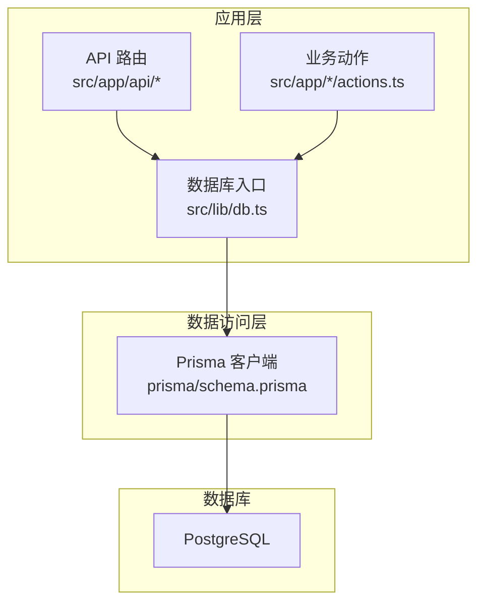
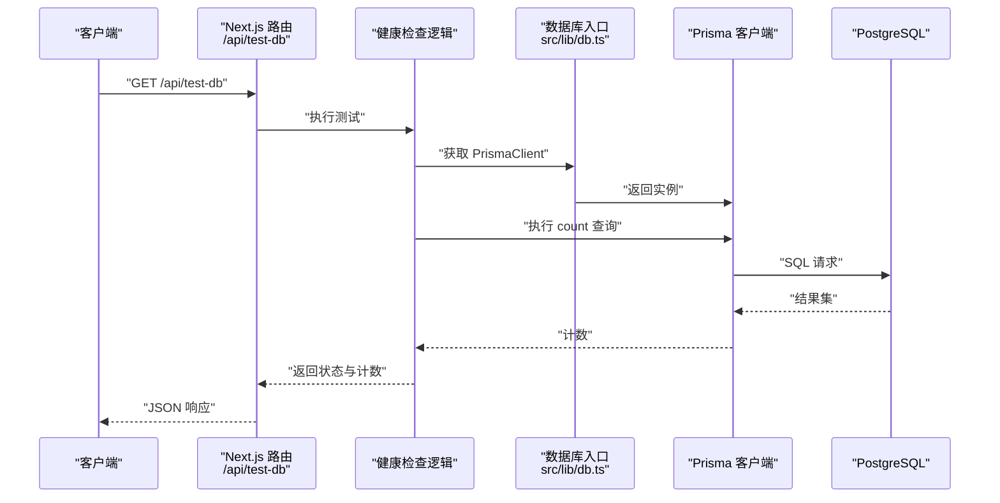
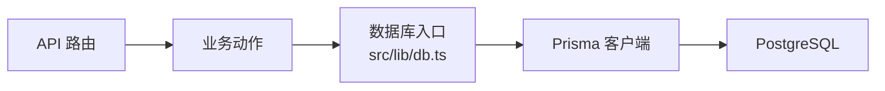

# 监控与维护

<cite>
**本文引用的文件**
- [prisma/schema.prisma](file://prisma/schema.prisma)
- [scripts/set-db-timezone.ts](file://scripts/set-db-timezone.ts)
- [scripts/test-prisma-standard.ts](file://scripts/test-prisma-standard.ts)
- [src/app/api/test-db/route.ts](file://src/app/api/test-db/route.ts)
- [src/lib/db.ts](file://src/lib/db.ts)
- [src/app/(site)/ai-platform/actions.ts](file://src/app/(site)/ai-platform/actions.ts)
- [src/app/(site)/friends/actions.ts](file://src/app/(site)/friends/actions.ts)
- [src/app/(site)/graph/actions.ts](file://src/app/(site)/graph/actions.ts)
- [src/app/(site)/tools/actions.ts](file://src/app/(site)/tools/actions.ts)
- [src/app/api/users/[id]/route.ts](file://src/app/api/users/[id]/route.ts)
- [src/data/commands.json](file://src/data/commands.json)
</cite>

## 目录
1. [简介](#简介)
2. [项目结构](#项目结构)
3. [核心组件](#核心组件)
4. [架构总览](#架构总览)
5. [详细组件分析](#详细组件分析)
6. [依赖关系分析](#依赖关系分析)
7. [性能考量](#性能考量)
8. [故障排查指南](#故障排查指南)
9. [结论](#结论)
10. [附录](#附录)

## 简介
本文件面向“一梦五千年”项目的数据库监控与维护，结合现有代码库中的数据库配置、连接与访问模式，给出可落地的监控指标定义、健康检查机制、自动告警策略、定期维护任务、备份与恢复、扩容与高可用、运维自动化与最佳实践。由于当前仓库未包含数据库监控与运维脚本，本文在不虚构实现的前提下，基于现有 Prisma 配置与访问模式，提出可直接对接的监控与维护方案。

## 项目结构
项目采用 Next.js 应用，数据库访问通过 Prisma 客户端统一管理。数据库为 PostgreSQL，连接方式通过环境变量配置，迁移与直连分别使用不同端口。应用层通过 API 路由与业务动作文件访问数据库。

图表来源
- [prisma/schema.prisma:1-14](file://prisma/schema.prisma#L1-L14)
- [src/lib/db.ts](file://src/lib/db.ts)
- [src/app/api/test-db/route.ts:1-14](file://src/app/api/test-db/route.ts#L1-L14)

章节来源
- [prisma/schema.prisma:1-14](file://prisma/schema.prisma#L1-L14)
- [src/lib/db.ts](file://src/lib/db.ts)

## 核心组件
- 数据库配置与连接
  - 数据源配置使用 PostgreSQL，运行时通过 DATABASE_URL 连接池访问，迁移时通过 DIRECT_URL 直连。
  - 关系模式使用 Prisma 的 relationMode。
- 数据库入口
  - 应用通过 src/lib/db.ts 统一导出 PrismaClient 实例，供各模块复用。
- 健康检查接口
  - 提供 /api/test-db 路由进行数据库连通性与基础查询测试。
- 访问模式
  - 业务动作文件（如 AI 平台、朋友链接、图谱、工具等）均通过导入的 prisma 实例执行 CRUD 操作。
- 时间区域设置
  - 提供脚本设置数据库时区，确保日志与时间字段一致。

章节来源
- [prisma/schema.prisma:1-14](file://prisma/schema.prisma#L1-L14)
- [src/lib/db.ts](file://src/lib/db.ts)
- [src/app/api/test-db/route.ts:1-14](file://src/app/api/test-db/route.ts#L1-L14)
- [scripts/set-db-timezone.ts:1-25](file://scripts/set-db-timezone.ts#L1-L25)
- [src/app/(site)/ai-platform/actions.ts:1-60](file://src/app/(site)/ai-platform/actions.ts#L1-L60)
- [src/app/(site)/friends/actions.ts:1-40](file://src/app/(site)/friends/actions.ts#L1-L40)
- [src/app/(site)/graph/actions.ts:1-120](file://src/app/(site)/graph/actions.ts#L1-L120)
- [src/app/(site)/tools/actions.ts:1-40](file://src/app/(site)/tools/actions.ts#L1-L40)

## 架构总览
下图展示从 API 到数据库的调用链路，以及健康检查与连接池的关系。

图表来源
- [src/app/api/test-db/route.ts:1-14](file://src/app/api/test-db/route.ts#L1-L14)
- [src/lib/db.ts](file://src/lib/db.ts)
- [prisma/schema.prisma:1-14](file://prisma/schema.prisma#L1-L14)

## 详细组件分析

### 数据库配置与连接
- 数据源与连接
  - 使用 PostgreSQL，运行时通过 DATABASE_URL 连接池访问，迁移通过 DIRECT_URL 直连。
  - 关系模式为 prisma。
- 连接池与并发
  - 连接池参数应在运行环境配置（例如通过 DATABASE_URL 的查询参数），以支持并发与超时控制。
- 时区一致性
  - 通过脚本设置数据库全局时区，避免时间字段差异导致的日志与统计偏差。

章节来源
- [prisma/schema.prisma:1-14](file://prisma/schema.prisma#L1-L14)
- [scripts/set-db-timezone.ts:1-25](file://scripts/set-db-timezone.ts#L1-L25)

### 健康检查与自动告警
- 健康检查接口
  - /api/test-db 通过最小化查询（如 count）验证数据库连通性与基本可用性，并记录日志便于监控采集。
- 自动告警建议
  - 响应码：5xx 表示服务端错误；200 但计数异常（如 0 或过低）需触发告警。
  - 响应时间：超过阈值（如 5 秒）触发告警。
  - 日志：将错误堆栈与上下文记录到统一日志平台，便于检索与聚合。
- 告警通道
  - 推荐对接企业微信、钉钉或邮件通知，设置分级阈值与静默窗口。

章节来源
- [src/app/api/test-db/route.ts:1-14](file://src/app/api/test-db/route.ts#L1-L14)

### 查询访问模式与性能基线
- 典型访问路径
  - API 路由 -> 业务动作 -> Prisma -> PostgreSQL。
- 性能基线建议
  - 建议对高频查询建立索引（如用户表的 username/email 唯一索引、软删标记索引等）。
  - 对复杂联表查询使用 Prisma 的 relationJoins 预览特性减少往返。
- 锁与事务
  - 对热点资源的更新建议使用乐观锁或短事务，避免长事务阻塞。

章节来源
- [src/app/api/users/[id]/route.ts:1-51](file://src/app/api/users/[id]/route.ts#L1-L51)
- [src/app/(site)/ai-platform/actions.ts:1-60](file://src/app/(site)/ai-platform/actions.ts#L1-L60)
- [src/app/(site)/friends/actions.ts:1-40](file://src/app/(site)/friends/actions.ts#L1-L40)
- [src/app/(site)/graph/actions.ts:1-120](file://src/app/(site)/graph/actions.ts#L1-L120)
- [src/app/(site)/tools/actions.ts:1-40](file://src/app/(site)/tools/actions.ts#L1-L40)
- [prisma/schema.prisma:1-14](file://prisma/schema.prisma#L1-L14)

### 监控指标定义与采集
- 查询响应时间
  - 在路由层包装请求处理，记录开始时间与结束时间，计算耗时并上报。
- 连接数
  - 通过数据库连接池统计（如通过连接池库提供的指标）或数据库视图（如 pg_stat_activity）。
- 锁等待
  - 通过数据库锁等待视图（如 pg_locks、pg_stat_activity）采集锁等待事件。
- 缓冲区命中率
  - 通过数据库缓存命中率视图（如 pg_backend_results 或扩展）采集。

章节来源
- [src/app/api/test-db/route.ts:1-14](file://src/app/api/test-db/route.ts#L1-L14)
- [prisma/schema.prisma:1-14](file://prisma/schema.prisma#L1-L14)

### 定期维护任务
- 索引重建
  - 基于查询分析与索引使用率，定期重建碎片化严重或选择性差的索引。
- 统计信息更新
  - 定期更新表与索引统计信息，确保查询优化器做出正确决策。
- 碎片整理
  - 对大表进行 VACUUM/ANALYZE 或在线重写（VACUUM FULL）评估，避免长时间锁表。
- 版本迁移与兼容性
  - 使用 Prisma 迁移管理版本演进，先在预生产验证，再灰度发布。

章节来源
- [prisma/schema.prisma:1-14](file://prisma/schema.prisma#L1-L14)

### 备份策略与恢复测试
- 全量备份
  - 使用数据库原生命令生成全量快照，保留多个周期以便回滚。
- 增量备份
  - 结合 WAL 归档，实现近实时增量保护。
- 恢复测试
  - 定期在隔离环境中进行恢复演练，验证备份完整性与恢复时间目标（RTO/RPO）。

章节来源
- [prisma/schema.prisma:1-14](file://prisma/schema.prisma#L1-L14)

### 扩容方案、读写分离与高可用
- 扩容
  - 优先水平扩展：引入只读副本，分担查询压力；垂直扩展：提升 CPU/内存与 IOPS。
- 读写分离
  - 写操作走主库；读操作走只读副本；热点读通过缓存层（如 Redis）进一步分流。
- 高可用
  - 数据库集群（主从/多主）、自动故障转移与健康检查联动。

章节来源
- [prisma/schema.prisma:1-14](file://prisma/schema.prisma#L1-L14)

### 运维自动化与监控仪表板
- 自动化脚本
  - 健康检查脚本：定时调用 /api/test-db 并上报指标。
  - 维护脚本：索引重建、统计更新、碎片整理批处理。
  - 备份脚本：全量与增量备份调度，校验与归档。
- 监控仪表板
  - 展示关键指标趋势：响应时间、连接数、锁等待、命中率、备份状态。
  - 告警面板：按级别与服务维度聚合告警。

章节来源
- [src/app/api/test-db/route.ts:1-14](file://src/app/api/test-db/route.ts#L1-L14)
- [src/data/commands.json:141-182](file://src/data/commands.json#L141-L182)

### 版本升级、兼容性测试与迁移风险控制
- 升级流程
  - 预生产验证：新版本数据库与驱动、Prisma 版本兼容性测试。
  - 渐进式发布：灰度流量切换，观察指标与日志。
- 风险控制
  - 回滚预案：保留上一个稳定版本的备份与迁移脚本。
  - 降级开关：在网关或应用层增加临时降级开关，快速止损。

章节来源
- [prisma/schema.prisma:1-14](file://prisma/schema.prisma#L1-L14)

## 依赖关系分析
- 组件耦合
  - API 路由与业务动作均依赖 src/lib/db.ts 导出的 PrismaClient 实例，形成集中式入口，降低分散连接带来的资源浪费。
- 外部依赖
  - PostgreSQL 提供数据持久化；Prisma 提供 ORM 与迁移能力；Next.js 提供路由与中间件生态。
- 潜在风险
  - 连接池耗尽、慢查询、锁竞争可能引发级联故障；需通过监控与限流缓解。

图表来源
- [src/lib/db.ts](file://src/lib/db.ts)
- [prisma/schema.prisma:1-14](file://prisma/schema.prisma#L1-L14)

章节来源
- [src/lib/db.ts](file://src/lib/db.ts)
- [prisma/schema.prisma:1-14](file://prisma/schema.prisma#L1-L14)

## 性能考量
- 连接池与并发
  - 合理设置最大连接数与空闲超时，避免连接泄漏与抖动。
- 查询优化
  - 使用索引覆盖常见过滤条件；避免 N+1 查询；利用 relationJoins 减少往返。
- 缓存与异步
  - 对热点读取引入缓存；对非关键写入使用消息队列异步化。
- 监控与压测
  - 定期进行容量规划与压力测试，识别瓶颈并迭代优化。

章节来源
- [prisma/schema.prisma:1-14](file://prisma/schema.prisma#L1-L14)
- [src/app/(site)/ai-platform/actions.ts:1-60](file://src/app/(site)/ai-platform/actions.ts#L1-L60)
- [src/app/(site)/friends/actions.ts:1-40](file://src/app/(site)/friends/actions.ts#L1-L40)
- [src/app/(site)/graph/actions.ts:1-120](file://src/app/(site)/graph/actions.ts#L1-L120)
- [src/app/(site)/tools/actions.ts:1-40](file://src/app/(site)/tools/actions.ts#L1-L40)

## 故障排查指南
- 健康检查失败
  - 检查 /api/test-db 返回状态与错误日志；确认 DATABASE_URL/DIRECT_URL 配置是否正确。
- 连接异常
  - 查看连接池上限与活跃连接数；核对数据库负载与慢查询日志。
- 锁等待与死锁
  - 通过数据库锁视图定位持锁事务；缩短事务时长，避免跨表长事务。
- 时间字段异常
  - 使用 set-db-timezone.ts 脚本统一时区，避免跨时区导致的时间错乱。

章节来源
- [src/app/api/test-db/route.ts:1-14](file://src/app/api/test-db/route.ts#L1-L14)
- [scripts/set-db-timezone.ts:1-25](file://scripts/set-db-timezone.ts#L1-L25)

## 结论
本项目已具备统一的数据库入口与健康检查能力。建议在此基础上补充监控指标采集、自动告警与定期维护脚本，完善备份与恢复演练，逐步引入读写分离与高可用架构，最终形成闭环的数据库运维体系。

## 附录
- 常用系统命令参考（可用于数据库所在主机的系统层面监控）
  - 进程与资源：top、ps、htop
  - 磁盘与文件系统：df、du
  - 网络与端口：netstat、ss、lsof
  - 日志与追踪：tail -f、journalctl

章节来源
- [src/data/commands.json:141-182](file://src/data/commands.json#L141-L182)