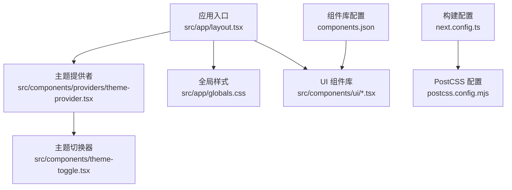
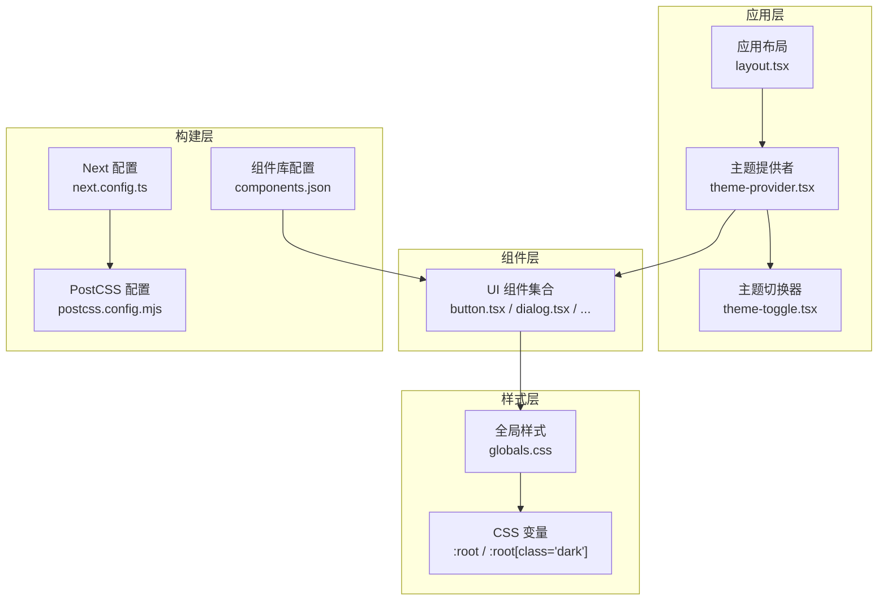
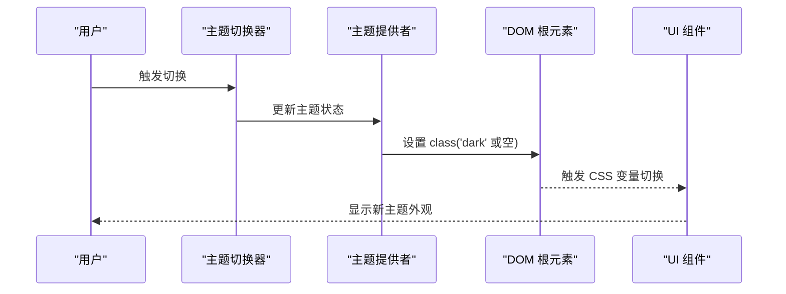
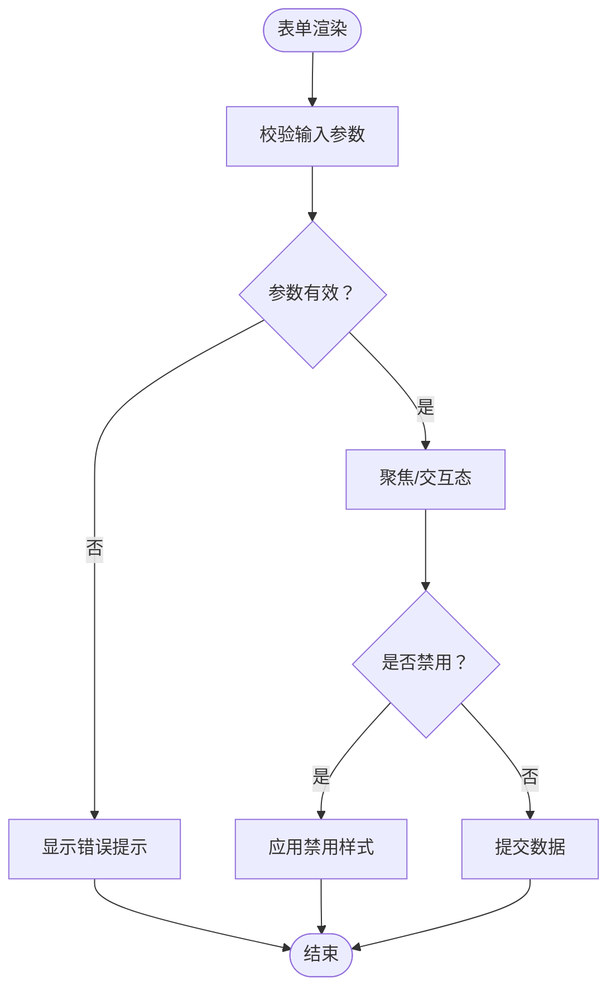
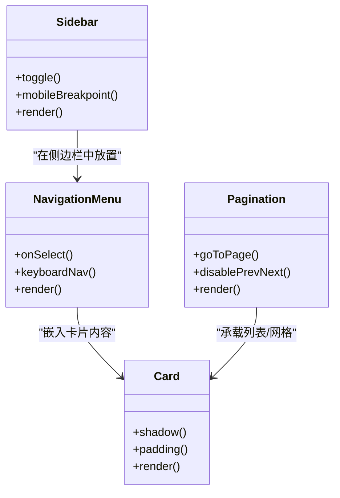
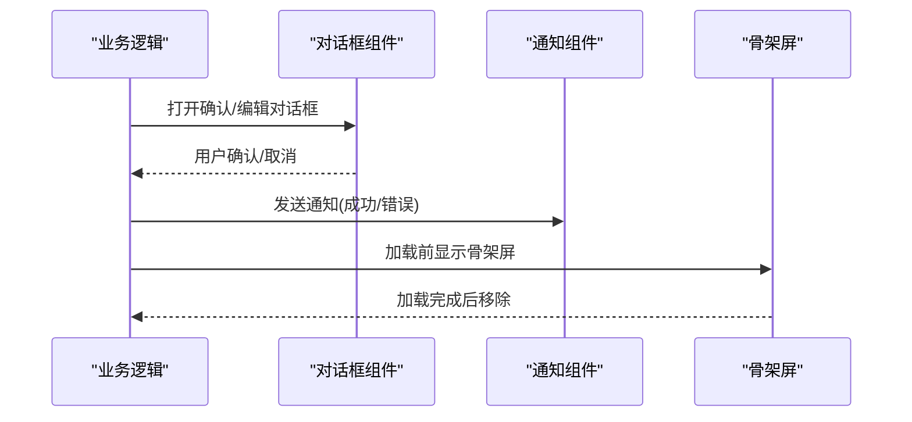
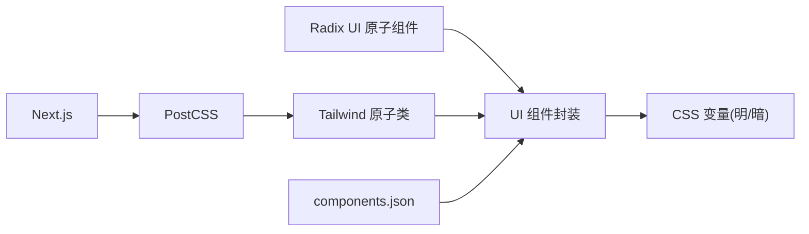

# UI设计系统

<cite>
**本文档引用的文件**
- [package.json](file://package.json)
- [components.json](file://components.json)
- [next.config.ts](file://next.config.ts)
- [postcss.config.mjs](file://postcss.config.mjs)
- [src/app/layout.tsx](file://src/app/layout.tsx)
- [src/components/providers/theme-provider.tsx](file://src/components/providers/theme-provider.tsx)
- [src/components/theme-toggle.tsx](file://src/components/theme-toggle.tsx)
- [src/app/globals.css](file://src/app/globals.css)
- [src/components/ui/button.tsx](file://src/components/ui/button.tsx)
- [src/components/ui/dialog.tsx](file://src/components/ui/dialog.tsx)
- [src/components/ui/form.tsx](file://src/components/ui/form.tsx)
- [src/components/ui/input.tsx](file://src/components/ui/input.tsx)
- [src/components/ui/select.tsx](file://src/components/ui/select.tsx)
- [src/components/ui/table.tsx](file://src/components/ui/table.tsx)
- [src/components/ui/card.tsx](file://src/components/ui/card.tsx)
- [src/components/ui/alert-dialog.tsx](file://src/components/ui/alert-dialog.tsx)
- [src/components/ui/avatar.tsx](file://src/components/ui/avatar.tsx)
- [src/components/ui/badge.tsx](file://src/components/ui/badge.tsx)
- [src/components/ui/carousel.tsx](file://src/components/ui/carousel.tsx)
- [src/components/ui/collapsible.tsx](file://src/components/ui/collapsible.tsx)
- [src/components/ui/dropdown-menu.tsx](file://src/components/ui/dropdown-menu.tsx)
- [src/components/ui/image-upload.tsx](file://src/components/ui/image-upload.tsx)
- [src/components/ui/label.tsx](file://src/components/ui/label.tsx)
- [src/components/ui/navigation-menu.tsx](file://src/components/ui/navigation-menu.tsx)
- [src/components/ui/pagination.tsx](file://src/components/ui/pagination.tsx)
- [src/components/ui/scroll-area.tsx](file://src/components/ui/scroll-area.tsx)
- [src/components/ui/separator.tsx](file://src/components/ui/separator.tsx)
- [src/components/ui/sheet.tsx](file://src/components/ui/sheet.tsx)
- [src/components/ui/sidebar.tsx](file://src/components/ui/sidebar.tsx)
- [src/components/ui/skeleton.tsx](file://src/components/ui/skeleton.tsx)
- [src/components/ui/slider.tsx](file://src/components/ui/slider.tsx)
- [src/components/ui/sonner.tsx](file://src/components/ui/sonner.tsx)
- [src/components/ui/switch.tsx](file://src/components/ui/switch.tsx)
- [src/components/ui/tabs.tsx](file://src/components/ui/tabs.tsx)
- [src/components/ui/textarea.tsx](file://src/components/ui/textarea.tsx)
- [src/components/ui/tooltip.tsx](file://src/components/ui/tooltip.tsx)
- [src/hooks/use-mobile.ts](file://src/hooks/use-mobile.ts)
- [src/middleware.ts](file://src/middleware.ts)
</cite>

## 目录
1. [引言](#引言)
2. [项目结构](#项目结构)
3. [核心组件](#核心组件)
4. [架构总览](#架构总览)
5. [详细组件分析](#详细组件分析)
6. [依赖关系分析](#依赖关系分析)
7. [性能考量](#性能考量)
8. [故障排除指南](#故障排除指南)
9. [结论](#结论)
10. [附录](#附录)

## 引言
本文件为“一梦五千年”项目的UI设计系统文档，聚焦于基于 Radix UI 的组件库集成与定制化扩展，系统性阐述组件设计原则、样式系统与主题配置；解释 Tailwind CSS 使用模式、CSS 变量管理与响应式设计实现；说明主题切换机制、暗色模式支持与可访问性设计；描述组件样式规范、动画与过渡处理；并提供设计令牌管理、组件测试策略与视觉一致性保障方案。

## 项目结构
项目采用 Next.js 应用程序路由结构，UI 组件集中于 src/components/ui 下，按功能模块拆分；全局样式位于 src/app/globals.css；主题提供者与切换器位于 src/components/providers 与 src/components 下；构建配置由 next.config.ts 与 postcss.config.mjs 管理；组件库配置通过 components.json 指定。

**图表来源**
- [src/app/layout.tsx](file://src/app/layout.tsx)
- [src/components/providers/theme-provider.tsx](file://src/components/providers/theme-provider.tsx)
- [src/components/theme-toggle.tsx](file://src/components/theme-toggle.tsx)
- [src/app/globals.css](file://src/app/globals.css)
- [src/components/ui/button.tsx](file://src/components/ui/button.tsx)
- [next.config.ts](file://next.config.ts)
- [postcss.config.mjs](file://postcss.config.mjs)
- [components.json](file://components.json)

**章节来源**
- [src/app/layout.tsx](file://src/app/layout.tsx)
- [src/components/providers/theme-provider.tsx](file://src/components/providers/theme-provider.tsx)
- [src/components/theme-toggle.tsx](file://src/components/theme-toggle.tsx)
- [src/app/globals.css](file://src/app/globals.css)
- [src/components/ui/button.tsx](file://src/components/ui/button.tsx)
- [next.config.ts](file://next.config.ts)
- [postcss.config.mjs](file://postcss.config.mjs)
- [components.json](file://components.json)

## 核心组件
- 主题提供者：负责在客户端维护与传播主题状态（明/暗），并与系统偏好联动。
- 主题切换器：提供用户手动切换主题的交互入口。
- UI 组件库：基于 Radix UI 原子组件封装，统一风格与行为，覆盖表单、反馈、导航、布局等场景。
- 全局样式与变量：集中定义 CSS 变量、基础排版与颜色体系，确保跨组件一致性。
- 构建与工具链：Next.js、Tailwind、PostCSS 插件链路，支撑原子类与变量注入。

**章节来源**
- [src/components/providers/theme-provider.tsx](file://src/components/providers/theme-provider.tsx)
- [src/components/theme-toggle.tsx](file://src/components/theme-toggle.tsx)
- [src/components/ui/button.tsx](file://src/components/ui/button.tsx)
- [src/app/globals.css](file://src/app/globals.css)
- [next.config.ts](file://next.config.ts)
- [postcss.config.mjs](file://postcss.config.mjs)

## 架构总览
下图展示主题与组件层的整体交互：应用布局加载主题提供者，主题切换器触发状态更新，UI 组件消费主题变量与类名，构建工具链将 Tailwind 原子类与 CSS 变量注入浏览器。

**图表来源**
- [src/app/layout.tsx](file://src/app/layout.tsx)
- [src/components/providers/theme-provider.tsx](file://src/components/providers/theme-provider.tsx)
- [src/components/theme-toggle.tsx](file://src/components/theme-toggle.tsx)
- [src/components/ui/button.tsx](file://src/components/ui/button.tsx)
- [src/app/globals.css](file://src/app/globals.css)
- [next.config.ts](file://next.config.ts)
- [postcss.config.mjs](file://postcss.config.mjs)
- [components.json](file://components.json)

## 详细组件分析

### 主题系统与暗色模式
- 状态管理：主题提供者在客户端维护当前主题，并与系统偏好同步；支持受控与非受控两种模式。
- 切换机制：主题切换器通过事件或状态变更触发展开/收起动画与主题切换；切换时更新根元素 class 以驱动 CSS 变量。
- CSS 变量：通过 :root 与 :root[class='dark'] 定义明/暗两套变量，UI 组件读取变量而非硬编码颜色。
- 动画与过渡：切换器与对话框、侧边栏等组件使用 Radix UI 的展开/折叠动效，配合 CSS 过渡实现平滑切换。

**图表来源**
- [src/components/theme-toggle.tsx](file://src/components/theme-toggle.tsx)
- [src/components/providers/theme-provider.tsx](file://src/components/providers/theme-provider.tsx)
- [src/app/globals.css](file://src/app/globals.css)
- [src/components/ui/dialog.tsx](file://src/components/ui/dialog.tsx)
- [src/components/ui/sidebar.tsx](file://src/components/ui/sidebar.tsx)

**章节来源**
- [src/components/providers/theme-provider.tsx](file://src/components/providers/theme-provider.tsx)
- [src/components/theme-toggle.tsx](file://src/components/theme-toggle.tsx)
- [src/app/globals.css](file://src/app/globals.css)

### 表单与输入组件
- 设计原则：保持一致的尺寸、间距与圆角；输入组件在聚焦、禁用、错误状态下提供明确视觉反馈。
- 封装策略：基于 Radix UI 的 Input、Label、Form 等原子组件，组合形成受控/非受控表单控件。
- 可访问性：自动关联 label 与 input；键盘可达；错误信息通过 aria-live 或 aria-describedby 提示。
- 示例组件：input.tsx、textarea.tsx、select.tsx、form.tsx、label.tsx、image-upload.tsx。

**图表来源**
- [src/components/ui/input.tsx](file://src/components/ui/input.tsx)
- [src/components/ui/textarea.tsx](file://src/components/ui/textarea.tsx)
- [src/components/ui/select.tsx](file://src/components/ui/select.tsx)
- [src/components/ui/form.tsx](file://src/components/ui/form.tsx)
- [src/components/ui/label.tsx](file://src/components/ui/label.tsx)
- [src/components/ui/image-upload.tsx](file://src/components/ui/image-upload.tsx)

**章节来源**
- [src/components/ui/input.tsx](file://src/components/ui/input.tsx)
- [src/components/ui/textarea.tsx](file://src/components/ui/textarea.tsx)
- [src/components/ui/select.tsx](file://src/components/ui/select.tsx)
- [src/components/ui/form.tsx](file://src/components/ui/form.tsx)
- [src/components/ui/label.tsx](file://src/components/ui/label.tsx)
- [src/components/ui/image-upload.tsx](file://src/components/ui/image-upload.tsx)

### 导航与布局组件
- 导航菜单：基于 Radix UI 的 NavigationMenu 实现多级菜单与下拉交互，支持键盘导航与无障碍标签。
- 侧边栏：支持展开/收起与移动端自适应，结合滚动区域与分隔线提升信息密度。
- 分页：提供页码跳转与禁用态，配合屏幕阅读器文本增强可访问性。
- 卡片与网格：统一卡片阴影与内边距，网格组件用于内容栅格化展示。

**图表来源**
- [src/components/ui/navigation-menu.tsx](file://src/components/ui/navigation-menu.tsx)
- [src/components/ui/sidebar.tsx](file://src/components/ui/sidebar.tsx)
- [src/components/ui/pagination.tsx](file://src/components/ui/pagination.tsx)
- [src/components/ui/card.tsx](file://src/components/ui/card.tsx)

**章节来源**
- [src/components/ui/navigation-menu.tsx](file://src/components/ui/navigation-menu.tsx)
- [src/components/ui/sidebar.tsx](file://src/components/ui/sidebar.tsx)
- [src/components/ui/pagination.tsx](file://src/components/ui/pagination.tsx)
- [src/components/ui/card.tsx](file://src/components/ui/card.tsx)

### 反馈与提示组件
- 对话框与抽屉：基于 Radix UI 的 Dialog/Sheet，支持模态遮罩、Esc 关闭、焦点陷阱与动画过渡。
- 轻提示：sonner.tsx 提供全局通知，支持成功/警告/错误等类型与持久化控制。
- 骨架屏：skeleton.tsx 在内容加载时提供占位，改善感知性能。
- 徽章与头像：badge.tsx 与 avatar.tsx 提供状态标识与用户头像展示，支持占位与加载失败回退。

**图表来源**
- [src/components/ui/dialog.tsx](file://src/components/ui/dialog.tsx)
- [src/components/ui/sheet.tsx](file://src/components/ui/sheet.tsx)
- [src/components/ui/sonner.tsx](file://src/components/ui/sonner.tsx)
- [src/components/ui/skeleton.tsx](file://src/components/ui/skeleton.tsx)
- [src/components/ui/badge.tsx](file://src/components/ui/badge.tsx)
- [src/components/ui/avatar.tsx](file://src/components/ui/avatar.tsx)

**章节来源**
- [src/components/ui/dialog.tsx](file://src/components/ui/dialog.tsx)
- [src/components/ui/sheet.tsx](file://src/components/ui/sheet.tsx)
- [src/components/ui/sonner.tsx](file://src/components/ui/sonner.tsx)
- [src/components/ui/skeleton.tsx](file://src/components/ui/skeleton.tsx)
- [src/components/ui/badge.tsx](file://src/components/ui/badge.tsx)
- [src/components/ui/avatar.tsx](file://src/components/ui/avatar.tsx)

### 数据表格与排序筛选
- 表格容器：table.tsx 提供基础表格结构与滚动区域，支持大数据集的虚拟化与分页。
- 排序与筛选：通过列头点击实现排序，筛选面板与搜索输入联动，支持多条件过滤。
- 可访问性：表格具备表头语义、行选中与键盘导航；对齐与对比度满足 WCAG 基础要求。

**章节来源**
- [src/components/ui/table.tsx](file://src/components/ui/table.tsx)

### 媒体与交互组件
- 走马灯：carousel.tsx 支持自动播放与手动切换，提供指示点与按钮。
- 折叠面板：collapsible.tsx 实现内容折叠/展开，适合 FAQ 与设置面板。
- 滑块与开关：slider.tsx 与 switch.tsx 提供连续与二元选择，支持键盘操作与无障碍标签。
- 工具提示：tooltip.tsx 在悬停/焦点时显示辅助信息，避免遮挡主内容。

**章节来源**
- [src/components/ui/carousel.tsx](file://src/components/ui/carousel.tsx)
- [src/components/ui/collapsible.tsx](file://src/components/ui/collapsible.tsx)
- [src/components/ui/slider.tsx](file://src/components/ui/slider.tsx)
- [src/components/ui/switch.tsx](file://src/components/ui/switch.tsx)
- [src/components/ui/tooltip.tsx](file://src/components/ui/tooltip.tsx)

## 依赖关系分析
- 组件库依赖：UI 组件依赖 Radix UI 原子组件与 Tailwind 原子类；通过 components.json 指定组件注册与别名。
- 构建链路：Next.js 负责页面与静态资源打包；PostCSS 处理 CSS 变量与原子类；Tailwind 生成类名。
- 主题耦合：UI 组件不直接写死颜色，而是读取 CSS 变量；主题提供者仅负责切换变量集。

**图表来源**
- [src/components/ui/button.tsx](file://src/components/ui/button.tsx)
- [postcss.config.mjs](file://postcss.config.mjs)
- [next.config.ts](file://next.config.ts)
- [components.json](file://components.json)

**章节来源**
- [src/components/ui/button.tsx](file://src/components/ui/button.tsx)
- [postcss.config.mjs](file://postcss.config.mjs)
- [next.config.ts](file://next.config.ts)
- [components.json](file://components.json)

## 性能考量
- 原子类优先：通过 Tailwind 原子类减少重复样式与体积膨胀。
- CSS 变量切换：主题切换仅变更变量集，避免重绘大范围 DOM。
- 惰性加载：图片与媒体组件采用懒加载与骨架屏，降低首屏阻塞。
- 动画优化：使用 transform/opacity 等 GPU 友好属性，避免强制同步布局。
- 构建优化：启用 PostCSS 与 Tailwind 的生产优化，压缩与摇树。

## 故障排除指南
- 主题不生效
  - 检查根元素 class 是否正确切换（明/暗）。
  - 确认 CSS 变量已在 :root 与 :root[class='dark'] 中定义。
  - 验证主题提供者是否包裹应用根布局。
- 动画异常
  - 确保 Radix UI 动画相关类名未被覆盖。
  - 检查 PostCSS/Tailwind 是否正确生成过渡类。
- 可访问性问题
  - 表单控件需有对应 label；错误信息可通过 aria-live 或 aria-describedby 提示。
  - 导航组件应支持键盘操作与焦点管理。
- 移动端适配
  - 使用断点工具类与自定义断点；必要时引入移动端专用组件逻辑。
  - 检查滚动区域与抽屉在小屏下的可用性。

**章节来源**
- [src/components/providers/theme-provider.tsx](file://src/components/providers/theme-provider.tsx)
- [src/app/globals.css](file://src/app/globals.css)
- [src/components/ui/dialog.tsx](file://src/components/ui/dialog.tsx)
- [src/components/ui/form.tsx](file://src/components/ui/form.tsx)
- [src/hooks/use-mobile.ts](file://src/hooks/use-mobile.ts)

## 结论
本设计系统以 Radix UI 为基础，结合 Tailwind 原子类与 CSS 变量，实现了高内聚、低耦合的组件库；通过主题提供者与切换器，统一了明/暗主题体验；在可访问性、响应式与动画层面提供了工程化实践。建议持续完善设计令牌与测试策略，以保障长期演进中的视觉一致性与质量稳定。

## 附录
- 设计令牌管理
  - 建议在 CSS 变量中集中管理尺寸、色彩、字体与阴影等令牌，并在组件中以变量形式引用。
  - 为每类令牌定义命名规范与层级关系，便于跨团队协作与版本演进。
- 组件测试策略
  - 单元测试：针对交互逻辑（如切换、提交、校验）编写测试用例。
  - 可视化测试：使用快照或图像比对验证主题切换与断点表现。
  - 可访问性测试：使用自动化工具（如 axe）与人工评审相结合。
- 视觉一致性保障
  - 建立组件使用清单与样式约束，避免绕过设计系统直接写样式。
  - 定期审查新增组件是否遵循统一的尺寸、间距与动效规范。