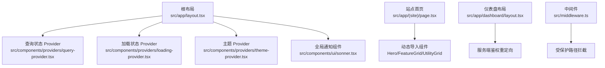
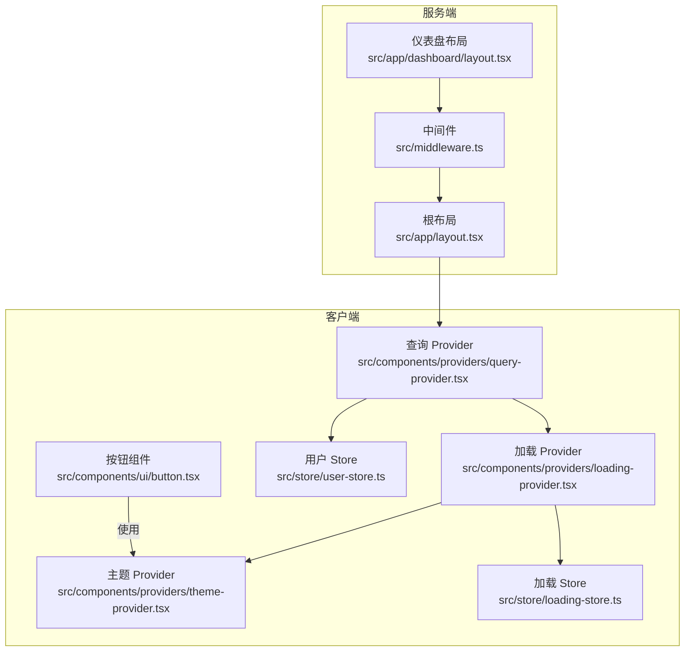
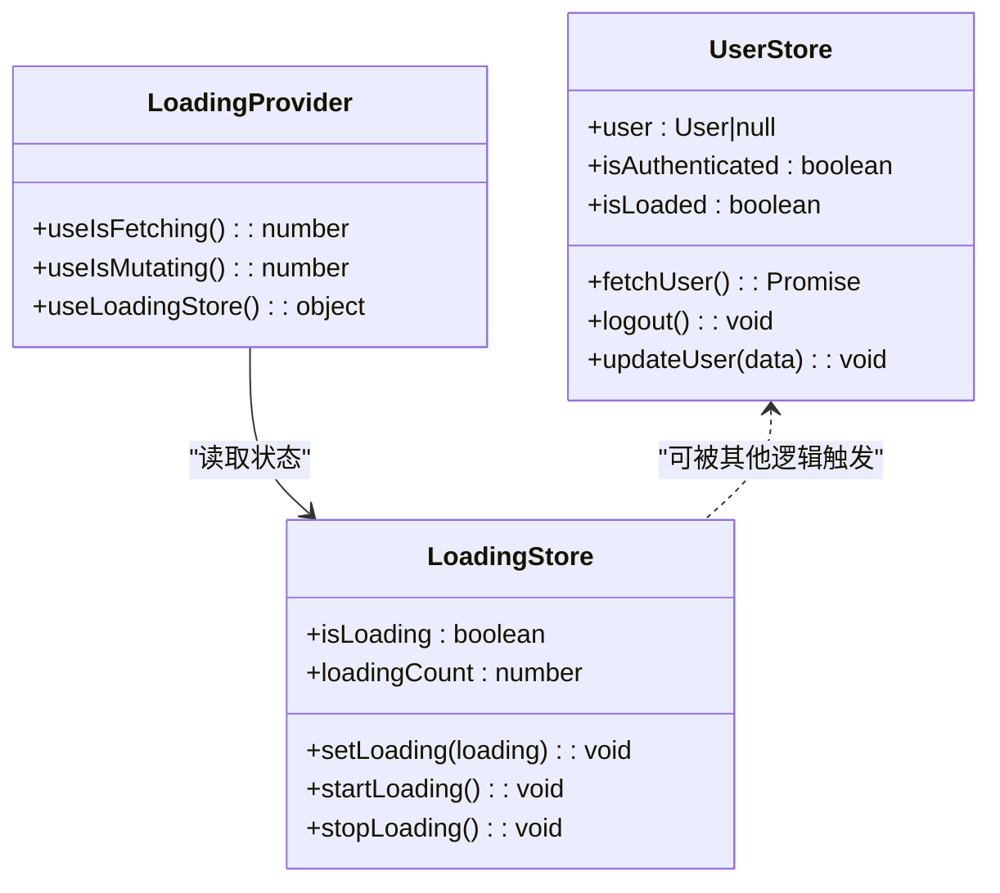
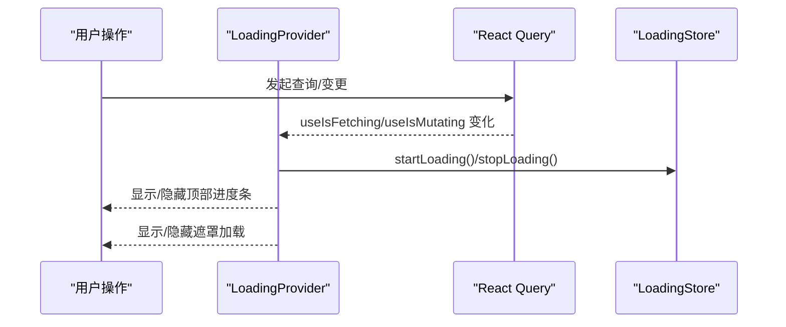
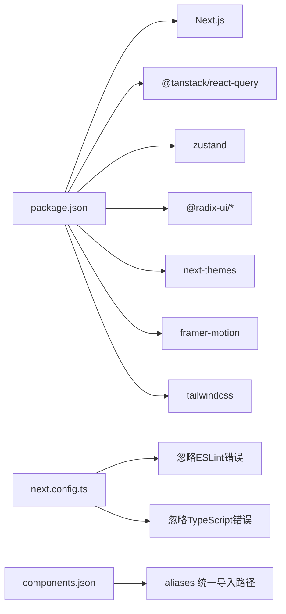

# 前端架构设计

<cite>
**本文引用的文件**
- [package.json](file://package.json)
- [next.config.ts](file://next.config.ts)
- [src/app/layout.tsx](file://src/app/layout.tsx)
- [src/components/providers/query-provider.tsx](file://src/components/providers/query-provider.tsx)
- [src/components/providers/theme-provider.tsx](file://src/components/providers/theme-provider.tsx)
- [src/store/loading-store.ts](file://src/store/loading-store.ts)
- [src/store/user-store.ts](file://src/store/user-store.ts)
- [src/lib/utils.ts](file://src/lib/utils.ts)
- [src/components/providers/loading-provider.tsx](file://src/components/providers/loading-provider.tsx)
- [src/app/(site)/page.tsx](file://src/app/(site)/page.tsx)
- [src/app/dashboard/layout.tsx](file://src/app/dashboard/layout.tsx)
- [src/components/ui/button.tsx](file://src/components/ui/button.tsx)
- [src/components/common/loading.tsx](file://src/components/common/loading.tsx)
- [src/hooks/use-mobile.ts](file://src/hooks/use-mobile.ts)
- [src/middleware.ts](file://src/middleware.ts)
- [components.json](file://components.json)
</cite>

## 目录
1. [引言](#引言)
2. [项目结构](#项目结构)
3. [核心组件](#核心组件)
4. [架构总览](#架构总览)
5. [详细组件分析](#详细组件分析)
6. [依赖关系分析](#依赖关系分析)
7. [性能考虑](#性能考虑)
8. [故障排查指南](#故障排查指南)
9. [结论](#结论)
10. [附录](#附录)

## 引言
本文件面向“一梦五千年”项目，系统化梳理基于 React 与 Next.js 的前端架构设计，重点覆盖以下方面：
- Server Components 与 Client Components 的职责划分与使用场景
- 状态管理模式（Zustand）
- 数据获取策略（React Query）
- 加载状态管理与动画体验
- UI 组件库（Radix UI）集成与自定义组件设计原则
- 响应式设计、主题切换机制与性能优化策略
- 组件生命周期管理、错误边界处理与 SEO 优化方案

## 项目结构
项目采用 Next.js App Router 的目录组织方式，页面按功能域分组，提供统一根布局与全局 Provider 注入，确保跨页面一致的状态与主题体验。

图示来源
- [src/app/layout.tsx:1-52](file://src/app/layout.tsx#L1-L52)
- [src/components/providers/query-provider.tsx:1-22](file://src/components/providers/query-provider.tsx#L1-L22)
- [src/components/providers/loading-provider.tsx:1-49](file://src/components/providers/loading-provider.tsx#L1-L49)
- [src/components/providers/theme-provider.tsx:1-13](file://src/components/providers/theme-provider.tsx#L1-L13)
- [src/app/(site)/page.tsx:1-40](file://src/app/(site)/page.tsx#L1-L40)
- [src/app/dashboard/layout.tsx:1-26](file://src/app/dashboard/layout.tsx#L1-L26)
- [src/middleware.ts:1-36](file://src/middleware.ts#L1-L36)

章节来源
- [src/app/layout.tsx:1-52](file://src/app/layout.tsx#L1-L52)
- [src/app/(site)/page.tsx:1-40](file://src/app/(site)/page.tsx#L1-L40)
- [src/app/dashboard/layout.tsx:1-26](file://src/app/dashboard/layout.tsx#L1-L26)
- [src/middleware.ts:1-36](file://src/middleware.ts#L1-L36)

## 核心组件
- 查询状态 Provider：通过 React Query 提供全局缓存与并发请求管理，默认查询缓存时间设定为 60 秒，减少重复网络请求。
- 加载状态 Provider：聚合 React Query 的 fetching/mutating 与手动加载计数，驱动顶部进度条与遮罩层加载动画。
- 主题 Provider：基于 next-themes 实现明暗主题切换与持久化。
- 用户状态 Store：基于 Zustand 管理用户信息、认证状态与登出流程，支持服务端初始化与客户端更新。
- UI 组件库：以 Radix UI 为基础，结合 shadcn 的样式风格与工具函数，提供可组合、可变体的通用组件。
- 工具函数：cn 函数用于合并 Tailwind 类名，保证样式冲突最小化。

章节来源
- [src/components/providers/query-provider.tsx:1-22](file://src/components/providers/query-provider.tsx#L1-L22)
- [src/components/providers/loading-provider.tsx:1-49](file://src/components/providers/loading-provider.tsx#L1-L49)
- [src/components/providers/theme-provider.tsx:1-13](file://src/components/providers/theme-provider.tsx#L1-L13)
- [src/store/loading-store.ts:1-28](file://src/store/loading-store.ts#L1-L28)
- [src/store/user-store.ts:1-49](file://src/store/user-store.ts#L1-L49)
- [src/lib/utils.ts:1-7](file://src/lib/utils.ts#L1-L7)

## 架构总览
整体架构围绕“根布局注入 Provider → 页面按需加载 → 客户端交互与状态管理”的模式展开。Server Components 负责安全校验与初始渲染，Client Components 负责交互与状态更新；数据获取通过 React Query 统一调度，状态通过 Zustand 管理，UI 采用 Radix UI 与自定义变体体系。

图示来源
- [src/app/layout.tsx:1-52](file://src/app/layout.tsx#L1-L52)
- [src/middleware.ts:1-36](file://src/middleware.ts#L1-L36)
- [src/app/dashboard/layout.tsx:1-26](file://src/app/dashboard/layout.tsx#L1-L26)
- [src/components/providers/query-provider.tsx:1-22](file://src/components/providers/query-provider.tsx#L1-L22)
- [src/components/providers/loading-provider.tsx:1-49](file://src/components/providers/loading-provider.tsx#L1-L49)
- [src/components/providers/theme-provider.tsx:1-13](file://src/components/providers/theme-provider.tsx#L1-L13)
- [src/store/user-store.ts:1-49](file://src/store/user-store.ts#L1-L49)
- [src/store/loading-store.ts:1-28](file://src/store/loading-store.ts#L1-L28)
- [src/components/ui/button.tsx:1-63](file://src/components/ui/button.tsx#L1-L63)

## 详细组件分析

### Server Components 与 Client Components 的职责划分
- 根布局与全局 Provider：根布局作为 Server Component，负责注入查询、加载、主题等 Provider，并设置元数据与字体资源，确保首屏稳定与一致的主题体验。
- 仪表盘布局：使用异步函数进行服务端鉴权与角色校验，未通过则重定向至登录，避免无权限访问。
- 中间件：对受保护路径进行统一拦截，确保仅已认证用户可访问后台区域。
- 动态导入与骨架屏：站点首页对重型组件进行动态导入，并提供骨架屏占位，改善感知性能。

章节来源
- [src/app/layout.tsx:1-52](file://src/app/layout.tsx#L1-L52)
- [src/app/dashboard/layout.tsx:1-26](file://src/app/dashboard/layout.tsx#L1-L26)
- [src/middleware.ts:1-36](file://src/middleware.ts#L1-L36)
- [src/app/(site)/page.tsx:1-40](file://src/app/(site)/page.tsx#L1-L40)

### 状态管理模式（Zustand）
- 用户状态 Store：封装用户信息、认证状态与加载标志，提供拉取用户信息、登出与局部更新方法，支持服务端初始化后客户端增量更新。
- 加载状态 Store：维护布尔开关与计数器，支持多处并发加载叠加与归零，配合加载 Provider 自动计算是否显示加载动画。

图示来源
- [src/store/user-store.ts:1-49](file://src/store/user-store.ts#L1-L49)
- [src/store/loading-store.ts:1-28](file://src/store/loading-store.ts#L1-L28)
- [src/components/providers/loading-provider.tsx:1-49](file://src/components/providers/loading-provider.tsx#L1-L49)

章节来源
- [src/store/user-store.ts:1-49](file://src/store/user-store.ts#L1-L49)
- [src/store/loading-store.ts:1-28](file://src/store/loading-store.ts#L1-L28)
- [src/components/providers/loading-provider.tsx:1-49](file://src/components/providers/loading-provider.tsx#L1-L49)

### 数据获取策略（React Query）
- 全局配置：默认查询缓存时间为 60 秒，降低重复请求成本；Provider 包裹应用，使所有页面共享缓存与重试策略。
- 加载联动：Loading Provider 订阅 useIsFetching 与 useIsMutating，自动反映网络活动，无需手动传播状态。
- 使用建议：在页面或组件中通过 queryKey 与 queryFn 组织查询，利用 staleTime 与 refetch 相关选项控制刷新策略。

章节来源
- [src/components/providers/query-provider.tsx:1-22](file://src/components/providers/query-provider.tsx#L1-L22)
- [src/components/providers/loading-provider.tsx:1-49](file://src/components/providers/loading-provider.tsx#L1-L49)

### 加载状态管理与动画体验
- 顶部进度条：根据网络活动与手动加载计数动态推进，具备进入/退出过渡与防闪烁策略。
- 遮罩加载：全局遮罩层展示科技风旋转动画，适合长任务或首次初始化场景。
- 骨架屏：动态导入组件时提供骨架屏占位，提升感知性能与可用性。

图示来源
- [src/components/providers/loading-provider.tsx:1-49](file://src/components/providers/loading-provider.tsx#L1-L49)
- [src/store/loading-store.ts:1-28](file://src/store/loading-store.ts#L1-L28)

章节来源
- [src/components/providers/loading-provider.tsx:1-49](file://src/components/providers/loading-provider.tsx#L1-L49)
- [src/components/common/loading.tsx:1-133](file://src/components/common/loading.tsx#L1-L133)

### UI 组件库（Radix UI）集成与自定义组件设计原则
- 设计基础：以 Radix UI 为核心，结合 shadcn 风格与 class-variance-authority 的变体系统，提供可组合、可扩展的通用组件。
- 按钮组件：通过变体与尺寸控制外观与尺寸，支持 asChild 透传语义标签，保持可访问性与一致性。
- 工具函数：cn 函数用于合并类名，避免冲突并简化样式拼接。

章节来源
- [src/components/ui/button.tsx:1-63](file://src/components/ui/button.tsx#L1-L63)
- [src/lib/utils.ts:1-7](file://src/lib/utils.ts#L1-L7)
- [components.json:1-23](file://components.json#L1-L23)

### 响应式设计与主题切换机制
- 响应式断点：通过自定义 Hook 判断移动端宽度，便于在组件内做条件渲染与布局调整。
- 主题切换：基于 next-themes 的 Provider，支持系统偏好检测与手动切换，主题状态持久化于本地存储。

章节来源
- [src/hooks/use-mobile.ts:1-20](file://src/hooks/use-mobile.ts#L1-L20)
- [src/components/providers/theme-provider.tsx:1-13](file://src/components/providers/theme-provider.tsx#L1-L13)

### 组件生命周期管理
- 根布局：作为应用入口，负责 Provider 初始化与全局副作用挂载。
- 动态导入：在客户端按需加载重型组件，结合骨架屏与错误边界，提升首屏性能与稳定性。
- 中间件与服务端布局：在服务端完成鉴权与重定向，避免无效渲染。

章节来源
- [src/app/layout.tsx:1-52](file://src/app/layout.tsx#L1-L52)
- [src/app/(site)/page.tsx:1-40](file://src/app/(site)/page.tsx#L1-L40)
- [src/middleware.ts:1-36](file://src/middleware.ts#L1-L36)

### 错误边界处理与容错策略
- 骨架屏：动态导入组件时提供骨架屏占位，避免空洞与布局抖动。
- 查询降级：React Query 默认缓存与重试策略在异常时提供回退与重试能力。
- 登录拦截：中间件与服务端布局确保未授权访问被及时阻断并引导至登录。

章节来源
- [src/app/(site)/page.tsx:1-40](file://src/app/(site)/page.tsx#L1-L40)
- [src/middleware.ts:1-36](file://src/middleware.ts#L1-L36)
- [src/app/dashboard/layout.tsx:1-26](file://src/app/dashboard/layout.tsx#L1-L26)

### SEO 优化方案
- 元数据：根布局集中设置标题与描述，确保搜索引擎抓取到一致的站点信息。
- 字体与结构：使用 next/font 与语义化结构，提升可读性与索引质量。
- 动态导入：减少首屏 JS 体积，改善搜索引擎爬虫的渲染表现。

章节来源
- [src/app/layout.tsx:21-24](file://src/app/layout.tsx#L21-L24)

## 依赖关系分析
- 核心依赖：Next.js 16、React 19、@tanstack/react-query、zustand、@radix-ui/*、next-themes、framer-motion、tailwindcss 等。
- 构建配置：忽略生产构建中的 ESLint 与 TypeScript 错误，加速部署流程。
- 组件别名：components.json 指定 aliases，统一组件、工具与 UI 的导入路径，降低耦合度。

图示来源
- [package.json:1-98](file://package.json#L1-L98)
- [next.config.ts:1-16](file://next.config.ts#L1-L16)
- [components.json:1-23](file://components.json#L1-L23)

章节来源
- [package.json:1-98](file://package.json#L1-L98)
- [next.config.ts:1-16](file://next.config.ts#L1-L16)
- [components.json:1-23](file://components.json#L1-L23)

## 性能考虑
- 代码分割与懒加载：动态导入重型组件，结合骨架屏与渐进式加载，降低首屏负担。
- 查询缓存：合理设置 staleTime 与 refetch 间隔，减少重复请求与带宽消耗。
- 动画与渲染：使用 Framer Motion 进行动画优化，避免不必要的重排与重绘。
- 主题与字体：预加载字体与主题切换缓存，减少闪烁与二次渲染。
- 构建优化：忽略构建期类型与 ESLint 错误，缩短构建时间，提高迭代效率。

## 故障排查指南
- 未登录访问后台：检查中间件与仪表盘布局的鉴权逻辑，确认跳转路径与 claims 校验。
- 加载状态不显示：确认 Loading Provider 是否包裹应用根节点，以及手动加载调用是否成对出现。
- 查询未生效：检查 queryKey 是否稳定、staleTime 设置是否过短导致频繁请求。
- 主题切换异常：确认 next-themes Provider 的包裹范围与本地存储键值。

章节来源
- [src/middleware.ts:1-36](file://src/middleware.ts#L1-L36)
- [src/app/dashboard/layout.tsx:1-26](file://src/app/dashboard/layout.tsx#L1-L26)
- [src/components/providers/loading-provider.tsx:1-49](file://src/components/providers/loading-provider.tsx#L1-L49)
- [src/components/providers/query-provider.tsx:1-22](file://src/components/providers/query-provider.tsx#L1-L22)
- [src/components/providers/theme-provider.tsx:1-13](file://src/components/providers/theme-provider.tsx#L1-L13)

## 结论
本项目以 Next.js App Router 为核心，结合 Server Components 与 Client Components 的清晰分工，构建了高可用、高性能且易于扩展的前端架构。通过 React Query 与 Zustand 的协同，实现了稳定的数据流与状态管理；以 Radix UI 为基础的 UI 体系与自定义变体，提供了良好的可维护性与一致性。配合响应式设计、主题切换与加载动画，整体用户体验在性能与可用性之间取得平衡。

## 附录
- 最佳实践建议
  - 将路由级别的鉴权尽量前置到中间件或服务端布局，减少客户端无效渲染。
  - 对重型组件使用动态导入与骨架屏，优先保障首屏内容可见性。
  - 合理设置 React Query 的缓存与重试策略，避免过度请求。
  - 使用 Zustand 管理轻量状态，避免过度全局化导致的复杂性上升。
  - 统一组件命名与导入路径，借助 components.json 与 aliases 降低心智负担。