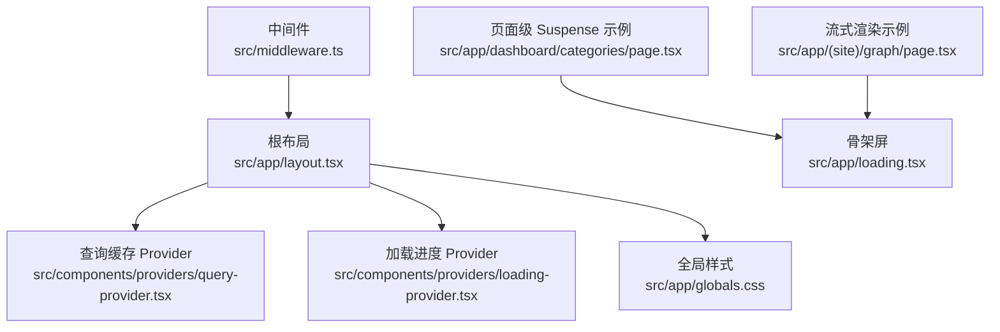
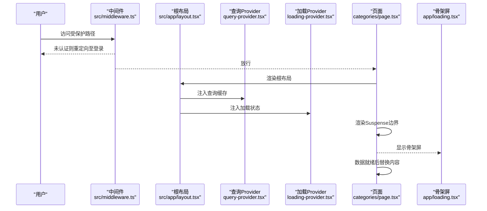
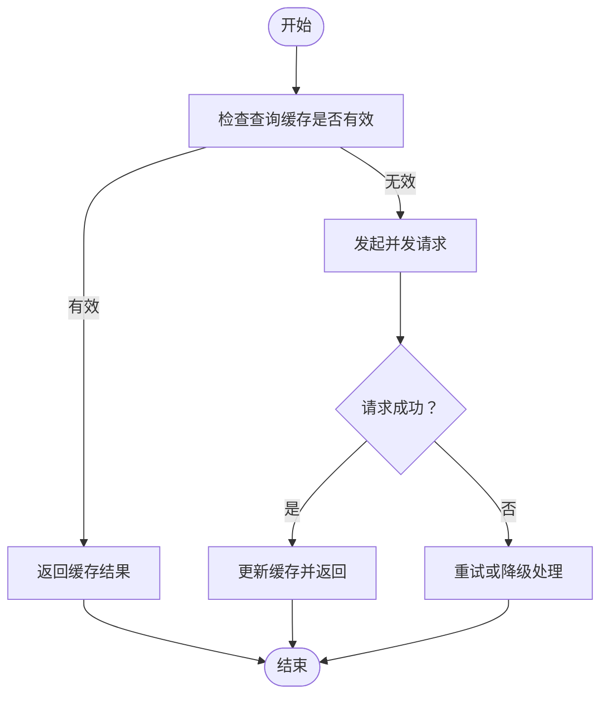
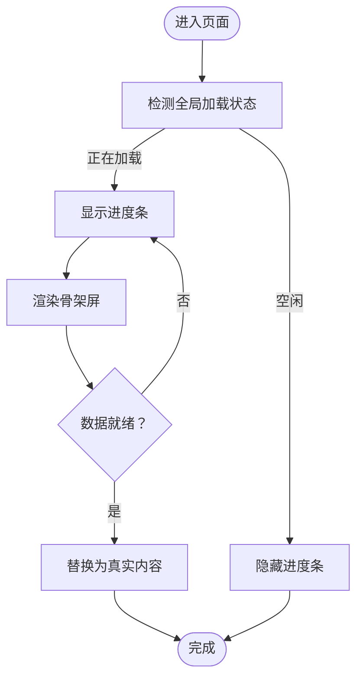
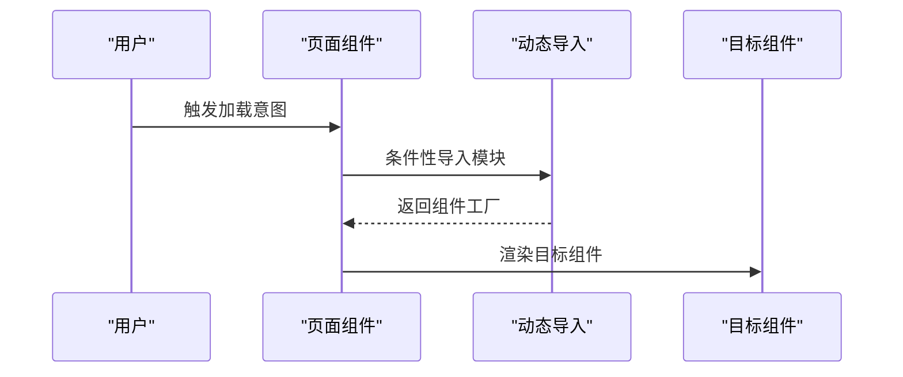
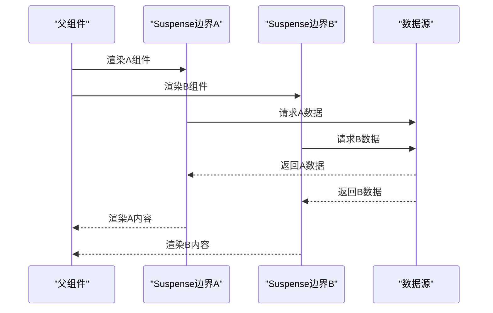
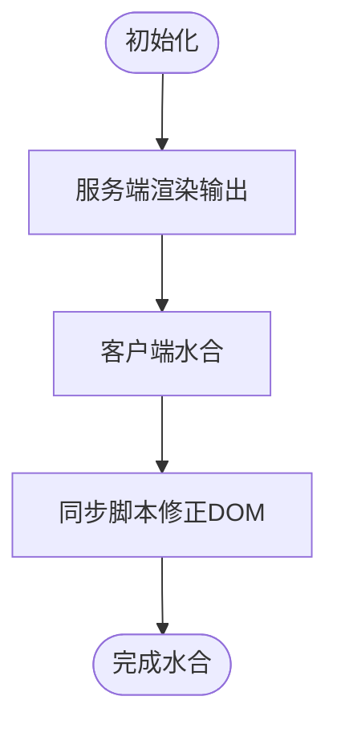
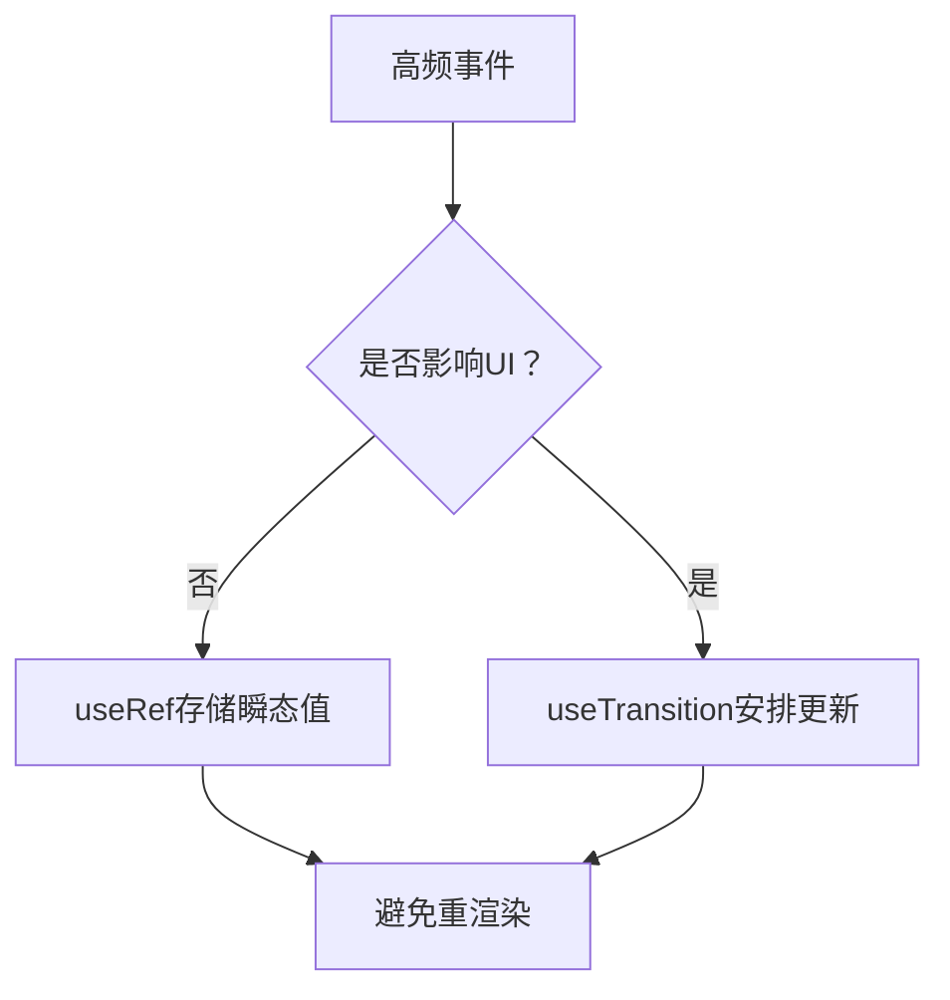
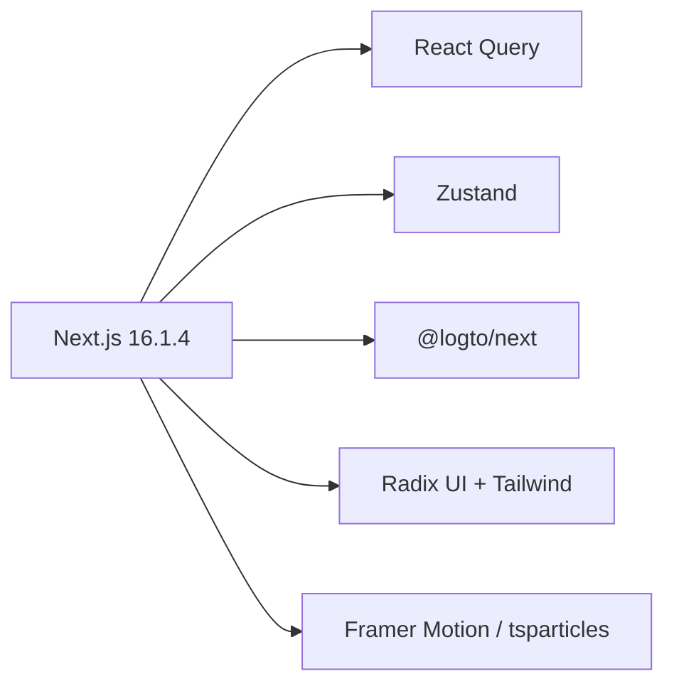

# 性能优化策略

<cite>
**本文引用的文件**
- [next.config.ts](file://next.config.ts)
- [package.json](file://package.json)
- [src/app/layout.tsx](file://src/app/layout.tsx)
- [src/middleware.ts](file://src/middleware.ts)
- [src/components/providers/query-provider.tsx](file://src/components/providers/query-provider.tsx)
- [src/components/providers/loading-provider.tsx](file://src/components/providers/loading-provider.tsx)
- [src/app/loading.tsx](file://src/app/loading.tsx)
- [src/app/dashboard/categories/page.tsx](file://src/app/dashboard/categories/page.tsx)
- [src/app/(site)/graph/page.tsx](file://src/app/(site)/graph/page.tsx)
- [.agents/技能/vercel-react-best-practices/AGENTS.md](file://.agents/技能/vercel-react-best-practices/AGENTS.md)
- [.agents/技能/vercel-react-best-practices/SKILL.md](file://.agents/技能/vercel-react-best-practices/SKILL.md)
- [.agents/技能/vercel-react-best-practices/rules/bundle-dynamic-imports.md](file://.agents/技能/vercel-react-best-practices/rules/bundle-dynamic-imports.md)
- [.agents/技能/vercel-react-best-practices/rules/async-suspense-boundaries.md](file://.agents/技能/vercel-react-best-practices/rules/async-suspense-boundaries.md)
- [.agents/技能/vercel-react-best-practices/rules/rendering-hydration-no-flicker.md](file://.agents/技能/vercel-react-best-practices/rules/rendering-hydration-no-flicker.md)
- [.agents/技能/vercel-react-best-practices/rules/rendering-hydration-suppress-warning.md](file://.agents/技能/vercel-react-best-practices/rules/rendering-hydration-suppress-warning.md)
- [.agents/技能/vercel-react-best-practices/rules/rerender-memo.md](file://.agents/技能/vercel-react-best-practices/rules/rerender-memo.md)
- [.agents/技能/vercel-react-best-practices/rules/bundle-defer-third-party.md](file://.agents/技能/vercel-react-best-practices/rules/bundle-defer-third-party.md)
- [AGENTS.md](file://AGENTS.md)
</cite>

## 目录
1. [引言](#引言)
2. [项目结构](#项目结构)
3. [核心组件](#核心组件)
4. [架构概览](#架构概览)
5. [详细组件分析](#详细组件分析)
6. [依赖分析](#依赖分析)
7. [性能考虑](#性能考虑)
8. [故障排查指南](#故障排查指南)
9. [结论](#结论)
10. [附录](#附录)

## 引言
本文件面向“一梦五千年”项目，提供一套系统化的前端性能优化策略，聚焦于 Next.js 16 在 App Router 下的内置优化能力与工程化实践，包括自动代码分割、Suspense 流式渲染、骨架屏与加载进度条、客户端水合与主题切换、内存与垃圾回收、以及性能监控与基准测试方法。文档同时结合仓库内已有的 Provider、中间件与页面级 Suspense 模式，给出可落地的实施建议。

## 项目结构
项目采用 Next.js App Router 结构，根布局负责全局 Provider 注入与水合控制；页面层广泛使用 Suspense 边界与骨架屏；部分页面通过动态路由标记以满足运行时需求；中间件用于保护路由与重定向；全局样式与字体由根布局统一注入。

图表来源
- [src/app/layout.tsx:1-52](file://src/app/layout.tsx#L1-L52)
- [src/components/providers/query-provider.tsx:1-22](file://src/components/providers/query-provider.tsx#L1-L22)
- [src/components/providers/loading-provider.tsx:1-49](file://src/components/providers/loading-provider.tsx#L1-L49)
- [src/middleware.ts:1-36](file://src/middleware.ts#L1-L36)
- [src/app/dashboard/categories/page.tsx:1-20](file://src/app/dashboard/categories/page.tsx#L1-L20)
- [src/app/(site)/graph/page.tsx:1-39](file://src/app/(site)/graph/page.tsx#L1-L39)
- [src/app/loading.tsx:1-31](file://src/app/loading.tsx#L1-L31)

章节来源
- [src/app/layout.tsx:1-52](file://src/app/layout.tsx#L1-L52)
- [src/middleware.ts:1-36](file://src/middleware.ts#L1-L36)
- [src/app/dashboard/categories/page.tsx:1-20](file://src/app/dashboard/categories/page.tsx#L1-L20)
- [src/app/(site)/graph/page.tsx:1-39](file://src/app/(site)/graph/page.tsx#L1-L39)
- [src/app/loading.tsx:1-31](file://src/app/loading.tsx#L1-L31)

## 核心组件
- 根布局与全局 Provider
  - 根布局集中注入查询缓存、加载状态、通知与分析追踪，并通过 Suspense 包裹分析组件，避免阻塞首屏。
  - 使用自定义加载进度条 Provider，聚合 React Query 的抓取/变更状态与手动加载标志，形成统一的进度反馈。
- 页面级 Suspense 与骨架屏
  - 页面通过 Suspense 边界包裹异步组件，配合骨架屏减少布局抖动，提升感知性能。
- 中间件路由保护
  - 对受保护路径进行鉴权重定向，降低无效渲染与后续错误处理成本。

章节来源
- [src/app/layout.tsx:1-52](file://src/app/layout.tsx#L1-L52)
- [src/components/providers/query-provider.tsx:1-22](file://src/components/providers/query-provider.tsx#L1-L22)
- [src/components/providers/loading-provider.tsx:1-49](file://src/components/providers/loading-provider.tsx#L1-L49)
- [src/app/dashboard/categories/page.tsx:1-20](file://src/app/dashboard/categories/page.tsx#L1-L20)
- [src/app/(site)/graph/page.tsx:1-39](file://src/app/(site)/graph/page.tsx#L1-L39)
- [src/app/loading.tsx:1-31](file://src/app/loading.tsx#L1-L31)
- [src/middleware.ts:1-36](file://src/middleware.ts#L1-L36)

## 架构概览
下图展示了从请求进入、鉴权、到页面渲染与数据流的关键节点，以及 Suspense 边界与骨架屏如何协同工作，确保首屏快速可用与交互流畅。

图表来源
- [src/middleware.ts:1-36](file://src/middleware.ts#L1-L36)
- [src/app/layout.tsx:1-52](file://src/app/layout.tsx#L1-L52)
- [src/components/providers/query-provider.tsx:1-22](file://src/components/providers/query-provider.tsx#L1-L22)
- [src/components/providers/loading-provider.tsx:1-49](file://src/components/providers/loading-provider.tsx#L1-L49)
- [src/app/dashboard/categories/page.tsx:1-20](file://src/app/dashboard/categories/page.tsx#L1-L20)
- [src/app/loading.tsx:1-31](file://src/app/loading.tsx#L1-L31)

## 详细组件分析

### 查询缓存与并发策略
- 默认查询缓存策略
  - 通过 React Query 的默认选项设置合理的过期时间，平衡新鲜度与缓存命中率，减少重复请求与网络抖动。
- 并发与去重
  - 建议在页面中对独立数据源使用并发请求，并结合去重策略，避免重复抓取同一数据。
- 与 Suspense 协同
  - 将长耗时数据放入 Suspense 边界内，保证上层布局快速渲染，同时保持数据一致性。

图表来源
- [src/components/providers/query-provider.tsx:1-22](file://src/components/providers/query-provider.tsx#L1-L22)

章节来源
- [src/components/providers/query-provider.tsx:1-22](file://src/components/providers/query-provider.tsx#L1-L22)
- [.agents/技能/vercel-react-best-practices/AGENTS.md:21-2028](file://.agents/技能/vercel-react-best-practices/AGENTS.md#L21-L2028)

### 加载进度条与骨架屏
- 加载进度条
  - 基于 React Query 的抓取/变更状态与手动加载标志，计算进度并控制显隐，避免长时间无反馈。
- 骨架屏
  - 页面级骨架屏覆盖关键区域，减少布局抖动；组件级骨架屏用于列表与异步区块。
- 与 Suspense 协作
  - 将骨架屏作为 Suspense 的 fallback，确保在数据到达前有稳定占位。

图表来源
- [src/components/providers/loading-provider.tsx:1-49](file://src/components/providers/loading-provider.tsx#L1-L49)
- [src/app/loading.tsx:1-31](file://src/app/loading.tsx#L1-L31)

章节来源
- [src/components/providers/loading-provider.tsx:1-49](file://src/components/providers/loading-provider.tsx#L1-L49)
- [src/app/loading.tsx:1-31](file://src/app/loading.tsx#L1-L31)
- [src/app/dashboard/categories/page.tsx:1-20](file://src/app/dashboard/categories/page.tsx#L1-L20)
- [src/app/(site)/graph/page.tsx:1-39](file://src/app/(site)/graph/page.tsx#L1-L39)

### 懒加载与代码分割
- 动态导入重型组件
  - 对非首屏必需的重型组件（如编辑器、粒子动画等）使用动态导入，并在服务端禁用渲染，减少首屏包体。
- 基于意图的预加载
  - 在用户悬停、聚焦或启用开关时，提前触发动态导入，缩短感知延迟。
- 第三方库延迟加载
  - 分析、埋点等非关键第三方库可在水合后按需加载，避免阻塞首屏。

图表来源
- [.agents/技能/vercel-react-best-practices/rules/bundle-dynamic-imports.md:1-36](file://.agents/技能/vercel-react-best-practices/rules/bundle-dynamic-imports.md#L1-L36)
- [.agents/技能/vercel-react-best-practices/rules/bundle-defer-third-party.md:1-50](file://.agents/技能/vercel-react-best-practices/rules/bundle-defer-third-party.md#L1-L50)

章节来源
- [.agents/技能/vercel-react-best-practices/rules/bundle-dynamic-imports.md:1-36](file://.agents/技能/vercel-react-best-practices/rules/bundle-dynamic-imports.md#L1-L36)
- [.agents/技能/vercel-react-best-practices/rules/bundle-defer-third-party.md:1-50](file://.agents/技能/vercel-react-best-practices/rules/bundle-defer-third-party.md#L1-L50)

### Suspense 边界与流式渲染
- 合理拆分 Suspense 边界
  - 将仅需局部数据的组件置于独立边界，避免阻塞整体布局；必要时共享 Promise，减少重复请求。
- 与骨架屏配合
  - 在边界内提供骨架屏，保证视觉连续性，降低布局抖动风险。

图表来源
- [.agents/技能/vercel-react-best-practices/rules/async-suspense-boundaries.md:1-100](file://.agents/技能/vercel-react-best-practices/rules/async-suspense-boundaries.md#L1-L100)

章节来源
- [.agents/技能/vercel-react-best-practices/rules/async-suspense-boundaries.md:1-100](file://.agents/技能/vercel-react-best-practices/rules/async-suspense-boundaries.md#L1-L100)
- [src/app/dashboard/categories/page.tsx:1-20](file://src/app/dashboard/categories/page.tsx#L1-L20)
- [src/app/(site)/graph/page.tsx:1-39](file://src/app/(site)/graph/page.tsx#L1-L39)

### 客户端水合优化与主题切换
- 防止水合闪烁
  - 对依赖本地存储的主题切换，采用同步脚本在水合前更新 DOM，避免闪烁与不一致。
- 期望的水合差异
  - 对于日期、随机值等预期差异，使用水合抑制属性避免噪音警告。

图表来源
- [.agents/技能/vercel-react-best-practices/rules/rendering-hydration-no-flicker.md:1-51](file://.agents/技能/vercel-react-best-practices/rules/rendering-hydration-no-flicker.md#L1-L51)
- [.agents/技能/vercel-react-best-practices/rules/rendering-hydration-suppress-warning.md:1-31](file://.agents/技能/vercel-react-best-practices/rules/rendering-hydration-suppress-warning.md#L1-L31)

章节来源
- [.agents/技能/vercel-react-best-practices/rules/rendering-hydration-no-flicker.md:1-51](file://.agents/技能/vercel-react-best-practices/rules/rendering-hydration-no-flicker.md#L1-L51)
- [.agents/技能/vercel-react-best-practices/rules/rendering-hydration-suppress-warning.md:1-31](file://.agents/技能/vercel-react-best-practices/rules/rendering-hydration-suppress-warning.md#L1-L31)
- [src/app/layout.tsx:1-52](file://src/app/layout.tsx#L1-L52)

### 内存管理与垃圾回收
- 减少不必要重渲染
  - 对频繁更新但不影响 UI 的值使用 useRef 存储，避免状态变更引发的重渲染。
- 合理使用过渡
  - 对滚动、鼠标跟踪等高频更新使用 useTransition，维持 UI 响应性。
- 组件记忆化
  - 将昂贵计算抽取到记忆化组件中，在加载状态下直接短路，减少无效计算。

图表来源
- [.agents/技能/vercel-react-best-practices/AGENTS.md:21-2028](file://.agents/技能/vercel-react-best-practices/AGENTS.md#L21-L2028)
- [.agents/技能/vercel-react-best-practices/rules/rerender-memo.md:1-45](file://.agents/技能/vercel-react-best-practices/rules/rerender-memo.md#L1-L45)

章节来源
- [.agents/技能/vercel-react-best-practices/AGENTS.md:21-2028](file://.agents/技能/vercel-react-best-practices/AGENTS.md#L21-L2028)
- [.agents/技能/vercel-react-best-practices/rules/rerender-memo.md:1-45](file://.agents/技能/vercel-react-best-practices/rules/rerender-memo.md#L1-L45)

### 路由保护与水合控制
- 中间件保护
  - 对受保护路径进行鉴权与重定向，减少无效渲染与后续错误处理。
- 水合控制
  - 根布局使用水合抑制属性，避免主题切换导致的闪烁与不一致。

章节来源
- [src/middleware.ts:1-36](file://src/middleware.ts#L1-L36)
- [src/app/layout.tsx:1-52](file://src/app/layout.tsx#L1-L52)

## 依赖分析
- Next.js 版本与配置
  - 项目使用 Next.js 16.1.4，具备最新的 App Router 与内置优化能力；当前配置允许构建阶段忽略 ESLint/TypeScript 错误，便于持续集成。
- 关键依赖
  - React Query 提供高效的数据获取与缓存；TanStack Table、Recharts、Framer Motion 等用于复杂 UI 与动画；Zustand 用于轻量状态管理；Logto 提供 OIDC 认证。

图表来源
- [package.json:11-79](file://package.json#L11-L79)
- [next.config.ts:1-16](file://next.config.ts#L1-L16)

章节来源
- [package.json:11-79](file://package.json#L11-L79)
- [next.config.ts:1-16](file://next.config.ts#L1-L16)

## 性能考虑
- 自动代码分割
  - 利用 App Router 的路由级分割与动态导入，将重型组件与第三方库按需加载，显著降低首屏包体。
- 图片与静态资源
  - 使用 Next.js 图片优化组件与静态资源处理，结合合适的尺寸与格式，减少传输体积。
- 骨架屏与流式渲染
  - 通过 Suspense 边界与骨架屏，优先渲染布局骨架，再逐步填充内容，改善感知性能。
- 水合与主题切换
  - 采用同步脚本修正 DOM，避免闪烁；对预期差异使用水合抑制属性，减少噪音。
- 内存与重渲染
  - 使用 useRef 存储瞬态值，useTransition 处理高频更新，记忆化昂贵计算，减少不必要的重渲染。
- 监控与基准
  - 建议接入性能监控（如 Web Vitals、自定义指标），定期进行基准测试（LCP、CLS、INP、TTI），并结合构建产物分析工具评估代码分割效果。

## 故障排查指南
- 骨架屏与加载进度异常
  - 检查加载 Provider 是否正确聚合查询状态与手动标志；确认 Suspense 边界包裹范围合理。
- 水合闪烁或警告
  - 确认主题切换逻辑使用同步脚本修正 DOM；对预期差异使用水合抑制属性。
- 首屏过慢
  - 使用动态导入分离重型组件；对非关键第三方库延迟加载；检查是否存在不必要的全量依赖。
- 数据瀑布
  - 将独立数据源改为并发请求；在页面中共享 Promise，减少重复请求。

章节来源
- [src/components/providers/loading-provider.tsx:1-49](file://src/components/providers/loading-provider.tsx#L1-L49)
- [src/app/loading.tsx:1-31](file://src/app/loading.tsx#L1-L31)
- [.agents/技能/vercel-react-best-practices/rules/rendering-hydration-no-flicker.md:1-51](file://.agents/技能/vercel-react-best-practices/rules/rendering-hydration-no-flicker.md#L1-L51)
- [.agents/技能/vercel-react-best-practices/rules/rendering-hydration-suppress-warning.md:1-31](file://.agents/技能/vercel-react-best-practices/rules/rendering-hydration-suppress-warning.md#L1-L31)
- [.agents/技能/vercel-react-best-practices/rules/async-suspense-boundaries.md:1-100](file://.agents/技能/vercel-react-best-practices/rules/async-suspense-boundaries.md#L1-L100)

## 结论
通过充分利用 Next.js 16 的 App Router 与内置优化能力，结合 React Query 的缓存与并发策略、Suspense 的流式渲染、骨架屏与加载进度条、以及懒加载与水合优化，可以在“一梦五千年”项目中实现更快的首屏、更顺滑的交互与更好的用户体验。建议持续引入性能监控与基准测试，确保优化策略在长期演进中保持有效性。

## 附录
- Next.js 配置要点
  - 当前配置允许构建阶段忽略 ESLint/TypeScript 错误，便于 CI/CD 流程；如需更强的质量约束，可调整为严格模式。
- 项目背景与技术栈
  - 项目采用 TypeScript、Radix UI、Tailwind CSS 4、Prisma、Logto 等技术栈，适合在性能与开发体验之间取得良好平衡。

章节来源
- [next.config.ts:1-16](file://next.config.ts#L1-L16)
- [AGENTS.md:1-234](file://AGENTS.md#L1-L234)