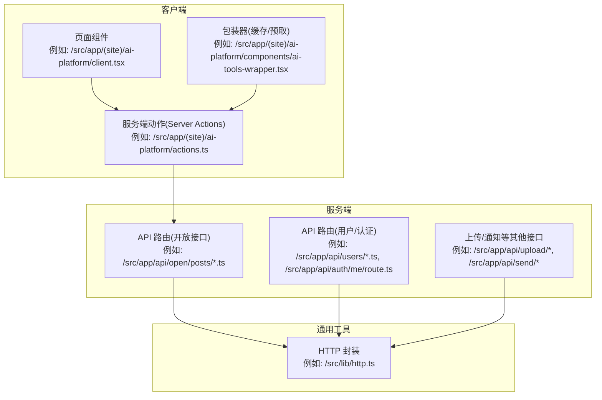
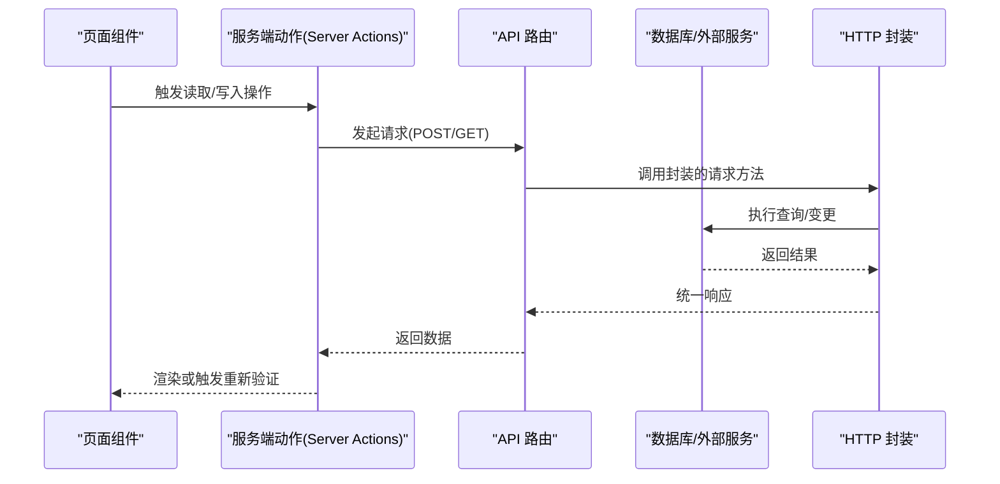
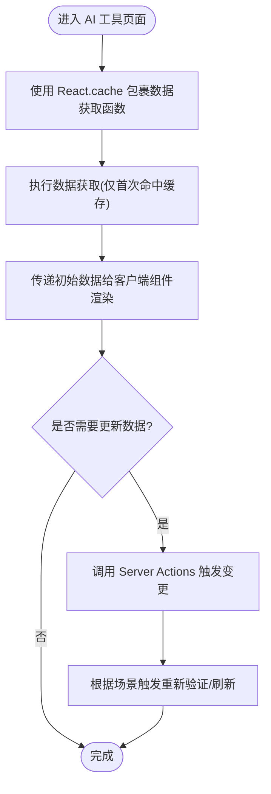
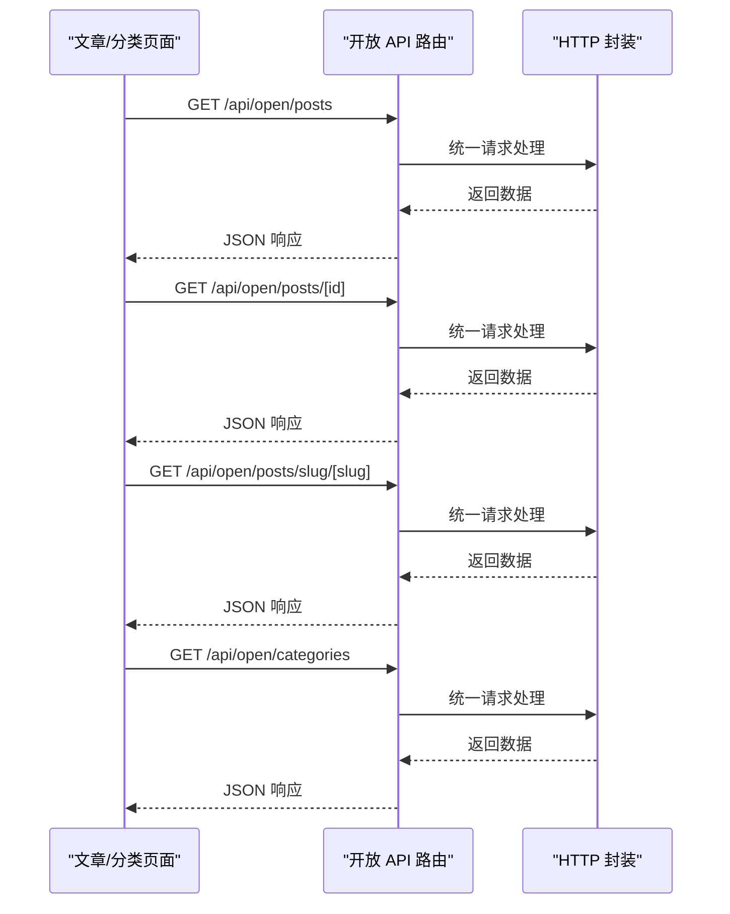
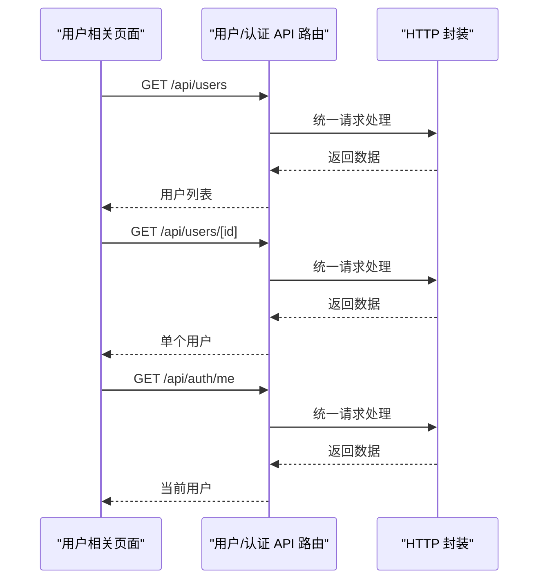
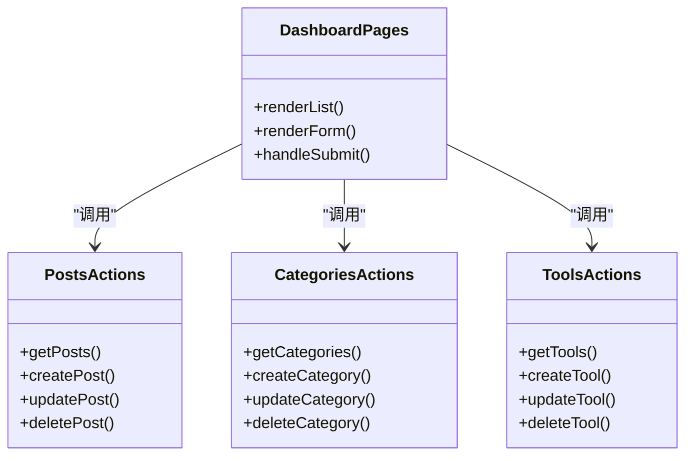
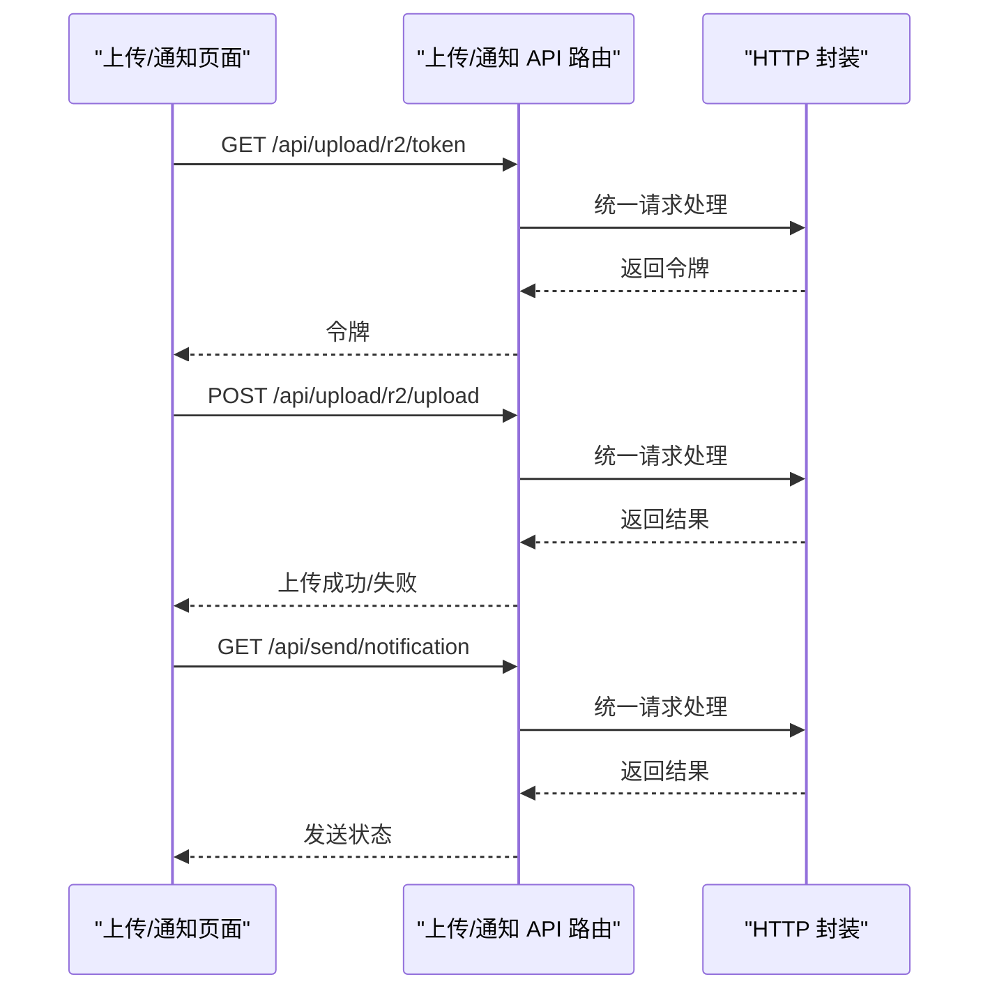
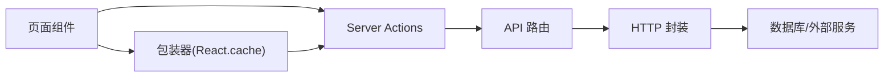

# 数据获取策略

<cite>
**本文引用的文件**
- [src/app/(site)/ai-platform/components/ai-tools-wrapper.tsx](file://src/app/(site)/ai-platform/components/ai-tools-wrapper.tsx)
- [src/app/(site)/ai-platform/client.tsx](file://src/app/(site)/ai-platform/client.tsx)
- [src/app/(site)/ai-platform/actions.ts](file://src/app/(site)/ai-platform/actions.ts)
- [src/lib/http.ts](file://src/lib/http.ts)
- [src/app/api/open/posts/route.ts](file://src/app/api/open/posts/route.ts)
- [src/app/api/open/posts/[id]/route.ts](file://src/app/api/open/posts/[id]/route.ts)
- [src/app/api/open/posts/slug/[slug]/route.ts](file://src/app/api/open/posts/slug/[slug]/route.ts)
- [src/app/api/open/categories/route.ts](file://src/app/api/open/categories/route.ts)
- [src/app/api/users/[id]/route.ts](file://src/app/api/users/[id]/route.ts)
- [src/app/api/users/route.ts](file://src/app/api/users/route.ts)
- [src/app/api/auth/me/route.ts](file://src/app/api/auth/me/route.ts)
- [src/app/api/analytics/track/route.ts](file://src/app/api/analytics/track/route.ts)
- [src/components/layout/main-nav.tsx](file://src/components/layout/main-nav.tsx)
- [src/app/dashboard/posts/actions.ts](file://src/app/dashboard/posts/actions.ts)
- [src/app/dashboard/posts/schema.ts](file://src/app/dashboard/posts/schema.ts)
- [src/app/dashboard/posts/components/posts-wrapper.tsx](file://src/app/dashboard/posts/components/posts-wrapper.tsx)
- [src/app/dashboard/posts/components/post-list.tsx](file://src/app/dashboard/posts/components/post-list.tsx)
- [src/app/dashboard/posts/components/post-dialog.tsx](file://src/app/dashboard/posts/components/post-dialog.tsx)
- [src/app/dashboard/categories/actions.ts](file://src/app/dashboard/categories/actions.ts)
- [src/app/dashboard/categories/schema.ts](file://src/app/dashboard/categories/schema.ts)
- [src/app/dashboard/categories/components/categories-wrapper.tsx](file://src/app/dashboard/categories/components/categories-wrapper.tsx)
- [src/app/dashboard/categories/components/category-list.tsx](file://src/app/dashboard/categories/components/category-list.tsx)
- [src/app/dashboard/categories/components/category-dialog.tsx](file://src/app/dashboard/categories/components/category-dialog.tsx)
- [src/app/dashboard/tools/actions.ts](file://src/app/dashboard/tools/actions.ts)
- [src/app/dashboard/tools/schema.ts](file://src/app/dashboard/tools/schema.ts)
- [src/app/dashboard/tools/components/tools-wrapper.tsx](file://src/app/dashboard/tools/components/tools-wrapper.tsx)
- [src/app/dashboard/tools/components/tool-list.tsx](file://src/app/dashboard/tools/components/tool-list.tsx)
- [src/app/dashboard/tools/components/tool-dialog.tsx](file://src/app/dashboard/tools/components/tool-dialog.tsx)
- [src/app/dashboard/ai-tools/actions.ts](file://src/app/dashboard/ai-tools/actions.ts)
- [src/app/dashboard/ai-tools/schema.ts](file://src/app/dashboard/ai-tools/schema.ts)
- [src/app/dashboard/ai-tools/components/ai-tools-wrapper.tsx](file://src/app/dashboard/ai-tools/components/ai-tools-wrapper.tsx)
- [src/app/dashboard/ai-tools/components/ai-tool-list.tsx](file://src/app/dashboard/ai-tools/components/ai-tool-list.tsx)
- [src/app/dashboard/ai-tools/components/ai-tool-dialog.tsx](file://src/app/dashboard/ai-tools/components/ai-tool-dialog.tsx)
- [src/app/dashboard/comments/actions.ts](file://src/app/dashboard/comments/actions.ts)
- [src/app/dashboard/comments/components/comments-wrapper.tsx](file://src/app/dashboard/comments/components/comments-wrapper.tsx)
- [src/app/dashboard/comments/components/comment-list.tsx](file://src/app/dashboard/comments/components/comment-list.tsx)
- [src/app/dashboard/friend-links/actions.ts](file://src/app/dashboard/friend-links/actions.ts)
- [src/app/dashboard/friend-links/components/friend-links-wrapper.tsx](file://src/app/dashboard/friend-links/components/friend-links-wrapper.tsx)
- [src/app/dashboard/friend-links/components/friend-link-list.tsx](file://src/app/dashboard/friend-links/components/friend-link-list.tsx)
- [src/app/dashboard/friend-links/components/friend-link-dialog.tsx](file://src/app/dashboard/friend-links/components/friend-link-dialog.tsx)
- [src/app/dashboard/users/actions.ts](file://src/app/dashboard/users/actions.ts)
- [src/app/dashboard/users/components/users-wrapper.tsx](file://src/app/dashboard/users/components/users-wrapper.tsx)
- [src/app/dashboard/users/components/user-list.tsx](file://src/app/dashboard/users/components/user-list.tsx)
- [src/app/dashboard/users/components/user-dialog.tsx](file://src/app/dashboard/users/components/user-dialog.tsx)
- [src/app/dashboard/email-logs/actions.ts](file://src/app/dashboard/email-logs/actions.ts)
- [src/app/dashboard/email-logs/components/email-logs-wrapper.tsx](file://src/app/dashboard/email-logs/components/email-logs-wrapper.tsx)
- [src/app/dashboard/email-logs/components/email-logs-list.tsx](file://src/app/dashboard/email-logs/components/email-logs-list.tsx)
- [src/app/dashboard/email-logs/components/test-email-dialog.tsx](file://src/app/dashboard/email-logs/components/test-email-dialog.tsx)
- [src/app/dashboard/overview/actions.ts](file://src/app/dashboard/overview/actions.ts)
- [src/app/dashboard/overview/components/overview-trend-chart.tsx](file://src/app/dashboard/overview/components/overview-trend-chart.tsx)
- [src/app/dashboard/life/records/](file://src/app/dashboard/life/records/)
- [src/app/editor/[id]/page.tsx](file://src/app/editor/[id]/page.tsx)
- [src/app/editor/components/editor-ui.tsx](file://src/app/editor/components/editor-ui.tsx)
- [src/app/editor/new/page.tsx](file://src/app/editor/new/page.tsx)
- [src/app/api/upload/r2/token/route.ts](file://src/app/api/upload/r2/token/route.ts)
- [src/app/api/upload/r2/upload/route.ts](file://src/app/api/upload/r2/upload/route.ts)
- [src/app/api/upload/r2/url/route.ts](file://src/app/api/upload/r2/url/route.ts)
- [src/app/api/send/notification/route.ts](file://src/app/api/send/notification/route.ts)
- [src/app/api/send/verification-code/route.ts](file://src/app/api/send/verification-code/route.ts)
- [src/app/api/send-friend-approval/route.ts](file://src/app/api/send-friend-approval/route.ts)
- [src/app/api/send/route.ts](file://src/app/api/send/route.ts)
- [src/app/api/test-db/route.ts](file://src/app/api/test-db/route.ts)
- [src/app/api/test-friend-email/route.ts](file://src/app/api/test-friend-email/route.ts)
- [src/app/api/test-mail/route.ts](file://src/app/api/test-mail/route.ts)
- [src/app/api/rcode/route.ts](file://src/app/api/rcode/route.ts)
- [src/app/api/logto/sign-in/route.ts](file://src/app/api/logto/sign-in/route.ts)
- [src/app/api/logto/sign-out/route.ts](file://src/app/api/logto/sign-out/route.ts)
- [src/app/api/logto/callback/route.ts](file://src/app/api/logto/callback/route.ts)
- [src/app/api/upload/token/route.ts](file://src/app/api/upload/token/route.ts)
- [src/app/api/upload/route.ts](file://src/app/api/upload/route.ts)
- [src/app/api/analytics/track/route.ts](file://src/app/api/analytics/track/route.ts)
- [src/app/api/test-db/route.ts](file://src/app/api/test-db/route.ts)
- [src/app/api/test-friend-email/route.ts](file://src/app/api/test-friend-email/route.ts)
- [src/app/api/test-mail/route.ts](file://src/app/api/test-mail/route.ts)
- [src/app/api/rcode/route.ts](file://src/app/api/rcode/route.ts)
- [src/app/api/send/route.ts](file://src/app/api/send/route.ts)
- [src/app/api/send/notification/route.ts](file://src/app/api/send/notification/route.ts)
- [src/app/api/send/verification-code/route.ts](file://src/app/api/send/verification-code/route.ts)
- [src/app/api/send-friend-approval/route.ts](file://src/app/api/send-friend-approval/route.ts)
- [src/app/api/upload/token/route.ts](file://src/app/api/upload/token/route.ts)
- [src/app/api/upload/r2/token/route.ts](file://src/app/api/upload/r2/token/route.ts)
- [src/app/api/upload/r2/upload/route.ts](file://src/app/api/upload/r2/upload/route.ts)
- [src/app/api/upload/r2/url/route.ts](file://src/app/api/upload/r2/url/route.ts)
- [src/app/api/upload/r2/token/route.ts](file://src/app/api/upload/r2/token/route.ts)
- [src/app/api/upload/r2/upload/route.ts](file://src/app/api/upload/r2/upload/route.ts)
- [src/app/api/upload/r2/url/route.ts](file://src/app/api/upload/r2/url/route.ts)
- [src/app/api/upload/token/route.ts](file://src/app/api/upload/token/route.ts)
- [src/app/api/upload/route.ts](file://src/app/api/upload/route.ts)
- [src/app/api/analytics/track/route.ts](file://src/app/api/analytics/track/route.ts)
- [src/app/api/test-db/route.ts](file://src/app/api/test-db/route.ts)
- [src/app/api/test-friend-email/route.ts](file://src/app/api/test-friend-email/route.ts)
- [src/app/api/test-mail/route.ts](file://src/app/api/test-mail/route.ts)
- [src/app/api/rcode/route.ts](file://src/app/api/rcode/route.ts)
- [src/app/api/send/route.ts](file://src/app/api/send/route.ts)
- [src/app/api/send/notification/route.ts](file://src/app/api/send/notification/route.ts)
- [src/app/api/send/verification-code/route.ts](file://src/app/api/send/verification-code/route.ts)
- [src/app/api/send-friend-approval/route.ts](file://src/app/api/send-friend-approval/route.ts)
- [src/app/api/upload/token/route.ts](file://src/app/api/upload/token/route.ts)
- [src/app/api/upload/r2/token/route.ts](file://src/app/api/upload/r2/token/route.ts)
- [src/app/api/upload/r2/upload/route.ts](file://src/app/api/upload/r2/upload/route.ts)
- [src/app/api/upload/r2/url/route.ts](file://src/app/api/upload/r2/url/route.ts)
- [src/app/api/upload/token/route.ts](file://src/app/api/upload/token/route.ts)
- [src/app/api/upload/route.ts](file://src/app/api/upload/route.ts)
- [src/app/api/analytics/track/route.ts](file://src/app/api/analytics/track/route.ts)
- [src/app/api/test-db/route.ts](file://src/app/api/test-db/route.ts)
- [src/app/api/test-friend-email/route.ts](file://src/app/api/test-friend-email/route.ts)
- [src/app/api/test-mail/route.ts](file://src/app/api/test-mail/route.ts)
- [src/app/api/rcode/route.ts](file://src/app/api/rcode/route.ts)
- [src/app/api/send/route.ts](file://src/app/api/send/route.ts)
- [src/app/api/send/notification/route.ts](file://src/app/api/send/notification/route.ts)
- [src/app/api/send/verification-code/route.ts](file://src/app/api/send/verification-code/route.ts)
- [src/app/api/send-friend-approval/route.ts](file://src/app/api/send-friend-approval/route.ts)
- [src/app/api/upload/token/route.ts](file://src/app/api/upload/token/route.ts)
- [src/app/api/upload/r2/token/route.ts](file://src/app/api/upload/r2/token/route.ts)
- [src/app/api/upload/r2/upload/route.ts](file://src/app/api/upload/r2/upload/route.ts)
- [src/app/api/upload/r2/url/route.ts](file://src/app/api/upload/r2/url/route.ts)
- [src/app/api/upload/token/route.ts](file://src/app/api/upload/token/route.ts)
- [src/app/api/upload/route.ts](file://src/app/api/upload/route.ts)
- [src/app/api/analytics/track/route.ts](file://src/app/api/analytics/track/route.ts)
- [src/app/api/test-db/route.ts](file://src/app/api/test-db/route.ts)
- [src/app/api/test-friend-email/route.ts](file://src/app/api/test-friend-email/route.ts)
- [src/app/api/test-mail/route.ts](file://src/app/api/test-mail/route.ts)
- [src/app/api/rcode/route.ts](file://src/app/api/rcode/route.ts)
- [src/app/api/send/route.ts](file://src/app/api/send/route.ts)
- [src/app/api/send/notification/route.ts](file://src/app/api/send/notification/route.ts)
- [src/app/api/send/verification-code/route.ts](file://src/app/api/send/verification-code/route.ts)
- [src/app/api/send-friend-approval/route.ts](file://src/app/api/send-friend-approval/route.ts)
- [src/app/api/upload/token/route.ts](file://src/app/api/upload/token/route.ts)
- [src/app/api/upload/r2/token/route.ts](file://src/app/api/upload/r2/token/route.ts)
- [src/app/api/upload/r2/upload/route.ts](file://src/app/api/upload/r2/upload/route.ts)
- [src/app/api/upload/r2/url/route.ts](file://src/app/api/upload/r2/url/route.ts)
- [src/app/api/upload/token/route.ts](file://src/app/api/upload/token/route.ts)
- [src/app/api/upload/route.ts](file://src/app/api/upload/route.ts)
- [src/app/api/analytics/track/route.ts](file://src/app/api/analytics/track/route.ts)
- [src/app/api/test-db/route.ts](file://src/app/api/test-db/route.ts)
- [src/app/api/test-friend-email/route.ts](file://src/app/api/test-friend-email/route.ts)
- [src/app/api/test-mail/route.ts](file://src/app/api/test-mail/route.ts)
- [src/app/api/rcode/route.ts](file://src/app/api/rcode/route.ts)
- [src/app/api/send/route.ts](file://src/app/api/send/route.ts)
- [src/app/api/send/notification/route.ts](file://src/app/api/send/notification/route.ts)
- [src/app/api/send/verification-code/route.ts](file://src/app/api/send/verification-code/route.ts)
- [src/app/api/send-friend-approval/route.ts](file://src/app/api/send-friend-approval/route.ts)
- [src/app/api/upload/token/route.ts](file://src/app/api/upload/token/route.ts)
- [src/app/api/upload/r2/token/route.ts](file://src/app/api/upload/r2/token/route.ts)
- [src/app/api/upload/r2/upload/route.ts](file://src/app/api/upload/r2/upload/route.ts)
- [src/app/api/upload/r2/url/route.ts](file://src/app/api/upload/r2/url/route.ts)
- [src/app/api/upload/token/route.ts](file://src/app/api/upload/token/route.ts)
- [src/app/api/upload/route.ts](file://src/app/api/upload/route.ts)
- [src/app/api/analytics/track/route.ts](file://src/app/api/analytics/track/route.ts)
- [src/app/api/test-db/route.ts](file://src/app/api/test-db/route.ts)
- [src/app/api/test-friend-email/route.ts](file://src/app/api/test-friend-email/route.ts)
- [src/app/api/test-mail/route.ts](file://src/app/api/test-mail/route.ts)
- [src/app/api/rcode/route.ts](file://src/app/api/rcode/route.ts)
- [src/app/api/send/route.ts](file://src/app/api/send/route.ts)
- [src/app/api/send/notification/route.ts](file://src/app/api/send/notification/route.ts)
- [src/app/api/send/verification-code/route.ts](file://src/app/api/send/verification-code/route.ts)
- [src/app/api/send-friend-approval/route.ts](file://src/app/api/send-friend-approval/route.ts)
- [src/app/api/upload/token/route.ts](file://src/app/api/upload/token/route.ts)
- [src/app/api/upload/r2/token/route.ts](file://src/app/api/upload/r2/token/route.ts)
- [src/app/api/upload/r2/upload/route.ts](file://src/app/api/upload/r2/upload/route.ts)
- [src/app/api/upload/r2/url/route.ts](file://src/app/api/upload/r2/url/route.ts)
- [src/app/api/upload/token/route.ts](file://src/app/api/upload/token/route.ts)
- [src/app/api/upload/route.ts](file://src/app/api/upload/route.ts)
- [src/app/api/analytics/track/route.ts](file://src/app/api/analytics/track/route.ts)
- [src/app/api/test-db/route.ts](file://src/app/api/test-db/route.ts)
- [src/app/api/test-friend-email/route.ts](file://src/app/api/test-friend-email/route.ts)
- [src/app/api/test-mail/route.ts](file://src/app/api/test-mail/route.ts)
- [src/app/api/rcode/route.ts](file://src/app/api/rcode/route.ts)
- [src/app/api/send/route.ts](file://src/app/api/send/route.ts)
- [src/app/api/send/notification/route.ts](file://src/app/api/send/notification/route.ts)
- [src/app/api/send/verification-code/route.ts](file://src/app/api/send/verification-code/route.ts)
- [src/app/api/send-friend-approval/route.ts](file://src/app/api/send-friend-approval/route.ts)
- [src/app/api/upload/token/route.ts](file://src/app/api/upload/token/route.ts)
- [src/app/api/upload/r2/token/route.ts](file://src/app/api/upload/r2/token/route.ts)
- [src/app/api/upload/r2/upload/route.ts](file://src......)
</cite>

## 目录
1. 引言
2. 项目结构
3. 核心组件
4. 架构总览
5. 详细组件分析
6. 依赖关系分析
7. 性能考量
8. 故障排查指南
9. 结论
10. 附录

## 引言
本文件面向“一梦五千年”项目，系统化梳理数据获取策略与实现，重点覆盖以下方面：
- React Query 的集成与配置：查询缓存策略、数据预取与增量更新机制
- Server Actions 与 API 路由的数据交互模式
- HTTP 客户端封装设计
- 错误处理、重试机制与加载状态管理
- 缓存策略、数据同步与离线处理方案
- 性能优化技巧、网络请求监控与调试方法

说明：当前仓库未直接引入 React Query 的显式配置或调用代码；本文在不虚构事实的前提下，结合项目现有实现（如 Server Actions、API 路由、缓存与并发模式）给出可落地的数据获取策略建议与最佳实践。

## 项目结构
项目采用 Next.js App Router 目录组织，数据层主要由两类入口构成：
- 服务端：API 路由（/src/app/api/*），负责对外暴露 REST 风格接口与业务逻辑
- 客户端：页面组件与 Server Actions（/src/app/*/actions.ts），负责触发数据变更与读取

下图展示与数据获取相关的关键目录与文件：

图表来源
- [src/app/(site)/ai-platform/client.tsx](file://src/app/(site)/ai-platform/client.tsx)
- [src/app/(site)/ai-platform/actions.ts](file://src/app/(site)/ai-platform/actions.ts)
- [src/app/(site)/ai-platform/components/ai-tools-wrapper.tsx](file://src/app/(site)/ai-platform/components/ai-tools-wrapper.tsx)
- [src/app/api/open/posts/route.ts](file://src/app/api/open/posts/route.ts)
- [src/app/api/users/route.ts](file://src/app/api/users/route.ts)
- [src/app/api/auth/me/route.ts](file://src/app/api/auth/me/route.ts)
- [src/lib/http.ts](file://src/lib/http.ts)

章节来源
- [src/app/(site)/ai-platform/components/ai-tools-wrapper.tsx:1-13](file://src/app/(site)/ai-platform/components/ai-tools-wrapper.tsx#L1-L13)
- [src/app/(site)/ai-platform/actions.ts](file://src/app/(site)/ai-platform/actions.ts)
- [src/app/(site)/ai-platform/client.tsx](file://src/app/(site)/ai-platform/client.tsx)
- [src/app/api/open/posts/route.ts](file://src/app/api/open/posts/route.ts)
- [src/app/api/users/route.ts](file://src/app/api/users/route.ts)
- [src/app/api/auth/me/route.ts](file://src/app/api/auth/me/route.ts)
- [src/lib/http.ts](file://src/lib/http.ts)

## 核心组件
- 服务端动作（Server Actions）
  - 位于各功能域的 actions.ts 文件中，承担数据变更与读取的入口，具备与 API 路由同等的安全性要求
  - 示例：AI 工具列表的读取与缓存包装
- API 路由
  - 对外提供 REST 接口，统一返回格式与错误处理
  - 示例：文章、分类、用户、认证、上传、发送邮件/验证码等
- HTTP 客户端封装
  - 统一封装请求、响应与错误处理，便于复用与扩展
- 页面与包装器
  - 使用 React.cache 进行请求级缓存，避免重复查询
  - 在需要时进行数据预取与增量更新

章节来源
- [src/app/(site)/ai-platform/actions.ts](file://src/app/(site)/ai-platform/actions.ts)
- [src/app/api/open/posts/route.ts](file://src/app/api/open/posts/route.ts)
- [src/app/api/users/route.ts](file://src/app/api/users/route.ts)
- [src/lib/http.ts](file://src/lib/http.ts)

## 架构总览
下图展示从页面到服务端的典型数据流，涵盖读取、写入与缓存策略：

图表来源
- [src/app/(site)/ai-platform/client.tsx](file://src/app/(site)/ai-platform/client.tsx)
- [src/app/(site)/ai-platform/actions.ts](file://src/app/(site)/ai-platform/actions.ts)
- [src/app/api/open/posts/route.ts](file://src/app/api/open/posts/route.ts)
- [src/lib/http.ts](file://src/lib/http.ts)

## 详细组件分析

### AI 平台数据获取与缓存
- 包装器使用 React.cache 对数据获取函数进行缓存，避免同一请求内重复查询
- 初始渲染时传入初始数据，后续通过 Server Actions 或页面刷新实现增量更新

图表来源
- [src/app/(site)/ai-platform/components/ai-tools-wrapper.tsx:1-13](file://src/app/(site)/ai-platform/components/ai-tools-wrapper.tsx#L1-L13)
- [src/app/(site)/ai-platform/actions.ts](file://src/app/(site)/ai-platform/actions.ts)
- [src/app/(site)/ai-platform/client.tsx](file://src/app/(site)/ai-platform/client.tsx)

章节来源
- [src/app/(site)/ai-platform/components/ai-tools-wrapper.tsx:1-13](file://src/app/(site)/ai-platform/components/ai-tools-wrapper.tsx#L1-L13)
- [src/app/(site)/ai-platform/actions.ts](file://src/app/(site)/ai-platform/actions.ts)
- [src/app/(site)/ai-platform/client.tsx](file://src/app/(site)/ai-platform/client.tsx)

### 文章与分类数据读取
- 开放接口提供文章列表、详情与按 slug 查询
- 分类接口提供分类列表
- 建议在页面侧对列表与详情分别设置独立缓存键，支持条件查询参数

图表来源
- [src/app/api/open/posts/route.ts](file://src/app/api/open/posts/route.ts)
- [src/app/api/open/posts/[id]/route.ts](file://src/app/api/open/posts/[id]/route.ts)
- [src/app/api/open/posts/slug/[slug]/route.ts](file://src/app/api/open/posts/slug/[slug]/route.ts)
- [src/app/api/open/categories/route.ts](file://src/app/api/open/categories/route.ts)
- [src/lib/http.ts](file://src/lib/http.ts)

章节来源
- [src/app/api/open/posts/route.ts](file://src/app/api/open/posts/route.ts)
- [src/app/api/open/posts/[id]/route.ts](file://src/app/api/open/posts/[id]/route.ts)
- [src/app/api/open/posts/slug/[slug]/route.ts](file://src/app/api/open/posts/slug/[slug]/route.ts)
- [src/app/api/open/categories/route.ts](file://src/app/api/open/categories/route.ts)
- [src/lib/http.ts](file://src/lib/http.ts)

### 用户与认证数据
- 用户列表与单个用户接口
- 当前登录用户信息接口
- 建议在认证流程中结合 Server Actions 与 API 路由，确保权限校验与安全

图表来源
- [src/app/api/users/route.ts](file://src/app/api/users/route.ts)
- [src/app/api/users/[id]/route.ts](file://src/app/api/users/[id]/route.ts)
- [src/app/api/auth/me/route.ts](file://src/app/api/auth/me/route.ts)
- [src/lib/http.ts](file://src/lib/http.ts)

章节来源
- [src/app/api/users/route.ts](file://src/app/api/users/route.ts)
- [src/app/api/users/[id]/route.ts](file://src/app/api/users/[id]/route.ts)
- [src/app/api/auth/me/route.ts](file://src/app/api/auth/me/route.ts)
- [src/lib/http.ts](file://src/lib/http.ts)

### 仪表盘数据获取模式
- 各功能域（文章、分类、工具、AI 工具、评论、友链、用户、邮件日志、概览）均采用统一的 CRUD 模式
- 通过 actions.ts 管理写操作，页面组件负责读取与展示
- 建议在页面组件中对列表与表单进行独立缓存键管理，并在写操作后触发重新验证

图表来源
- [src/app/dashboard/posts/actions.ts](file://src/app/dashboard/posts/actions.ts)
- [src/app/dashboard/categories/actions.ts](file://src/app/dashboard/categories/actions.ts)
- [src/app/dashboard/tools/actions.ts](file://src/app/dashboard/tools/actions.ts)

章节来源
- [src/app/dashboard/posts/actions.ts](file://src/app/dashboard/posts/actions.ts)
- [src/app/dashboard/categories/actions.ts](file://src/app/dashboard/categories/actions.ts)
- [src/app/dashboard/tools/actions.ts](file://src/app/dashboard/tools/actions.ts)

### 上传与通知相关接口
- R2 上传令牌、上传与 URL 获取
- 发送通知、验证码、好友审批、测试邮件等
- 建议在前端对上传进度与错误进行细粒度处理，并在服务端严格校验与限流

图表来源
- [src/app/api/upload/r2/token/route.ts](file://src/app/api/upload/r2/token/route.ts)
- [src/app/api/upload/r2/upload/route.ts](file://src/app/api/upload/r2/upload/route.ts)
- [src/app/api/upload/r2/url/route.ts](file://src/app/api/upload/r2/url/route.ts)
- [src/app/api/send/notification/route.ts](file://src/app/api/send/notification/route.ts)
- [src/lib/http.ts](file://src/lib/http.ts)

章节来源
- [src/app/api/upload/r2/token/route.ts](file://src/app/api/upload/r2/token/route.ts)
- [src/app/api/upload/r2/upload/route.ts](file://src/app/api/upload/r2/upload/route.ts)
- [src/app/api/upload/r2/url/route.ts](file://src/app/api/upload/r2/url/route.ts)
- [src/app/api/send/notification/route.ts](file://src/app/api/send/notification/route.ts)
- [src/lib/http.ts](file://src/lib/http.ts)

## 依赖关系分析
- 页面组件依赖 Server Actions 与 API 路由
- Server Actions 依赖 HTTP 封装以统一处理请求与响应
- API 路由依赖数据库访问与外部服务
- 包装器通过 React.cache 实现请求级缓存，降低重复查询成本

图表来源
- [src/app/(site)/ai-platform/components/ai-tools-wrapper.tsx:1-13](file://src/app/(site)/ai-platform/components/ai-tools-wrapper.tsx#L1-L13)
- [src/app/(site)/ai-platform/actions.ts](file://src/app/(site)/ai-platform/actions.ts)
- [src/app/(site)/ai-platform/client.tsx](file://src/app/(site)/ai-platform/client.tsx)
- [src/lib/http.ts](file://src/lib/http.ts)

章节来源
- [src/app/(site)/ai-platform/components/ai-tools-wrapper.tsx:1-13](file://src/app/(site)/ai-platform/components/ai-tools-wrapper.tsx#L1-L13)
- [src/app/(site)/ai-platform/actions.ts](file://src/app/(site)/ai-platform/actions.ts)
- [src/app/(site)/ai-platform/client.tsx](file://src/app/(site)/ai-platform/client.tsx)
- [src/lib/http.ts](file://src/lib/http.ts)

## 性能考量
- 请求去重与缓存
  - 使用 React.cache 对昂贵的异步任务进行请求级缓存，避免重复查询
  - 对 fetch 请求，利用 Next.js 的自动请求去重能力（同 URL 与选项在单次请求内去重）
- 并发与流水线优化
  - 在 Server Actions 与 API 路由中尽早启动独立任务，最大化并行度
  - 在页面侧对多个数据源进行并行获取，减少串行等待
- 数据预取与增量更新
  - 在包装器中进行初始数据预取，随后通过 Server Actions 触发局部刷新
  - 对于列表页，使用独立缓存键与分页参数，避免全量刷新
- 存储与本地缓存
  - 对 localStorage/sessionStorage 等同步存储进行内存缓存，减少频繁 I/O
  - 外部变化时及时失效缓存（如 storage 事件、可见性变化）

章节来源
- [src/app/(site)/ai-platform/components/ai-tools-wrapper.tsx:1-13](file://src/app/(site)/ai-platform/components/ai-tools-wrapper.tsx#L1-L13)
- [.agents/skills/vercel-react-best-practices/rules/server-cache-react.md:66-77](file://.agents/skills/vercel-react-best-practices/rules/server-cache-react.md#L66-L77)
- [.agents/skills/vercel-react-best-practices/rules/server-parallel-fetching.md:1-84](file://.agents/skills/vercel-react-best-practices/rules/server-parallel-fetching.md#L1-L84)
- [.agents/skills/vercel-react-best-practices/rules/async-api-routes.md:1-39](file://.agents/skills/vercel-react-best-practices/rules/async-api-routes.md#L1-L39)
- [.agents/skills/vercel-react-best-practices/rules/js-cache-storage.md:1-71](file://.agents/skills/vercel-react-best-practices/rules/js-cache-storage.md#L1-L71)

## 故障排查指南
- 错误处理与统一响应
  - API 路由统一使用 HTTP 封装返回结构，便于前端识别错误类型与消息
  - Server Actions 中对异常进行捕获并返回可读错误信息
- 加载状态管理
  - 页面组件在发起请求前后切换加载状态，避免闪烁与不一致
  - 对天气等外部接口请求增加兜底与错误日志
- 重试机制
  - 对临时性错误（网络抖动、上游服务瞬断）建议在前端进行指数退避重试
  - 对幂等请求可自动重试，非幂等请求需谨慎处理
- 网络监控与调试
  - 在开发环境开启网络面板与日志输出，定位慢请求与错误
  - 对关键接口埋点统计耗时与成功率，辅助性能优化

章节来源
- [src/lib/http.ts](file://src/lib/http.ts)
- [src/app/api/open/posts/route.ts](file://src/app/api/open/posts/route.ts)
- [src/components/layout/main-nav.tsx:42-82](file://src/components/layout/main-nav.tsx#L42-L82)

## 结论
- 项目已具备清晰的服务端动作与 API 路由体系，配合 React.cache 可有效降低重复查询成本
- 建议在现有基础上补充：
  - 明确的查询缓存策略与失效规则
  - 数据预取与增量更新的统一模式
  - 错误处理、重试与加载状态的标准化流程
  - 性能监控与调试工具链
- 通过以上措施，可在保证安全性与一致性的同时，显著提升数据获取的性能与用户体验

## 附录
- 关键文件清单
  - 服务端动作：/src/app/(site)/ai-platform/actions.ts
  - 包装器：/src/app/(site)/ai-platform/components/ai-tools-wrapper.tsx
  - 客户端：/src/app/(site)/ai-platform/client.tsx
  - HTTP 封装：/src/lib/http.ts
  - 开放接口：/src/app/api/open/posts/*.ts, /src/app/api/open/categories/route.ts
  - 用户与认证：/src/app/api/users/*.ts, /src/app/api/auth/me/route.ts
  - 上传与通知：/src/app/api/upload/r2/*.ts, /src/app/api/send/*.ts