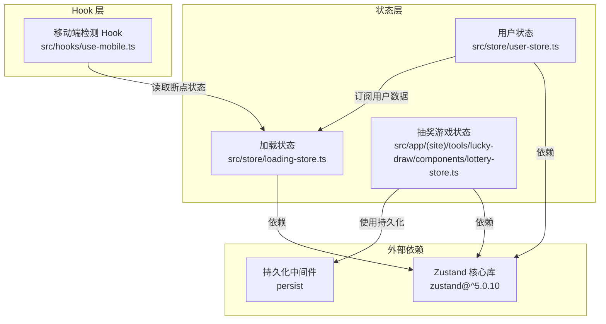
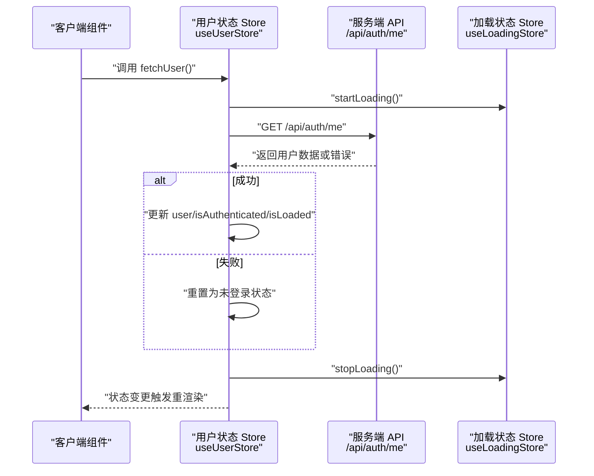
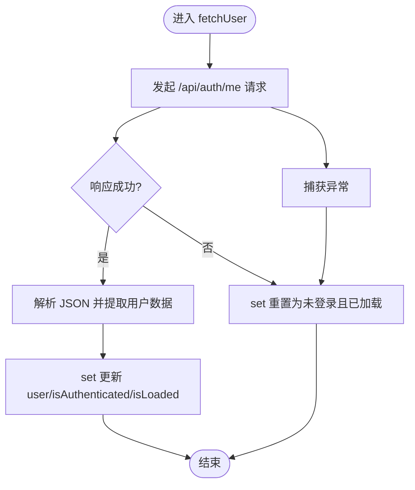
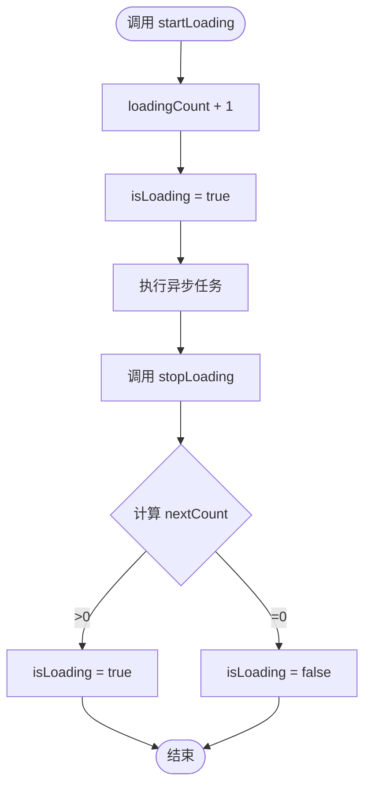
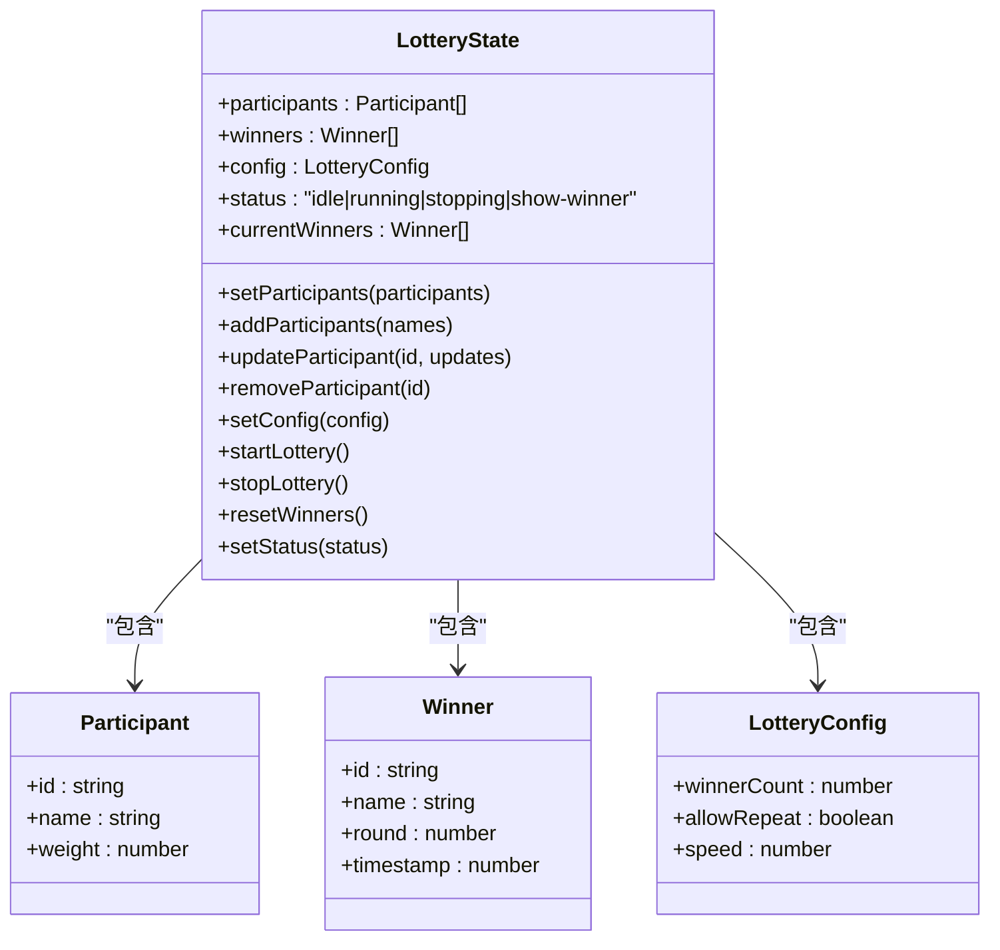
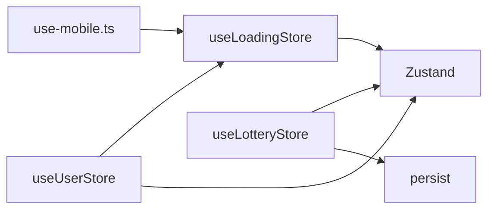

# 状态管理架构

<cite>
**本文引用的文件**
- [user-store.ts](file://src/store/user-store.ts)
- [loading-store.ts](file://src/store/loading-store.ts)
- [lottery-store.ts](file://src/app/(site)/tools/lucky-draw/components/lottery-store.ts)
- [use-mobile.ts](file://src/hooks/use-mobile.ts)
- [package.json](file://package.json)
- [analytics-tracker.tsx](file://src/components/analytics-tracker.tsx)
- [rerender-defer-reads.md](file://.agents/skills/vercel-react-best-practices/rules/rerender-defer-reads.md)
- [rerender-derived-state.md](file://.agents/skills/vercel-react-best-practices/rules/rerender-derived-state.md)
- [rerender-functional-setstate.md](file://.agents/skills/vercel-react-best-practices/rules/rerender-functional-setstate.md)
- [async-parallel.md](file://.agents/skills/vercel-react-best-practices/rules/async-parallel.md)
- [async-api-routes.md](file://.agents/skills/vercel-react-best-practices/rules/async-api-routes.md)
- [async-dependencies.md](file://.agents/skills/vercel-react-best-practices/rules/async-dependencies.md)
</cite>

## 目录
1. [简介](#简介)
2. [项目结构](#项目结构)
3. [核心组件](#核心组件)
4. [架构总览](#架构总览)
5. [详细组件分析](#详细组件分析)
6. [依赖关系分析](#依赖关系分析)
7. [性能考量](#性能考量)
8. [故障排查指南](#故障排查指南)
9. [结论](#结论)
10. [附录](#附录)

## 简介
本文件系统性梳理“一梦五千年”项目中的状态管理架构，重点围绕 Zustand 的集成与使用展开，覆盖以下主题：
- 全局状态设计：用户态、加载态、抽奖游戏态
- 状态更新机制与订阅模式：基于 Zustand 的 store 定义与 Hook 使用
- 客户端状态与服务器状态分离策略：通过 API 路由与服务端会话解耦
- 状态持久化方案：使用 persist 中间件实现本地存储
- 自定义 Hooks 设计模式与复用策略：use-mobile 响应式 Hook
- 状态同步机制、并发处理与错误恢复策略
- 状态调试工具、性能监控与最佳实践

## 项目结构
项目采用以功能域划分的目录组织方式，状态管理相关代码主要集中在以下位置：
- 全局状态：src/store 下的 user-store.ts、loading-store.ts
- 局部状态（示例）：src/app/(site)/tools/lucky-draw/components/lottery-store.ts
- 响应式 Hook：src/hooks/use-mobile.ts
- 外部依赖：package.json 中声明 zustand 及其 persist 中间件

图表来源
- [user-store.ts:1-49](file://src/store/user-store.ts#L1-L49)
- [loading-store.ts:1-28](file://src/store/loading-store.ts#L1-L28)
- [lottery-store.ts:1-54](file://src/app/(site)/tools/lucky-draw/components/lottery-store.ts#L1-L54)
- [use-mobile.ts:1-20](file://src/hooks/use-mobile.ts#L1-L20)
- [package.json:79](file://package.json#L79)

章节来源
- [user-store.ts:1-49](file://src/store/user-store.ts#L1-L49)
- [loading-store.ts:1-28](file://src/store/loading-store.ts#L1-L28)
- [lottery-store.ts:1-54](file://src/app/(site)/tools/lucky-draw/components/lottery-store.ts#L1-L54)
- [use-mobile.ts:1-20](file://src/hooks/use-mobile.ts#L1-L20)
- [package.json:79](file://package.json#L79)

## 核心组件
本节对三大核心状态模块进行深入解析：用户状态、加载状态与抽奖游戏状态。

- 用户状态（useUserStore）
  - 数据模型：用户基本信息、认证状态、加载完成标记
  - 关键动作：fetchUser（拉取用户信息）、logout（登出）、updateUser（局部更新）
  - 认证流程：通过 /api/auth/me 获取当前会话用户；异常或非 2xx 时重置为未登录
  - 登出流程：跳转至 /api/logto/sign-out，交由服务端销毁会话

- 加载状态（useLoadingStore）
  - 单一布尔 isLoading 与计数 loadingCount
  - 动作：setLoading（直接设置）、startLoading（+1 并置 true）、stopLoading（-1 并根据剩余计数决定是否仍为 true）
  - 设计目的：支持多处并发加载场景，避免竞态导致的误关闭

- 抽奖游戏状态（useLotteryStore）
  - 数据模型：参与者列表、历史获奖者、配置项（中奖人数、是否允许重复、速度）、运行状态、本轮获奖者
  - 动作：设置/添加/更新/移除参与者；设置配置；启动/停止/重置；状态切换
  - 持久化：使用 persist 中间件，将状态保存在本地存储，实现刷新后不丢失

章节来源
- [user-store.ts:12-48](file://src/store/user-store.ts#L12-L48)
- [loading-store.ts:3-27](file://src/store/loading-store.ts#L3-L27)
- [lottery-store.ts:23-54](file://src/app/(site)/tools/lucky-draw/components/lottery-store.ts#L23-L54)

## 架构总览
下图展示客户端状态与服务端状态的交互路径，以及持久化策略的应用：

图表来源
- [user-store.ts:26-38](file://src/store/user-store.ts#L26-L38)
- [loading-store.ts:16-26](file://src/store/loading-store.ts#L16-L26)

章节来源
- [user-store.ts:26-38](file://src/store/user-store.ts#L26-L38)
- [loading-store.ts:16-26](file://src/store/loading-store.ts#L16-L26)

## 详细组件分析

### 用户状态模块（useUserStore）
- 设计要点
  - 将用户态与认证态解耦：isLoaded 标记初始加载完成，避免空值判断误判
  - 异步 fetchUser 包裹 try/catch，确保即使网络异常也能稳定落盘为已加载且未登录
  - logout 通过页面跳转交由服务端处理，前端仅负责导航
- 订阅与更新
  - 组件通过 useUserStore(selector) 或直接订阅全量状态，按需选择字段减少重渲染
  - updateUser 使用函数式更新，避免闭包陷阱与不必要的回调重建

图表来源
- [user-store.ts:26-38](file://src/store/user-store.ts#L26-L38)

章节来源
- [user-store.ts:26-38](file://src/store/user-store.ts#L26-L38)

### 加载状态模块（useLoadingStore）
- 设计要点
  - loadingCount 支持嵌套/并发加载场景，startLoading/stopLoading 成对调用
  - 当计数归零时才关闭全局 isLoading，避免中间状态闪烁
- 最佳实践建议
  - 在复杂流程中统一使用 startLoading/stopLoading 包裹异步操作
  - 对于单次短任务可直接使用 setLoading，但长流程务必成对调用

图表来源
- [loading-store.ts:16-26](file://src/store/loading-store.ts#L16-L26)

章节来源
- [loading-store.ts:16-26](file://src/store/loading-store.ts#L16-L26)

### 抽奖游戏状态模块（useLotteryStore）
- 设计要点
  - 使用 persist 中间件将参与者、获奖记录、配置等状态持久化到本地存储
  - 状态机驱动：idle/running/stopping/show-winner 四种状态，配合当前轮次获奖者
  - 动作丰富：支持批量导入、权重调整、速度调节、多轮次统计
- 持久化策略
  - 通过 persist 包装器自动序列化/反序列化，避免刷新丢失
  - 可结合版本迁移策略在未来扩展（如新增字段）

图表来源
- [lottery-store.ts:4-40](file://src/app/(site)/tools/lucky-draw/components/lottery-store.ts#L4-L40)

章节来源
- [lottery-store.ts:42-54](file://src/app/(site)/tools/lucky-draw/components/lottery-store.ts#L42-L54)

### 响应式 Hook（useIsMobile）
- 设计要点
  - 基于 matchMedia 监听断点变化，首次初始化与变更均更新状态
  - 返回布尔值，便于组件按移动端/桌面端渲染不同布局
- 与最佳实践的契合
  - 遵循“订阅派生状态”的原则，避免监听连续数值导致频繁重渲染

章节来源
- [use-mobile.ts:5-19](file://src/hooks/use-mobile.ts#L5-L19)
- [rerender-derived-state.md:22-28](file://.agents/skills/vercel-react-best-practices/rules/rerender-derived-state.md#L22-L28)

## 依赖关系分析
- 内部依赖
  - 组件通过 useUserStore 与 useLoadingStore 解耦业务逻辑与状态管理
  - useLotteryStore 作为独立模块，内部聚合状态与动作，对外暴露稳定 API
- 外部依赖
  - Zustand 提供轻量级状态容器与订阅机制
  - persist 中间件提供本地持久化能力
- 潜在风险
  - 状态粒度过粗可能导致不必要的重渲染
  - 并发加载未正确配对 startLoading/stopLoading 可能造成 UI 错觉

图表来源
- [use-mobile.ts:1-20](file://src/hooks/use-mobile.ts#L1-L20)
- [loading-store.ts:1-28](file://src/store/loading-store.ts#L1-L28)
- [user-store.ts:1-49](file://src/store/user-store.ts#L1-L49)
- [lottery-store.ts:1-54](file://src/app/(site)/tools/lucky-draw/components/lottery-store.ts#L1-L54)
- [package.json:79](file://package.json#L79)

章节来源
- [package.json:79](file://package.json#L79)

## 性能考量
- 减少不必要订阅
  - 将动态参数（如 searchParams、localStorage）的读取延迟到使用点，避免持续订阅导致的重渲染
- 订阅派生状态
  - 使用布尔派生状态替代连续数值，降低重渲染频率
- 函数式 setState 更新
  - 基于当前状态的更新优先使用函数式形式，避免闭包陷阱与回调重建
- 并发与流水线优化
  - 对无依赖的异步操作使用 Promise.all 并发执行
  - 在 API 路由中尽早启动独立任务，最大化并行度
- 加载态一致性
  - 所有并发加载必须成对调用 startLoading/stopLoading，保证 UI 状态一致

章节来源
- [rerender-defer-reads.md:10-25](file://.agents/skills/vercel-react-best-practices/rules/rerender-defer-reads.md#L10-L25)
- [rerender-derived-state.md:10-28](file://.agents/skills/vercel-react-best-practices/rules/rerender-derived-state.md#L10-L28)
- [rerender-functional-setstate.md:61-75](file://.agents/skills/vercel-react-best-practices/rules/rerender-functional-setstate.md#L61-L75)
- [async-parallel.md:10-28](file://.agents/skills/vercel-react-best-practices/rules/async-parallel.md#L10-L28)
- [async-api-routes.md:10-35](file://.agents/skills/vercel-react-best-practices/rules/async-api-routes.md#L10-L35)
- [loading-store.ts:16-26](file://src/store/loading-store.ts#L16-L26)

## 故障排查指南
- 用户状态无法更新
  - 检查 /api/auth/me 是否返回 2xx；确认 fetchUser 的 try/catch 分支是否被触发
  - 确认组件是否正确订阅所需字段，避免因选择器导致的遗漏
- 登出无效
  - 确认 logout 导航是否命中 /api/logto/sign-out；检查浏览器是否阻止了新窗口/标签页
- 加载态卡住
  - 排查是否存在 startLoading 调用但未调用 stopLoading 的分支
  - 检查并发场景下多个 startLoading 是否被正确抵消
- 抽奖状态丢失
  - 确认 persist 中间件已正确包裹 store 创建；检查浏览器本地存储权限与容量
- 性能问题
  - 使用 DevTools 分析重渲染热点；遵循“订阅派生状态”与“函数式 setState 更新”的最佳实践

章节来源
- [user-store.ts:26-42](file://src/store/user-store.ts#L26-L42)
- [loading-store.ts:16-26](file://src/store/loading-store.ts#L16-L26)
- [lottery-store.ts:42-54](file://src/app/(site)/tools/lucky-draw/components/lottery-store.ts#L42-L54)

## 结论
本项目以 Zustand 为核心构建了清晰、可维护的状态管理架构：
- 用户态、加载态与局部游戏态分别封装，职责明确
- 通过 API 路由与服务端会话实现客户端状态与服务器状态的解耦
- 使用 persist 实现关键状态的本地持久化，提升用户体验
- 配合响应式 Hook 与最佳实践，有效控制重渲染与并发性能
建议后续在大型模块中引入更细粒度的选择器与状态切片，进一步降低订阅范围与内存占用。

## 附录
- 状态调试与监控
  - 在开发环境可利用 React DevTools 的组件树与 Profiler 观察重渲染
  - 对关键 API 调用（如 /api/auth/me）增加日志埋点，结合 analytics-tracker 追踪异常
- 版本与依赖
  - Zustand 与 persist 版本见 package.json

章节来源
- [analytics-tracker.tsx:55-70](file://src/components/analytics-tracker.tsx#L55-L70)
- [package.json:79](file://package.json#L79)