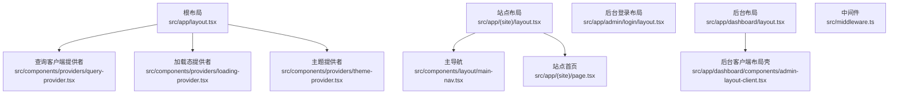
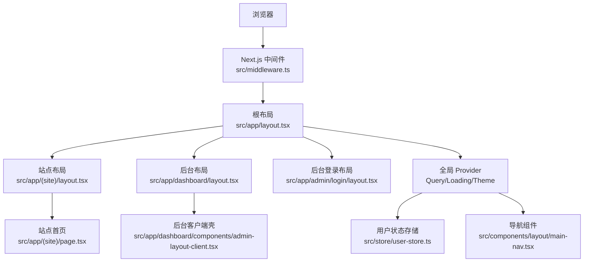
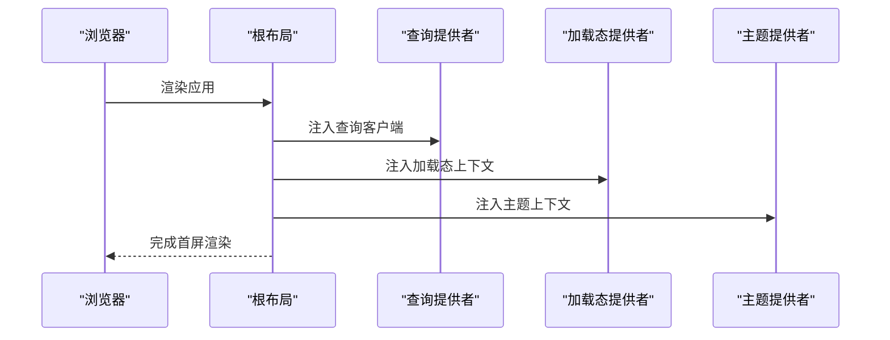
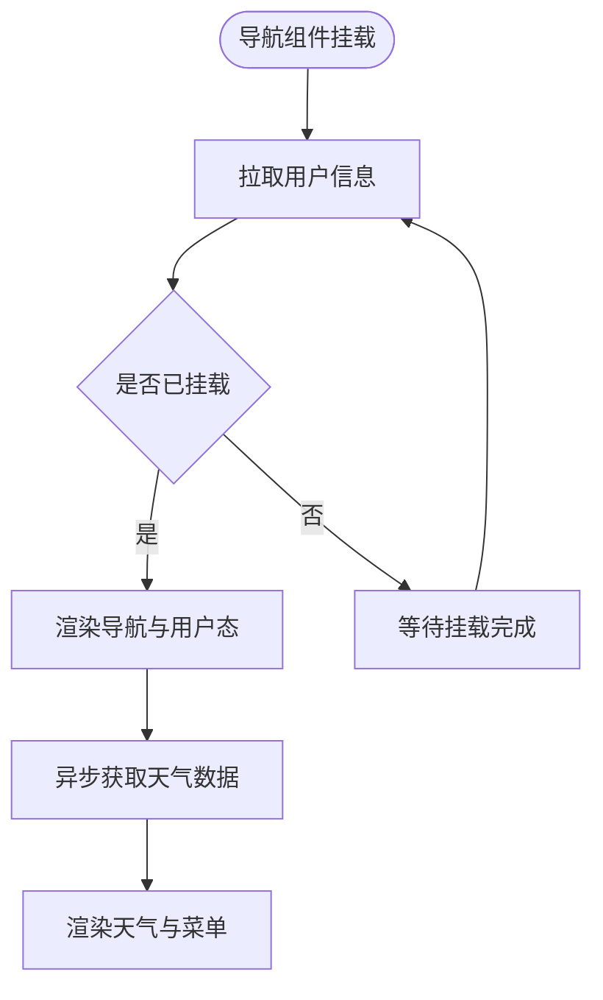
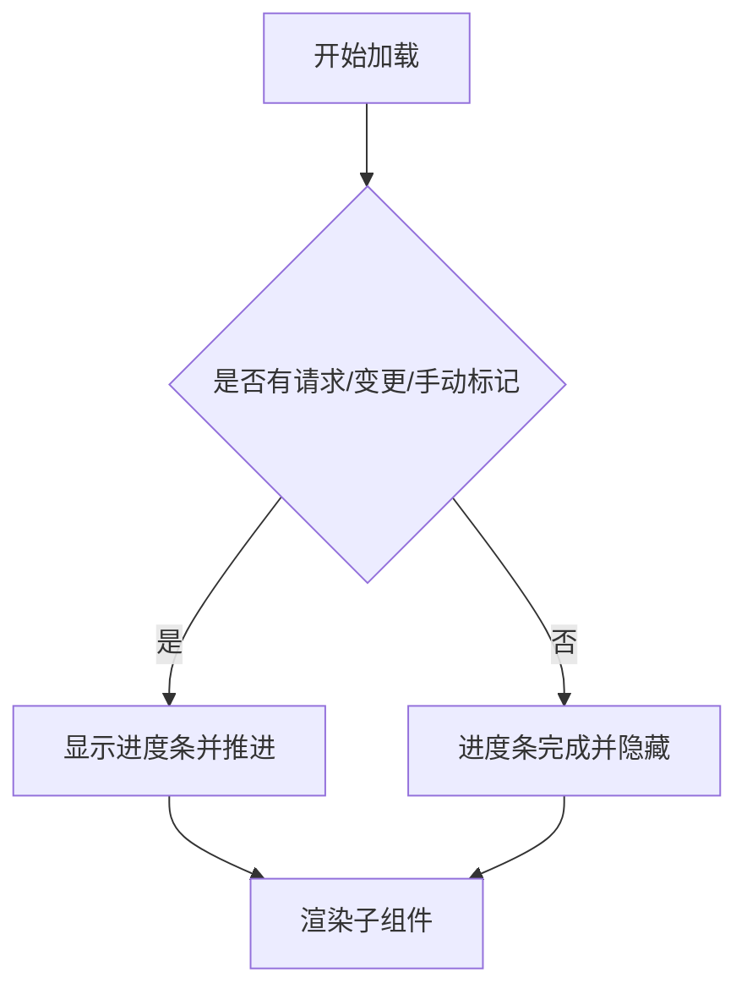
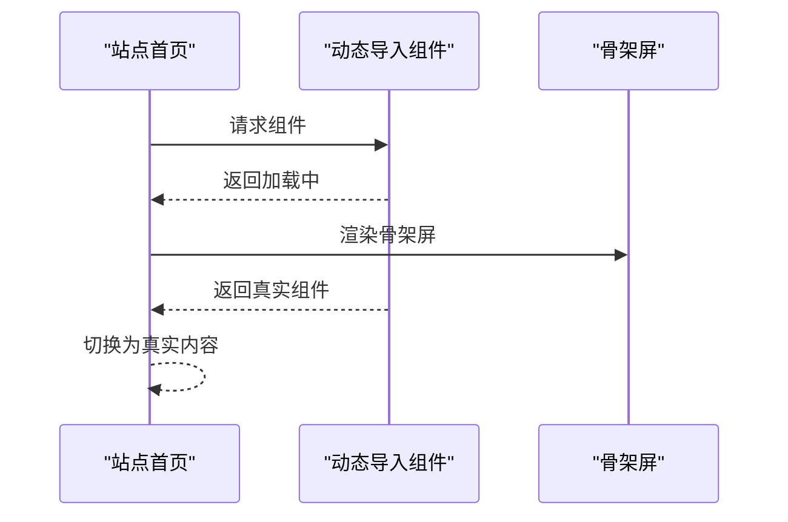
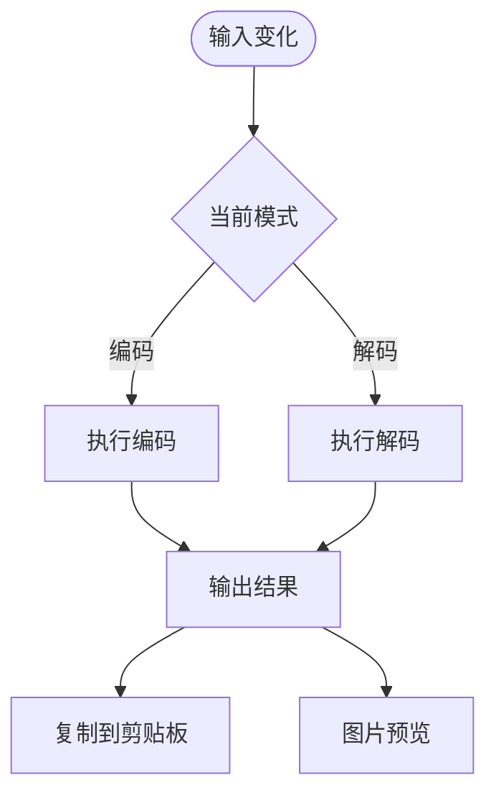
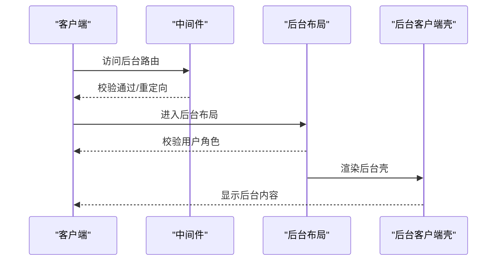
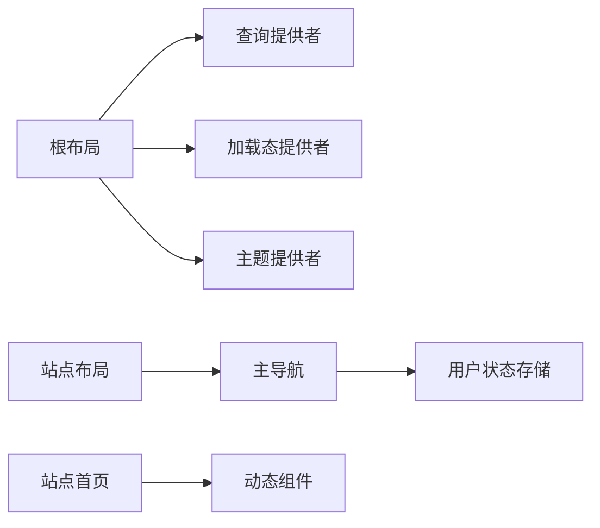

# 组件架构设计

<cite>
**本文引用的文件**
- [src/app/layout.tsx](file://src/app/layout.tsx)
- [src/app/(site)/layout.tsx](file://src/app/(site)/layout.tsx)
- [src/app/admin/login/layout.tsx](file://src/app/admin/login/layout.tsx)
- [src/components/providers/query-provider.tsx](file://src/components/providers/query-provider.tsx)
- [src/components/providers/loading-provider.tsx](file://src/components/providers/loading-provider.tsx)
- [src/components/providers/theme-provider.tsx](file://src/components/providers/theme-provider.tsx)
- [src/components/layout/main-nav.tsx](file://src/components/layout/main-nav.tsx)
- [src/store/user-store.ts](file://src/store/user-store.ts)
- [src/components/common/loading.tsx](file://src/components/common/loading.tsx)
- [src/app/(site)/page.tsx](file://src/app/(site)/page.tsx)
- [src/components/tools/base64-converter.tsx](file://src/components/tools/base64-converter.tsx)
- [src/app/dashboard/layout.tsx](file://src/app/dashboard/layout.tsx)
- [src/middleware.ts](file://src/middleware.ts)
</cite>

## 目录
1. [引言](#引言)
2. [项目结构](#项目结构)
3. [核心组件](#核心组件)
4. [架构总览](#架构总览)
5. [组件详细分析](#组件详细分析)
6. [依赖关系分析](#依赖关系分析)
7. [性能考量](#性能考量)
8. [故障排查指南](#故障排查指南)
9. [结论](#结论)
10. [附录](#附录)

## 引言
本设计文档面向“一梦五千年”项目，系统化梳理基于 Next.js App Router 的组件架构，明确 Server Components 与 Client Components 的职责边界与使用场景；阐释页面组件、布局组件、通用组件的设计原则与组织方式；总结组件间通信机制、Props 传递模式与事件处理策略；并给出可复用性、可维护性与性能优化实践建议，覆盖生命周期管理、错误边界与国际化支持方案。

## 项目结构
项目采用 App Router 的文件系统路由与分组目录组织页面与布局。根布局负责全局 Provider 注入与主题、加载态、分析追踪等横切关注点；站点布局包裹业务页面，统一头部导航与页脚；后台与认证相关页面采用独立分组与专用布局；工具类页面按功能模块拆分至各自目录，便于扩展与复用。

图表来源
- [src/app/layout.tsx:1-52](file://src/app/layout.tsx#L1-L52)
- [src/app/(site)/layout.tsx:1-28](file://src/app/(site)/layout.tsx#L1-L28)
- [src/app/admin/login/layout.tsx:1-23](file://src/app/admin/login/layout.tsx#L1-L23)
- [src/app/dashboard/layout.tsx:1-26](file://src/app/dashboard/layout.tsx#L1-L26)
- [src/middleware.ts:1-36](file://src/middleware.ts#L1-L36)

章节来源
- [src/app/layout.tsx:1-52](file://src/app/layout.tsx#L1-L52)
- [src/app/(site)/layout.tsx:1-28](file://src/app/(site)/layout.tsx#L1-L28)
- [src/app/admin/login/layout.tsx:1-23](file://src/app/admin/login/layout.tsx#L1-L23)
- [src/app/dashboard/layout.tsx:1-26](file://src/app/dashboard/layout.tsx#L1-L26)
- [src/middleware.ts:1-36](file://src/middleware.ts#L1-L36)

## 核心组件
- 根布局与全局 Provider
  - 负责注入查询缓存、加载进度条、主题切换、分析追踪与全局样式。
  - 使用 Suspense 包裹分析组件以避免阻塞首屏渲染。
- 站点布局与导航
  - 站点布局统一头部与页脚，主导航集成用户态、移动端抽屉、天气信息与登录入口。
  - 用户态通过 Zustand 状态管理，结合服务端会话校验实现登录状态持久化。
- 加载态与骨架屏
  - 基于 React Query 的并发请求与手动加载标记，统一展示顶部进度条与全屏加载覆盖层。
- 页面与动态加载
  - 首页对多个大组件进行动态导入，并配合骨架屏占位，降低首屏阻塞。
- 工具组件
  - 典型工具组件（如 Base64 转换器）采用受控表单、实时计算与交互反馈，强调用户体验与错误提示。

章节来源
- [src/app/layout.tsx:1-52](file://src/app/layout.tsx#L1-L52)
- [src/components/providers/query-provider.tsx:1-22](file://src/components/providers/query-provider.tsx#L1-L22)
- [src/components/providers/loading-provider.tsx:1-49](file://src/components/providers/loading-provider.tsx#L1-L49)
- [src/components/layout/main-nav.tsx:1-262](file://src/components/layout/main-nav.tsx#L1-L262)
- [src/store/user-store.ts:1-49](file://src/store/user-store.ts#L1-L49)
- [src/components/common/loading.tsx:1-133](file://src/components/common/loading.tsx#L1-L133)
- [src/app/(site)/page.tsx:1-40](file://src/app/(site)/page.tsx#L1-L40)
- [src/components/tools/base64-converter.tsx:1-157](file://src/components/tools/base64-converter.tsx#L1-L157)

## 架构总览
整体采用“根布局 + 分组布局 + 页面”的层级结构，配合中间件进行权限拦截与重定向。客户端侧通过 Provider 层统一注入第三方库能力，组件内部按需使用状态与副作用。

图表来源
- [src/middleware.ts:1-36](file://src/middleware.ts#L1-L36)
- [src/app/layout.tsx:1-52](file://src/app/layout.tsx#L1-L52)
- [src/app/(site)/layout.tsx:1-28](file://src/app/(site)/layout.tsx#L1-L28)
- [src/app/dashboard/layout.tsx:1-26](file://src/app/dashboard/layout.tsx#L1-L26)
- [src/app/admin/login/layout.tsx:1-23](file://src/app/admin/login/layout.tsx#L1-L23)
- [src/app/(site)/page.tsx:1-40](file://src/app/(site)/page.tsx#L1-L40)
- [src/store/user-store.ts:1-49](file://src/store/user-store.ts#L1-L49)
- [src/components/layout/main-nav.tsx:1-262](file://src/components/layout/main-nav.tsx#L1-L262)

## 组件详细分析

### 根布局与全局 Provider
- 职责划分
  - 根布局：注入字体、全局样式、全局 Provider 与分析追踪；作为应用外壳。
  - 查询提供者：配置 React Query 默认过期时间，统一数据获取策略。
  - 加载态提供者：聚合请求与手动加载，驱动顶部进度条与覆盖层。
  - 主题提供者：封装 next-themes，统一深浅色主题切换。
- 使用场景
  - 根布局适合放置所有页面共享的 Provider 与全局样式。
  - 查询与加载 Provider 应置于根布局内，确保全局可用。
- 通信与事件
  - 通过 React Context 与 Zustand Store 传递状态；事件由子组件触发并向上冒泡或通过回调函数传递。
- 性能优化
  - 将昂贵组件延迟加载；利用 Suspense 降级与骨架屏减少白屏时间。
- 错误边界与国际化
  - 可在根布局增加错误边界包装；国际化可通过多语言资源与路由参数扩展。

图表来源
- [src/app/layout.tsx:1-52](file://src/app/layout.tsx#L1-L52)
- [src/components/providers/query-provider.tsx:1-22](file://src/components/providers/query-provider.tsx#L1-L22)
- [src/components/providers/loading-provider.tsx:1-49](file://src/components/providers/loading-provider.tsx#L1-L49)
- [src/components/providers/theme-provider.tsx:1-13](file://src/components/providers/theme-provider.tsx#L1-L13)

章节来源
- [src/app/layout.tsx:1-52](file://src/app/layout.tsx#L1-L52)
- [src/components/providers/query-provider.tsx:1-22](file://src/components/providers/query-provider.tsx#L1-L22)
- [src/components/providers/loading-provider.tsx:1-49](file://src/components/providers/loading-provider.tsx#L1-L49)
- [src/components/providers/theme-provider.tsx:1-13](file://src/components/providers/theme-provider.tsx#L1-L13)

### 站点布局与导航组件
- 设计原则
  - 响应式设计：桌面端使用导航菜单，移动端使用抽屉菜单。
  - 用户态感知：根据登录状态显示用户名、角色入口与登出操作。
  - 天气信息：异步获取并展示，避免阻塞主流程。
- 组织方式
  - 导航组件为客户端组件，依赖用户状态存储与路径信息。
  - 站点布局仅负责结构与容器，不承载业务逻辑。
- 通信机制
  - 用户状态通过 Zustand Store 提供；事件通过按钮点击与链接跳转触发。
- 生命周期管理
  - 首次挂载时拉取用户信息；卸载时清理定时器与副作用。
- 国际化支持
  - 导航文案与提示语可抽象为本地化键值，按语言切换。

图表来源
- [src/components/layout/main-nav.tsx:1-262](file://src/components/layout/main-nav.tsx#L1-L262)
- [src/store/user-store.ts:1-49](file://src/store/user-store.ts#L1-L49)

章节来源
- [src/app/(site)/layout.tsx:1-28](file://src/app/(site)/layout.tsx#L1-L28)
- [src/components/layout/main-nav.tsx:1-262](file://src/components/layout/main-nav.tsx#L1-L262)
- [src/store/user-store.ts:1-49](file://src/store/user-store.ts#L1-L49)

### 加载态与骨架屏
- 设计原则
  - 顶部进度条：反映全局请求与手动加载状态，避免用户困惑。
  - 全屏覆盖层：在需要时阻断交互，提升体验一致性。
- 组织方式
  - 进度条与覆盖层均通过 Provider 管理可见性与进度，组件按需消费状态。
- 通信机制
  - React Query 的并发状态与手动状态共同决定加载态；通过状态订阅更新 UI。
- 性能优化
  - 合理设置 staleTime，减少重复请求；对大组件使用动态导入与骨架屏。

图表来源
- [src/components/providers/loading-provider.tsx:1-49](file://src/components/providers/loading-provider.tsx#L1-L49)
- [src/components/common/loading.tsx:1-133](file://src/components/common/loading.tsx#L1-L133)

章节来源
- [src/components/providers/loading-provider.tsx:1-49](file://src/components/providers/loading-provider.tsx#L1-L49)
- [src/components/common/loading.tsx:1-133](file://src/components/common/loading.tsx#L1-L133)

### 页面与动态加载
- 设计原则
  - 首页对多个大组件进行动态导入，并提供骨架屏占位，降低 TTFB 与白屏时间。
- 组织方式
  - 页面组件仅负责组合与占位，具体实现延迟加载。
- 通信机制
  - 子组件通过 props 接收数据与回调；事件通过回调函数传递给父组件。

图表来源
- [src/app/(site)/page.tsx:1-40](file://src/app/(site)/page.tsx#L1-L40)

章节来源
- [src/app/(site)/page.tsx:1-40](file://src/app/(site)/page.tsx#L1-L40)

### 工具组件示例（Base64 转换器）
- 设计原则
  - 实时计算：输入变化即时响应；错误容错，避免中断体验。
  - 交互反馈：复制、清空、交换等操作提供明确反馈。
  - 文件上传：支持图片转 Base64 并预览。
- 组织方式
  - 客户端组件，内部状态自洽；通过外部回调或全局通知提供反馈。
- 通信机制
  - 表单受控；Tab 切换与模式切换通过状态驱动；文件上传通过事件处理器处理。

图表来源
- [src/components/tools/base64-converter.tsx:1-157](file://src/components/tools/base64-converter.tsx#L1-L157)

章节来源
- [src/components/tools/base64-converter.tsx:1-157](file://src/components/tools/base64-converter.tsx#L1-L157)

### 后台布局与权限控制
- 设计原则
  - 后台布局在服务端校验用户身份与角色，非管理员或未登录直接重定向。
  - 客户端壳负责后台侧边栏与内容区结构。
- 组织方式
  - 服务端布局负责鉴权与重定向；客户端壳负责 UI 结构与交互。
- 通信机制
  - 通过服务端会话与中间件传递认证上下文；客户端通过路由与状态管理维持界面。

图表来源
- [src/middleware.ts:1-36](file://src/middleware.ts#L1-L36)
- [src/app/dashboard/layout.tsx:1-26](file://src/app/dashboard/layout.tsx#L1-L26)

章节来源
- [src/app/dashboard/layout.tsx:1-26](file://src/app/dashboard/layout.tsx#L1-L26)
- [src/middleware.ts:1-36](file://src/middleware.ts#L1-L36)

## 依赖关系分析
- 组件耦合
  - 根布局与 Provider 高内聚，低耦合其他页面；页面与布局通过 children 组合，保持清晰边界。
  - 导航组件依赖用户状态存储与路由信息，形成弱耦合的数据流。
- 外部依赖
  - React Query 提供数据获取与缓存；Zustand 提供轻量状态管理；next-themes 提供主题切换。
- 潜在循环依赖
  - 当前结构未见循环依赖；Provider 位于根部，向下单向注入。

图表来源
- [src/app/layout.tsx:1-52](file://src/app/layout.tsx#L1-L52)
- [src/app/(site)/layout.tsx:1-28](file://src/app/(site)/layout.tsx#L1-L28)
- [src/components/providers/query-provider.tsx:1-22](file://src/components/providers/query-provider.tsx#L1-L22)
- [src/components/providers/loading-provider.tsx:1-49](file://src/components/providers/loading-provider.tsx#L1-L49)
- [src/components/providers/theme-provider.tsx:1-13](file://src/components/providers/theme-provider.tsx#L1-L13)
- [src/components/layout/main-nav.tsx:1-262](file://src/components/layout/main-nav.tsx#L1-L262)
- [src/store/user-store.ts:1-49](file://src/store/user-store.ts#L1-L49)
- [src/app/(site)/page.tsx:1-40](file://src/app/(site)/page.tsx#L1-L40)

章节来源
- [src/app/layout.tsx:1-52](file://src/app/layout.tsx#L1-L52)
- [src/app/(site)/layout.tsx:1-28](file://src/app/(site)/layout.tsx#L1-L28)
- [src/components/providers/query-provider.tsx:1-22](file://src/components/providers/query-provider.tsx#L1-L22)
- [src/components/providers/loading-provider.tsx:1-49](file://src/components/providers/loading-provider.tsx#L1-L49)
- [src/components/providers/theme-provider.tsx:1-13](file://src/components/providers/theme-provider.tsx#L1-L13)
- [src/components/layout/main-nav.tsx:1-262](file://src/components/layout/main-nav.tsx#L1-L262)
- [src/store/user-store.ts:1-49](file://src/store/user-store.ts#L1-L49)
- [src/app/(site)/page.tsx:1-40](file://src/app/(site)/page.tsx#L1-L40)

## 性能考量
- 动态导入与懒加载
  - 对大组件使用动态导入与骨架屏，降低首屏阻塞。
- 查询缓存策略
  - 设置合理的 staleTime，减少重复请求；利用并发请求与去重策略。
- 加载态可视化
  - 顶部进度条与覆盖层提升感知性能，避免用户误以为卡顿。
- 图像与第三方资源
  - 使用现代图片格式与懒加载；对第三方脚本进行条件加载与预连接。
- 代码分割与打包优化
  - 按需引入与条件分支，避免不必要的包体积增长。

## 故障排查指南
- 加载态异常
  - 检查查询客户端配置与手动加载标记；确认 Provider 注入顺序正确。
- 导航状态不同步
  - 核对用户状态存储初始化与服务端会话同步；检查路径匹配与导航高亮逻辑。
- 权限重定向问题
  - 确认中间件匹配规则与重定向目标；检查服务端布局的用户校验逻辑。
- 分析追踪与错误上报
  - 在根布局 Suspense 中包裹分析组件，避免阻塞；必要时添加错误边界捕获未处理异常。

章节来源
- [src/components/providers/loading-provider.tsx:1-49](file://src/components/providers/loading-provider.tsx#L1-L49)
- [src/components/layout/main-nav.tsx:1-262](file://src/components/layout/main-nav.tsx#L1-L262)
- [src/middleware.ts:1-36](file://src/middleware.ts#L1-L36)
- [src/app/layout.tsx:1-52](file://src/app/layout.tsx#L1-L52)

## 结论
本项目基于 Next.js App Router 形成了清晰的层次化组件架构：根布局集中注入全局能力，分组布局与页面组件各司其职；客户端组件通过 Provider 与状态管理实现松耦合通信。通过动态导入、骨架屏、查询缓存与加载态可视化，显著提升了首屏性能与用户体验。后续可在国际化、错误边界与更细粒度的状态拆分上持续演进。

## 附录
- 国际化支持建议
  - 将文案抽取为本地化键值；按语言切换动态加载资源；在路由或请求头中识别语言偏好。
- 错误边界与日志
  - 在根布局或关键布局处增加错误边界；结合分析追踪记录错误堆栈与上下文。
- 组件复用与规范
  - 抽象通用 UI 为可复用组件；统一 Props 规范与事件命名；为复杂组件提供 Storybook 示例。