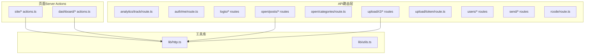
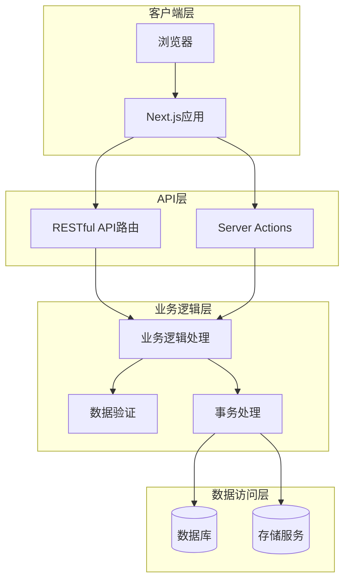
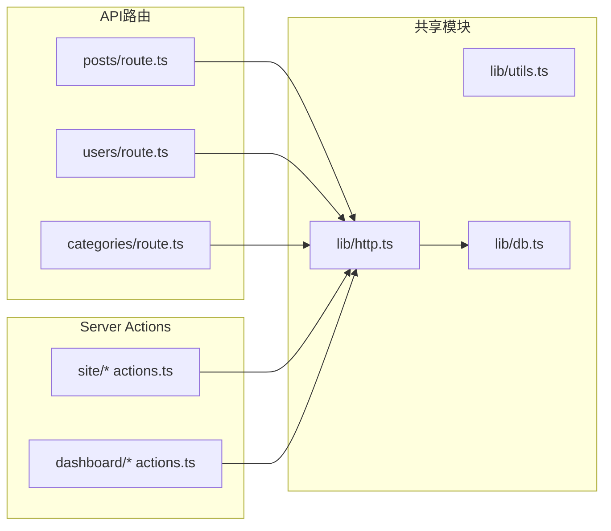

# API设计规范

<cite>
**本文档引用的文件**
- [src/app/api/analytics/track/route.ts](file://src/app/api/analytics/track/route.ts)
- [src/app/api/auth/me/route.ts](file://src/app/api/auth/me/route.ts)
- [src/app/api/logto/callback/route.ts](file://src/app/api/logto/callback/route.ts)
- [src/app/api/logto/sign-in/route.ts](file://src/app/api/logto/sign-in/route.ts)
- [src/app/api/logto/sign-out/route.ts](file://src/app/api/logto/sign-out/route.ts)
- [src/app/api/open/categories/route.ts](file://src/app/api/open/categories/route.ts)
- [src/app/api/open/posts/[id]/route.ts](file://src/app/api/open/posts/[id]/route.ts)
- [src/app/api/open/posts/route.ts](file://src/app/api/open/posts/route.ts)
- [src/app/api/open/posts/slug/[slug]/route.ts](file://src/app/api/open/posts/slug/[slug]/route.ts)
- [src/app/api/rcode/route.ts](file://src/app/api/rcode/route.ts)
- [src/app/api/send/notification/route.ts](file://src/app/api/send/notification/route.ts)
- [src/app/api/send/route.ts](file://src/app/api/send/route.ts)
- [src/app/api/upload/r2/token/route.ts](file://src/app/api/upload/r2/token/route.ts)
- [src/app/api/upload/r2/upload/route.ts](file://src/app/api/upload/r2/upload/route.ts)
- [src/app/api/upload/r2/url/route.ts](file://src/app/api/upload/r2/url/route.ts)
- [src/app/api/upload/token/route.ts](file://src/app/api/upload/token/route.ts)
- [src/app/api/users/[id]/route.ts](file://src/app/api/users/[id]/route.ts)
- [src/app/api/users/route.ts](file://src/app/api/users/route.ts)
- [src/app/(site)/ai-platform/actions.ts](file://src/app/(site)/ai-platform/actions.ts)
- [src/app/(site)/friends/actions.ts](file://src/app/(site)/friends/actions.ts)
- [src/app/(site)/graph/actions.ts](file://src/app/(site)/graph/actions.ts)
- [src/app/(site)/tools/actions.ts](file://src/app/(site)/tools/actions.ts)
- [src/app/dashboard/ai-tools/actions.ts](file://src/app/dashboard/ai-tools/actions.ts)
- [src/app/dashboard/categories/actions.ts](file://src/app/dashboard/categories/actions.ts)
- [src/app/dashboard/comments/actions.ts](file://src/app/dashboard/comments/actions.ts)
- [src/app/dashboard/email-logs/actions.ts](file://src/app/dashboard/email-logs/actions.ts)
- [src/app/dashboard/friend-links/actions.ts](file://src/app/dashboard/friend-links/actions.ts)
- [src/app/dashboard/overview/actions.ts](file://src/app/dashboard/overview/actions.ts)
- [src/app/dashboard/posts/actions.ts](file://src/app/dashboard/posts/actions.ts)
- [src/app/dashboard/tools/actions.ts](file://src/app/dashboard/tools/actions.ts)
- [src/app/dashboard/users/actions.ts](file://src/app/dashboard/users/actions.ts)
- [src/lib/http.ts](file://src/lib/http.ts)
- [src/lib/utils.ts](file://src/lib/utils.ts)
</cite>

## 目录
1. [引言](#引言)
2. [项目结构](#项目结构)
3. [核心组件](#核心组件)
4. [架构概览](#架构概览)
5. [详细组件分析](#详细组件分析)
6. [依赖分析](#依赖分析)
7. [性能考虑](#性能考虑)
8. [故障排除指南](#故障排除指南)
9. [结论](#结论)
10. [附录](#附录)

## 引言
本文件为"一梦五千年"项目制定统一的API设计规范，基于Next.js App Router架构，涵盖RESTful API设计原则、Server Actions实现模式、响应格式标准化、错误处理机制以及版本管理策略。目标是确保API的一致性、可维护性和扩展性。

## 项目结构
项目采用Next.js App Router的分层组织方式，API路由位于`src/app/api`目录下，按功能域划分子目录；同时在各页面中提供Server Actions用于表单提交和数据操作。



**图表来源**
- [src/app/api/analytics/track/route.ts:1-50](file://src/app/api/analytics/track/route.ts#L1-L50)
- [src/app/api/open/posts/route.ts:1-150](file://src/app/api/open/posts/route.ts#L1-L150)
- [src/app/(site)/ai-platform/actions.ts](file://src/app/(site)/ai-platform/actions.ts#L1-L80)
- [src/app/dashboard/posts/actions.ts:1-120](file://src/app/dashboard/posts/actions.ts#L1-L120)

**章节来源**
- [src/app/api/analytics/track/route.ts:1-50](file://src/app/api/analytics/track/route.ts#L1-L50)
- [src/app/api/open/posts/route.ts:1-150](file://src/app/api/open/posts/route.ts#L1-L150)
- [src/app/(site)/ai-platform/actions.ts](file://src/app/(site)/ai-platform/actions.ts#L1-L80)

## 核心组件
本项目包含两类主要API实现方式：

### RESTful API路由
基于Next.js App Router的API路由，遵循RESTful设计原则：
- 使用标准HTTP方法：GET、POST、PUT、DELETE
- 路径采用名词复数形式表示资源集合
- 单个资源使用路径参数标识
- 支持查询参数进行过滤和分页

### Server Actions
页面内的服务器动作，提供：
- 表单提交的服务器端处理
- 数据验证和业务逻辑封装
- 与客户端组件的直接交互
- 自动的状态更新和重定向

**章节来源**
- [src/app/api/open/posts/route.ts:1-150](file://src/app/api/open/posts/route.ts#L1-L150)
- [src/app/(site)/friends/actions.ts](file://src/app/(site)/friends/actions.ts#L1-L60)
- [src/app/dashboard/users/actions.ts:1-100](file://src/app/dashboard/users/actions.ts#L1-L100)

## 架构概览
系统采用分层架构，清晰分离API路由、Server Actions和底层服务。



**图表来源**
- [src/app/api/users/route.ts:1-120](file://src/app/api/users/route.ts#L1-L120)
- [src/app/dashboard/posts/actions.ts:1-120](file://src/app/dashboard/posts/actions.ts#L1-L120)
- [src/lib/db.ts:1-50](file://src/lib/db.ts#L1-L50)

## 详细组件分析

### RESTful API路由设计

#### 资源命名规范
所有API路由均采用名词复数形式表示资源集合，如`posts`、`users`、`categories`等。单个资源通过路径参数访问，如`/api/posts/[id]`。

#### HTTP方法使用标准
- GET：获取资源列表或单个资源
- POST：创建新资源
- PUT：更新完整资源
- DELETE：删除资源
- PATCH：部分更新资源

#### URL路径设计模式
API路由遵循层次化设计：
```
/api/{resource}/{id?}
/api/{resource}/slug/{slug}
/api/{category}/{subcategory}/{id?}
```

**章节来源**
- [src/app/api/open/posts/[id]/route.ts](file://src/app/api/open/posts/[id]/route.ts#L1-L50)
- [src/app/api/open/posts/slug/[slug]/route.ts](file://src/app/api/open/posts/slug/[slug]/route.ts#L1-L50)
- [src/app/api/users/[id]/route.ts](file://src/app/api/users/[id]/route.ts#L1-L80)

### Server Actions实现模式

#### 数据验证机制
Server Actions采用Zod schema进行数据验证，确保输入数据的完整性和正确性。

#### 错误处理策略
- 使用try-catch捕获异常
- 返回标准化的错误响应
- 区分业务错误和系统错误

#### 状态管理
- 自动触发客户端状态更新
- 支持重定向和刷新
- 提供加载状态反馈

**章节来源**
- [src/app/(site)/tools/actions.ts](file://src/app/(site)/tools/actions.ts#L1-L100)
- [src/app/dashboard/categories/actions.ts:1-120](file://src/app/dashboard/categories/actions.ts#L1-L120)

### 响应格式标准化

#### 成功响应格式
```typescript
{
  success: true,
  data: any,
  message?: string
}
```

#### 错误响应格式
```typescript
{
  success: false,
  error: {
    code: string,
    message: string,
    details?: any
  }
}
```

#### 分页响应格式
```typescript
{
  success: true,
  data: {
    items: any[],
    pagination: {
      page: number,
      limit: number,
      total: number,
      totalPages: number
    }
  }
}
```

**章节来源**
- [src/lib/http.ts:1-100](file://src/lib/http.ts#L1-L100)
- [src/app/api/open/posts/route.ts:1-150](file://src/app/api/open/posts/route.ts#L1-L150)

### 错误码定义规范

#### 业务错误码
- `VALIDATION_ERROR`: 数据验证失败
- `NOT_FOUND`: 资源不存在
- `UNAUTHORIZED`: 未授权访问
- `FORBIDDEN`: 权限不足
- `INTERNAL_ERROR`: 内部服务器错误

#### 系统错误码
- `DATABASE_ERROR`: 数据库操作失败
- `UPLOAD_ERROR`: 文件上传失败
- `EMAIL_ERROR`: 邮件发送失败

**章节来源**
- [src/lib/utils.ts:1-100](file://src/lib/utils.ts#L1-L100)
- [src/app/api/send/route.ts:1-80](file://src/app/api/send/route.ts#L1-L80)

## 依赖分析

### 组件耦合关系


**图表来源**
- [src/app/api/open/posts/route.ts:1-150](file://src/app/api/open/posts/route.ts#L1-L150)
- [src/app/dashboard/posts/actions.ts:1-120](file://src/app/dashboard/posts/actions.ts#L1-L120)
- [src/lib/http.ts:1-100](file://src/lib/http.ts#L1-L100)

### 外部依赖集成
项目集成了多个外部服务：
- **Logto**: 用户认证服务
- **Cloudflare R2**: 对象存储服务
- **邮件服务**: 通知和验证邮件
- **Prisma**: 数据库ORM

**章节来源**
- [src/app/api/logto/callback/route.ts:1-50](file://src/app/api/logto/callback/route.ts#L1-L50)
- [src/app/api/upload/r2/upload/route.ts:1-80](file://src/app/api/upload/r2/upload/route.ts#L1-L80)

## 性能考虑
- **缓存策略**: 实现多级缓存（内存、Redis、CDN）
- **批量操作**: 支持批量数据处理减少请求次数
- **分页优化**: 默认限制查询数量防止性能问题
- **并发控制**: 实现请求频率限制和防抖机制

## 故障排除指南

### 常见问题诊断
1. **API路由无法访问**
   - 检查文件命名是否符合Next.js约定
   - 验证导出函数签名是否正确

2. **Server Actions不工作**
   - 确认组件已正确导入actions模块
   - 检查数据验证schema配置

3. **数据库连接失败**
   - 验证环境变量配置
   - 检查Prisma连接池设置

**章节来源**
- [src/lib/db.ts:1-50](file://src/lib/db.ts#L1-L50)
- [src/lib/http.ts:1-100](file://src/lib/http.ts#L1-L100)

## 结论
本规范为"一梦五千年"项目提供了统一的API设计指导原则。通过标准化的RESTful API设计、规范化的Server Actions实现、统一的响应格式和完善的错误处理机制，确保了系统的可维护性和扩展性。建议团队严格遵循这些规范，在新功能开发中保持一致的设计风格。

## 附录

### API版本管理策略
- 版本号放置在URL路径中：`/api/v1/resource`
- 保持向后兼容性，新增字段时标记为可选
- 废弃API提供迁移指南和过渡期支持

### 向后兼容性保证
- 不破坏现有接口的返回值结构
- 新增字段向后兼容
- 提供明确的废弃时间表

### 废弃API处理流程
1. 在新版本中添加废弃警告
2. 提供替代方案和迁移指南
3. 设定明确的废弃截止日期
4. 在截止日期后移除废弃接口