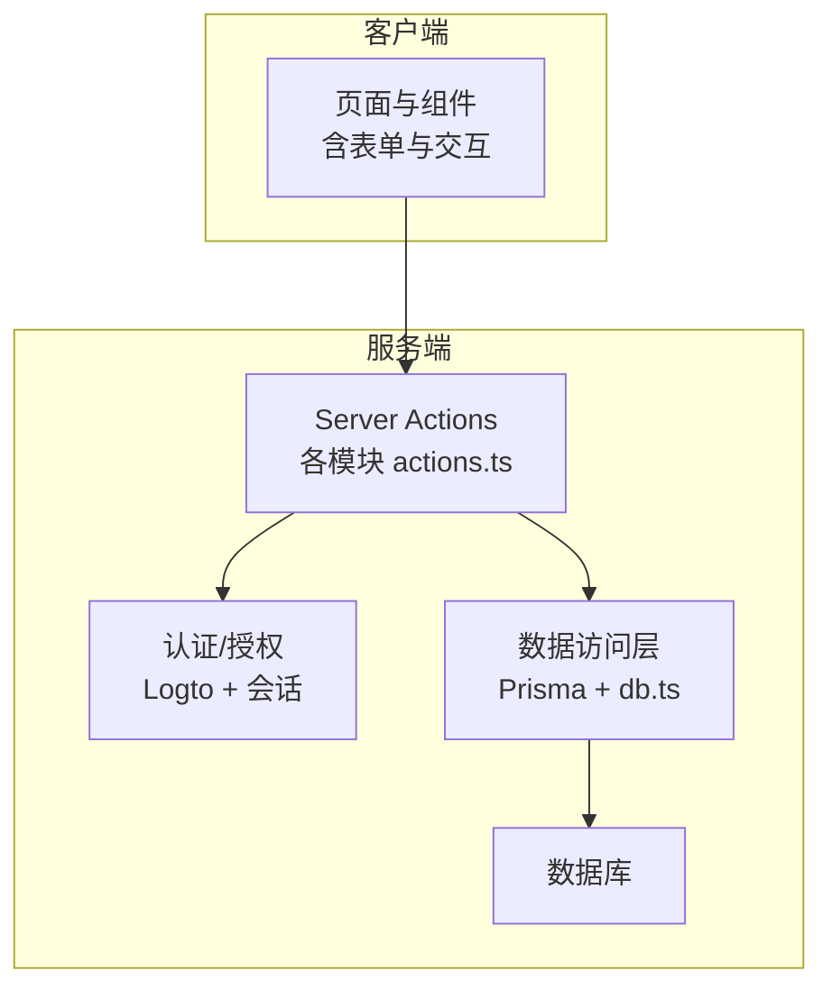
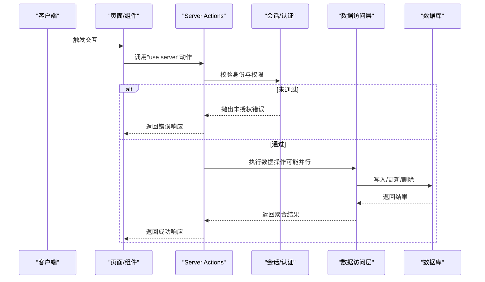
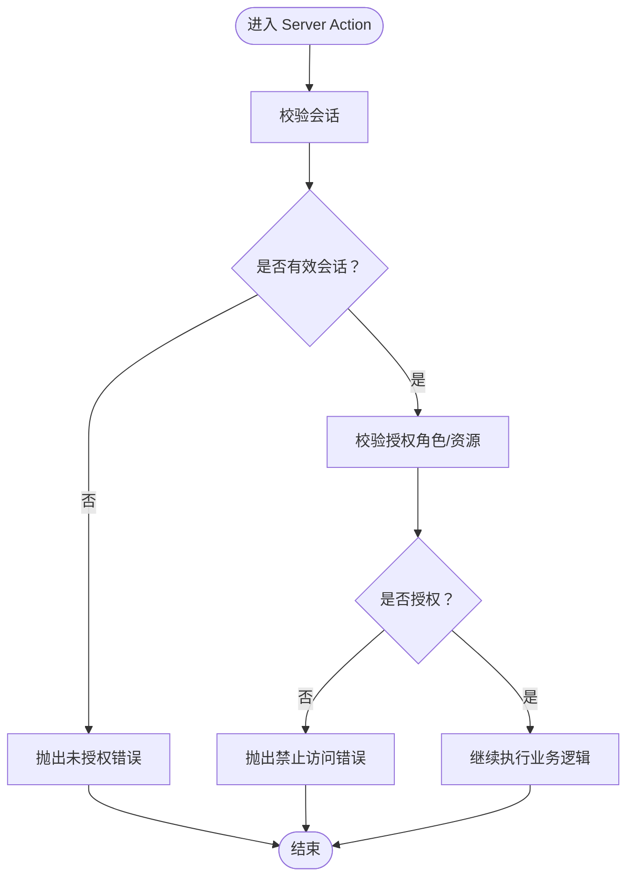
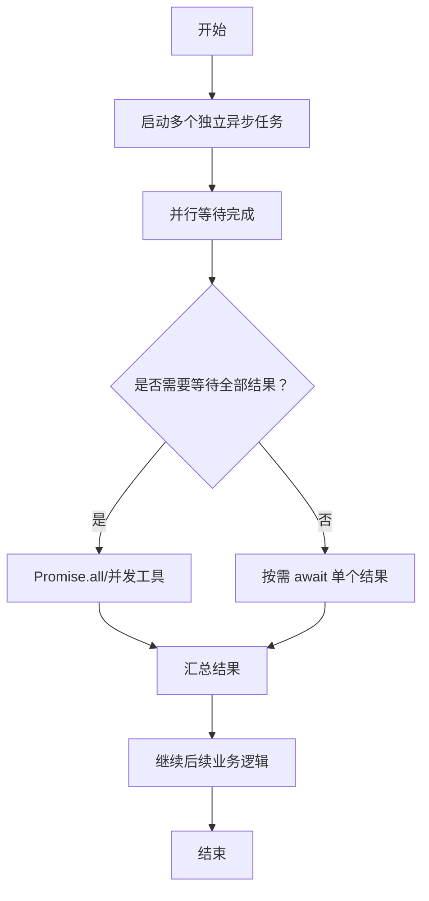
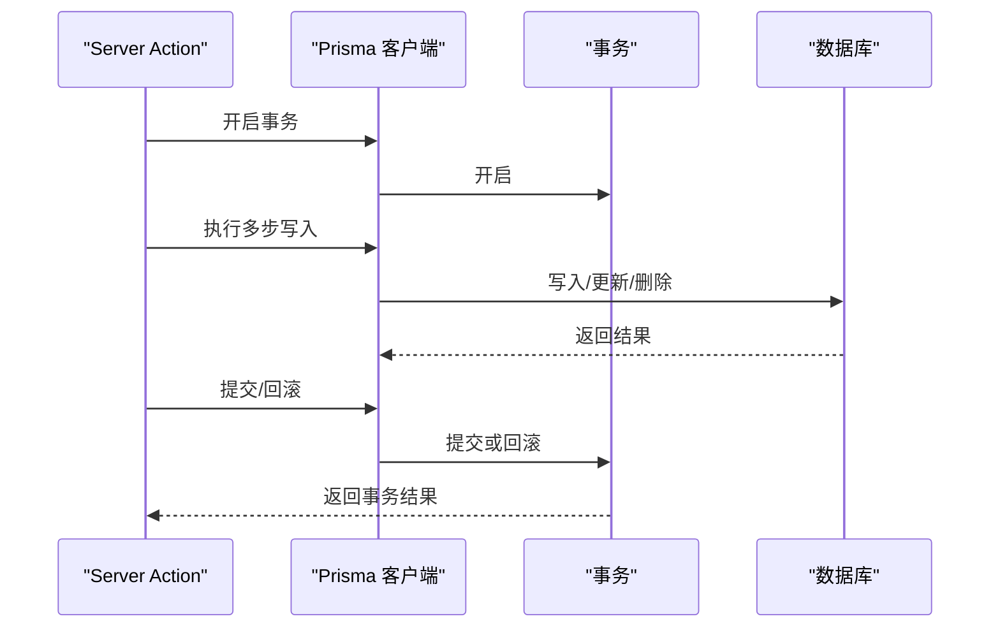
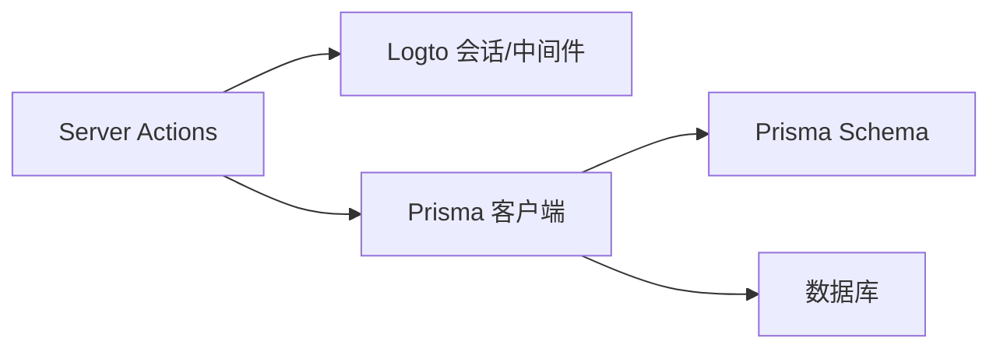

# 业务逻辑层

<cite>
**本文引用的文件**
- [server-auth-actions.md](file://.agents/skills/vercel-react-best-practices/rules/server-auth-actions.md)
- [async-api-routes.md](file://.agents/skills/vercel-react-best-practices/rules/async-api-routes.md)
- [async-parallel.md](file://.agents/skills/vercel-react-best-practices/rules/async-parallel.md)
- [async-defer-await.md](file://.agents/skills/vercel-react-best-practices/rules/async-defer-await.md)
- [async-suspense-boundaries.md](file://.agents/skills/vercel-react-best-practices/rules/async-suspense-boundaries.md)
- [AGENTS.md](file://AGENTS.md)
- [db.ts](file://src/lib/db.ts)
- [logto.ts](file://src/lib/logto.ts)
- [session.ts](file://src/lib/session.ts)
- [middleware.ts](file://src/middleware.ts)
- [posts/actions.ts](file://src/app/dashboard/posts/actions.ts)
- [posts/schema.ts](file://src/app/dashboard/posts/schema.ts)
- [email-logs/actions.ts](file://src/app/dashboard/email-logs/actions.ts)
- [email-logs/page.tsx](file://src/app/dashboard/email-logs/page.tsx)
- [friends/actions.ts](file://src/app/(site)/friends/actions.ts)
- [ai-platform/actions.ts](file://src/app/(site)/ai-platform/actions.ts)
- [tools/actions.ts](file://src/app/(site)/tools/actions.ts)
- [dashboard/overview/actions.ts](file://src/app/dashboard/overview/actions.ts)
- [dashboard/categories/actions.ts](file://src/app/dashboard/categories/actions.ts)
- [dashboard/comments/actions.ts](file://src/app/dashboard/comments/actions.ts)
- [dashboard/friend-links/actions.ts](file://src/app/dashboard/friend-links/actions.ts)
- [dashboard/tools/actions.ts](file://src/app/dashboard/tools/actions.ts)
- [dashboard/users/actions.ts](file://src/app/dashboard/users/actions.ts)
- [dashboard/ai-tools/actions.ts](file://src/app/dashboard/ai-tools/actions.ts)
- [dashboard/email-logs/actions.ts](file://src/app/dashboard/email-logs/actions.ts)
- [dashboard/posts/actions.ts](file://src/app/dashboard/posts/actions.ts)
- [dashboard/overview/actions.ts](file://src/app/dashboard/overview/actions.ts)
- [dashboard/categories/actions.ts](file://src/app/dashboard/categories/actions.ts)
- [dashboard/comments/actions.ts](file://src/app/dashboard/comments/actions.ts)
- [dashboard/friend-links/actions.ts](file://src/app/dashboard/friend-links/actions.ts)
- [dashboard/tools/actions.ts](file://src/app/dashboard/tools/actions.ts)
- [dashboard/users/actions.ts](file://src/app/dashboard/users/actions.ts)
- [dashboard/ai-tools/actions.ts](file://src/app/dashboard/ai-tools/actions.ts)
- [schema.prisma](file://prisma/schema.prisma)
</cite>

## 目录
1. [引言](#引言)
2. [项目结构](#项目结构)
3. [核心组件](#核心组件)
4. [架构总览](#架构总览)
5. [详细组件分析](#详细组件分析)
6. [依赖关系分析](#依赖关系分析)
7. [性能考量](#性能考量)
8. [故障排查指南](#故障排查指南)
9. [结论](#结论)
10. [附录](#附录)

## 引言
本文件聚焦“一梦五千年”项目的业务逻辑层，系统性梳理 Server Actions 的实现模式与最佳实践，覆盖数据操作封装、事务处理与错误传播、业务规则验证、数据转换与格式化、异步与并发控制、单元与集成测试策略以及性能监控与可维护性优化建议。文档以仓库中现有实现与规范为依据，结合 Next.js Server Actions 的安全与性能要求，提供可落地的指导。

## 项目结构
项目采用基于 App Router 的分层组织方式，业务逻辑主要分布在以下位置：
- 业务动作层：各页面与仪表盘下的 actions.ts 文件，集中承载写操作与复杂业务编排
- 数据访问层：Prisma ORM 与数据库连接封装
- 认证与授权：Logto OIDC、会话校验与中间件保护
- 表单校验：Zod Schema 定义与前端表单联动
- 性能与并发：并行化策略、Suspense 边界与延迟等待

图表来源
- [db.ts](file://src/lib/db.ts)
- [logto.ts](file://src/lib/logto.ts)
- [session.ts](file://src/lib/session.ts)
- [posts/actions.ts](file://src/app/dashboard/posts/actions.ts)

章节来源
- [AGENTS.md:149-195](file://AGENTS.md#L149-L195)

## 核心组件
- Server Actions 实现模式
  - 在每个 Server Action 内部执行身份验证与授权检查，确保公开暴露的“use server”函数具备与 API 路由同等的安全性
  - 对独立的异步任务采用并行化策略，避免串行水瀑布导致的延迟
  - 使用 Suspense 边界与延迟等待，仅在必要分支才 await，提升初始渲染性能
- 数据访问与事务
  - 通过 Prisma 进行数据建模与查询，遵循 relationJoins 与 relationMode 配置
  - 将跨表写入的多步骤操作封装为原子性业务动作，必要时在 Prisma 层或数据库层保证一致性
- 错误传播与用户体验
  - 明确区分业务错误与系统错误，统一抛出与捕获策略，配合前端表单错误展示与 Toast 提示
- 表单验证与数据转换
  - 使用 Zod Schema 在服务端与客户端保持一致的校验规则，对输入进行清洗与转换
- 并发控制与锁机制
  - 对高冲突写入场景引入数据库层面的唯一约束与更新条件，或在应用层使用分布式锁（如 Redis）保障幂等

章节来源
- [server-auth-actions.md:8-52](file://.agents/skills/vercel-react-best-practices/rules/server-auth-actions.md#L8-L52)
- [async-parallel.md:8-28](file://.agents/skills/vercel-react-best-practices/rules/async-parallel.md#L8-L28)
- [async-defer-await.md:8-41](file://.agents/skills/vercel-react-best-practices/rules/async-defer-await.md#L8-L41)
- [async-suspense-boundaries.md:8-57](file://.agents/skills/vercel-react-best-practices/rules/async-suspense-boundaries.md#L8-L57)
- [AGENTS.md:149-195](file://AGENTS.md#L149-L195)

## 架构总览
下图展示了从页面到业务动作、认证授权、数据访问与数据库的整体调用链路与职责划分。

图表来源
- [server-auth-actions.md:8-52](file://.agents/skills/vercel-react-best-practices/rules/server-auth-actions.md#L8-L52)
- [db.ts](file://src/lib/db.ts)
- [logto.ts](file://src/lib/logto.ts)
- [session.ts](file://src/lib/session.ts)

## 详细组件分析

### 认证与授权（Server Actions 安全基线）
- 关键要点
  - Server Actions 与 API 路由一样对外公开，必须在函数内部进行身份验证与授权
  - 授权应区分角色与资源所有权，避免越权修改他人数据
  - 与中间件、布局守卫不同，Server Actions 的安全检查不可依赖外部防护
- 最佳实践
  - 在每个动作入口处调用会话校验函数，失败即抛出未授权错误
  - 对资源型动作（如删除、编辑）增加资源归属校验
  - 对敏感操作（如批量删除、系统配置变更）增加二次确认与审计日志

图表来源
- [server-auth-actions.md:8-52](file://.agents/skills/vercel-react-best-practices/rules/server-auth-actions.md#L8-L52)

章节来源
- [server-auth-actions.md:8-52](file://.agents/skills/vercel-react-best-practices/rules/server-auth-actions.md#L8-L52)

### 并发控制与锁机制
- 场景与挑战
  - 高并发下的重复提交、竞态条件、数据不一致
  - 需要保证幂等性与最终一致性
- 实施建议
  - 数据库层面：使用唯一索引、条件更新（如版本号/时间戳）、悲观锁或乐观锁
  - 应用层面：引入分布式锁（如 Redis SET key value NX EX ttl），在动作开始加锁，结束释放
  - 业务层面：对关键写入动作进行幂等设计（基于业务主键或去重标识）

章节来源
- [async-parallel.md:8-28](file://.agents/skills/vercel-react-best-practices/rules/async-parallel.md#L8-L28)
- [async-defer-await.md:8-41](file://.agents/skills/vercel-react-best-practices/rules/async-defer-await.md#L8-L41)

### 表单验证与数据转换
- 表单验证
  - 使用 Zod Schema 定义字段规则（长度、格式、枚举值等），前后端共享同一套规则
  - 在 Server Actions 中对输入参数进行严格校验，拒绝非法数据
- 数据转换与格式化
  - 对输入进行清洗（去除多余空格、标准化大小写）
  - 对输出进行格式化（日期、金额、编码等），并与 UI 展示保持一致
- 错误反馈
  - 将校验错误映射为用户可理解的消息，优先返回首个错误以减少干扰

章节来源
- [posts/schema.ts:1-13](file://src/app/dashboard/posts/schema.ts#L1-L13)

### 异步操作与并发优化
- 并行化策略
  - 对无依赖的异步任务使用 Promise.all 或更高级的并行化工具最大化并发
  - 在 API 路由与 Server Actions 中避免串行等待，减少往返次数
- Suspense 边界
  - 将耗时数据加载包裹在 Suspense 中，先渲染骨架屏，再流式填充真实数据
- 延迟等待
  - 仅在真正需要时才 await，避免阻塞其他分支的执行

图表来源
- [async-parallel.md:8-28](file://.agents/skills/vercel-react-best-practices/rules/async-parallel.md#L8-L28)
- [async-suspense-boundaries.md:8-57](file://.agents/skills/vercel-react-best-practices/rules/async-suspense-boundaries.md#L8-L57)
- [async-defer-await.md:8-41](file://.agents/skills/vercel-react-best-practices/rules/async-defer-await.md#L8-L41)

### 数据访问与事务处理
- 数据访问层
  - 通过 Prisma 进行类型安全的数据访问，遵循 relationJoins 与 relationMode 配置
  - 在 db.ts 中集中管理连接池与直连配置，确保迁移与运行时的一致性
- 事务处理
  - 对涉及多表或多步骤的业务动作，使用 Prisma 事务包裹，确保原子性
  - 对长事务进行拆分，减少锁持有时间，避免死锁
- 错误传播
  - 将底层异常包装为业务错误，携带上下文信息便于前端展示与日志追踪

图表来源
- [db.ts](file://src/lib/db.ts)
- [schema.prisma](file://prisma/schema.prisma)

章节来源
- [AGENTS.md:149-195](file://AGENTS.md#L149-L195)

### 业务动作示例与组织原则
- 示例模块
  - 文章管理：文章增删改查、草稿发布、分类关联
  - 邮件日志：邮件发送记录查询、测试发送
  - 友链管理：友链新增/编辑/删除、审批流程
  - 工具管理：系统工具的启用/禁用与排序
  - 用户管理：用户列表、角色变更、封禁
  - AI 工具：AI 工具的配置与权限控制
- 组织原则
  - 每个模块一个 actions.ts，集中定义该模块的所有写操作与复杂业务
  - 动作函数命名语义化，参数最小化，返回值结构化
  - 将通用能力（认证、授权、日志、监控）抽象为可复用的辅助函数

章节来源
- [posts/actions.ts](file://src/app/dashboard/posts/actions.ts)
- [email-logs/actions.ts](file://src/app/dashboard/email-logs/actions.ts)
- [friends/actions.ts](file://src/app/(site)/friends/actions.ts)
- [ai-platform/actions.ts](file://src/app/(site)/ai-platform/actions.ts)
- [tools/actions.ts](file://src/app/(site)/tools/actions.ts)
- [dashboard/overview/actions.ts](file://src/app/dashboard/overview/actions.ts)
- [dashboard/categories/actions.ts](file://src/app/dashboard/categories/actions.ts)
- [dashboard/comments/actions.ts](file://src/app/dashboard/comments/actions.ts)
- [dashboard/friend-links/actions.ts](file://src/app/dashboard/friend-links/actions.ts)
- [dashboard/tools/actions.ts](file://src/app/dashboard/tools/actions.ts)
- [dashboard/users/actions.ts](file://src/app/dashboard/users/actions.ts)
- [dashboard/ai-tools/actions.ts](file://src/app/dashboard/ai-tools/actions.ts)

## 依赖关系分析
- 认证与授权依赖
  - Server Actions 依赖会话校验与角色判断，会话来源于 Logto OIDC
  - 中间件在 Edge 运行时校验会话，保护后台路由
- 数据访问依赖
  - 所有写操作依赖 Prisma 客户端，db.ts 提供连接配置
  - schema.prisma 定义实体关系，影响查询与事务设计
- 前端依赖
  - 页面通过 Server Actions 与后端交互，UI 组件负责展示与错误提示

图表来源
- [logto.ts](file://src/lib/logto.ts)
- [session.ts](file://src/lib/session.ts)
- [middleware.ts](file://src/middleware.ts)
- [db.ts](file://src/lib/db.ts)
- [schema.prisma](file://prisma/schema.prisma)

章节来源
- [AGENTS.md:149-195](file://AGENTS.md#L149-L195)

## 性能考量
- 并行化
  - 对无依赖的异步任务使用 Promise.all 或更高级并行化工具，减少往返次数
- 渲染性能
  - 使用 Suspense 边界，先渲染骨架屏，再流式填充真实数据
- 延迟等待
  - 仅在必要分支 await，避免阻塞其他路径
- 数据库性能
  - 合理使用索引、限制返回字段、避免 N+1 查询
- 监控指标
  - 请求时延、吞吐量、错误率、并发度、数据库慢查询数
  - 前端首屏时间、可交互时间、稳定性（崩溃率）

章节来源
- [async-parallel.md:8-28](file://.agents/skills/vercel-react-best-practices/rules/async-parallel.md#L8-L28)
- [async-suspense-boundaries.md:8-57](file://.agents/skills/vercel-react-best-practices/rules/async-suspense-boundaries.md#L8-L57)
- [async-defer-await.md:8-41](file://.agents/skills/vercel-react-best-practices/rules/async-defer-await.md#L8-L41)

## 故障排查指南
- 常见问题
  - 未授权访问：检查 Server Actions 是否在内部执行了会话与授权校验
  - 并发冲突：观察数据库唯一约束冲突与应用层锁状态，必要时引入分布式锁
  - 表单校验失败：核对 Zod 规则与前端错误映射，确保消息清晰
  - 性能瓶颈：定位水瀑布与不必要的 await，采用并行化与 Suspense 边界
- 排查步骤
  - 启用服务端日志与错误追踪，收集请求上下文
  - 对关键动作添加埋点与指标监控
  - 使用最小复现案例隔离问题范围

章节来源
- [server-auth-actions.md:8-52](file://.agents/skills/vercel-react-best-practices/rules/server-auth-actions.md#L8-L52)
- [async-parallel.md:8-28](file://.agents/skills/vercel-react-best-practices/rules/async-parallel.md#L8-L28)
- [async-suspense-boundaries.md:8-57](file://.agents/skills/vercel-react-best-practices/rules/async-suspense-boundaries.md#L8-L57)

## 结论
本项目在 Server Actions 的安全基线、并发优化与数据一致性方面具备良好基础。建议持续强化以下方向：完善事务边界与锁机制、统一错误传播与前端反馈、加强单元与集成测试覆盖，并建立完善的性能监控体系。通过以上措施，可在保证安全性与稳定性的前提下，进一步提升系统的可维护性与用户体验。

## 附录
- 单元测试策略
  - 对纯业务函数（不含数据库）进行单元测试，模拟输入与期望输出
  - 使用内存数据库或测试专用实例，隔离测试环境
- 集成测试方法
  - 通过调用 Server Actions 的方式编写集成测试，覆盖完整业务流程
  - 使用 Mock 替换外部依赖（如邮件服务、第三方 API），确保测试可控
- 代码组织原则
  - 动作函数单一职责、参数最小化、返回值结构化
  - 将通用能力抽象为可复用模块，避免重复代码
- 可维护性优化建议
  - 为复杂业务流程绘制序列图与流程图，便于团队协作与知识传承
  - 建立变更评审机制，确保对事务与并发关键路径的改动经过充分评估