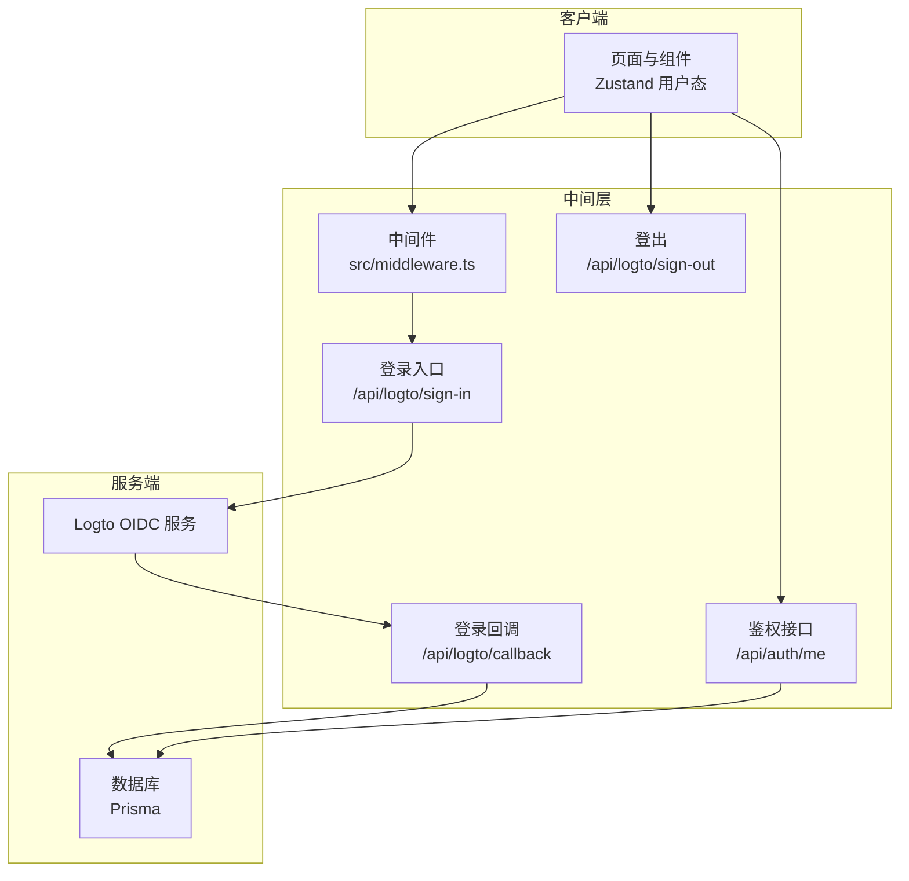
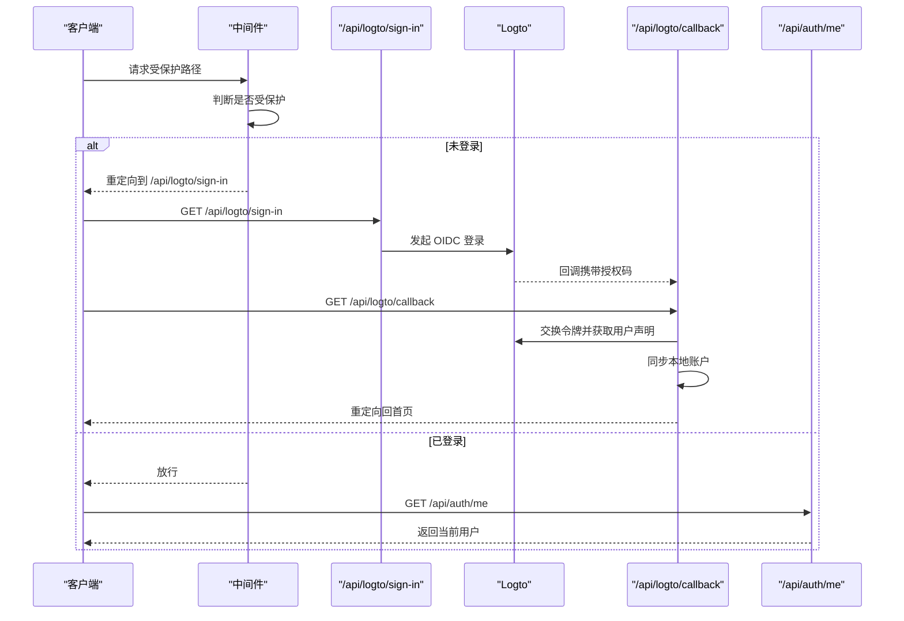
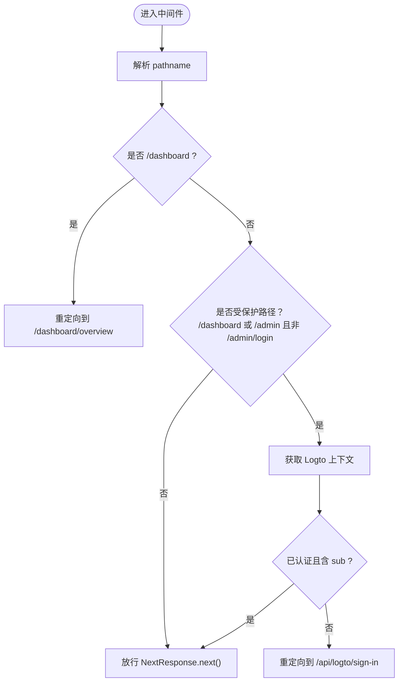
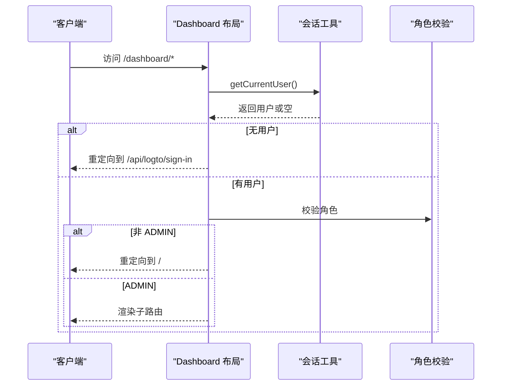
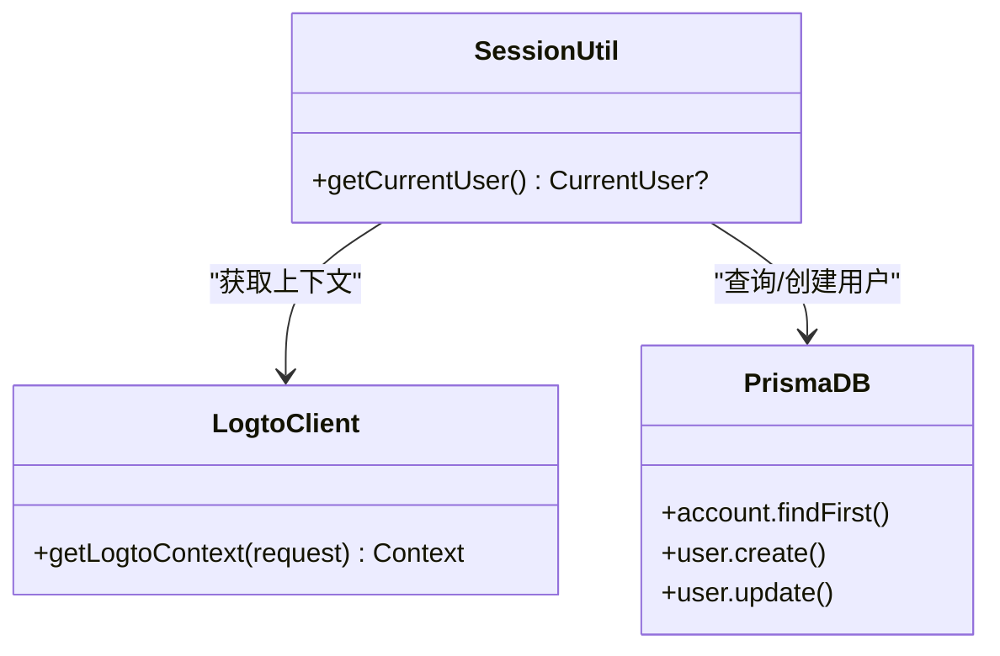
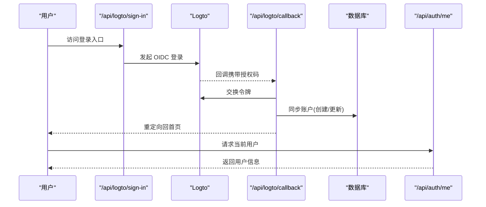
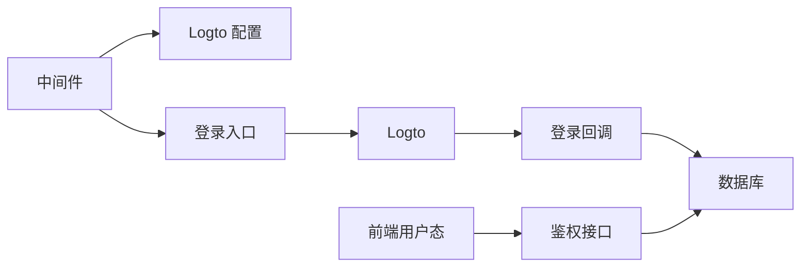

# 中间件体系

<cite>
**本文引用的文件**
- [src/middleware.ts](file://src/middleware.ts)
- [src/lib/session.ts](file://src/lib/session.ts)
- [src/lib/logto.ts](file://src/lib/logto.ts)
- [src/app/api/auth/me/route.ts](file://src/app/api/auth/me/route.ts)
- [src/app/api/logto/callback/route.ts](file://src/app/api/logto/callback/route.ts)
- [src/app/api/logto/sign-in/route.ts](file://src/app/api/logto/sign-in/route.ts)
- [src/app/api/logto/sign-out/route.ts](file://src/app/api/logto/sign-out/route.ts)
- [src/app/dashboard/layout.tsx](file://src/app/dashboard/layout.tsx)
- [src/app/admin/login/page.tsx](file://src/app/admin/login/page.tsx)
- [src/store/user-store.ts](file://src/store/user-store.ts)
- [src/lib/db.ts](file://src/lib/db.ts)
</cite>

## 目录
1. [引言](#引言)
2. [项目结构](#项目结构)
3. [核心组件](#核心组件)
4. [架构总览](#架构总览)
5. [详细组件分析](#详细组件分析)
6. [依赖关系分析](#依赖关系分析)
7. [性能考量](#性能考量)
8. [故障排除指南](#故障排除指南)
9. [结论](#结论)
10. [附录](#附录)

## 引言
本文件系统性梳理“一梦五千年”项目的中间件体系，聚焦 Next.js App Router 下的中间件实现与执行顺序，覆盖认证中间件、权限检查中间件与 CORS 处理现状，并深入解析会话管理、用户身份验证流程与权限验证策略。同时，阐述中间件中的错误处理、异常捕获与日志记录机制，给出性能优化、缓存策略与并发处理建议，并提供调试技巧、测试方法与故障排除清单。

## 项目结构
项目采用 Next.js App Router 架构，中间件集中于根目录中间件文件，认证相关逻辑分布在 API 路由与会话工具中，前端状态通过 Zustand 管理，数据库访问统一经由 Prisma 客户端。

图表来源
- [src/middleware.ts:1-36](file://src/middleware.ts#L1-L36)
- [src/app/api/logto/sign-in/route.ts:1-9](file://src/app/api/logto/sign-in/route.ts#L1-L9)
- [src/app/api/logto/callback/route.ts:1-66](file://src/app/api/logto/callback/route.ts#L1-L66)
- [src/app/api/auth/me/route.ts:1-13](file://src/app/api/auth/me/route.ts#L1-L13)
- [src/app/api/logto/sign-out/route.ts:1-7](file://src/app/api/logto/sign-out/route.ts#L1-L7)
- [src/lib/db.ts:1-16](file://src/lib/db.ts#L1-L16)

章节来源
- [src/middleware.ts:1-36](file://src/middleware.ts#L1-L36)
- [src/lib/logto.ts:1-13](file://src/lib/logto.ts#L1-L13)
- [src/lib/db.ts:1-16](file://src/lib/db.ts#L1-L16)

## 核心组件
- 认证中间件：负责对受保护路径进行会话校验，未通过则重定向至登录入口。
- 会话管理器：封装当前用户获取逻辑，结合 Logto 上下文与数据库查询，提供请求级去重缓存。
- Logto 配置：集中管理 OIDC 端点、应用 ID、Cookie 安全等参数。
- 登录/回调/登出路由：实现 OIDC 授权码流程与本地账户同步。
- 前端用户态：通过 API 获取当前用户并维护登录状态。

章节来源
- [src/middleware.ts:8-28](file://src/middleware.ts#L8-L28)
- [src/lib/session.ts:17-41](file://src/lib/session.ts#L17-L41)
- [src/lib/logto.ts:3-12](file://src/lib/logto.ts#L3-L12)
- [src/app/api/logto/sign-in/route.ts:6-8](file://src/app/api/logto/sign-in/route.ts#L6-L8)
- [src/app/api/logto/callback/route.ts:10-65](file://src/app/api/logto/callback/route.ts#L10-L65)
- [src/app/api/auth/me/route.ts:4-12](file://src/app/api/auth/me/route.ts#L4-L12)
- [src/store/user-store.ts:26-48](file://src/store/user-store.ts#L26-L48)

## 架构总览
中间件在 Edge 运行时执行，匹配受保护路径，快速判断是否需要登录。若未登录，重定向到登录入口；若已登录，则放行。登录流程采用 OIDC 授权码模式，回调完成后同步本地账户并写入会话。前端通过 API 与状态管理读取用户信息，实现跨组件共享。

图表来源
- [src/middleware.ts:8-28](file://src/middleware.ts#L8-L28)
- [src/app/api/logto/sign-in/route.ts:6-8](file://src/app/api/logto/sign-in/route.ts#L6-L8)
- [src/app/api/logto/callback/route.ts:6-65](file://src/app/api/logto/callback/route.ts#L6-L65)
- [src/app/api/auth/me/route.ts:4-12](file://src/app/api/auth/me/route.ts#L4-L12)

## 详细组件分析

### 认证中间件（Edge 运行时）
- 匹配规则：仅对 /dashboard 与 /admin（除 /admin/login）生效。
- 重定向逻辑：当请求为 /dashboard 时，重定向到 /dashboard/overview；对受保护路径，先获取 Logto 上下文，若未认证或缺少主体标识，则重定向到登录入口。
- 执行顺序：在请求进入页面或 API 之前执行，确保早期拦截未授权访问。

图表来源
- [src/middleware.ts:8-28](file://src/middleware.ts#L8-L28)

章节来源
- [src/middleware.ts:8-28](file://src/middleware.ts#L8-L28)
- [src/middleware.ts:30-35](file://src/middleware.ts#L30-L35)

### 权限检查中间件（服务端布局）
- 管理后台权限：在服务端布局中再次校验用户角色，非管理员直接重定向至首页。
- 协同机制：与中间件形成“边缘拦截 + 服务端二次校验”的双重保障。

图表来源
- [src/app/dashboard/layout.tsx:5-25](file://src/app/dashboard/layout.tsx#L5-L25)
- [src/lib/session.ts:17-41](file://src/lib/session.ts#L17-L41)

章节来源
- [src/app/dashboard/layout.tsx:5-25](file://src/app/dashboard/layout.tsx#L5-L25)

### CORS 处理现状
- 当前中间件未显式处理 CORS。若存在跨域需求，建议在中间件中统一注入 CORS 头，或在代理层/CDN 层配置。
- 若需细粒度控制，可基于请求头 Origin/Referer 进行白名单校验。

[本节为现状说明，不直接分析具体文件，故无章节来源]

### 会话管理机制
- 请求级去重：使用 React 缓存对同一请求内的多次调用进行去重，避免重复的会话校验与数据库查询。
- 会话来源：通过 Logto 提供的上下文获取认证状态与用户声明，随后按 provider 与 providerAccountId 关联本地账户。
- 用户对象：包含 id、username、email、role、nickname、avatar 等字段，便于前端展示与权限判断。

图表来源
- [src/lib/session.ts:17-41](file://src/lib/session.ts#L17-L41)
- [src/lib/logto.ts:3-12](file://src/lib/logto.ts#L3-L12)
- [src/lib/db.ts:5-14](file://src/lib/db.ts#L5-L14)

章节来源
- [src/lib/session.ts:17-41](file://src/lib/session.ts#L17-L41)
- [src/lib/logto.ts:3-12](file://src/lib/logto.ts#L3-L12)
- [src/lib/db.ts:5-14](file://src/lib/db.ts#L5-L14)

### 用户身份验证流程
- 登录入口：/api/logto/sign-in 触发 OIDC 登录，携带回调地址。
- 回调处理：/api/logto/callback 接收授权码，换取令牌并获取用户声明；如本地不存在对应账户则创建，否则更新最近登录时间与头像。
- 会话同步：回调完成后写入会话，后续中间件与服务端布局可读取。
- 前端获取：/api/auth/me 返回当前用户信息，前端通过 Zustand 管理登录态。

图表来源
- [src/app/api/logto/sign-in/route.ts:6-8](file://src/app/api/logto/sign-in/route.ts#L6-L8)
- [src/app/api/logto/callback/route.ts:10-65](file://src/app/api/logto/callback/route.ts#L10-L65)
- [src/app/api/auth/me/route.ts:4-12](file://src/app/api/auth/me/route.ts#L4-L12)

章节来源
- [src/app/api/logto/sign-in/route.ts:6-8](file://src/app/api/logto/sign-in/route.ts#L6-L8)
- [src/app/api/logto/callback/route.ts:10-65](file://src/app/api/logto/callback/route.ts#L10-L65)
- [src/app/api/auth/me/route.ts:4-12](file://src/app/api/auth/me/route.ts#L4-L12)

### 权限验证策略
- 路径级保护：中间件对 /dashboard 与 /admin（除登录页）进行保护。
- 角色级保护：服务端布局进一步校验用户角色，非管理员禁止访问后台。
- 登录态校验：缺失或无效的会话将被重定向至登录入口。

章节来源
- [src/middleware.ts:15-25](file://src/middleware.ts#L15-L25)
- [src/app/dashboard/layout.tsx:10-18](file://src/app/dashboard/layout.tsx#L10-L18)
- [src/app/admin/login/page.tsx:3-5](file://src/app/admin/login/page.tsx#L3-L5)

### 错误处理、异常捕获与日志记录
- 中间件异常：当前中间件未显式 try/catch，建议在外层包裹错误处理并记录日志，以便定位未认证或上下文获取失败问题。
- 登录回调异常：回调路由对未认证场景进行重定向，建议补充更详细的错误日志与可观测性指标。
- 前端异常：用户态获取失败时前端设置未登录状态，建议增加 toast 提示与重试按钮。

章节来源
- [src/middleware.ts:8-28](file://src/middleware.ts#L8-L28)
- [src/app/api/logto/callback/route.ts:14-16](file://src/app/api/logto/callback/route.ts#L14-L16)
- [src/store/user-store.ts:26-48](file://src/store/user-store.ts#L26-L48)

## 依赖关系分析
- 中间件依赖 Logto Edge 客户端与配置；受保护路径由中间件配置限定。
- 会话工具依赖 Logto 服务端动作与数据库；数据库连接由 Prisma 管理。
- 登录/回调/登出路由串联 OIDC 流程与本地账户同步。
- 前端用户态依赖鉴权接口返回的用户信息。

图表来源
- [src/middleware.ts:3-6](file://src/middleware.ts#L3-L6)
- [src/lib/logto.ts:3-12](file://src/lib/logto.ts#L3-L12)
- [src/app/api/logto/sign-in/route.ts:4-8](file://src/app/api/logto/sign-in/route.ts#L4-L8)
- [src/app/api/logto/callback/route.ts:10-65](file://src/app/api/logto/callback/route.ts#L10-L65)
- [src/app/api/auth/me/route.ts:4-12](file://src/app/api/auth/me/route.ts#L4-L12)
- [src/lib/db.ts:5-14](file://src/lib/db.ts#L5-L14)

章节来源
- [src/middleware.ts:3-6](file://src/middleware.ts#L3-L6)
- [src/lib/logto.ts:3-12](file://src/lib/logto.ts#L3-L12)
- [src/lib/db.ts:5-14](file://src/lib/db.ts#L5-L14)

## 性能考量
- 请求级去重：会话工具使用 React 缓存，避免重复校验与查询，显著降低边缘与数据库压力。
- 边缘执行：中间件在 Edge 运行时执行，减少不必要的 Node 侧开销。
- 缓存策略：建议在中间件层引入短期缓存（如基于 IP 或会话标识的轻量缓存），以减少频繁重定向与登录跳转。
- 并发处理：中间件应保持无阻塞与幂等，避免在其中执行耗时任务；长任务下沉至后台作业或 API。

章节来源
- [src/lib/session.ts:17-18](file://src/lib/session.ts#L17-L18)
- [src/middleware.ts:8-28](file://src/middleware.ts#L8-L28)

## 故障排除指南
- 无法访问后台：确认中间件匹配规则与服务端布局角色校验是否一致；检查登录入口重定向是否正确。
- 登录后仍提示未登录：检查回调路由是否成功同步本地账户并写入会话；核对 Logto 配置与 Cookie 设置。
- CORS 问题：当前中间件未处理 CORS，如遇跨域，请在中间件或代理层补充相应头。
- 前端未显示登录态：检查鉴权接口返回与前端 store 更新逻辑；确认网络错误处理与重试机制。

章节来源
- [src/middleware.ts:30-35](file://src/middleware.ts#L30-L35)
- [src/app/dashboard/layout.tsx:10-18](file://src/app/dashboard/layout.tsx#L10-L18)
- [src/app/api/logto/callback/route.ts:14-16](file://src/app/api/logto/callback/route.ts#L14-L16)
- [src/store/user-store.ts:26-48](file://src/store/user-store.ts#L26-L48)

## 结论
本项目在中间件层面实现了基于 OIDC 的认证与权限控制，配合服务端布局进行角色校验，形成“边缘拦截 + 服务端二次校验”的安全闭环。通过请求级去重与 Edge 执行提升了性能。建议后续增强中间件异常处理与 CORS 支持，并完善可观测性与错误提示，以提升稳定性与可维护性。

## 附录
- 调试技巧：在中间件与回调路由中增加日志输出，区分“未认证”“上下文获取失败”“账户同步失败”等场景；使用浏览器开发者工具观察重定向链路与网络请求。
- 测试方法：编写端到端测试覆盖登录流程、受保护路径访问、角色权限与登出；模拟未认证与无效会话场景。
- 常见问题：登录后仍被重定向、回调后未创建本地账户、Cookie 未写入或跨域受限。