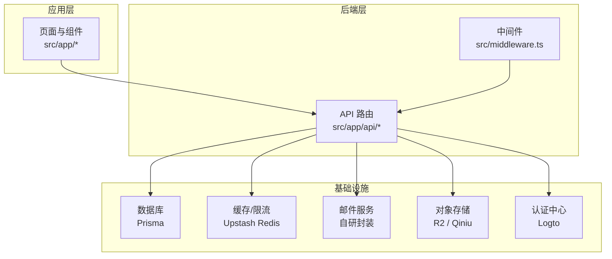
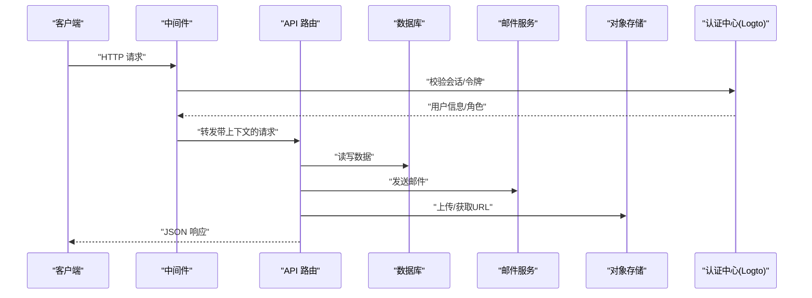
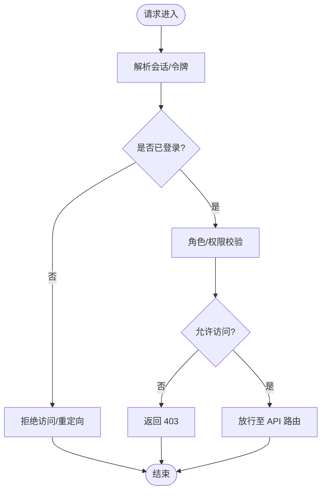
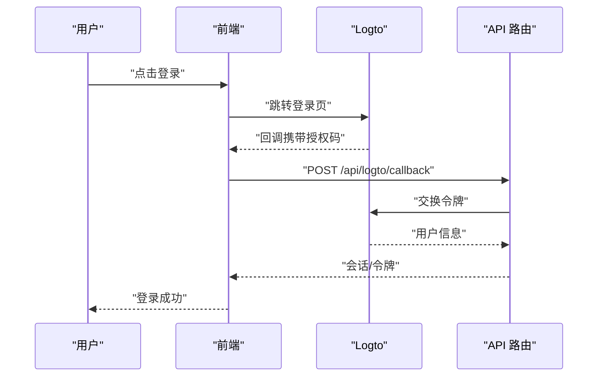
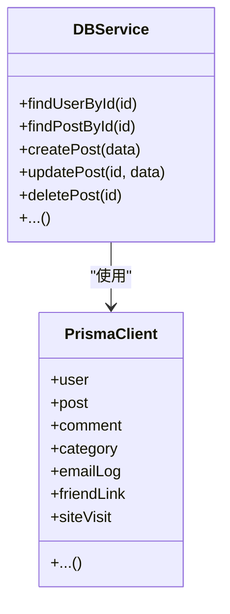
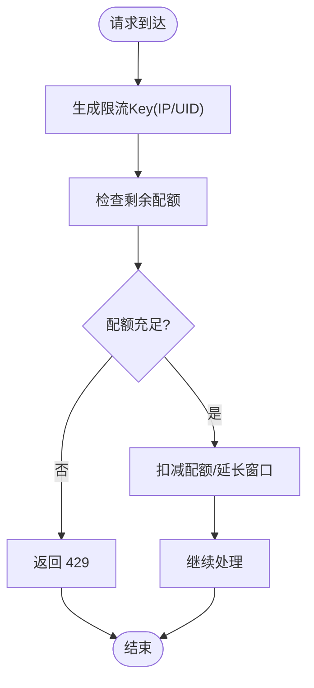
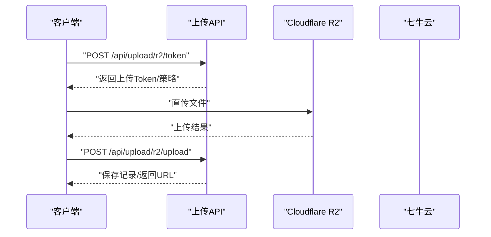
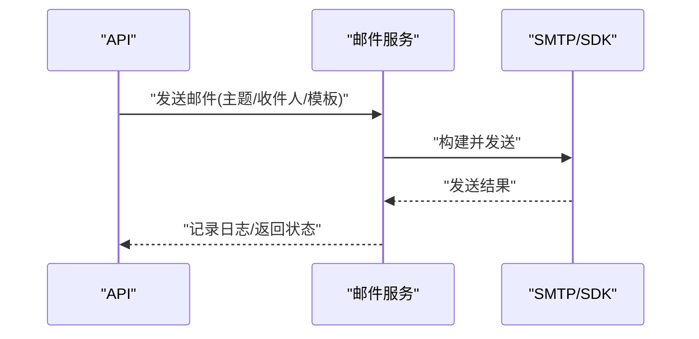
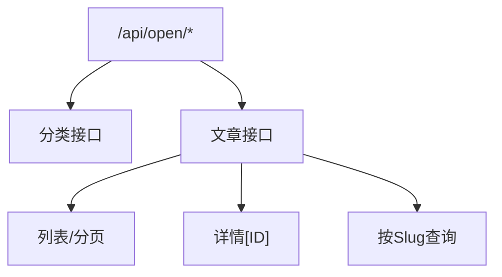
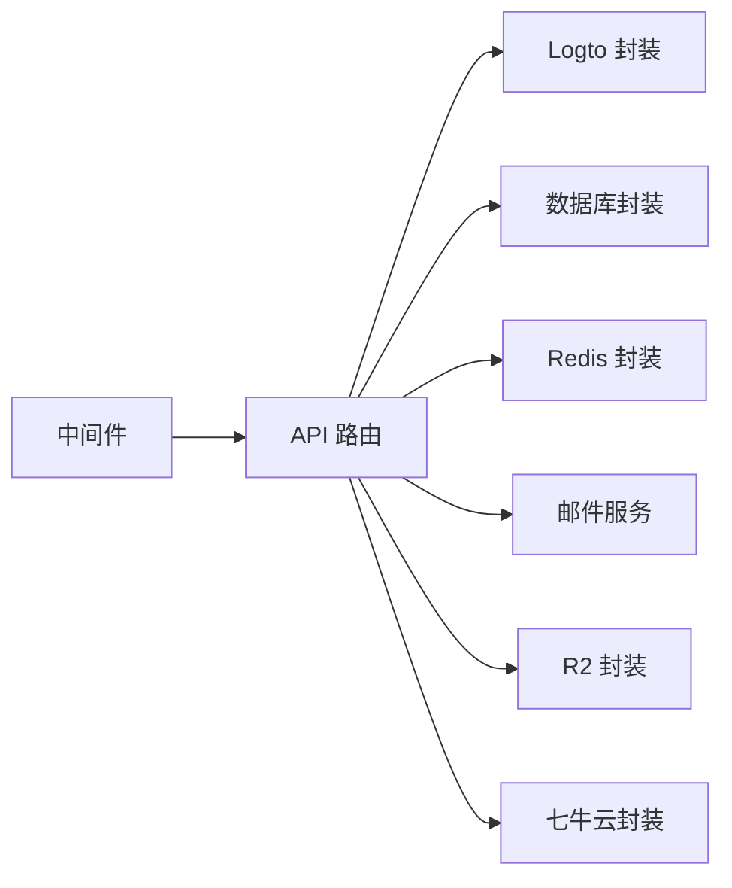

# 后端架构设计

<cite>
**本文档引用的文件**
- [src/middleware.ts](file://src/middleware.ts)
- [src/lib/db.ts](file://src/lib/db.ts)
- [src/lib/logto.ts](file://src/lib/logto.ts)
- [src/lib/email-service.ts](file://src/lib/email-service.ts)
- [src/lib/r2.ts](file://src/lib/r2.ts)
- [src/lib/qiniu.ts](file://src/lib/qiniu.ts)
- [src/lib/upstash-redis.ts](file://src/lib/upstash-redis.ts)
- [src/lib/env.ts](file://src/lib/env.ts)
- [src/lib/utils.ts](file://src/lib/utils.ts)
- [src/app/api/analytics/track/route.ts](file://src/app/api/analytics/track/route.ts)
- [src/app/api/auth/me/route.ts](file://src/app/api/auth/me/route.ts)
- [src/app/api/logto/callback/route.ts](file://src/app/api/logto/callback/route.ts)
- [src/app/api/logto/sign-in/route.ts](file://src/app/api/logto/sign-in/route.ts)
- [src/app/api/logto/sign-out/route.ts](file://src/app/api/logto/sign-out/route.ts)
- [src/app/api/open/categories/route.ts](file://src/app/api/open/categories/route.ts)
- [src/app/api/open/posts/route.ts](file://src/app/api/open/posts/route.ts)
- [src/app/api/open/posts/[id]/route.ts](file://src/app/api/open/posts/[id]/route.ts)
- [src/app/api/open/posts/slug[slug]/route.ts](file://src/app/api/open/posts/slug[slug]/route.ts)
- [src/app/api/rcode/route.ts](file://src/app/api/rcode/route.ts)
- [src/app/api/send/notification/route.ts](file://src/app/api/send/notification/route.ts)
- [src/app/api/send/verification-code/route.ts](file://src/app/api/send/verification-code/route.ts)
- [src/app/api/send-friend-approval/route.ts](file://src/app/api/send-friend-approval/route.ts)
- [src/app/api/test-db/route.ts](file://src/app/api/test-db/route.ts)
- [src/app/api/test-friend-email/route.ts](file://src/app/api/test-friend-email/route.ts)
- [src/app/api/test-mail/route.ts](file://src/app/api/test-mail/route.ts)
- [src/app/api/upload/r2/token/route.ts](file://src/app/api/upload/r2/token/route.ts)
- [src/app/api/upload/r2/upload/route.ts](file://src/app/api/upload/r2/upload/route.ts)
- [src/app/api/upload/r2/url/route.ts](file://src/app/api/upload/r2/url/route.ts)
- [src/app/api/upload/token/route.ts](file://src/app/api/upload/token/route.ts)
- [src/app/api/upload/route.ts](file://src/app/api/upload/route.ts)
- [src/app/api/users/[id]/route.ts](file://src/app/api/users/[id]/route.ts)
- [src/app/api/users/route.ts](file://src/app/api/users/route.ts)
</cite>

## 目录
1. [引言](#引言)
2. [项目结构](#项目结构)
3. [核心组件](#核心组件)
4. [架构总览](#架构总览)
5. [详细组件分析](#详细组件分析)
6. [依赖关系分析](#依赖关系分析)
7. [性能考虑](#性能考虑)
8. [故障排除指南](#故障排除指南)
9. [结论](#结论)
10. [附录](#附录)

## 引言
本文件为“一梦五千年”项目的后端架构设计文档，聚焦于基于 Next.js App Router 的 API 路由与中间件体系，系统性阐述认证授权、权限控制、业务逻辑分层、数据校验与错误处理、文件上传、邮件服务与第三方 API 集成，并给出 API 版本管理、速率限制与监控告警策略建议。文档内容严格依据仓库现有代码与结构进行归纳总结。

## 项目结构
项目采用 App Router 目录组织方式，后端 API 主要位于 `src/app/api/` 下，按功能域划分（如 `/open` 公开接口、`/upload` 文件上传、`/send` 邮件发送、`/users` 用户相关等）。认证与会话通过 Logto 提供，数据库访问通过 Prisma，缓存与限流可借助 Upstash Redis，对象存储支持 Cloudflare R2 与七牛云（Qiniu）。

图表来源
- [src/middleware.ts](file://src/middleware.ts)
- [src/app/api/analytics/track/route.ts](file://src/app/api/analytics/track/route.ts)
- [src/lib/db.ts](file://src/lib/db.ts)
- [src/lib/upstash-redis.ts](file://src/lib/upstash-redis.ts)
- [src/lib/email-service.ts](file://src/lib/email-service.ts)
- [src/lib/r2.ts](file://src/lib/r2.ts)
- [src/lib/qiniu.ts](file://src/lib/qiniu.ts)
- [src/lib/logto.ts](file://src/lib/logto.ts)

章节来源
- [src/middleware.ts](file://src/middleware.ts)
- [src/app/api/analytics/track/route.ts](file://src/app/api/analytics/track/route.ts)
- [src/lib/db.ts](file://src/lib/db.ts)
- [src/lib/upstash-redis.ts](file://src/lib/upstash-redis.ts)
- [src/lib/email-service.ts](file://src/lib/email-service.ts)
- [src/lib/r2.ts](file://src/lib/r2.ts)
- [src/lib/qiniu.ts](file://src/lib/qiniu.ts)
- [src/lib/logto.ts](file://src/lib/logto.ts)

## 核心组件
- 中间件：统一处理认证态注入、CORS、请求头规范化与审计日志入口。
- 认证与会话：基于 Logto 的 OAuth 回调、登录与登出流程，配合会话状态管理。
- 数据访问：Prisma 客户端封装，提供类型化查询与事务能力。
- 缓存与限流：Upstash Redis 封装，用于速率限制与会话缓存。
- 对象存储：R2 与 Qiniu 的 Token 获取、直传与 URL 生成。
- 邮件服务：统一的邮件发送封装，支持模板与批量发送。
- API 路由：按领域拆分的 RESTful 接口，遵循资源命名与状态码约定。

章节来源
- [src/middleware.ts](file://src/middleware.ts)
- [src/lib/logto.ts](file://src/lib/logto.ts)
- [src/lib/db.ts](file://src/lib/db.ts)
- [src/lib/upstash-redis.ts](file://src/lib/upstash-redis.ts)
- [src/lib/r2.ts](file://src/lib/r2.ts)
- [src/lib/qiniu.ts](file://src/lib/qiniu.ts)
- [src/lib/email-service.ts](file://src/lib/email-service.ts)

## 架构总览
下图展示从浏览器到后端 API 的典型链路：客户端发起请求 → 中间件解析会话与鉴权 → API 路由执行业务逻辑 → 数据库/缓存/邮件/存储等外部服务 → 返回响应。

图表来源
- [src/middleware.ts](file://src/middleware.ts)
- [src/app/api/analytics/track/route.ts](file://src/app/api/analytics/track/route.ts)
- [src/lib/logto.ts](file://src/lib/logto.ts)
- [src/lib/db.ts](file://src/lib/db.ts)
- [src/lib/email-service.ts](file://src/lib/email-service.ts)
- [src/lib/r2.ts](file://src/lib/r2.ts)

## 详细组件分析

### 中间件体系与认证授权
- 会话解析：在中间件中读取 Cookie 或 Authorization 头，解析用户身份与角色。
- 权限判定：根据用户角色与路由元信息进行白名单/黑名单控制。
- 审计与追踪：记录请求 ID、用户 ID、IP、UA 等信息，便于问题定位。
- CORS 与安全头：设置跨域、安全头与缓存策略。

图表来源
- [src/middleware.ts](file://src/middleware.ts)

章节来源
- [src/middleware.ts](file://src/middleware.ts)

### 认证与会话（Logto 集成）
- 登录：触发 Logto 登录流程，回调地址指向 `/api/logto/callback`。
- 回调：接收授权码，换取访问令牌与用户信息，写入会话。
- 登出：清除本地会话并调用 Logto 注销。
- 当前用户：通过 `/api/auth/me` 返回当前用户信息。

图表来源
- [src/app/api/logto/sign-in/route.ts](file://src/app/api/logto/sign-in/route.ts)
- [src/app/api/logto/callback/route.ts](file://src/app/api/logto/callback/route.ts)
- [src/app/api/logto/sign-out/route.ts](file://src/app/api/logto/sign-out/route.ts)
- [src/app/api/auth/me/route.ts](file://src/app/api/auth/me/route.ts)
- [src/lib/logto.ts](file://src/lib/logto.ts)

章节来源
- [src/app/api/logto/sign-in/route.ts](file://src/app/api/logto/sign-in/route.ts)
- [src/app/api/logto/callback/route.ts](file://src/app/api/logto/callback/route.ts)
- [src/app/api/logto/sign-out/route.ts](file://src/app/api/logto/sign-out/route.ts)
- [src/app/api/auth/me/route.ts](file://src/app/api/auth/me/route.ts)
- [src/lib/logto.ts](file://src/lib/logto.ts)

### 数据访问层（Prisma）
- 连接管理：集中初始化 Prisma 客户端，提供全局单例或请求作用域实例。
- 查询模式：面向领域方法封装（如用户、文章、评论），避免在路由中直接操作模型。
- 事务与并发：对需要一致性的写操作使用事务；对只读查询启用缓存。
- 错误映射：将底层异常转换为语义化的业务错误码与消息。

图表来源
- [src/lib/db.ts](file://src/lib/db.ts)

章节来源
- [src/lib/db.ts](file://src/lib/db.ts)

### 缓存与限流（Upstash Redis）
- 限流策略：基于 IP/用户维度的滑动窗口限流，防止恶意刷量。
- 缓存策略：热点数据（如公开文章列表、分类树）短期缓存，更新时失效。
- 会话存储：存放临时会话信息与验证码，保证幂等与一致性。

图表来源
- [src/lib/upstash-redis.ts](file://src/lib/upstash-redis.ts)

章节来源
- [src/lib/upstash-redis.ts](file://src/lib/upstash-redis.ts)

### 文件上传处理
- R2 上传：先获取上传 Token，再直传到 R2；支持生成预签名 URL。
- 七牛云：同理，提供 Token 获取与直传流程。
- 通用上传：统一入口路由，根据配置选择后端存储。

图表来源
- [src/app/api/upload/r2/token/route.ts](file://src/app/api/upload/r2/token/route.ts)
- [src/app/api/upload/r2/upload/route.ts](file://src/app/api/upload/r2/upload/route.ts)
- [src/app/api/upload/r2/url/route.ts](file://src/app/api/upload/r2/url/route.ts)
- [src/app/api/upload/token/route.ts](file://src/app/api/upload/token/route.ts)
- [src/app/api/upload/route.ts](file://src/app/api/upload/route.ts)
- [src/lib/r2.ts](file://src/lib/r2.ts)
- [src/lib/qiniu.ts](file://src/lib/qiniu.ts)

章节来源
- [src/app/api/upload/r2/token/route.ts](file://src/app/api/upload/r2/token/route.ts)
- [src/app/api/upload/r2/upload/route.ts](file://src/app/api/upload/r2/upload/route.ts)
- [src/app/api/upload/r2/url/route.ts](file://src/app/api/upload/r2/url/route.ts)
- [src/app/api/upload/token/route.ts](file://src/app/api/upload/token/route.ts)
- [src/app/api/upload/route.ts](file://src/app/api/upload/route.ts)
- [src/lib/r2.ts](file://src/lib/r2.ts)
- [src/lib/qiniu.ts](file://src/lib/qiniu.ts)

### 邮件服务集成
- 统一封装：提供发送通知、验证码、好友审批等邮件接口。
- 模板与批量：支持模板渲染与批量发送，记录邮件日志以便审计。
- 测试接口：提供测试邮件发送路由，便于联调。

图表来源
- [src/app/api/send/notification/route.ts](file://src/app/api/send/notification/route.ts)
- [src/app/api/send/verification-code/route.ts](file://src/app/api/send/verification-code/route.ts)
- [src/app/api/send-friend-approval/route.ts](file://src/app/api/send-friend-approval/route.ts)
- [src/app/api/test-mail/route.ts](file://src/app/api/test-mail/route.ts)
- [src/lib/email-service.ts](file://src/lib/email-service.ts)

章节来源
- [src/app/api/send/notification/route.ts](file://src/app/api/send/notification/route.ts)
- [src/app/api/send/verification-code/route.ts](file://src/app/api/send/verification-code/route.ts)
- [src/app/api/send-friend-approval/route.ts](file://src/app/api/send-friend-approval/route.ts)
- [src/app/api/test-mail/route.ts](file://src/app/api/test-mail/route.ts)
- [src/lib/email-service.ts](file://src/lib/email-service.ts)

### 第三方 API 调用
- 翻译服务：提供腾讯翻译测试脚本，可作为集成参考。
- 其他扩展：可按相同模式接入地图、支付、短信等第三方服务。

章节来源
- [scripts/test-tencent-translate.ts](file://scripts/test-tencent-translate.ts)

### 公开接口（Open API）
- 分类：列出分类、详情。
- 文章：分页列表、详情、按 slug 查询。
- 通用：短链接生成、站点访问统计等。

图表来源
- [src/app/api/open/categories/route.ts](file://src/app/api/open/categories/route.ts)
- [src/app/api/open/posts/route.ts](file://src/app/api/open/posts/route.ts)
- [src/app/api/open/posts/[id]/route.ts](file://src/app/api/open/posts/[id]/route.ts)
- [src/app/api/open/posts/slug[slug]/route.ts](file://src/app/api/open/posts/slug[slug]/route.ts)

章节来源
- [src/app/api/open/categories/route.ts](file://src/app/api/open/categories/route.ts)
- [src/app/api/open/posts/route.ts](file://src/app/api/open/posts/route.ts)
- [src/app/api/open/posts/[id]/route.ts](file://src/app/api/open/posts/[id]/route.ts)
- [src/app/api/open/posts/slug[slug]/route.ts](file://src/app/api/open/posts/slug[slug]/route.ts)

### 用户相关接口
- 列表与详情：支持分页、排序与过滤。
- 更新与删除：受权限控制，确保最小权限原则。

章节来源
- [src/app/api/users/[id]/route.ts](file://src/app/api/users/[id]/route.ts)
- [src/app/api/users/route.ts](file://src/app/api/users/route.ts)

### 工具与测试接口
- 数据库连通性测试。
- 友情链接邮件测试。
- 验证码与通知发送测试。
- 分析埋点上报。

章节来源
- [src/app/api/test-db/route.ts](file://src/app/api/test-db/route.ts)
- [src/app/api/test-friend-email/route.ts](file://src/app/api/test-friend-email/route.ts)
- [src/app/api/test-mail/route.ts](file://src/app/api/test-mail/route.ts)
- [src/app/api/analytics/track/route.ts](file://src/app/api/analytics/track/route.ts)
- [src/app/api/rcode/route.ts](file://src/app/api/rcode/route.ts)

## 依赖关系分析
- 组件内聚：API 路由按领域聚合，职责清晰。
- 外部耦合：与 Logto、Prisma、Redis、R2/Qiniu、邮件服务存在明确依赖。
- 循环依赖：无明显循环导入；各模块通过 lib 层解耦。

图表来源
- [src/middleware.ts](file://src/middleware.ts)
- [src/app/api/analytics/track/route.ts](file://src/app/api/analytics/track/route.ts)
- [src/lib/logto.ts](file://src/lib/logto.ts)
- [src/lib/db.ts](file://src/lib/db.ts)
- [src/lib/upstash-redis.ts](file://src/lib/upstash-redis.ts)
- [src/lib/email-service.ts](file://src/lib/email-service.ts)
- [src/lib/r2.ts](file://src/lib/r2.ts)
- [src/lib/qiniu.ts](file://src/lib/qiniu.ts)

章节来源
- [src/middleware.ts](file://src/middleware.ts)
- [src/app/api/analytics/track/route.ts](file://src/app/api/analytics/track/route.ts)
- [src/lib/logto.ts](file://src/lib/logto.ts)
- [src/lib/db.ts](file://src/lib/db.ts)
- [src/lib/upstash-redis.ts](file://src/lib/upstash-redis.ts)
- [src/lib/email-service.ts](file://src/lib/email-service.ts)
- [src/lib/r2.ts](file://src/lib/r2.ts)
- [src/lib/qiniu.ts](file://src/lib/qiniu.ts)

## 性能考虑
- 并发与连接池：合理配置数据库连接池大小，避免阻塞。
- 缓存命中：热点数据走缓存，非热点走数据库；更新时主动失效。
- 限流策略：对敏感接口（验证码、登录、邮件发送）实施更严格的限流。
- 异步处理：耗时任务（如大量邮件发送）异步化，避免阻塞主请求。
- CDN 与直传：静态资源与媒体文件使用 CDN 与对象存储直传，降低服务器压力。

## 故障排除指南
- 认证失败：检查 Logto 回调路由、Cookie 设置与域名配置。
- 数据库异常：查看 Prisma 日志与连接字符串，确认迁移状态。
- 限流触发：核对 Redis 配置与限流键空间，调整阈值。
- 邮件发送失败：检查邮件服务配置与模板变量，查看邮件日志。
- 存储上传失败：确认 R2/Qiniu 凭据与 Token 有效期，检查网络与防火墙。

章节来源
- [src/lib/logto.ts](file://src/lib/logto.ts)
- [src/lib/db.ts](file://src/lib/db.ts)
- [src/lib/upstash-redis.ts](file://src/lib/upstash-redis.ts)
- [src/lib/email-service.ts](file://src/lib/email-service.ts)
- [src/lib/r2.ts](file://src/lib/r2.ts)
- [src/lib/qiniu.ts](file://src/lib/qiniu.ts)

## 结论
本项目以 Next.js App Router 为基础，结合中间件、API 路由与多领域服务封装，形成了清晰的后端架构。通过 Logto 实现认证授权，Prisma 提供数据访问，Redis 实现限流与缓存，R2/Qiniu 支持对象存储，邮件服务统一对外。建议后续完善 API 版本管理、细化速率限制策略与监控告警体系，持续提升系统的可观测性与稳定性。

## 附录

### API 设计原则与规范
- 资源命名：使用名词复数形式表示集合，如 `/users`；使用 ID 表示具体资源，如 `/users/[id]`。
- 状态码：遵循 RESTful 约定，如 200/201/400/401/403/404/429/500。
- 响应格式：统一返回 JSON，包含状态码、消息与数据体。
- 错误处理：将业务错误与系统错误分离，提供可读的错误信息与错误码。

### API 版本管理建议
- 路径版本：`/api/v1/...`，便于平滑迁移。
- 头部版本：`Accept-Version`，兼容旧客户端。
- 迁移策略：提供弃用时间线与替代方案，逐步淘汰旧版本。

### 速率限制与监控告警策略
- 限流维度：IP、用户、接口三者组合，针对不同接口设置差异化阈值。
- 监控指标：QPS、P95/P99 延迟、错误率、缓存命中率、存储用量。
- 告警策略：阈值触发分级告警（预警/严重），自动通知与工单联动。