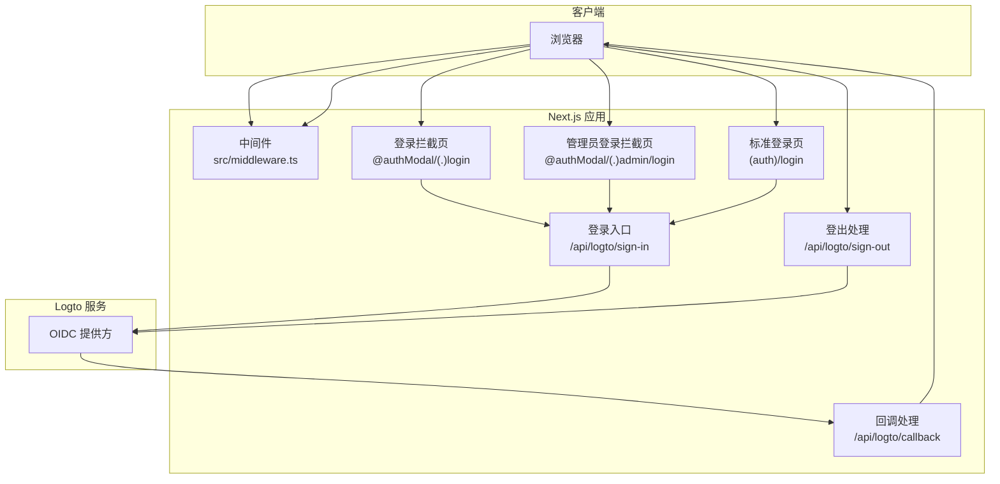
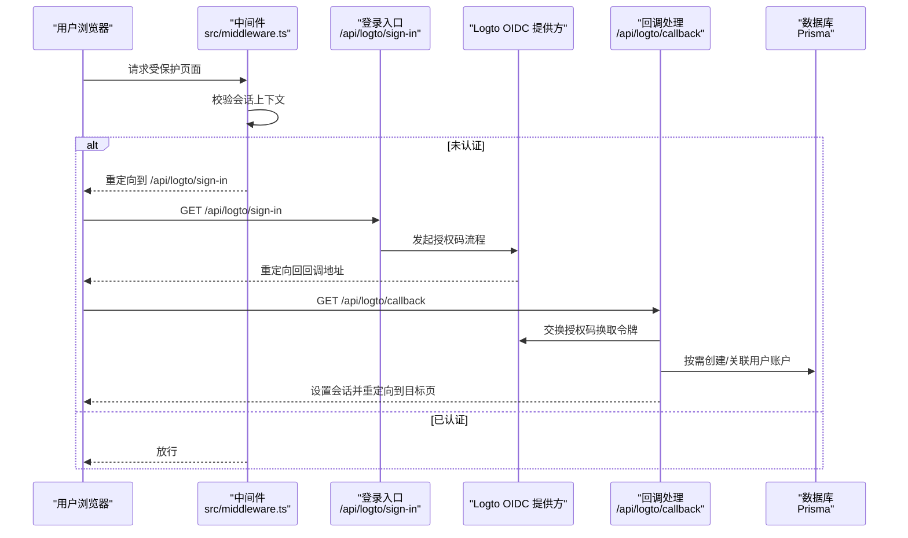
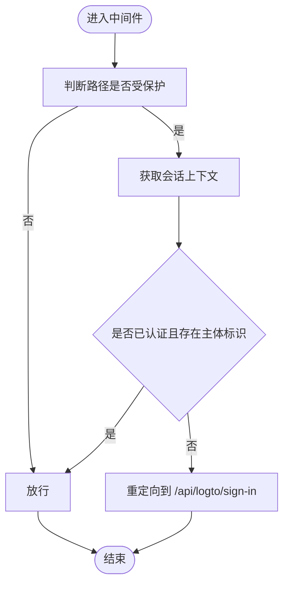
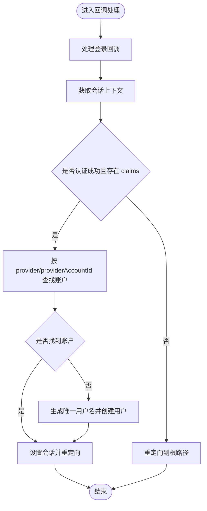
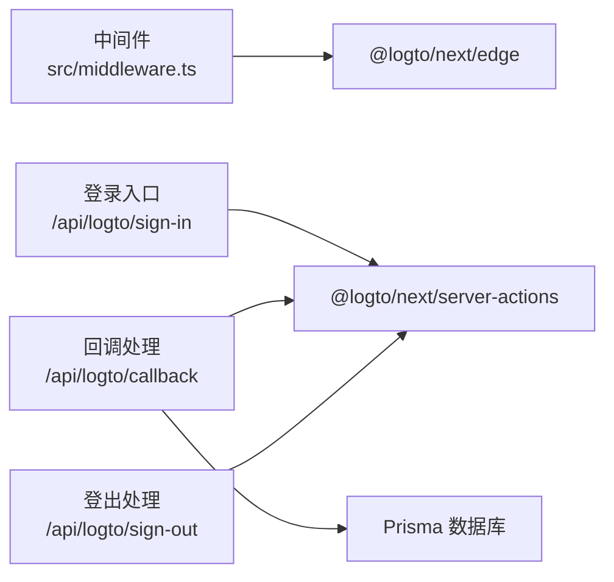

# 安全防护机制

<cite>
**本文引用的文件**
- [src/middleware.ts](file://src/middleware.ts)
- [src/app/api/logto/sign-in/route.ts](file://src/app/api/logto/sign-in/route.ts)
- [src/app/api/logto/callback/route.ts](file://src/app/api/logto/callback/route.ts)
- [src/app/api/logto/sign-out/route.ts](file://src/app/api/logto/sign-out/route.ts)
- [src/app/@authModal/(.)login/page.tsx](file://src/app/@authModal/(.)login/page.tsx)
- [src/app/@authModal/(.)admin/login/page.tsx](file://src/app/@authModal/(.)admin/login/page.tsx)
- [src/app/(auth)/login/page.tsx](file://src/app/(auth)/login/page.tsx)
- [AGENTS.md](file://AGENTS.md)
</cite>

## 目录
1. [引言](#引言)
2. [项目结构](#项目结构)
3. [核心组件](#核心组件)
4. [架构总览](#架构总览)
5. [详细组件分析](#详细组件分析)
6. [依赖关系分析](#依赖关系分析)
7. [性能考虑](#性能考虑)
8. [故障排查指南](#故障排查指南)
9. [结论](#结论)
10. [附录](#附录)

## 引言
本文件面向“一梦五千年”项目，系统化梳理并说明当前实现中的安全防护机制，重点覆盖以下方面：
- 基于 Logto 的身份认证集成方案：OAuth 2.0 授权码流程、回调处理、会话维护与中间件保护
- JWT 令牌与会话安全策略：Cookie 安全属性、会话上下文获取与校验
- CSRF 防护、XSS 攻击防范与 SQL 注入防护的现状与改进建议
- API 访问控制、权限验证与数据隔离机制
- 输入验证、输出编码与安全头设置的最佳实践
- 安全审计、漏洞扫描与应急响应预案的实施建议

本文件旨在帮助开发者与运维人员理解现有安全设计，并据此完善安全体系。

## 项目结构
围绕安全相关的关键目录与文件如下：
- 中间件：src/middleware.ts，负责受保护路径的会话校验与重定向
- Logto 集成 API：
  - 登录入口：src/app/api/logto/sign-in/route.ts
  - 回调处理：src/app/api/logto/callback/route.ts
  - 登出处理：src/app/api/logto/sign-out/route.ts
- 登录拦截页面：
  - 模态登录页：src/app/@authModal/(.)login/page.tsx
  - 管理员登录页：src/app/@authModal/(.)admin/login/page.tsx
  - 标准登录页：src/app/(auth)/login/page.tsx
- 文档参考：AGENTS.md，提供认证与会话获取的总体说明

图表来源
- [src/middleware.ts:1-35](file://src/middleware.ts#L1-L35)
- [src/app/api/logto/sign-in/route.ts:1-8](file://src/app/api/logto/sign-in/route.ts#L1-L8)
- [src/app/api/logto/callback/route.ts:1-41](file://src/app/api/logto/callback/route.ts#L1-L41)
- [src/app/api/logto/sign-out/route.ts:1-6](file://src/app/api/logto/sign-out/route.ts#L1-L6)
- [src/app/@authModal/(.)login/page.tsx](file://src/app/@authModal/(.)login/page.tsx#L1-L5)
- [src/app/@authModal/(.)admin/login/page.tsx](file://src/app/@authModal/(.)admin/login/page.tsx#L1-L5)
- [src/app/(auth)/login/page.tsx](file://src/app/(auth)/login/page.tsx#L1-L5)

章节来源
- [src/middleware.ts:1-35](file://src/middleware.ts#L1-L35)
- [src/app/api/logto/sign-in/route.ts:1-8](file://src/app/api/logto/sign-in/route.ts#L1-L8)
- [src/app/api/logto/callback/route.ts:1-41](file://src/app/api/logto/callback/route.ts#L1-L41)
- [src/app/api/logto/sign-out/route.ts:1-6](file://src/app/api/logto/sign-out/route.ts#L1-L6)
- [src/app/@authModal/(.)login/page.tsx](file://src/app/@authModal/(.)login/page.tsx#L1-L5)
- [src/app/@authModal/(.)admin/login/page.tsx](file://src/app/@authModal/(.)admin/login/page.tsx#L1-L5)
- [src/app/(auth)/login/page.tsx](file://src/app/(auth)/login/page.tsx#L1-L5)
- [AGENTS.md:149-195](file://AGENTS.md#L149-L195)

## 核心组件
- 中间件（Edge 运行时）：对受保护路径（如 /dashboard、/admin）进行会话校验，未通过则重定向至登录入口
- 登录入口 API：触发 Logto OAuth 授权码流程，设置回调地址
- 回调 API：完成登录回调、写入会话上下文、按需创建用户账户
- 登出 API：清理会话上下文
- 登录拦截页面：统一跳转到登录入口，确保用户从正确入口发起认证

章节来源
- [src/middleware.ts:8-28](file://src/middleware.ts#L8-L28)
- [src/app/api/logto/sign-in/route.ts:1-8](file://src/app/api/logto/sign-in/route.ts#L1-L8)
- [src/app/api/logto/callback/route.ts:1-41](file://src/app/api/logto/callback/route.ts#L1-L41)
- [src/app/api/logto/sign-out/route.ts:1-6](file://src/app/api/logto/sign-out/route.ts#L1-L6)
- [src/app/@authModal/(.)login/page.tsx](file://src/app/@authModal/(.)login/page.tsx#L1-L5)
- [src/app/@authModal/(.)admin/login/page.tsx](file://src/app/@authModal/(.)admin/login/page.tsx#L1-L5)
- [src/app/(auth)/login/page.tsx](file://src/app/(auth)/login/page.tsx#L1-L5)
- [AGENTS.md:163-168](file://AGENTS.md#L163-L168)

## 架构总览
下图展示从浏览器到 Logto 的 OAuth 2.0 流程以及回调后的会话建立过程。

图表来源
- [src/middleware.ts:8-28](file://src/middleware.ts#L8-L28)
- [src/app/api/logto/sign-in/route.ts:1-8](file://src/app/api/logto/sign-in/route.ts#L1-L8)
- [src/app/api/logto/callback/route.ts:1-41](file://src/app/api/logto/callback/route.ts#L1-L41)

## 详细组件分析

### 中间件与会话保护
- 受保护路径匹配：对 /dashboard 与 /admin 下非登录页进行保护
- 会话校验：通过 Edge 运行时的 Logto 客户端获取会话上下文，若未认证则重定向至登录入口
- 重定向策略：未登录时统一重定向到 /api/logto/sign-in，避免直接暴露登录 UI

图表来源
- [src/middleware.ts:8-28](file://src/middleware.ts#L8-L28)

章节来源
- [src/middleware.ts:8-28](file://src/middleware.ts#L8-L28)

### 登录入口与 OAuth 2.0 授权码流程
- 触发方式：GET /api/logto/sign-in
- 行为：调用 Logto 的登录动作，携带回调地址（/api/logto/callback），完成授权码流程
- 结果：浏览器被重定向至 OIDC 提供方进行用户授权，随后回调应用

章节来源
- [src/app/api/logto/sign-in/route.ts:1-8](file://src/app/api/logto/sign-in/route.ts#L1-L8)

### 回调处理与会话建立
- 触发方式：GET /api/logto/callback
- 行为：
  - 完成登录回调，获取会话上下文
  - 若认证失败则重定向至根路径
  - 解析 claims（如 sub、username、email、name、picture）
  - 基于 provider 与 providerAccountId 查找账户，不存在则按规则生成唯一用户名并创建用户记录
  - 设置会话上下文并重定向至应用目标页

图表来源
- [src/app/api/logto/callback/route.ts:1-41](file://src/app/api/logto/callback/route.ts#L1-L41)

章节来源
- [src/app/api/logto/callback/route.ts:6-41](file://src/app/api/logto/callback/route.ts#L6-L41)

### 登出流程
- 触发方式：GET /api/logto/sign-out
- 行为：调用登出动作，清理会话上下文

章节来源
- [src/app/api/logto/sign-out/route.ts:1-6](file://src/app/api/logto/sign-out/route.ts#L1-L6)

### 登录拦截页面
- 模态登录页与管理员登录页均重定向至 /api/logto/sign-in，确保统一的认证入口
- 标准登录页同样重定向至 /api/logto/sign-in

章节来源
- [src/app/@authModal/(.)login/page.tsx](file://src/app/@authModal/(.)login/page.tsx#L1-L5)
- [src/app/@authModal/(.)admin/login/page.tsx](file://src/app/@authModal/(.)admin/login/page.tsx#L1-L5)
- [src/app/(auth)/login/page.tsx](file://src/app/(auth)/login/page.tsx#L1-L5)

## 依赖关系分析
- 中间件依赖 Logto Edge 客户端以在 Edge 运行时获取会话上下文
- 登录入口、回调与登出 API 依赖 @logto/next 的 server-actions
- 回调处理中使用 Prisma 进行用户账户的持久化

图表来源
- [src/middleware.ts:1-6](file://src/middleware.ts#L1-L6)
- [src/app/api/logto/sign-in/route.ts:1-2](file://src/app/api/logto/sign-in/route.ts#L1-L2)
- [src/app/api/logto/callback/route.ts:1-4](file://src/app/api/logto/callback/route.ts#L1-L4)
- [src/app/api/logto/sign-out/route.ts:1-2](file://src/app/api/logto/sign-out/route.ts#L1-L2)

章节来源
- [src/middleware.ts:1-6](file://src/middleware.ts#L1-L6)
- [src/app/api/logto/sign-in/route.ts:1-2](file://src/app/api/logto/sign-in/route.ts#L1-L2)
- [src/app/api/logto/callback/route.ts:1-4](file://src/app/api/logto/callback/route.ts#L1-L4)
- [src/app/api/logto/sign-out/route.ts:1-2](file://src/app/api/logto/sign-out/route.ts#L1-L2)

## 性能考虑
- Edge 中间件：在边缘运行时进行会话校验，减少主应用负载
- 会话上下文获取：通过 Logto 客户端在 Edge 上下文中快速获取，避免不必要的后端往返
- 回调处理：仅在首次登录或账户缺失时执行用户创建逻辑，后续复用已有账户

## 故障排查指南
- 无法进入受保护页面
  - 检查中间件是否正确匹配路径与重定向逻辑
  - 确认浏览器是否已设置来自 Logto 的会话 Cookie
  - 参考：[src/middleware.ts:8-28](file://src/middleware.ts#L8-L28)
- 登录后仍提示未登录
  - 检查回调处理是否成功获取会话上下文并设置会话
  - 确认回调中 claims 是否包含必要字段
  - 参考：[src/app/api/logto/callback/route.ts:10-24](file://src/app/api/logto/callback/route.ts#L10-L24)
- 回调后未创建用户
  - 检查 provider 与 providerAccountId 是否匹配
  - 确认用户名唯一性生成与数据库写入逻辑
  - 参考：[src/app/api/logto/callback/route.ts:21-41](file://src/app/api/logto/callback/route.ts#L21-L41)
- 登出无效
  - 检查登出 API 是否被正确调用
  - 参考：[src/app/api/logto/sign-out/route.ts:1-6](file://src/app/api/logto/sign-out/route.ts#L1-L6)

章节来源
- [src/middleware.ts:8-28](file://src/middleware.ts#L8-L28)
- [src/app/api/logto/callback/route.ts:10-41](file://src/app/api/logto/callback/route.ts#L10-L41)
- [src/app/api/logto/sign-out/route.ts:1-6](file://src/app/api/logto/sign-out/route.ts#L1-L6)

## 结论
当前实现基于 Logto 在 Edge 中间件与 API 层面完成了基本的认证与会话保护，OAuth 2.0 授权码流程与回调处理清晰，具备可扩展的用户账户创建能力。为进一步提升整体安全性，建议补充 CSRF 防护、XSS 与 SQL 注入防护、API 权限验证与数据隔离、输入验证与输出编码、安全头设置、安全审计与漏洞扫描及应急响应预案等措施。

## 附录

### CSRF 防护
- 建议
  - 对所有状态变更请求启用 SameSite Cookie 与 CSRF Token
  - 在表单与 AJAX 请求中携带并校验一次性 CSRF Token
  - 严格限制来源（Origin/Header）与 Referer 校验
- 参考
  - [src/middleware.ts:1-35](file://src/middleware.ts#L1-L35)
  - [src/app/api/logto/sign-in/route.ts:1-8](file://src/app/api/logto/sign-in/route.ts#L1-L8)
  - [src/app/api/logto/callback/route.ts:1-41](file://src/app/api/logto/callback/route.ts#L1-L41)

### XSS 攻击防范
- 建议
  - 对所有用户输入进行严格的白名单过滤与长度限制
  - 输出时采用模板引擎或框架内置的自动转义
  - 设置 Content-Security-Policy（CSP）、X-Content-Type-Options、X-Frame-Options 等安全头
- 参考
  - [src/app/api/logto/callback/route.ts:26-41](file://src/app/api/logto/callback/route.ts#L26-L41)

### SQL 注入防护
- 建议
  - 严格使用 ORM（Prisma）查询，避免原生 SQL 拼接
  - 对外部输入进行参数化与白名单校验
  - 定期审查数据库访问点，确保无动态拼接
- 参考
  - [src/app/api/logto/callback/route.ts:21-41](file://src/app/api/logto/callback/route.ts#L21-L41)

### API 访问控制与权限验证
- 建议
  - 在每个 API 路由内再次校验会话与角色权限
  - 实施最小权限原则与资源级授权
  - 对敏感接口增加速率限制与审计日志
- 参考
  - [src/middleware.ts:15-25](file://src/middleware.ts#L15-L25)

### 数据隔离机制
- 建议
  - 基于用户 ID 或租户 ID 进行查询过滤
  - 对多租户场景引入租户上下文
- 参考
  - [src/app/api/logto/callback/route.ts:21-41](file://src/app/api/logto/callback/route.ts#L21-L41)

### 输入验证与输出编码
- 建议
  - 使用强类型与模式校验（如 Zod）在入口处验证请求体
  - 对输出内容进行 HTML/JS/CSS/URL 编码
- 参考
  - [src/app/api/logto/callback/route.ts:19-24](file://src/app/api/logto/callback/route.ts#L19-L24)

### 安全头设置
- 建议
  - 设置 Strict-Transport-Security、Referrer-Policy、Permissions-Policy
  - 启用 X-Content-Type-Options 与 X-Frame-Options
- 参考
  - [src/middleware.ts:1-35](file://src/middleware.ts#L1-L35)

### 安全审计、漏洞扫描与应急响应
- 建议
  - 定期进行 SAST/DAST 扫描与依赖漏洞检查
  - 建立异常登录检测与告警机制
  - 制定密码重置、账户冻结与会话吊销的应急流程
- 参考
  - [AGENTS.md:149-195](file://AGENTS.md#L149-L195)