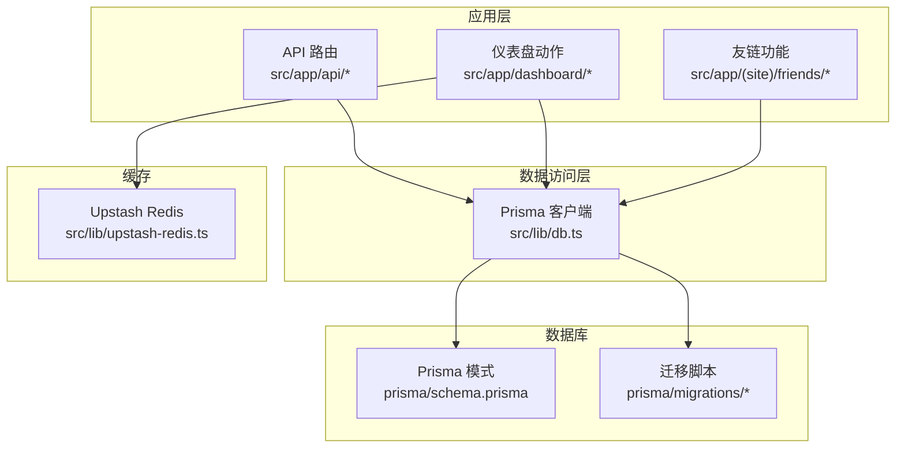
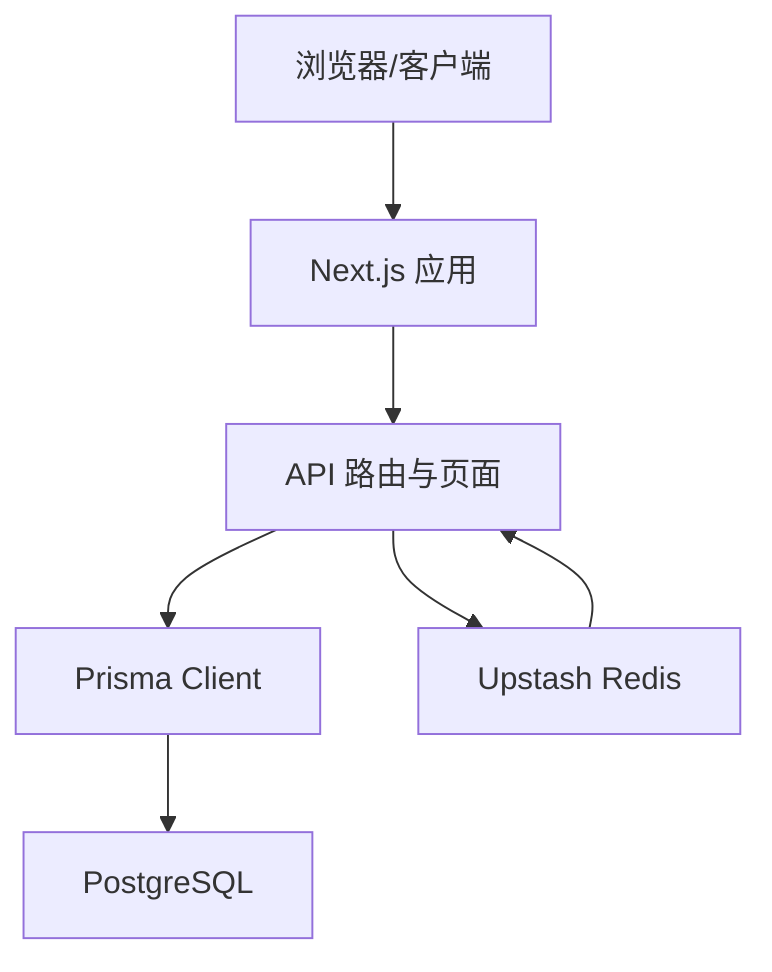
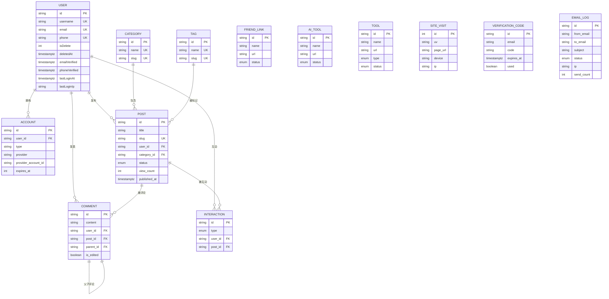
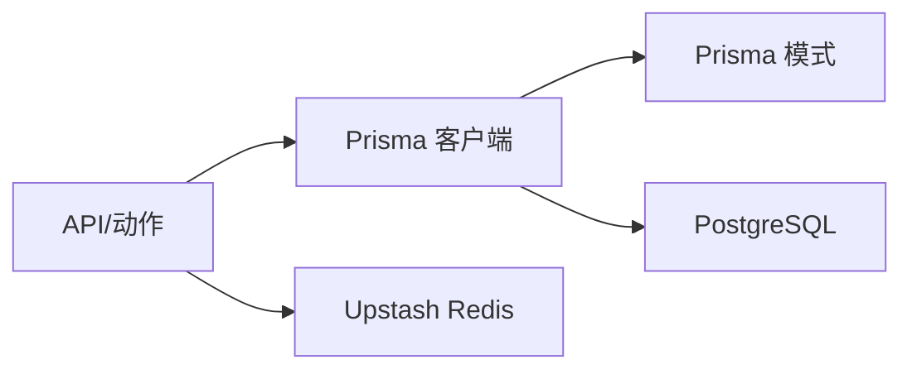
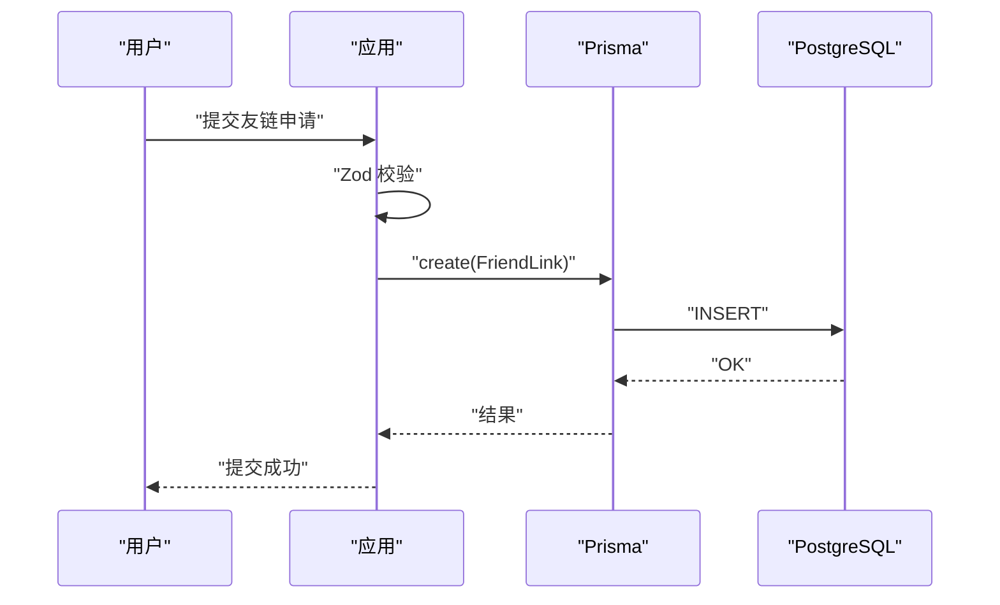

# 数据库架构

<cite>
**本文引用的文件**
- [prisma/schema.prisma](file://prisma/schema.prisma)
- [src/lib/db.ts](file://src/lib/db.ts)
- [src/app/api/test-db/route.ts](file://src/app/api/test-db/route.ts)
- [src/app/dashboard/email-logs/actions.ts](file://src/app/dashboard/email-logs/actions.ts)
- [src/lib/upstash-redis.ts](file://src/lib/upstash-redis.ts)
- [scripts/test-prisma-standard.ts](file://scripts/test-prisma-standard.ts)
- [src/app/(site)/friends/actions.ts](file://src/app/(site)/friends/actions.ts)
</cite>

## 目录
1. [简介](#简介)
2. [项目结构](#项目结构)
3. [核心组件](#核心组件)
4. [架构总览](#架构总览)
5. [详细组件分析](#详细组件分析)
6. [依赖分析](#依赖分析)
7. [性能考虑](#性能考虑)
8. [故障排查指南](#故障排查指南)
9. [结论](#结论)
10. [附录](#附录)

## 简介
本文件面向“一梦五千年”项目的数据库架构，围绕基于 Prisma ORM 的数据模型进行系统化梳理与说明。内容涵盖实体关系模型、字段定义与约束、索引策略与查询优化、迁移与版本控制、缓存与读写分离、性能监控、数据安全与访问控制、以及连接池配置、事务管理与错误恢复机制等。

## 项目结构
数据库相关的核心文件集中在以下位置：
- 数据模型与迁移：prisma/schema.prisma、prisma/migrations/*
- 应用侧数据库客户端：src/lib/db.ts
- 数据库连通性测试：src/app/api/test-db/route.ts、scripts/test-prisma-standard.ts
- 邮件发送与日志：src/app/dashboard/email-logs/actions.ts
- 缓存层（Redis）：src/lib/upstash-redis.ts
- 友链申请与公开列表：src/app/(site)/friends/actions.ts

图表来源
- [src/lib/db.ts:1-16](file://src/lib/db.ts#L1-L16)
- [prisma/schema.prisma:1-308](file://prisma/schema.prisma#L1-L308)
- [src/app/api/test-db/route.ts:1-14](file://src/app/api/test-db/route.ts#L1-L14)
- [src/app/dashboard/email-logs/actions.ts:1-63](file://src/app/dashboard/email-logs/actions.ts#L1-L63)
- [src/lib/upstash-redis.ts:1-14](file://src/lib/upstash-redis.ts#L1-L14)
- [src/app/(site)/friends/actions.ts:1-33](file://src/app/(site)/friends/actions.ts#L1-L33)

章节来源
- [prisma/schema.prisma:1-308](file://prisma/schema.prisma#L1-L308)
- [src/lib/db.ts:1-16](file://src/lib/db.ts#L1-L16)

## 核心组件
- 数据源与客户端
  - 数据源：PostgreSQL，运行时通过 DATABASE_URL 连接池（默认端口 6543），迁移直连通过 DIRECT_URL（默认端口 5432）。
  - 客户端：Prisma Client，按开发/生产环境启用不同日志级别；支持 relationJoins 预览特性以减少关联查询往返。
- 数据模型概览
  - 用户与账户：User、Account（第三方登录）
  - 内容生态：Category、Tag、Post、Comment、Interaction
  - 站点与工具：FriendLink、AiTool、Tool
  - 统计与安全：SiteVisit、VerificationCode、EmailLog
- 枚举类型：Role、PostStatus、InteractionType、FriendLinkStatus、AiToolStatus、ToolType、ToolStatus、EmailStatus

章节来源
- [prisma/schema.prisma:1-13](file://prisma/schema.prisma#L1-L13)
- [prisma/schema.prisma:15-308](file://prisma/schema.prisma#L15-L308)
- [src/lib/db.ts:1-16](file://src/lib/db.ts#L1-L16)

## 架构总览
下图展示应用如何通过 Prisma 访问数据库，以及与缓存层的协作关系。

图表来源
- [src/lib/db.ts:1-16](file://src/lib/db.ts#L1-L16)
- [src/lib/upstash-redis.ts:1-14](file://src/lib/upstash-redis.ts#L1-L14)
- [prisma/schema.prisma:7-13](file://prisma/schema.prisma#L7-L13)

## 详细组件分析

### 实体关系模型与字段定义
- User（用户）
  - 关键字段：id、username、email、password、nickname、avatar、bio、gender、role、isActive、isDelete、deletedAt、emailVerified、phone、phoneVerified、createdAt、updatedAt、lastLoginAt、lastLoginIp
  - 约束：username/email/phone 唯一；isDelete 作为软删除标记；使用 timestamptz 存储带时区的时间戳。
  - 关系：拥有 Account、Post、Comment、Interaction。
  - 索引：isDelete、(email, username)。
- Account（第三方账户）
  - 关键字段：id、userId、type、provider、providerAccountId、refreshToken、accessToken、expiresAt、tokenType、scope、idToken、sessionState
  - 约束：provider+providerAccountId 唯一；外键关联 User，删除级联。
  - 索引：userId。
- Category（分类）、Tag（标签）
  - 关键字段：id、name、slug、description、icon、color、createdAt、updatedAt
  - 约束：name/slug 唯一。
- Post（文章）
  - 关键字段：id、title、slug、content、excerpt、coverImage、status、viewCount、userId、categoryId、publishedAt、createdAt、updatedAt
  - 约束：slug 唯一；status 默认 DRAFT；viewCount 默认 0；外键关联 User 和 Category。
  - 索引：userId、categoryId。
- Comment（评论）
  - 关键字段：id、content、userId、postId、parentId、isEdited、createdAt、updatedAt
  - 约束：自引用父子评论；外键关联 Post/User；删除限制；删除级联。
  - 索引：postId、userId、parentId。
- Interaction（互动）
  - 关键字段：id、type（LIKE/FAVORITE）、userId、postId、createdAt
  - 约束：唯一索引 (userId, postId, type)；外键关联 Post/User；删除级联。
  - 索引：postId、userId。
- FriendLink（友链）
  - 关键字段：id、name、url、description、logo、coverImage、email、status、createdAt、updatedAt
  - 约束：status 默认 PENDING。
- AiTool（AI 工具）
  - 关键字段：id、name、description、url、icon、coverImage、category、tags、status、createdAt、updatedAt
  - 约束：status 默认 PENDING。
- Tool（工具）
  - 关键字段：id、name、description、icon、version、status、type、url、category、createdAt、updatedAt
  - 约束：type 默认 EXTERNAL；status 默认 NORMAL。
- SiteVisit（站点访问）
  - 关键字段：id、uv、pageUrl、device、referrer、ip、createdAt
  - 索引：uv、pageUrl、createdAt。
- VerificationCode（验证码）
  - 关键字段：id、email、code、expiresAt、createdAt、used
  - 索引：(email, createdAt)。
- EmailLog（邮件日志）
  - 关键字段：id、fromEmail、toEmail、subject、content、status、errorMessage、ip、sendCount、createdAt、sentAt
  - 索引：ip、createdAt、status。

章节来源
- [prisma/schema.prisma:15-308](file://prisma/schema.prisma#L15-L308)

### 关系与依赖
- 一对多：User → Account/Post/Comment/Interaction
- 多对多：Post ↔ Tag（通过关系字段）
- 外键约束：Post.userId → User.id（RESTRICT/CASCADE 视场景）、Post.categoryId → Category.id、Comment.userId/postId → User/Post（CASCADE）、Interaction.userId/postId → User/Post（CASCADE）
- 自引用：Comment.parentId → Comment.id（RESTRICT）

图表来源
- [prisma/schema.prisma:15-167](file://prisma/schema.prisma#L15-L167)

### 索引策略与查询优化
- 单列索引
  - User：isDelete、(email, username)
  - Post：userId、categoryId
  - Comment：postId、userId、parentId
  - Interaction：postId、userId
  - SiteVisit：uv、pageUrl、createdAt
  - VerificationCode：(email, createdAt)
  - EmailLog：ip、createdAt、status
- 复合索引
  - Account：(provider, providerAccountId) 唯一
  - Interaction：(userId, postId, type) 唯一
- 查询优化建议
  - 使用 relationJoins 预览特性减少关联查询往返，降低 N+1 问题影响。
  - 对高频过滤字段（如 User.isDelete、Post.status、EmailLog.status）建立合适索引。
  - 利用 Prisma 的 include/fields 限定返回字段，避免不必要的数据传输。
  - 对分页查询使用基于游标的排序（如 createdAt desc）以提升稳定性。

章节来源
- [prisma/schema.prisma:1-5](file://prisma/schema.prisma#L1-L5)
- [prisma/schema.prisma:59-259](file://prisma/schema.prisma#L59-L259)

### 数据库迁移管理与版本控制
- 迁移入口：prisma/migrations/* 目录下按时间戳命名的迁移文件。
- 迁移锁：migration_lock.toml 用于防止并发迁移。
- 迁移流程
  - 开发/CI 中使用 DATABASE_URL 连接池执行迁移。
  - 直连模式（DIRECT_URL）用于特定迁移任务或离线维护。
- 版本控制
  - 将 schema.prisma 与迁移文件纳入版本控制，确保团队一致。
  - 迁移脚本仅允许追加，禁止回滚或修改历史迁移。

章节来源
- [prisma/schema.prisma:7-13](file://prisma/schema.prisma#L7-L13)

### 缓存层设计与读写分离
- 缓存层
  - Upstash Redis：提供 REST 接口封装，按需初始化连接；用于会话、验证码缓存、限流等。
- 读写分离
  - 当前模式：应用层统一通过 Prisma 访问主库；未见显式的只读副本或读写分离配置。
  - 建议：对只读查询（如文章列表、统计）在具备只读副本时进行分流，写操作集中于主库。

章节来源
- [src/lib/upstash-redis.ts:1-14](file://src/lib/upstash-redis.ts#L1-L14)
- [prisma/schema.prisma:7-13](file://prisma/schema.prisma#L7-L13)

### 性能监控与可观测性
- 日志级别
  - 开发环境开启 query/warn/error；生产环境仅 error，降低日志噪声。
- 连接池与直连
  - 运行时 DATABASE_URL（默认 6543）用于连接池；迁移 DIRECT_URL（默认 5432）用于直连。
- 健康检查
  - 提供 /api/test-db 接口进行连通性测试；标准脚本 test-prisma-standard.ts 支持独立测试。

章节来源
- [src/lib/db.ts:8-14](file://src/lib/db.ts#L8-L14)
- [src/app/api/test-db/route.ts:1-14](file://src/app/api/test-db/route.ts#L1-L14)
- [scripts/test-prisma-standard.ts:1-20](file://scripts/test-prisma-standard.ts#L1-L20)

### 数据安全、访问控制与合规
- 字段安全
  - 密码字段为可空（支持第三方登录），敏感信息使用 timestamptz 存储变更时间。
  - 软删除字段 isDelete 与 deletedAt 便于审计与恢复。
- 访问控制
  - 用户角色枚举 Role（USER/ADMIN）用于权限判定；仪表盘相关操作仅管理员可见。
  - 验证码表 VerificationCode 包含过期时间与使用状态，防止滥用。
- 合规
  - 使用 timestamptz 保证时间精度与合规记录；EmailLog 记录发送状态与错误信息，满足审计需求。

章节来源
- [prisma/schema.prisma:262-307](file://prisma/schema.prisma#L262-L307)
- [src/app/dashboard/email-logs/actions.ts:1-63](file://src/app/dashboard/email-logs/actions.ts#L1-L63)

### 连接池配置、事务管理与错误恢复
- 连接池
  - 通过 DATABASE_URL 配置连接池参数；迁移阶段使用 DIRECT_URL 直连。
- 事务
  - 在需要强一致性的场景（如邮件重试与状态更新）使用 Prisma 事务包裹，确保原子性。
- 错误恢复
  - 测试接口捕获异常并返回结构化错误；仪表盘动作中对失败状态进行回滚与重试标记。
  - Redis 初始化失败时返回空值，避免阻塞主流程。

章节来源
- [prisma/schema.prisma:7-13](file://prisma/schema.prisma#L7-L13)
- [src/app/api/test-db/route.ts:4-13](file://src/app/api/test-db/route.ts#L4-L13)
- [src/app/dashboard/email-logs/actions.ts:9-62](file://src/app/dashboard/email-logs/actions.ts#L9-L62)
- [src/lib/upstash-redis.ts:5-14](file://src/lib/upstash-redis.ts#L5-L14)

## 依赖分析
- 应用对 Prisma 的依赖
  - 所有业务路由与动作均通过 src/lib/db.ts 获取 PrismaClient 实例。
  - API 路由与仪表盘动作共同构成主要数据访问路径。
- 外部依赖
  - PostgreSQL 作为持久化存储。
  - Upstash Redis 作为缓存层补充。

图表来源
- [src/lib/db.ts:1-16](file://src/lib/db.ts#L1-L16)
- [prisma/schema.prisma:1-308](file://prisma/schema.prisma#L1-L308)
- [src/lib/upstash-redis.ts:1-14](file://src/lib/upstash-redis.ts#L1-L14)

章节来源
- [src/lib/db.ts:1-16](file://src/lib/db.ts#L1-L16)
- [src/app/api/test-db/route.ts:1-14](file://src/app/api/test-db/route.ts#L1-L14)

## 性能考虑
- 查询优化
  - 优先使用复合索引与单列索引覆盖常见过滤条件。
  - 使用 relationJoins 减少关联查询往返。
- 缓存策略
  - 对热点只读数据（如友链列表、公开文章）引入缓存，降低数据库压力。
- 连接与资源
  - 控制 Prisma 客户端生命周期，避免重复实例化。
  - 在高并发场景评估连接池大小与超时参数。

## 故障排查指南
- 连接失败
  - 检查 DATABASE_URL/DIRECT_URL 配置是否正确；通过 /api/test-db 或 test-prisma-standard.ts 验证。
- 权限不足
  - 确认数据库用户具备相应权限；迁移时使用 DIRECT_URL。
- 查询缓慢
  - 分析慢查询日志，确认索引是否命中；必要时调整查询或添加索引。
- 事务异常
  - 在事务块内捕获错误并回滚，确保数据一致性；参考仪表盘动作中的重试逻辑。

章节来源
- [src/app/api/test-db/route.ts:4-13](file://src/app/api/test-db/route.ts#L4-L13)
- [scripts/test-prisma-standard.ts:9-17](file://scripts/test-prisma-standard.ts#L9-L17)
- [src/app/dashboard/email-logs/actions.ts:51-62](file://src/app/dashboard/email-logs/actions.ts#L51-L62)

## 结论
本项目采用 Prisma ORM 管理 PostgreSQL 数据库，数据模型清晰、索引策略合理，并通过缓存层与连接池实现基本的性能与可用性保障。建议后续完善只读副本与读写分离、细化缓存策略与失效机制，并持续优化关键查询路径与索引覆盖。

## 附录
- 友链申请流程（示意）
  - 前端提交申请 → 后端校验 → 写入 FriendLink（默认 PENDING）→ 管理员审核 → 更新状态

图表来源
- [src/app/(site)/friends/actions.ts:15-26](file://src/app/(site)/friends/actions.ts#L15-L26)
- [prisma/schema.prisma:169-182](file://prisma/schema.prisma#L169-L182)