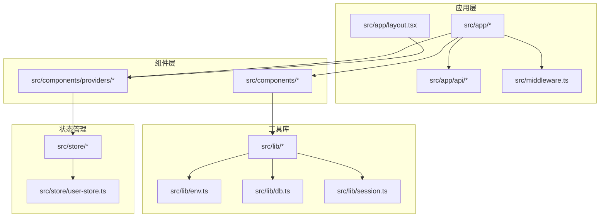
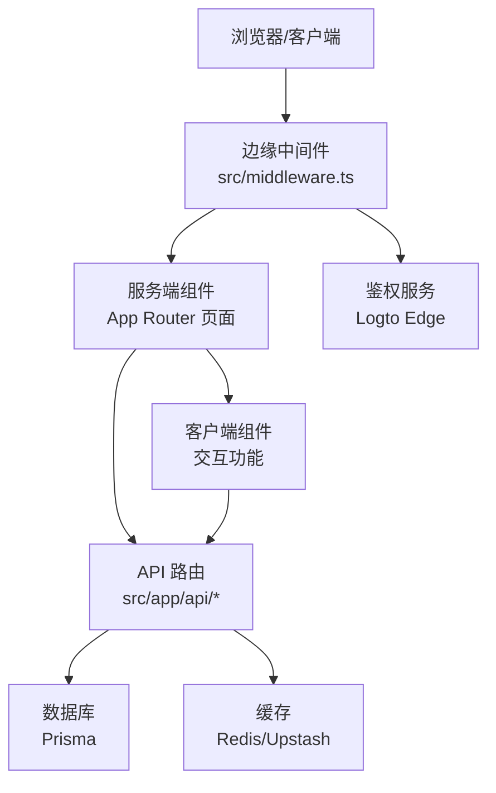
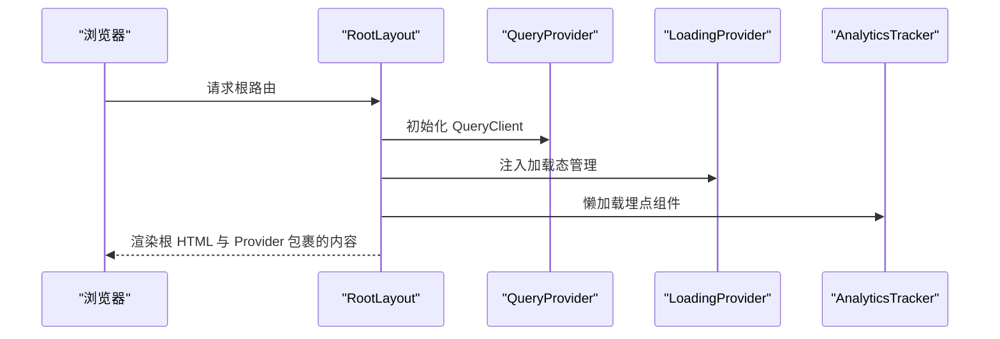
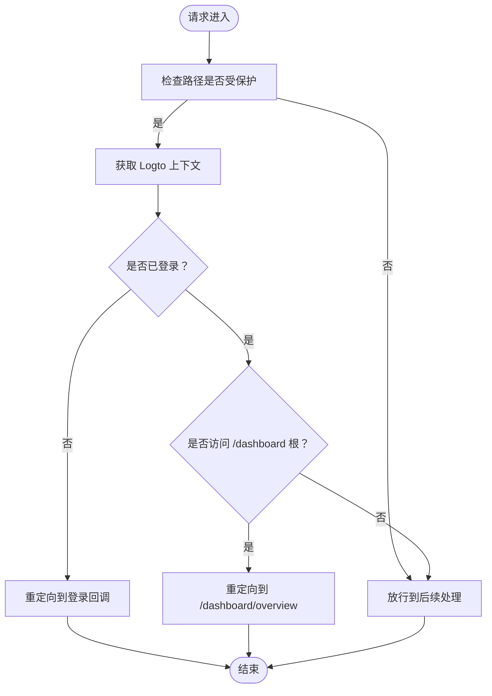
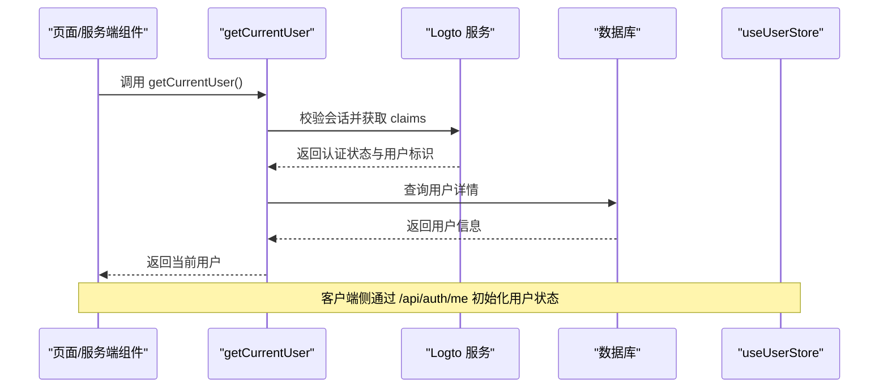
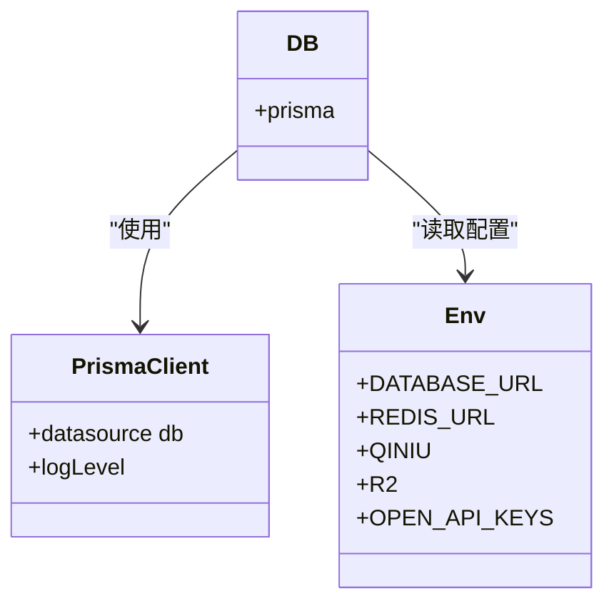
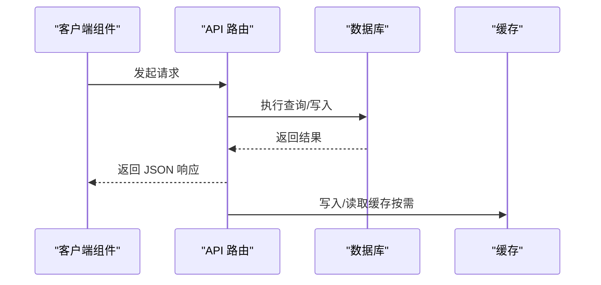
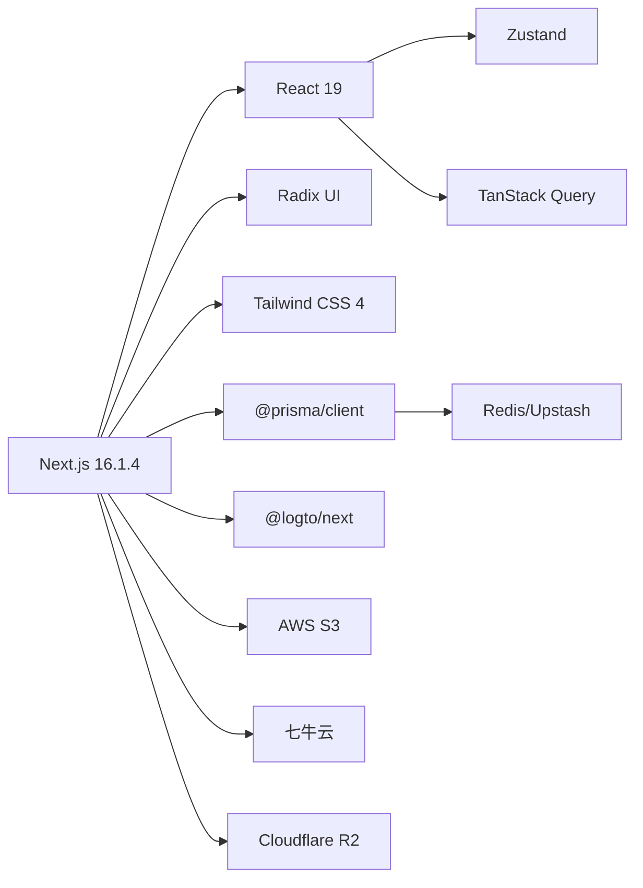

# 整体架构概览

<cite>
**本文引用的文件**
- [package.json](file://package.json)
- [next.config.ts](file://next.config.ts)
- [README.md](file://README.md)
- [src/middleware.ts](file://src/middleware.ts)
- [src/app/layout.tsx](file://src/app/layout.tsx)
- [src/lib/db.ts](file://src/lib/db.ts)
- [src/lib/env.ts](file://src/lib/env.ts)
- [src/lib/session.ts](file://src/lib/session.ts)
- [src/store/user-store.ts](file://src/store/user-store.ts)
- [src/components/providers/query-provider.tsx](file://src/components/providers/query-provider.tsx)
- [src/components/providers/loading-provider.tsx](file://src/components/providers/loading-provider.tsx)
</cite>

## 目录
1. [引言](#引言)
2. [项目结构](#项目结构)
3. [核心组件](#核心组件)
4. [架构总览](#架构总览)
5. [详细组件分析](#详细组件分析)
6. [依赖关系分析](#依赖关系分析)
7. [性能考量](#性能考量)
8. [故障排查指南](#故障排查指南)
9. [结论](#结论)
10. [附录](#附录)

## 引言
本项目是一梦五千年多功能工具平台与博客系统，采用 Next.js 16 App Router 构建，结合服务端组件（Server Components）、客户端组件（Client Components）与边缘中间件（Edge Middleware），实现前后端一体化的混合渲染架构。系统围绕“全局布局 + 分组路由 + 中间件鉴权 + 数据层抽象”的设计展开，提供用户认证、博客管理、AI 工具库、实用工具箱、友链管理、邮件系统与数据分析等能力。

## 项目结构
项目采用标准 Next.js 16 App Router 目录结构，核心入口为 src/app 下的页面与路由，配合 src/lib、src/components、src/store 等模块化目录，形成清晰的分层与职责划分：

- 应用层（src/app）
  - 全局布局与根路由：src/app/layout.tsx、src/app/page.tsx
  - 分组路由与页面：如 (auth)/ 登录注册、(site)/ 博客与工具、dashboard/ 管理后台、editor/ 编辑器等
  - API 路由：src/app/api/* 提供 REST 接口
  - 边缘中间件：src/middleware.ts 实现鉴权与重定向逻辑
- 组件层（src/components）
  - UI 组件库与业务通用组件（如 Provider、布局组件、工具组件）
- 工具库（src/lib）
  - 环境变量、数据库连接、会话上下文、HTTP 封装、第三方 SDK 等
- 状态管理（src/store）
  - 用户状态、加载状态等轻量状态存储
- 配置与构建（next.config.ts、tsconfig.json、eslint.config.mjs 等）

图表来源
- [src/app/layout.tsx:1-52](file://src/app/layout.tsx#L1-L52)
- [src/middleware.ts:1-36](file://src/middleware.ts#L1-L36)
- [src/lib/db.ts:1-16](file://src/lib/db.ts#L1-L16)
- [src/lib/env.ts:1-40](file://src/lib/env.ts#L1-L40)
- [src/lib/session.ts:1-42](file://src/lib/session.ts#L1-L42)
- [src/store/user-store.ts:1-49](file://src/store/user-store.ts#L1-L49)
- [src/components/providers/query-provider.tsx:1-22](file://src/components/providers/query-provider.tsx#L1-L22)
- [src/components/providers/loading-provider.tsx:1-49](file://src/components/providers/loading-provider.tsx#L1-L49)

章节来源
- [README.md:54-69](file://README.md#L54-L69)

## 核心组件
- 全局布局与根页面
  - 根布局负责字体、主题、全局 Provider 包裹与全局提示组件挂载
  - 提供 QueryClientProvider、LoadingProvider、AnalyticsTracker、Toaster 等基础设施
- 中间件（Edge）
  - 对受保护路径进行鉴权拦截，未登录则跳转到登录回调；对特定路径做重定向
- 数据与会话
  - 数据库连接通过 PrismaClient 管理，开发环境下开启日志
  - 会话上下文通过 React cache + Logto 获取当前用户，避免重复校验与查询
- 状态管理
  - 用户状态使用 Zustand，提供获取用户、更新、登出等方法，并通过 /api/auth/me 获取后端用户信息
- 数据获取与加载态
  - React Query 作为统一数据获取与缓存层，默认缓存策略减少网络请求
  - LoadingProvider 基于 Query fetching/mutating 与手动标记，统一控制顶部进度条

章节来源
- [src/app/layout.tsx:26-51](file://src/app/layout.tsx#L26-L51)
- [src/middleware.ts:8-28](file://src/middleware.ts#L8-L28)
- [src/lib/db.ts:5-14](file://src/lib/db.ts#L5-L14)
- [src/lib/session.ts:17-41](file://src/lib/session.ts#L17-L41)
- [src/store/user-store.ts:26-42](file://src/store/user-store.ts#L26-L42)
- [src/components/providers/query-provider.tsx:6-21](file://src/components/providers/query-provider.tsx#L6-L21)
- [src/components/providers/loading-provider.tsx:7-48](file://src/components/providers/loading-provider.tsx#L7-L48)

## 架构总览
系统采用“服务端渲染 + 客户端交互”的混合渲染模式：
- 服务端组件（SSR/SSG）负责首屏内容与 SEO，适合列表页、静态内容、受保护页面的鉴权前置
- 客户端组件负责交互性强的功能，如工具面板、动画、实时状态、对话框等
- 边缘中间件在请求进入阶段完成鉴权与路径处理，降低下游负载
- 数据层通过 Prisma + Redis（可选）+ Upstash Redis（可选）提供持久化与缓存能力
- 状态层通过 Zustand 与 React Query 协作，前者处理用户态与轻量 UI 状态，后者处理跨页面数据缓存与并发

图表来源
- [src/middleware.ts:8-28](file://src/middleware.ts#L8-L28)
- [src/lib/session.ts:17-41](file://src/lib/session.ts#L17-L41)
- [src/lib/db.ts:5-14](file://src/lib/db.ts#L5-L14)
- [src/store/user-store.ts:26-42](file://src/store/user-store.ts#L26-L42)

## 详细组件分析

### 全局布局与 Provider 体系
- 根布局负责：
  - 字体与主题注入
  - QueryClientProvider 默认缓存策略
  - LoadingProvider 控制全局加载进度
  - AnalyticsTracker（Suspense 包裹）
  - Toaster 全局通知
- Provider 设计遵循“就近包裹”原则，确保最小范围内的状态共享

图表来源
- [src/app/layout.tsx:38-47](file://src/app/layout.tsx#L38-L47)
- [src/components/providers/query-provider.tsx:6-21](file://src/components/providers/query-provider.tsx#L6-L21)
- [src/components/providers/loading-provider.tsx:7-48](file://src/components/providers/loading-provider.tsx#L7-L48)

章节来源
- [src/app/layout.tsx:26-51](file://src/app/layout.tsx#L26-L51)

### 中间件与鉴权流程
- 受保护路径匹配：/dashboard 与 /admin（除 /admin/login）
- 首次访问受保护路径时，若未登录则重定向至 /api/logto/sign-in
- 登录成功后放行；/dashboard 根路径重定向到 /dashboard/overview
- 使用 Edge 运行时，具备低延迟与高吞吐特性

图表来源
- [src/middleware.ts:8-28](file://src/middleware.ts#L8-L28)

章节来源
- [src/middleware.ts:8-36](file://src/middleware.ts#L8-L36)

### 会话与用户状态
- 服务端侧：React cache + Logto 获取当前用户，避免重复校验与查询
- 客户端侧：Zustand 用户状态，提供 fetchUser、logout、updateUser 等方法
- 用户信息通过 /api/auth/me 获取，保证前后端一致的用户上下文

图表来源
- [src/lib/session.ts:17-41](file://src/lib/session.ts#L17-L41)
- [src/store/user-store.ts:26-42](file://src/store/user-store.ts#L26-L42)

章节来源
- [src/lib/session.ts:17-41](file://src/lib/session.ts#L17-L41)
- [src/store/user-store.ts:26-42](file://src/store/user-store.ts#L26-L42)

### 数据层与缓存策略
- 数据库：Prisma Client 管理连接与日志级别（开发环境开启 query/error/warn）
- 缓存：支持 Redis/Upstash，用于热点数据与会话缓存
- 环境变量集中管理，涵盖数据库、对象存储（七牛云/R2）、Open API 密钥等

图表来源
- [src/lib/db.ts:5-14](file://src/lib/db.ts#L5-L14)
- [src/lib/env.ts:2-40](file://src/lib/env.ts#L2-L40)

章节来源
- [src/lib/db.ts:5-14](file://src/lib/db.ts#L5-L14)
- [src/lib/env.ts:2-40](file://src/lib/env.ts#L2-L40)

### API 路由与数据流
- API 路由位于 src/app/api/*，覆盖认证、文章、用户、分析、上传、邮件等接口
- 服务端组件通过 fetch 或服务端 Action 调用 API，返回结构化数据
- 客户端组件通过 React Query 与 Zustand 管理状态与交互

图表来源
- [src/store/user-store.ts:28-31](file://src/store/user-store.ts#L28-L31)

章节来源
- [src/store/user-store.ts:26-42](file://src/store/user-store.ts#L26-L42)

## 依赖关系分析
- 框架与运行时
  - Next.js 16.1.4（App Router），Edge 运行时支持中间件
  - React 19，React DOM 19
- UI 与样式
  - Radix UI + Tailwind CSS 4，提供可组合的 UI 原子组件与样式系统
- 状态与数据
  - Zustand 轻量状态管理，TanStack Query 统一数据获取与缓存
- 认证与会话
  - Logto Edge 会话与鉴权，服务端通过 React cache 去重
- 数据库与缓存
  - Prisma ORM + PostgreSQL；Redis/Upstash 用于缓存与会话
- 工具与第三方
  - AWS S3、七牛云、Cloudflare R2、腾讯云翻译、Nodemailer、Axios 等

图表来源
- [package.json:11-79](file://package.json#L11-L79)

章节来源
- [package.json:11-79](file://package.json#L11-L79)
- [next.config.ts:3-13](file://next.config.ts#L3-L13)

## 性能考量
- 服务端渲染优先：利用服务端组件在首屏与 SEO 上的优势，减少客户端计算压力
- 请求级去重：通过 React cache 在一次请求内避免重复鉴权与查询
- 数据缓存：QueryClient 默认 staleTime 与服务端缓存策略协同，降低数据库压力
- 加载态优化：LoadingProvider 基于 Query fetching/mutating 动态显示进度条，提升感知性能
- 构建与类型检查：生产构建忽略 ESLint/TypeScript 错误以保证部署稳定性

## 故障排查指南
- 中间件重定向循环
  - 检查受保护路径匹配规则与 /dashboard 根路径重定向逻辑
  - 确认 /api/logto/sign-in 回调可用
- 会话失效或用户信息为空
  - 核对 Logto 配置与 Edge 运行时可用性
  - 确保 /api/auth/me 接口返回正确用户数据
- 数据库连接问题
  - 检查 DATABASE_URL 与 Prisma 日志级别设置
  - 开发环境建议开启 query/error/warn 便于定位
- 缓存异常
  - 核对 Redis/Upstash 地址与连接参数
  - 检查缓存键空间与过期策略
- 构建失败
  - 生产构建已忽略 ESLint/TypeScript 错误，若仍失败请检查关键依赖版本与环境变量

章节来源
- [src/middleware.ts:30-35](file://src/middleware.ts#L30-L35)
- [src/lib/session.ts:17-41](file://src/lib/session.ts#L17-L41)
- [src/lib/db.ts:8-9](file://src/lib/db.ts#L8-L9)
- [next.config.ts:5-12](file://next.config.ts#L5-L12)

## 结论
本项目以 Next.js 16 App Router 为核心，结合服务端组件、客户端组件与边缘中间件，构建了高可用、高性能且可扩展的全栈架构。通过全局布局与 Provider 体系、受保护路由与会话上下文、数据层与缓存策略以及状态管理的协同，实现了从首屏渲染到交互体验的完整闭环。未来可进一步引入更细粒度的服务拆分、可观测性增强与自动化测试，持续提升系统稳定性与交付效率。

## 附录
- 技术栈选择理由
  - Next.js 16：App Router 提供最佳实践的路由与渲染模型，Edge 支持满足鉴权与重定向需求
  - Radix UI + Tailwind：高可组合 UI 原子组件与原子化样式，提升开发效率与一致性
  - Prisma + PostgreSQL：强类型 ORM 与成熟生态，降低数据库操作复杂度
  - Zustand + TanStack Query：轻量状态与强大数据缓存，兼顾易用性与性能
  - Logto：成熟的 OIDC 认证方案，Edge 运行时适配鉴权场景
- 架构演进路线图（概念性）
  - 短期：完善 API 路由与数据层抽象，引入更细粒度的缓存策略
  - 中期：拆分微服务（如邮件服务、上传服务），引入可观测性与自动化测试
  - 长期：探索边缘计算与 CDN 优化，提升全球访问性能与成本控制