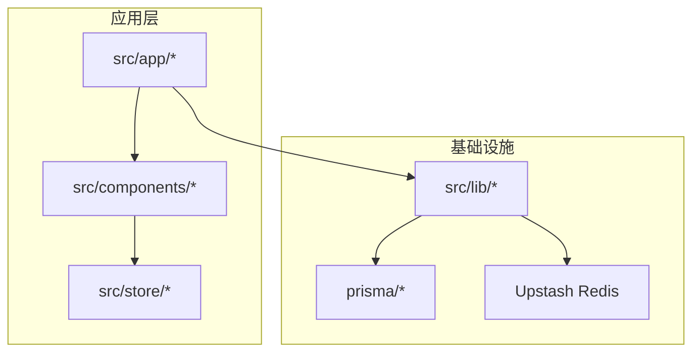
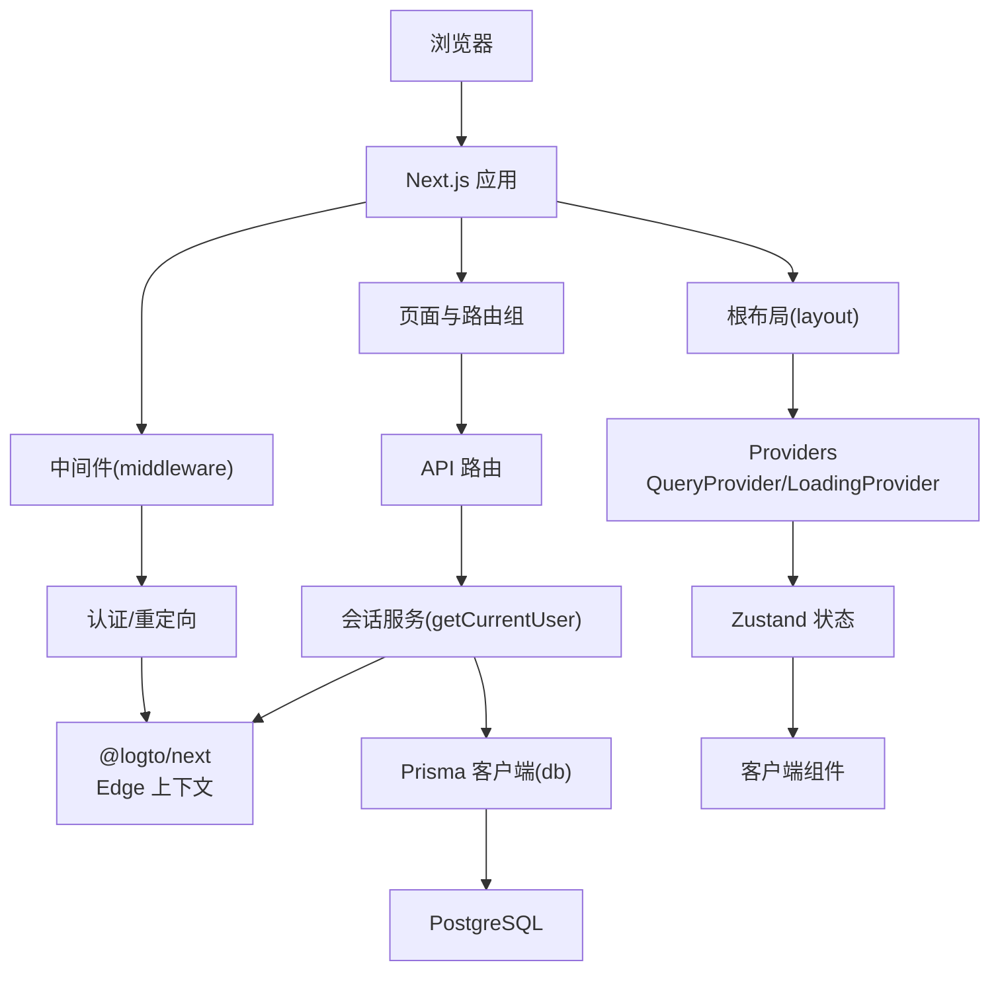
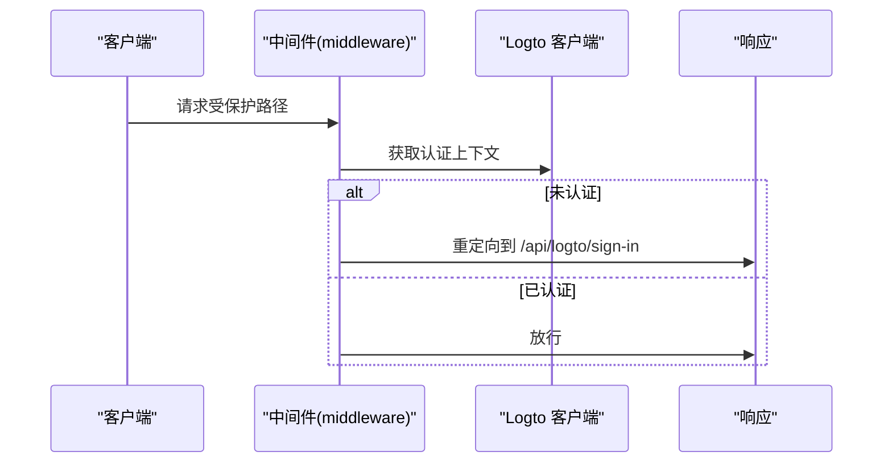
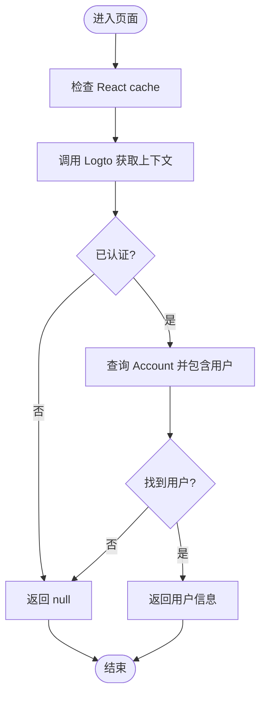
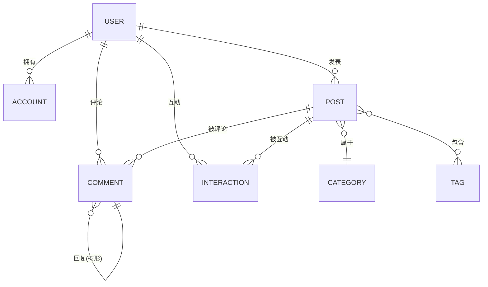
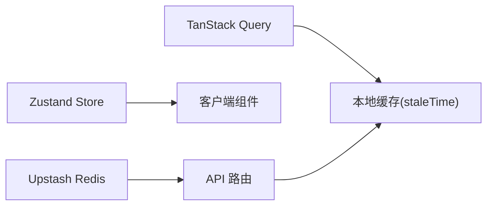
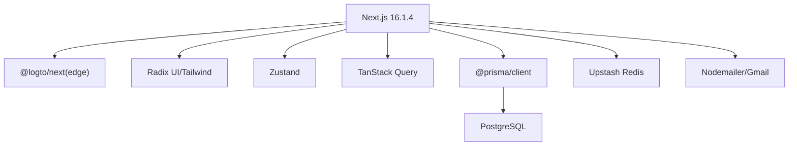

# 架构设计

<cite>
**本文引用的文件**
- [README.md](file://README.md)
- [package.json](file://package.json)
- [next.config.ts](file://next.config.ts)
- [src/middleware.ts](file://src/middleware.ts)
- [prisma/schema.prisma](file://prisma/schema.prisma)
- [src/lib/db.ts](file://src/lib/db.ts)
- [src/lib/upstash-redis.ts](file://src/lib/upstash-redis.ts)
- [src/store/user-store.ts](file://src/store/user-store.ts)
- [src/app/layout.tsx](file://src/app/layout.tsx)
- [src/lib/logto.ts](file://src/lib/logto.ts)
- [src/app/api/auth/me/route.ts](file://src/app/api/auth/me/route.ts)
- [src/app/dashboard/layout.tsx](file://src/app/dashboard/layout.tsx)
- [src/components/providers/query-provider.tsx](file://src/components/providers/query-provider.tsx)
- [src/lib/session.ts](file://src/lib/session.ts)
- [src/app/admin/login/page.tsx](file://src/app/admin/login/page.tsx)
</cite>

## 目录
1. [引言](#引言)
2. [项目结构](#项目结构)
3. [核心组件](#核心组件)
4. [架构总览](#架构总览)
5. [详细组件分析](#详细组件分析)
6. [依赖分析](#依赖分析)
7. [性能考量](#性能考量)
8. [故障排查指南](#故障排查指南)
9. [结论](#结论)
10. [附录](#附录)

## 引言
本项目是一梦五千年多功能工具平台与博客系统，基于 Next.js App Router 构建，采用分层架构设计：表现层（UI 层）、业务逻辑层（服务与控制器）、数据访问层（Prisma ORM）。系统通过 Server Components 与 Client Components 的混合渲染模式提升首屏性能与交互体验；中间件负责认证授权与路径重定向；数据库采用 PostgreSQL + Prisma ORM，配合索引与查询优化；缓存策略结合 Upstash Redis；状态管理采用 Zustand；数据获取使用 TanStack Query；认证采用 Logto Edge SDK。

## 项目结构
项目采用按功能域组织的目录结构，核心模块如下：
- src/app：Next.js App Router 页面与路由组
- src/components：通用 UI 组件与 Provider
- src/lib：基础设施与工具库（数据库、会话、邮件、Redis、Logto）
- src/store：客户端状态管理（Zustand）
- prisma：数据库模型与迁移
- scripts：辅助脚本
- public：静态资源

章节来源
- [README.md:54-69](file://README.md#L54-L69)

## 核心组件
- 表现层
  - 根布局与 Providers：根布局注入 QueryClient、加载状态 Provider、Toaster、Analytics Tracker，并启用 Suspense。
  - 状态管理：Zustand 用户状态存储，提供获取当前用户、登出、更新用户信息等方法。
- 业务逻辑层
  - 中间件：统一处理受保护路径跳转、认证上下文校验与重定向。
  - 会话服务：React cache 包装的 getCurrentUser，结合 Logto 与数据库完成用户上下文解析。
  - 管理端布局：在服务端校验用户角色，非管理员重定向至首页。
- 数据访问层
  - Prisma 客户端：全局单例初始化，开发环境下开启查询日志。
  - Redis：Upstash Redis 封装，按需懒加载实例。
  - 数据模型：用户、账户、文章、评论、互动、友链、AI 工具、常规工具、站点访问、验证码、邮件日志等，含枚举与复合索引。

章节来源
- [src/app/layout.tsx:26-51](file://src/app/layout.tsx#L26-L51)
- [src/store/user-store.ts:21-48](file://src/store/user-store.ts#L21-L48)
- [src/middleware.ts:8-28](file://src/middleware.ts#L8-L28)
- [src/lib/session.ts:17-41](file://src/lib/session.ts#L17-L41)
- [src/app/dashboard/layout.tsx:5-25](file://src/app/dashboard/layout.tsx#L5-L25)
- [src/lib/db.ts:5-14](file://src/lib/db.ts#L5-L14)
- [src/lib/upstash-redis.ts:5-14](file://src/lib/upstash-redis.ts#L5-L14)
- [prisma/schema.prisma:15-308](file://prisma/schema.prisma#L15-L308)

## 架构总览
系统采用分层架构与混合渲染模式：
- 表现层：Next.js App Router 页面与组件，RootLayout 注入全局 Provider。
- 业务层：中间件、会话服务、API 路由。
- 数据层：Prisma ORM + PostgreSQL，Upstash Redis 缓存。
- 认证：Logto Edge SDK，Edge 环境校验与 Cookie 策略。

图表来源
- [src/middleware.ts:8-28](file://src/middleware.ts#L8-L28)
- [src/app/layout.tsx:38-47](file://src/app/layout.tsx#L38-L47)
- [src/lib/session.ts:17-41](file://src/lib/session.ts#L17-L41)
- [src/lib/db.ts:5-14](file://src/lib/db.ts#L5-L14)
- [src/store/user-store.ts:26-41](file://src/store/user-store.ts#L26-L41)

## 详细组件分析

### 中间件与认证授权
- 功能职责
  - 对 /dashboard 与 /admin 受保护路径进行拦截。
  - 通过 Logto Edge 客户端获取认证上下文，若未认证则重定向到登录回调。
  - 对 /dashboard 根路径重定向到 /dashboard/overview。
- 实现要点
  - 使用 Edge 环境的 Logto 客户端，减少 Node 端复杂度。
  - 通过配置匹配器精确控制拦截范围。
- 与会话服务协作
  - 页面与布局中仍可调用服务端 getCurrentUser 获取用户信息，确保一致性。

图表来源
- [src/middleware.ts:8-28](file://src/middleware.ts#L8-L28)

章节来源
- [src/middleware.ts:8-28](file://src/middleware.ts#L8-L28)
- [src/lib/logto.ts:3-12](file://src/lib/logto.ts#L3-L12)
- [src/app/admin/login/page.tsx:3-5](file://src/app/admin/login/page.tsx#L3-L5)

### 会话服务与用户状态
- 服务端获取当前用户
  - 使用 React cache 去重同一请求内的多次调用。
  - 通过 Logto 获取认证主体标识，查询 Account 关联用户信息。
- 客户端状态管理
  - Zustand 存储用户信息、认证状态与加载状态。
  - 提供获取用户信息、登出、更新用户信息的方法。
  - 登出直接跳转到 /api/logto/sign-out。

图表来源
- [src/lib/session.ts:17-41](file://src/lib/session.ts#L17-L41)

章节来源
- [src/lib/session.ts:17-41](file://src/lib/session.ts#L17-L41)
- [src/store/user-store.ts:26-48](file://src/store/user-store.ts#L26-L48)
- [src/app/api/auth/me/route.ts:4-12](file://src/app/api/auth/me/route.ts#L4-L12)

### 数据库架构与查询优化
- 设计概览
  - 用户、账户、文章、分类、标签、评论、互动、友链、AI 工具、常规工具、站点访问、验证码、邮件日志等模型。
  - 使用枚举类型管理状态与类型字段。
- 索引策略
  - 在用户、文章、评论、互动、站点访问、验证码、邮件日志等关键字段建立复合或单列索引，以优化查询性能。
- 查询优化
  - 使用 Prisma previewFeatures 中的 relationJoins，减少 N+1 查询风险。
  - 通过 include 关联查询时注意字段选择，避免不必要的数据传输。
- 时间与时区
  - 字段使用 Timestamptz，迁移脚本修正时区问题，保证跨时区一致性。

图表来源
- [prisma/schema.prisma:15-167](file://prisma/schema.prisma#L15-L167)

章节来源
- [prisma/schema.prisma:15-308](file://prisma/schema.prisma#L15-L308)
- [src/lib/db.ts:5-14](file://src/lib/db.ts#L5-L14)

### 缓存策略与状态管理
- 缓存
  - Upstash Redis 封装，按需懒加载，提供空值兜底。
- 状态管理
  - Zustand 管理用户会话状态，支持客户端即时更新与持久化需求。
- 数据获取
  - TanStack Query 提供服务端/客户端数据缓存、失效与重取策略，默认 60 秒过期。

图表来源
- [src/components/providers/query-provider.tsx:7-16](file://src/components/providers/query-provider.tsx#L7-L16)
- [src/store/user-store.ts:21-48](file://src/store/user-store.ts#L21-L48)
- [src/lib/upstash-redis.ts:5-14](file://src/lib/upstash-redis.ts#L5-L14)

章节来源
- [src/components/providers/query-provider.tsx:7-16](file://src/components/providers/query-provider.tsx#L7-L16)
- [src/store/user-store.ts:21-48](file://src/store/user-store.ts#L21-L48)
- [src/lib/upstash-redis.ts:5-14](file://src/lib/upstash-redis.ts#L5-L14)

### API 设计原则
- REST 风格与语义化路径
  - /api/auth/me 返回当前用户信息。
  - /api/logto/* 提供登录、回调、登出等认证相关接口。
  - /api/open/* 对外开放的只读接口（如文章、分类）。
- 响应规范
  - 成功返回统一结构 { code, data }，错误返回 { code, message }。
- 安全与鉴权
  - 受保护路由由中间件与服务端布局共同保障，服务端获取用户信息后再渲染或返回数据。

章节来源
- [src/app/api/auth/me/route.ts:4-12](file://src/app/api/auth/me/route.ts#L4-L12)
- [src/middleware.ts:15-25](file://src/middleware.ts#L15-L25)
- [src/app/dashboard/layout.tsx:10-18](file://src/app/dashboard/layout.tsx#L10-L18)

## 依赖分析
- 框架与运行时
  - Next.js 16.1.4（App Router），Edge 环境支持认证。
- UI 与状态
  - Radix UI + Tailwind CSS 4，Zustand，TanStack Query。
- 数据与缓存
  - Prisma 6.16.0，PostgreSQL，Upstash Redis。
- 认证
  - @logto/next Edge SDK，Cookie 安全策略随环境切换。
- 邮件与云服务
  - Nodemailer + Gmail SMTP，AWS S3/Presigner，七牛云、腾讯云翻译等（按需引入）。

图表来源
- [package.json:11-79](file://package.json#L11-L79)
- [src/lib/logto.ts:3-12](file://src/lib/logto.ts#L3-L12)
- [src/lib/db.ts:5-14](file://src/lib/db.ts#L5-L14)
- [src/lib/upstash-redis.ts:5-14](file://src/lib/upstash-redis.ts#L5-L14)

章节来源
- [package.json:11-79](file://package.json#L11-L79)
- [next.config.ts:5-12](file://next.config.ts#L5-L12)

## 性能考量
- 渲染与数据流
  - Server Components 优先，减少客户端水合成本；客户端组件仅在必要时使用。
  - React cache 在服务端去重重复的认证与查询调用，降低延迟。
- 数据获取
  - TanStack Query 默认 staleTime 60 秒，平衡新鲜度与网络开销。
  - Prisma relationJoins 减少关联查询往返次数。
- 缓存
  - Upstash Redis 用于热点数据与会话缓存，按需启用。
- 构建与类型检查
  - 生产构建忽略 ESLint 与 TypeScript 错误，加速部署（可按需调整）。

## 故障排查指南
- 认证相关
  - 中间件未放行：检查受保护路径匹配器与 Logto 回调是否正确。
  - 未登录跳转循环：确认 /api/logto/sign-in 是否可达，Cookie 设置是否符合环境要求。
- 会话与用户信息
  - getCurrentUser 返回 null：确认 Logto 上下文是否有效，Account 与 User 关联是否存在。
  - 客户端状态不一致：检查 Zustand store 初始化与 /api/auth/me 接口返回。
- 数据库与查询
  - 查询缓慢：检查索引覆盖与查询计划；避免 N+1，合理使用 include 与 relationJoins。
  - 时区异常：确认字段使用 Timestamptz，迁移脚本已修正时区。
- 缓存
  - Redis 不可用：确认环境变量配置，封装函数返回 null 时的降级逻辑。

章节来源
- [src/middleware.ts:30-35](file://src/middleware.ts#L30-L35)
- [src/lib/logto.ts:3-12](file://src/lib/logto.ts#L3-L12)
- [src/lib/session.ts:17-41](file://src/lib/session.ts#L17-L41)
- [src/store/user-store.ts:26-48](file://src/store/user-store.ts#L26-L48)
- [prisma/schema.prisma:59-259](file://prisma/schema.prisma#L59-L259)
- [src/lib/upstash-redis.ts:5-14](file://src/lib/upstash-redis.ts#L5-L14)

## 结论
该架构以 Next.js App Router 为核心，结合 Server Components 与 Client Components 的混合渲染，实现了高性能与良好用户体验。中间件统一处理认证与路径治理，服务端会话服务确保安全与一致性。Prisma ORM 提供强类型的数据库抽象与索引优化，Upstash Redis 作为补充缓存。Zustand 与 TanStack Query 分别承担客户端状态与数据缓存，整体设计兼顾可维护性与扩展性。

## 附录
- 环境变量与配置
  - 数据库连接、Logto 配置、Upstash Redis、Gmail 等均通过环境变量注入。
- 开发与部署
  - 开发端口与构建脚本在 package.json 中定义；next.config.ts 放宽类型与 ESLint 校验以提升效率。

章节来源
- [README.md:71-89](file://README.md#L71-L89)
- [package.json:5-10](file://package.json#L5-L10)
- [next.config.ts:5-12](file://next.config.ts#L5-L12)