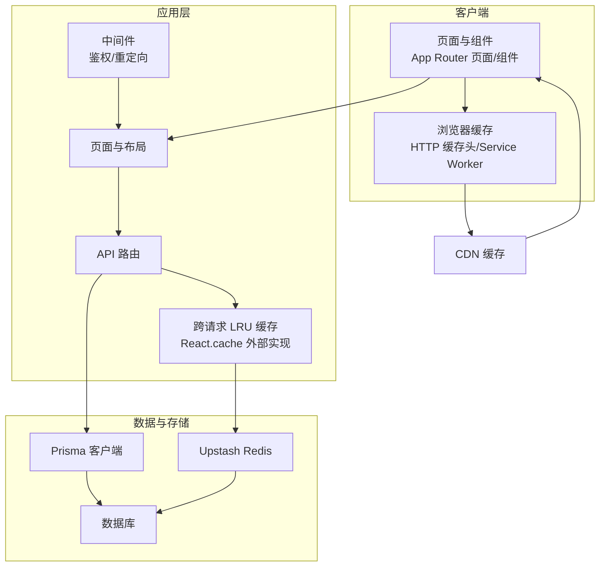
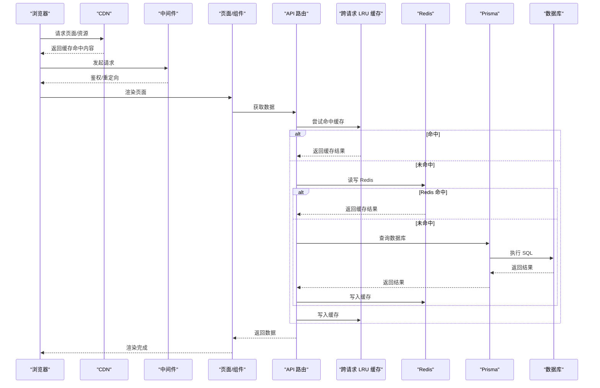
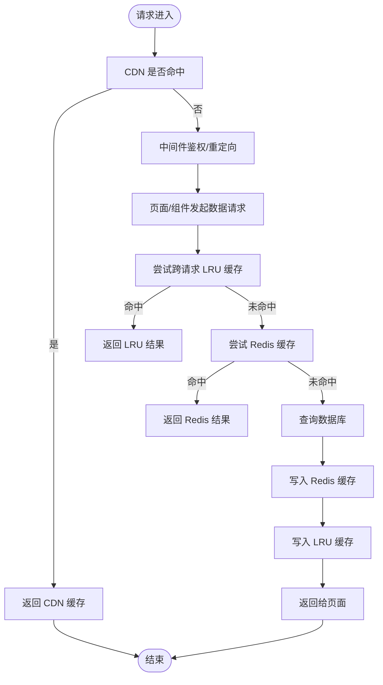
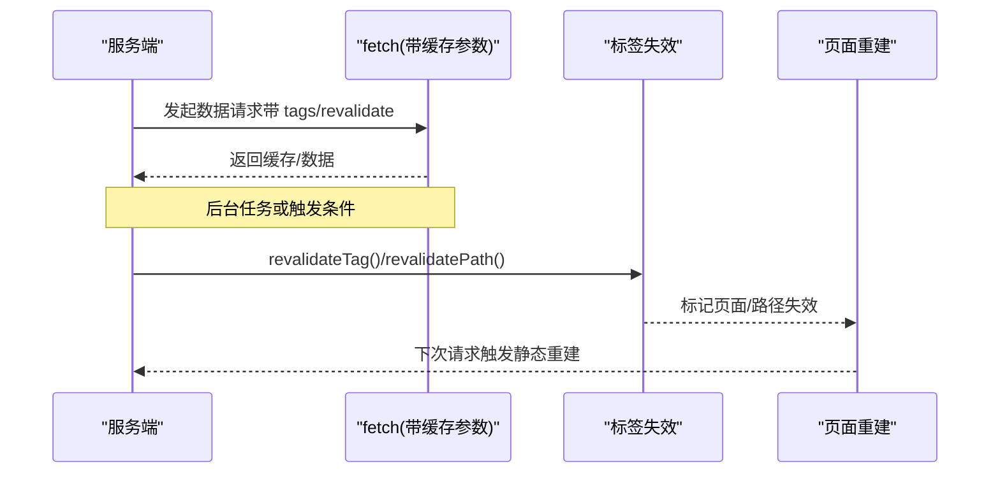
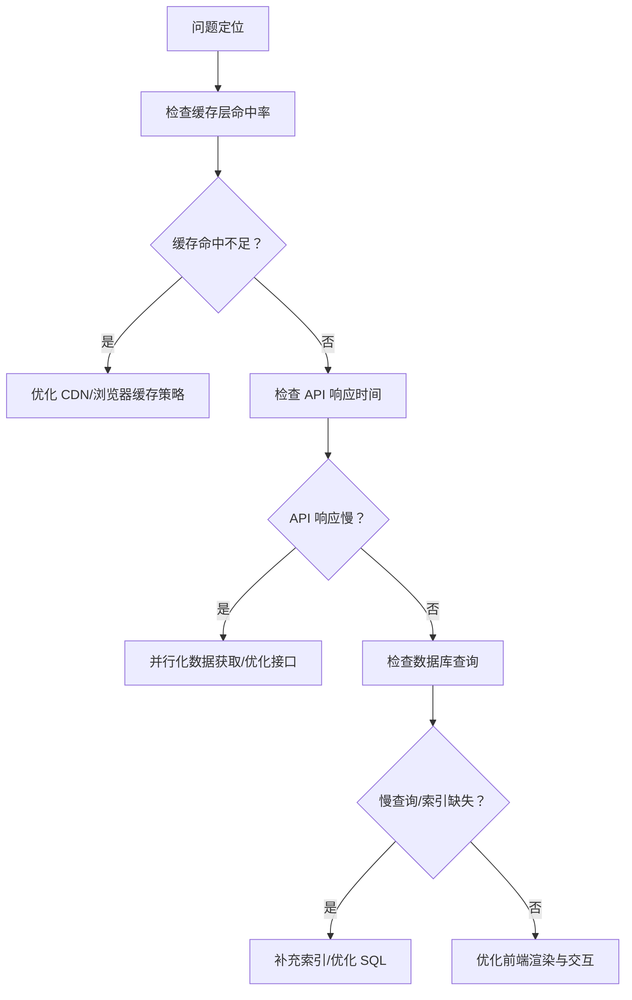
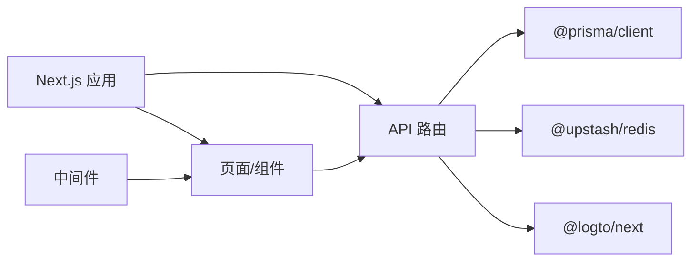

# 缓存与性能优化

<cite>
**本文引用的文件**
- [next.config.ts](file://next.config.ts)
- [upstash-redis.ts](file://src/lib/upstash-redis.ts)
- [db.ts](file://src/lib/db.ts)
- [middleware.ts](file://src/middleware.ts)
- [package.json](file://package.json)
- [ai-tools-wrapper.tsx](file://src/app/(site)/ai-platform/components/ai-tools-wrapper.tsx)
- [analytics-tracker.tsx](file://src/components/analytics-tracker.tsx)
- [SKILL.md（Next.js App Router 模式）](file://.agents/skills/nextjs-app-router-patterns/SKILL.md)
- [AGENTS.md（Vercel React 最佳实践）](file://.agents/skills/vercel-react-best-practices/AGENTS.md)
- [route.ts（Open API 文章接口）](file://src/app/api/open/posts/route.ts)
- [route.ts（Analytics Track）](file://src/app/api/analytics/track/route.ts)
</cite>

## 目录
1. [引言](#引言)
2. [项目结构](#项目结构)
3. [核心组件](#核心组件)
4. [架构总览](#架构总览)
5. [详细组件分析](#详细组件分析)
6. [依赖关系分析](#依赖关系分析)
7. [性能考量](#性能考量)
8. [故障排查指南](#故障排查指南)
9. [结论](#结论)
10. [附录](#附录)

## 引言
本文件面向“一梦五千年”项目，系统化梳理并提出缓存与性能优化方案，覆盖多层级缓存（Redis、浏览器、CDN）、Next.js 内置缓存与增量静态再生（ISR）、数据库查询优化、性能监控与基准测试、资源压缩与图片优化、代码分割策略，以及瓶颈分析与优化实践路径。

## 项目结构
项目采用 Next.js App Router 架构，前端页面与 API 路由分层清晰；后端通过 Prisma 访问数据库；部分功能使用 Upstash Redis 提供缓存能力；中间件负责鉴权与重定向；另有大量性能优化最佳实践规则沉淀于技能库中。

图示来源
- [next.config.ts:1-16](file://next.config.ts#L1-L16)
- [upstash-redis.ts:1-15](file://src/lib/upstash-redis.ts#L1-L15)
- [db.ts:1-16](file://src/lib/db.ts#L1-L16)
- [middleware.ts:1-36](file://src/middleware.ts#L1-L36)
- [package.json:1-98](file://package.json#L1-L98)

章节来源
- [next.config.ts:1-16](file://next.config.ts#L1-L16)
- [package.json:1-98](file://package.json#L1-L98)

## 核心组件
- 数据库访问层：通过 Prisma 客户端统一访问数据库，开发模式下开启查询日志以便诊断。
- Redis 缓存：封装 Upstash Redis 客户端，按需初始化连接，用于跨请求或跨进程缓存。
- 中间件：统一处理受保护路由的鉴权与跳转，减少无效渲染与请求。
- 页面与 API：利用 Next.js App Router 的数据获取与缓存策略，结合标签失效与增量静态再生（ISR）提升性能。
- 性能规则库：沉淀了跨请求 LRU 缓存、并行数据获取、动态导入、SVG 精简等大量优化建议。

章节来源
- [db.ts:1-16](file://src/lib/db.ts#L1-L16)
- [upstash-redis.ts:1-15](file://src/lib/upstash-redis.ts#L1-L15)
- [middleware.ts:1-36](file://src/middleware.ts#L1-L36)
- [SKILL.md（Next.js App Router 模式）:493-519](file://.agents/skills/nextjs-app-router-patterns/SKILL.md#L493-L519)
- [AGENTS.md（Vercel React 最佳实践）:33-42](file://.agents/skills/vercel-react-best-practices/AGENTS.md#L33-L42)

## 架构总览
下图展示从浏览器到数据库的完整链路，以及各层级缓存与优化点：

图示来源
- [middleware.ts:8-28](file://src/middleware.ts#L8-L28)
- [ai-tools-wrapper.tsx:1-13](file://src/app/(site)/ai-platform/components/ai-tools-wrapper.tsx#L1-L13)
- [upstash-redis.ts:5-14](file://src/lib/upstash-redis.ts#L5-L14)
- [db.ts:5-14](file://src/lib/db.ts#L5-L14)

## 详细组件分析

### 多层级缓存策略
- Redis 缓存（Upstash）
  - 初始化与可用性检测：通过环境变量判断是否启用，避免在无配置时产生异常。
  - 使用场景：跨请求/跨进程缓存、热点数据短时驻留、降低数据库压力。
- 浏览器缓存
  - 利用 HTTP 缓存头与 Service Worker 实现静态资源与页面缓存，减少网络往返。
  - 与 CDN 协同：CDN 层面可对静态资源进行长期缓存与压缩。
- CDN 缓存
  - 静态资源与页面缓存：针对不频繁变更的内容设置较长 TTL。
  - 动态内容：通过标签失效与边缘重验证控制缓存更新节奏。

图示来源
- [upstash-redis.ts:5-14](file://src/lib/upstash-redis.ts#L5-L14)
- [db.ts:5-14](file://src/lib/db.ts#L5-L14)
- [SKILL.md（Next.js App Router 模式）:493-519](file://.agents/skills/nextjs-app-router-patterns/SKILL.md#L493-L519)

章节来源
- [upstash-redis.ts:1-15](file://src/lib/upstash-redis.ts#L1-L15)
- [SKILL.md（Next.js App Router 模式）:493-519](file://.agents/skills/nextjs-app-router-patterns/SKILL.md#L493-L519)

### Next.js 内置缓存与 ISR
- 标签失效与路径失效：通过标签驱动的失效机制，精准控制缓存刷新范围。
- 增量静态再生（ISR）：对非实时数据设置合理的 revalidate 时间，平衡新鲜度与性能。
- Server Components 与 Suspense：在服务端聚合数据，配合流式加载与并行获取，缩短首屏时间。

图示来源
- [SKILL.md（Next.js App Router 模式）:493-519](file://.agents/skills/nextjs-app-router-patterns/SKILL.md#L493-L519)

章节来源
- [SKILL.md（Next.js App Router 模式）:493-519](file://.agents/skills/nextjs-app-router-patterns/SKILL.md#L493-L519)

### 数据库查询优化与慢查询监控
- 日志级别：开发环境开启查询日志，便于定位慢查询与异常 SQL。
- 索引设计：围绕高频过滤字段（如文章分类、状态、创建时间）建立复合索引；对模糊搜索与排序字段评估覆盖索引。
- 查询拆分：将大查询拆分为多个小查询，结合并行执行与分页，降低单次查询耗时。
- 慢查询监控：结合数据库自带的慢查询日志与 APM 工具，定期巡检并优化。

章节来源
- [db.ts:8](file://src/lib/db.ts#L8)

### 性能监控指标、APM 集成与基准测试
- 指标体系：首屏渲染时间（FCP/LCP/INP）、TTI、页面生命周期事件、API 响应时间、缓存命中率、数据库 QPS/延迟。
- APM 集成：在 API 路由与关键业务流程埋点，采集链路追踪与错误日志；结合浏览器端 Analytics 统计用户行为。
- 基准测试：对热点接口与页面进行压力测试，记录不同并发下的响应时间与吞吐量，识别瓶颈。

章节来源
- [analytics-tracker.tsx:48-78](file://src/components/analytics-tracker.tsx#L48-L78)
- [route.ts（Analytics Track）:1-200](file://src/app/api/analytics/track/route.ts#L1-L200)

### 资源压缩、图片优化与代码分割
- 资源压缩：启用 Gzip/Brotli 压缩，对 JS/CSS/HTML 进行最小化与去注释。
- 图片优化：使用现代格式（WebP/AVIF），按设备像素比与视口尺寸生成多规格图片；对静态图标进行 SVG 化与精度优化。
- 代码分割：按路由与组件维度进行动态导入，优先加载首屏必需模块；对第三方库进行条件加载与预加载策略。

章节来源
- [AGENTS.md（Vercel React 最佳实践）:29-35](file://.agents/skills/vercel-react-best-practices/AGENTS.md#L29-L35)
- [AGENTS.md（Vercel React 最佳实践）:61-69](file://.agents/skills/vercel-react-best-practices/AGENTS.md#L61-L69)
- [AGENTS.md（Vercel React 最佳实践）:1932-1955](file://.agents/skills/vercel-react-best-practices/AGENTS.md#L1932-L1955)

### 性能瓶颈分析方法与优化实践
- 分层定位：先看 CDN/浏览器缓存命中率，再看 API 响应时间，最后看数据库查询与索引。
- 并发与水瀑布：避免串行依赖，使用并行获取与 Suspense 边界提升整体吞吐。
- 缓存策略：热点数据走 Redis，冷数据走数据库；对实时性要求低的数据采用 ISR。
- 交互体验：对滚动与频繁状态更新使用过渡与 useRef，避免不必要的重渲染。

图示来源
- [AGENTS.md（Vercel React 最佳实践）:23-29](file://.agents/skills/vercel-react-best-practices/AGENTS.md#L23-L29)
- [AGENTS.md（Vercel React 最佳实践）:35-42](file://.agents/skills/vercel-react-best-practices/AGENTS.md#L35-L42)

章节来源
- [AGENTS.md（Vercel React 最佳实践）:23-29](file://.agents/skills/vercel-react-best-practices/AGENTS.md#L23-L29)
- [AGENTS.md（Vercel React 最佳实践）:35-42](file://.agents/skills/vercel-react-best-practices/AGENTS.md#L35-L42)

## 依赖关系分析
- 依赖注入与运行时配置：Next.js、Prisma、@upstash/redis、@logto/next 等。
- 关键耦合点：API 路由依赖 Prisma 与 Redis；页面组件依赖 API 路由与缓存策略；中间件影响所有受保护路由的访问路径。

图示来源
- [package.json:11-80](file://package.json#L11-L80)
- [middleware.ts:1-36](file://src/middleware.ts#L1-L36)

章节来源
- [package.json:11-80](file://package.json#L11-L80)
- [middleware.ts:1-36](file://src/middleware.ts#L1-L36)

## 性能考量
- 开发与生产差异：开发模式开启查询日志，生产关闭以降低开销。
- 构建与类型检查：允许构建阶段忽略 ESLint/TypeScript 错误，加速 CI/CD。
- 资源体积：通过动态导入与条件加载控制包体大小，避免一次性加载重型依赖。

章节来源
- [next.config.ts:5-12](file://next.config.ts#L5-L12)
- [db.ts:8](file://src/lib/db.ts#L8)

## 故障排查指南
- Redis 不可用：检查环境变量配置，确认初始化逻辑仅在具备凭据时创建实例。
- 中间件鉴权失败：核对受保护路由匹配器与登录回调地址，确保会话有效。
- API 水瀑布：检查是否存在串行等待，改为并行 Promise 或 Suspense 边界。
- 缓存未生效：确认 fetch 请求是否携带正确的缓存参数与标签，必要时手动触发 revalidate。

章节来源
- [upstash-redis.ts:5-14](file://src/lib/upstash-redis.ts#L5-L14)
- [middleware.ts:30-36](file://src/middleware.ts#L30-L36)
- [SKILL.md（Next.js App Router 模式）:493-519](file://.agents/skills/nextjs-app-router-patterns/SKILL.md#L493-L519)

## 结论
通过多层级缓存（CDN/浏览器/Redis）、Next.js 内置缓存与 ISR、数据库查询优化与慢查询监控、APM 集成与基准测试、资源压缩与代码分割策略，以及系统化的瓶颈分析方法，“一梦五千年”项目可在保证用户体验的同时显著提升性能与稳定性。建议优先落地高收益项（并行化、缓存标签失效、图片优化），持续迭代监控指标与优化策略。

## 附录
- 参考实现位置
  - 跨请求 LRU 缓存与 React.cache 使用示例：[ai-tools-wrapper.tsx:1-13](file://src/app/(site)/ai-platform/components/ai-tools-wrapper.tsx#L1-L13)
  - Next.js 缓存与 ISR 标签失效：[SKILL.md（Next.js App Router 模式）:493-519](file://.agents/skills/nextjs-app-router-patterns/SKILL.md#L493-L519)
  - API 路由并行化与水瀑布规避：[AGENTS.md（Vercel React 最佳实践）:23-29](file://.agents/skills/vercel-react-best-practices/AGENTS.md#L23-L29)
  - 数据库查询日志与连接配置：[db.ts:5-14](file://src/lib/db.ts#L5-L14)
  - Open API 文章接口（分页/过滤/认证）：[route.ts（Open API 文章接口）:1-35](file://src/app/api/open/posts/route.ts#L1-L35)