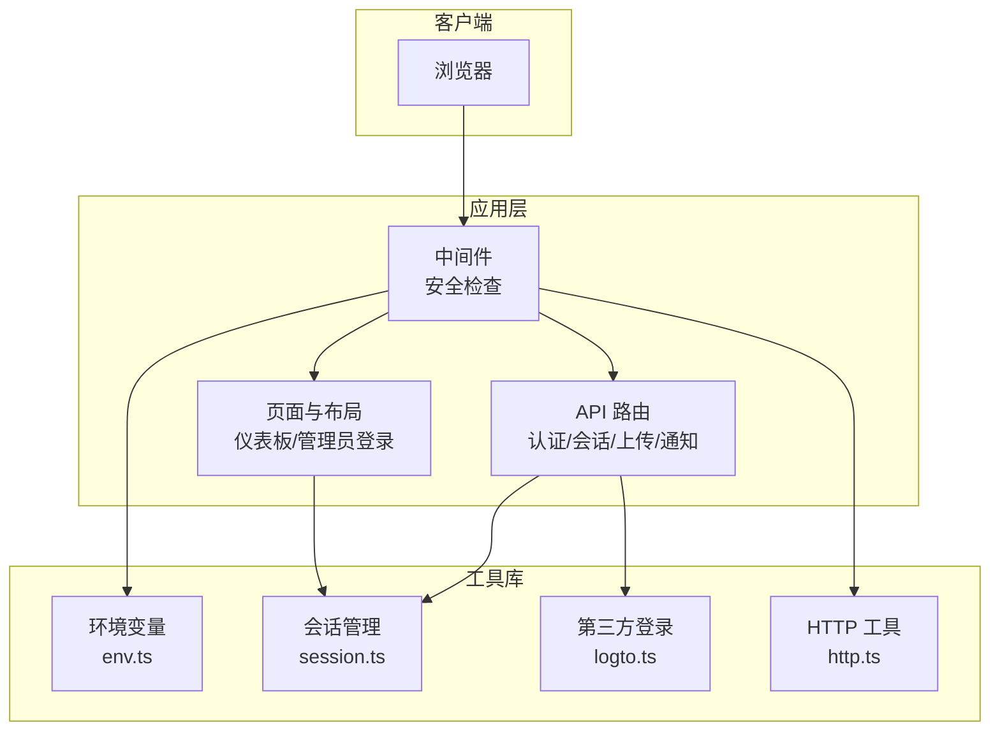
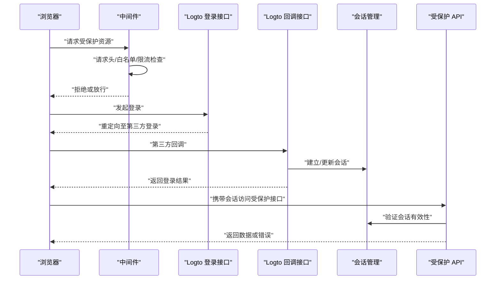
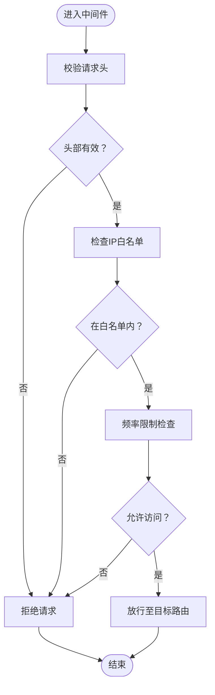
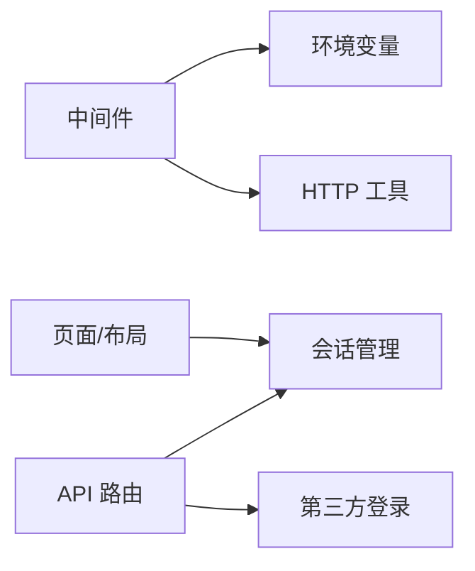

# 安全防护措施

<cite>
**本文档引用的文件**
- [next.config.ts](file://next.config.ts)
- [middleware.ts](file://src/middleware.ts)
- [env.ts](file://src/lib/env.ts)
- [session.ts](file://src/lib/session.ts)
- [logto.ts](file://src/lib/logto.ts)
- [route.ts（登录）](file://src/app/api/auth/me/route.ts)
- [route.ts（登录接口）](file://src/app/api/logto/sign-in/route.ts)
- [route.ts（登出回调）](file://src/app/api/logto/callback/route.ts)
- [route.ts（登出接口）](file://src/app/api/logto/sign-out/route.ts)
- [route.ts（发送验证码）](file://src/app/api/send/verification-code/route.ts)
- [route.ts（发送通知）](file://src/app/api/send/notification/route.ts)
- [route.ts（上传R2令牌）](file://src/app/api/upload/r2/token/route.ts)
- [route.ts（上传R2文件）](file://src/app/api/upload/r2/upload/route.ts)
- [route.ts（上传URL）](file://src/app/api/upload/r2/url/route.ts)
- [route.ts（用户管理）](file://src/app/api/users/[id]/route.ts)
- [route.ts（管理员登录）](file://src/app/admin/login/page.tsx)
- [page.tsx（仪表板）](file://src/app/dashboard/layout.tsx)
- [server-auth-actions.md](file://.agents/skills/vercel-react-best-practices/rules/server-auth-actions.md)
</cite>

## 目录
1. [简介](#简介)
2. [项目结构](#项目结构)
3. [核心组件](#核心组件)
4. [架构总览](#架构总览)
5. [详细组件分析](#详细组件分析)
6. [依赖关系分析](#依赖关系分析)
7. [性能考虑](#性能考虑)
8. [故障排查指南](#故障排查指南)
9. [结论](#结论)
10. [附录](#附录)

## 简介
本文件聚焦于本项目的安全防护体系，围绕认证与授权、会话安全、CSRF 防护、XSS 防护、密码安全策略、令牌管理、中间件安全检查、安全配置以及常见安全威胁的防护方法进行系统化梳理。由于仓库中未直接提供密码哈希、盐值生成、JWT 刷新机制、CORS 配置等实现细节，本文在相应章节提供可落地的实践建议与参考路径，便于后续扩展。

## 项目结构
项目采用 Next.js App Router 架构，安全相关的关键位置包括：
- 中间件：统一的安全检查入口，负责请求头校验、IP 白名单、频率限制等
- 路由层：认证与会话管理、第三方登录集成、敏感操作接口
- 工具库：环境变量、会话管理、第三方认证 SDK、HTTP 辅助工具
- 页面与布局：仪表板、管理员登录等受保护区域

**图表来源**
- [middleware.ts](file://src/middleware.ts)
- [env.ts](file://src/lib/env.ts)
- [session.ts](file://src/lib/session.ts)
- [logto.ts](file://src/lib/logto.ts)
- [route.ts（登录接口）](file://src/app/api/logto/sign-in/route.ts)
- [route.ts（用户管理）](file://src/app/api/users/[id]/route.ts)

**章节来源**
- [next.config.ts](file://next.config.ts)
- [middleware.ts](file://src/middleware.ts)
- [env.ts](file://src/lib/env.ts)
- [session.ts](file://src/lib/session.ts)
- [logto.ts](file://src/lib/logto.ts)

## 核心组件
- 中间件：集中执行安全检查（请求头、IP 白名单、频率限制），并为后续路由处理提供上下文
- 会话管理：封装会话读写、失效与清理逻辑，确保会话状态安全
- 第三方登录：通过 Logto 提供统一的身份认证与会话维护
- API 路由：对敏感操作进行鉴权与授权，结合输入校验与最小权限原则
- 环境变量：集中管理安全相关配置（如密钥、域名、端口等）

**章节来源**
- [middleware.ts](file://src/middleware.ts)
- [session.ts](file://src/lib/session.ts)
- [logto.ts](file://src/lib/logto.ts)
- [env.ts](file://src/lib/env.ts)

## 架构总览
下图展示了从浏览器到后端 API 的典型认证与安全流程，涵盖会话建立、中间件拦截、第三方登录回调、受保护资源访问等环节。

**图表来源**
- [middleware.ts](file://src/middleware.ts)
- [route.ts（登录接口）](file://src/app/api/logto/sign-in/route.ts)
- [route.ts（登出回调）](file://src/app/api/logto/callback/route.ts)
- [session.ts](file://src/lib/session.ts)
- [route.ts（用户管理）](file://src/app/api/users/[id]/route.ts)

## 详细组件分析

### 认证与会话安全
- 会话建立与维护：通过第三方登录回调接口完成会话初始化，并在后续请求中使用会话管理模块进行校验
- 会话失效与清理：在登出流程中清除会话状态，避免会话泄露
- 请求头与来源校验：中间件对关键请求头进行校验，确保来源可信
- IP 白名单与频率限制：中间件支持基于 IP 的访问控制与请求频率限制，降低暴力破解与滥用风险

**图表来源**
- [middleware.ts](file://src/middleware.ts)

**章节来源**
- [middleware.ts](file://src/middleware.ts)
- [route.ts（登出回调）](file://src/app/api/logto/callback/route.ts)
- [session.ts](file://src/lib/session.ts)

### CSRF 防护
- 建议在表单与无状态 API 中引入一次性 CSRF Token，并在服务端严格校验
- 对于 Next.js App Router 场景，可结合同源策略与安全 Cookie 属性减少 CSRF 风险
- 参考最佳实践：[server-auth-actions.md](file://.agents/skills/vercel-react-best-practices/rules/server-auth-actions.md)

**章节来源**
- [server-auth-actions.md](file://.agents/skills/vercel-react-best-practices/rules/server-auth-actions.md)

### XSS 防护
- 输入输出均需进行严格的转义与内容安全策略（CSP）配置
- 对富文本与 Markdown 渲染场景，建议使用白名单过滤与安全渲染库
- 后端响应头中启用 CSP，限制脚本执行来源

**章节来源**
- [next.config.ts](file://next.config.ts)

### 密码安全策略
- 密码哈希算法：建议采用 Argon2 或 bcrypt，具备自适应成本参数，抵御 GPU 暴力破解
- 盐值生成：使用加密安全的随机数生成器，每个密码独立盐值
- 密码强度要求：长度至少 12 位，包含大小写字母、数字与特殊字符；禁止使用常见弱口令
- 存储与传输：仅存储哈希值，传输层强制 HTTPS；变更密码时要求当前密码校验

说明：当前仓库未发现密码哈希与强度校验的具体实现，建议在用户注册/修改密码接口中引入上述策略。

### 令牌安全管理
- JWT 验证：校验签名、发行者、受众、过期时间（exp）、签发时间（iat）等声明
- 过期时间控制：短期访问令牌（如 15 分钟），配合刷新令牌（如 7 天）
- 刷新机制：刷新令牌单独存储、绑定设备指纹与 IP，刷新时重新签发并吊销旧令牌
- 传输与存储：使用 HttpOnly、Secure、SameSite Cookie 存储刷新令牌；访问令牌尽量以短生命周期与更严格约束存储

说明：当前仓库未发现 JWT 实现，建议在登录与刷新接口中引入上述机制。

### 中间件安全检查
- 请求头验证：校验 Origin、Referer、User-Agent 等关键头部，拒绝可疑来源
- IP 白名单：仅允许来自可信网络段的请求
- 频率限制：对登录、验证码发送等敏感接口实施速率限制
- 会话校验：在中间件中统一校验会话有效性，拒绝无效或过期会话

**章节来源**
- [middleware.ts](file://src/middleware.ts)

### 安全配置示例
- HTTPS 强制：生产环境强制使用 HTTPS，禁用 HTTP
- 安全 Cookie 设置：HttpOnly、Secure、SameSite=Lax 或 Strict；跨域场景谨慎设置
- CORS 配置：仅允许受信域名，预检请求最小化，避免通配符
- 内容安全策略（CSP）：限制脚本来源、阻止内联脚本与不安全加载

**章节来源**
- [next.config.ts](file://next.config.ts)

### 常见安全威胁与防护
- 注入攻击（SQL/命令注入）：使用 ORM/查询构建器与参数化查询；严格输入校验与最小权限
- 会话劫持：短生命周期会话、绑定 IP/UA、定期轮换；登出时彻底清理
- 暴力破解：登录失败次数限制、验证码、二次验证；账户锁定策略
- 信息泄露：最小化错误信息输出、敏感字段脱敏、日志脱敏
- 供应链与依赖漏洞：定期审计依赖、启用自动安全更新

## 依赖关系分析
- 中间件依赖环境变量与 HTTP 工具，用于执行安全检查
- API 路由依赖会话管理与第三方登录 SDK，确保访问控制与身份验证
- 页面与布局依赖会话状态，实现受保护区域的渲染与导航

**图表来源**
- [middleware.ts](file://src/middleware.ts)
- [env.ts](file://src/lib/env.ts)
- [session.ts](file://src/lib/session.ts)
- [logto.ts](file://src/lib/logto.ts)

**章节来源**
- [middleware.ts](file://src/middleware.ts)
- [env.ts](file://src/lib/env.ts)
- [session.ts](file://src/lib/session.ts)
- [logto.ts](file://src/lib/logto.ts)

## 性能考虑
- 中间件检查应尽量轻量，避免阻塞主请求链路
- 会话校验与缓存结合，减少数据库/外部服务调用
- 敏感接口限流策略应区分用户角色与来源，避免误伤正常流量

## 故障排查指南
- 登录后无法访问受保护资源：检查会话是否正确建立与传递，确认中间件放行逻辑
- 验证码发送失败：核对发送接口的限流与白名单配置
- 上传接口异常：确认 R2 令牌与上传接口的鉴权与权限范围
- 第三方登录回调失败：检查回调地址、状态保持与会话写入逻辑

**章节来源**
- [route.ts（发送验证码）](file://src/app/api/send/verification-code/route.ts)
- [route.ts（上传R2令牌）](file://src/app/api/upload/r2/token/route.ts)
- [route.ts（上传R2文件）](file://src/app/api/upload/r2/upload/route.ts)
- [route.ts（上传URL）](file://src/app/api/upload/r2/url/route.ts)

## 结论
本项目已具备基础的中间件安全检查与第三方登录集成能力。建议在后续迭代中补充密码哈希策略、JWT 令牌管理、CSRF 与 XSS 防护、CORS 与 CSP 配置，以及针对敏感接口的输入校验与最小权限原则，从而形成完整的安全闭环。

## 附录
- 受保护资源示例：仪表板、管理员登录、用户管理、通知发送、文件上传等
- 关键实现参考路径：中间件、会话管理、第三方登录 SDK、API 路由与页面布局

**章节来源**
- [page.tsx（仪表板）](file://src/app/dashboard/layout.tsx)
- [route.ts（管理员登录）](file://src/app/admin/login/page.tsx)
- [route.ts（用户管理）](file://src/app/api/users/[id]/route.ts)