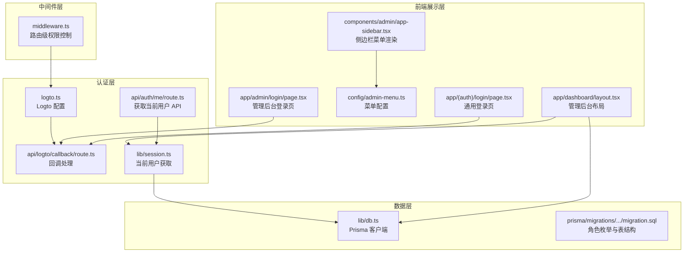
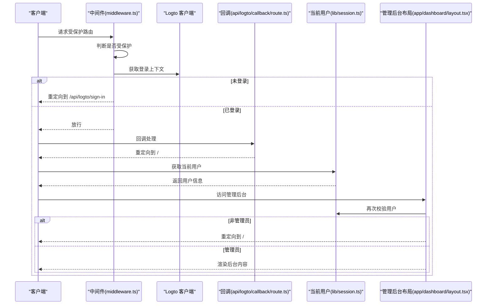
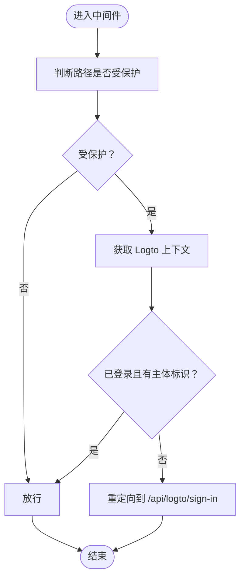
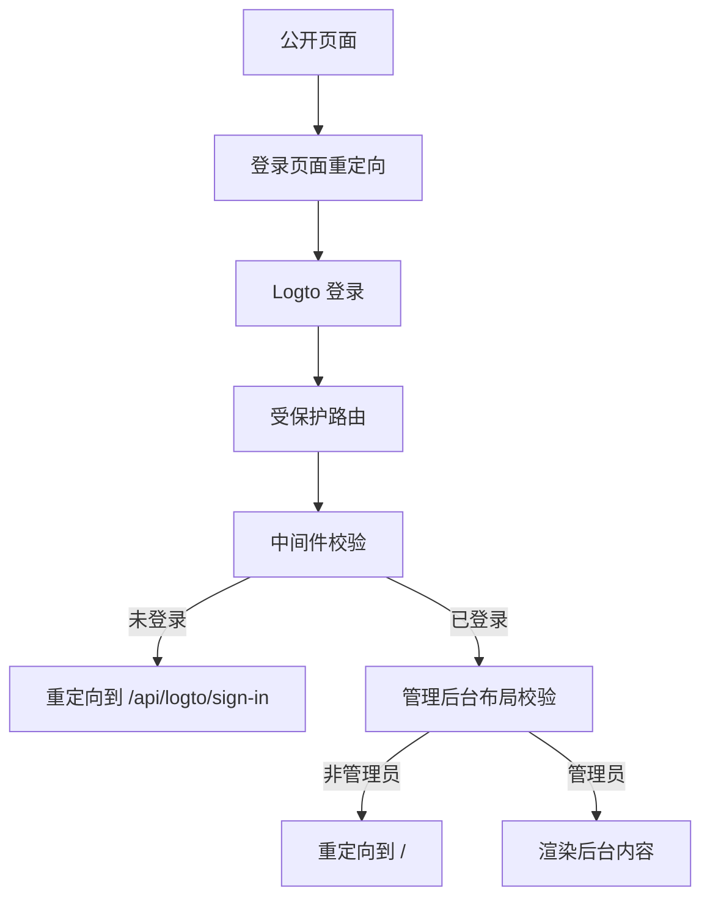
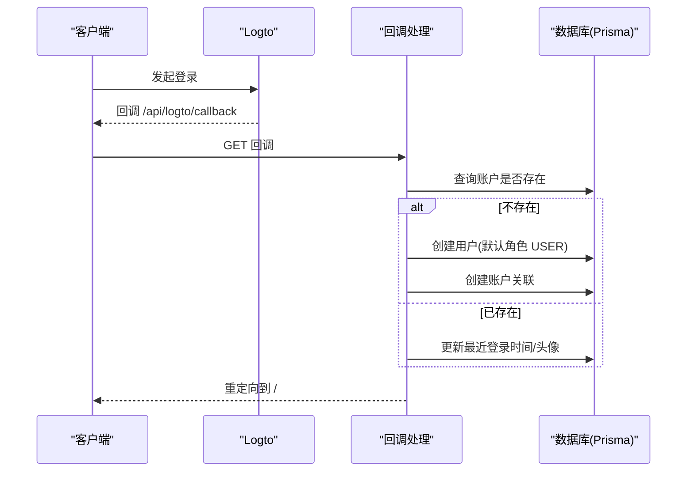
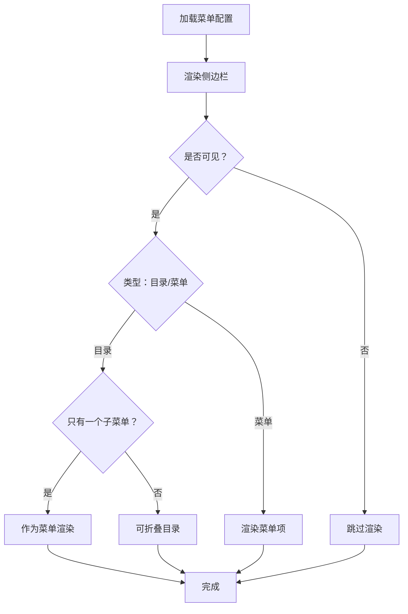
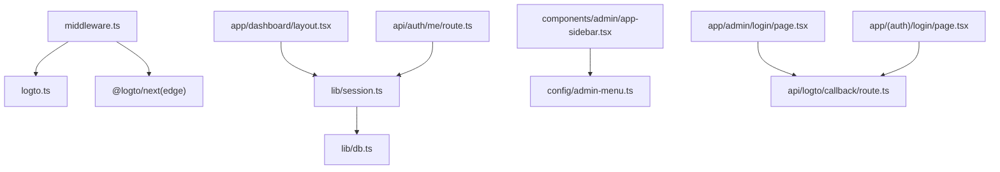

# 权限控制系统

<cite>
**本文档引用的文件**
- [middleware.ts](file://src/middleware.ts)
- [admin-menu.ts](file://src/config/admin-menu.ts)
- [session.ts](file://src/lib/session.ts)
- [logto.ts](file://src/lib/logto.ts)
- [route.ts](file://src/app/api/auth/me/route.ts)
- [layout.tsx](file://src/app/dashboard/layout.tsx)
- [app-sidebar.tsx](file://src/components/admin/app-sidebar.tsx)
- [page.tsx](file://src/app/admin/login/page.tsx)
- [page.tsx](file://src/app/(auth)/login/page.tsx)
- [route.ts](file://src/app/api/logto/callback/route.ts)
- [db.ts](file://src/lib/db.ts)
- [migration.sql](file://prisma/migrations/20260122003154_add_miss_table/migration.sql)
</cite>

## 目录
1. [简介](#简介)
2. [项目结构](#项目结构)
3. [核心组件](#核心组件)
4. [架构总览](#架构总览)
5. [详细组件分析](#详细组件分析)
6. [依赖关系分析](#依赖关系分析)
7. [性能考量](#性能考量)
8. [故障排除指南](#故障排除指南)
9. [结论](#结论)
10. [附录](#附录)

## 简介
本文件全面解析该权限控制系统的实现，重点覆盖基于中间件的路由级权限控制、角色权限模型与菜单权限控制、基于 Logto 的认证集成、以及管理后台的访问控制策略。文档同时提供扩展建议与安全注意事项，帮助开发者在现有基础上构建更完善的 RBAC（基于角色的权限控制）体系。

## 项目结构
权限相关的核心文件分布如下：
- 中间件层：统一处理受保护路由的访问控制与重定向
- 认证层：通过 Logto 客户端与服务端上下文获取用户信息
- 数据层：使用 Prisma 进行用户与账户数据持久化
- 前端展示层：管理后台侧边栏根据菜单配置渲染导航
- 页面层：管理后台布局对用户角色进行二次校验



**图表来源**
- [middleware.ts:1-36](file://src/middleware.ts#L1-L36)
- [logto.ts:1-13](file://src/lib/logto.ts#L1-L13)
- [route.ts:1-66](file://src/app/api/logto/callback/route.ts#L1-L66)
- [session.ts:1-42](file://src/lib/session.ts#L1-L42)
- [route.ts:1-13](file://src/app/api/auth/me/route.ts#L1-L13)
- [layout.tsx:1-26](file://src/app/dashboard/layout.tsx#L1-L26)
- [app-sidebar.tsx:1-145](file://src/components/admin/app-sidebar.tsx#L1-L145)
- [admin-menu.ts:1-199](file://src/config/admin-menu.ts#L1-L199)
- [page.tsx:1-6](file://src/app/admin/login/page.tsx#L1-L6)
- [page.tsx](file://src/app/(auth)/login/page.tsx#L1-L6)
- [db.ts:1-16](file://src/lib/db.ts#L1-L16)
- [migration.sql:1-43](file://prisma/migrations/20260122003154_add_miss_table/migration.sql#L1-L43)

**章节来源**
- [middleware.ts:1-36](file://src/middleware.ts#L1-L36)
- [logto.ts:1-13](file://src/lib/logto.ts#L1-L13)
- [route.ts:1-66](file://src/app/api/logto/callback/route.ts#L1-L66)
- [session.ts:1-42](file://src/lib/session.ts#L1-L42)
- [route.ts:1-13](file://src/app/api/auth/me/route.ts#L1-L13)
- [layout.tsx:1-26](file://src/app/dashboard/layout.tsx#L1-L26)
- [app-sidebar.tsx:1-145](file://src/components/admin/app-sidebar.tsx#L1-L145)
- [admin-menu.ts:1-199](file://src/config/admin-menu.ts#L1-L199)
- [page.tsx:1-6](file://src/app/admin/login/page.tsx#L1-L6)
- [page.tsx](file://src/app/(auth)/login/page.tsx#L1-L6)
- [db.ts:1-16](file://src/lib/db.ts#L1-L16)
- [migration.sql:1-43](file://prisma/migrations/20260122003154_add_miss_table/migration.sql#L1-L43)

## 核心组件
- 中间件权限控制：拦截受保护路径，校验用户是否已登录，未登录则重定向至登录流程；支持自动首页重定向与匹配器配置。
- 当前用户获取：通过 Logto 服务端上下文与数据库查询，返回用户角色等信息，并使用 React 缓存避免重复查询。
- 管理后台布局：在服务端对用户角色进行二次校验，非管理员直接重定向到首页。
- 菜单权限控制：通过菜单配置对象渲染侧边栏，结合可见性与状态字段控制菜单显示。
- 登录页面：统一重定向至 Logto 登录接口，确保一致的认证入口。
- 回调处理：完成登录后写入或更新用户与账户信息，然后重定向回首页。

**章节来源**
- [middleware.ts:8-28](file://src/middleware.ts#L8-L28)
- [session.ts:17-41](file://src/lib/session.ts#L17-L41)
- [layout.tsx:5-25](file://src/app/dashboard/layout.tsx#L5-L25)
- [app-sidebar.tsx:51-68](file://src/components/admin/app-sidebar.tsx#L51-L68)
- [page.tsx:3-5](file://src/app/admin/login/page.tsx#L3-L5)
- [page.tsx](file://src/app/(auth)/login/page.tsx#L3-L5)
- [route.ts:6-65](file://src/app/api/logto/callback/route.ts#L6-L65)

## 架构总览
下图展示了从请求进入、中间件校验、认证回调、用户信息获取到管理后台访问的整体流程。



**图表来源**
- [middleware.ts:8-28](file://src/middleware.ts#L8-L28)
- [route.ts:6-65](file://src/app/api/logto/callback/route.ts#L6-L65)
- [session.ts:17-41](file://src/lib/session.ts#L17-L41)
- [layout.tsx:5-25](file://src/app/dashboard/layout.tsx#L5-L25)

## 详细组件分析

### 中间件权限控制（middleware.ts）
- 匹配器配置：仅对 `/dashboard/:path*` 和 `/admin/:path*` 生效，提升性能与精确度。
- 重定向策略：
  - 将根 `/dashboard` 重定向到 `/dashboard/overview`，优化用户体验。
  - 对受保护路由，若未登录则重定向至 `/api/logto/sign-in`。
- 上下文校验：通过 Logto 客户端获取登录上下文，确认身份与主体标识存在。



**图表来源**
- [middleware.ts:8-28](file://src/middleware.ts#L8-L28)

**章节来源**
- [middleware.ts:30-35](file://src/middleware.ts#L30-L35)
- [middleware.ts:11-25](file://src/middleware.ts#L11-L25)

### 角色权限模型与菜单权限控制
- 角色定义：数据库中定义了角色枚举，包含普通用户与管理员两类。
- 用户角色字段：用户实体包含角色字段，用于服务端二次校验。
- 菜单配置：通过菜单配置对象定义菜单名称、路径、图标、类型、排序、可见性、状态与子菜单，前端侧边栏据此渲染。
- 菜单渲染逻辑：支持目录折叠、子菜单高亮、目录转菜单等逻辑，提升导航体验。

```mermaid
classDiagram
class AdminRoute {
+string name
+string path
+LucideIcon icon
+MenuType type
+number sort
+boolean visible
+string status
+boolean isExternal
+AdminRoute[] children
}
class CurrentUser {
+string id
+string username
+string email
+string role
+string nickname
+string avatar
}
class RoleEnum {
<<enumeration>>
"USER"
"ADMIN"
}
AdminRoute --> AdminRoute : "children"
CurrentUser --> RoleEnum : "role"
```

**图表来源**
- [admin-menu.ts:6-16](file://src/config/admin-menu.ts#L6-L16)
- [session.ts:6-13](file://src/lib/session.ts#L6-L13)
- [migration.sql:2-2](file://prisma/migrations/20260122003154_add_miss_table/migration.sql#L2-L2)

**章节来源**
- [admin-menu.ts:18-198](file://src/config/admin-menu.ts#L18-L198)
- [app-sidebar.tsx:71-144](file://src/components/admin/app-sidebar.tsx#L71-L144)
- [session.ts:6-13](file://src/lib/session.ts#L6-L13)
- [migration.sql:22-43](file://prisma/migrations/20260122003154_add_miss_table/migration.sql#L22-L43)

### 管理后台访问控制策略
- 公开页面：无需登录即可访问，如前台站点与部分工具页面。
- 登录页面：统一重定向至 `/api/logto/sign-in`，保证认证入口一致性。
- 管理后台：中间件拦截受保护路由；管理后台布局再次校验用户角色，非管理员直接重定向到首页。



**图表来源**
- [page.tsx:3-5](file://src/app/admin/login/page.tsx#L3-L5)
- [page.tsx](file://src/app/(auth)/login/page.tsx#L3-L5)
- [middleware.ts:15-25](file://src/middleware.ts#L15-L25)
- [layout.tsx:12-18](file://src/app/dashboard/layout.tsx#L12-L18)

**章节来源**
- [page.tsx:1-6](file://src/app/admin/login/page.tsx#L1-L6)
- [page.tsx](file://src/app/(auth)/login/page.tsx#L1-L6)
- [middleware.ts:15-25](file://src/middleware.ts#L15-L25)
- [layout.tsx:12-18](file://src/app/dashboard/layout.tsx#L12-L18)

### 认证与用户信息获取（Logto + Prisma）
- Logto 配置：集中管理端点、应用 ID、作用域、基础 URL、Cookie 密钥与安全标志。
- 回调处理：登录成功后，若用户不存在则创建用户与账户记录；若存在则更新最近登录时间与头像。
- 当前用户：通过服务端上下文获取用户标识，查询数据库返回用户信息，包含角色字段，供前端与服务端使用。



**图表来源**
- [logto.ts:3-12](file://src/lib/logto.ts#L3-L12)
- [route.ts:6-65](file://src/app/api/logto/callback/route.ts#L6-L65)
- [db.ts:1-16](file://src/lib/db.ts#L1-L16)

**章节来源**
- [logto.ts:1-13](file://src/lib/logto.ts#L1-L13)
- [route.ts:1-66](file://src/app/api/logto/callback/route.ts#L1-L66)
- [session.ts:17-41](file://src/lib/session.ts#L17-L41)
- [db.ts:1-16](file://src/lib/db.ts#L1-L16)

### 管理后台侧边栏菜单渲染
- 菜单数据源：来自菜单配置文件，支持目录、菜单与按钮三种类型。
- 渲染逻辑：根据路径高亮当前菜单；目录类型可折叠；当目录仅有一个子菜单时可直接渲染为菜单。
- 可见性与状态：通过可见性与状态字段控制菜单显示与禁用。



**图表来源**
- [admin-menu.ts:18-198](file://src/config/admin-menu.ts#L18-L198)
- [app-sidebar.tsx:71-144](file://src/components/admin/app-sidebar.tsx#L71-L144)

**章节来源**
- [admin-menu.ts:1-199](file://src/config/admin-menu.ts#L1-L199)
- [app-sidebar.tsx:51-144](file://src/components/admin/app-sidebar.tsx#L51-L144)

## 依赖关系分析
- 中间件依赖 Logto 客户端与配置，负责路由级拦截与重定向。
- 管理后台布局依赖当前用户获取函数，进一步依赖数据库查询。
- 侧边栏依赖菜单配置，菜单配置来源于配置文件。
- 登录页面统一重定向至认证接口，回调处理完成后重定向回首页。



**图表来源**
- [middleware.ts:1-6](file://src/middleware.ts#L1-L6)
- [logto.ts:1-13](file://src/lib/logto.ts#L1-L13)
- [layout.tsx:1-26](file://src/app/dashboard/layout.tsx#L1-L26)
- [session.ts:1-42](file://src/lib/session.ts#L1-L42)
- [app-sidebar.tsx:1-145](file://src/components/admin/app-sidebar.tsx#L1-L145)
- [admin-menu.ts:1-199](file://src/config/admin-menu.ts#L1-L199)
- [page.tsx:1-6](file://src/app/admin/login/page.tsx#L1-L6)
- [page.tsx](file://src/app/(auth)/login/page.tsx#L1-L6)
- [route.ts:1-66](file://src/app/api/logto/callback/route.ts#L1-L66)
- [route.ts:1-13](file://src/app/api/auth/me/route.ts#L1-L13)
- [db.ts:1-16](file://src/lib/db.ts#L1-L16)

**章节来源**
- [middleware.ts:1-6](file://src/middleware.ts#L1-L6)
- [layout.tsx:1-26](file://src/app/dashboard/layout.tsx#L1-L26)
- [session.ts:1-42](file://src/lib/session.ts#L1-L42)
- [app-sidebar.tsx:1-145](file://src/components/admin/app-sidebar.tsx#L1-L145)
- [admin-menu.ts:1-199](file://src/config/admin-menu.ts#L1-L199)
- [page.tsx:1-6](file://src/app/admin/login/page.tsx#L1-L6)
- [page.tsx](file://src/app/(auth)/login/page.tsx#L1-L6)
- [route.ts:1-66](file://src/app/api/logto/callback/route.ts#L1-L66)
- [route.ts:1-13](file://src/app/api/auth/me/route.ts#L1-L13)
- [db.ts:1-16](file://src/lib/db.ts#L1-L16)

## 性能考量
- 中间件匹配器：仅对受保护路径生效，减少不必要的中间件执行。
- 请求级缓存：当前用户获取函数使用 React 缓存，避免同一次请求内重复查询。
- 并行化：在需要时可并行发起多个独立操作以减少等待时间（参考最佳实践文档中的并行化建议）。

**章节来源**
- [middleware.ts:30-35](file://src/middleware.ts#L30-L35)
- [session.ts:17-17](file://src/lib/session.ts#L17-L17)

## 故障排除指南
- 未登录访问受保护路由：中间件会重定向至登录接口，请确认浏览器 Cookie 与会话状态正常。
- 管理后台被重定向到首页：说明当前用户角色不是管理员，请联系管理员提升权限或检查用户角色字段。
- 回调后无法登录：检查回调处理是否正确创建用户与账户记录，确认数据库连接与环境变量配置。
- 菜单不显示：检查菜单配置的可见性与状态字段，确认路径与类型配置正确。

**章节来源**
- [middleware.ts:21-25](file://src/middleware.ts#L21-L25)
- [layout.tsx:16-18](file://src/app/dashboard/layout.tsx#L16-L18)
- [route.ts:21-62](file://src/app/api/logto/callback/route.ts#L21-L62)
- [admin-menu.ts:12-13](file://src/config/admin-menu.ts#L12-L13)

## 结论
该权限控制系统采用“中间件 + 认证 + 服务端二次校验”的多层防护设计，结合 Logto 的 OIDC 认证与 Prisma 的用户数据管理，实现了从路由级到页面级的访问控制。菜单配置与侧边栏渲染提供了直观的导航体验。未来可在现有基础上引入更细粒度的权限点与动态权限计算，逐步完善 RBAC 体系。

## 附录

### 权限配置示例（管理员菜单）
- 菜单配置文件定义了目录、菜单与按钮类型，支持图标、排序、可见性与状态控制。
- 侧边栏根据配置渲染，支持目录折叠与高亮。

**章节来源**
- [admin-menu.ts:18-198](file://src/config/admin-menu.ts#L18-L198)
- [app-sidebar.tsx:51-144](file://src/components/admin/app-sidebar.tsx#L51-L144)

### 权限验证函数与错误处理
- 当前用户获取函数返回用户信息，若未登录则返回空值，便于上层逻辑处理。
- 管理后台布局对用户角色进行二次校验，非管理员直接重定向到首页。

**章节来源**
- [session.ts:17-41](file://src/lib/session.ts#L17-L41)
- [layout.tsx:10-18](file://src/app/dashboard/layout.tsx#L10-L18)

### 扩展方法与安全考虑
- 扩展建议：
  - 引入权限点与资源级权限，结合角色与权限矩阵实现更精细的授权。
  - 在服务端动作与 API 路由中增加权限校验，避免仅依赖前端与中间件。
  - 使用数据库迁移维护权限与角色的变更历史。
- 安全考虑：
  - 严格区分中间件、布局与服务端动作的权限校验职责。
  - 确保 Cookie 安全标志与 HTTPS 环境下的传输安全。
  - 对敏感操作增加二次确认与审计日志。

**章节来源**
- [middleware.ts:8-28](file://src/middleware.ts#L8-L28)
- [layout.tsx:12-18](file://src/app/dashboard/layout.tsx#L12-L18)
- [logto.ts:11-12](file://src/lib/logto.ts#L11-L12)