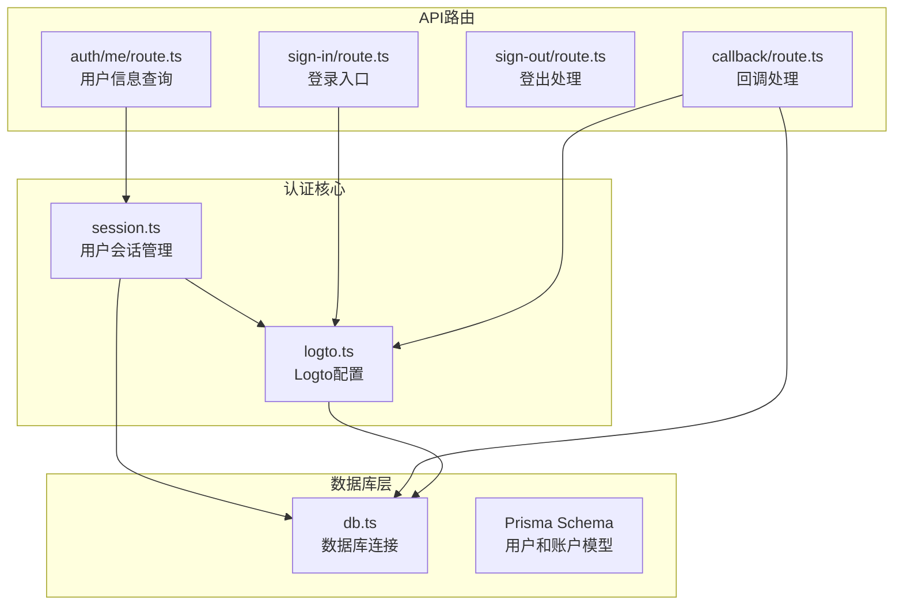
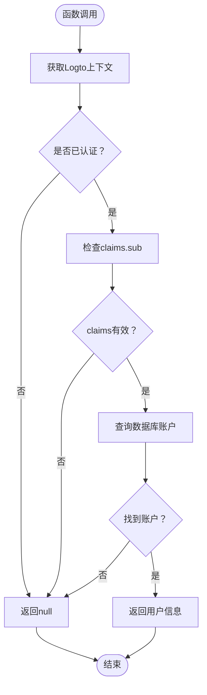
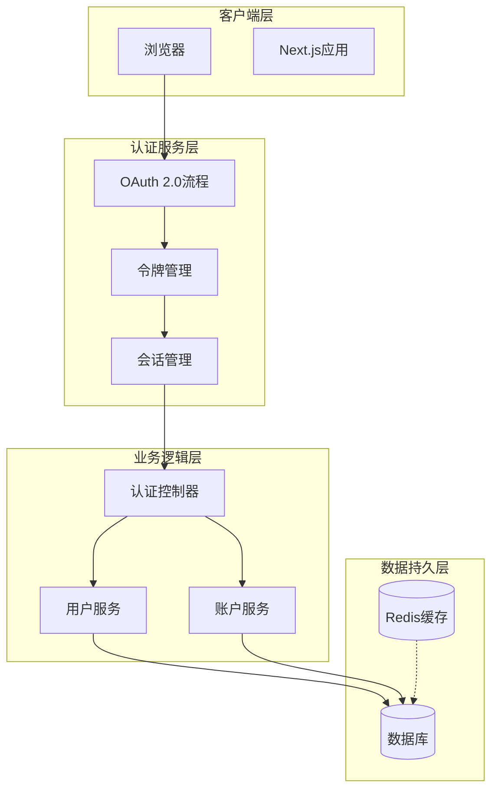
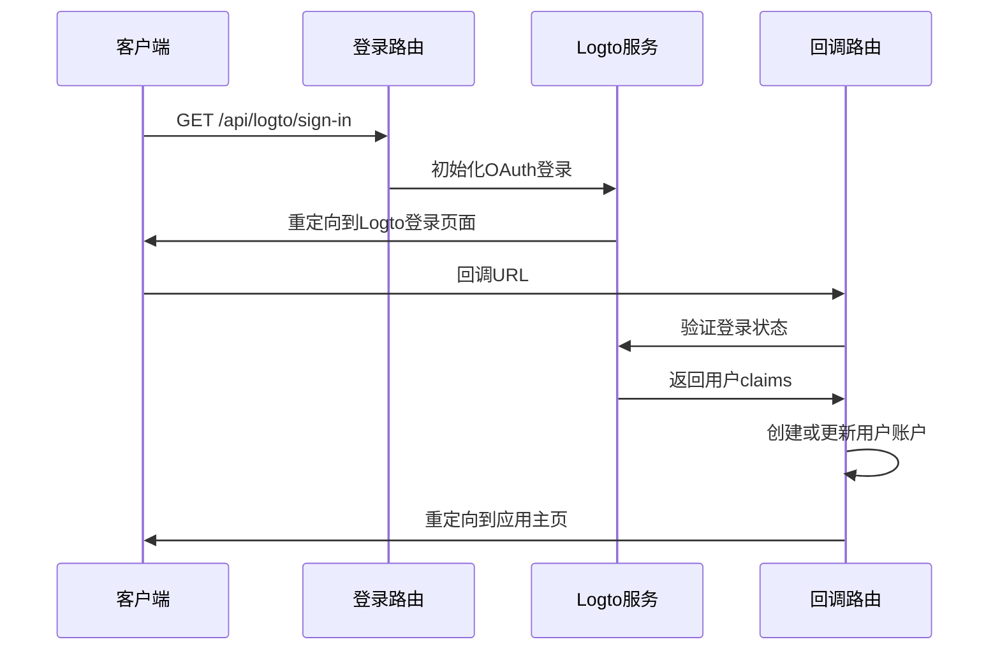
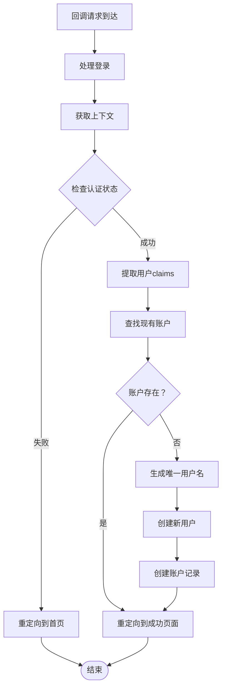
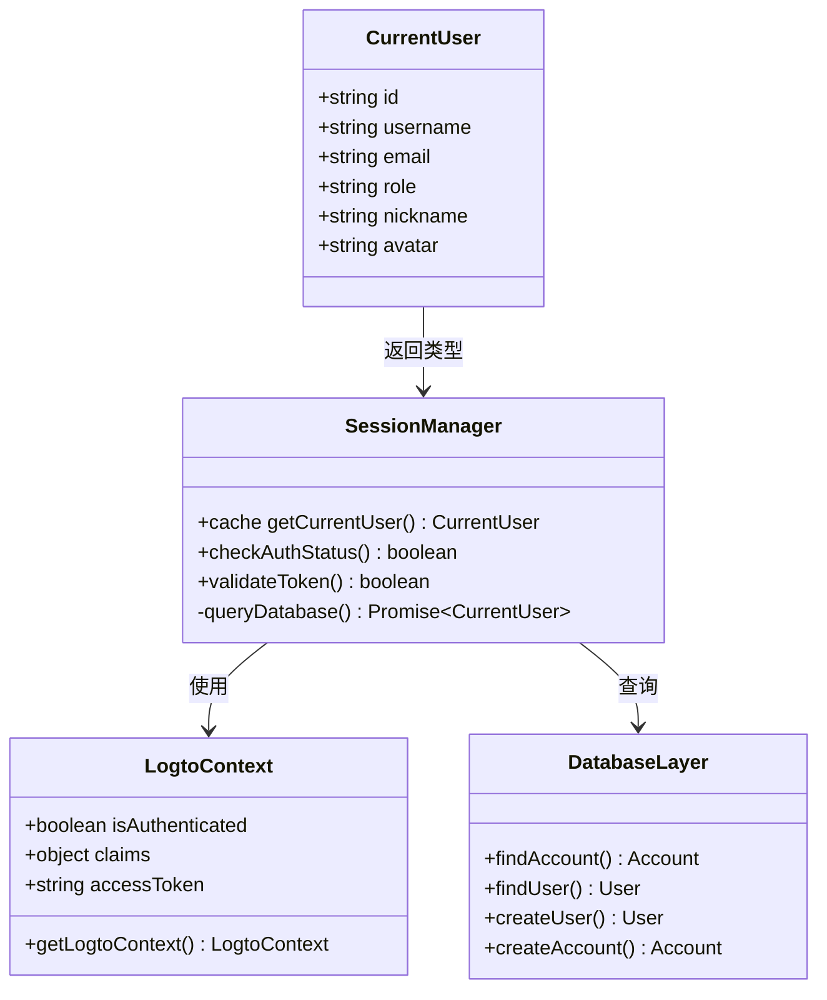
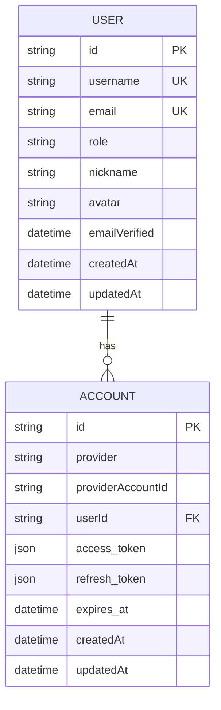
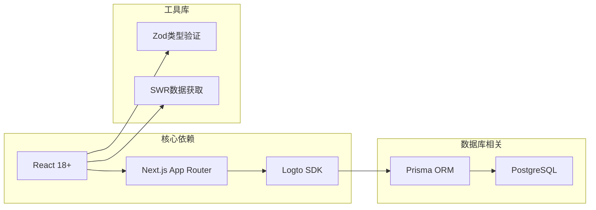
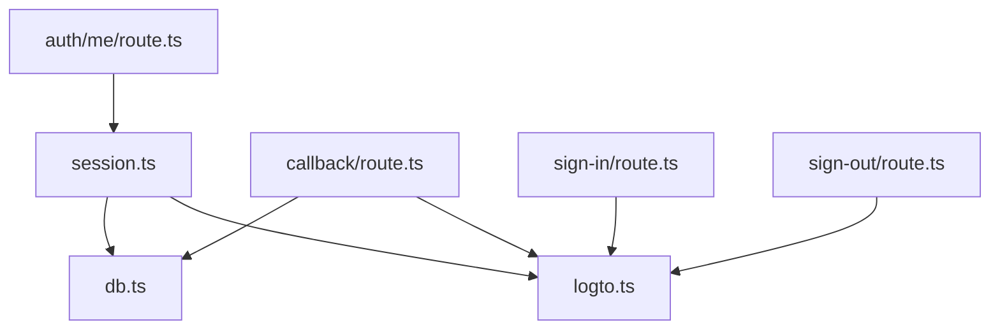
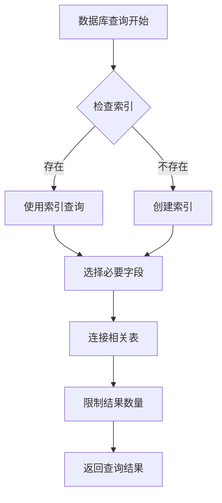

# 用户认证机制

<cite>
**本文档引用的文件**
- [session.ts](file://src/lib/session.ts)
- [callback/route.ts](file://src/app/api/logto/callback/route.ts)
- [sign-in/route.ts](file://src/app/api/logto/sign-in/route.ts)
- [sign-out/route.ts](file://src/app/api/logto/sign-out/route.ts)
- [auth/me/route.ts](file://src/app/api/auth/me/route.ts)
- [logto.ts](file://src/lib/logto.ts)
- [db.ts](file://src/lib/db.ts)
</cite>

## 目录
1. [简介](#简介)
2. [项目结构](#项目结构)
3. [核心组件](#核心组件)
4. [架构概览](#架构概览)
5. [详细组件分析](#详细组件分析)
6. [依赖关系分析](#依赖关系分析)
7. [性能考虑](#性能考虑)
8. [故障排除指南](#故障排除指南)
9. [结论](#结论)

## 简介

本项目采用基于Logto的OAuth 2.0认证机制，实现了完整的用户身份验证和授权流程。系统通过Next.js App Router模式构建，使用React缓存机制优化请求级去重，并结合Prisma ORM进行数据库操作。

该认证系统的核心特点包括：
- 基于OAuth 2.0协议的第三方登录
- React缓存机制实现请求级去重
- 自动化的用户账户创建和管理
- 完整的会话管理和令牌验证
- 数据库查询优化策略

## 项目结构

认证相关文件主要分布在以下目录结构中：



**图表来源**
- [session.ts:1-41](file://src/lib/session.ts#L1-L41)
- [sign-in/route.ts:1-8](file://src/app/api/logto/sign-in/route.ts#L1-L8)
- [callback/route.ts:1-41](file://src/app/api/logto/callback/route.ts#L1-L41)

**章节来源**
- [session.ts:1-41](file://src/lib/session.ts#L1-L41)
- [logto.ts](file://src/lib/logto.ts)
- [db.ts](file://src/lib/db.ts)

## 核心组件

### 当前用户接口定义

系统定义了标准的CurrentUser接口，用于统一用户信息的数据结构：

| 字段名 | 类型 | 是否可空 | 描述 |
|--------|------|----------|------|
| id | string | 否 | 用户唯一标识符 |
| username | string | 否 | 用户名 |
| email | string | 否 | 邮箱地址 |
| role | string | 否 | 用户角色（USER/ADMIN等） |
| nickname | string | 是 | 昵称 |
| avatar | string | 是 | 头像URL |

### 认证状态检查机制

系统通过`getCurrentUser`函数实现统一的认证状态检查：



**图表来源**
- [session.ts:17-41](file://src/lib/session.ts#L17-L41)

**章节来源**
- [session.ts:6-41](file://src/lib/session.ts#L6-L41)

## 架构概览

系统采用分层架构设计，实现了清晰的关注点分离：



**图表来源**
- [session.ts:15-16](file://src/lib/session.ts#L15-L16)
- [callback/route.ts:10-16](file://src/app/api/logto/callback/route.ts#L10-L16)

## 详细组件分析

### 登录流程组件

#### 登录入口路由

登录流程从`/api/logto/sign-in`路由开始，该路由负责初始化OAuth 2.0登录过程：



**图表来源**
- [sign-in/route.ts:6-8](file://src/app/api/logto/sign-in/route.ts#L6-L8)
- [callback/route.ts:10-16](file://src/app/api/logto/callback/route.ts#L10-L16)

#### 回调处理组件

回调路由负责处理Logto的OAuth回调，实现用户账户的自动创建和管理：



**图表来源**
- [callback/route.ts:14-41](file://src/app/api/logto/callback/route.ts#L14-L41)

**章节来源**
- [sign-in/route.ts:1-8](file://src/app/api/logto/sign-in/route.ts#L1-L8)
- [callback/route.ts:1-41](file://src/app/api/logto/callback/route.ts#L1-L41)

### 会话管理组件

#### React缓存机制

系统使用React的`cache`函数实现请求级去重，确保同一请求内的多次调用只触发一次数据库查询：



**图表来源**
- [session.ts:17-41](file://src/lib/session.ts#L17-L41)

#### 用户信息查询API

系统提供了专门的API端点用于查询当前用户信息：

**章节来源**
- [session.ts:15-16](file://src/lib/session.ts#L15-L16)
- [auth/me/route.ts:1-12](file://src/app/api/auth/me/route.ts#L1-L12)

### 数据模型设计

#### 用户和账户关系

系统采用用户(User)和账户(Account)分离的设计模式，通过外键关联实现多平台账户支持：



**图表来源**
- [session.ts:24-38](file://src/lib/session.ts#L24-L38)

**章节来源**
- [session.ts:24-38](file://src/lib/session.ts#L24-L38)

## 依赖关系分析

### 外部依赖

系统主要依赖以下外部库和服务：



**图表来源**
- [session.ts:1-4](file://src/lib/session.ts#L1-L4)

### 内部模块依赖



**图表来源**
- [session.ts:1-4](file://src/lib/session.ts#L1-L4)
- [callback/route.ts:1-5](file://src/app/api/logto/callback/route.ts#L1-L5)

**章节来源**
- [session.ts:1-4](file://src/lib/session.ts#L1-L4)
- [callback/route.ts:1-5](file://src/app/api/logto/callback/route.ts#L1-L5)

## 性能考虑

### 请求级缓存优化

系统通过React缓存机制实现请求级去重，避免重复的数据库查询：

- **缓存策略**：使用`React.cache`确保同一请求内多次调用`getCurrentUser`只执行一次数据库查询
- **去重效果**：在单个HTTP请求中，多个组件同时需要用户信息时，只会触发一次数据库访问
- **内存管理**：缓存仅在请求生命周期内有效，请求结束后自动清理

### 数据库查询优化



**图表来源**
- [session.ts:24-38](file://src/lib/session.ts#L24-L38)

**章节来源**
- [session.ts:15-16](file://src/lib/session.ts#L15-L16)
- [session.ts:24-38](file://src/lib/session.ts#L24-L38)

## 故障排除指南

### 常见认证问题

#### 登录失败排查

1. **检查Logto配置**
   - 验证`logto.ts`中的配置参数
   - 确认回调URL设置正确
   - 检查应用注册状态

2. **调试认证流程**
   ```typescript
   // 在开发环境中启用详细日志
   console.log('Logto上下文:', context);
   console.log('认证状态:', context.isAuthenticated);
   console.log('用户claims:', context.claims);
   ```

#### 用户信息获取失败

1. **验证数据库连接**
   - 检查Prisma连接配置
   - 确认用户表结构完整
   - 验证账户关联查询

2. **检查缓存状态**
   - 确认React缓存正常工作
   - 验证请求级去重机制
   - 检查缓存失效策略

**章节来源**
- [callback/route.ts:14-16](file://src/app/api/logto/callback/route.ts#L14-L16)
- [session.ts:20-22](file://src/lib/session.ts#L20-L22)

## 结论

本项目的用户认证机制通过以下关键特性实现了高效、可靠的用户身份验证：

1. **完整的OAuth 2.0流程**：从初始化登录到回调处理的完整链路
2. **智能缓存机制**：利用React缓存实现请求级去重，提升性能
3. **自动化用户管理**：自动创建和维护用户账户，简化开发工作
4. **安全的会话管理**：基于Logto的令牌验证和会话控制
5. **灵活的扩展性**：模块化设计便于功能扩展和维护

该认证系统为Next.js应用提供了企业级的用户身份验证解决方案，既保证了安全性，又兼顾了开发效率和用户体验。