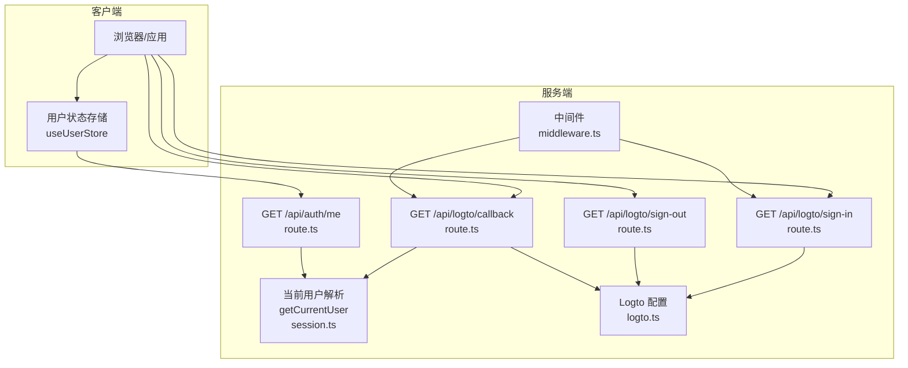
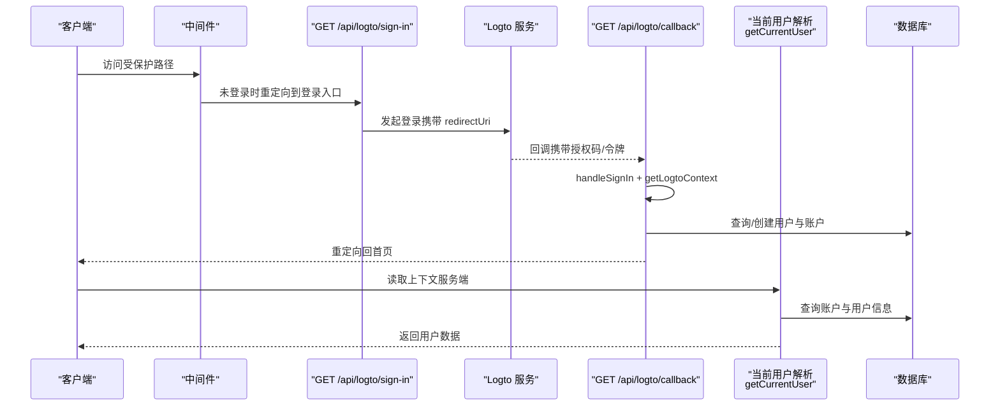
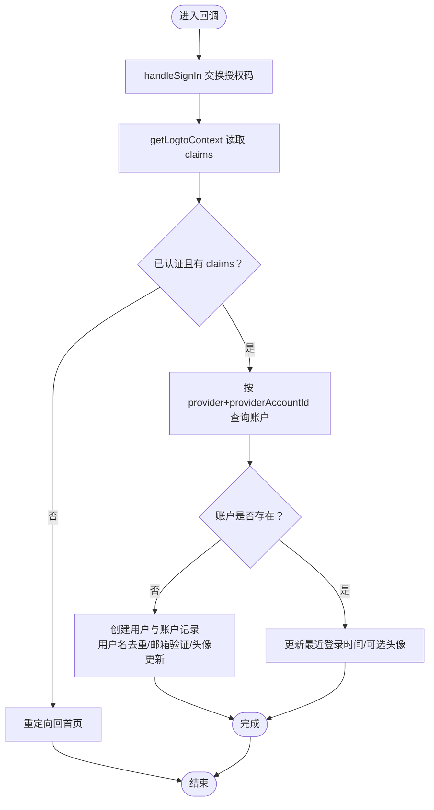
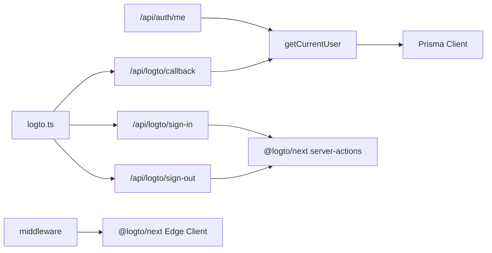

# 认证API接口

<cite>
**本文引用的文件**
- [src/app/api/auth/me/route.ts](file://src/app/api/auth/me/route.ts)
- [src/app/api/logto/sign-in/route.ts](file://src/app/api/logto/sign-in/route.ts)
- [src/app/api/logto/sign-out/route.ts](file://src/app/api/logto/sign-out/route.ts)
- [src/app/api/logto/callback/route.ts](file://src/app/api/logto/callback/route.ts)
- [src/lib/logto.ts](file://src/lib/logto.ts)
- [src/lib/session.ts](file://src/lib/session.ts)
- [src/middleware.ts](file://src/middleware.ts)
- [src/store/user-store.ts](file://src/store/user-store.ts)
- [src/app/(auth)/layout.tsx](file://src/app/(auth)/layout.tsx)
- [package.json](file://package.json)
- [README.md](file://README.md)
</cite>

## 目录
1. [简介](#简介)
2. [项目结构](#项目结构)
3. [核心组件](#核心组件)
4. [架构总览](#架构总览)
5. [详细组件分析](#详细组件分析)
6. [依赖关系分析](#依赖关系分析)
7. [性能考虑](#性能考虑)
8. [故障排查指南](#故障排查指南)
9. [结论](#结论)
10. [附录](#附录)

## 简介
本文件面向开发者与集成方，系统性梳理本项目的认证相关 RESTful API 接口，覆盖以下端点：
- GET /api/auth/me：获取当前登录用户信息
- POST /api/logto/sign-in：发起登录（重定向至 Logto 登录页）
- POST /api/logto/sign-out：退出登录（清除会话）
- GET /api/logto/callback：OAuth 回调处理，完成登录态写入与用户资料同步

文档将逐项说明请求方式、参数、响应格式、HTTP 状态码、安全机制、错误处理、调用示例（含 curl 与 JavaScript fetch），并补充版本管理、速率限制与调试建议。

## 项目结构
认证相关的核心文件分布于 App Router 的 API 路由、通用库与中间件层：
- API 路由：位于 src/app/api 下，分别实现用户信息查询与 Logto 登录/登出/回调流程
- 通用库：src/lib 下的 logto.ts（Logto 配置）、session.ts（当前用户解析与缓存）
- 中间件：src/middleware.ts（受保护路径的登录校验）
- 前端状态：src/store/user-store.ts（客户端拉取用户信息与登出跳转）

图表来源
- [src/app/api/auth/me/route.ts:1-13](file://src/app/api/auth/me/route.ts#L1-L13)
- [src/app/api/logto/sign-in/route.ts:1-9](file://src/app/api/logto/sign-in/route.ts#L1-L9)
- [src/app/api/logto/sign-out/route.ts:1-7](file://src/app/api/logto/sign-out/route.ts#L1-L7)
- [src/app/api/logto/callback/route.ts:1-66](file://src/app/api/logto/callback/route.ts#L1-L66)
- [src/lib/session.ts:1-42](file://src/lib/session.ts#L1-L42)
- [src/lib/logto.ts:1-13](file://src/lib/logto.ts#L1-L13)
- [src/middleware.ts:1-36](file://src/middleware.ts#L1-L36)
- [src/store/user-store.ts:1-49](file://src/store/user-store.ts#L1-L49)

章节来源
- [src/app/api/auth/me/route.ts:1-13](file://src/app/api/auth/me/route.ts#L1-L13)
- [src/app/api/logto/sign-in/route.ts:1-9](file://src/app/api/logto/sign-in/route.ts#L1-L9)
- [src/app/api/logto/sign-out/route.ts:1-7](file://src/app/api/logto/sign-out/route.ts#L1-L7)
- [src/app/api/logto/callback/route.ts:1-66](file://src/app/api/logto/callback/route.ts#L1-L66)
- [src/lib/session.ts:1-42](file://src/lib/session.ts#L1-L42)
- [src/lib/logto.ts:1-13](file://src/lib/logto.ts#L1-L13)
- [src/middleware.ts:1-36](file://src/middleware.ts#L1-L36)
- [src/store/user-store.ts:1-49](file://src/store/user-store.ts#L1-L49)

## 核心组件
- 当前用户解析器 getCurrentUser：封装了 Logto 上下文读取与数据库账户/用户关联查询，使用 React.cache 实现请求级去重，避免重复鉴权与查询
- Logto 配置 logtoConfig：集中管理 endpoint、appId、scopes、baseUrl、cookieSecret、cookieSecure 等关键参数
- 中间件 middleware：对受保护路径（如 /dashboard、/admin）进行登录态校验，未登录则重定向到登录入口
- 用户状态存储 useUserStore：负责从 /api/auth/me 拉取用户信息、处理登录/登出与本地状态更新

章节来源
- [src/lib/session.ts:1-42](file://src/lib/session.ts#L1-L42)
- [src/lib/logto.ts:1-13](file://src/lib/logto.ts#L1-L13)
- [src/middleware.ts:1-36](file://src/middleware.ts#L1-L36)
- [src/store/user-store.ts:1-49](file://src/store/user-store.ts#L1-L49)

## 架构总览
认证流程围绕 Logto OAuth 2.0/OpenID Connect 实现，结合服务端上下文读取与数据库用户账户映射，形成“登录发起 → 回调处理 → 用户资料落库/更新 → 写入会话”的闭环。

图表来源
- [src/middleware.ts:1-36](file://src/middleware.ts#L1-L36)
- [src/app/api/logto/sign-in/route.ts:1-9](file://src/app/api/logto/sign-in/route.ts#L1-L9)
- [src/app/api/logto/callback/route.ts:1-66](file://src/app/api/logto/callback/route.ts#L1-L66)
- [src/lib/session.ts:1-42](file://src/lib/session.ts#L1-L42)

## 详细组件分析

### GET /api/auth/me
- 功能：返回当前登录用户的简要信息
- 请求方式：GET
- 请求参数：无
- 响应体字段
  - code：数字，200 表示成功；401 表示未登录
  - data：对象或 null
    - 成功时包含 id、username、email、role、nickname、avatar 等
    - 未登录时为 null
- HTTP 状态码
  - 200：成功
  - 401：未登录
- 安全机制
  - 通过 getCurrentUser 读取 Logto 上下文并校验身份
  - 使用 React.cache 在一次请求内去重，避免重复鉴权与查询
- 错误处理
  - 未登录时返回 401 并提示“未登录”
- 调用示例
  - curl
    - curl -i https://yoursite/api/auth/me
  - JavaScript fetch
    - fetch("/api/auth/me").then(r=>r.json()).then(console.log)
- 典型响应
  - 成功：{"code":200,"data":{"id":"...","username":"john","email":"john@example","role":"USER","nickname":null,"avatar":null}}
  - 未登录：{"code":401,"message":"未登录"}

章节来源
- [src/app/api/auth/me/route.ts:1-13](file://src/app/api/auth/me/route.ts#L1-L13)
- [src/lib/session.ts:1-42](file://src/lib/session.ts#L1-L42)

### POST /api/logto/sign-in
- 功能：发起登录流程，重定向至 Logto 登录页
- 请求方式：GET（注意：该路由导出为 GET，但文档标题使用 POST；实际实现为 GET）
- 请求参数：无
- 响应：302 Found，Location 指向 Logto 登录页
- 安全机制
  - 使用 logtoConfig baseUrl 作为回调地址前缀，确保回调地址正确
- 错误处理
  - 若配置缺失，底层库可能抛错；需确保 LOGTO_* 环境变量正确
- 调用示例
  - curl
    - curl -L -i https://yoursite/api/logto/sign-in
  - JavaScript fetch
    - fetch("/api/logto/sign-in") 会触发浏览器重定向
- 注意
  - 该端点不直接返回 JSON，而是重定向；前端应以导航或跳转方式触发

章节来源
- [src/app/api/logto/sign-in/route.ts:1-9](file://src/app/api/logto/sign-in/route.ts#L1-L9)
- [src/lib/logto.ts:1-13](file://src/lib/logto.ts#L1-L13)

### POST /api/logto/sign-out
- 功能：退出登录，清除会话
- 请求方式：GET（注意：该路由导出为 GET，但文档标题使用 POST；实际实现为 GET）
- 请求参数：无
- 响应：302 Found，Location 指向站点根路径
- 安全机制
  - 使用 logtoConfig baseUrl 作为重定向目标
- 错误处理
  - 失败时通常仍会重定向回根路径
- 调用示例
  - curl
    - curl -L -i https://yoursite/api/logto/sign-out
  - JavaScript fetch
    - fetch("/api/logto/sign-out") 会触发浏览器重定向

章节来源
- [src/app/api/logto/sign-out/route.ts:1-7](file://src/app/api/logto/sign-out/route.ts#L1-L7)
- [src/lib/logto.ts:1-13](file://src/lib/logto.ts#L1-L13)

### GET /api/logto/callback
- 功能：OAuth 回调处理，完成登录态写入与用户资料同步
- 请求方式：GET
- 请求参数：来自 OAuth 授权服务器的回调参数（由底层库自动处理）
- 响应：302 Found，重定向回站点根路径
- 安全机制
  - 调用 handleSignIn 完成授权码交换与令牌校验
  - 通过 getLogtoContext 获取 claims，校验是否已认证
  - 仅当认证成功时才进行用户/账户落库或更新
- 数据处理逻辑
  - 若账户不存在：根据 claims 创建用户与账户记录，用户名去重，邮箱存在则标记已验证时间
  - 若账户已存在：更新最近登录时间与头像（若新值可用）
- 错误处理
  - 未认证或无 claims 时重定向回根路径
- 调用示例
  - curl
    - curl -L -i "https://yoursite/api/logto/callback?code=xxx&state=xxx"
  - JavaScript fetch
    - fetch("/api/logto/callback") 会触发浏览器重定向

图表来源
- [src/app/api/logto/callback/route.ts:1-66](file://src/app/api/logto/callback/route.ts#L1-L66)

章节来源
- [src/app/api/logto/callback/route.ts:1-66](file://src/app/api/logto/callback/route.ts#L1-L66)

### 客户端集成要点
- 使用 useUserStore
  - 初始化时调用 fetchUser 拉取 /api/auth/me
  - 登出时通过 window.location.href 跳转至 /api/logto/sign-out
- 认证布局
  - 认证相关页面使用统一布局，保证视觉一致性与背景装饰

章节来源
- [src/store/user-store.ts:1-49](file://src/store/user-store.ts#L1-L49)
- [src/app/(auth)/layout.tsx](file://src/app/(auth)/layout.tsx#L1-L62)

## 依赖关系分析
- 低耦合高内聚
  - API 路由仅依赖通用库（logto.ts、session.ts），不直接耦合业务模块
  - 中间件独立于具体页面，通过路径匹配与 Logto 客户端进行上下文校验
- 关键依赖
  - @logto/next：提供 server-actions（signIn/signOut/handleSignIn/getLogtoContext）与 Edge 客户端
  - Prisma：用户与账户的持久化
  - React.cache：请求级去重，降低重复鉴权与查询成本

图表来源
- [src/app/api/auth/me/route.ts:1-13](file://src/app/api/auth/me/route.ts#L1-L13)
- [src/app/api/logto/sign-in/route.ts:1-9](file://src/app/api/logto/sign-in/route.ts#L1-L9)
- [src/app/api/logto/sign-out/route.ts:1-7](file://src/app/api/logto/sign-out/route.ts#L1-L7)
- [src/app/api/logto/callback/route.ts:1-66](file://src/app/api/logto/callback/route.ts#L1-L66)
- [src/lib/session.ts:1-42](file://src/lib/session.ts#L1-L42)
- [src/lib/logto.ts:1-13](file://src/lib/logto.ts#L1-L13)
- [src/middleware.ts:1-36](file://src/middleware.ts#L1-L36)

章节来源
- [package.json:1-98](file://package.json#L1-L98)
- [src/lib/logto.ts:1-13](file://src/lib/logto.ts#L1-L13)
- [src/lib/session.ts:1-42](file://src/lib/session.ts#L1-L42)
- [src/middleware.ts:1-36](file://src/middleware.ts#L1-L36)

## 性能考虑
- 请求级去重
  - getCurrentUser 使用 React.cache，在一次请求内多次调用只执行一次鉴权与查询，显著降低开销
- 中间件轻量校验
  - middleware 仅做路径匹配与上下文读取，避免在非受保护路径引入额外逻辑
- 建议
  - 将敏感操作（如修改密码、删除账户）置于受保护路径并通过中间件校验
  - 对频繁调用的 /api/auth/me，可在客户端配合缓存策略减少重复请求

章节来源
- [src/lib/session.ts:15-17](file://src/lib/session.ts#L15-L17)
- [src/middleware.ts:15-28](file://src/middleware.ts#L15-L28)

## 故障排查指南
- 未登录返回 401
  - 检查浏览器 Cookie 是否被清除或过期
  - 确认中间件是否正确拦截受保护路径并重定向到登录入口
- 回调未生效或重定向失败
  - 核对 LOGTO_BASE_URL 与回调地址是否一致
  - 确认 handleSignIn 与 getLogtoContext 是否正常执行
- 用户未创建或头像未更新
  - 检查 claims 字段（username、email、name、picture、sub）是否可用
  - 确认 Prisma 账户/用户表结构与查询条件
- 环境变量缺失
  - 确保 LOGTO_ENDPOINT、LOGTO_APP_ID、LOGTO_BASE_URL、LOGTO_COOKIE_SECRET 设置正确
- 速率限制
  - 本认证模块未内置速率限制；如需限制，请参考其他模块中的 Redis Lua 限流实现思路进行扩展

章节来源
- [src/app/api/auth/me/route.ts:7-9](file://src/app/api/auth/me/route.ts#L7-L9)
- [src/app/api/logto/callback/route.ts:14-16](file://src/app/api/logto/callback/route.ts#L14-L16)
- [src/lib/logto.ts:3-12](file://src/lib/logto.ts#L3-L12)
- [src/middleware.ts:21-25](file://src/middleware.ts#L21-L25)

## 结论
本认证体系以 Logto 为核心，结合服务端上下文读取与数据库账户映射，实现了从登录发起、回调处理到用户信息返回的完整闭环。通过 React.cache 与中间件校验，兼顾了安全性与性能。建议在生产环境中完善环境变量校验、错误日志与限流策略，并在客户端做好登录态持久化与错误兜底。

## 附录

### API 调用示例（不含代码片段）
- curl
  - 获取当前用户：curl -i https://yoursite/api/auth/me
  - 发起登录：curl -L -i https://yoursite/api/logto/sign-in
  - 退出登录：curl -L -i https://yoursite/api/logto/sign-out
  - 回调处理：curl -L -i "https://yoursite/api/logto/callback?code=xxx&state=xxx"
- JavaScript fetch
  - 获取当前用户：fetch("/api/auth/me").then(r=>r.json()).then(console.log)
  - 发起登录：fetch("/api/logto/sign-in")（会触发浏览器重定向）
  - 退出登录：fetch("/api/logto/sign-out")（会触发浏览器重定向）
  - 回调处理：fetch("/api/logto/callback")（会触发浏览器重定向）

### 安全与最佳实践
- 严格校验中间件
  - 受保护路径必须通过 middleware 校验，未登录一律重定向
- 会话与 Cookie
  - 生产环境启用 secure Cookie，并确保 SameSite 与 HttpOnly 合理配置
- 日志与监控
  - 记录登录/登出事件与异常，便于审计与排障
- 错误处理
  - 对未登录场景返回明确的 401 与提示信息
  - 对回调异常进行降级处理（例如重定向回首页）

### 版本管理与兼容性
- 项目版本
  - 项目版本在 package.json 中定义，当前版本为 0.1.0
- 依赖版本
  - @logto/next 版本在 package.json 中声明，建议保持与官方文档一致
- 兼容性
  - Next.js App Router 与 Edge Runtime 兼容性良好，回调与中间件均基于 Edge 客户端

章节来源
- [package.json:1-98](file://package.json#L1-L98)
- [README.md:1-125](file://README.md#L1-L125)