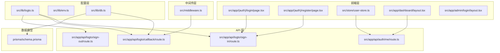
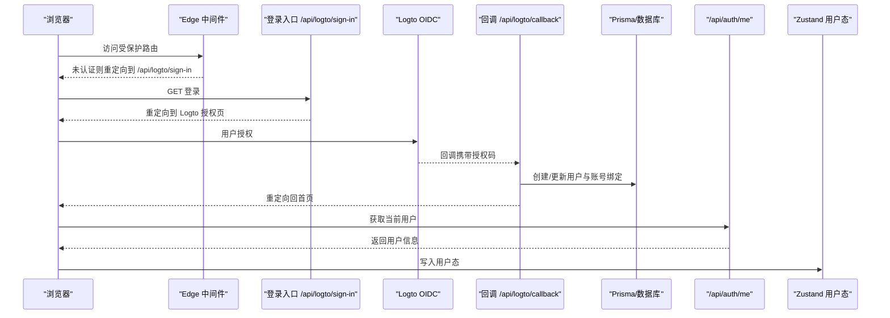
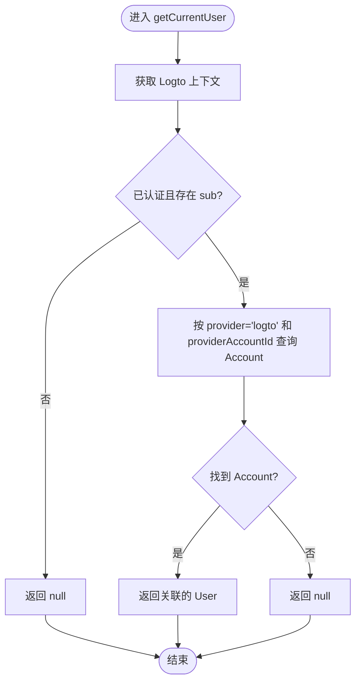
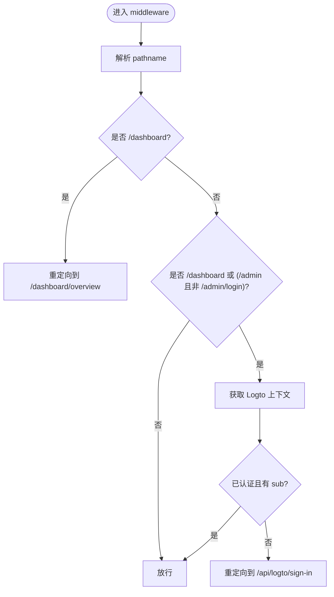
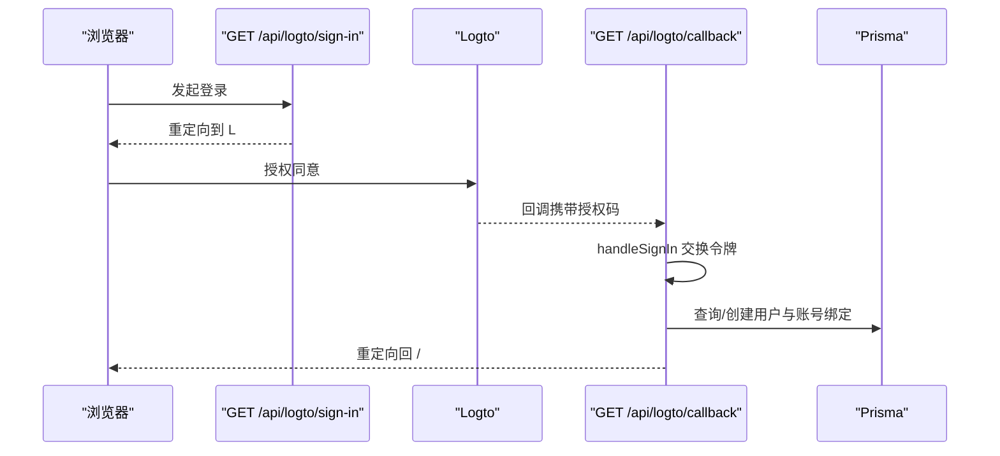
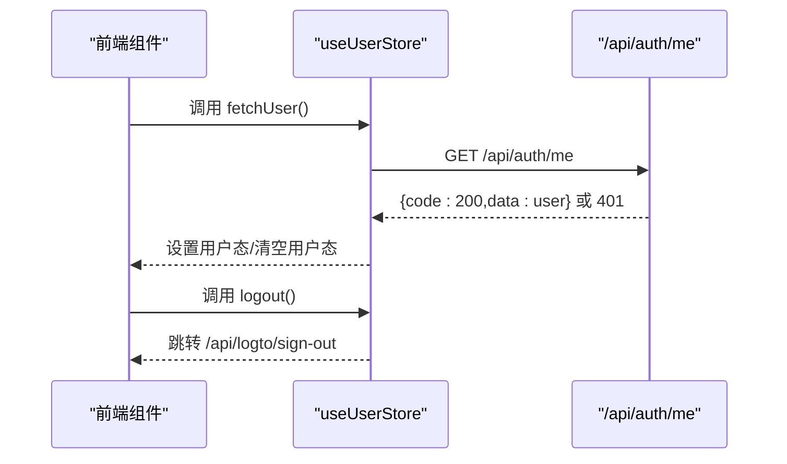
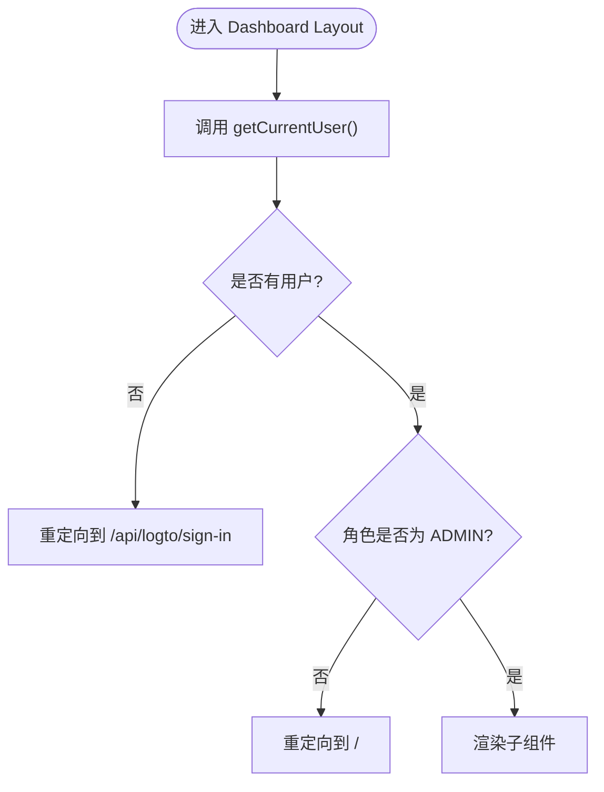
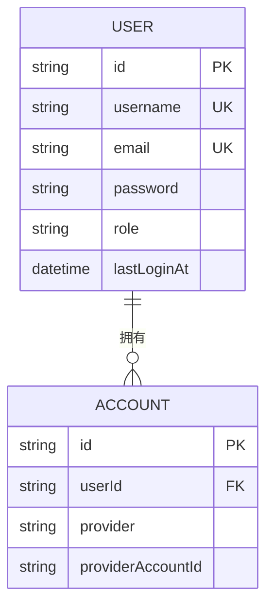
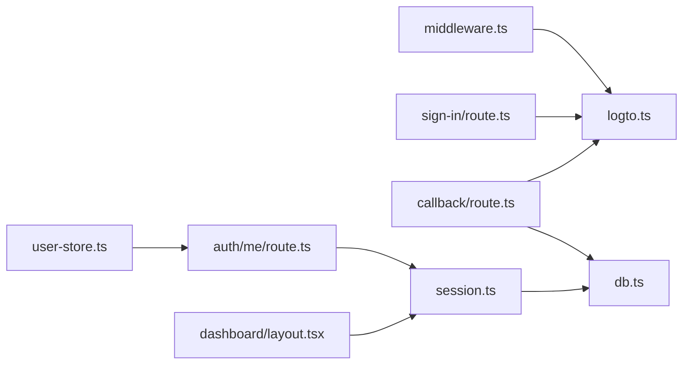

# 认证与授权系统

<cite>
**本文档引用的文件**
- [src/lib/logto.ts](file://src/lib/logto.ts)
- [src/lib/session.ts](file://src/lib/session.ts)
- [src/middleware.ts](file://src/middleware.ts)
- [src/app/api/auth/me/route.ts](file://src/app/api/auth/me/route.ts)
- [src/app/api/logto/sign-in/route.ts](file://src/app/api/logto/sign-in/route.ts)
- [src/app/api/logto/callback/route.ts](file://src/app/api/logto/callback/route.ts)
- [src/app/api/logto/sign-out/route.ts](file://src/app/api/logto/sign-out/route.ts)
- [src/app/(auth)/login/page.tsx](file://src/app/(auth)/login/page.tsx)
- [src/app/(auth)/register/page.tsx](file://src/app/(auth)/register/page.tsx)
- [src/lib/db.ts](file://src/lib/db.ts)
- [prisma/schema.prisma](file://prisma/schema.prisma)
- [src/store/user-store.ts](file://src/store/user-store.ts)
- [src/app/dashboard/layout.tsx](file://src/app/dashboard/layout.tsx)
- [src/app/admin/login/layout.tsx](file://src/app/admin/login/layout.tsx)
- [src/lib/env.ts](file://src/lib/env.ts)
</cite>

## 目录
1. [引言](#引言)
2. [项目结构](#项目结构)
3. [核心组件](#核心组件)
4. [架构总览](#架构总览)
5. [详细组件分析](#详细组件分析)
6. [依赖关系分析](#依赖关系分析)
7. [性能考虑](#性能考虑)
8. [故障排除指南](#故障排除指南)
9. [结论](#结论)
10. [附录](#附录)

## 引言
本文件为“认证与授权系统”的技术文档，聚焦于基于 Logto 的 OAuth 2.0 单点登录（SSO）集成方案与前端会话状态管理。系统采用 Next.js Edge Runtime 中间件进行路由级访问控制，结合服务端动作（Server Actions）完成登录、回调与登出流程；前端通过 Zustand 状态管理拉取当前用户信息并驱动 UI 更新。

系统当前以 Logto OIDC 作为主要认证来源，用户账户模型支持第三方账号绑定与本地账号扩展能力。数据库使用 Prisma ORM，PostgreSQL 作为主数据源。

## 项目结构
认证相关的关键目录与文件如下：
- 配置层：Logto 客户端配置、数据库连接、环境变量封装
- 中间件层：Edge 中间件进行路由保护与重定向
- API 层：OAuth 登录入口、回调处理、用户信息查询、登出
- 前端层：页面跳转至登录、Zustand 用户态管理、仪表盘布局校验
- 数据模型：用户、账号绑定、角色枚举等

**图表来源**
- [src/lib/logto.ts:1-13](file://src/lib/logto.ts#L1-L13)
- [src/middleware.ts:1-36](file://src/middleware.ts#L1-L36)
- [src/app/api/logto/sign-in/route.ts:1-9](file://src/app/api/logto/sign-in/route.ts#L1-L9)
- [src/app/api/logto/callback/route.ts:1-66](file://src/app/api/logto/callback/route.ts#L1-L66)
- [src/app/api/logto/sign-out/route.ts:1-7](file://src/app/api/logto/sign-out/route.ts#L1-L7)
- [src/app/api/auth/me/route.ts:1-13](file://src/app/api/auth/me/route.ts#L1-L13)
- [src/app/(auth)/login/page.tsx:1-6](file://src/app/(auth)/login/page.tsx#L1-L6)
- [src/app/(auth)/register/page.tsx:1-6](file://src/app/(auth)/register/page.tsx#L1-L6)
- [src/store/user-store.ts:1-49](file://src/store/user-store.ts#L1-L49)
- [src/app/dashboard/layout.tsx:1-26](file://src/app/dashboard/layout.tsx#L1-L26)
- [src/lib/db.ts:1-16](file://src/lib/db.ts#L1-L16)
- [prisma/schema.prisma:1-308](file://prisma/schema.prisma#L1-L308)

**章节来源**
- [src/lib/logto.ts:1-13](file://src/lib/logto.ts#L1-L13)
- [src/middleware.ts:1-36](file://src/middleware.ts#L1-L36)
- [src/lib/db.ts:1-16](file://src/lib/db.ts#L1-L16)
- [prisma/schema.prisma:1-308](file://prisma/schema.prisma#L1-L308)

## 核心组件
- Logto 客户端配置：集中定义 endpoint、appId、scopes、baseUrl、cookieSecret、cookieSecure 等参数，确保生产环境启用安全 Cookie。
- 会话上下文与用户模型：通过 React cache 对同一请求内的多次调用进行去重，减少重复校验与数据库查询；返回统一 CurrentUser 接口。
- Edge 中间件：对 /dashboard 与 /admin 路由进行保护，未认证或无 sub 声明时重定向到登录入口。
- API 端点：
  - 登录入口：发起 OIDC 登录并设置回调地址
  - 回调处理：完成登录、创建或更新用户与账号绑定、写入头像与邮箱验证状态
  - 用户信息：返回当前用户信息或 401
  - 登出：清除会话并重定向
- 前端状态：Zustand store 拉取 /api/auth/me，维护认证态与用户信息；登出通过跳转 /api/logto/sign-out 实现。
- 数据模型：User、Account、Role 枚举，支持第三方 provider 绑定与角色控制。

**章节来源**
- [src/lib/logto.ts:1-13](file://src/lib/logto.ts#L1-L13)
- [src/lib/session.ts:1-42](file://src/lib/session.ts#L1-L42)
- [src/middleware.ts:1-36](file://src/middleware.ts#L1-L36)
- [src/app/api/logto/sign-in/route.ts:1-9](file://src/app/api/logto/sign-in/route.ts#L1-L9)
- [src/app/api/logto/callback/route.ts:1-66](file://src/app/api/logto/callback/route.ts#L1-L66)
- [src/app/api/auth/me/route.ts:1-13](file://src/app/api/auth/me/route.ts#L1-L13)
- [src/app/api/logto/sign-out/route.ts:1-7](file://src/app/api/logto/sign-out/route.ts#L1-L7)
- [src/store/user-store.ts:1-49](file://src/store/user-store.ts#L1-L49)
- [prisma/schema.prisma:15-82](file://prisma/schema.prisma#L15-L82)

## 架构总览
下图展示从浏览器到 Logto、再到数据库与前端状态的整体流程：

**图表来源**
- [src/middleware.ts:8-28](file://src/middleware.ts#L8-L28)
- [src/app/api/logto/sign-in/route.ts:6-8](file://src/app/api/logto/sign-in/route.ts#L6-L8)
- [src/app/api/logto/callback/route.ts:10-65](file://src/app/api/logto/callback/route.ts#L10-L65)
- [src/app/api/auth/me/route.ts:4-12](file://src/app/api/auth/me/route.ts#L4-L12)
- [src/store/user-store.ts:26-38](file://src/store/user-store.ts#L26-L38)

## 详细组件分析

### 组件A：Logto 客户端配置与会话上下文
- 配置要点：endpoint、appId、scopes（含 email）、baseUrl、cookieSecret、cookieSecure（生产启用 HTTPS Cookie）
- 会话上下文：getCurrentUser 使用 React cache 去重，先通过 getLogtoContext 获取 claims，再按 providerAccountId 查询 Account 并关联 User，最终返回标准化 CurrentUser

**图表来源**
- [src/lib/session.ts:17-41](file://src/lib/session.ts#L17-L41)

**章节来源**
- [src/lib/logto.ts:3-12](file://src/lib/logto.ts#L3-L12)
- [src/lib/session.ts:17-41](file://src/lib/session.ts#L17-L41)

### 组件B：Edge 中间件与路由保护
- 匹配规则：对 /dashboard 与 /admin 下的路径生效
- 逻辑：若访问 /dashboard 则重定向到 /dashboard/overview；对受保护路径，检查 Logto 上下文，无认证或无 sub 则重定向到 /api/logto/sign-in

**图表来源**
- [src/middleware.ts:8-28](file://src/middleware.ts#L8-L28)

**章节来源**
- [src/middleware.ts:8-28](file://src/middleware.ts#L8-L28)

### 组件C：登录、回调与登出 API
- 登录入口：构造 redirectUri 为 /api/logto/callback，调用 signIn 完成 OIDC 登录
- 回调处理：handleSignIn 完成授权码交换；读取 claims，若无 Account 则创建 User 与 Account；若已有 Account 则更新 lastLoginAt 与头像；最后重定向回首页
- 登出：调用 signOut 清除会话并重定向

**图表来源**
- [src/app/api/logto/sign-in/route.ts:4-8](file://src/app/api/logto/sign-in/route.ts#L4-L8)
- [src/app/api/logto/callback/route.ts:10-65](file://src/app/api/logto/callback/route.ts#L10-L65)

**章节来源**
- [src/app/api/logto/sign-in/route.ts:1-9](file://src/app/api/logto/sign-in/route.ts#L1-L9)
- [src/app/api/logto/callback/route.ts:1-66](file://src/app/api/logto/callback/route.ts#L1-L66)
- [src/app/api/logto/sign-out/route.ts:1-7](file://src/app/api/logto/sign-out/route.ts#L1-L7)

### 组件D：用户信息获取与前端状态管理
- /api/auth/me：调用 getCurrentUser，返回 401 或用户数据
- 前端 store：fetchUser 发起 GET /api/auth/me，成功则设置用户态与认证标志，失败则清空用户态；logout 跳转 /api/logto/sign-out

**图表来源**
- [src/app/api/auth/me/route.ts:4-12](file://src/app/api/auth/me/route.ts#L4-L12)
- [src/store/user-store.ts:26-42](file://src/store/user-store.ts#L26-L42)

**章节来源**
- [src/app/api/auth/me/route.ts:1-13](file://src/app/api/auth/me/route.ts#L1-L13)
- [src/store/user-store.ts:1-49](file://src/store/user-store.ts#L1-L49)

### 组件E：仪表盘与管理员登录
- 仪表盘布局：服务端渲染前调用 getCurrentUser，若无用户则重定向到登录；若用户不是 ADMIN，则重定向到首页
- 管理员登录页布局：提供背景样式与容器结构

**图表来源**
- [src/app/dashboard/layout.tsx:10-18](file://src/app/dashboard/layout.tsx#L10-L18)

**章节来源**
- [src/app/dashboard/layout.tsx:1-26](file://src/app/dashboard/layout.tsx#L1-L26)
- [src/app/admin/login/layout.tsx:1-23](file://src/app/admin/login/layout.tsx#L1-L23)

### 组件F：数据模型与角色权限
- User：包含 username、email、role、lastLoginAt 等字段，支持软删除标记与索引优化
- Account：第三方账号绑定表，唯一约束 (provider, providerAccountId)，外键关联 User
- Role 枚举：USER、ADMIN，用于路由与功能权限控制

**图表来源**
- [prisma/schema.prisma:15-82](file://prisma/schema.prisma#L15-L82)

**章节来源**
- [prisma/schema.prisma:15-82](file://prisma/schema.prisma#L15-L82)

## 依赖关系分析
- 中间件依赖 Logto Edge 客户端与配置
- API 登录/回调/登出依赖 @logto/next 的 server-actions
- 会话上下文依赖 Prisma 查询 User 与 Account
- 前端 store 依赖 /api/auth/me 与 /api/logto/sign-out
- 数据模型由 Prisma schema 定义，数据库连接由 src/lib/db.ts 提供

**图表来源**
- [src/middleware.ts:3-6](file://src/middleware.ts#L3-L6)
- [src/app/api/logto/sign-in/route.ts:1-2](file://src/app/api/logto/sign-in/route.ts#L1-L2)
- [src/app/api/logto/callback/route.ts:2-4](file://src/app/api/logto/callback/route.ts#L2-L4)
- [src/lib/session.ts:2-4](file://src/lib/session.ts#L2-L4)
- [src/lib/db.ts:1-16](file://src/lib/db.ts#L1-L16)
- [src/store/user-store.ts:28](file://src/store/user-store.ts#L28)
- [src/app/dashboard/layout.tsx:10](file://src/app/dashboard/layout.tsx#L10)

**章节来源**
- [src/middleware.ts:1-36](file://src/middleware.ts#L1-L36)
- [src/app/api/logto/sign-in/route.ts:1-9](file://src/app/api/logto/sign-in/route.ts#L1-L9)
- [src/app/api/logto/callback/route.ts:1-66](file://src/app/api/logto/callback/route.ts#L1-L66)
- [src/lib/session.ts:1-42](file://src/lib/session.ts#L1-L42)
- [src/lib/db.ts:1-16](file://src/lib/db.ts#L1-L16)
- [src/store/user-store.ts:1-49](file://src/store/user-store.ts#L1-L49)
- [src/app/dashboard/layout.tsx:1-26](file://src/app/dashboard/layout.tsx#L1-L26)

## 性能考虑
- 请求级缓存：getCurrentUser 使用 React cache 对同一请求内的多次调用去重，避免重复的 Logto 校验与数据库查询
- 关联查询优化：Prisma 使用 relationJoins 预连接关联数据，减少往返次数
- 日志级别：开发环境开启 query/error/warn，生产仅记录错误，降低日志开销
- Cookie 安全：生产环境启用 secure Cookie，减少不必要的网络传输风险

**章节来源**
- [src/lib/session.ts:15-17](file://src/lib/session.ts#L15-L17)
- [prisma/schema.prisma:1-5](file://prisma/schema.prisma#L1-L5)
- [src/lib/db.ts:8](file://src/lib/db.ts#L8)
- [src/lib/logto.ts:11](file://src/lib/logto.ts#L11)

## 故障排除指南
- 未登录访问受保护路由
  - 现象：被中间件重定向到 /api/logto/sign-in
  - 排查：确认浏览器 Cookie 是否正确设置，检查 cookieSecure 与 baseUrl 配置
- 回调后无法获取用户信息
  - 现象：/api/auth/me 返回 401
  - 排查：确认回调已正确创建 User/Account，检查 claims 中是否存在 sub
- 登录后未写入头像或邮箱验证
  - 现象：用户头像为空或邮箱未验证
  - 排查：确认回调中 picture 与 email 是否存在，检查回调逻辑是否执行更新
- 管理员页面访问受限
  - 现象：非 ADMIN 用户被重定向到首页
  - 排查：确认 User.role 是否为 ADMIN，数据库中是否正确设置

**章节来源**
- [src/middleware.ts:21-25](file://src/middleware.ts#L21-L25)
- [src/app/api/auth/me/route.ts:7-9](file://src/app/api/auth/me/route.ts#L7-L9)
- [src/app/api/logto/callback/route.ts:19-62](file://src/app/api/logto/callback/route.ts#L19-L62)
- [src/app/dashboard/layout.tsx:16-18](file://src/app/dashboard/layout.tsx#L16-L18)

## 结论
本系统采用 Logto OIDC 作为统一身份源，结合 Edge 中间件与服务端动作实现安全的路由级访问控制与会话管理。前端通过 Zustand 管理用户态，API 提供标准的认证与用户信息查询端点。数据模型清晰支持第三方账号绑定与角色权限控制。整体设计具备良好的可扩展性与安全性基础。

## 附录

### API 接口文档
- GET /api/logto/sign-in
  - 功能：发起 OIDC 登录，重定向至 Logto 授权页
  - 参数：无
  - 返回：302 重定向
- GET /api/logto/callback
  - 功能：处理回调，创建/更新用户与账号绑定，重定向回首页
  - 参数：无
  - 返回：302 重定向
- GET /api/logto/sign-out
  - 功能：登出，清除会话
  - 参数：无
  - 返回：302 重定向
- GET /api/auth/me
  - 功能：获取当前用户信息
  - 参数：无
  - 返回：200 成功（{ code: 200, data: 用户信息 }）或 401 未登录

**章节来源**
- [src/app/api/logto/sign-in/route.ts:6-8](file://src/app/api/logto/sign-in/route.ts#L6-L8)
- [src/app/api/logto/callback/route.ts:10-65](file://src/app/api/logto/callback/route.ts#L10-L65)
- [src/app/api/logto/sign-out/route.ts:4-6](file://src/app/api/logto/sign-out/route.ts#L4-L6)
- [src/app/api/auth/me/route.ts:4-12](file://src/app/api/auth/me/route.ts#L4-L12)

### 安全最佳实践
- 生产环境启用 secure Cookie（cookieSecure=true），并确保 baseUrl 与 endpoint 使用 HTTPS
- 严格限制 scopes，当前仅包含 email，按需扩展
- 在中间件与服务端动作中始终校验 context.isAuthenticated 与 claims.sub
- 对敏感操作（如管理后台）增加角色校验（ADMIN）

**章节来源**
- [src/lib/logto.ts:11](file://src/lib/logto.ts#L11)
- [src/middleware.ts:21-25](file://src/middleware.ts#L21-L25)
- [src/app/dashboard/layout.tsx:16-18](file://src/app/dashboard/layout.tsx#L16-L18)