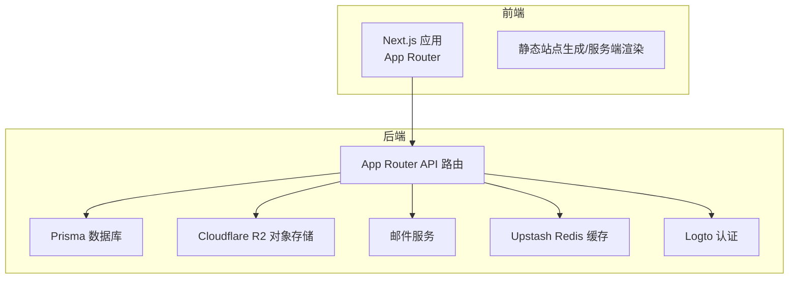
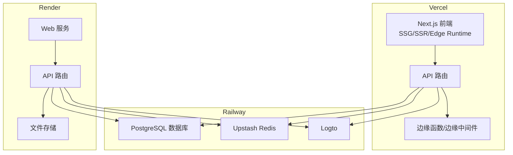
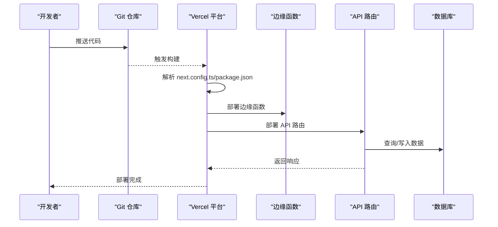
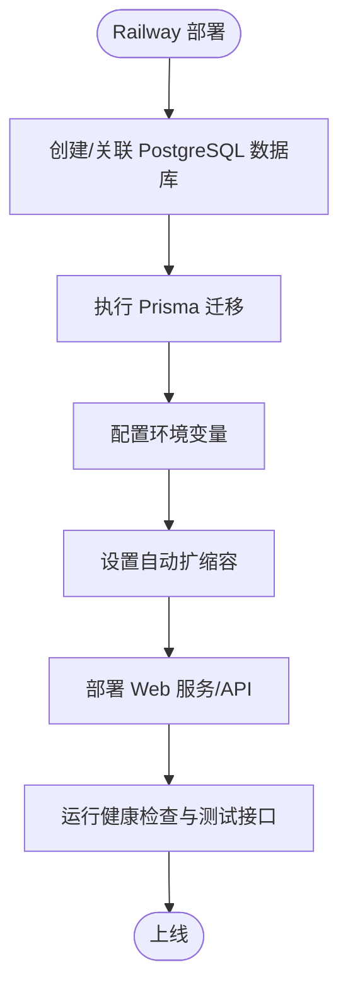
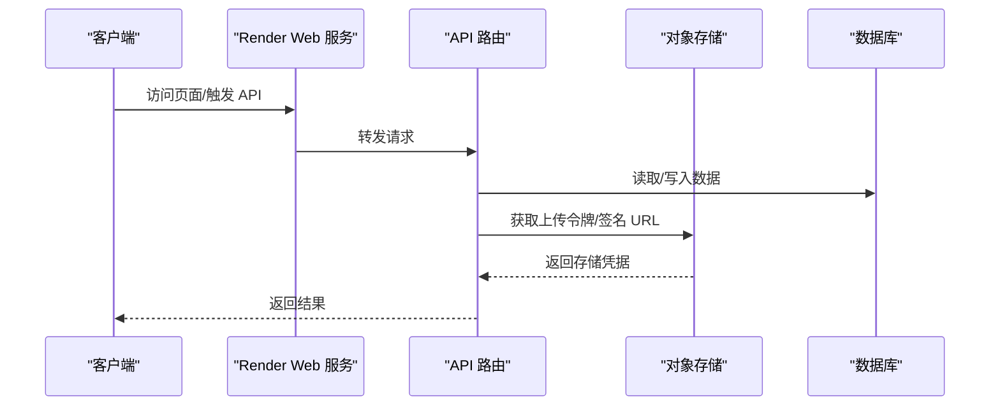
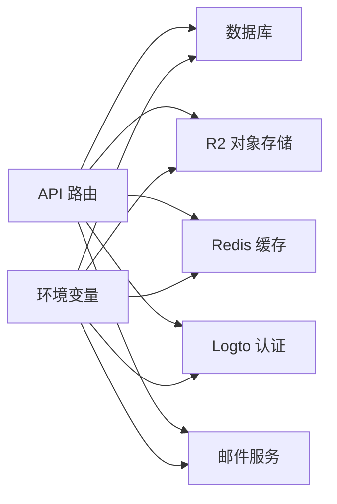

# 云平台部署

<cite>
**本文引用的文件**
- [README.md](file://README.md)
- [package.json](file://package.json)
- [next.config.ts](file://next.config.ts)
- [src/lib/env.ts](file://src/lib/env.ts)
- [src/middleware.ts](file://src/middleware.ts)
- [prisma/schema.prisma](file://prisma/schema.prisma)
- [prisma/migrations/20260122003154_add_miss_table/migration.sql](file://prisma/migrations/20260122003154_add_miss_table/migration.sql)
- [prisma/migrations/20260122005608_add_site_visit/migration.sql](file://prisma/migrations/20260122005608_add_site_visit/migration.sql)
- [prisma/migrations/20260201111652_fix_timezone/migration.sql](file://prisma/migrations/20260201111652_fix_timezone/migration.sql)
- [prisma/migrations/20260202122338_add_email_log_table/migration.sql](file://prisma/migrations/20260202122338_add_email_log_table/migration.sql)
- [src/app/api/analytics/track/route.ts](file://src/app/api/analytics/track/route.ts)
- [src/app/api/upload/r2/token/route.ts](file://src/app/api/upload/r2/token/route.ts)
- [src/app/api/upload/r2/upload/route.ts](file://src/app/api/upload/r2/upload/route.ts)
- [src/app/api/upload/r2/url/route.ts](file://src/app/api/upload/r2/url/route.ts)
- [src/lib/r2.ts](file://src/lib/r2.ts)
- [src/lib/email-service.ts](file://src/lib/email-service.ts)
- [src/lib/db.ts](file://src/lib/db.ts)
- [src/lib/upstash-redis.ts](file://src/lib/upstash-redis.ts)
- [src/lib/logto.ts](file://src/lib/logto.ts)
- [src/app/api/send/route.ts](file://src/app/api/send/route.ts)
- [src/app/api/test-db/route.ts](file://src/app/api/test-db/route.ts)
- [src/app/api/test-mail/route.ts](file://src/app/api/test-mail/route.ts)
- [src/app/api/test-friend-email/route.ts](file://src/app/api/test-friend-email/route.ts)
- [src/app/api/test-prisma-standard/route.ts](file://src/app/api/test-prisma-standard/route.ts)
- [src/app/api/test-tencent-translate/route.ts](file://src/app/api/test-tencent-translate/route.ts)
- [scripts/set-db-timezone.ts](file://scripts/set-db-timezone.ts)
- [scripts/test-prisma-standard.ts](file://scripts/test-prisma-standard.ts)
- [scripts/test-mailer.ts](file://scripts/test-mailer.ts)
- [scripts/test-tencent-translate.js](file://scripts/test-tencent-translate.js)
</cite>

## 目录
1. [简介](#简介)
2. [项目结构](#项目结构)
3. [核心组件](#核心组件)
4. [架构总览](#架构总览)
5. [详细组件分析](#详细组件分析)
6. [依赖关系分析](#依赖关系分析)
7. [性能考量](#性能考量)
8. [故障排查指南](#故障排查指南)
9. [结论](#结论)
10. [附录](#附录)

## 简介
本指南面向多云平台部署场景，围绕 Vercel、Railway、Render 三大平台，结合本项目的 Next.js 应用与 Prisma 数据库架构，给出可操作的部署配置要点、平台特性适配、性能对比与选型建议、成本控制策略以及跨平台一致性与迁移方案。文档内容严格基于仓库中的配置文件与源码实现进行提炼与总结。

## 项目结构
本项目为基于 Next.js App Router 的全栈应用，前端采用静态站点生成（SSG）与服务端渲染（SSR），后端通过 App Router 的 API 路由提供服务；数据层使用 Prisma 连接数据库，并通过 R2 提供对象存储能力；认证与会话通过 Logto 集成；邮件发送通过外部服务实现；缓存使用 Upstash Redis。

**章节来源**
- [README.md](file://README.md)
- [package.json](file://package.json)
- [next.config.ts](file://next.config.ts)

## 核心组件
- 前端框架与构建：Next.js App Router，支持 SSG/SSR，具备边缘计算能力（Edge Runtime）。
- 数据访问：Prisma 客户端通过连接字符串访问数据库。
- 存储：Cloudflare R2 用于文件上传与访问。
- 认证：Logto 提供登录与会话管理。
- 邮件：通过外部邮件服务发送通知。
- 缓存：Upstash Redis 提供键值缓存。
- 中间件：统一处理请求与路由逻辑。

**章节来源**
- [src/lib/db.ts](file://src/lib/db.ts)
- [src/lib/r2.ts](file://src/lib/r2.ts)
- [src/lib/logto.ts](file://src/lib/logto.ts)
- [src/lib/email-service.ts](file://src/lib/email-service.ts)
- [src/lib/upstash-redis.ts](file://src/lib/upstash-redis.ts)
- [src/middleware.ts](file://src/middleware.ts)

## 架构总览
下图展示了应用在三大平台上的部署视图与数据流：

## 详细组件分析

### Vercel 平台部署配置
- 静态站点生成与服务端渲染
  - 使用 Next.js App Router 的页面与 API 路由，可在 Vercel 上直接部署，自动识别构建命令与输出目录。
  - 建议启用 ISR（增量静态再生）以提升性能，结合边缘缓存减少数据库压力。
- 边缘计算
  - 利用 Edge Runtime 执行轻量逻辑（如鉴权校验、简单重定向、统计埋点等），降低主服务器负载。
  - 将对数据库与外部服务的高延迟调用移出边缘，避免超时与冷启动问题。
- 自动部署触发
  - 通过 Git 推送触发 Vercel 自动构建与部署，确保开发到上线的快速闭环。
  - 在 Vercel 项目中配置环境变量与构建参数，确保生产一致性。

**章节来源**
- [next.config.ts](file://next.config.ts)
- [package.json](file://package.json)
- [src/middleware.ts](file://src/middleware.ts)
- [src/app/api/analytics/track/route.ts](file://src/app/api/analytics/track/route.ts)

### Railway 平台部署配置
- 数据库集成
  - 使用 Prisma 管理数据库模式与迁移，支持 PostgreSQL。在 Railway 上创建数据库实例后，将连接字符串注入环境变量。
  - 建议开启自动备份与只读副本，保障高可用与灾备。
- 环境变量管理
  - 在 Railway 仪表板中配置 DATABASE_URL、LOGTO_ENDPOINT、LOGTO_APP_ID、LOGTO_APP_SECRET、UPSTASH_REDIS_REST_URL、UPSTASH_REDIS_REST_TOKEN、R2_* 等关键变量。
  - 使用分组与密钥轮换机制，定期更新敏感信息。
- 自动扩缩容
  - 根据流量与数据库负载设置 CPU/内存规格与副本数，启用自动扩缩容策略，避免高峰期拥塞与低峰期浪费。
- 与应用集成
  - Railway Web 服务与 Worker 可分别承载前端与 API；API 路由通过环境变量访问数据库、Redis、R2 与 Logto。

**章节来源**
- [prisma/schema.prisma](file://prisma/schema.prisma)
- [prisma/migrations/20260122003154_add_miss_table/migration.sql](file://prisma/migrations/20260122003154_add_miss_table/migration.sql)
- [prisma/migrations/20260122005608_add_site_visit/migration.sql](file://prisma/migrations/20260122005608_add_site_visit/migration.sql)
- [prisma/migrations/20260201111652_fix_timezone/migration.sql](file://prisma/migrations/20260201111652_fix_timezone/migration.sql)
- [prisma/migrations/20260202122338_add_email_log_table/migration.sql](file://prisma/migrations/20260202122338_add_email_log_table/migration.sql)
- [src/lib/db.ts](file://src/lib/db.ts)
- [src/lib/env.ts](file://src/lib/env.ts)

### Render 平台部署配置
- Web 服务配置
  - 使用 Next.js 构建产物作为静态资源或 SSR 服务，配合 API 路由提供后端能力。
  - 在 Render 中配置构建脚本与运行时参数，确保与本地一致。
- 数据库连接
  - 通过 DATABASE_URL 连接 Render 托管的数据库（如 PostgreSQL）。Prisma 将负责模式同步与迁移。
- 文件存储
  - 使用 Cloudflare R2 或 Render 的对象存储服务，API 路由提供上传令牌、签名 URL 与直传接口。

**章节来源**
- [src/app/api/upload/r2/token/route.ts](file://src/app/api/upload/r2/token/route.ts)
- [src/app/api/upload/r2/upload/route.ts](file://src/app/api/upload/r2/upload/route.ts)
- [src/app/api/upload/r2/url/route.ts](file://src/app/api/upload/r2/url/route.ts)
- [src/lib/r2.ts](file://src/lib/r2.ts)
- [src/lib/db.ts](file://src/lib/db.ts)

### 平台特定优化与成本控制
- Vercel
  - 启用边缘缓存与预取，减少数据库与外部服务调用。
  - 使用边缘函数处理鉴权与轻量逻辑，避免不必要的主服务开销。
  - 通过分阶段发布与灰度流量控制，降低变更风险。
- Railway
  - 使用只读副本分流查询，主库专注写入。
  - 合理设置 Redis 缓存命中率，避免热点键导致的抖动。
  - 按需调整数据库与 Redis 实例规格，避免过度配置。
- Render
  - 使用 CDN 加速静态资源与图片，降低带宽成本。
  - 对高频 API 做缓存与限流，防止突发流量压垮后端。
  - 对象存储采用分层存储策略，冷数据降级至低成本存储。

### 性能对比与选择建议
- Vercel：适合以静态与边缘计算为主的现代 Web 应用，部署与扩缩容自动化程度高，边缘网络覆盖广。
- Railway：适合需要强数据库集成与一体化运维的团队，提供完整的 Postgres、Redis、认证与对象存储生态。
- Render：适合需要灵活 Web 服务与对象存储的场景，部署门槛低，适合中小型团队快速迭代。

### 跨平台一致性保证与迁移方案
- 一致性保证
  - 统一环境变量命名与加载方式，确保不同平台行为一致。
  - 将数据库迁移与模式管理集中于 Prisma，避免平台差异带来的不一致。
  - 使用中间件统一处理鉴权与日志，减少平台差异对业务逻辑的影响。
- 迁移方案
  - 先在目标平台创建数据库与对象存储实例，导出/导入数据，验证 API 与前端构建。
  - 逐步切换域名与 DNS，保留回滚分支，确保平滑过渡。
  - 迁移后进行全面回归测试，包括数据库连通性、缓存命中、邮件发送与文件上传。

**章节来源**
- [src/lib/env.ts](file://src/lib/env.ts)
- [src/middleware.ts](file://src/middleware.ts)
- [prisma/schema.prisma](file://prisma/schema.prisma)

## 依赖关系分析
- 外部依赖
  - Next.js 生态（App Router、Edge Runtime）
  - Prisma（数据库 ORM 与迁移）
  - Cloudflare R2（对象存储）
  - Upstash Redis（缓存）
  - Logto（认证）
  - 邮件服务（外部 SMTP/第三方）
- 内部模块耦合
  - API 路由依赖数据库、缓存、存储与认证模块。
  - 中间件贯穿请求生命周期，影响所有路由。

**章节来源**
- [src/lib/db.ts](file://src/lib/db.ts)
- [src/lib/r2.ts](file://src/lib/r2.ts)
- [src/lib/upstash-redis.ts](file://src/lib/upstash-redis.ts)
- [src/lib/logto.ts](file://src/lib/logto.ts)
- [src/lib/email-service.ts](file://src/lib/email-service.ts)
- [src/lib/env.ts](file://src/lib/env.ts)

## 性能考量
- 数据库
  - 使用连接池与只读副本分流查询，避免单点瓶颈。
  - 对热点表建立合适索引，定期分析慢查询。
- 缓存
  - 合理设置 TTL 与失效策略，避免缓存穿透与雪崩。
  - 对频繁读取的数据进行预热，提升首屏性能。
- 存储
  - 对大文件采用 CDN 与分片上传，降低传输时间。
  - 使用签名 URL 与短时效令牌，平衡安全与性能。
- 认证
  - 将鉴权逻辑下沉至边缘或中间件，减少 API 层重复校验。
  - 对 Token 进行合理缓存与刷新策略，避免频繁往返认证服务。

## 故障排查指南
- 数据库连通性
  - 通过测试接口验证数据库连接，确认连接字符串与网络策略。
  - 关注迁移失败与锁等待，必要时回滚到上一个稳定版本。
- 缓存异常
  - 检查 Redis 连接参数与容量，观察命中率与过期策略。
  - 对热点键做隔离与降级，避免级联故障。
- 对象存储
  - 校验 R2 凭据与桶权限，确认签名 URL 生成逻辑。
  - 对上传失败进行重试与断点续传，记录错误日志。
- 邮件发送
  - 校验邮件服务凭据与模板，关注退信与限流。
  - 对批量发送做速率限制与去重，避免被标记为垃圾邮件。
- 认证与会话
  - 校验 Logto 配置与回调地址，确认 Token 生命周期。
  - 对会话异常进行强制刷新与清理，避免状态不一致。

**章节来源**
- [src/app/api/test-db/route.ts](file://src/app/api/test-db/route.ts)
- [src/app/api/test-mail/route.ts](file://src/app/api/test-mail/route.ts)
- [src/app/api/test-friend-email/route.ts](file://src/app/api/test-friend-email/route.ts)
- [src/app/api/test-prisma-standard/route.ts](file://src/app/api/test-prisma-standard/route.ts)
- [src/app/api/test-tencent-translate/route.ts](file://src/app/api/test-tencent-translate/route.ts)
- [scripts/set-db-timezone.ts](file://scripts/set-db-timezone.ts)
- [scripts/test-prisma-standard.ts](file://scripts/test-prisma-standard.ts)
- [scripts/test-mailer.ts](file://scripts/test-mailer.ts)
- [scripts/test-tencent-translate.js](file://scripts/test-tencent-translate.js)

## 结论
本项目具备良好的多云部署基础：前端与 API 路由清晰分离，数据层通过 Prisma 统一管理，存储与缓存采用业界标准方案。在 Vercel、Railway、Render 三类平台上均可实现高效部署与运维。建议优先在 Vercel 上实现边缘化与高并发，Railway 上强化数据库与缓存治理，Render 上聚焦 Web 服务与对象存储的灵活性。通过统一的环境变量、中间件与测试流程，确保跨平台一致性与可迁移性。

## 附录
- 关键配置文件路径
  - 构建与运行：[package.json](file://package.json)，[next.config.ts](file://next.config.ts)
  - 环境变量：[src/lib/env.ts](file://src/lib/env.ts)
  - 中间件：[src/middleware.ts](file://src/middleware.ts)
  - 数据库与迁移：[prisma/schema.prisma](file://prisma/schema.prisma)，[prisma/migrations/*](file://prisma/migrations/)
  - API 示例：[src/app/api/analytics/track/route.ts](file://src/app/api/analytics/track/route.ts)，[src/app/api/upload/r2/*](file://src/app/api/upload/r2/)
  - 工具脚本：[scripts/set-db-timezone.ts](file://scripts/set-db-timezone.ts)，[scripts/test-prisma-standard.ts](file://scripts/test-prisma-standard.ts)，[scripts/test-mailer.ts](file://scripts/test-mailer.ts)，[scripts/test-tencent-translate.js](file://scripts/test-tencent-translate.js)