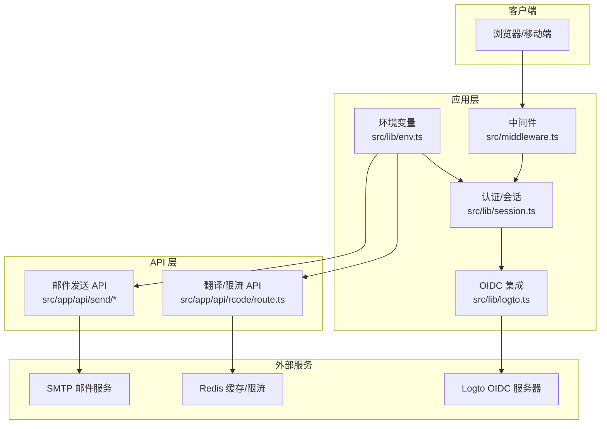
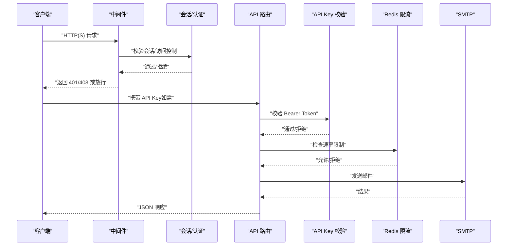
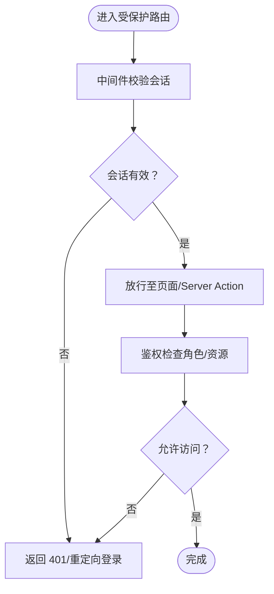
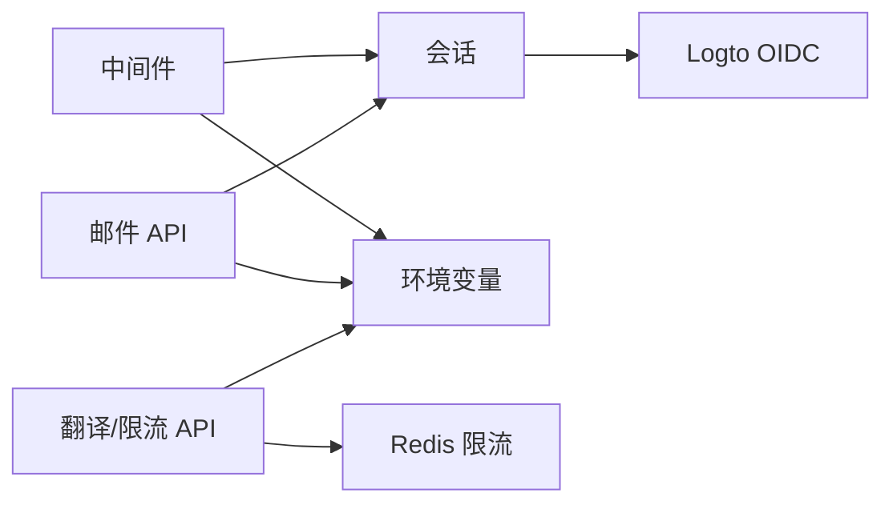

# 安全加固

<cite>
**本文引用的文件**
- [src/middleware.ts](file://src/middleware.ts)
- [src/lib/session.ts](file://src/lib/session.ts)
- [src/lib/logto.ts](file://src/lib/logto.ts)
- [src/lib/env.ts](file://src/lib/env.ts)
- [src/lib/api-key.ts](file://src/lib/api-key.ts)
- [src/app/(auth)/layout.tsx](file://src/app/(auth)/layout.tsx)
- [src/app/api/rcode/route.ts](file://src/app/api/rcode/route.ts)
- [src/app/api/send/route.ts](file://src/app/api/send/route.ts)
- [src/app/api/send/verification-code/route.ts](file://src/app/api/send/verification-code/route.ts)
- [src/app/api/send/notification/route.ts](file://src/app/api/send/notification/route.ts)
- [src/lib/mailer.ts](file://src/lib/mailer.ts)
- [.agents/skills/vercel-react-best-practices/rules/server-auth-actions.md](file://.agents/skills/vercel-react-best-practices/rules/server-auth-actions.md)
</cite>

## 目录
1. [引言](#引言)
2. [项目结构](#项目结构)
3. [核心组件](#核心组件)
4. [架构总览](#架构总览)
5. [详细组件分析](#详细组件分析)
6. [依赖关系分析](#依赖关系分析)
7. [性能与安全权衡](#性能与安全权衡)
8. [故障排查指南](#故障排查指南)
9. [结论](#结论)
10. [附录](#附录)

## 引言
本指南面向“安全加固”的目标，结合仓库现有实现，系统性梳理并扩展以下方面：HTTPS与证书管理（含Let’s Encrypt自动续期建议）、HSTS头设置、Web应用防火墙（WAF）与DDoS防护、身份认证与授权强化（多因素认证、会话管理、权限控制）、数据加密与隐私保护、安全审计与漏洞扫描、安全事件响应与应急处理、供应链安全与依赖包管理。对于当前代码库尚未覆盖的部分，本指南提供可落地的实施建议与最佳实践。

## 项目结构
本项目采用 Next.js App Router 架构，前端与后端逻辑分层清晰：认证与会话管理位于 lib 层；API 路由集中于 src/app/api；仪表盘与后台管理位于 src/app/dashboard；认证页面位于 src/app/(auth)。中间件用于全局安全控制，如会话校验与访问控制。

图示来源
- [src/middleware.ts](file://src/middleware.ts)
- [src/lib/session.ts](file://src/lib/session.ts)
- [src/lib/logto.ts](file://src/lib/logto.ts)
- [src/lib/env.ts](file://src/lib/env.ts)
- [src/app/api/send/route.ts](file://src/app/api/send/route.ts)
- [src/app/api/rcode/route.ts](file://src/app/api/rcode/route.ts)

章节来源
- [src/middleware.ts](file://src/middleware.ts)
- [src/lib/session.ts](file://src/lib/session.ts)
- [src/lib/logto.ts](file://src/lib/logto.ts)
- [src/lib/env.ts](file://src/lib/env.ts)
- [src/app/api/send/route.ts](file://src/app/api/send/route.ts)
- [src/app/api/rcode/route.ts](file://src/app/api/rcode/route.ts)

## 核心组件
- 中间件与全局安全控制：负责统一的会话校验、访问控制与安全头注入。
- 认证与会话：基于会话的用户态管理，支持 OIDC（Logto）集成。
- API 认证：Open API Key 认证工具，支持多密钥轮换与快速校验。
- 邮件发送与日志：统一的邮件发送能力与发送日志记录，便于审计与重试。
- 速率限制：基于 Redis 的简单限流脚本，缓解滥用与暴力尝试。
- 前端认证页展示：认证页面布局中包含“HTTPS”等安全提示元素。

章节来源
- [src/middleware.ts](file://src/middleware.ts)
- [src/lib/session.ts](file://src/lib/session.ts)
- [src/lib/logto.ts](file://src/lib/logto.ts)
- [src/lib/api-key.ts](file://src/lib/api-key.ts)
- [src/app/api/send/route.ts](file://src/app/api/send/route.ts)
- [src/app/api/rcode/route.ts](file://src/app/api/rcode/route.ts)
- [src/app/(auth)/layout.tsx](file://src/app/(auth)/layout.tsx)

## 架构总览
下图展示了从客户端到后端 API 的典型请求路径，以及关键的安全控制点（会话校验、API Key 校验、速率限制、邮件发送与日志）。

图示来源
- [src/middleware.ts](file://src/middleware.ts)
- [src/lib/session.ts](file://src/lib/session.ts)
- [src/lib/api-key.ts](file://src/lib/api-key.ts)
- [src/app/api/rcode/route.ts](file://src/app/api/rcode/route.ts)
- [src/app/api/send/route.ts](file://src/app/api/send/route.ts)
- [src/lib/mailer.ts](file://src/lib/mailer.ts)

## 详细组件分析

### HTTPS 配置与 SSL 证书管理
- 当前前端认证页布局中包含“HTTPS”“端口 8443”等安全提示元素，体现对 HTTPS 的重视。
- 实施建议（概念性说明，非仓库现有实现）：
  - 使用反向代理或平台托管（如 Vercel/AWS CloudFront）终止 TLS，并在边缘启用 HSTS。
  - Let’s Encrypt 自动续期：通过 cron 定时执行 certbot renew 并触发 Nginx/Apache 重载；容器化部署可用 acme-dns 与 docker 容器自动续期。
  - 证书存放与权限：仅授予运行用户读权限；禁用组与其他写权限；定期轮换私钥。
  - 多域名与 SAN：在申请时一次性包含主域名与 www、子域，减少遗漏。
  - 证书监控告警：对到期时间、签发者变更、链路完整性进行监控。

章节来源
- [src/app/(auth)/layout.tsx](file://src/app/(auth)/layout.tsx)

### HSTS 头设置
- 在反向代理或边缘网关设置 Strict-Transport-Security 头，推荐值：max-age=63072000; includeSubDomains; preload（如满足条件）。
- 同步设置：preload 提交、预加载白名单、HSTS 预加载状态监控。

[本节为通用实践说明，不直接分析具体文件]

### Web 应用防火墙（WAF）与 DDoS 防护
- WAF 建议：
  - 规则集：OWASP Top 10、自定义业务规则（如异常字段类型、长度、字符集）。
  - 动态阈值：根据业务流量基线动态调整阻断阈值，避免误伤正常用户。
  - 白名单/灰名单：对可信 IP、CDN、监控系统开放白名单。
- DDoS 防护：
  - 清洗：使用云厂商或第三方清洗服务，开启弹性带宽扩容。
  - 限流：边缘限流（QPS/IP/URI 维度）+ 应用层限流（令牌桶/漏桶）。
  - 缓存与静态资源：最大化 CDN 缓存命中，降低源站压力。
  - 健康检查与自动切换：多机房/多可用区，异常自动切换。

[本节为通用实践说明，不直接分析具体文件]

### 身份认证与授权强化
- 会话管理：
  - 使用安全的 HttpOnly、SameSite、Secure Cookie；短生命周期 + 动态刷新；强制重新认证高风险操作。
  - 服务端会话存储：Redis/Memcached，开启 TLS 与访问控制；定期清理过期会话。
- 多因素认证（MFA）：
  - 推荐 TOTP（基于时间的一次性密码）或短信/邮件验证码；高危操作强制二次确认。
- 权限控制：
  - RBAC/ABAC：最小权限原则；操作粒度细到资源级；审计日志记录关键动作。
- 会话校验与 API 访问：
  - 中间件统一校验；Server Actions 必须在函数内再次校验（参考最佳实践文档）。
  - Open API Key：支持多密钥轮换，快速比对，避免查库开销。

图示来源
- [src/middleware.ts](file://src/middleware.ts)
- [src/lib/session.ts](file://src/lib/session.ts)
- [.agents/skills/vercel-react-best-practices/rules/server-auth-actions.md](file://.agents/skills/vercel-react-best-practices/rules/server-auth-actions.md)

章节来源
- [src/middleware.ts](file://src/middleware.ts)
- [src/lib/session.ts](file://src/lib/session.ts)
- [src/lib/api-key.ts](file://src/lib/api-key.ts)
- [.agents/skills/vercel-react-best-practices/rules/server-auth-actions.md](file://.agents/skills/vercel-react-best-practices/rules/server-auth-actions.md)

### 数据加密与隐私保护
- 传输加密：TLS 1.2+/1.3，禁用弱套件；证书链完整。
- 存储加密：敏感字段 AES-256 加密；密钥轮换与 KMS 管理。
- 隐私保护：最小化收集；匿名化/去标识化；用户权利（访问、更正、删除、限制处理）实现。
- 日志脱敏：避免记录明文敏感信息；必要时使用哈希或掩码。

[本节为通用实践说明，不直接分析具体文件]

### 安全审计与漏洞扫描
- 定期扫描：
  - SAST：TypeScript/JS 代码静态分析，识别硬编码密钥、不安全调用。
  - DAST：自动化渗透测试，覆盖常见漏洞（XSS、CSRF、SQL 注入、未授权等）。
  - IAST：在测试/预生产环境注入探针，实时检测。
- 日志与告警：
  - 审计日志：登录、权限变更、高危操作、异常访问。
  - SIEM 集成：统一采集、关联分析、告警联动。
- 合规检查：SOC 2、GDPR、网络安全法等合规要求映射。

[本节为通用实践说明，不直接分析具体文件]

### 安全事件响应与应急处理
- 响应流程：
  - 事件发现与分级；快速隔离；根因分析；修复与验证；复盘与改进。
- 应急预案：
  - 证书吊销与续期；数据库回滚；服务降级；备份恢复；媒体沟通。
- 工具与演练：红蓝对抗、攻防演练、自动化处置脚本。

[本节为通用实践说明，不直接分析具体文件]

### 供应链安全与依赖包管理
- 依赖治理：
  - 锁定版本与 SBOM；定期更新与漏洞扫描；镜像与构建缓存安全。
- 供应链攻击防护：
  - 代码签名与完整性校验；CI/CD 环节加入安全检查；最小权限原则。
- 工具与策略：
  - 使用 Dependabot/Snyk/GitHub Security Alerts；建立“白名单/黑名单”机制。

[本节为通用实践说明，不直接分析具体文件]

## 依赖关系分析
- 中间件依赖会话与环境变量，决定全局访问控制与安全头注入。
- API 路由依赖会话校验与 API Key 校验；部分路由还依赖 Redis 限流与 SMTP。
- 认证模块依赖 Logto OIDC 服务，实现单点登录与用户信息拉取。

图示来源
- [src/middleware.ts](file://src/middleware.ts)
- [src/lib/session.ts](file://src/lib/session.ts)
- [src/lib/logto.ts](file://src/lib/logto.ts)
- [src/lib/env.ts](file://src/lib/env.ts)
- [src/app/api/send/route.ts](file://src/app/api/send/route.ts)
- [src/app/api/rcode/route.ts](file://src/app/api/rcode/route.ts)

章节来源
- [src/middleware.ts](file://src/middleware.ts)
- [src/lib/session.ts](file://src/lib/session.ts)
- [src/lib/logto.ts](file://src/lib/logto.ts)
- [src/lib/env.ts](file://src/lib/env.ts)
- [src/app/api/send/route.ts](file://src/app/api/send/route.ts)
- [src/app/api/rcode/route.ts](file://src/app/api/rcode/route.ts)

## 性能与安全权衡
- 会话与鉴权：尽量在中间件与服务端完成，避免在客户端存储敏感信息。
- 速率限制：边缘优先，应用层兜底；避免过度限制影响用户体验。
- 邮件发送：异步队列与重试机制，失败日志与告警，防止阻塞请求。
- Server Actions：严格鉴权与输入校验，避免成为绕过中间件的后门。

[本节为通用实践说明，不直接分析具体文件]

## 故障排查指南
- 会话/登录问题：
  - 检查 Cookie 设置（Secure、HttpOnly、SameSite、Domain/Path）；确认会话存储可用。
  - 查看中间件日志与 OIDC 回调状态。
- API 认证失败：
  - 校验 Authorization 头格式与 API Key 是否在有效列表；确认环境变量配置正确。
- 邮件发送失败：
  - 检查 SMTP 配置与凭据；查看发送日志与失败重试；关注第三方服务配额限制。
- 速率限制触发：
  - 检查 Redis 连接与限流脚本；核对 IP 归属与业务流量峰值。

章节来源
- [src/lib/session.ts](file://src/lib/session.ts)
- [src/lib/api-key.ts](file://src/lib/api-key.ts)
- [src/app/api/send/route.ts](file://src/app/api/send/route.ts)
- [src/app/api/rcode/route.ts](file://src/app/api/rcode/route.ts)
- [src/lib/mailer.ts](file://src/lib/mailer.ts)

## 结论
本项目已在会话管理、API 认证、邮件发送与限流等方面具备基础安全能力。建议在此基础上补充：HTTPS 与证书自动化运维、HSTS 头、WAF/DDoS 防护、MFA、完善的权限模型、数据加密与隐私保护、持续的安全审计与漏洞扫描、事件响应预案与供应链安全。通过“安全左移”与“自动化安全”，持续提升整体安全韧性。

## 附录

### HTTPS 与证书管理（建议清单）
- 使用反向代理/边缘终止 TLS，启用 HSTS。
- Let’s Encrypt 自动续期：定时任务 + 服务重载。
- 证书与私钥权限最小化；定期轮换；监控链路完整性。
- 多域名与 SAN 证书；预加载准备。

章节来源
- [src/app/(auth)/layout.tsx](file://src/app/(auth)/layout.tsx)

### API 认证与鉴权（要点）
- Open API Key：多密钥轮换，快速比对，拒绝无效格式。
- Server Actions：必须在函数内再次校验会话与权限。
- 输入校验：先校验再鉴权再授权，最后执行业务。

章节来源
- [src/lib/api-key.ts](file://src/lib/api-key.ts)
- [.agents/skills/vercel-react-best-practices/rules/server-auth-actions.md](file://.agents/skills/vercel-react-best-practices/rules/server-auth-actions.md)

### 邮件发送与日志（要点）
- 参数校验：使用 Zod 对请求体进行严格校验。
- 失败日志：记录失败原因与重试入口。
- 通知邮件：模板化 HTML，注意可访问性与兼容性。

章节来源
- [src/app/api/send/route.ts](file://src/app/api/send/route.ts)
- [src/app/api/send/verification-code/route.ts](file://src/app/api/send/verification-code/route.ts)
- [src/app/api/send/notification/route.ts](file://src/app/api/send/notification/route.ts)
- [src/lib/mailer.ts](file://src/lib/mailer.ts)

### 速率限制（要点）
- Redis 限流脚本：原子计数与过期控制。
- 异常降级：限流失败时允许请求以保障可用性。

章节来源
- [src/app/api/rcode/route.ts](file://src/app/api/rcode/route.ts)