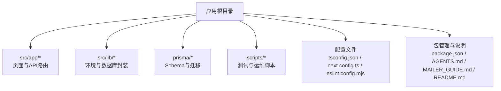
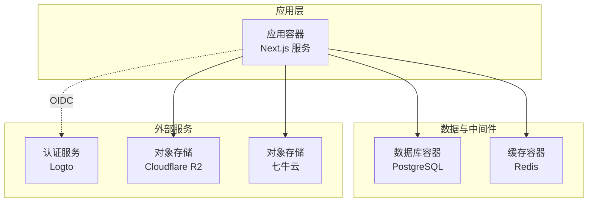
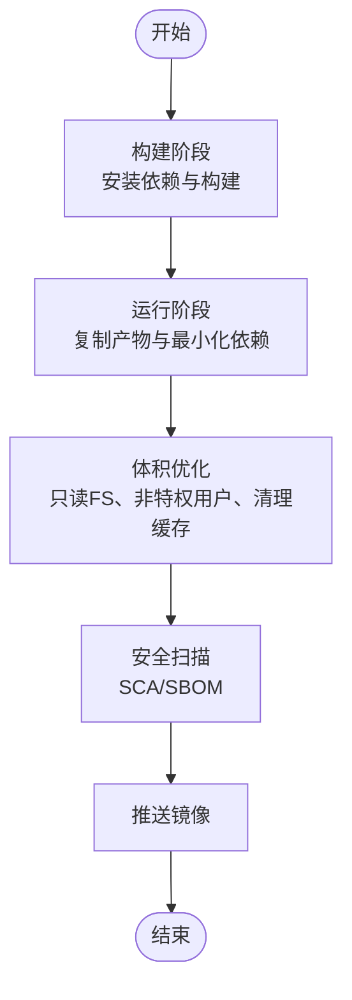
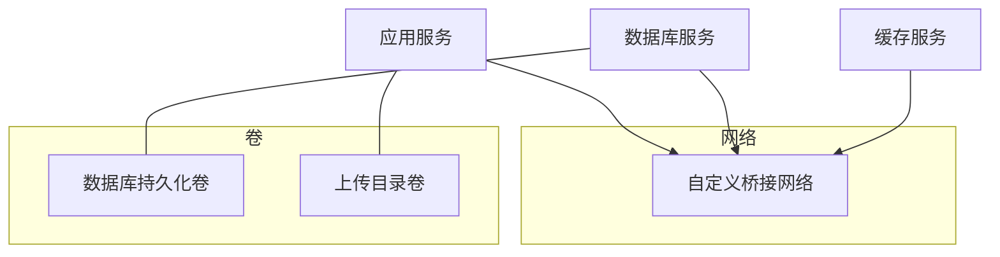
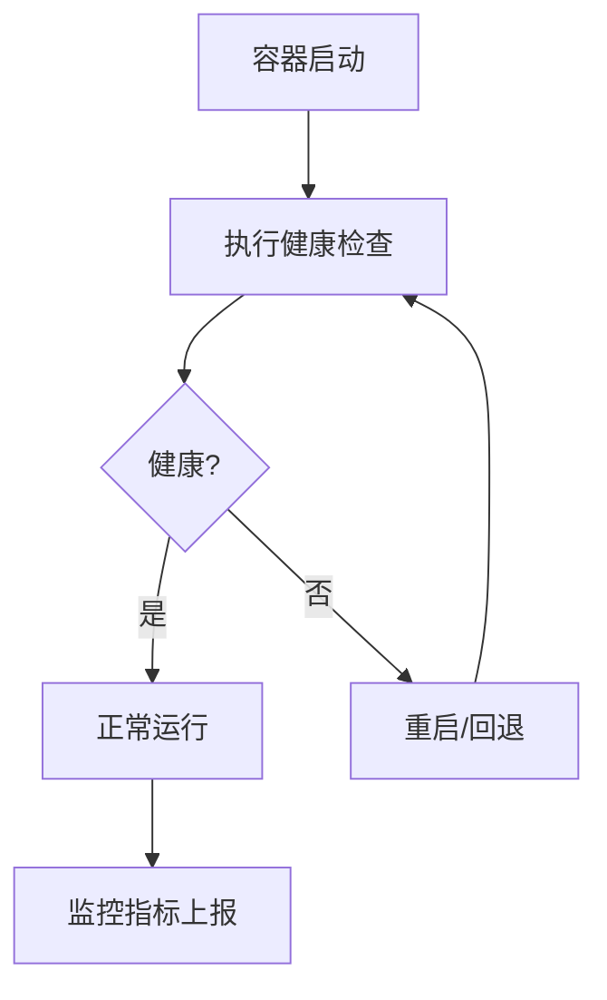
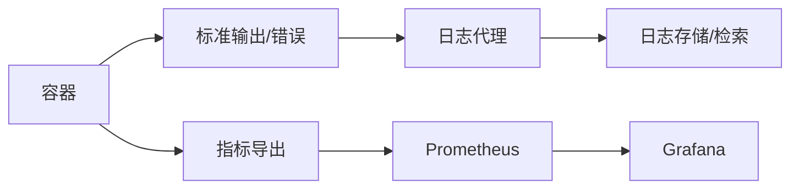
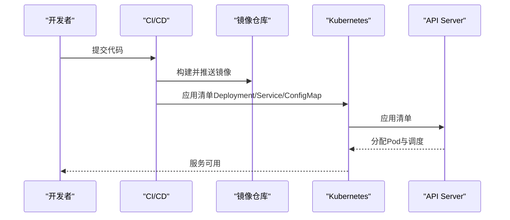
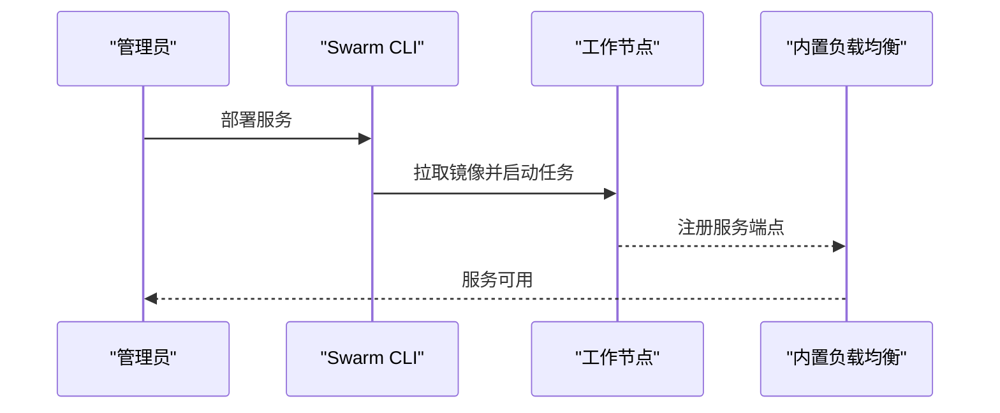
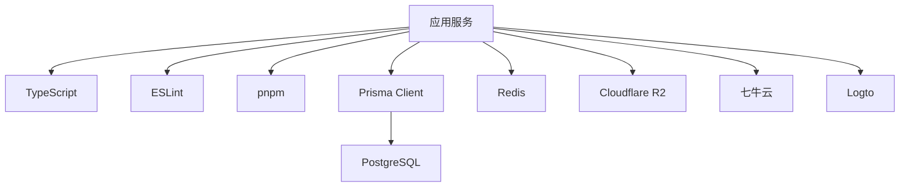

# 容器化部署

<cite>
**本文引用的文件**
- [AGENTS.md](file://AGENTS.md)
- [MAILER_GUIDE.md](file://MAILER_GUIDE.md)
- [README.md](file://README.md)
- [package.json](file://package.json)
- [next.config.ts](file://next.config.ts)
- [tsconfig.json](file://tsconfig.json)
- [eslint.config.mjs](file://eslint.config.mjs)
- [src/lib/env.ts](file://src/lib/env.ts)
- [src/lib/db.ts](file://src/lib/db.ts)
- [prisma/schema.prisma](file://prisma/schema.prisma)
- [scripts/test-prisma-standard.ts](file://scripts/test-prisma-standard.ts)
- [src/app/api/users/[id]/route.ts](file://src/app/api/users/[id]/route.ts)
</cite>

## 目录
1. [引言](#引言)
2. [项目结构](#项目结构)
3. [核心组件](#核心组件)
4. [架构总览](#架构总览)
5. [详细组件分析](#详细组件分析)
6. [依赖关系分析](#依赖关系分析)
7. [性能考虑](#性能考虑)
8. [故障排查指南](#故障排查指南)
9. [结论](#结论)
10. [附录](#附录)

## 引言
本指南面向希望将该项目以容器化方式部署的工程团队，覆盖从 Docker 镜像构建（含多阶段构建、体积压缩、安全扫描）、Compose 服务编排（网络与卷）、运行时配置（资源限制、健康检查、重启策略），到监控与日志、容器安全最佳实践以及 Kubernetes/Docker Swarm 的落地步骤。文档内容严格基于仓库现有文件与配置，确保可操作性与可追溯性。

## 项目结构
该仓库为基于 Next.js 的前端应用，配合 Prisma 数据库访问层与若干脚本工具。关键目录与文件如下：
- 应用入口与页面：src/app/*
- 类型与配置：tsconfig.json、next.config.ts、eslint.config.mjs
- 环境变量封装：src/lib/env.ts
- 数据库客户端：src/lib/db.ts、prisma/schema.prisma
- 构建与运行说明：AGENTS.md、MAILER_GUIDE.md、README.md
- 包管理与脚本：package.json

**章节来源**
- [AGENTS.md: 69-147:69-147](file://AGENTS.md#L69-L147)
- [README.md: 63-77:63-77](file://README.md#L63-L77)
- [package.json](file://package.json)

## 核心组件
- 应用服务（Next.js）
  - 运行端口：默认 9527（可通过环境变量覆盖）
  - 构建产物：静态/SSR产物，启动时由 Node.js 运行时提供服务
- 数据库（PostgreSQL）
  - 通过 Prisma 客户端连接，支持连接池与直连两种模式
- 缓存（Redis）
  - 通过环境变量配置，用于会话、缓存等
- 对象存储（Cloudflare R2 / 七牛云）
  - 通过环境变量配置，用于媒体资源上传与访问
- 认证（Logto）
  - 通过环境变量配置，提供 OIDC 登录能力

**章节来源**
- [AGENTS.md: 69-86:69-86](file://AGENTS.md#L69-L86)
- [src/lib/env.ts: 1-40:1-40](file://src/lib/env.ts#L1-L40)
- [prisma/schema.prisma: 7-13:7-13](file://prisma/schema.prisma#L7-L13)
- [src/lib/db.ts: 1-16:1-16](file://src/lib/db.ts#L1-L16)

## 架构总览
下图展示了容器化部署的典型拓扑：应用容器承载 Next.js 服务，数据库与缓存作为外部服务，对象存储提供静态资源访问，认证服务通过 OIDC 接入。

## 详细组件分析

### Docker 镜像构建（多阶段、体积压缩、安全扫描）
- 基础镜像选择
  - 构建阶段：使用官方 Node.js LTS 作为基础镜像，启用 pnpm 以减少依赖体积与安装时间
  - 运行阶段：使用官方 Node.js 运行时镜像或更精简的基础镜像（如 distroless），仅包含运行时所需二进制
- 多阶段构建要点
  - 第一阶段：安装依赖（pnpm install）、构建应用（pnpm build），产出构建产物
  - 第二阶段：复制构建产物与最小化运行时依赖，禁用开发依赖与源码
  - 使用 .dockerignore 忽略 node_modules、.next、build 等目录，降低镜像层数与体积
- 镜像体积压缩
  - 使用只读文件系统、非特权用户运行
  - 合理分层，将变更频率低的层（依赖）放在前面
  - 清理包管理器缓存与临时文件
- 安全扫描
  - 构建后对镜像进行 SCA 扫描（如 Trivy、Clair），识别高危漏洞
  - 定期更新基础镜像与依赖版本，建立补丁发布流程
  - 结合 SBOM（软件物料清单）审计供应链风险

### Docker Compose 服务编排（网络与卷）
- 服务定义
  - 应用服务：映射端口、挂载环境变量文件、绑定静态资源卷（如上传目录）
  - 数据库服务：持久化卷、初始化脚本、连接参数
  - 缓存服务：持久化卷、内存限制
- 网络设置
  - 自定义桥接网络，隔离应用与数据库/缓存
  - 仅暴露必要端口，内部服务间通过服务名通信
- 卷挂载
  - 数据库卷：PGDATA 指向持久化路径
  - 上传目录：将应用上传目录映射到宿主机或对象存储网关
- 健康检查与重启策略
  - 应用：HTTP 健康检查，失败自动重启
  - 数据库/缓存：探针检查端口与服务可用性，指数退避重启

### 容器运行时配置（资源限制、健康检查、重启策略）
- 资源限制
  - CPU/内存限额：根据业务峰值与并发模型设定
  - OOM 控制：开启内核 OOM Killer 并记录事件
- 健康检查
  - HTTP 探针：访问 /api/health 或 /_next/static/... 路径
  - TCP/TLS 握手：验证端口可达与证书有效
- 重启策略
  - 非永久性错误：重启直至成功或达到最大重试
  - 永久性错误：停止并等待人工干预

### 容器监控与日志收集
- 指标采集
  - 应用：Prometheus Exporter（如 Node.js 自带或第三方）
  - 基础设施：CPU/内存/IO/网络，结合 cAdvisor
- 日志收集
  - 标准输出/标准错误：统一由日志代理收集
  - 结构化日志：JSON 格式，包含时间戳、级别、服务名、请求ID
  - 日志保留与轮转：按大小/时间轮转，保留周期策略
- 告警
  - 健康检查失败、CPU/内存/IO 阈值、错误率突增、数据库连接异常

### 容器安全最佳实践与漏洞扫描
- 最小权限原则：非 root 用户运行，只读文件系统
- 网络隔离：仅开放必要端口，内部服务间 mTLS 或 Token 校验
- 依赖治理：固定版本、定期扫描、自动告警与修复
- 镜像安全：仅拉取可信来源，启用镜像签名与完整性校验
- 凭据管理：Secrets 管理，避免硬编码，定期轮换
- 漏洞扫描：CI/CD 中集成 SCA、SAST、DAST，形成闭环

### 容器编排工具使用（Kubernetes / Docker Swarm）

#### Kubernetes
- Deployment/StatefulSet：应用与数据库/缓存的声明式编排
- Service/Ingress：暴露服务与域名解析
- ConfigMap/Secret：注入环境变量与敏感信息
- PersistentVolume/PersistentVolumeClaim：数据库与上传目录持久化
- HPA/VPA：根据 CPU/内存/自定义指标弹性伸缩
- PodDisruptionBudget：保证高可用
- NetworkPolicy：限制入站/出站流量
- Job/CronJob：数据库迁移与定时任务

#### Docker Swarm
- 服务定义：指定副本数、更新策略、滚动升级
- 任务编排：数据库/缓存/应用服务的依赖顺序
- 机密与配置：使用 swarm secrets/config 注入
- 网络与负载均衡：内置 ingress 网络与路由
- 健康检查与回滚：失败自动回滚至上一版本

## 依赖关系分析
- 应用依赖
  - 运行时：Node.js（Next.js）
  - 构建工具：pnpm、TypeScript、ESLint
  - 数据访问：Prisma Client
  - 环境变量：站点、数据库、缓存、对象存储、Open API
- 外部依赖
  - 数据库：PostgreSQL（Supabase 连接池/直连）
  - 缓存：Redis
  - 对象存储：Cloudflare R2 / 七牛云
  - 认证：Logto

**章节来源**
- [package.json](file://package.json)
- [tsconfig.json: 1-42:1-42](file://tsconfig.json#L1-L42)
- [eslint.config.mjs: 1-18:1-18](file://eslint.config.mjs#L1-L18)
- [src/lib/env.ts: 1-40:1-40](file://src/lib/env.ts#L1-L40)
- [prisma/schema.prisma: 1-13:1-13](file://prisma/schema.prisma#L1-L13)

## 性能考虑
- 构建优化
  - 使用 pnpm 与增量构建，减少重复安装
  - 将依赖与源码分层，利用镜像缓存
- 运行优化
  - 启用 Next.js 的静态生成与预渲染，降低运行时压力
  - 合理设置并发与连接池上限，避免数据库拥塞
  - 使用 CDN 缓存静态资源，缩短首屏加载时间
- 监控与调优
  - 基于指标与日志进行热点分析与瓶颈定位
  - 动态扩缩容，结合业务高峰与低谷

## 故障排查指南
- 环境变量问题
  - 症状：应用无法连接数据库/缓存/对象存储
  - 排查：确认 .env 文件存在且键名正确，检查容器内环境变量是否生效
- 数据库连接异常
  - 症状：启动时报错或连接超时
  - 排查：检查 DATABASE_URL/DIRECT_URL、网络连通性、连接池配置
- 健康检查失败
  - 症状：频繁重启或服务不可用
  - 排查：查看探针返回码、日志、资源占用与依赖可用性
- 部署失败
  - 症状：镜像构建失败或 Compose 启动报错
  - 排查：检查 Dockerfile/Compose 语法、端口冲突、卷权限

**章节来源**
- [AGENTS.md: 69-147:69-147](file://AGENTS.md#L69-L147)
- [src/lib/env.ts: 1-40:1-40](file://src/lib/env.ts#L1-L40)
- [src/lib/db.ts: 1-16:1-16](file://src/lib/db.ts#L1-L16)
- [prisma/schema.prisma: 7-13:7-13](file://prisma/schema.prisma#L7-L13)

## 结论
通过多阶段构建与体积优化、严格的网络与权限控制、完善的监控与日志体系，以及在 Kubernetes/Swarm 上的标准化编排，可以实现该应用的高效、安全、可观测的容器化交付。建议在 CI/CD 中集成安全扫描与自动化测试，持续改进镜像质量与运行稳定性。

## 附录
- 环境变量清单（示例）
  - 站点与端口：SITE_NAME、SITE_URL、PORT
  - 数据库：DATABASE_URL、DIRECT_URL
  - 缓存：REDIS_URL
  - 对象存储：UPLOAD_PROVIDER、QINIU_*、R2_*
  - 认证：LOGTO_ENDPOINT、LOGTO_APP_ID、LOGTO_BASE_URL、LOGTO_COOKIE_SECRET
  - Open API：OPEN_API_KEYS、OPEN_API_USER_ID
- 关键文件路径
  - 构建与运行：AGENTS.md、MAILER_GUIDE.md、README.md
  - 环境变量：src/lib/env.ts
  - 数据库：src/lib/db.ts、prisma/schema.prisma
  - 测试脚本：scripts/test-prisma-standard.ts
  - API 示例：src/app/api/users/[id]/route.ts

**章节来源**
- [AGENTS.md: 69-147:69-147](file://AGENTS.md#L69-L147)
- [MAILER_GUIDE.md: 14-22:14-22](file://MAILER_GUIDE.md#L14-L22)
- [README.md: 63-77:63-77](file://README.md#L63-L77)
- [src/lib/env.ts: 1-40:1-40](file://src/lib/env.ts#L1-L40)
- [src/lib/db.ts: 1-16:1-16](file://src/lib/db.ts#L1-L16)
- [prisma/schema.prisma: 1-13:1-13](file://prisma/schema.prisma#L1-L13)
- [scripts/test-prisma-standard.ts: 1-20:1-20](file://scripts/test-prisma-standard.ts#L1-L20)
- [src/app/api/users/[id]/route.ts: 1-51](file://src/app/api/users/[id]/route.ts#L1-L51)