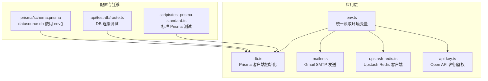
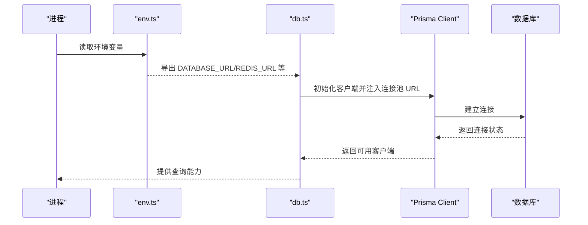
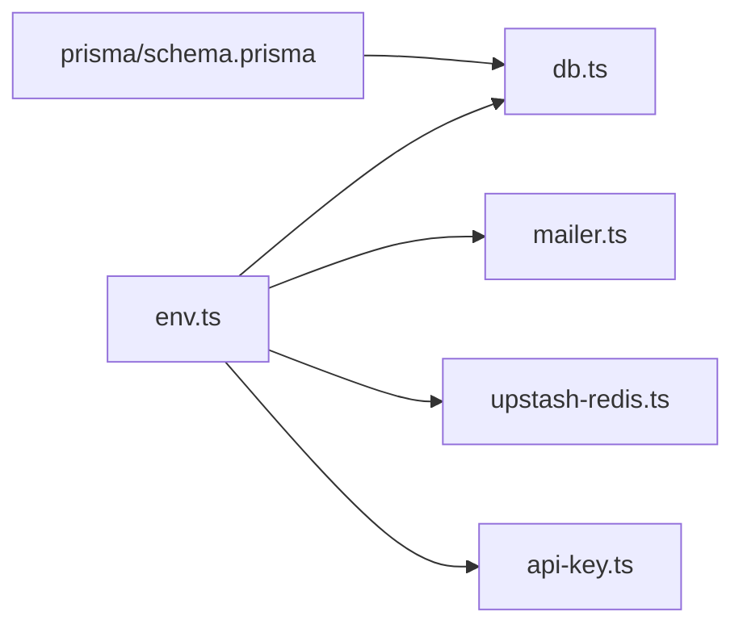
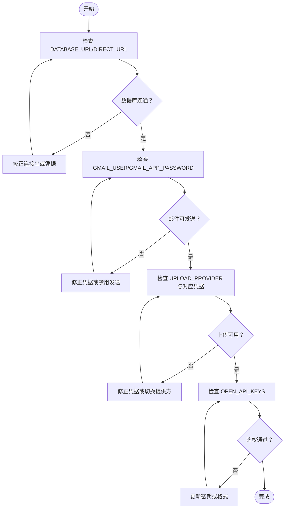

# 环境配置

<cite>
**本文引用的文件**
- [src/lib/env.ts](file://src/lib/env.ts)
- [prisma/schema.prisma](file://prisma/schema.prisma)
- [src/lib/db.ts](file://src/lib/db.ts)
- [src/lib/mailer.ts](file://src/lib/mailer.ts)
- [AGENTS.md](file://AGENTS.md)
- [scripts/test-prisma-standard.ts](file://scripts/test-prisma-standard.ts)
- [scripts/test-tencent-translate.js](file://scripts/test-tencent-translate.js)
- [src/lib/upstash-redis.ts](file://src/lib/upstash-redis.ts)
- [src/lib/api-key.ts](file://src/lib/api-key.ts)
- [src/app/api/test-db/route.ts](file://src/app/api/test-db/route.ts)
- [next.config.ts](file://next.config.ts)
- [src/middleware.ts](file://src/middleware.ts)
</cite>

## 目录
1. [引言](#引言)
2. [项目结构](#项目结构)
3. [核心组件](#核心组件)
4. [架构总览](#架构总览)
5. [详细组件分析](#详细组件分析)
6. [依赖关系分析](#依赖关系分析)
7. [性能考量](#性能考量)
8. [故障排查指南](#故障排查指南)
9. [结论](#结论)
10. [附录](#附录)

## 引言
本文件面向运维与开发团队，系统性梳理本项目的环境变量配置方案，覆盖生产所需的关键变量、命名规范、值格式要求、不同部署环境的差异、.env 模板与验证方法，并给出敏感信息的安全存储与版本控制最佳实践。

## 项目结构
本项目基于 Next.js App Router，环境变量主要集中在统一的 env 模块中集中读取与导出，数据库连接通过 Prisma 在 schema.prisma 中以 env() 方式读取，运行时连接池与迁移直连分离配置。邮件发送、上传、第三方 API 等均通过环境变量驱动。

图表来源
- [src/lib/env.ts:1-40](file://src/lib/env.ts#L1-L40)
- [src/lib/db.ts:1-16](file://src/lib/db.ts#L1-L16)
- [src/lib/mailer.ts:1-52](file://src/lib/mailer.ts#L1-L52)
- [src/lib/upstash-redis.ts:1-14](file://src/lib/upstash-redis.ts#L1-L14)
- [src/lib/api-key.ts:1-50](file://src/lib/api-key.ts#L1-L50)
- [prisma/schema.prisma:7-13](file://prisma/schema.prisma#L7-L13)
- [src/app/api/test-db/route.ts:1-14](file://src/app/api/test-db/route.ts#L1-L14)
- [scripts/test-prisma-standard.ts:1-20](file://scripts/test-prisma-standard.ts#L1-L20)

章节来源
- [src/lib/env.ts:1-40](file://src/lib/env.ts#L1-L40)
- [prisma/schema.prisma:7-13](file://prisma/schema.prisma#L7-L13)
- [src/lib/db.ts:1-16](file://src/lib/db.ts#L1-L16)

## 核心组件
- 环境变量聚合：集中于 env.ts，统一暴露站点、数据库、邮件、对象存储、上传策略、第三方 API 等配置。
- 数据库连接：schema.prisma 的 datasource db 使用 env() 读取 DATABASE_URL 与 DIRECT_URL；运行时通过 db.ts 初始化 Prisma 客户端并注入连接池 URL。
- 邮件发送：mailer.ts 读取 GMAIL_USER 与 GMAIL_APP_PASSWORD，使用 Gmail SMTP 发送邮件。
- 缓存与限流：Upstash Redis 客户端按需初始化，若未配置则返回空。
- 第三方 API 鉴权：api-key.ts 从 OPEN_API_KEYS 解析多密钥，支持轮换与快速切换。
- 配置验证：提供多种验证手段，包括 Prisma 连接测试脚本、数据库测试 API、.env 示例与部署指引。

章节来源
- [src/lib/env.ts:1-40](file://src/lib/env.ts#L1-L40)
- [prisma/schema.prisma:7-13](file://prisma/schema.prisma#L7-L13)
- [src/lib/db.ts:1-16](file://src/lib/db.ts#L1-L16)
- [src/lib/mailer.ts:1-52](file://src/lib/mailer.ts#L1-L52)
- [src/lib/upstash-redis.ts:1-14](file://src/lib/upstash-redis.ts#L1-L14)
- [src/lib/api-key.ts:1-50](file://src/lib/api-key.ts#L1-L50)
- [src/app/api/test-db/route.ts:1-14](file://src/app/api/test-db/route.ts#L1-L14)
- [scripts/test-prisma-standard.ts:1-20](file://scripts/test-prisma-standard.ts#L1-L20)

## 架构总览
环境变量在应用中的流转路径如下：

图表来源
- [src/lib/env.ts:11-15](file://src/lib/env.ts#L11-L15)
- [src/lib/db.ts:5-14](file://src/lib/db.ts#L5-L14)
- [prisma/schema.prisma:10-11](file://prisma/schema.prisma#L10-L11)

## 详细组件分析

### 数据库连接配置
- 运行时连接池：通过 DATABASE_URL 指向带连接池的地址（如 pgbouncer=true），适合生产环境。
- 迁移直连：通过 DIRECT_URL 指向数据库直连地址，用于迁移与维护任务。
- Prisma 配置：schema.prisma 的 datasource db 使用 env("DATABASE_URL") 与 env("DIRECT_URL")，确保运行时与迁移分离。
- 客户端初始化：db.ts 在运行时注入 DATABASE_URL，开发模式下打印更详细日志，便于调试。

章节来源
- [prisma/schema.prisma:7-13](file://prisma/schema.prisma#L7-L13)
- [src/lib/db.ts:5-14](file://src/lib/db.ts#L5-L14)

### 邮件发送配置（Gmail SMTP）
- 必需变量：GMAIL_USER、GMAIL_APP_PASSWORD。
- 验证流程：mailer.ts 在发送前验证环境变量是否存在并可建立连接。
- 使用场景：邮件通知、验证码发送等。

章节来源
- [src/lib/env.ts:3-5](file://src/lib/env.ts#L3-L5)
- [src/lib/mailer.ts:17-52](file://src/lib/mailer.ts#L17-L52)

### 对象存储与上传策略
- 七牛云：QINIU_AK、QINIU_SK、QINIU_BUCKET、NEXT_PUBLIC_QINIU_DOMAIN。
- Cloudflare R2：R2_ACCOUNT_ID、R2_ACCESS_KEY_ID、R2_SECRET_ACCESS_KEY、R2_BUCKET、R2_DOMAIN。
- 上传提供方：UPLOAD_PROVIDER 支持 'qiniu' 或 'r2'，默认 'r2'。

章节来源
- [src/lib/env.ts:17-35](file://src/lib/env.ts#L17-L35)

### 第三方服务密钥与用户标识
- Open API 密钥：OPEN_API_KEYS（逗号分隔的多密钥）、OPEN_API_USER_ID。
- 鉴权流程：api-key.ts 从 Authorization: Bearer 提取令牌并与 OPEN_API_KEYS 比对，实现快速鉴权。

章节来源
- [src/lib/env.ts:37-39](file://src/lib/env.ts#L37-L39)
- [src/lib/api-key.ts:15-50](file://src/lib/api-key.ts#L15-L50)

### 缓存与限流（可选）
- Upstash Redis：UPSTASH_REDIS_REST_URL、UPSTASH_REDIS_REST_TOKEN。
- 行为：若未配置则返回空，不阻断主流程。

章节来源
- [src/lib/env.ts:14](file://src/lib/env.ts#L14)
- [src/lib/upstash-redis.ts:1-14](file://src/lib/upstash-redis.ts#L1-L14)

### 认证与中间件（可选）
- Logto OIDC：LOGTO_ENDPOINT、LOGTO_APP_ID、LOGTO_BASE_URL、LOGTO_COOKIE_SECRET。
- 中间件：src/middleware.ts 基于 Edge 运行时校验会话，保护后台路由。
- 注意：本项目同时存在 .env 示例与实际代码读取点，应以 AGENTS.md 的示例为准，或在部署平台补充对应环境变量。

章节来源
- [AGENTS.md:78-82](file://AGENTS.md#L78-L82)
- [src/middleware.ts:1-35](file://src/middleware.ts#L1-L35)

### 端口与站点信息
- 端口：PORT（可选，默认 9527）。
- 站点名称与域名：SITE_NAME、SITE_URL。
- 注意：开发与生产端口在 AGENTS.md 中有明确区分。

章节来源
- [AGENTS.md:84-86](file://AGENTS.md#L84-L86)
- [src/lib/env.ts:7-9](file://src/lib/env.ts#L7-L9)

### 配置验证方法
- Prisma 连接测试：scripts/test-prisma-standard.ts 与 src/app/api/test-db/route.ts 均可用于验证数据库连通性。
- 环境变量示例：AGENTS.md 提供 .env 示例与部署步骤。
- 构建配置：next.config.ts 在生产构建时忽略 ESLint 与 TS 错误，但不影响环境变量读取。

章节来源
- [scripts/test-prisma-standard.ts:1-20](file://scripts/test-prisma-standard.ts#L1-L20)
- [src/app/api/test-db/route.ts:1-14](file://src/app/api/test-db/route.ts#L1-L14)
- [AGENTS.md:69-86](file://AGENTS.md#L69-L86)
- [next.config.ts:5-12](file://next.config.ts#L5-L12)

## 依赖关系分析
- env.ts 是所有外部配置的单一事实来源，被 db.ts、mailer.ts、upstash-redis.ts、api-key.ts 等模块消费。
- Prisma 的 datasource db 通过 schema.prisma 间接依赖 env()，从而与运行时环境解耦。
- 验证与测试脚本独立于业务逻辑，便于 CI/CD 集成。

图表来源
- [src/lib/env.ts:1-40](file://src/lib/env.ts#L1-L40)
- [src/lib/db.ts:1-16](file://src/lib/db.ts#L1-L16)
- [src/lib/mailer.ts:1-52](file://src/lib/mailer.ts#L1-L52)
- [src/lib/upstash-redis.ts:1-14](file://src/lib/upstash-redis.ts#L1-L14)
- [src/lib/api-key.ts:1-50](file://src/lib/api-key.ts#L1-L50)
- [prisma/schema.prisma:7-13](file://prisma/schema.prisma#L7-L13)

## 性能考量
- 连接池与直连分离：运行时使用连接池（如 pgbouncer=true）降低冷启动与连接抖动；迁移使用直连保证稳定性。
- 日志级别：开发模式下开启更详细日志，生产模式仅记录错误，减少 IO。
- CDN 与区域对齐：部署建议与数据库区域一致，减少跨区延迟。

章节来源
- [prisma/schema.prisma:7-13](file://prisma/schema.prisma#L7-L13)
- [src/lib/db.ts:7-9](file://src/lib/db.ts#L7-L9)
- [AGENTS.md:254-267](file://AGENTS.md#L254-L267)

## 故障排查指南
- 数据库无法连接
  - 检查 DATABASE_URL/DIRECT_URL 是否正确，优先使用 AGENTS.md 的示例。
  - 使用 scripts/test-prisma-standard.ts 或访问 /api/test-db 验证。
- 邮件发送失败
  - 确认 GMAIL_USER 与 GMAIL_APP_PASSWORD 是否配置且有效。
  - 查看 mailer.ts 的验证与错误日志。
- 上传失败
  - 根据 UPLOAD_PROVIDER 选择 QINIU 或 R2，核对对应 AK/SK/Bucket/Domain。
- API 鉴权失败
  - 确认 OPEN_API_KEYS 是否包含正确的 Bearer Token，注意大小写与前后空格。
- 构建阶段 ESLint/TS 错误
  - next.config.ts 已允许生产构建忽略错误，但建议在本地修复以提升质量。

章节来源
- [src/app/api/test-db/route.ts:1-14](file://src/app/api/test-db/route.ts#L1-L14)
- [scripts/test-prisma-standard.ts:1-20](file://scripts/test-prisma-standard.ts#L1-L20)
- [src/lib/mailer.ts:30-52](file://src/lib/mailer.ts#L30-L52)
- [src/lib/env.ts:17-35](file://src/lib/env.ts#L17-L35)
- [src/lib/api-key.ts:27-50](file://src/lib/api-key.ts#L27-L50)
- [next.config.ts:5-12](file://next.config.ts#L5-L12)

## 结论
本项目通过 env.ts 统一管理环境变量，结合 Prisma 的运行时连接池与迁移直连分离策略，实现了生产友好的数据库配置；邮件、对象存储、第三方 API 鉴权等均以环境变量驱动，便于在不同部署环境中灵活切换。配合 .env 示例与验证脚本，可高效完成配置落地与问题排查。

## 附录

### 环境变量清单与命名规范
- 数据库
  - DATABASE_URL：运行时连接池 URL（必填）
  - DIRECT_URL：迁移直连 URL（必填）
- 邮件（Gmail SMTP）
  - GMAIL_USER：发件人邮箱（必填）
  - GMAIL_APP_PASSWORD：应用专用密码（必填）
- 站点信息
  - SITE_NAME：站点名称（可选，默认值见 env.ts）
  - SITE_URL：站点域名（可选，默认值见 env.ts）
  - PORT：应用端口（可选，默认值见 AGENTS.md）
- 对象存储
  - UPLOAD_PROVIDER：'qiniu' 或 'r2'（可选，默认 'r2'）
  - 七牛云：QINIU_AK、QINIU_SK、QINIU_BUCKET、NEXT_PUBLIC_QINIU_DOMAIN
  - Cloudflare R2：R2_ACCOUNT_ID、R2_ACCESS_KEY_ID、R2_SECRET_ACCESS_KEY、R2_BUCKET、R2_DOMAIN
- 缓存（可选）
  - REDIS_URL：Redis 连接串（可选）
  - UPSTASH_REDIS_REST_URL、UPSTASH_REDIS_REST_TOKEN：Upstash Redis（可选）
- 第三方 API 鉴权
  - OPEN_API_KEYS：逗号分隔的多密钥（可选）
  - OPEN_API_USER_ID：用户标识（可选）
- 认证（可选）
  - LOGTO_ENDPOINT、LOGTO_APP_ID、LOGTO_BASE_URL、LOGTO_COOKIE_SECRET

章节来源
- [src/lib/env.ts:2-40](file://src/lib/env.ts#L2-L40)
- [AGENTS.md:73-86](file://AGENTS.md#L73-L86)

### 不同部署环境的配置差异
- 开发环境
  - 端口：9527（见 AGENTS.md）
  - 日志：开发模式下更详细
  - 数据库：可使用本地或测试实例
- 测试环境
  - 端口：9527（见 AGENTS.md）
  - 数据库：隔离的测试实例
  - 邮件：可配置测试账户或禁用发送
- 生产环境
  - 端口：9526（见 AGENTS.md）
  - 数据库：使用连接池（pgbouncer=true）与直连分离
  - 邮件：使用真实凭据
  - 对象存储：根据业务选择 QINIU 或 R2
  - API 鉴权：启用 OPEN_API_KEYS 并定期轮换

章节来源
- [AGENTS.md:84-123](file://AGENTS.md#L84-L123)
- [AGENTS.md:254-267](file://AGENTS.md#L254-L267)

### .env 文件模板
参考 AGENTS.md 中的“环境配置”部分，创建 .env 文件并填充以下变量：
- DATABASE_URL、DIRECT_URL
- LOGTO_*（可选）
- PORT（可选）

章节来源
- [AGENTS.md:69-86](file://AGENTS.md#L69-L86)

### 配置验证流程
- 数据库
  - 使用 scripts/test-prisma-standard.ts 或访问 /api/test-db
- 邮件
  - 确认 GMAIL_USER 与 GMAIL_APP_PASSWORD，查看 mailer.ts 的验证与错误日志
- 上传
  - 根据 UPLOAD_PROVIDER 选择对应存储，核对 AK/SK/Bucket/Domain
- API 鉴权
  - 使用 Bearer Token 与 OPEN_API_KEYS 比对

图表来源
- [src/app/api/test-db/route.ts:1-14](file://src/app/api/test-db/route.ts#L1-L14)
- [scripts/test-prisma-standard.ts:1-20](file://scripts/test-prisma-standard.ts#L1-L20)
- [src/lib/mailer.ts:30-52](file://src/lib/mailer.ts#L30-L52)
- [src/lib/env.ts:17-35](file://src/lib/env.ts#L17-L35)
- [src/lib/api-key.ts:27-50](file://src/lib/api-key.ts#L27-L50)

### 敏感信息的安全存储与管理
- 严格禁止将 .env 或任何包含敏感信息的文件纳入版本控制。
- 在部署平台（如 Vercel、服务器）以“机密变量”的形式注入环境变量。
- 定期轮换密钥（OPEN_API_KEYS），旧密钥及时下线。
- 使用最小权限原则：为对象存储与数据库分配最小必要权限。
- 在本地开发中，使用独立的测试凭据，避免与生产混淆。

章节来源
- [src/lib/api-key.ts:15-20](file://src/lib/api-key.ts#L15-L20)
- [src/lib/env.ts:17-35](file://src/lib/env.ts#L17-L35)

### 配置文件的版本控制最佳实践
- 将 .env 作为 .gitignore 忽略项。
- 提供 .env.example 或 AGENTS.md 中的示例，标注变量用途与格式。
- 在 CI/CD 中通过部署平台的“机密变量”注入真实值，不在仓库中保存明文。
- 对关键变更（如数据库迁移、密钥轮换）在变更日志中标注影响范围与回滚策略。

章节来源
- [.gitignore](file://.gitignore)
- [AGENTS.md:69-86](file://AGENTS.md#L69-L86)