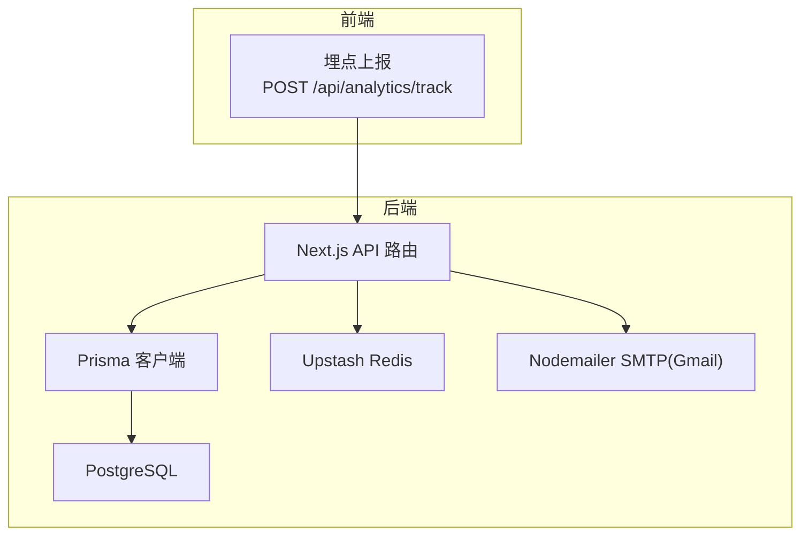
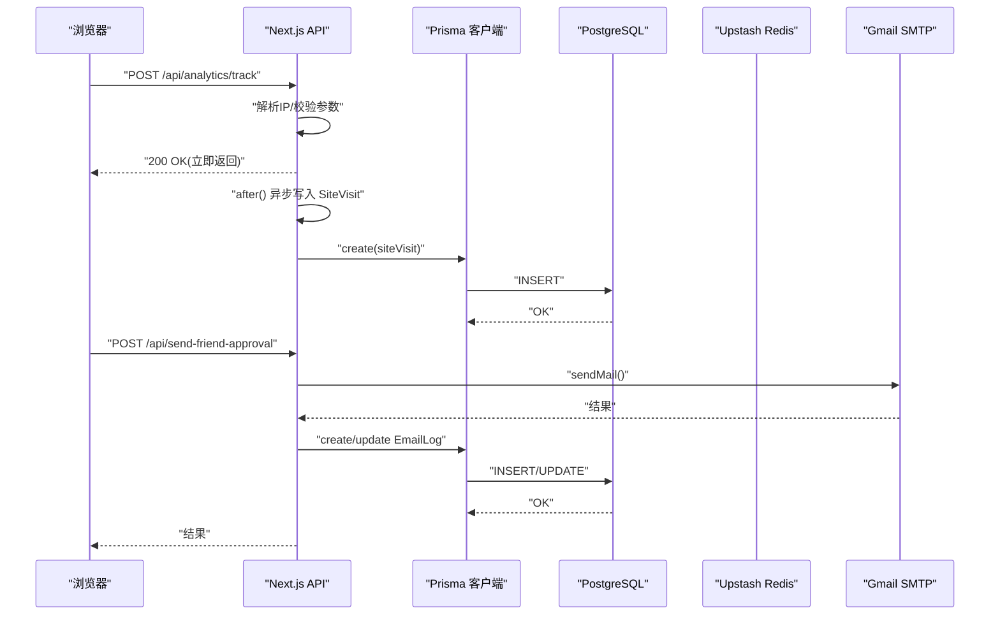
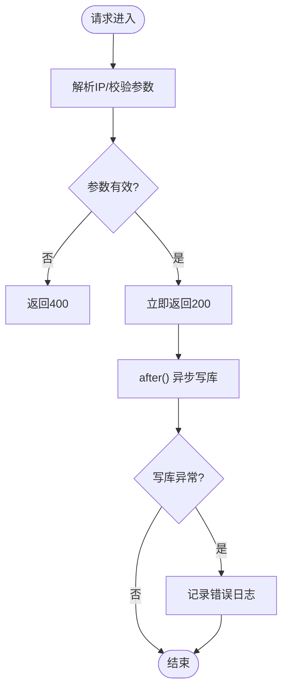
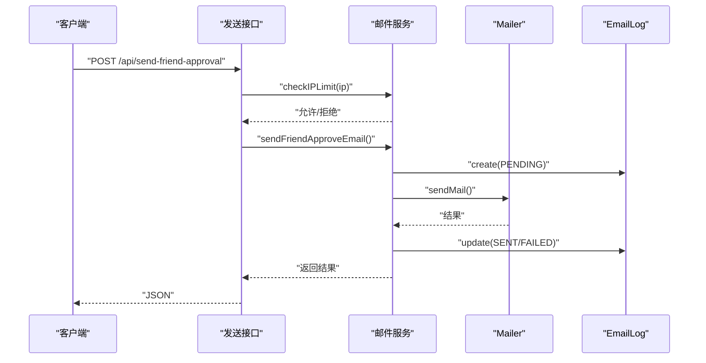
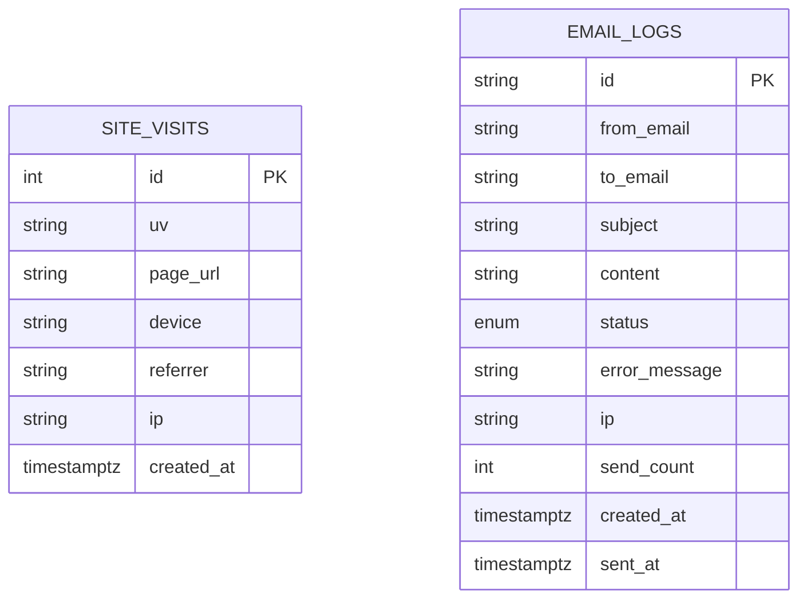
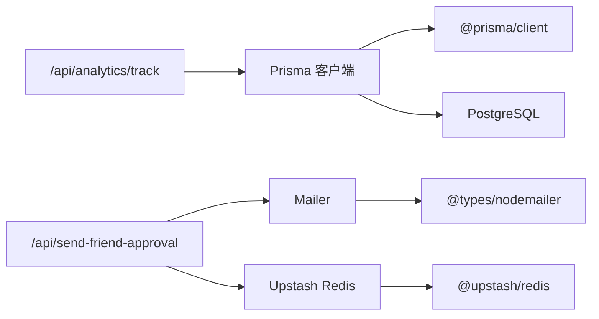

# 监控运维

<cite>
**本文引用的文件**
- [src/lib/db.ts](file://src/lib/db.ts)
- [prisma/schema.prisma](file://prisma/schema.prisma)
- [src/app/api/analytics/track/route.ts](file://src/app/api/analytics/track/route.ts)
- [src/lib/email-service.ts](file://src/lib/email-service.ts)
- [src/lib/mailer.ts](file://src/lib/mailer.ts)
- [src/app/api/send-friend-approval/route.ts](file://src/app/api/send-friend-approval/route.ts)
- [src/app/dashboard/email-logs/actions.ts](file://src/app/dashboard/email-logs/actions.ts)
- [src/lib/upstash-redis.ts](file://src/lib/upstash-redis.ts)
- [src/lib/env.ts](file://src/lib/env.ts)
- [src/app/api/test-db/route.ts](file://src/app/api/test-db/route.ts)
- [scripts/set-db-timezone.ts](file://scripts/set-db-timezone.ts)
- [package.json](file://package.json)
- [next.config.ts](file://next.config.ts)
</cite>

## 目录
1. [引言](#引言)
2. [项目结构](#项目结构)
3. [核心组件](#核心组件)
4. [架构总览](#架构总览)
5. [详细组件分析](#详细组件分析)
6. [依赖关系分析](#依赖关系分析)
7. [性能考量](#性能考量)
8. [故障排查指南](#故障排查指南)
9. [结论](#结论)
10. [附录](#附录)

## 引言
本指南面向监控与运维场景，围绕应用性能监控（APM）、日志管理、告警配置、数据库监控与优化、系统健康检查与自动恢复、以及运维自动化工具与脚本进行系统化梳理。结合仓库中现有的埋点上报、邮件发送与日志、数据库访问与模式定义、缓存接入、环境变量与构建配置等能力，给出可落地的实践建议与最佳实践。

## 项目结构
从监控与运维视角，项目的关键路径如下：
- 前端埋点上报：通过 API 接收 UV/页面/设备/来源等信息，并异步落库，保证响应优先。
- 邮件服务：基于 Nodemailer 的 SMTP 发送，配合数据库记录发送状态与失败原因，支持重试与限流。
- 数据库：Prisma 客户端按环境调整日志级别，PostgreSQL 作为主存储，含站点访问与邮件日志等表。
- 缓存：Upstash Redis 提供可选缓存能力。
- 健康检查：提供数据库连通性测试接口。
- 构建与类型校验：Next 配置允许构建阶段忽略 ESLint/TS 错误，便于持续交付。

图表来源
- [src/app/api/analytics/track/route.ts:1-54](file://src/app/api/analytics/track/route.ts#L1-L54)
- [src/lib/db.ts:1-16](file://src/lib/db.ts#L1-L16)
- [prisma/schema.prisma:216-229](file://prisma/schema.prisma#L216-L229)
- [src/lib/upstash-redis.ts:1-15](file://src/lib/upstash-redis.ts#L1-L15)
- [src/lib/mailer.ts:1-156](file://src/lib/mailer.ts#L1-L156)

章节来源
- [src/app/api/analytics/track/route.ts:1-54](file://src/app/api/analytics/track/route.ts#L1-L54)
- [src/lib/db.ts:1-16](file://src/lib/db.ts#L1-L16)
- [prisma/schema.prisma:216-229](file://prisma/schema.prisma#L216-L229)
- [src/lib/upstash-redis.ts:1-15](file://src/lib/upstash-redis.ts#L1-L15)
- [src/lib/mailer.ts:1-156](file://src/lib/mailer.ts#L1-L156)
- [next.config.ts:1-16](file://next.config.ts#L1-L16)

## 核心组件
- 埋点与访问统计
  - 接口接收 UV、页面 URL、设备、来源等字段，解析真实 IP，先返回 200，再异步写入数据库，避免阻塞响应。
  - 表结构包含站点访问记录，带索引以支撑查询与趋势分析。
- 邮件发送与日志
  - 邮件发送前进行 IP 限流与失败重试检查，记录发送尝试、结果与错误信息，支持后台重试与仪表盘查看。
  - 支持验证码与通知两类邮件模板。
- 数据库访问与模式
  - Prisma 客户端按环境启用不同日志级别；PostgreSQL 作为主存储，包含用户、文章、评论、交互、站点访问、邮件日志等模型。
- 缓存与环境
  - Upstash Redis 提供可选缓存；环境变量集中于 env 模块，涵盖数据库、邮件、对象存储等。
- 健康检查
  - 提供数据库连通性测试接口，打印日志便于排障。

章节来源
- [src/app/api/analytics/track/route.ts:1-54](file://src/app/api/analytics/track/route.ts#L1-L54)
- [prisma/schema.prisma:216-229](file://prisma/schema.prisma#L216-L229)
- [src/lib/email-service.ts:1-215](file://src/lib/email-service.ts#L1-L215)
- [src/lib/mailer.ts:1-156](file://src/lib/mailer.ts#L1-L156)
- [src/lib/db.ts:1-16](file://src/lib/db.ts#L1-L16)
- [src/lib/upstash-redis.ts:1-15](file://src/lib/upstash-redis.ts#L1-L15)
- [src/lib/env.ts:1-40](file://src/lib/env.ts#L1-L40)
- [src/app/api/test-db/route.ts:1-15](file://src/app/api/test-db/route.ts#L1-L15)

## 架构总览
下图展示从浏览器到后端 API、数据库与外部服务的整体调用链路，以及关键的异步处理与缓存位置。

图表来源
- [src/app/api/analytics/track/route.ts:1-54](file://src/app/api/analytics/track/route.ts#L1-L54)
- [src/lib/db.ts:1-16](file://src/lib/db.ts#L1-L16)
- [prisma/schema.prisma:216-229](file://prisma/schema.prisma#L216-L229)
- [src/lib/mailer.ts:1-156](file://src/lib/mailer.ts#L1-L156)
- [src/app/api/send-friend-approval/route.ts:1-44](file://src/app/api/send-friend-approval/route.ts#L1-L44)

## 详细组件分析

### 埋点与访问统计组件
- 功能要点
  - 解析真实 IP（考虑代理头），对缺失字段进行校验。
  - 使用响应后钩子异步写库，确保接口低延迟。
  - 将 UV、页面 URL、设备、来源、IP 等写入站点访问表。
- 性能与可靠性
  - 异步写入避免阻塞主线程，提升吞吐。
  - 对异常进行捕获并记录日志，不影响请求返回。
- 建议
  - 在网关或边缘层统一清洗与限速，防止异常流量冲击。
  - 对高频页面与来源建立索引与物化视图，支撑实时看板。

图表来源
- [src/app/api/analytics/track/route.ts:1-54](file://src/app/api/analytics/track/route.ts#L1-L54)

章节来源
- [src/app/api/analytics/track/route.ts:1-54](file://src/app/api/analytics/track/route.ts#L1-L54)
- [prisma/schema.prisma:216-229](file://prisma/schema.prisma#L216-L229)

### 邮件发送与日志组件
- 功能要点
  - 发送前检查 IP 限流规则，支持失败重试窗口内放行。
  - 记录邮件发送尝试、状态、错误信息、发送时间与重试计数。
  - 支持验证码与通知两类模板。
- 流程与重试
  - 失败记录更新后，可在后台触发重试或在仪表盘手动重试。
  - 重试时再次进行 IP 限流校验，避免滥用。
- 建议
  - 将失败队列持久化至数据库或消息队列，结合定时任务批量重试。
  - 对频繁失败的收件人与来源建立黑名单与熔断策略。

图表来源
- [src/app/api/send-friend-approval/route.ts:1-44](file://src/app/api/send-friend-approval/route.ts#L1-L44)
- [src/lib/email-service.ts:1-215](file://src/lib/email-service.ts#L1-L215)
- [src/lib/mailer.ts:1-156](file://src/lib/mailer.ts#L1-L156)
- [prisma/schema.prisma:243-260](file://prisma/schema.prisma#L243-L260)

章节来源
- [src/lib/email-service.ts:1-215](file://src/lib/email-service.ts#L1-L215)
- [src/lib/mailer.ts:1-156](file://src/lib/mailer.ts#L1-L156)
- [src/app/api/send-friend-approval/route.ts:1-44](file://src/app/api/send-friend-approval/route.ts#L1-L44)
- [src/app/dashboard/email-logs/actions.ts:1-64](file://src/app/dashboard/email-logs/actions.ts#L1-L64)
- [prisma/schema.prisma:243-260](file://prisma/schema.prisma#L243-L260)

### 数据库访问与模式
- 访问层
  - Prisma 客户端按环境开启日志级别，开发环境更详细，生产环境聚焦错误。
  - 数据源 URL 来自环境变量，支持直接连接与运行时连接池区分。
- 模式设计
  - 站点访问表与邮件日志表均带有索引，支撑常见查询维度。
  - 邮件日志包含状态枚举、错误信息、发送计数等，便于审计与重试。
- 建议
  - 对高频查询字段建立复合索引，定期分析慢查询。
  - 使用只读副本与连接池参数优化，结合备份与 PITR。

图表来源
- [prisma/schema.prisma:216-229](file://prisma/schema.prisma#L216-L229)
- [prisma/schema.prisma:243-260](file://prisma/schema.prisma#L243-L260)

章节来源
- [src/lib/db.ts:1-16](file://src/lib/db.ts#L1-L16)
- [prisma/schema.prisma:1-308](file://prisma/schema.prisma#L1-L308)

### 缓存与环境
- 缓存
  - Upstash Redis 提供可选缓存能力，需在环境变量中配置 URL 与 Token。
- 环境变量
  - 集中于 env 模块，包含数据库、邮件、对象存储、Open API 等配置项。
- 建议
  - 对热点数据设置 TTL 与失效策略，结合降级与本地缓存。
  - 将敏感配置纳入密钥管理，避免硬编码。

章节来源
- [src/lib/upstash-redis.ts:1-15](file://src/lib/upstash-redis.ts#L1-L15)
- [src/lib/env.ts:1-40](file://src/lib/env.ts#L1-L40)

### 健康检查与自动恢复
- 健康检查
  - 提供数据库连通性测试接口，打印日志，便于 CI/CD 与探针使用。
- 自动恢复
  - 邮件失败记录可触发重试；建议引入消息队列与指数退避策略。
- 建议
  - 结合容器编排的重启策略与探活配置，实现快速自愈。
  - 对数据库连接池与外部服务（SMTP）增加熔断与超时控制。

章节来源
- [src/app/api/test-db/route.ts:1-15](file://src/app/api/test-db/route.ts#L1-L15)
- [src/lib/email-service.ts:1-215](file://src/lib/email-service.ts#L1-L215)
- [src/app/dashboard/email-logs/actions.ts:1-64](file://src/app/dashboard/email-logs/actions.ts#L1-L64)

## 依赖关系分析
- 组件耦合
  - API 层依赖 Prisma 客户端与外部 SMTP；邮件服务依赖 Nodemailer 与环境变量。
  - 埋点与邮件均写入数据库，形成可观测数据闭环。
- 外部依赖
  - 数据库：PostgreSQL（Prisma）
  - 缓存：Upstash Redis
  - 邮件：Gmail SMTP（Nodemailer）
- 潜在风险
  - 邮件发送失败未回滚，需依赖重试与日志审计。
  - 数据库日志级别在开发环境较重，需关注磁盘与性能影响。

图表来源
- [src/app/api/analytics/track/route.ts:1-54](file://src/app/api/analytics/track/route.ts#L1-L54)
- [src/lib/mailer.ts:1-156](file://src/lib/mailer.ts#L1-L156)
- [package.json:11-79](file://package.json#L11-L79)
- [src/lib/upstash-redis.ts:1-15](file://src/lib/upstash-redis.ts#L1-L15)

章节来源
- [package.json:11-79](file://package.json#L11-L79)
- [src/lib/mailer.ts:1-156](file://src/lib/mailer.ts#L1-L156)
- [src/lib/db.ts:1-16](file://src/lib/db.ts#L1-L16)
- [src/lib/upstash-redis.ts:1-15](file://src/lib/upstash-redis.ts#L1-L15)

## 性能考量
- 埋点写库异步化
  - 使用响应后钩子异步写入，降低尾延迟，提升吞吐。
- 日志级别与开销
  - 开发环境开启详细日志，生产仅记录错误，避免 IO 放大。
- 查询与索引
  - 对站点访问与邮件日志的常用查询维度建立索引，减少全表扫描。
- 缓存策略
  - 利用 Upstash Redis 存储热点数据，设置合理 TTL，避免雪崩。
- 构建与类型检查
  - 允许构建阶段忽略 ESLint/TS 错误，加速交付；但建议在 CI 中严格校验。

章节来源
- [src/app/api/analytics/track/route.ts:1-54](file://src/app/api/analytics/track/route.ts#L1-L54)
- [src/lib/db.ts:1-16](file://src/lib/db.ts#L1-L16)
- [prisma/schema.prisma:216-229](file://prisma/schema.prisma#L216-L229)
- [src/lib/upstash-redis.ts:1-15](file://src/lib/upstash-redis.ts#L1-L15)
- [next.config.ts:1-16](file://next.config.ts#L1-L16)

## 故障排查指南
- 数据库连通性
  - 使用测试接口确认连接与基本查询是否正常，观察日志输出。
- 邮件发送失败
  - 查看邮件日志表状态与错误信息，确认是否触发重试。
  - 检查 IP 限流与失败重试窗口，必要时清理过期失败记录。
- 埋点异常
  - 关注异步写库日志，定位数据库写入失败原因。
- 环境变量
  - 确认邮件、数据库、缓存等关键变量是否正确配置。

章节来源
- [src/app/api/test-db/route.ts:1-15](file://src/app/api/test-db/route.ts#L1-L15)
- [src/lib/email-service.ts:1-215](file://src/lib/email-service.ts#L1-L215)
- [src/app/api/analytics/track/route.ts:1-54](file://src/app/api/analytics/track/route.ts#L1-L54)
- [src/lib/env.ts:1-40](file://src/lib/env.ts#L1-L40)

## 结论
本项目在埋点、邮件与数据库层面已具备基础的可观测能力。建议在此基础上完善：
- APM 工具集成：接入链路追踪与性能面板，覆盖前端到后端的全链路指标。
- 日志管理：统一日志格式与采集，建立索引与归档策略，支持检索与可视化。
- 告警体系：基于阈值与规则设置多通道告警，明确故障响应流程。
- 数据库优化：建立索引与物化视图，优化慢查询，实施备份与容量规划。
- 自动化与恢复：引入消息队列与重试策略，结合探活与熔断，实现自愈。

## 附录
- 数据库时区设置脚本
  - 用于将数据库全局时区设置为 UTC，便于跨时区一致性。
- 构建配置
  - 允许构建阶段忽略 ESLint/TS 错误，便于持续交付；建议在流水线中补充严格校验步骤。

章节来源
- [scripts/set-db-timezone.ts:1-29](file://scripts/set-db-timezone.ts#L1-L29)
- [next.config.ts:1-16](file://next.config.ts#L1-L16)