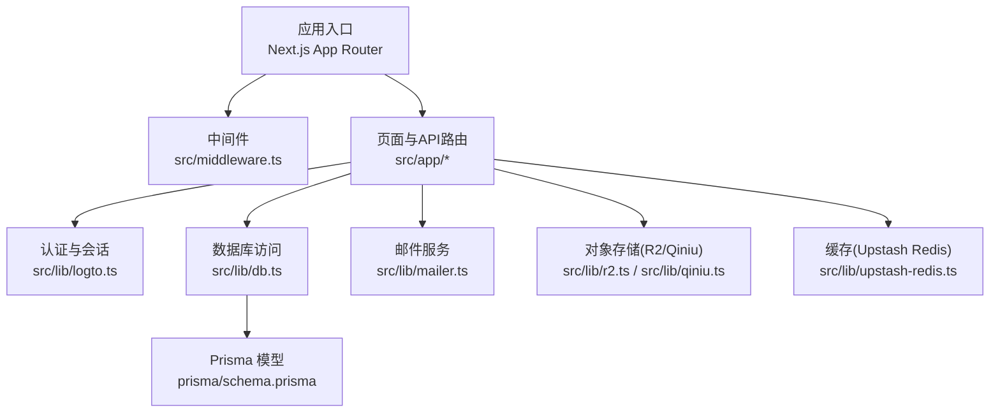
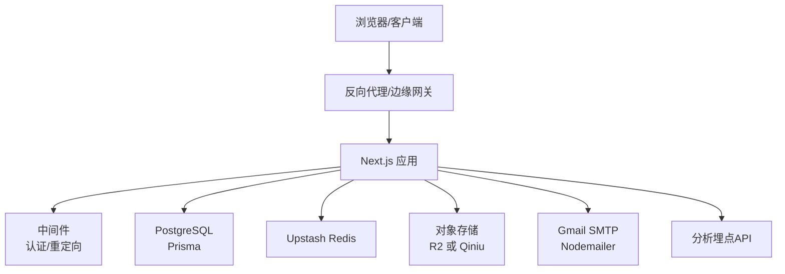
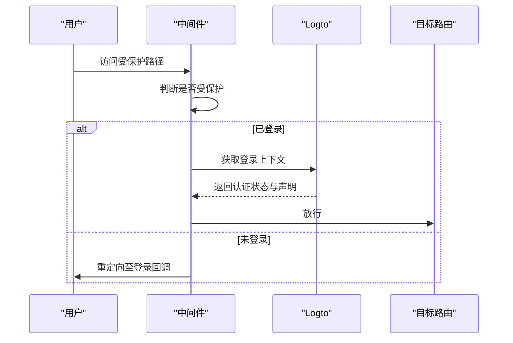
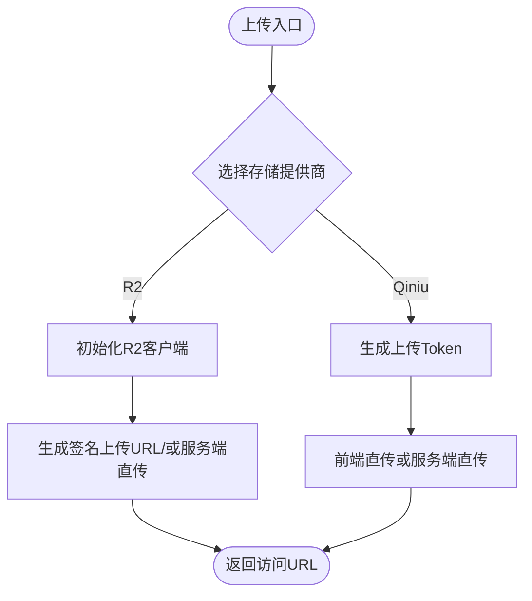
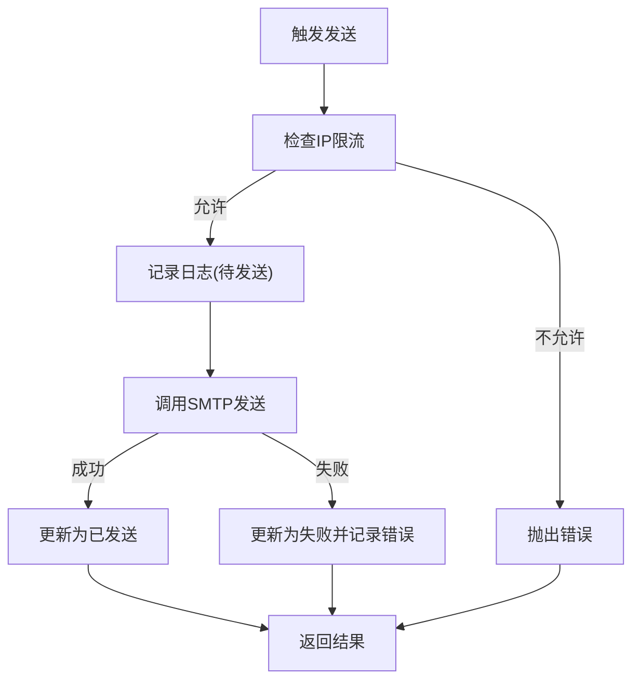
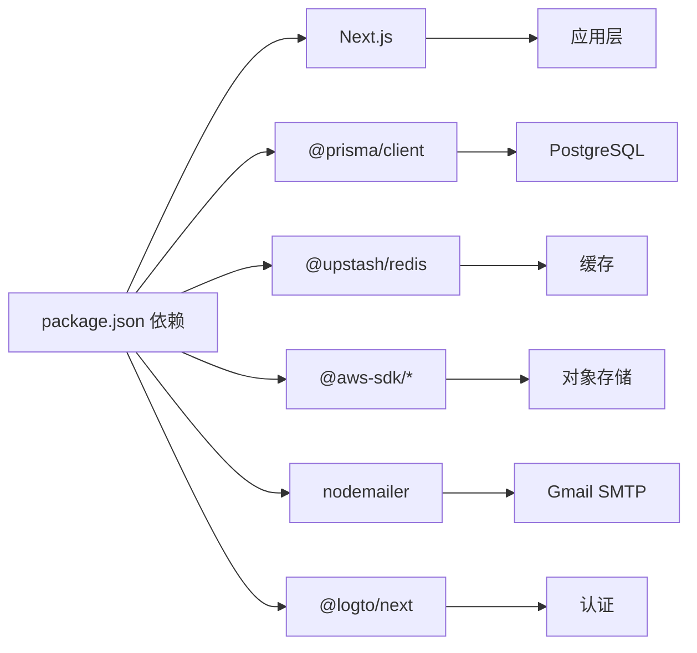

# 部署指南

<cite>
**本文引用的文件**
- [package.json](file://package.json)
- [next.config.ts](file://next.config.ts)
- [prisma/schema.prisma](file://prisma/schema.prisma)
- [src/lib/env.ts](file://src/lib/env.ts)
- [src/lib/db.ts](file://src/lib/db.ts)
- [src/lib/logto.ts](file://src/lib/logto.ts)
- [src/middleware.ts](file://src/middleware.ts)
- [src/lib/email-service.ts](file://src/lib/email-service.ts)
- [src/lib/mailer.ts](file://src/lib/mailer.ts)
- [src/lib/upstash-redis.ts](file://src/lib/upstash-redis.ts)
- [src/lib/r2.ts](file://src/lib/r2.ts)
- [src/lib/qiniu.ts](file://src/lib/qiniu.ts)
- [src/app/api/analytics/track/route.ts](file://src/app/api/analytics/track/route.ts)
</cite>

## 目录
1. [引言](#引言)
2. [项目结构](#项目结构)
3. [核心组件](#核心组件)
4. [架构总览](#架构总览)
5. [详细组件分析](#详细组件分析)
6. [依赖关系分析](#依赖关系分析)
7. [性能考量](#性能考量)
8. [故障排查指南](#故障排查指南)
9. [结论](#结论)
10. [附录](#附录)

## 引言
本指南面向“一梦五千年”项目的生产环境部署与运维，覆盖环境变量与数据库配置、域名与SSL、容器化与云平台部署、CI/CD流水线、性能监控与日志、安全加固、备份与灾备以及扩展与负载均衡等主题。文档以仓库现有实现为依据，结合Next.js应用特性与所用技术栈进行落地说明。

## 项目结构
项目采用Next.js App Router架构，核心目录与职责概览：
- src/app：页面路由、API路由与布局
- src/lib：运行时配置、数据库、认证、邮件、对象存储、缓存等核心库
- prisma：数据库模型与迁移
- scripts：数据库与时效性脚本
- public：静态资源
- 根目录：构建与开发脚本、类型配置、样式配置

图表来源
- [src/middleware.ts:1-36](file://src/middleware.ts#L1-L36)
- [src/lib/logto.ts:1-13](file://src/lib/logto.ts#L1-L13)
- [src/lib/db.ts:1-16](file://src/lib/db.ts#L1-L16)
- [src/lib/mailer.ts:1-156](file://src/lib/mailer.ts#L1-L156)
- [src/lib/r2.ts:1-95](file://src/lib/r2.ts#L1-L95)
- [src/lib/qiniu.ts:1-33](file://src/lib/qiniu.ts#L1-L33)
- [src/lib/upstash-redis.ts:1-15](file://src/lib/upstash-redis.ts#L1-L15)
- [prisma/schema.prisma:1-308](file://prisma/schema.prisma#L1-L308)

章节来源
- [package.json:1-98](file://package.json#L1-L98)
- [next.config.ts:1-16](file://next.config.ts#L1-L16)

## 核心组件
- 环境变量与配置
  - 邮件(Gmail)、站点名称与URL、数据库连接、Redis、对象存储(Qiniu/R2)、Open API等均通过统一的环境变量模块加载。
- 数据库与ORM
  - Prisma Client按需初始化，支持开发与生产日志级别差异。
- 认证与会话
  - 使用Logto Edge中间件保护受保护路径，强制登录跳转。
- 对象存储
  - R2基于Cloudflare S3兼容接口；Qiniu基于SDK直传令牌。
- 缓存
  - Upstash Redis提供REST客户端封装。
- 邮件服务
  - Nodemailer通过Gmail SMTP发送；提供IP限流与失败重试机制。
- 分析埋点
  - 独立API接收UV/设备/来源/IP等信息，异步落库不阻塞响应。

章节来源
- [src/lib/env.ts:1-40](file://src/lib/env.ts#L1-L40)
- [src/lib/db.ts:1-16](file://src/lib/db.ts#L1-L16)
- [src/lib/logto.ts:1-13](file://src/lib/logto.ts#L1-L13)
- [src/middleware.ts:1-36](file://src/middleware.ts#L1-L36)
- [src/lib/r2.ts:1-95](file://src/lib/r2.ts#L1-L95)
- [src/lib/qiniu.ts:1-33](file://src/lib/qiniu.ts#L1-L33)
- [src/lib/upstash-redis.ts:1-15](file://src/lib/upstash-redis.ts#L1-L15)
- [src/lib/mailer.ts:1-156](file://src/lib/mailer.ts#L1-L156)
- [src/app/api/analytics/track/route.ts:1-54](file://src/app/api/analytics/track/route.ts#L1-L54)

## 架构总览
下图展示生产部署的关键交互：浏览器请求经由反向代理/边缘网关到达Next.js应用，中间件执行认证校验，业务逻辑调用数据库、缓存、对象存储与邮件服务。

图表来源
- [src/middleware.ts:1-36](file://src/middleware.ts#L1-L36)
- [src/lib/db.ts:1-16](file://src/lib/db.ts#L1-L16)
- [src/lib/upstash-redis.ts:1-15](file://src/lib/upstash-redis.ts#L1-L15)
- [src/lib/r2.ts:1-95](file://src/lib/r2.ts#L1-L95)
- [src/lib/qiniu.ts:1-33](file://src/lib/qiniu.ts#L1-L33)
- [src/lib/mailer.ts:1-156](file://src/lib/mailer.ts#L1-L156)
- [src/app/api/analytics/track/route.ts:1-54](file://src/app/api/analytics/track/route.ts#L1-L54)

## 详细组件分析

### 环境变量与配置
- 必要环境变量清单
  - 邮件：GMAIL_USER、GMAIL_APP_PASSWORD、SITE_NAME、SITE_URL
  - 数据库：DATABASE_URL（含directUrl于迁移场景）
  - 缓存：UPSTASH_REDIS_REST_URL、UPSTASH_REDIS_REST_TOKEN
  - 对象存储：UPLOAD_PROVIDER（r2或qiniu）及对应AK/SK、Bucket、Domain/Account等
  - 认证：LOGTO_ENDPOINT、LOGTO_APP_ID、LOGTO_BASE_URL、LOGTO_COOKIE_SECRET
  - 其他：OPEN_API_KEYS、OPEN_API_USER_ID
- 生产建议
  - 使用只读凭证与最小权限原则；敏感变量通过平台密钥管理服务注入。
  - 将站点URL与Cookie Secure标志与HTTPS部署配套。

章节来源
- [src/lib/env.ts:1-40](file://src/lib/env.ts#L1-L40)
- [prisma/schema.prisma:7-13](file://prisma/schema.prisma#L7-L13)
- [src/lib/logto.ts:1-13](file://src/lib/logto.ts#L1-L13)
- [src/lib/mailer.ts:17-28](file://src/lib/mailer.ts#L17-L28)

### 数据库与迁移
- 连接配置
  - 运行时使用DATABASE_URL；迁移使用DIRECT_URL（直连端口差异已在Schema中注释说明）。
- 迁移与生成
  - 构建前先生成Prisma客户端；迁移脚本位于prisma/migrations。
- 生产建议
  - 使用连接池与只读副本；开启慢查询日志与定期备份。
  - 在CI中先行迁移预检，再进行部署。

章节来源
- [prisma/schema.prisma:7-13](file://prisma/schema.prisma#L7-L13)
- [package.json:9](file://package.json#L9)
- [src/lib/db.ts:5-14](file://src/lib/db.ts#L5-L14)

### 中间件与认证
- 行为
  - 重定向/dashboard至/dashboard/overview；对/dashboard与/admin非登录访问进行拦截并跳转登录。
  - 基于Logto Edge上下文判断登录状态。
- 生产建议
  - 登录回调与会话Cookie需配合HTTPS与SameSite/Secure属性。
  - 对admin路径细化角色校验。

图表来源
- [src/middleware.ts:8-28](file://src/middleware.ts#L8-L28)
- [src/lib/logto.ts:3-12](file://src/lib/logto.ts#L3-L12)

章节来源
- [src/middleware.ts:1-36](file://src/middleware.ts#L1-L36)
- [src/lib/logto.ts:1-13](file://src/lib/logto.ts#L1-L13)

### 对象存储（R2/Qiniu）
- R2
  - 单例S3Client，支持生成上传签名URL与获取公开访问URL；支持自定义域名优先。
- Qiniu
  - 生成带过期时间的上传Token；提供唯一文件名规则。
- 生产建议
  - 前端直传使用签名URL；服务端直传控制Content-Type与ACL策略。
  - 自定义域名需配置CNAME与TLS证书。

图表来源
- [src/lib/r2.ts:10-95](file://src/lib/r2.ts#L10-L95)
- [src/lib/qiniu.ts:10-33](file://src/lib/qiniu.ts#L10-L33)

章节来源
- [src/lib/r2.ts:1-95](file://src/lib/r2.ts#L1-L95)
- [src/lib/qiniu.ts:1-33](file://src/lib/qiniu.ts#L1-L33)

### 缓存（Upstash Redis）
- 功能
  - 按需初始化Redis客户端；无配置时返回null。
- 生产建议
  - 为热点数据设置TTL；使用pipeline批量操作；监控QPS与延迟。

章节来源
- [src/lib/upstash-redis.ts:1-15](file://src/lib/upstash-redis.ts#L1-L15)

### 邮件服务（Gmail SMTP）
- 功能
  - 通过Nodemailer连接Gmail SMTP；提供验证码与通知邮件模板。
  - IP限流：1小时最多3封，失败记录可在2小时内重试。
  - 失败重试：更新发送计数与错误信息。
- 生产建议
  - 使用应用专用密码；启用双因素；合理设置退避与重试上限。
  - 结合数据库日志审计发送状态与错误。

图表来源
- [src/lib/email-service.ts:11-55](file://src/lib/email-service.ts#L11-L55)
- [src/lib/email-service.ts:159-214](file://src/lib/email-service.ts#L159-L214)
- [src/lib/mailer.ts:31-64](file://src/lib/mailer.ts#L31-L64)

章节来源
- [src/lib/email-service.ts:1-215](file://src/lib/email-service.ts#L1-L215)
- [src/lib/mailer.ts:1-156](file://src/lib/mailer.ts#L1-L156)

### 分析埋点API
- 行为
  - 接收UV、页面URL、设备、来源与IP，解析真实IP后异步写入数据库。
- 生产建议
  - 对异常与缺失字段返回明确错误；对高频写入考虑批量入库或缓冲队列。

章节来源
- [src/app/api/analytics/track/route.ts:1-54](file://src/app/api/analytics/track/route.ts#L1-L54)

## 依赖关系分析
- 运行时依赖
  - Next.js、@prisma/client、@upstash/redis、@aws-sdk/*、nodemailer、@logto/next等。
- 开发依赖
  - prisma、eslint、tailwindcss、typescript等。
- 关键耦合点
  - 中间件依赖Logto配置；数据库依赖环境变量；对象存储依赖对应供应商配置；邮件依赖Gmail SMTP。

图表来源
- [package.json:11-96](file://package.json#L11-L96)

章节来源
- [package.json:1-98](file://package.json#L1-L98)

## 性能考量
- 构建与运行
  - 生产构建忽略ESLint与TypeScript类型错误，降低部署门槛但需保证质量门禁在CI中执行。
- 数据访问
  - Prisma在开发模式开启更详细日志；生产仅记录错误，减少IO开销。
- 缓存
  - 合理设置TTL与命中率；对热点查询使用缓存穿透防护。
- 存储
  - R2/Qiniu上传签名URL可减轻服务端压力；注意CDN缓存与回源策略。
- 邮件
  - IP限流与失败重试避免滥用；批量发送时使用退避策略。

章节来源
- [next.config.ts:5-12](file://next.config.ts#L5-L12)
- [src/lib/db.ts:8](file://src/lib/db.ts#L8)
- [src/lib/email-service.ts:11-55](file://src/lib/email-service.ts#L11-L55)

## 故障排查指南
- 数据库连接失败
  - 检查DATABASE_URL格式与可达性；确认网络策略与连接池配置。
- 认证跳转异常
  - 核对LOGTO_*环境变量与Cookie Secure标志；确保回调URL与基地址一致。
- 邮件发送失败
  - 校验GMAIL_USER与应用专用密码；查看失败日志与重试计数；检查IP限流阈值。
- 对象存储上传失败
  - 校验R2/Qiniu凭据与Bucket权限；确认签名URL过期时间与自定义域名CNAME。
- 分析埋点写入异常
  - 检查after()异步写入日志；确认required字段与IP解析。

章节来源
- [src/lib/db.ts:5-14](file://src/lib/db.ts#L5-L14)
- [src/lib/logto.ts:3-12](file://src/lib/logto.ts#L3-L12)
- [src/lib/mailer.ts:31-64](file://src/lib/mailer.ts#L31-L64)
- [src/lib/r2.ts:10-22](file://src/lib/r2.ts#L10-L22)
- [src/app/api/analytics/track/route.ts:28-43](file://src/app/api/analytics/track/route.ts#L28-L43)

## 结论
本指南基于仓库现有实现，给出了生产部署的准备清单、配置要点、容器化与云平台部署思路、CI/CD落地建议、性能与安全加固、备份与灾备以及扩展与负载均衡的实践方向。建议在正式上线前完成端到端演练与压测，并持续完善监控与告警体系。

## 附录

### A. 环境变量清单与用途
- 邮件与站点
  - GMAIL_USER、GMAIL_APP_PASSWORD、SITE_NAME、SITE_URL
- 数据库
  - DATABASE_URL（运行时）、DIRECT_URL（迁移）
- 缓存
  - UPSTASH_REDIS_REST_URL、UPSTASH_REDIS_REST_TOKEN
- 对象存储
  - UPLOAD_PROVIDER（r2或qiniu）、R2_ACCOUNT_ID、R2_ACCESS_KEY_ID、R2_SECRET_ACCESS_KEY、R2_BUCKET、R2_DOMAIN、QINIU_AK、QINIU_SK、QINIU_BUCKET、NEXT_PUBLIC_QINIU_DOMAIN
- 认证
  - LOGTO_ENDPOINT、LOGTO_APP_ID、LOGTO_BASE_URL、LOGTO_COOKIE_SECRET
- 其他
  - OPEN_API_KEYS、OPEN_API_USER_ID

章节来源
- [src/lib/env.ts:1-40](file://src/lib/env.ts#L1-L40)
- [prisma/schema.prisma:7-13](file://prisma/schema.prisma#L7-L13)

### B. Docker容器化部署要点
- 基础镜像与构建
  - 使用官方Node镜像作为基础；安装构建依赖；执行构建脚本生成产物。
- 运行参数
  - 设置NODE_ENV=production；注入所有必要环境变量；暴露应用端口。
- 健康检查
  - 配置HTTP健康检查端点；数据库与Redis可用性探针。
- 日志
  - 输出到stdout/stderr；结合平台日志采集。

[本节为通用实践说明，不直接分析具体文件]

### C. 云平台部署策略
- Vercel
  - 使用Next.js原生支持；配置环境变量与Edge Runtime；静态资源由CDN分发。
- Railway/Render
  - 选择Node运行时；配置数据库与对象存储连接；设置自动扩缩容与蓝绿发布。

[本节为通用实践说明，不直接分析具体文件]

### D. CI/CD流水线建议
- 流水线阶段
  - 代码检出 → 依赖安装 → 类型检查与ESLint → 单元/集成测试 → 构建 → 数据库迁移 → 部署 → 健康检查
- 关键策略
  - 分支保护与PR审查；多环境（staging/prod）分离；密钥与凭据安全存储；灰度发布与回滚策略。

[本节为通用实践说明，不直接分析具体文件]

### E. 性能监控与日志管理
- APM与指标
  - 集成Next.js内置指标；使用平台APM（如平台自带监控）；关注冷启动、吞吐与错误率。
- 日志
  - 统一日志格式；区分结构化日志与错误堆栈；保留埋点与邮件发送审计日志。
- 告警
  - 基于错误率、P95/P99延迟、数据库连接池耗尽、邮件发送失败率建立告警。

[本节为通用实践说明，不直接分析具体文件]

### F. 安全加固
- HTTPS与证书
  - 使用平台提供的TLS证书或ACME自动签发；强制HTTP重定向HTTPS。
- 防火墙与WAF
  - 仅开放必要端口；启用WAF与DDoS防护；限制来源IP白名单。
- 认证与授权
  - 强制Cookie Secure与SameSite；最小权限与轮换密钥；审计登录与管理操作。

[本节为通用实践说明，不直接分析具体文件]

### G. 备份与灾备
- 数据库
  - 定期逻辑备份与物理快照；跨区域复制；恢复演练。
- 对象存储
  - 多版本控制与生命周期策略；跨区域复制。
- 配置与密钥
  - 密钥轮换与审计；配置变更审批。

[本节为通用实践说明，不直接分析具体文件]

### H. 扩展性与负载均衡
- 无状态扩展
  - 保持会话外部化（如Redis）；共享数据库；对象存储作为后端。
- 负载均衡
  - 应用层LB分发；CDN加速静态资源；数据库读写分离与只读副本。
- 弹性
  - HPA/CPU与内存阈值；Pod就绪/存活探测；优雅退出与滚动更新。

[本节为通用实践说明，不直接分析具体文件]