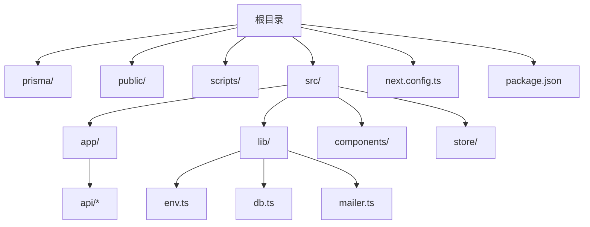
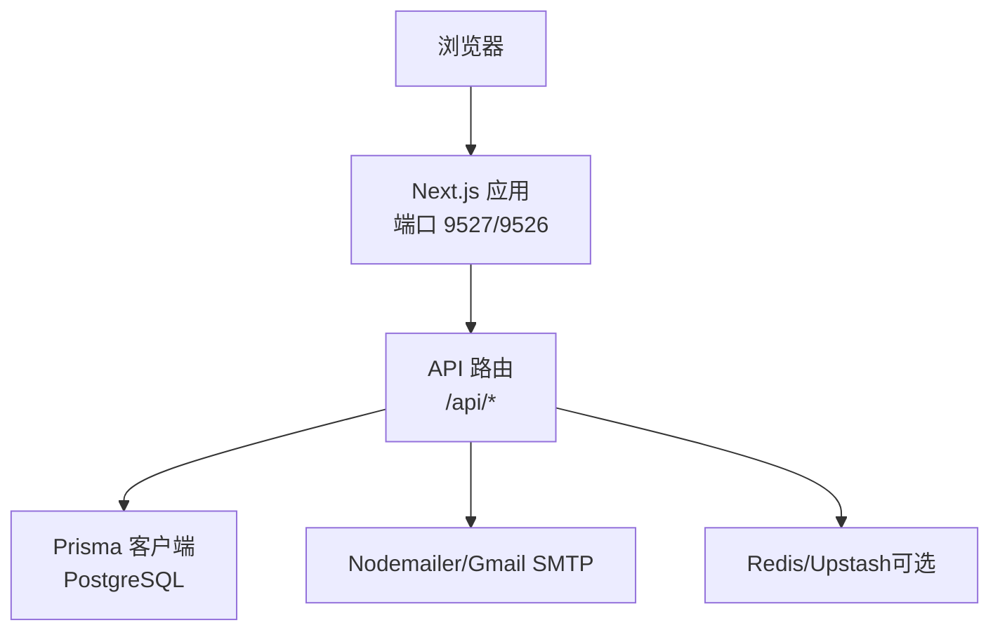
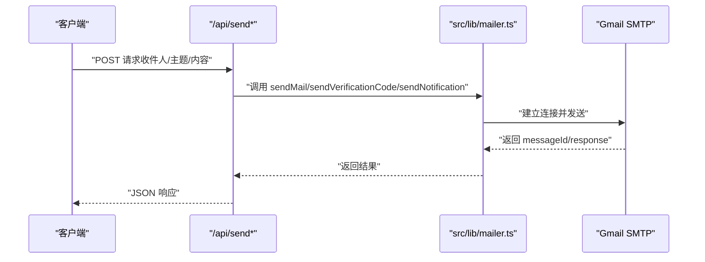
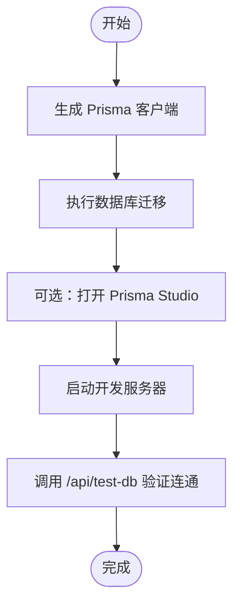
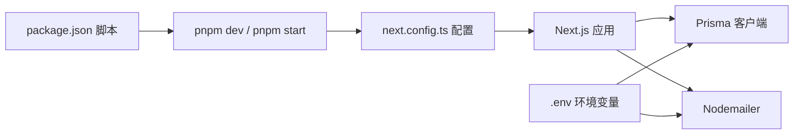

# 快速开始

<cite>
**本文引用的文件**
- [package.json](file://package.json)
- [README.md](file://README.md)
- [.env.example](file://.env.example)
- [MAILER_GUIDE.md](file://MAILER_GUIDE.md)
- [src/lib/env.ts](file://src/lib/env.ts)
- [src/lib/db.ts](file://src/lib/db.ts)
- [prisma/schema.prisma](file://prisma/schema.prisma)
- [next.config.ts](file://next.config.ts)
- [scripts/test-mailer.ts](file://scripts/test-mailer.ts)
- [src/app/api/analytics/track/route.ts](file://src/app/api/analytics/track/route.ts)
- [src/app/api/auth/me/route.ts](file://src/app/api/auth/me/route.ts)
- [src/app/api/test-db/route.ts](file://src/app/api/test-db/route.ts)
</cite>

## 目录
1. [引言](#引言)
2. [项目结构](#项目结构)
3. [核心组件](#核心组件)
4. [架构总览](#架构总览)
5. [详细组件分析](#详细组件分析)
6. [依赖关系分析](#依赖关系分析)
7. [性能注意事项](#性能注意事项)
8. [故障排除指南](#故障排除指南)
9. [结论](#结论)
10. [附录](#附录)

## 引言
本指南面向首次接触“一梦五千年”项目的开发者，目标是在约30分钟内完成从环境准备到本地运行的全流程。你将学到如何安装Node.js与包管理器、准备数据库与Redis、配置Gmail邮件、设置JWT密钥、执行数据库迁移、启动项目，并进行基础功能验证（如邮件发送与数据库连通性）。

## 项目结构
项目采用Next.js App Router架构，核心目录与职责概览如下：
- prisma：数据库模型与迁移
- public：静态资源
- scripts：辅助脚本（如邮件测试、数据库连通性测试）
- src/app：页面与API路由（按功能分组）
- src/lib：通用库（环境变量、数据库、邮件、会话等）
- src/components：UI组件
- src/store：状态管理
- next.config.ts：Next.js构建配置
- package.json：依赖与脚本

图表来源
- [package.json:1-98](file://package.json#L1-L98)
- [next.config.ts:1-16](file://next.config.ts#L1-L16)

章节来源
- [package.json:1-98](file://package.json#L1-L98)
- [next.config.ts:1-16](file://next.config.ts#L1-L16)

## 核心组件
- 环境变量加载：统一从进程环境读取并导出，供各模块使用（Gmail、数据库、Redis、上传、Open API等）
- 数据库：基于Prisma ORM，PostgreSQL作为数据源
- 邮件：基于Nodemailer与Gmail SMTP，支持普通邮件、验证码与通知模板
- Next.js配置：允许构建阶段忽略ESLint与TypeScript错误，便于快速启动

章节来源
- [src/lib/env.ts:1-40](file://src/lib/env.ts#L1-L40)
- [prisma/schema.prisma:1-308](file://prisma/schema.prisma#L1-L308)
- [src/lib/mailer.ts:1-156](file://src/lib/mailer.ts#L1-L156)
- [next.config.ts:1-16](file://next.config.ts#L1-L16)

## 架构总览
下图展示了从浏览器到API、数据库与邮件服务的关键交互路径。

图表来源
- [src/app/api/analytics/track/route.ts:1-54](file://src/app/api/analytics/track/route.ts#L1-L54)
- [src/lib/db.ts:1-16](file://src/lib/db.ts#L1-L16)
- [src/lib/mailer.ts:1-156](file://src/lib/mailer.ts#L1-L156)

## 详细组件分析

### 环境准备与变量配置
- 复制并编辑环境变量文件
  - 复制模板：cp .env.example .env
  - 编辑 .env，至少配置以下项：
    - Gmail：GMAIL_USER、GMAIL_APP_PASSWORD
    - 数据库：DATABASE_URL
    - JWT：JWT_SECRET
    - 端口：PORT（默认9527）
- 环境变量加载与用途
  - src/lib/env.ts集中读取并导出GMAIL_USER、GMAIL_APP_PASSWORD、DATABASE_URL、REDIS_URL、UPLOAD_PROVIDER、OPEN_API_KEYS等
  - src/lib/db.ts使用DATABASE_URL初始化Prisma客户端
  - prisma/schema.prisma通过env("DATABASE_URL")读取数据库连接

章节来源
- [README.md:71-90](file://README.md#L71-L90)
- [.env.example:1-38](file://.env.example#L1-L38)
- [src/lib/env.ts:1-40](file://src/lib/env.ts#L1-L40)
- [src/lib/db.ts:1-16](file://src/lib/db.ts#L1-L16)
- [prisma/schema.prisma:7-13](file://prisma/schema.prisma#L7-L13)

### 邮件系统（Gmail SMTP）
- 配置要点
  - GMAIL_USER：发件人邮箱
  - GMAIL_APP_PASSWORD：应用专用密码（非账户密码）
  - 可选：SITE_NAME/SITE_URL用于邮件模板显示
- 发送能力
  - 普通邮件、验证码邮件、通知邮件
  - 支持附件（通过attachments参数）
- 测试方式
  - 前端：调用 /api/send、/api/send/verification-code、/api/send/notification
  - 服务端：导入 src/lib/mailer.ts 的 sendMail/sendVerificationCode/sendNotification
  - 脚本：npx tsx scripts/test-mailer.ts

图表来源
- [MAILER_GUIDE.md:43-79](file://MAILER_GUIDE.md#L43-L79)
- [src/lib/mailer.ts:31-64](file://src/lib/mailer.ts#L31-L64)

章节来源
- [MAILER_GUIDE.md:11-42](file://MAILER_GUIDE.md#L11-L42)
- [MAILER_GUIDE.md:43-79](file://MAILER_GUIDE.md#L43-L79)
- [MAILER_GUIDE.md:150-158](file://MAILER_GUIDE.md#L150-L158)
- [scripts/test-mailer.ts:1-51](file://scripts/test-mailer.ts#L1-L51)

### 数据库与迁移
- 连接配置
  - DATABASE_URL：PostgreSQL连接串
  - DIRECT_URL：迁移直连（schema.prisma中定义）
- 初始化流程
  - 生成Prisma客户端：npx prisma generate
  - 执行迁移：npx prisma migrate dev
  - 可选：npx prisma studio 打开数据库可视化
- 运行时连接
  - src/lib/db.ts根据DATABASE_URL创建PrismaClient
  - src/app/api/test-db/route.ts提供连通性测试接口

图表来源
- [AGENTS.md:102-113](file://AGENTS.md#L102-L113)
- [src/lib/db.ts:1-16](file://src/lib/db.ts#L1-L16)
- [src/app/api/test-db/route.ts:1-14](file://src/app/api/test-db/route.ts#L1-L14)

章节来源
- [prisma/schema.prisma:7-13](file://prisma/schema.prisma#L7-L13)
- [AGENTS.md:102-113](file://AGENTS.md#L102-L113)
- [src/lib/db.ts:1-16](file://src/lib/db.ts#L1-L16)
- [src/app/api/test-db/route.ts:1-14](file://src/app/api/test-db/route.ts#L1-L14)

### 项目启动与访问
- 安装依赖：pnpm install
- 启动开发服务器：pnpm dev（默认端口9527）
- 访问地址：http://localhost:9527
- 生产构建与启动：pnpm build → pnpm start（默认端口9526）

章节来源
- [README.md:91-101](file://README.md#L91-L101)
- [package.json:5-10](file://package.json#L5-L10)

### 基础功能验证清单
- 邮件功能
  - 使用脚本测试：npx tsx scripts/test-mailer.ts
  - 或在管理后台页面进行测试（参考README中的管理页面指引）
- 数据库连通
  - 访问 /api/test-db，确认返回状态为“ok”
- 认证信息
  - 访问 /api/auth/me，确认未登录返回401或登录后返回当前用户信息

章节来源
- [README.md:108-113](file://README.md#L108-L113)
- [src/app/api/test-db/route.ts:1-14](file://src/app/api/test-db/route.ts#L1-L14)
- [src/app/api/auth/me/route.ts:1-13](file://src/app/api/auth/me/route.ts#L1-L13)

## 依赖关系分析
- 包管理与脚本
  - package.json定义了dev/start/build/lint脚本，开发端口9527，生产端口9526
- Next.js配置
  - next.config.ts允许构建阶段忽略ESLint与TypeScript错误，降低启动门槛
- 数据库与邮件
  - Prisma负责ORM与迁移；Nodemailer负责邮件发送；二者均依赖环境变量

图表来源
- [package.json:5-10](file://package.json#L5-L10)
- [next.config.ts:1-16](file://next.config.ts#L1-L16)
- [src/lib/env.ts:1-40](file://src/lib/env.ts#L1-L40)

章节来源
- [package.json:5-10](file://package.json#L5-L10)
- [next.config.ts:1-16](file://next.config.ts#L1-L16)
- [src/lib/env.ts:1-40](file://src/lib/env.ts#L1-L40)

## 性能注意事项
- 构建阶段忽略ESLint/TS错误仅适用于开发环境，生产构建前建议修复问题
- 数据库查询日志在开发环境开启，生产环境建议关闭以减少日志开销
- 邮件发送属于IO密集型，建议在业务层做好失败重试与幂等处理

## 故障排除指南
- 环境变量缺失
  - 症状：邮件发送报错提示缺少Gmail配置；数据库连接失败
  - 处理：补齐 .env 中的GMAIL_USER、GMAIL_APP_PASSWORD、DATABASE_URL、JWT_SECRET
- 数据库无法连接
  - 症状：/api/test-db返回错误
  - 处理：确认DATABASE_URL正确；先执行 npx prisma generate 与 npx prisma migrate dev
- 邮件发送失败
  - 症状：控制台输出错误日志
  - 处理：核对GMAIL_APP_PASSWORD；使用 npx tsx scripts/test-mailer.ts 进行端到端测试
- 认证相关
  - 症状：/api/auth/me返回401
  - 处理：确认登录状态与会话有效性

章节来源
- [src/lib/mailer.ts:34-36](file://src/lib/mailer.ts#L34-L36)
- [src/app/api/test-db/route.ts:10-13](file://src/app/api/test-db/route.ts#L10-L13)
- [MAILER_GUIDE.md:174-181](file://MAILER_GUIDE.md#L174-L181)

## 结论
按照本指南完成环境准备、数据库迁移与邮件配置后，你可以在30分钟内启动项目并完成基础功能验证。后续可继续阅读项目文档与邮件指南，进一步探索高级功能与最佳实践。

## 附录
- 常用命令速查
  - 安装依赖：pnpm install
  - 生成Prisma客户端：npx prisma generate
  - 执行迁移：npx prisma migrate dev
  - 打开Prisma Studio：npx prisma studio
  - 启动开发：pnpm dev（端口9527）
  - 启动生产：pnpm start（端口9526）
  - 测试邮件：npx tsx scripts/test-mailer.ts
- 管理页面
  - 邮件日志：/dashboard/email-logs
  - 测试页面：/dashboard/test-friend-email

章节来源
- [AGENTS.md:102-113](file://AGENTS.md#L102-L113)
- [README.md:45-48](file://README.md#L45-L48)
- [MAILER_GUIDE.md:150-158](file://MAILER_GUIDE.md#L150-L158)