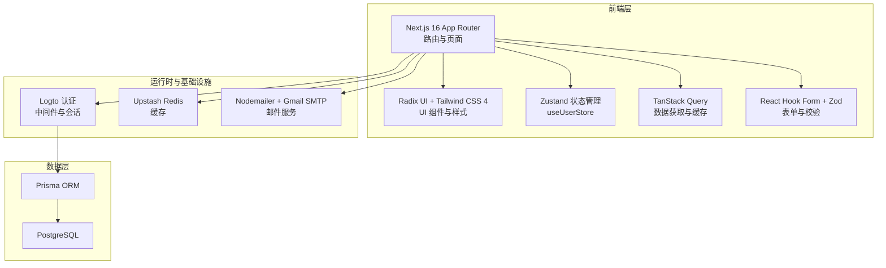
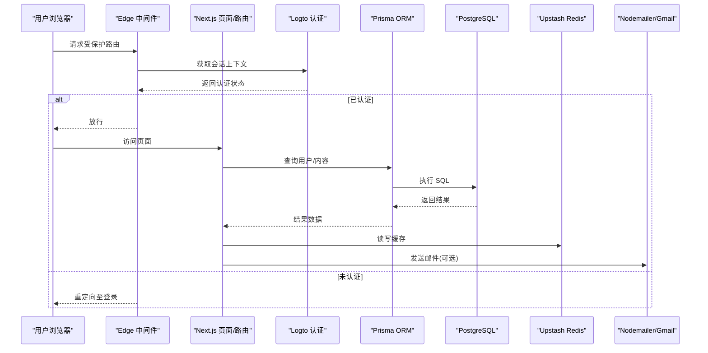
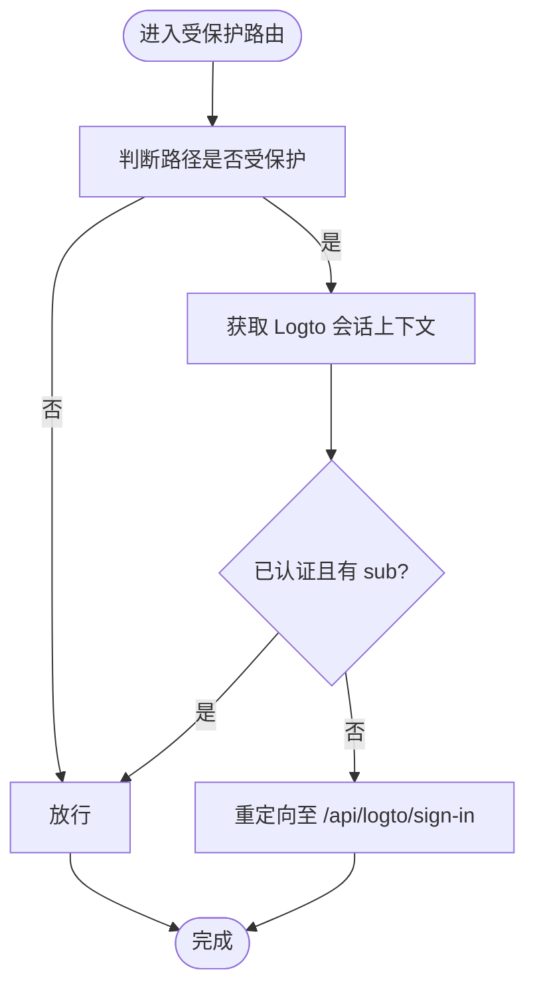
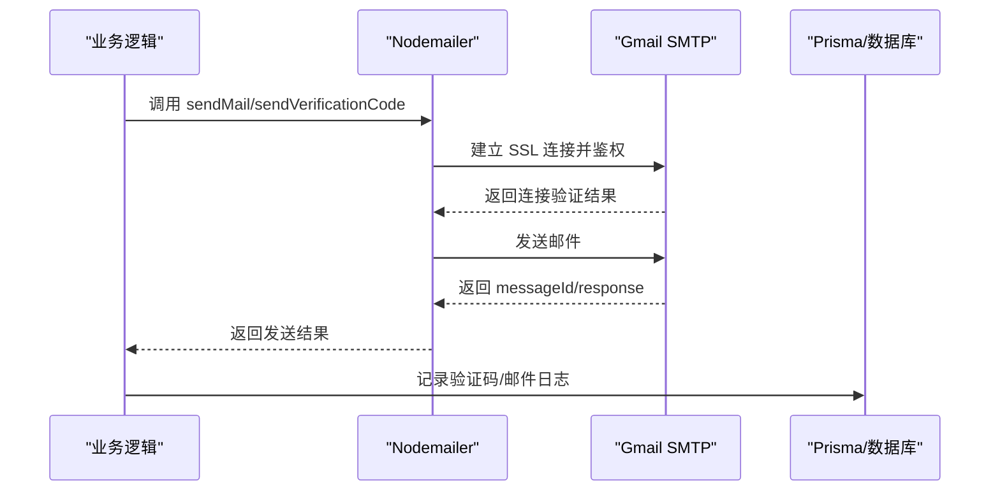
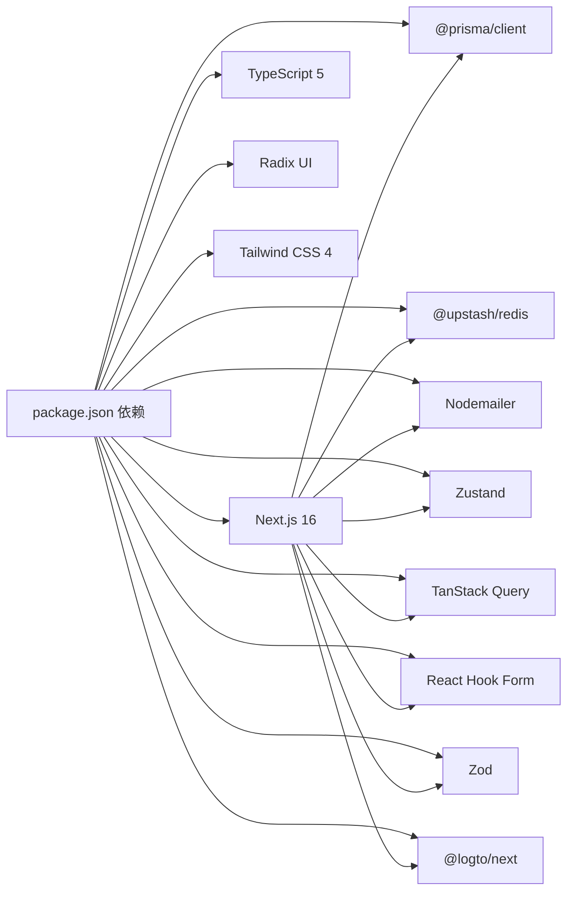

# 技术栈详解

<cite>
**本文引用的文件**
- [package.json](file://package.json)
- [next.config.ts](file://next.config.ts)
- [tsconfig.json](file://tsconfig.json)
- [prisma/schema.prisma](file://prisma/schema.prisma)
- [components.json](file://components.json)
- [src/lib/db.ts](file://src/lib/db.ts)
- [src/lib/upstash-redis.ts](file://src/lib/upstash-redis.ts)
- [src/lib/mailer.ts](file://src/lib/mailer.ts)
- [src/store/user-store.ts](file://src/store/user-store.ts)
- [src/lib/session.ts](file://src/lib/session.ts)
- [src/lib/env.ts](file://src/lib/env.ts)
- [src/lib/logto.ts](file://src/lib/logto.ts)
- [src/lib/utils.ts](file://src/lib/utils.ts)
- [src/middleware.ts](file://src/middleware.ts)
</cite>

## 目录
1. [引言](#引言)
2. [项目结构](#项目结构)
3. [核心组件](#核心组件)
4. [架构总览](#架构总览)
5. [详细组件分析](#详细组件分析)
6. [依赖关系分析](#依赖关系分析)
7. [性能考量](#性能考量)
8. [故障排查指南](#故障排查指南)
9. [结论](#结论)

## 引言
本文件面向“一梦五千年”项目，系统性梳理并解释其技术栈选择与落地实践。内容覆盖前端框架（Next.js 16 App Router）、TypeScript 类型系统、UI 组件体系（Radix UI + Tailwind CSS 4）、数据库（PostgreSQL + Prisma ORM）、缓存（Upstash Redis）、状态管理（Zustand）、数据获取（TanStack Query）、表单与校验（React Hook Form + Zod）、认证与会话（Logto + JWT）、邮件服务（Nodemailer + Gmail SMTP）等。文档同时给出各技术选型的权衡考虑与实际应用价值，并通过图示展示关键流程。

## 项目结构
项目采用 Next.js 16 App Router 的目录组织方式，按功能域划分路由组，配合中间件进行权限控制，使用 Prisma 管理数据库模型与迁移，Tailwind CSS 4 作为样式基础，Radix UI 提供语义化与无障碍的 UI 基元，Zustand 管理前端轻量状态，TanStack Query 负责数据获取与缓存，React Hook Form + Zod 实现表单与参数校验，Logto 提供认证与会话，Nodemailer + Gmail SMTP 实现邮件发送。

图表来源
- [src/middleware.ts:1-36](file://src/middleware.ts#L1-L36)
- [src/lib/session.ts:1-42](file://src/lib/session.ts#L1-L42)
- [src/lib/db.ts:1-16](file://src/lib/db.ts#L1-L16)
- [src/lib/upstash-redis.ts:1-15](file://src/lib/upstash-redis.ts#L1-L15)
- [src/lib/mailer.ts:1-156](file://src/lib/mailer.ts#L1-L156)
- [src/store/user-store.ts:1-49](file://src/store/user-store.ts#L1-L49)

章节来源
- [package.json:11-79](file://package.json#L11-L79)
- [next.config.ts:1-16](file://next.config.ts#L1-L16)
- [tsconfig.json:1-43](file://tsconfig.json#L1-L43)
- [components.json:1-23](file://components.json#L1-L23)

## 核心组件
- Next.js 16 App Router：提供文件系统路由、布局与加载态、边缘中间件、服务器端渲染与静态生成能力，支持严格模式与路径别名。
- TypeScript 5：启用严格模式、增量编译、Bundler 模块解析，结合 Next 内置插件，提升开发体验与类型安全。
- Radix UI + Tailwind CSS 4：Radix 提供语义化、无障碍的 UI 原子组件；Tailwind 4 提供实用优先的样式工具集，配合 shadcn/ui 配置实现一致风格。
- PostgreSQL + Prisma ORM：使用 Prisma Client 生成类型安全的数据库访问层，启用 relationJoins 优化关联查询，支持多环境连接与迁移。
- Upstash Redis：基于 REST 接口的 Redis 客户端，提供键值缓存能力，适配边缘与无服务器场景。
- Zustand：轻量状态管理，用于用户会话与前端局部状态，API 设计简洁，易于集成。
- TanStack Query：服务端数据获取、缓存、并发与去重，支持 SSR/SSG 场景的数据预取与更新。
- React Hook Form + Zod：表单状态管理与参数校验解耦，提升可维护性与类型安全。
- Logto + JWT：基于 OpenID Connect 的认证方案，结合 Edge 中间件进行受保护路由拦截与会话校验。
- Nodemailer + Gmail SMTP：通过应用专用密码与 SSL/TLS 发送邮件，支持附件与模板化 HTML。

章节来源
- [package.json:52](file://package.json#L52)
- [package.json:95](file://package.json#L95)
- [package.json:94](file://package.json#L94)
- [package.json:16](file://package.json#L16)
- [package.json:41](file://package.json#L41)
- [package.json:79](file://package.json#L79)
- [package.json:34](file://package.json#L34)
- [package.json:61](file://package.json#L61)
- [package.json:78](file://package.json#L78)
- [package.json:15](file://package.json#L15)
- [package.json:54](file://package.json#L54)

## 架构总览
下图展示了从浏览器到数据库与外部服务的整体链路，以及认证与缓存的关键节点。

图表来源
- [src/middleware.ts:8-28](file://src/middleware.ts#L8-L28)
- [src/lib/session.ts:17-41](file://src/lib/session.ts#L17-L41)
- [src/lib/db.ts:5-14](file://src/lib/db.ts#L5-L14)
- [src/lib/upstash-redis.ts:5-14](file://src/lib/upstash-redis.ts#L5-L14)
- [src/lib/mailer.ts:31-64](file://src/lib/mailer.ts#L31-L64)

## 详细组件分析

### Next.js 16 App Router
- 版本与特性：Next.js 16.1.4，启用严格模式、路径别名、增量编译与 Bundler 解析，支持 App Router 的布局、加载态、错误边界与边缘中间件。
- 项目落地：按功能域划分路由组，如 (auth)、(site)、dashboard 等；使用中间件统一处理受保护路由与重定向。
- 权衡考虑：App Router 提升了路由组织与数据获取的灵活性，但需要关注 SSR/SSG 的数据预取策略与缓存一致性。

章节来源
- [package.json:52](file://package.json#L52)
- [next.config.ts:1-16](file://next.config.ts#L1-L16)
- [tsconfig.json:14-29](file://tsconfig.json#L14-L29)
- [src/middleware.ts:1-36](file://src/middleware.ts#L1-L36)

### TypeScript 5 类型系统
- 配置要点：严格模式、ESNext 目标、Bundler 解析、React JSX、路径别名、增量编译与 Next 插件集成。
- 实际价值：在 App Router 与 API 路由中提供类型安全的请求/响应定义，减少运行时错误，提升协作效率。

章节来源
- [tsconfig.json:2-29](file://tsconfig.json#L2-L29)

### Radix UI + Tailwind CSS 4
- 组件体系：Radix UI 提供语义化与无障碍的基础组件（对话框、导航菜单、滚动区域等），Tailwind 4 提供实用类与主题变量。
- 集成方式：通过 shadcn/ui 配置文件声明别名与样式主色，确保组件风格一致。
- 实际价值：降低 UI 开发成本，提升可维护性与可访问性。

章节来源
- [package.json:17-31](file://package.json#L17-L31)
- [package.json:94](file://package.json#L94)
- [components.json:1-23](file://components.json#L1-L23)
- [src/lib/utils.ts:1-7](file://src/lib/utils.ts#L1-L7)

### PostgreSQL + Prisma ORM
- 数据库：PostgreSQL，使用 Prisma Client 生成类型安全的查询 API。
- 模型设计：涵盖用户、账户、文章、评论、交互、友链、AI 工具、常规工具、站点访问、验证码、邮件日志等实体，枚举类型覆盖状态与角色。
- 性能优化：启用 relationJoins previewFeature，减少 N+1 查询风险；通过索引优化常见查询路径。
- 迁移与连接：支持 DATABASE_URL 与 DIRECT_URL 分离，便于运行时连接池与迁移直连分离。

章节来源
- [prisma/schema.prisma:1-13](file://prisma/schema.prisma#L1-L13)
- [prisma/schema.prisma:15-62](file://prisma/schema.prisma#L15-L62)
- [prisma/schema.prisma:216-229](file://prisma/schema.prisma#L216-L229)
- [prisma/schema.prisma:231-241](file://prisma/schema.prisma#L231-L241)
- [prisma/schema.prisma:243-260](file://prisma/schema.prisma#L243-L260)
- [src/lib/db.ts:1-16](file://src/lib/db.ts#L1-L16)

### Redis 缓存（Upstash）
- 客户端：@upstash/redis，通过 REST 接口访问，适合边缘与无服务器场景。
- 初始化：按需创建实例，读取环境变量 UPSTASH_REDIS_REST_URL 与 TOKEN。
- 应用场景：会话缓存、热点数据缓存、限流与幂等控制等。

章节来源
- [package.json:41](file://package.json#L41)
- [src/lib/upstash-redis.ts:1-15](file://src/lib/upstash-redis.ts#L1-L15)

### Zustand 状态管理
- 用途：管理用户会话状态（登录态、用户信息、加载状态），支持异步获取与更新。
- 交互：通过 /api/auth/me 获取当前用户，支持登出跳转至 /api/logto/sign-out。
- 优势：API 简洁、无需 Provider 包装，适合轻量前端状态。

章节来源
- [package.json:79](file://package.json#L79)
- [src/store/user-store.ts:1-49](file://src/store/user-store.ts#L1-L49)

### TanStack Query 数据获取
- 作用：统一管理服务端数据获取、缓存、去重与并发控制，支持 SSR/SSG 场景的数据预取。
- 集成点：与 Next.js App Router 协作，在服务端或客户端进行数据拉取与缓存更新。
- 实践建议：为常用查询设置合适的 staleTime/cacheTime，避免过度请求。

章节来源
- [package.json:34](file://package.json#L34)

### React Hook Form + Zod 表单与校验
- 作用：将表单状态与参数校验解耦，利用 Zod 的类型推导保证前后端一致性。
- 集成点：在页面与组件中使用，结合 UI 组件库实现一致的交互体验。
- 实践建议：为每个表单建立独立的 Schema，复用解析器与错误提示。

章节来源
- [package.json:61](file://package.json#L61)
- [package.json:78](file://package.json#L78)
- [package.json:14](file://package.json#L14)

### 认证与会话（Logto + JWT）
- 中间件：Edge 中间件拦截受保护路由，校验会话并重定向未认证用户。
- 服务端：通过 getLogtoContext 获取当前用户上下文，结合 Prisma 查询用户信息。
- 配置：Logto Next 配置包含 endpoint、appId、scopes、baseUrl、cookieSecret、cookieSecure 等。
- 权衡：Edge 中间件具备低延迟与边缘执行优势，适合高并发场景。

图表来源
- [src/middleware.ts:8-28](file://src/middleware.ts#L8-L28)
- [src/lib/session.ts:17-41](file://src/lib/session.ts#L17-L41)
- [src/lib/logto.ts:1-13](file://src/lib/logto.ts#L1-L13)

章节来源
- [package.json:15](file://package.json#L15)
- [src/middleware.ts:1-36](file://src/middleware.ts#L1-L36)
- [src/lib/session.ts:1-42](file://src/lib/session.ts#L1-L42)
- [src/lib/logto.ts:1-13](file://src/lib/logto.ts#L1-L13)

### 邮件系统（Nodemailer + Gmail SMTP）
- 配置：使用 Gmail SMTP（host: smtp.gmail.com, port: 465, secure: true），凭据来自环境变量。
- 功能：支持发送验证码邮件与系统通知邮件，HTML 模板化，支持附件。
- 安全：通过应用专用密码与 SSL/TLS 保障传输安全；在开发环境打印日志便于调试。
- 集成点：与 Prisma 的验证码与邮件日志模型配合，记录发送状态与错误信息。

图表来源
- [src/lib/mailer.ts:17-64](file://src/lib/mailer.ts#L17-L64)
- [src/lib/mailer.ts:67-120](file://src/lib/mailer.ts#L67-L120)
- [src/lib/mailer.ts:123-156](file://src/lib/mailer.ts#L123-L156)
- [prisma/schema.prisma:231-241](file://prisma/schema.prisma#L231-L241)
- [prisma/schema.prisma:243-260](file://prisma/schema.prisma#L243-L260)

章节来源
- [package.json:54](file://package.json#L54)
- [src/lib/mailer.ts:1-156](file://src/lib/mailer.ts#L1-L156)
- [src/lib/env.ts:1-40](file://src/lib/env.ts#L1-L40)

## 依赖关系分析
- 前端依赖：Next.js 16、React 19、Radix UI、Tailwind CSS 4、Zustand、TanStack Query、React Hook Form、Zod、Nodemailer 等。
- 数据层：Prisma Client 与 PostgreSQL；Redis 作为缓存层。
- 认证：Logto 提供 OIDC 认证，Edge 中间件与服务端会话结合。
- 工具与集成：AWS S3、七牛云、Cloudflare R2、腾讯云翻译等作为上传与翻译能力补充。

图表来源
- [package.json:11-79](file://package.json#L11-L79)

章节来源
- [package.json:11-79](file://package.json#L11-L79)

## 性能考量
- 路由与渲染：App Router 支持并行数据获取与 Suspense 边界，建议在页面与布局中合理拆分数据加载，避免阻塞关键路径。
- 数据层：启用 Prisma relationJoins 优化关联查询；为高频查询建立索引；在生产环境开启日志过滤。
- 缓存：结合 Redis 缓存热点数据与会话；为 TanStack Query 设置合理的过期策略，减少重复请求。
- 样式与体积：Tailwind 4 与 shadcn/ui 配置有助于控制组件体积；按需引入 Radix 组件，避免全量打包。
- 认证：Edge 中间件具备低延迟优势，建议将认证与权限判断前置，减少不必要的服务端渲染。

## 故障排查指南
- 认证相关
  - 症状：受保护路由被重定向至登录页
  - 排查：确认 Edge 中间件是否正确获取会话上下文；检查 Logto 配置项（endpoint、appId、baseUrl、cookieSecret）是否完整；确认 Cookie Secure 与域名匹配。
  - 参考
    - [src/middleware.ts:21-25](file://src/middleware.ts#L21-L25)
    - [src/lib/logto.ts:3-12](file://src/lib/logto.ts#L3-L12)
- 数据库相关
  - 症状：开发环境下查询日志过多或生产环境无日志
  - 排查：检查 Prisma 初始化日志级别配置；确认 DATABASE_URL/DIRECT_URL 是否正确；查看迁移锁与迁移状态。
  - 参考
    - [src/lib/db.ts:7-14](file://src/lib/db.ts#L7-L14)
    - [prisma/schema.prisma:7-13](file://prisma/schema.prisma#L7-L13)
- 缓存相关
  - 症状：Redis 无法初始化或返回 null
  - 排查：确认 UPSTASH_REDIS_REST_URL 与 TOKEN 是否设置；检查网络可达性与配额。
  - 参考
    - [src/lib/upstash-redis.ts:5-14](file://src/lib/upstash-redis.ts#L5-L14)
- 邮件相关
  - 症状：发送失败或连接验证失败
  - 排查：确认 GMAIL_USER 与 GMAIL_APP_PASSWORD；检查 Gmail 安全设置与应用专用密码；查看错误日志与邮件日志表。
  - 参考
    - [src/lib/mailer.ts:31-64](file://src/lib/mailer.ts#L31-L64)
    - [src/lib/env.ts:3-6](file://src/lib/env.ts#L3-L6)
    - [prisma/schema.prisma:243-260](file://prisma/schema.prisma#L243-L260)

## 结论
本项目在技术选型上强调“类型安全 + 开发体验 + 可维护性”，通过 Next.js 16 App Router、TypeScript、Radix UI + Tailwind CSS 4、Prisma ORM、Zustand、TanStack Query、React Hook Form + Zod、Logto + JWT、Nodemailer + Gmail SMTP 等组合，构建了现代化、模块化的全栈方案。在工程实践中，建议持续关注数据模型演进、缓存策略与认证安全，以支撑业务的长期发展。