# AI工具平台

<cite>
**本文档引用的文件**
- [README.md](file://README.md)
- [package.json](file://package.json)
- [tsconfig.json](file://tsconfig.json)
- [src/app/(site)/ai-platform/page.tsx](file://src/app/(site)/ai-platform/page.tsx)
- [src/app/(site)/ai-platform/components/ai-tools-wrapper.tsx](file://src/app/(site)/ai-platform/components/ai-tools-wrapper.tsx)
- [src/app/(site)/ai-platform/actions.ts](file://src/app/(site)/ai-platform/actions.ts)
- [src/app/dashboard/ai-tools/page.tsx](file://src/app/dashboard/ai-tools/page.tsx)
- [src/app/dashboard/ai-tools/components/ai-tools-wrapper.tsx](file://src/app/dashboard/ai-tools/components/ai-tools-wrapper.tsx)
- [src/app/dashboard/ai-tools/actions.ts](file://src/app/dashboard/ai-tools/actions.ts)
- [src/app/dashboard/categories/page.tsx](file://src/app/dashboard/categories/page.tsx)
- [src/app/dashboard/categories/components/categories-wrapper.tsx](file://src/app/dashboard/categories/components/categories-wrapper.tsx)
- [src/app/dashboard/categories/actions.ts](file://src/app/dashboard/categories/actions.ts)
- [src/app/dashboard/friend-links/components/friend-links-wrapper.tsx](file://src/app/dashboard/friend-links/components/friend-links-wrapper.tsx)
- [src/app/dashboard/friend-links/actions.ts](file://src/app/dashboard/friend-links/actions.ts)
- [src/lib/email-service.ts](file://src/lib/email-service.ts)
- [src/lib/logto.ts](file://src/lib/logto.ts)
- [src/lib/session.ts](file://src/lib/session.ts)
- [src/store/user-store.ts](file://src/store/user-store.ts)
- [src/middleware.ts](file://src/middleware.ts)
- [prisma/schema.prisma](file://prisma/schema.prisma)
</cite>

## 目录
1. [介绍](#介绍)
2. [项目结构](#项目结构)
3. [核心组件](#核心组件)
4. [架构概览](#架构概览)
5. [详细组件分析](#详细组件分析)
6. [依赖关系分析](#依赖关系分析)
7. [性能考虑](#性能考虑)
8. [故障排除指南](#故障排除指南)
9. [结论](#结论)
10. [附录](#附录)

## 介绍
AI工具平台是一个基于Next.js 16.1.4的应用程序，提供AI工具的展示、申请、管理和审核功能。该平台集成了用户认证、博客管理、实用工具箱、友链管理和邮件通知系统等核心功能。

### 核心特性
- **AI工具展示系统**：展示经过审核的AI工具，支持分类筛选和搜索功能
- **申请管理系统**：用户可以提交AI工具申请，等待管理员审核
- **审核流程**：管理员可以批准或拒绝AI工具申请
- **权限控制系统**：基于角色的访问控制，区分普通用户和管理员
- **邮件通知系统**：自动发送友链审核结果通知邮件
- **工具分类管理**：支持对AI工具进行分类管理
- **使用统计**：提供网站访问统计和用户行为追踪

## 项目结构
该项目采用Next.js App Router架构，主要目录结构如下：

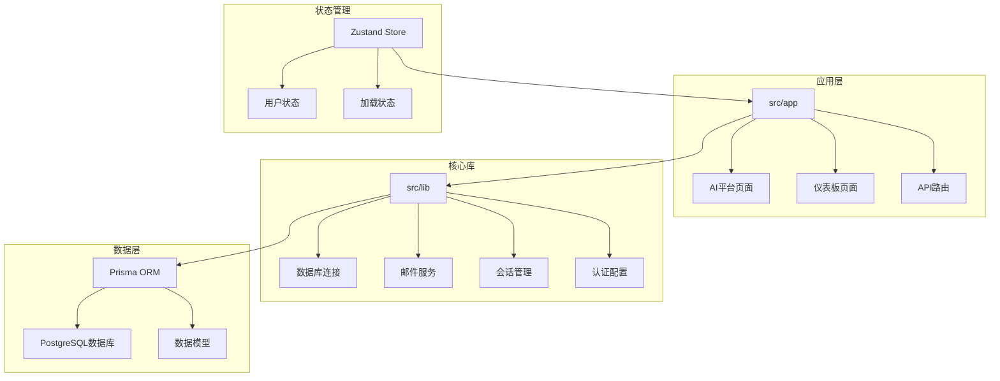

**图表来源**
- [src/app/(site)/ai-platform/page.tsx](file://src/app/(site)/ai-platform/page.tsx#L1-L22)
- [src/app/dashboard/ai-tools/page.tsx:1-33](file://src/app/dashboard/ai-tools/page.tsx#L1-L33)
- [src/lib/email-service.ts:1-215](file://src/lib/email-service.ts#L1-L215)

**章节来源**
- [README.md:54-69](file://README.md#L54-L69)
- [package.json](file://package.json)
- [tsconfig.json](file://tsconfig.json)

## 核心组件
平台的核心组件包括AI工具展示系统、申请管理、审核流程、权限控制和邮件通知系统。

### AI工具展示系统
AI工具展示系统负责向用户展示经过审核的AI工具，支持多种筛选和搜索功能。

### 申请管理系统
用户可以通过申请表单提交新的AI工具，系统会自动验证输入数据并保存到数据库中。

### 审核流程
管理员可以查看待审核的AI工具申请，进行批准或拒绝操作，并通过邮件通知申请人。

### 权限控制系统
基于Logto的身份认证系统，支持用户注册、登录和权限管理。

### 邮件通知系统
自动发送友链审核结果通知邮件，包含IP限制和失败重试机制。

**章节来源**
- [src/app/(site)/ai-platform/actions.ts:16-58](file://src/app/(site)/ai-platform/actions.ts#L16-L58)
- [src/app/dashboard/ai-tools/actions.ts:80-144](file://src/app/dashboard/ai-tools/actions.ts#L80-L144)
- [src/lib/email-service.ts:58-123](file://src/lib/email-service.ts#L58-L123)

## 架构概览
平台采用分层架构设计，从底层的数据存储到顶层的用户界面，各层职责明确且相互独立。

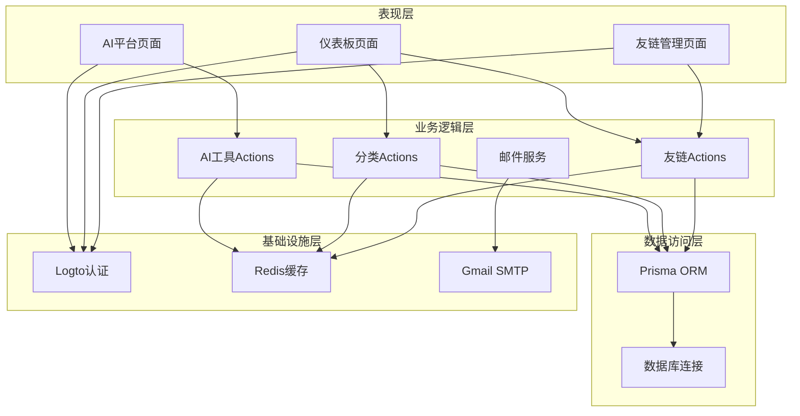

**图表来源**
- [src/app/(site)/ai-platform/actions.ts](file://src/app/(site)/ai-platform/actions.ts)
- [src/app/dashboard/ai-tools/actions.ts](file://src/app/dashboard/ai-tools/actions.ts)
- [src/lib/email-service.ts](file://src/lib/email-service.ts)
- [src/lib/logto.ts](file://src/lib/logto.ts)

## 详细组件分析

### AI工具展示系统分析

#### 展示组件架构
AI工具展示系统采用React组件模式，通过Wrapper组件和客户端组件分离数据获取和渲染逻辑。

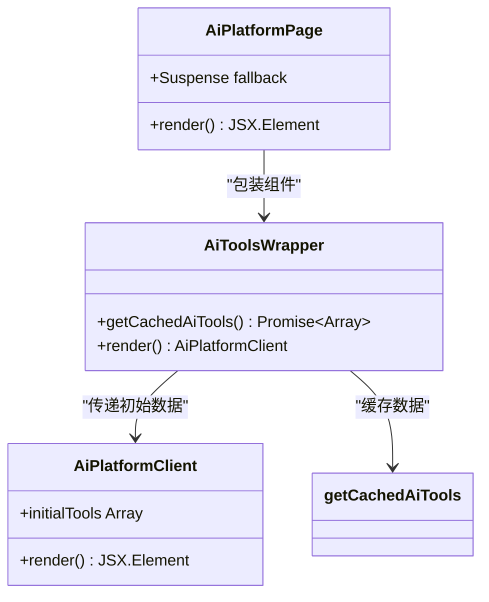

**图表来源**
- [src/app/(site)/ai-platform/components/ai-tools-wrapper.tsx](file://src/app/(site)/ai-platform/components/ai-tools-wrapper.tsx#L1-L13)
- [src/app/(site)/ai-platform/page.tsx](file://src/app/(site)/ai-platform/page.tsx#L1-L22)

#### 数据获取流程
系统使用React缓存机制优化数据获取性能，避免重复查询数据库。

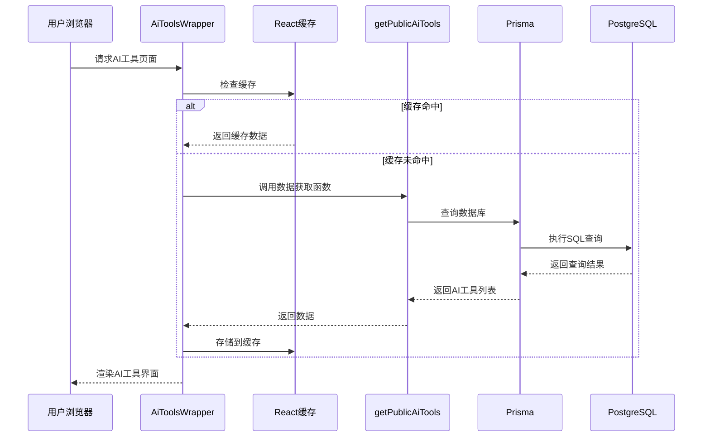

**图表来源**
- [src/app/(site)/ai-platform/components/ai-tools-wrapper.tsx](file://src/app/(site)/ai-platform/components/ai-tools-wrapper.tsx#L5-L8)
- [src/app/(site)/ai-platform/actions.ts](file://src/app/(site)/ai-platform/actions.ts#L29-L57)

**章节来源**
- [src/app/(site)/ai-platform/components/ai-tools-wrapper.tsx:1-13](file://src/app/(site)/ai-platform/components/ai-tools-wrapper.tsx#L1-L13)
- [src/app/(site)/ai-platform/actions.ts:29-58](file://src/app/(site)/ai-platform/actions.ts#L29-L58)

### 申请管理功能分析

#### 申请表单设计
申请表单使用Zod进行数据验证，确保提交数据的有效性。

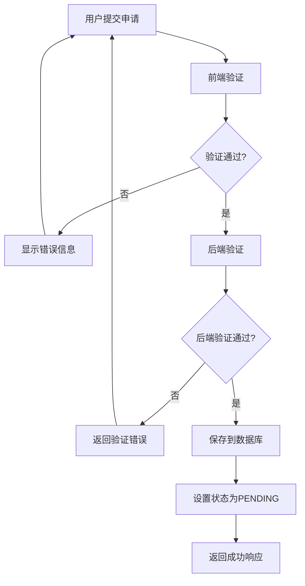

**图表来源**
- [src/app/(site)/ai-platform/actions.ts](file://src/app/(site)/ai-platform/actions.ts#L6-L27)

#### 申请处理流程
管理员可以查看和处理所有AI工具申请，支持批量操作和状态更新。

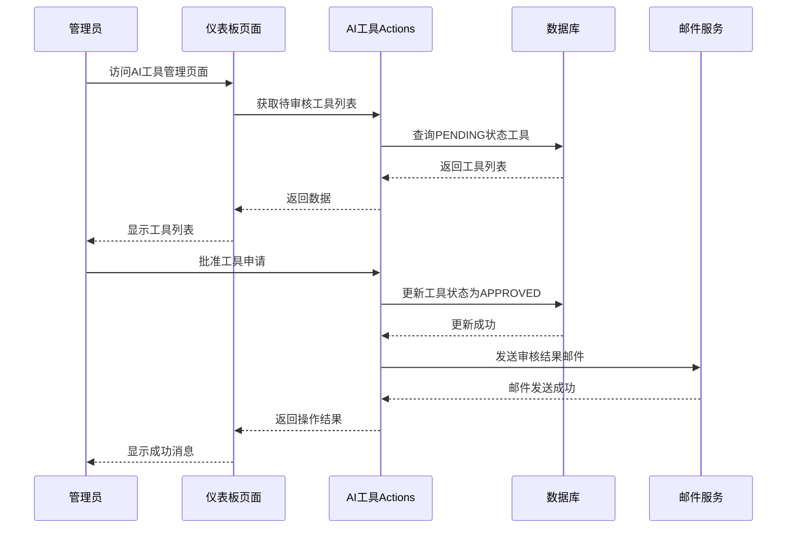

**图表来源**
- [src/app/dashboard/ai-tools/actions.ts:121-131](file://src/app/dashboard/ai-tools/actions.ts#L121-L131)
- [src/lib/email-service.ts:58-123](file://src/lib/email-service.ts#L58-L123)

**章节来源**
- [src/app/(site)/ai-platform/actions.ts:6-27](file://src/app/(site)/ai-platform/actions.ts#L6-L27)
- [src/app/dashboard/ai-tools/actions.ts:10-29](file://src/app/dashboard/ai-tools/actions.ts#L10-L29)

### 审核流程分析

#### 审核状态管理
系统使用状态枚举管理AI工具的不同状态，确保数据一致性。

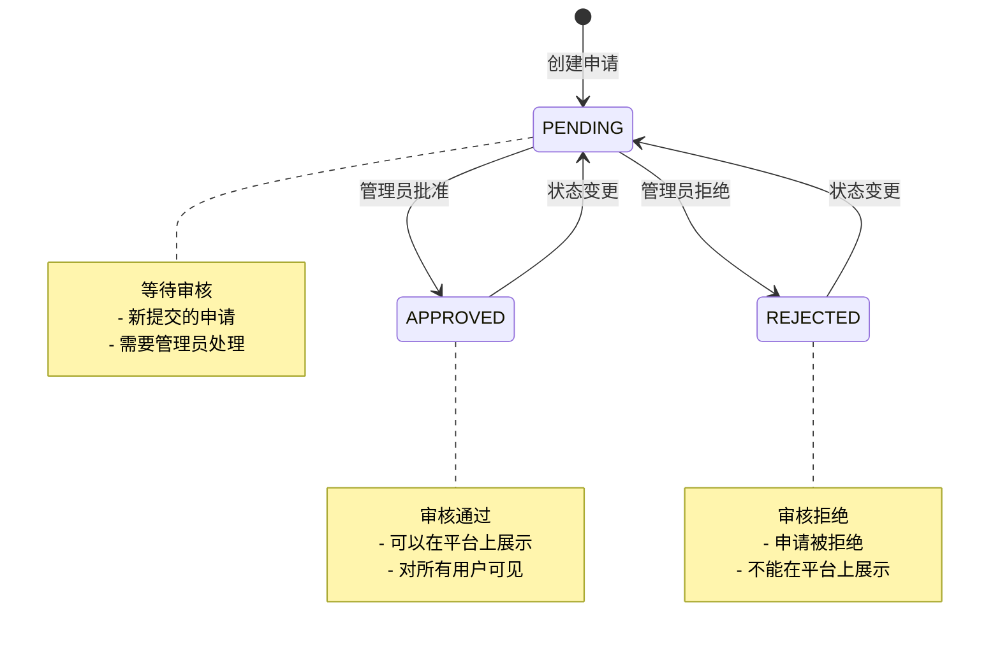

**图表来源**
- [prisma/schema.prisma:284-288](file://prisma/schema.prisma#L284-L288)

#### 审核操作实现
管理员可以通过仪表板执行各种审核操作，系统会自动更新相关缓存。

**章节来源**
- [src/app/dashboard/ai-tools/actions.ts:121-144](file://src/app/dashboard/ai-tools/actions.ts#L121-L144)
- [prisma/schema.prisma:284-288](file://prisma/schema.prisma#L284-L288)

### 权限控制分析

#### 认证系统架构
平台使用Logto作为身份认证提供商，支持OAuth 2.0协议和JWT令牌。

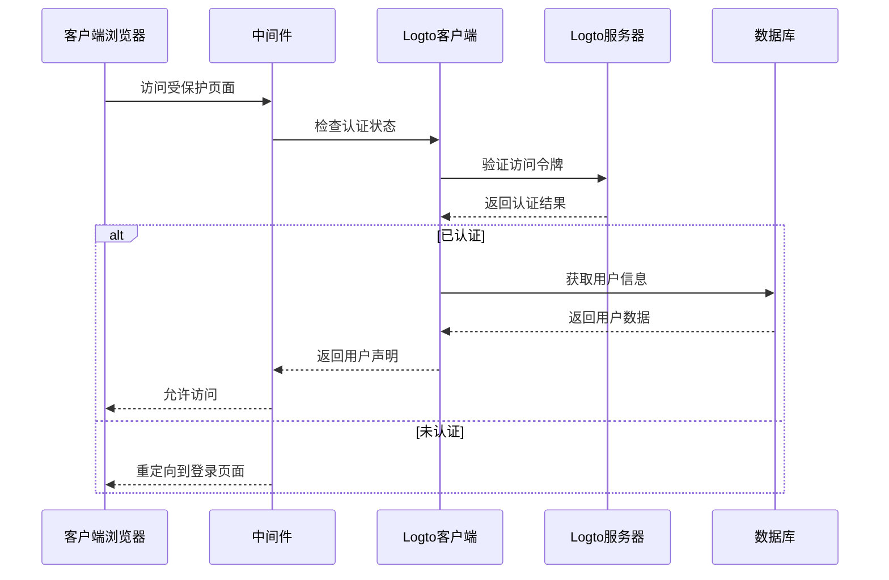

**图表来源**
- [src/middleware.ts:8-28](file://src/middleware.ts#L8-L28)
- [src/lib/logto.ts:1-13](file://src/lib/logto.ts#L1-L13)

#### 用户权限管理
系统支持基于角色的权限控制，区分普通用户和管理员用户。

**章节来源**
- [src/middleware.ts:15-28](file://src/middleware.ts#L15-L28)
- [src/lib/session.ts:17-41](file://src/lib/session.ts#L17-L41)

### 邮件通知系统分析

#### 邮件发送流程
邮件系统实现了完整的邮件发送、记录和重试机制。

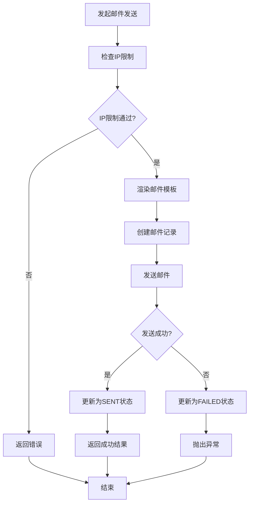

**图表来源**
- [src/lib/email-service.ts:11-55](file://src/lib/email-service.ts#L11-L55)

#### IP限制和防滥用机制
系统实现了智能的IP限制策略，平衡用户体验和防滥用需求。

**章节来源**
- [src/lib/email-service.ts:11-55](file://src/lib/email-service.ts#L11-L55)
- [src/lib/email-service.ts:159-214](file://src/lib/email-service.ts#L159-L214)

### 工具分类管理分析

#### 分类管理功能
系统提供了完整的分类管理功能，支持分类的增删改查操作。

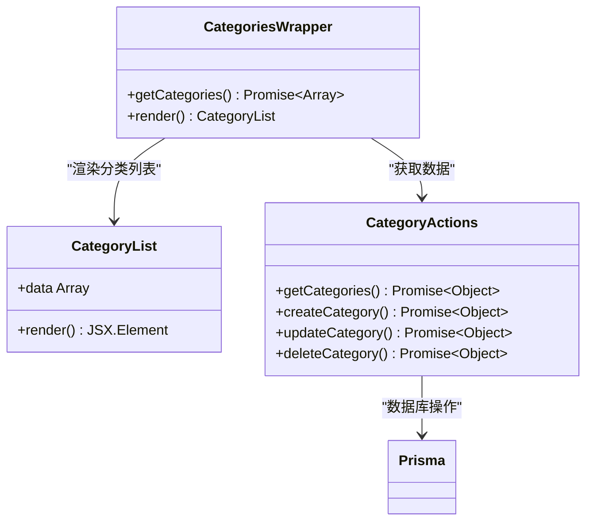

**图表来源**
- [src/app/dashboard/categories/components/categories-wrapper.tsx:1-9](file://src/app/dashboard/categories/components/categories-wrapper.tsx#L1-L9)
- [src/app/dashboard/categories/actions.ts:1-96](file://src/app/dashboard/categories/actions.ts#L1-L96)

**章节来源**
- [src/app/dashboard/categories/actions.ts:33-95](file://src/app/dashboard/categories/actions.ts#L33-L95)

## 依赖关系分析

### 技术栈依赖
平台采用了现代化的技术栈，各组件之间的依赖关系清晰明确。

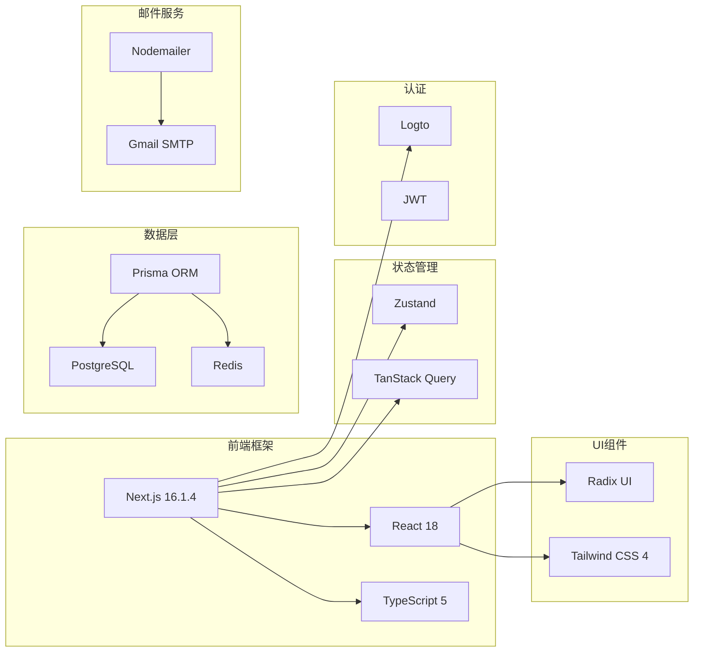

**图表来源**
- [package.json](file://package.json)
- [README.md:16-27](file://README.md#L16-L27)

### 数据模型关系
系统使用Prisma ORM管理复杂的数据关系，支持多对多和一对多关系。

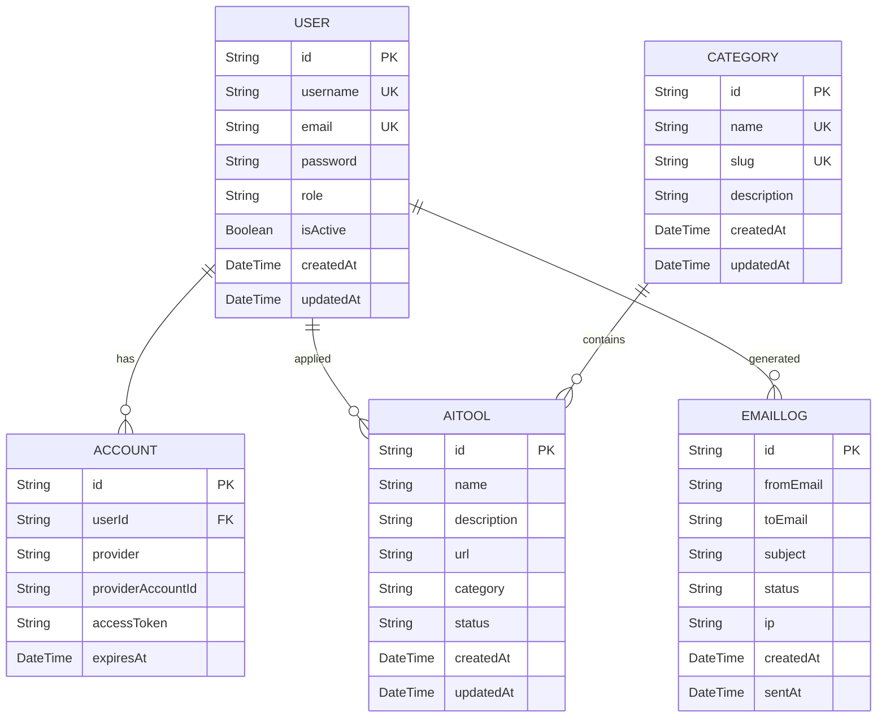

**图表来源**
- [prisma/schema.prisma:15-62](file://prisma/schema.prisma#L15-L62)
- [prisma/schema.prisma:184-198](file://prisma/schema.prisma#L184-L198)
- [prisma/schema.prisma:84-96](file://prisma/schema.prisma#L84-L96)
- [prisma/schema.prisma:243-260](file://prisma/schema.prisma#L243-L260)

**章节来源**
- [prisma/schema.prisma:15-308](file://prisma/schema.prisma#L15-L308)

## 性能考虑

### 缓存策略
系统实现了多层次的缓存策略来提升性能：

1. **React缓存**：使用`React.cache`避免重复的数据获取
2. **Next.js缓存**：使用`unstable_cache`缓存昂贵的操作
3. **数据库查询缓存**：Prisma的relationJoins优化关联查询

### 数据库优化
- 使用索引优化常用查询字段
- 采用relationJoins减少N+1查询问题
- 实现分页查询避免大量数据传输

### 前端性能优化
- Suspense懒加载提升首屏加载速度
- 按需渲染组件减少DOM节点数量
- 使用Zustand轻量级状态管理

## 故障排除指南

### 常见问题及解决方案

#### 认证相关问题
- **问题**：用户无法登录
- **原因**：Logto配置错误或网络问题
- **解决**：检查环境变量配置和网络连接

#### 数据库连接问题
- **问题**：查询超时或连接失败
- **原因**：数据库连接池配置不当
- **解决**：调整连接参数和增加连接数

#### 邮件发送失败
- **问题**：邮件发送失败
- **原因**：Gmail配置错误或IP限制
- **解决**：检查SMTP配置和IP限制规则

**章节来源**
- [src/lib/email-service.ts:11-55](file://src/lib/email-service.ts#L11-L55)
- [src/lib/logto.ts:1-13](file://src/lib/logto.ts#L1-L13)

## 结论
AI工具平台是一个功能完整、架构清晰的现代化Web应用程序。平台成功集成了AI工具展示、申请管理、审核流程、权限控制和邮件通知等多个核心功能模块。通过采用先进的技术栈和最佳实践，平台在性能、可维护性和用户体验方面都表现出色。

主要优势包括：
- 清晰的分层架构设计
- 完善的权限控制机制
- 高效的缓存策略
- 可扩展的数据模型
- 用户友好的界面设计

未来可以考虑的功能增强包括：
- 添加AI工具使用统计功能
- 实现更精细的权限控制
- 增强搜索和过滤功能
- 添加多语言支持

## 附录

### 环境变量配置
平台需要以下环境变量才能正常运行：

- `DATABASE_URL`: PostgreSQL数据库连接字符串
- `GMAIL_USER`: Gmail账户用户名
- `GMAIL_APP_PASSWORD`: Gmail应用专用密码
- `LOGTO_ENDPOINT`: Logto认证服务端点
- `LOGTO_APP_ID`: Logto应用ID
- `LOGTO_BASE_URL`: Logto基础URL
- `LOGTO_COOKIE_SECRET`: Logto Cookie密钥
- `JWT_SECRET`: JWT令牌密钥

### API端点说明
- `/api/auth/me`: 获取当前用户信息
- `/api/send/notification`: 发送系统通知
- `/api/send/verification-code`: 发送验证码
- `/api/logto/callback`: Logto回调处理
- `/api/logto/sign-in`: 用户登录
- `/api/logto/sign-out`: 用户登出

### 开发指南
- 使用TypeScript进行类型安全编程
- 遵循组件命名规范（PascalCase）
- 采用模块化的文件组织方式
- 使用Zod进行数据验证
- 实现完整的错误处理机制