# 博客管理系统

<cite>
**本文档引用的文件**
- [README.md](file://README.md)
- [src/app/layout.tsx](file://src/app/layout.tsx)
- [src/lib/db.ts](file://src/lib/db.ts)
- [prisma/schema.prisma](file://prisma/schema.prisma)
- [package.json](file://package.json)
- [src/app/dashboard/posts/page.tsx](file://src/app/dashboard/posts/page.tsx)
- [src/app/editor/[id]/page.tsx](file://src/app/editor/[id]/page.tsx)
- [src/app/dashboard/posts/actions.ts](file://src/app/dashboard/posts/actions.ts)
- [src/app/api/open/posts/route.ts](file://src/app/api/open/posts/route.ts)
- [src/app/(site)/graph/[slug]/page.tsx](file://src/app/(site)/graph/[slug]/page.tsx)
- [src/app/dashboard/posts/schema.ts](file://src/app/dashboard/posts/schema.ts)
- [src/app/dashboard/categories/actions.ts](file://src/app/dashboard/categories/actions.ts)
- [src/app/dashboard/comments/actions.ts](file://src/app/dashboard/comments/actions.ts)
- [src/app/dashboard/posts/components/posts-wrapper.tsx](file://src/app/dashboard/posts/components/posts-wrapper.tsx)
</cite>

## 目录
1. [引言](#引言)
2. [项目结构](#项目结构)
3. [核心组件](#核心组件)
4. [架构概览](#架构概览)
5. [详细组件分析](#详细组件分析)
6. [依赖关系分析](#依赖关系分析)
7. [性能考虑](#性能考虑)
8. [故障排除指南](#故障排除指南)
9. [结论](#结论)

## 引言

博客管理系统是一个基于 Next.js 16.1.4 的现代化全栈应用，集成了完整的博客管理功能。该系统提供了从内容创作到发布的全流程管理，包括文章管理、分类系统、标签管理、评论互动、SEO优化等核心功能。

### 核心特性

- **用户系统**: 完整的用户注册、登录、权限管理
- **博客管理**: 文章发布、分类、标签、评论系统
- **AI 工具库**: AI 工具的收集、审核和展示
- **实用工具箱**: Base64 转换、二维码生成、抽奖等在线工具
- **友链管理**: 友情链接的审核和管理
- **邮件系统**: Gmail 邮件发送（验证码、通知、自定义邮件）
- **数据分析**: 网站访问统计和用户行为追踪
- **响应式设计**: 深色主题，移动端适配

### 技术栈

- **框架**: Next.js 16.1.4 (App Router)
- **语言**: TypeScript 5
- **UI 组件**: Radix UI + Tailwind CSS 4
- **数据库**: PostgreSQL (使用 Prisma ORM)
- **缓存**: Redis (ioredis)
- **状态管理**: Zustand
- **数据获取**: TanStack Query
- **表单**: React Hook Form + Zod 验证
- **认证**: JWT + Argon2 密码哈希
- **邮件**: Nodemailer + Gmail SMTP

## 项目结构

该项目采用 Next.js App Router 的现代目录结构，主要分为以下几个核心部分：

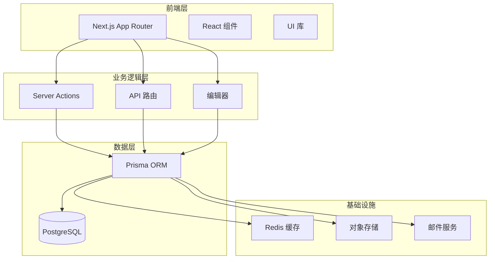

**图表来源**
- [src/app/layout.tsx:26-51](file://src/app/layout.tsx#L26-L51)
- [src/lib/db.ts:1-16](file://src/lib/db.ts#L1-L16)

**章节来源**
- [README.md:54-69](file://README.md#L54-L69)
- [src/app/layout.tsx:1-52](file://src/app/layout.tsx#L1-L52)

## 核心组件

### 数据模型架构

系统基于 Prisma ORM 设计了完整的博客数据模型，包括用户、文章、分类、标签、评论等核心实体：

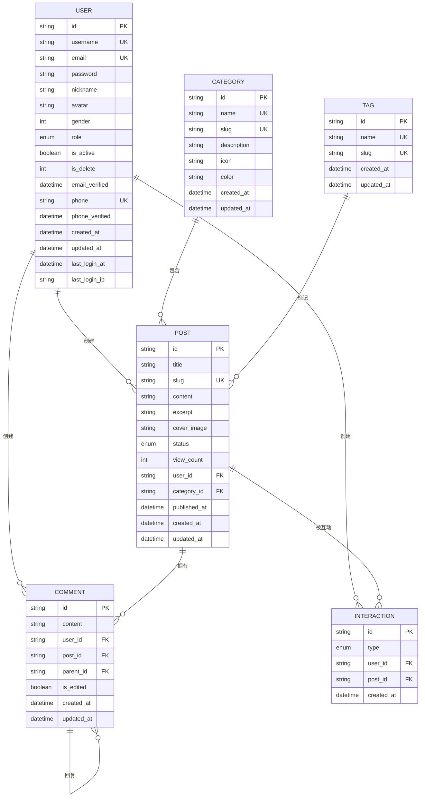

**图表来源**
- [prisma/schema.prisma:15-167](file://prisma/schema.prisma#L15-L167)

### 缓存策略

系统实现了多层次的缓存策略来优化性能：

- **Server Action 缓存**: 使用 `unstable_cache` 实现 5 分钟缓存
- **标签缓存**: 使用 `revalidateTag` 和 `revalidatePath` 实现精确缓存失效
- **客户端查询缓存**: 使用 TanStack Query 实现智能缓存和更新

**章节来源**
- [src/app/dashboard/posts/actions.ts:24-68](file://src/app/dashboard/posts/actions.ts#L24-L68)
- [src/app/dashboard/categories/actions.ts:9-27](file://src/app/dashboard/categories/actions.ts#L9-L27)

## 架构概览

### 整体架构流程

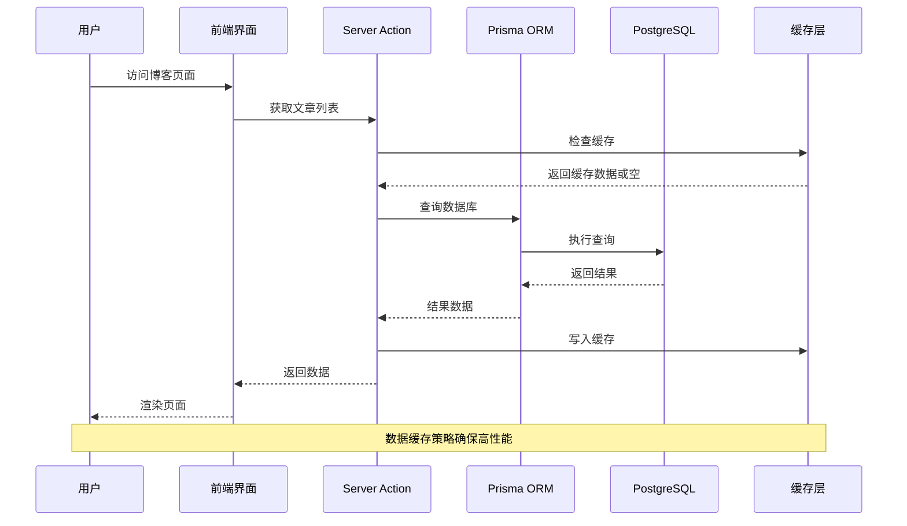

**图表来源**
- [src/app/dashboard/posts/actions.ts:24-72](file://src/app/dashboard/posts/actions.ts#L24-L72)
- [src/lib/db.ts:5-14](file://src/lib/db.ts#L5-L14)

### API 架构设计

系统提供了两种主要的 API 接口：

1. **管理后台 API**: 用于后台管理操作
2. **开放 API**: 供外部系统调用

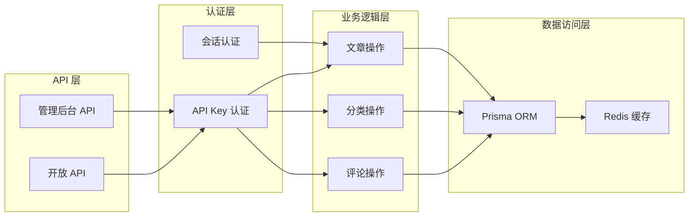

**图表来源**
- [src/app/api/open/posts/route.ts:10-193](file://src/app/api/open/posts/route.ts#L10-L193)
- [src/app/dashboard/posts/actions.ts:1-165](file://src/app/dashboard/posts/actions.ts#L1-L165)

**章节来源**
- [src/app/api/open/posts/route.ts:1-193](file://src/app/api/open/posts/route.ts#L1-L193)
- [src/app/dashboard/posts/actions.ts:1-165](file://src/app/dashboard/posts/actions.ts#L1-L165)

## 详细组件分析

### 文章管理系统

#### 文章 CRUD 操作

文章管理是系统的核心功能，提供了完整的 CRUD 操作：

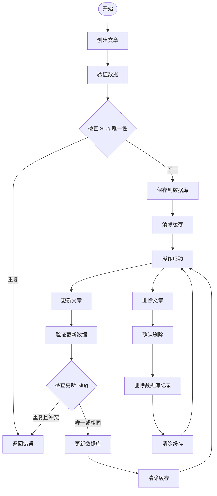

**图表来源**
- [src/app/dashboard/posts/actions.ts:74-132](file://src/app/dashboard/posts/actions.ts#L74-L132)

##### 文章状态管理

系统支持三种文章状态：
- **DRAFT**: 草稿状态，仅作者可见
- **PUBLISHED**: 已发布状态，公开可见
- **ARCHIVED**: 归档状态，用于历史文章管理

##### 权限控制

文章操作实施了严格的权限控制：
- 作者只能编辑自己的文章
- 管理员拥有完全权限
- 删除操作需要额外的安全确认

**章节来源**
- [src/app/dashboard/posts/actions.ts:74-132](file://src/app/dashboard/posts/actions.ts#L74-L132)
- [src/app/editor/[id]/page.tsx:27-31](file://src/app/editor/[id]/page.tsx#L27-L31)

#### 富文本编辑器集成

系统集成了现代化的富文本编辑器，支持：

- **Markdown 支持**: 原生 Markdown 语法支持
- **实时预览**: 编辑器与预览区域实时同步
- **图片上传**: 支持本地图片和云端存储
- **代码高亮**: 多语言代码块高亮显示
- **表格编辑**: 支持复杂表格的创建和编辑

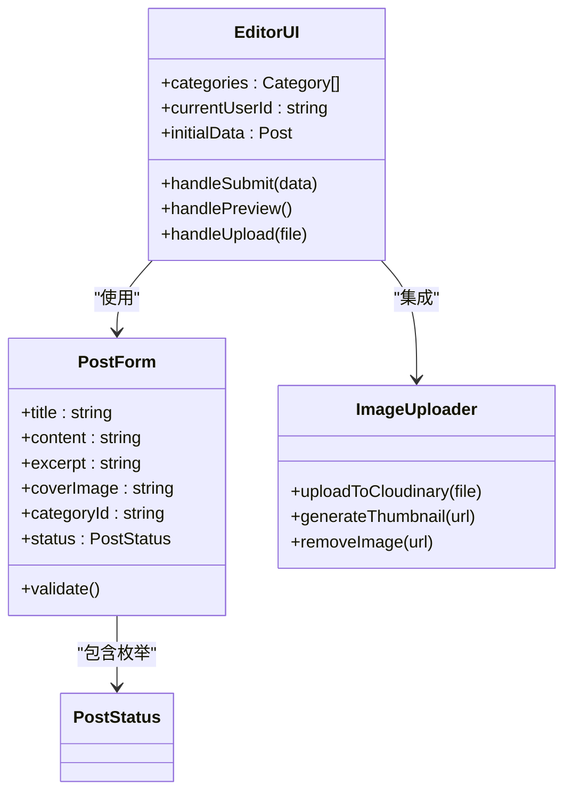

**图表来源**
- [src/app/editor/[id]/page.tsx:38-50](file://src/app/editor/[id]/page.tsx#L38-L50)

**章节来源**
- [src/app/editor/[id]/page.tsx:1-52](file://src/app/editor/[id]/page.tsx#L1-L52)

### 分类系统

#### 分类管理架构

分类系统提供了灵活的内容组织方式：

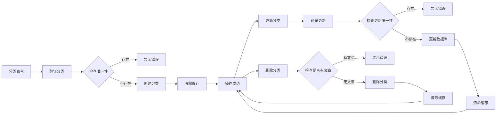

**图表来源**
- [src/app/dashboard/categories/actions.ts:33-95](file://src/app/dashboard/categories/actions.ts#L33-L95)

##### 分类特性

- **唯一性保证**: 分类名称和 Slug 全局唯一
- **层级关系**: 支持多级分类嵌套
- **统计功能**: 自动统计每个分类下的文章数量
- **图标支持**: 支付分类图标和颜色标识

**章节来源**
- [src/app/dashboard/categories/actions.ts:1-96](file://src/app/dashboard/categories/actions.ts#L1-L96)

### 标签管理

#### 标签系统设计

标签系统提供了细粒度的内容标记功能：

- **轻量级标记**: 相比分类更加灵活
- **全文检索**: 支持按标签快速查找文章
- **热度统计**: 可统计标签使用频率
- **自动完成**: 输入时提供标签建议

### 评论互动系统

#### 评论架构设计

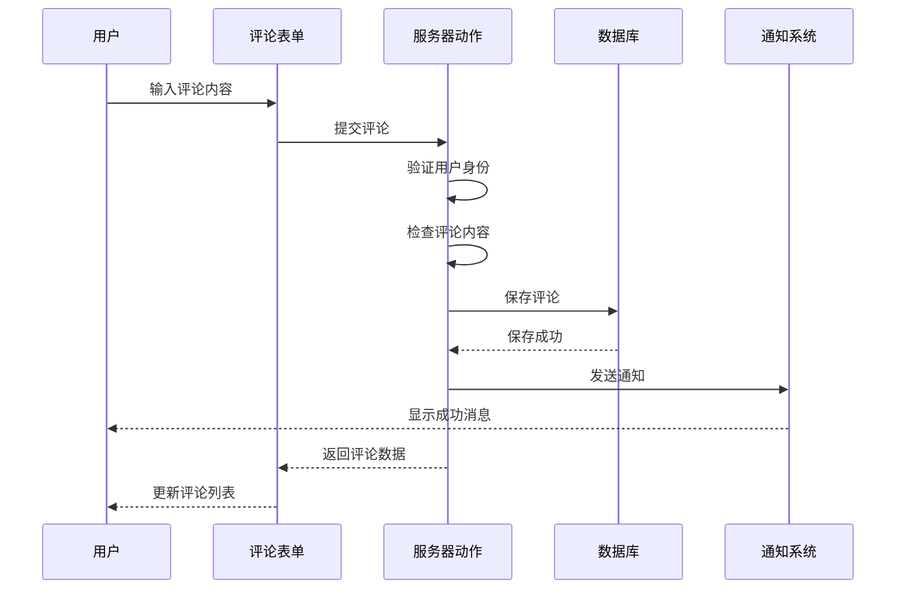

**图表来源**
- [src/app/dashboard/comments/actions.ts:48-56](file://src/app/dashboard/comments/actions.ts#L48-L56)

##### 评论功能特性

- **多级回复**: 支持评论的嵌套回复
- **实时更新**: 新评论即时显示
- **编辑功能**: 支持对评论进行编辑
- **删除权限**: 作者和管理员可删除评论
- **内容审核**: 支持评论内容的审核机制

**章节来源**
- [src/app/dashboard/comments/actions.ts:1-57](file://src/app/dashboard/comments/actions.ts#L1-L57)

### 前台博客展示

#### 文章详情页架构

前台博客展示提供了完整的用户体验：

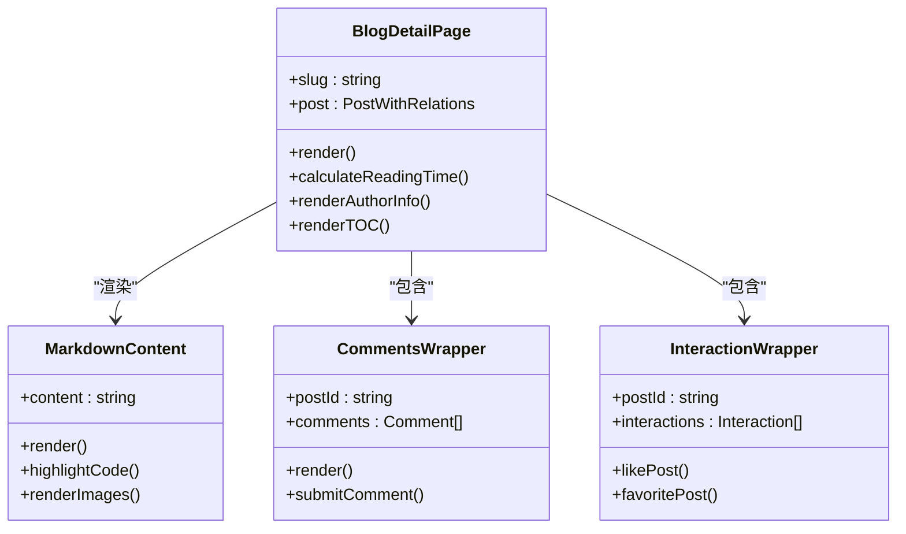

**图表来源**
- [src/app/(site)/graph/[slug]/page.tsx:30-158](file://src/app/(site)/graph/[slug]/page.tsx#L30-L158)

##### 前台功能特性

- **响应式设计**: 完美适配各种设备屏幕
- **深色主题**: 默认深色模式提供舒适的阅读体验
- **目录导航**: 自动生成文章目录便于导航
- **互动功能**: 支持点赞、收藏等用户互动
- **社交分享**: 集成社交媒体分享功能

**章节来源**
- [src/app/(site)/graph/[slug]/page.tsx:1-158](file://src/app/(site)/graph/[slug]/page.tsx#L1-L158)

### SEO 优化

#### SEO 优化策略

系统实现了全面的 SEO 优化：

- **元数据管理**: 动态生成页面标题和描述
- **结构化数据**: 支持 JSON-LD 结构化数据
- **图片优化**: 自动压缩和格式优化
- **加载性能**: 图片懒加载和预加载策略
- **移动友好**: 完全响应式设计

## 依赖关系分析

### 核心依赖关系

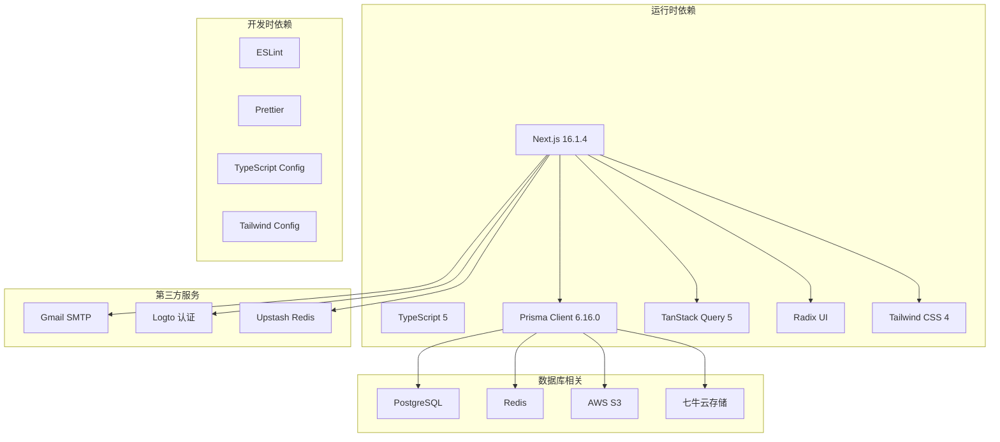

**图表来源**
- [package.json:11-79](file://package.json#L11-L79)

### 数据流分析

系统实现了清晰的数据流向：

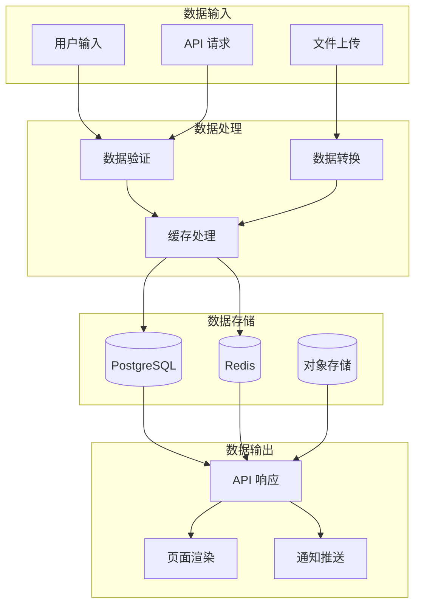

**图表来源**
- [src/app/dashboard/posts/actions.ts:10-22](file://src/app/dashboard/posts/actions.ts#L10-L22)
- [src/lib/db.ts:5-14](file://src/lib/db.ts#L5-L14)

**章节来源**
- [package.json:1-98](file://package.json#L1-L98)
- [src/lib/db.ts:1-16](file://src/lib/db.ts#L1-L16)

## 性能考虑

### 缓存策略

系统采用了多层次的缓存策略来确保最佳性能：

1. **Server Action 缓存**: 使用 `unstable_cache` 实现 5 分钟缓存
2. **标签缓存**: 使用 `revalidateTag` 实现精确缓存失效
3. **客户端缓存**: 使用 TanStack Query 实现智能缓存和更新
4. **静态资源缓存**: CDN 缓存图片和静态文件

### 数据库优化

- **索引优化**: 为常用查询字段建立索引
- **连接池**: 使用 Prisma 连接池管理数据库连接
- **批量操作**: 支持批量数据操作减少数据库往返
- **查询优化**: 使用关系连接避免 N+1 查询问题

### 前端性能

- **代码分割**: 按需加载组件和页面
- **懒加载**: 图片和重型组件懒加载
- **虚拟滚动**: 大列表使用虚拟滚动优化渲染
- **防抖节流**: 表单输入和搜索使用防抖节流

## 故障排除指南

### 常见问题诊断

#### 数据库连接问题

**症状**: 应用启动时报数据库连接错误

**解决方案**:
1. 检查 `DATABASE_URL` 环境变量配置
2. 验证数据库服务是否正常运行
3. 确认网络连接和防火墙设置
4. 检查数据库凭据和权限

#### 缓存失效问题

**症状**: 更新内容后页面显示旧数据

**解决方案**:
1. 检查 `revalidateTag` 和 `revalidatePath` 调用
2. 验证缓存标签配置
3. 确认缓存清理时机
4. 检查 Redis 连接状态

#### API 认证问题

**症状**: API 请求返回 401 或 403 错误

**解决方案**:
1. 验证 API Key 配置
2. 检查请求头中 `Authorization` 字段
3. 确认用户权限和角色
4. 验证请求签名和时间戳

**章节来源**
- [src/lib/db.ts:5-14](file://src/lib/db.ts#L5-L14)
- [src/app/api/open/posts/route.ts:30-33](file://src/app/api/open/posts/route.ts#L30-L33)

### 性能监控

系统提供了完善的性能监控机制：

- **慢查询监控**: 自动检测和报告慢查询
- **缓存命中率**: 实时监控缓存使用效率
- **数据库连接池**: 监控连接池使用情况
- **API 响应时间**: 监控 API 性能指标

## 结论

博客管理系统是一个功能完整、架构清晰的现代化全栈应用。系统采用了最新的技术栈和最佳实践，提供了优秀的开发体验和用户体验。

### 主要优势

1. **技术先进**: 采用 Next.js 16.1.4 和 TypeScript 5，确保代码质量和开发效率
2. **架构合理**: 分层清晰，职责分离，易于维护和扩展
3. **性能优秀**: 多层次缓存策略和优化措施确保良好性能
4. **功能完善**: 覆盖博客系统的所有核心功能需求
5. **安全可靠**: 完善的认证授权机制和数据验证

### 发展建议

1. **微服务化**: 随着业务增长，可考虑将某些功能模块化为独立服务
2. **容器化**: 实施 Docker 容器化部署提升运维效率
3. **监控告警**: 增强生产环境监控和告警机制
4. **自动化测试**: 完善单元测试和集成测试体系
5. **国际化**: 考虑添加多语言支持功能

该系统为博客内容管理提供了一个坚实的技术基础，能够满足当前和未来的发展需求。