# 友链管理系统

<cite>
**本文档引用的文件**
- [src/app/dashboard/friend-links/page.tsx](file://src/app/dashboard/friend-links/page.tsx)
- [src/app/dashboard/friend-links/actions.ts](file://src/app/dashboard/friend-links/actions.ts)
- [src/app/dashboard/friend-links/schema.ts](file://src/app/dashboard/friend-links/schema.ts)
- [src/app/dashboard/friend-links/components/friend-links-wrapper.tsx](file://src/app/dashboard/friend-links/components/friend-links-wrapper.tsx)
- [src/app/dashboard/friend-links/components/friend-link-list.tsx](file://src/app/dashboard/friend-links/components/friend-link-list.tsx)
- [src/app/dashboard/friend-links/components/friend-link-dialog.tsx](file://src/app/dashboard/friend-links/components/friend-link-dialog.tsx)
- [src/app/api/send-friend-approval/route.ts](file://src/app/api/send-friend-approval/route.ts)
- [src/lib/email-service.ts](file://src/lib/email-service.ts)
- [src/app/dashboard/friend-links/components/contact-template.tsx](file://src/app/dashboard/friend-links/components/contact-template.tsx)
- [prisma/schema.prisma](file://prisma/schema.prisma)
</cite>

## 目录
1. [项目概述](#项目概述)
2. [系统架构](#系统架构)
3. [核心组件](#核心组件)
4. [友链申请流程](#友链申请流程)
5. [审核管理功能](#审核管理功能)
6. [状态控制系统](#状态控制系统)
7. [邮件通知系统](#邮件通知系统)
8. [友链展示组件](#友链展示组件)
9. [数据验证机制](#数据验证机制)
10. [性能优化策略](#性能优化策略)
11. [故障排除指南](#故障排除指南)
12. [总结](#总结)

## 项目概述

友链管理系统是一个基于Next.js全栈应用的完整解决方案，专门用于管理网站间的友情链接关系。该系统提供了从友链申请、审核管理到最终展示的全流程管理功能，支持实时状态跟踪、邮件通知、数据验证和性能优化等高级特性。

系统采用现代化的技术栈构建，包括TypeScript、Prisma ORM、React Hook Form、Zod验证库等，确保了代码的类型安全性和开发效率。

## 系统架构

友链管理系统采用分层架构设计，清晰分离了前端界面、业务逻辑、数据访问和数据库层：

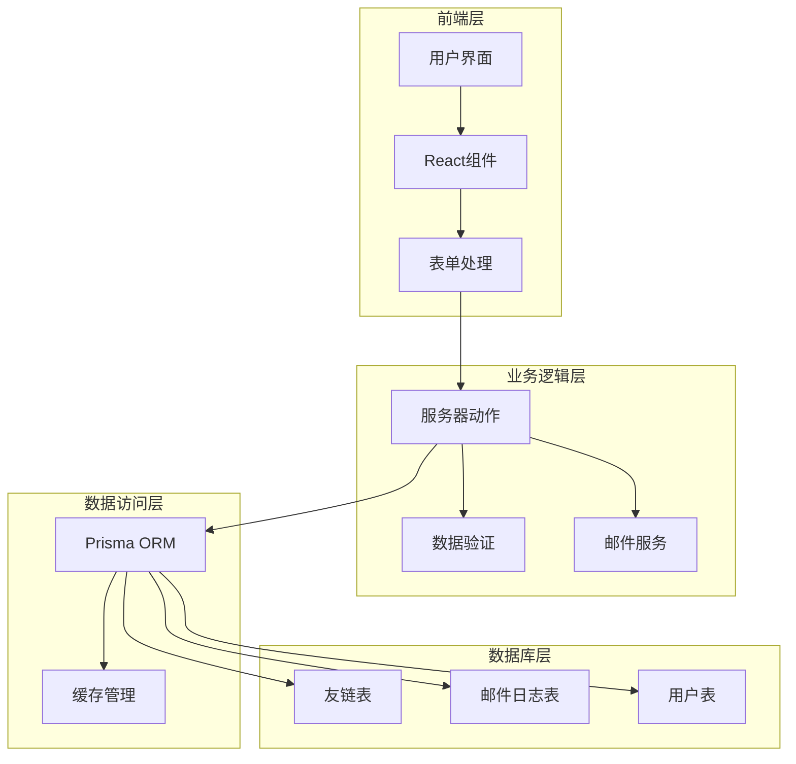

**图表来源**
- [src/app/dashboard/friend-links/page.tsx:1-28](file://src/app/dashboard/friend-links/page.tsx#L1-L28)
- [src/app/dashboard/friend-links/actions.ts:1-127](file://src/app/dashboard/friend-links/actions.ts#L1-L127)
- [prisma/schema.prisma:169-182](file://prisma/schema.prisma#L169-L182)

## 核心组件

### 数据模型设计

系统的核心数据结构由Prisma定义，包含友链信息和邮件日志两个主要实体：

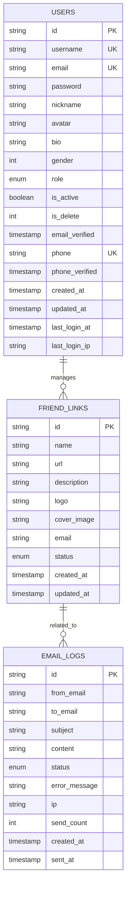

**图表来源**
- [prisma/schema.prisma:169-260](file://prisma/schema.prisma#L169-L260)

### 状态枚举定义

系统使用强类型的枚举来管理友链状态：

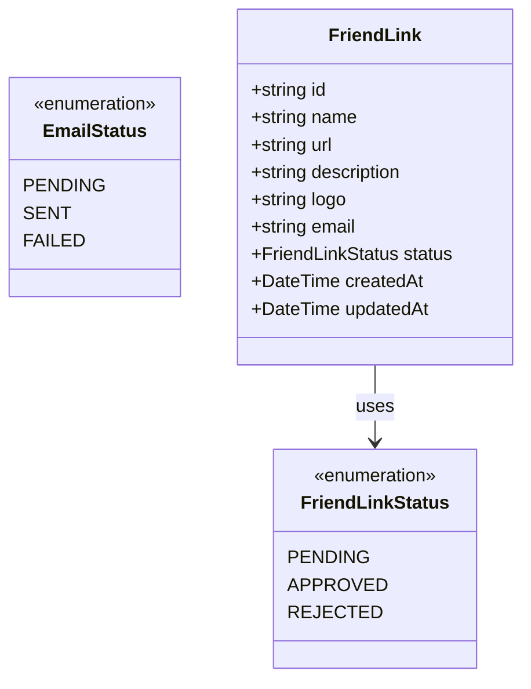

**图表来源**
- [prisma/schema.prisma:278-282](file://prisma/schema.prisma#L278-L282)

**章节来源**
- [prisma/schema.prisma:169-282](file://prisma/schema.prisma#L169-L282)

## 友链申请流程

### 申请表单设计

友链申请表单采用响应式设计，支持多种输入类型和验证规则：

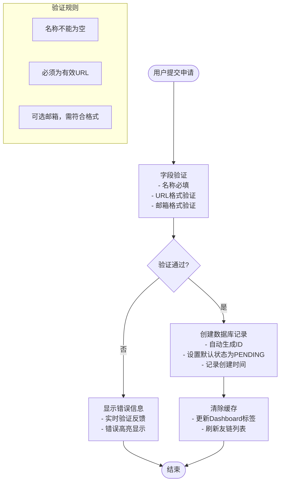

**图表来源**
- [src/app/dashboard/friend-links/schema.ts:3-10](file://src/app/dashboard/friend-links/schema.ts#L3-L10)
- [src/app/dashboard/friend-links/components/friend-link-dialog.tsx:83-99](file://src/app/dashboard/friend-links/components/friend-link-dialog.tsx#L83-L99)

### 表单字段说明

| 字段名 | 类型 | 必填 | 验证规则 | 描述 |
|--------|------|------|----------|------|
| name | string | 是 | 非空字符串 | 友链站点名称 |
| url | string | 是 | 有效URL格式 | 站点主页链接 |
| description | string | 否 | 可选文本 | 站点描述信息 |
| logo | string | 否 | 图片URL或空 | 站点Logo图片 |
| email | string | 否 | 邮箱格式或空 | 联系邮箱地址 |
| status | enum | 否 | PENDING/APPROVED/REJECTED | 默认PENDING |

**章节来源**
- [src/app/dashboard/friend-links/schema.ts:1-13](file://src/app/dashboard/friend-links/schema.ts#L1-L13)
- [src/app/dashboard/friend-links/components/friend-link-dialog.tsx:138-212](file://src/app/dashboard/friend-links/components/friend-link-dialog.tsx#L138-L212)

## 审核管理功能

### 审核工作流

友链审核采用异步处理模式，支持批量操作和状态跟踪：

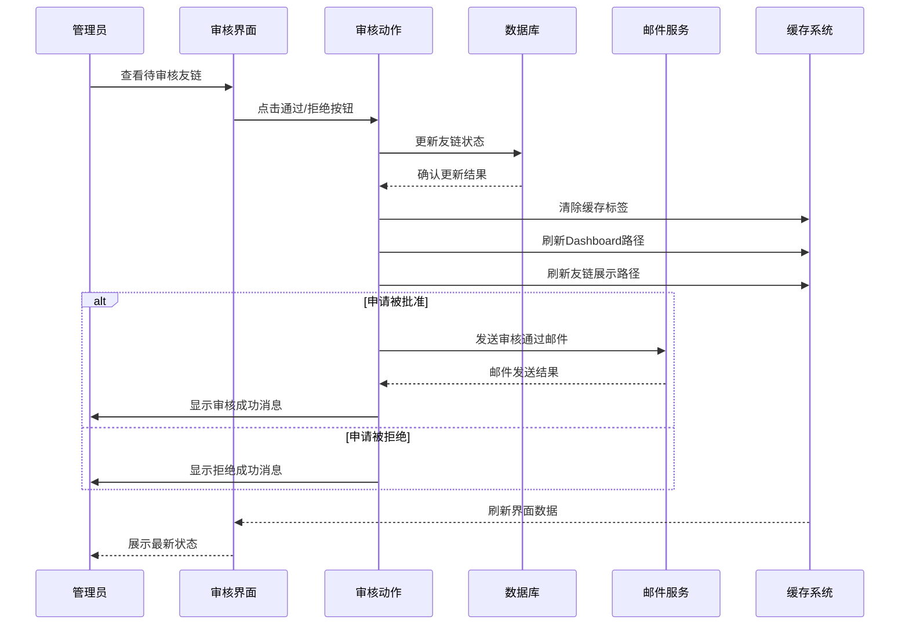

**图表来源**
- [src/app/dashboard/friend-links/components/friend-link-list.tsx:77-152](file://src/app/dashboard/friend-links/components/friend-link-list.tsx#L77-L152)
- [src/app/dashboard/friend-links/actions.ts:96-126](file://src/app/dashboard/friend-links/actions.ts#L96-L126)

### 审核操作类型

系统提供完整的审核操作集：

1. **批准申请** (`approveFriendLink`)
   - 将状态从PENDING更新为APPROVED
   - 自动发送审核通过邮件通知
   - 支持IP限制检查防止滥用

2. **拒绝申请** (`rejectFriendLink`)
   - 将状态从PENDING更新为REJECTED
   - 不发送邮件通知
   - 保持数据完整性

3. **手动状态更新** (`updateFriendLink`)
   - 支持直接修改友链信息
   - 适用于已批准的友链维护

**章节来源**
- [src/app/dashboard/friend-links/actions.ts:96-126](file://src/app/dashboard/friend-links/actions.ts#L96-L126)
- [src/app/dashboard/friend-links/components/friend-link-list.tsx:77-152](file://src/app/dashboard/friend-links/components/friend-link-list.tsx#L77-L152)

## 状态控制系统

### 状态转换图

友链状态在生命周期内遵循严格的转换规则：

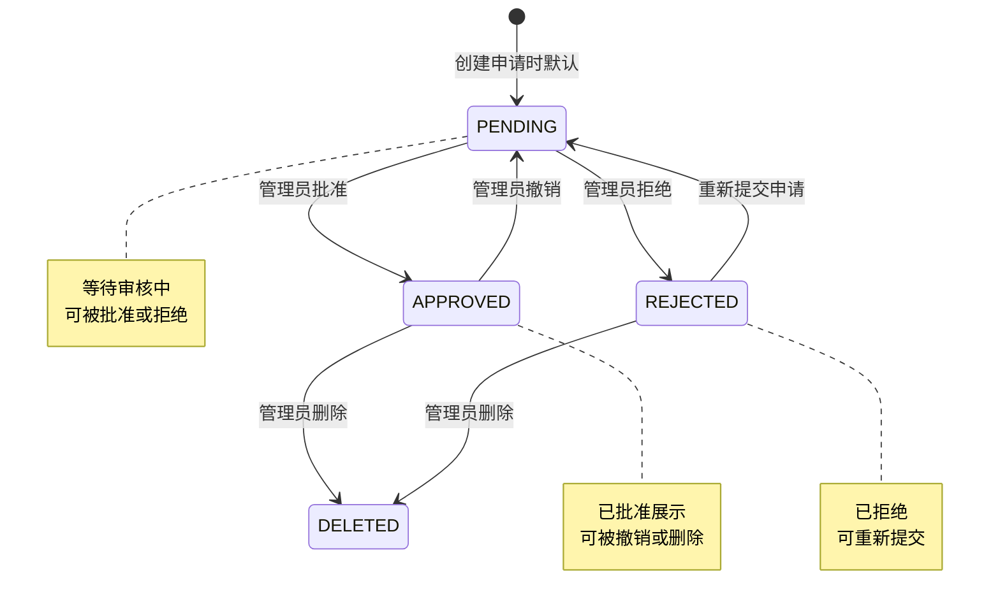

**图表来源**
- [prisma/schema.prisma:278-282](file://prisma/schema.prisma#L278-L282)

### 状态显示逻辑

不同状态对应不同的视觉反馈：

| 状态 | 颜色方案 | 显示文本 | 功能影响 |
|------|----------|----------|----------|
| PENDING | 灰色次要 | 待审核 | 显示审核按钮 |
| APPROVED | 蓝色默认 | 已通过 | 可正常展示 |
| REJECTED | 红色破坏 | 已拒绝 | 不参与展示 |

**章节来源**
- [src/app/dashboard/friend-links/components/friend-link-list.tsx:204-207](file://src/app/dashboard/friend-links/components/friend-link-list.tsx#L204-L207)

## 邮件通知系统

### 邮件发送架构

系统实现了完整的邮件通知机制，包括IP限制、重试机制和日志记录：

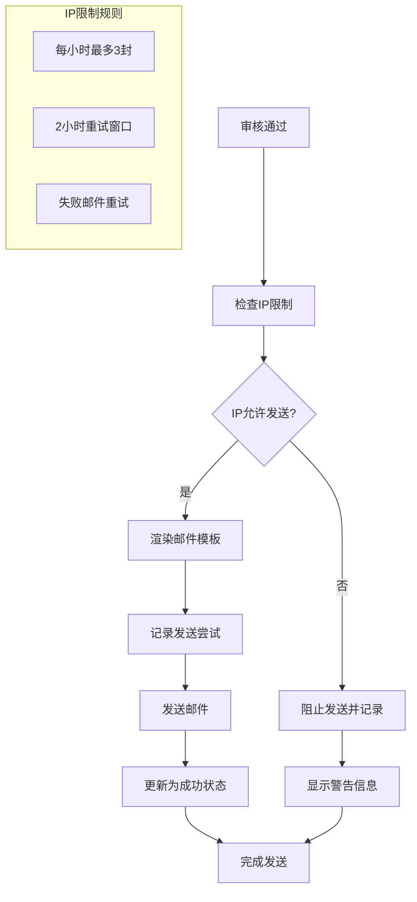

**图表来源**
- [src/lib/email-service.ts:11-55](file://src/lib/email-service.ts#L11-L55)
- [src/lib/email-service.ts:58-123](file://src/lib/email-service.ts#L58-L123)

### 邮件模板设计

系统使用React Email组件创建专业的邮件模板：

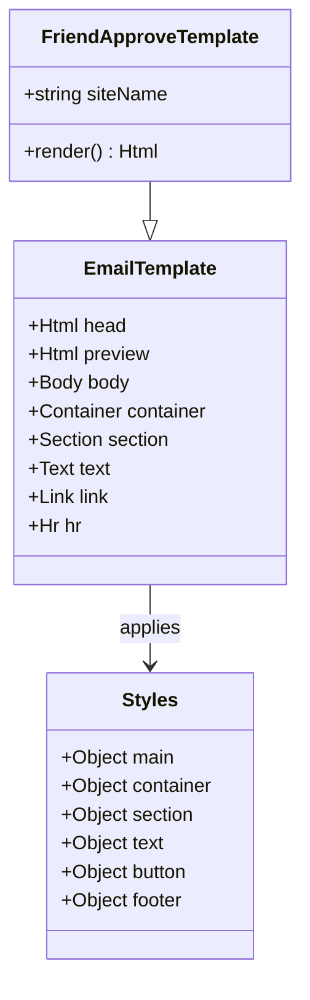

**图表来源**
- [src/app/dashboard/friend-links/components/contact-template.tsx:6-41](file://src/app/dashboard/friend-links/components/contact-template.tsx#L6-L41)

### 邮件发送限制

系统实施多层次的邮件发送限制以防止滥用：

| 时间范围 | 限制数量 | 特殊规则 |
|----------|----------|----------|
| 1小时 | 3封 | 允许重试失败邮件 |
| 2小时 | 无限制 | 可重试1小时前的失败邮件 |
| IP地址 | 唯一标识 | 基于客户端IP进行限制 |

**章节来源**
- [src/lib/email-service.ts:11-55](file://src/lib/email-service.ts#L11-L55)
- [src/app/api/send-friend-approval/route.ts:16-25](file://src/app/api/send-friend-approval/route.ts#L16-L25)

## 友链展示组件

### 展示架构

友链展示采用分页和缓存相结合的方式，确保良好的用户体验：

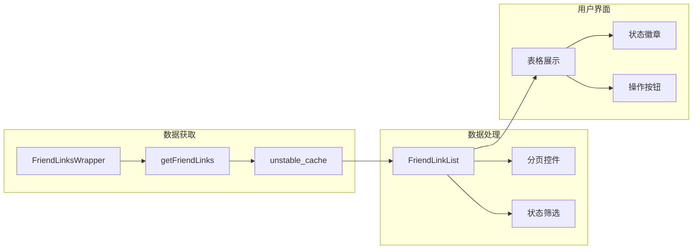

**图表来源**
- [src/app/dashboard/friend-links/components/friend-links-wrapper.tsx:1-23](file://src/app/dashboard/friend-links/components/friend-links-wrapper.tsx#L1-L23)
- [src/app/dashboard/friend-links/components/friend-link-list.tsx:40-156](file://src/app/dashboard/friend-links/components/friend-link-list.tsx#L40-L156)

### 展示功能特性

| 功能 | 技术实现 | 用户体验 |
|------|----------|----------|
| 分页浏览 | 服务端分页查询 | 快速加载大量数据 |
| 状态筛选 | 查询条件过滤 | 精确查找特定状态 |
| 实时更新 | 缓存失效机制 | 即时反映数据变化 |
| 响应式设计 | 移动端适配 | 跨设备一致体验 |

**章节来源**
- [src/app/dashboard/friend-links/components/friend-links-wrapper.tsx:1-23](file://src/app/dashboard/friend-links/components/friend-links-wrapper.tsx#L1-L23)
- [src/app/dashboard/friend-links/components/friend-link-list.tsx:154-284](file://src/app/dashboard/friend-links/components/friend-link-list.tsx#L154-L284)

## 数据验证机制

### 前端验证

系统采用React Hook Form配合Zod进行双重验证：

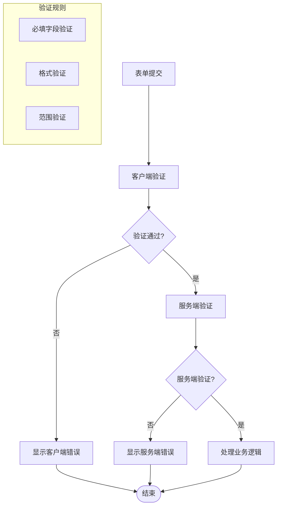

**图表来源**
- [src/app/dashboard/friend-links/schema.ts:3-10](file://src/app/dashboard/friend-links/schema.ts#L3-L10)
- [src/app/dashboard/friend-links/components/friend-link-dialog.tsx:49-59](file://src/app/dashboard/friend-links/components/friend-link-dialog.tsx#L49-L59)

### 验证规则详解

系统对每个字段实施严格的数据验证：

| 字段 | 验证类型 | 具体规则 | 错误提示 |
|------|----------|----------|----------|
| name | 必填验证 | 非空字符串 | 名称不能为空 |
| url | 格式验证 | 有效URL格式 | 请输入有效的URL |
| description | 可选验证 | 字符串或undefined | - |
| logo | 可选验证 | 图片URL或空字符串 | - |
| email | 可选验证 | 邮箱格式或空 | 请输入有效的邮箱 |
| status | 枚举验证 | PENDING/APPROVED/REJECTED | - |

**章节来源**
- [src/app/dashboard/friend-links/schema.ts:1-13](file://src/app/dashboard/friend-links/schema.ts#L1-L13)

## 性能优化策略

### 缓存机制

系统采用多层缓存策略提升性能：

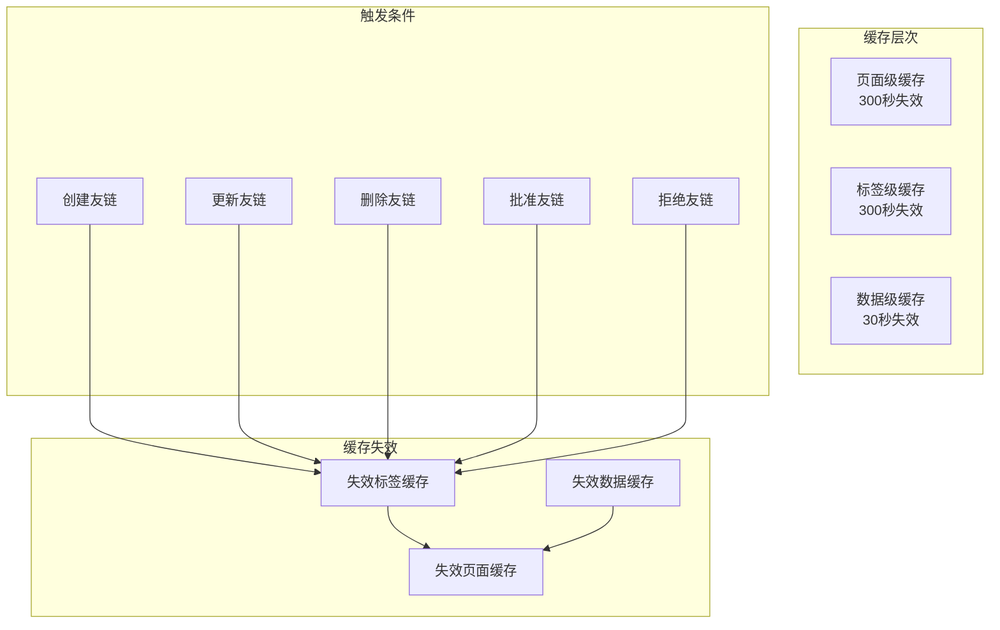

**图表来源**
- [src/app/dashboard/friend-links/actions.ts:9-41](file://src/app/dashboard/friend-links/actions.ts#L9-L41)
- [src/app/dashboard/friend-links/actions.ts:65-67](file://src/app/dashboard/friend-links/actions.ts#L65-L67)

### 性能优化措施

1. **缓存策略**
   - 页面级缓存：300秒失效，减少重复渲染
   - 标签级缓存：300秒失效，支持细粒度更新
   - 数据级缓存：30秒失效，平衡实时性与性能

2. **数据库优化**
   - 使用Promise.all并行查询提高响应速度
   - 合理的索引设计支持高效查询
   - 分页查询避免大数据量加载

3. **前端优化**
   - Suspense懒加载提升首屏性能
   - 条件渲染减少DOM节点数量
   - 事件防抖避免频繁请求

**章节来源**
- [src/app/dashboard/friend-links/actions.ts:9-41](file://src/app/dashboard/friend-links/actions.ts#L9-L41)

## 故障排除指南

### 常见问题及解决方案

| 问题类型 | 症状表现 | 可能原因 | 解决方案 |
|----------|----------|----------|----------|
| 邮件发送失败 | 审核通过但邮件未送达 | IP限制触发 | 检查IP限制状态，等待重试窗口 |
| 友链状态不更新 | 审核后状态仍为PENDING | 缓存未刷新 | 手动刷新页面或等待缓存过期 |
| 表单验证错误 | 保存时出现验证错误 | 输入格式不符 | 按照提示修正输入内容 |
| 数据库连接失败 | 页面加载异常 | 数据库连接问题 | 检查数据库连接配置 |

### 调试工具

系统提供了完善的调试和监控功能：

1. **邮件日志查看**
   - 支持分页查看邮件发送历史
   - 显示详细的错误信息和状态
   - 支持失败邮件重试功能

2. **缓存监控**
   - 实时查看缓存命中率
   - 监控缓存失效事件
   - 分析缓存性能指标

3. **错误追踪**
   - 记录所有系统错误
   - 提供错误详情和时间戳
   - 支持错误分类统计

**章节来源**
- [src/lib/email-service.ts:126-156](file://src/lib/email-service.ts#L126-L156)
- [src/app/dashboard/friend-links/components/friend-link-list.tsx:124-136](file://src/app/dashboard/friend-links/components/friend-link-list.tsx#L124-L136)

## 总结

友链管理系统是一个功能完整、架构清晰的现代化Web应用。系统通过合理的分层设计、严格的验证机制、智能的缓存策略和完善的邮件通知系统，为用户提供了一站式的友链管理解决方案。

### 核心优势

1. **完整的生命周期管理**：从申请到展示的全流程覆盖
2. **强大的审核机制**：支持多维度的状态管理和权限控制
3. **智能化的通知系统**：自动化的邮件通知和IP限制保护
4. **高性能的架构设计**：多层缓存和优化的数据库查询
5. **优秀的用户体验**：响应式设计和直观的操作界面

### 技术特色

- 基于Next.js的全栈解决方案
- 强类型的TypeScript开发环境
- Prisma ORM提供类型安全的数据访问
- React Hook Form实现高效的表单处理
- Zod验证库确保数据完整性
- React Email组件创建专业邮件模板

该系统不仅满足了当前的功能需求，还为未来的扩展和优化奠定了坚实的基础。通过持续的迭代改进，友链管理系统将成为一个更加完善和强大的内容管理工具。