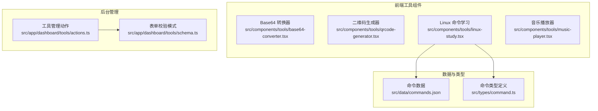
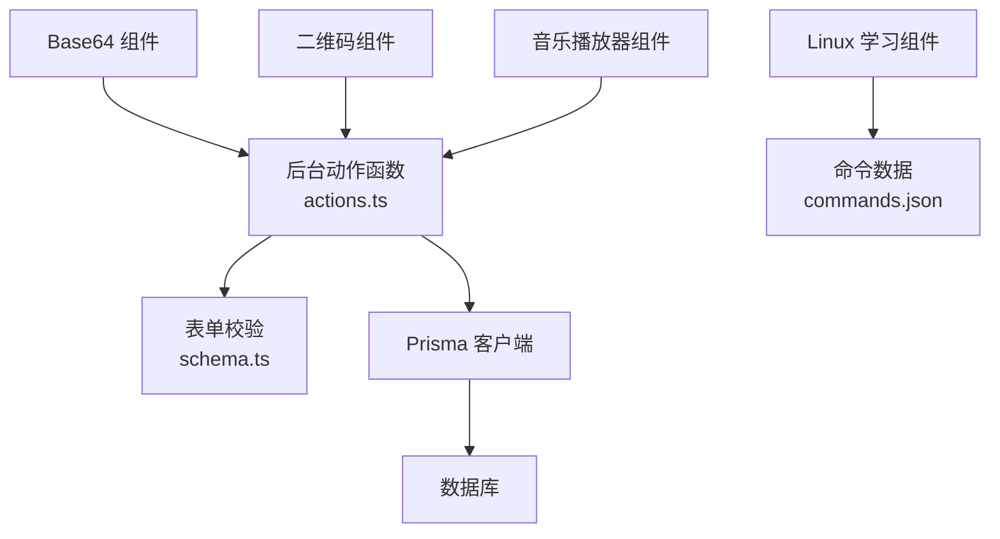
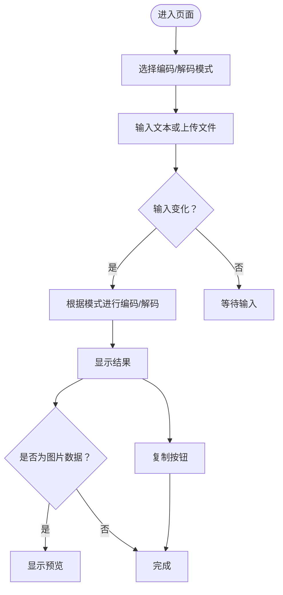
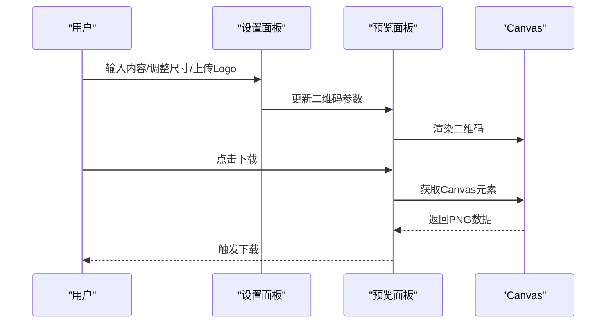
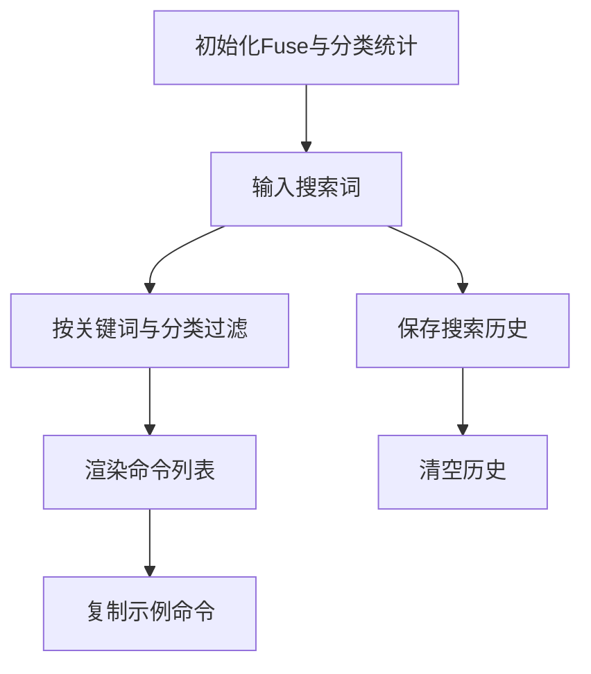
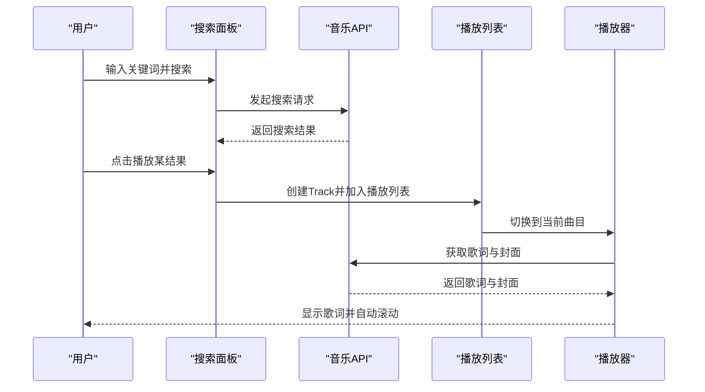
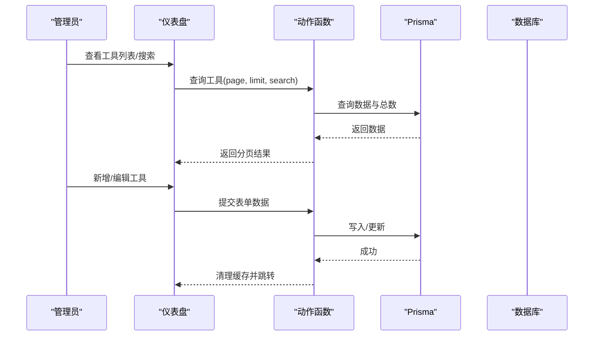
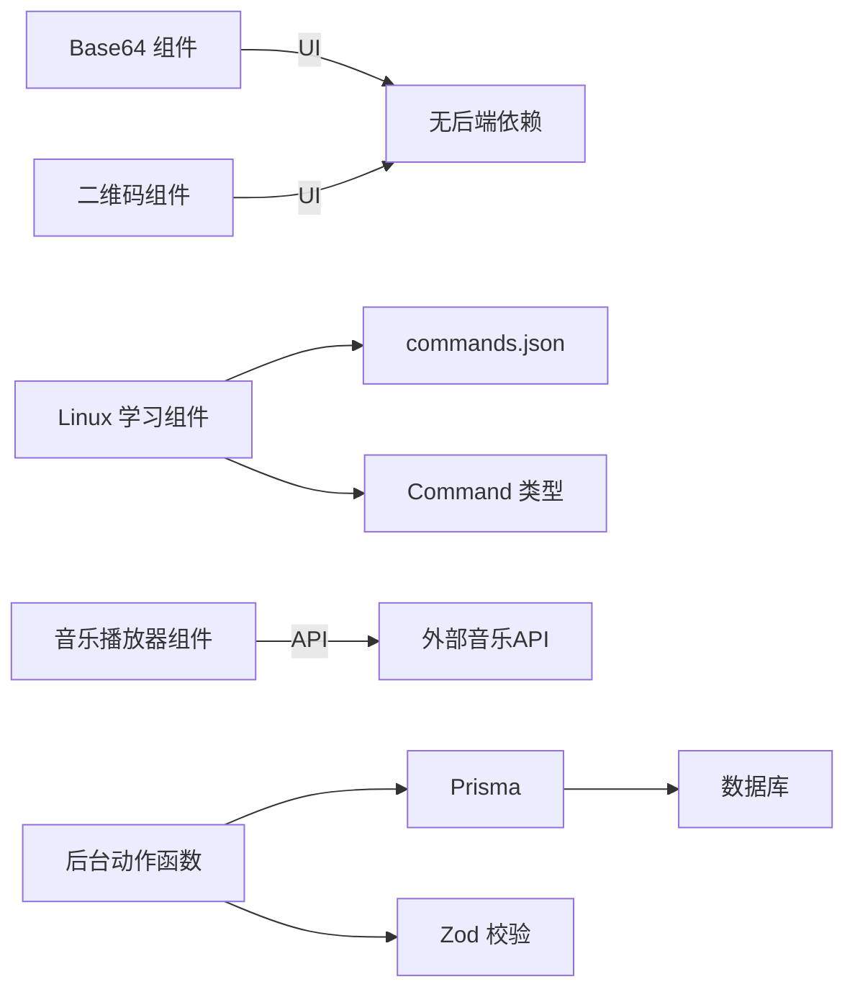

# 工具箱功能

<cite>
**本文引用的文件**   
- [src/components/tools/base64-converter.tsx](file://src/components/tools/base64-converter.tsx)
- [src/components/tools/qrcode-generator.tsx](file://src/components/tools/qrcode-generator.tsx)
- [src/components/tools/linux-study.tsx](file://src/components/tools/linux-study.tsx)
- [src/components/tools/music-player.tsx](file://src/components/tools/music-player.tsx)
- [src/data/commands.json](file://src/data/commands.json)
- [src/types/command.ts](file://src/types/command.ts)
- [src/app/dashboard/tools/actions.ts](file://src/app/dashboard/tools/actions.ts)
- [src/app/dashboard/tools/schema.ts](file://src/app/dashboard/tools/schema.ts)
</cite>

## 目录
1. [简介](#简介)
2. [项目结构](#项目结构)
3. [核心组件](#核心组件)
4. [架构概览](#架构概览)
5. [详细组件分析](#详细组件分析)
6. [依赖关系分析](#依赖关系分析)
7. [性能考虑](#性能考虑)
8. [故障排除指南](#故障排除指南)
9. [结论](#结论)
10. [附录](#附录)

## 简介
本文件面向“工具箱”功能，系统性梳理并说明各类实用工具的实现原理、用户界面设计、交互逻辑与数据处理方式，并提供管理后台的操作指南，涵盖：
- Base64 转换器：文本与文件双向转换、图片预览与下载
- 二维码生成器：内容配置、尺寸与Logo叠加、Canvas导出
- Linux 命令学习：分类浏览、全文检索、搜索历史与快捷键
- 音乐播放器：多源搜索、播放列表、歌词解析与自动滚动
- 文本差异比较与变量命名工具：页面存在但未在上下文中展开
- 工具分类管理、新增工具、状态维护与使用统计：后台管理接口与缓存策略

## 项目结构
工具箱功能主要由三部分构成：
- 前端工具组件：位于 src/components/tools，包含各工具的客户端实现
- 后台管理：位于 src/app/dashboard/tools，提供工具增删改查与状态管理
- 数据与类型：src/data/commands.json 提供 Linux 命令示例数据；src/types/command.ts 定义命令数据结构

图表来源
- [src/components/tools/base64-converter.tsx:1-157](file://src/components/tools/base64-converter.tsx#L1-L157)
- [src/components/tools/qrcode-generator.tsx:1-169](file://src/components/tools/qrcode-generator.tsx#L1-L169)
- [src/components/tools/linux-study.tsx:1-348](file://src/components/tools/linux-study.tsx#L1-L348)
- [src/components/tools/music-player.tsx:1-944](file://src/components/tools/music-player.tsx#L1-L944)
- [src/app/dashboard/tools/actions.ts:1-143](file://src/app/dashboard/tools/actions.ts#L1-L143)
- [src/app/dashboard/tools/schema.ts:1-15](file://src/app/dashboard/tools/schema.ts#L1-L15)
- [src/data/commands.json:1-384](file://src/data/commands.json#L1-L384)
- [src/types/command.ts:1-13](file://src/types/command.ts#L1-L13)

章节来源
- [src/components/tools/base64-converter.tsx:1-157](file://src/components/tools/base64-converter.tsx#L1-L157)
- [src/components/tools/qrcode-generator.tsx:1-169](file://src/components/tools/qrcode-generator.tsx#L1-L169)
- [src/components/tools/linux-study.tsx:1-348](file://src/components/tools/linux-study.tsx#L1-L348)
- [src/components/tools/music-player.tsx:1-944](file://src/components/tools/music-player.tsx#L1-L944)
- [src/app/dashboard/tools/actions.ts:1-143](file://src/app/dashboard/tools/actions.ts#L1-L143)
- [src/app/dashboard/tools/schema.ts:1-15](file://src/app/dashboard/tools/schema.ts#L1-L15)
- [src/data/commands.json:1-384](file://src/data/commands.json#L1-L384)
- [src/types/command.ts:1-13](file://src/types/command.ts#L1-L13)

## 核心组件
- Base64 转换器：支持文本编码/解码、文件转 Base64、一键复制、图像预览、模式切换
- 二维码生成器：内容输入、尺寸调节、Logo叠加、Canvas 导出 PNG
- Linux 命令学习：分类导航、全文检索、搜索历史、键盘快捷键、命令示例复制
- 音乐播放器：多源搜索、播放列表、歌词解析与自动滚动、播放历史、封面展示
- 工具管理后台：工具增删改查、状态变更、分类管理、缓存与搜索过滤

章节来源
- [src/components/tools/base64-converter.tsx:14-157](file://src/components/tools/base64-converter.tsx#L14-L157)
- [src/components/tools/qrcode-generator.tsx:14-169](file://src/components/tools/qrcode-generator.tsx#L14-L169)
- [src/components/tools/linux-study.tsx:39-348](file://src/components/tools/linux-study.tsx#L39-L348)
- [src/components/tools/music-player.tsx:53-944](file://src/components/tools/music-player.tsx#L53-L944)
- [src/app/dashboard/tools/actions.ts:78-143](file://src/app/dashboard/tools/actions.ts#L78-L143)
- [src/app/dashboard/tools/schema.ts:3-12](file://src/app/dashboard/tools/schema.ts#L3-L12)

## 架构概览
工具箱采用“前端组件 + 后端动作函数 + 数据库”的分层架构：
- 前端组件负责用户交互与本地状态管理
- 后端动作函数通过 Prisma 访问数据库，提供缓存与路径失效机制
- 数据层提供静态命令数据与类型约束

图表来源
- [src/components/tools/base64-converter.tsx:1-157](file://src/components/tools/base64-converter.tsx#L1-L157)
- [src/components/tools/qrcode-generator.tsx:1-169](file://src/components/tools/qrcode-generator.tsx#L1-L169)
- [src/components/tools/linux-study.tsx:1-348](file://src/components/tools/linux-study.tsx#L1-L348)
- [src/components/tools/music-player.tsx:1-944](file://src/components/tools/music-player.tsx#L1-L944)
- [src/app/dashboard/tools/actions.ts:1-143](file://src/app/dashboard/tools/actions.ts#L1-L143)
- [src/app/dashboard/tools/schema.ts:1-15](file://src/app/dashboard/tools/schema.ts#L1-L15)
- [src/data/commands.json:1-384](file://src/data/commands.json#L1-L384)

## 详细组件分析

### Base64 转换器
- 技术实现
  - 使用外部库进行编码/解码，自动监听输入变化并即时更新输出
  - 支持文件上传，读取为 DataURL 并作为输出，同时切换到编码模式
  - 提供复制输入/输出、清空、模式切换等交互
- 用户界面
  - 三栏布局：模式标签页、输入区、操作区、输出区、图片预览
  - 响应式设计，移动端适配良好
- 数据处理
  - 输入为空时清空输出；异常时不立即清空输出，提升输入体验
  - 输出以“data:image/...”开头时显示预览

图表来源
- [src/components/tools/base64-converter.tsx:14-157](file://src/components/tools/base64-converter.tsx#L14-L157)

章节来源
- [src/components/tools/base64-converter.tsx:14-157](file://src/components/tools/base64-converter.tsx#L14-L157)

### 二维码生成器
- 技术实现
  - 使用 Canvas 组件渲染二维码，支持尺寸调节与中心 Logo 叠加
  - 支持从本地上传图片作为 Logo，并可调节大小
  - 提供下载为 PNG 的功能
- 用户界面
  - 左侧面板：设置项（内容、尺寸、Logo 开关、Logo 上传、Logo 尺寸）
  - 右侧预览区：二维码画布与下载按钮
- 数据处理
  - 仅在启用 Logo 且提供 URL 时注入 imageSettings
  - 下载时将 Canvas 转为 DataURL 并触发下载

图表来源
- [src/components/tools/qrcode-generator.tsx:14-169](file://src/components/tools/qrcode-generator.tsx#L14-L169)

章节来源
- [src/components/tools/qrcode-generator.tsx:14-169](file://src/components/tools/qrcode-generator.tsx#L14-L169)

### Linux 命令学习
- 技术实现
  - 使用 Fuse.js 进行全文检索，索引字段包含命令名、描述与示例说明
  - 本地存储搜索历史，支持清除与快捷键（“/”聚焦、“Esc”清空）
  - 分类统计与筛选，移动端与桌面端不同布局
- 用户界面
  - 桌面端左侧分类导航，右侧内容区；移动端顶部固定搜索栏与横向分类标签
  - 命令卡片展示名称、分类、描述与示例列表，示例支持复制
- 数据处理
  - 初始化时构建 Fuse 实例，按查询与分类过滤结果
  - 统计各分类数量用于导航展示

图表来源
- [src/components/tools/linux-study.tsx:39-348](file://src/components/tools/linux-study.tsx#L39-L348)
- [src/data/commands.json:1-384](file://src/data/commands.json#L1-L384)
- [src/types/command.ts:1-13](file://src/types/command.ts#L1-L13)

章节来源
- [src/components/tools/linux-study.tsx:39-348](file://src/components/tools/linux-study.tsx#L39-L348)
- [src/data/commands.json:1-384](file://src/data/commands.json#L1-L384)
- [src/types/command.ts:1-13](file://src/types/command.ts#L1-L13)

### 音乐播放器
- 技术实现
  - 多源搜索：支持网易云、酷我、JOOX、B站等音乐源，按关键词分页加载
  - 播放列表：本地文件上传、播放历史记录、播放状态与进度控制
  - 歌词解析：解析 LRC 时间轴，自动滚动到当前行，支持手动滚动与跟随开关
  - 封面与歌词双 Tab 展示，支持悬停旋转动画
- 用户界面
  - 左侧搜索结果与播放列表，右侧中央播放区（封面/歌词）
  - 搜索框支持回车与按钮触发，结果列表支持滚动加载更多
- 数据处理
  - 搜索结果映射为内部 Track 结构，包含封面、歌词 ID、来源等
  - 歌词解析为时间线数组，按当前播放时间定位高亮行

图表来源
- [src/components/tools/music-player.tsx:53-944](file://src/components/tools/music-player.tsx#L53-L944)

章节来源
- [src/components/tools/music-player.tsx:53-944](file://src/components/tools/music-player.tsx#L53-L944)

### 工具管理后台
- 功能概述
  - 工具列表：分页、搜索（名称/描述/分类）、状态排序
  - 新增/编辑：表单校验（名称、描述、链接、分类、状态、类型）
  - 状态变更：NORMAL/DEBUG/UPDATE/MAINTENANCE
  - 删除：移除工具并清理缓存
- 缓存与性能
  - 使用 Next.js 不稳定缓存与标签，定期失效与重建
  - 搜索条件动态构建，避免全表扫描
- 数据访问
  - Prisma 访问数据库，统一返回分页结构与总数

图表来源
- [src/app/dashboard/tools/actions.ts:78-143](file://src/app/dashboard/tools/actions.ts#L78-L143)
- [src/app/dashboard/tools/schema.ts:3-12](file://src/app/dashboard/tools/schema.ts#L3-L12)

章节来源
- [src/app/dashboard/tools/actions.ts:1-143](file://src/app/dashboard/tools/actions.ts#L1-L143)
- [src/app/dashboard/tools/schema.ts:1-15](file://src/app/dashboard/tools/schema.ts#L1-L15)

## 依赖关系分析
- 组件间耦合
  - Base64 与二维码为独立 UI 组件，无直接依赖
  - Linux 学习依赖命令数据与类型定义
  - 音乐播放器依赖外部 API 与第三方库
- 后台动作函数
  - 与 Prisma 模型与数据库交互，提供缓存与路径失效
  - 表单校验基于 Zod 模式，保证数据一致性

图表来源
- [src/components/tools/linux-study.tsx:1-348](file://src/components/tools/linux-study.tsx#L1-L348)
- [src/data/commands.json:1-384](file://src/data/commands.json#L1-L384)
- [src/types/command.ts:1-13](file://src/types/command.ts#L1-L13)
- [src/components/tools/music-player.tsx:1-944](file://src/components/tools/music-player.tsx#L1-L944)
- [src/app/dashboard/tools/actions.ts:1-143](file://src/app/dashboard/tools/actions.ts#L1-L143)
- [src/app/dashboard/tools/schema.ts:1-15](file://src/app/dashboard/tools/schema.ts#L1-L15)

章节来源
- [src/components/tools/linux-study.tsx:1-348](file://src/components/tools/linux-study.tsx#L1-L348)
- [src/data/commands.json:1-384](file://src/data/commands.json#L1-L384)
- [src/types/command.ts:1-13](file://src/types/command.ts#L1-L13)
- [src/components/tools/music-player.tsx:1-944](file://src/components/tools/music-player.tsx#L1-L944)
- [src/app/dashboard/tools/actions.ts:1-143](file://src/app/dashboard/tools/actions.ts#L1-L143)
- [src/app/dashboard/tools/schema.ts:1-15](file://src/app/dashboard/tools/schema.ts#L1-L15)

## 性能考虑
- Linux 命令学习
  - 使用 Fuse.js 进行本地模糊搜索，阈值与键配置平衡准确率与速度
  - 本地历史存储避免频繁网络请求
- 音乐播放器
  - 搜索结果分页加载，滚动到底部触发下一页，减少一次性数据量
  - 歌词解析与自动滚动需注意 DOM 操作频率，已通过防抖与条件判断优化
- 工具管理后台
  - 使用 Next.js 不稳定缓存与标签，降低数据库压力
  - 搜索条件动态构建，避免全表扫描

## 故障排除指南
- Base64 转换器
  - 解码失败：检查输入是否为有效 Base64；组件不会立即清空输出，建议逐步修正
  - 图片预览不显示：确认输出以“data:image/...”开头
- 二维码生成器
  - 下载失败：检查浏览器是否允许弹窗与下载；确保 Canvas 可用
  - Logo 不生效：确认已启用 Logo 并正确上传图片
- Linux 命令学习
  - 搜索无结果：尝试清除搜索历史或更换关键词；检查分类筛选
  - 快捷键无效：确认焦点不在输入框之外
- 音乐播放器
  - 搜索无结果：检查网络与关键词；尝试切换音乐源
  - 歌词不滚动：检查是否开启“跟随歌词”，并确认歌词解析成功
- 工具管理后台
  - 缓存未更新：提交后会触发路径失效与标签重建，稍后刷新页面
  - 表单校验失败：检查必填字段与枚举值是否符合要求

章节来源
- [src/components/tools/base64-converter.tsx:26-36](file://src/components/tools/base64-converter.tsx#L26-L36)
- [src/components/tools/qrcode-generator.tsx:22-34](file://src/components/tools/qrcode-generator.tsx#L22-L34)
- [src/components/tools/linux-study.tsx:132-148](file://src/components/tools/linux-study.tsx#L132-L148)
- [src/components/tools/music-player.tsx:234-260](file://src/components/tools/music-player.tsx#L234-L260)
- [src/app/dashboard/tools/actions.ts:90-101](file://src/app/dashboard/tools/actions.ts#L90-L101)
- [src/app/dashboard/tools/schema.ts:3-12](file://src/app/dashboard/tools/schema.ts#L3-L12)

## 结论
工具箱功能通过清晰的组件划分与后台动作函数，实现了从用户交互到数据持久化的完整闭环。Linux 命令学习与音乐播放器体现了良好的用户体验与性能优化；后台管理提供了完善的工具生命周期管理能力。后续可在文本差异比较与变量命名工具页面补充实现细节，并持续完善缓存与监控体系。

## 附录
- 文本差异比较与变量命名工具
  - 页面存在但未在上下文中展开，建议在对应组件中补充实现细节与交互流程
- 使用统计
  - 当前仓库未提供具体统计实现，可在后台动作函数中扩展埋点与聚合逻辑，并通过缓存策略保障性能