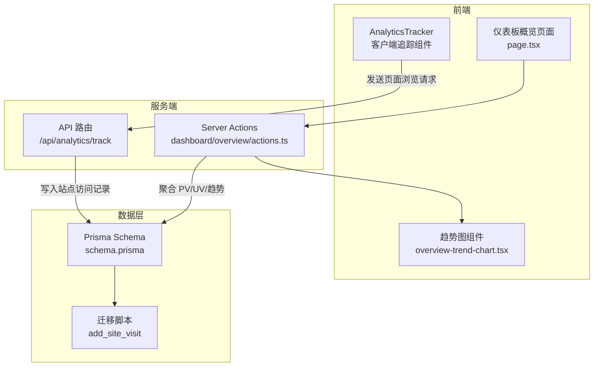
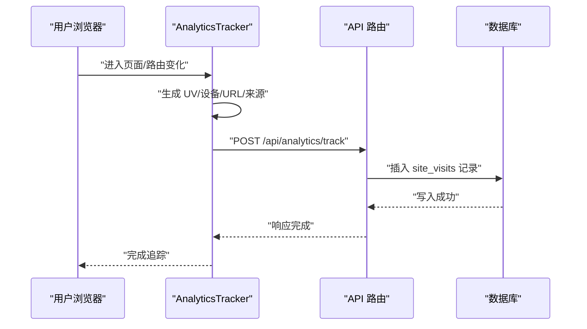
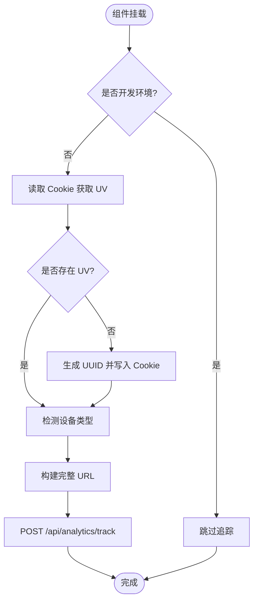
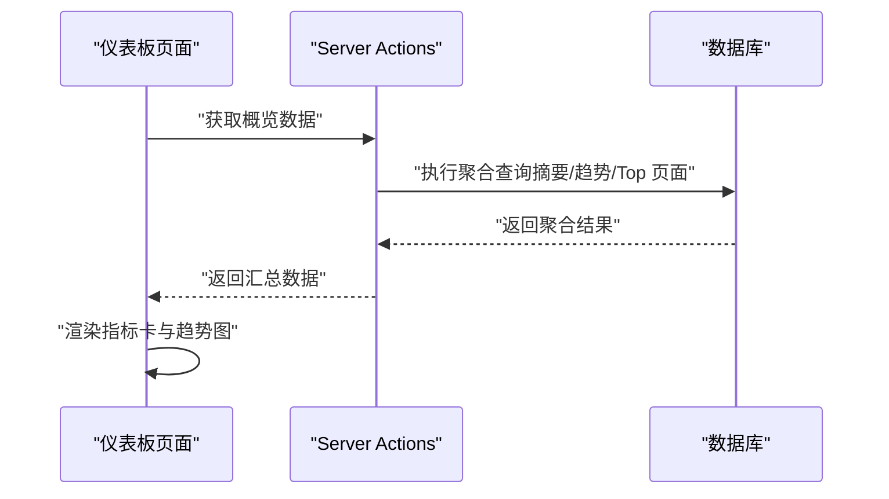
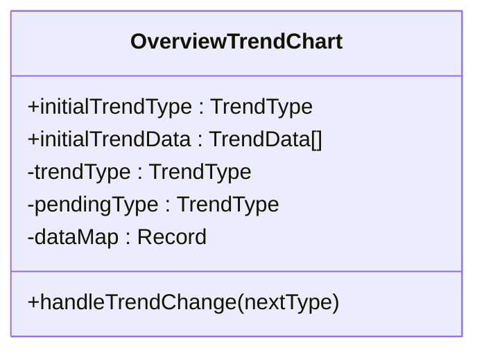
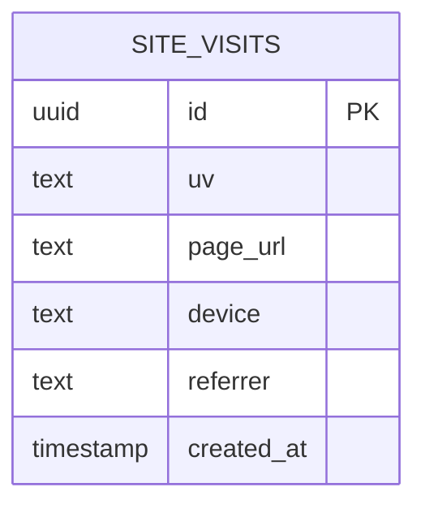
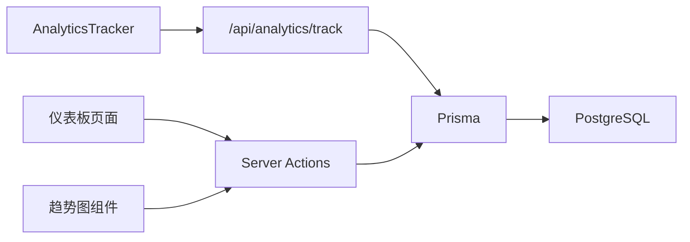

# 数据分析与追踪

<cite>
**本文引用的文件**
- [analytics-tracker.tsx](file://src/components/analytics-tracker.tsx)
- [route.ts](file://src/app/api/analytics/track/route.ts)
- [actions.ts](file://src/app/dashboard/overview/actions.ts)
- [page.tsx](file://src/app/dashboard/overview/page.tsx)
- [overview-trend-chart.tsx](file://src/app/dashboard/overview/components/overview-trend-chart.tsx)
- [schema.prisma](file://prisma/schema.prisma)
- [migration.sql (20260122005608)](file://prisma/migrations/20260122005608_add_site_visit/migration.sql)
- [site-visits-list.tsx](file://src/app/dashboard/site-visits/components/site-visits-list.tsx)
- [client-passive-event-listeners.md](file://.agents/skills/vercel-react-best-practices/rules/client-passive-event-listeners.md)
- [server-serialization.md](file://.agents/skills/vercel-react-best-practices/rules/server-serialization.md)
</cite>

## 目录
1. [简介](#简介)
2. [项目结构](#项目结构)
3. [核心组件](#核心组件)
4. [架构总览](#架构总览)
5. [详细组件分析](#详细组件分析)
6. [依赖关系分析](#依赖关系分析)
7. [性能考量](#性能考量)
8. [故障排查指南](#故障排查指南)
9. [结论](#结论)
10. [附录](#附录)

## 简介
本文件面向“数据分析与追踪系统”，围绕访问统计（PV/UV）、用户行为追踪、性能监控、数据可视化等核心能力，系统阐述从数据采集、实时追踪、数据存储到报表生成的技术实现路径，并提供自定义事件追踪、用户画像分析、流量来源统计、性能指标监控等高级功能的配置与使用建议。文档以仓库现有实现为基础，结合可扩展设计，帮助开发者快速落地与优化分析体系。

## 项目结构
该系统采用 Next.js App Router 架构，前端通过客户端组件进行实时追踪，服务端通过 Server Actions 提供缓存化的聚合查询，数据库使用 Prisma 管理 schema 与迁移，图表渲染基于 Recharts 组件库。

**图表来源**
- [analytics-tracker.tsx:17-78](file://src/components/analytics-tracker.tsx#L17-L78)
- [route.ts](file://src/app/api/analytics/track/route.ts)
- [actions.ts:67-176](file://src/app/dashboard/overview/actions.ts#L67-L176)
- [page.tsx:25-69](file://src/app/dashboard/overview/page.tsx#L25-L69)
- [overview-trend-chart.tsx:1-144](file://src/app/dashboard/overview/components/overview-trend-chart.tsx#L1-L144)
- [schema.prisma](file://prisma/schema.prisma)
- [migration.sql (20260122005608)](file://prisma/migrations/20260122005608_add_site_visit/migration.sql)

**章节来源**
- [analytics-tracker.tsx:17-78](file://src/components/analytics-tracker.tsx#L17-L78)
- [actions.ts:67-176](file://src/app/dashboard/overview/actions.ts#L67-L176)
- [page.tsx:25-69](file://src/app/dashboard/overview/page.tsx#L25-L69)
- [overview-trend-chart.tsx:1-144](file://src/app/dashboard/overview/components/overview-trend-chart.tsx#L1-L144)
- [schema.prisma](file://prisma/schema.prisma)
- [migration.sql (20260122005608)](file://prisma/migrations/20260122005608_add_site_visit/migration.sql)

## 核心组件
- 客户端追踪器：负责在页面变更时采集 UV、设备类型、URL、来源等信息，并通过 API 路由上报。
- 仪表板概览：聚合 PV/UV 指标与趋势，支持日/月/年维度切换。
- Server Actions：封装缓存策略与数据库查询，提供稳定的数据聚合接口。
- 图表组件：基于 Recharts 渲染流量趋势面积图。
- 数据模型：基于 Prisma 的站点访问记录表，支持后续扩展字段。

**章节来源**
- [analytics-tracker.tsx:17-78](file://src/components/analytics-tracker.tsx#L17-L78)
- [actions.ts:10-176](file://src/app/dashboard/overview/actions.ts#L10-L176)
- [overview-trend-chart.tsx:1-144](file://src/app/dashboard/overview/components/overview-trend-chart.tsx#L1-L144)
- [schema.prisma](file://prisma/schema.prisma)

## 架构总览
系统采用“前端采集 + 服务端聚合 + 数据库存储 + 可视化呈现”的分层架构。客户端在路由变化时触发追踪，服务端通过缓存与并行查询提升性能，数据库持久化访问记录，前端图表组件动态渲染趋势。

**图表来源**
- [analytics-tracker.tsx:22-73](file://src/components/analytics-tracker.tsx#L22-L73)
- [route.ts](file://src/app/api/analytics/track/route.ts)

## 详细组件分析

### 客户端追踪器（AnalyticsTracker）
职责与流程
- 初始化：在首次挂载时检查开发环境，避免本地调试干扰线上数据。
- 用户标识：通过 Cookie 识别 UV；若不存在则生成 UUID 并设置一年有效期。
- 设备检测：根据 UA 判断移动端或 PC。
- 数据准备：拼接完整 URL（含查询参数），包含页面 URL、设备类型、来源。
- 请求发送：优先使用 fetch 发送，带 keepalive 保证页面卸载时仍能完成上报；错误统一捕获并记录。

关键特性
- 防重复：同一会话内仅生成一次 UV，确保 UV 准确性。
- 兼容性：在 SPA 导航中可靠触发，利用 keepalive 提升上报成功率。
- 性能：Cookie 读写采用内存缓存策略，减少同步 I/O 开销。

**图表来源**
- [analytics-tracker.tsx:22-73](file://src/components/analytics-tracker.tsx#L22-L73)

**章节来源**
- [analytics-tracker.tsx:17-78](file://src/components/analytics-tracker.tsx#L17-L78)
- [client-passive-event-listeners.md:1-49](file://.agents/skills/vercel-react-best-practices/rules/client-passive-event-listeners.md#L1-L49)

### API 路由（/api/analytics/track）
职责与流程
- 接收来自客户端的页面浏览数据（UV、页面 URL、设备、来源）。
- 将数据写入数据库的站点访问记录表，作为后续分析的基础数据源。
- 返回标准响应，便于前端确认上报结果。

注意
- 当前实现位于前端路由文件中，建议在后续版本中完善鉴权与输入校验，确保数据安全与一致性。

**章节来源**
- [route.ts](file://src/app/api/analytics/track/route.ts)

### Server Actions（仪表板概览）
职责与流程
- 摘要统计：计算总 PV/UV、今日 PV/UV、昨日 PV/UV。
- 趋势查询：按日/月/年维度聚合 PV/UV，支持时间范围裁剪。
- 顶部页面：按 PV 降序列出热门页面。
- 缓存策略：使用 Next.js 不稳定缓存，设置标签与再验证周期，降低数据库压力。

**图表来源**
- [actions.ts:67-176](file://src/app/dashboard/overview/actions.ts#L67-L176)
- [page.tsx:25-69](file://src/app/dashboard/overview/page.tsx#L25-L69)

**章节来源**
- [actions.ts:10-176](file://src/app/dashboard/overview/actions.ts#L10-L176)
- [page.tsx:25-69](file://src/app/dashboard/overview/page.tsx#L25-L69)

### 趋势图组件（OverviewTrendChart）
职责与流程
- 支持日/月/年三种趋势维度切换，使用 useTransition 优化切换体验。
- 内置缓存：对已加载的维度数据进行内存缓存，避免重复请求。
- 图表渲染：基于 Recharts 绘制面积图，区分 PV 与 UV 的渐变填充与线条样式。

**图表来源**
- [overview-trend-chart.tsx:17-39](file://src/app/dashboard/overview/components/overview-trend-chart.tsx#L17-L39)

**章节来源**
- [overview-trend-chart.tsx:1-144](file://src/app/dashboard/overview/components/overview-trend-chart.tsx#L1-L144)

### 数据模型与迁移
- 模型：站点访问记录表（site_visits），用于存储页面浏览事件与相关属性。
- 迁移：包含站点访问表的初始化迁移脚本，确保数据库结构一致。

**图表来源**
- [schema.prisma](file://prisma/schema.prisma)
- [migration.sql (20260122005608)](file://prisma/migrations/20260122005608_add_site_visit/migration.sql)

**章节来源**
- [schema.prisma](file://prisma/schema.prisma)
- [migration.sql (20260122005608)](file://prisma/migrations/20260122005608_add_site_visit/migration.sql)

### 高级功能建议（基于现有实现的扩展）
- 自定义事件追踪
  - 在客户端追踪器中增加事件上报入口，携带事件类型、属性等，通过相同 API 路由上报。
  - 在数据库 schema 中新增事件表，或扩展 site_visits 表字段以容纳事件类型。
- 用户画像分析
  - 基于 UV 与页面访问路径，统计用户偏好、活跃时段、来源渠道等维度，结合 Server Actions 进行聚合。
- 流量来源统计
  - 在现有 referrer 字段基础上，增加来源域名解析与归因逻辑，形成来源分布报表。
- 性能指标监控
  - 在客户端追踪器中集成 Web Vitals 或自定义性能埋点，上报首屏时间、交互延迟等指标，统一存储与可视化。

[本节为概念性扩展说明，不直接分析具体文件，故无“章节来源”标注]

## 依赖关系分析
- 组件耦合
  - AnalyticsTracker 与 API 路由存在直接调用关系，需保持接口稳定性。
  - 仪表板页面依赖 Server Actions 提供的数据，Server Actions 依赖 Prisma 查询。
- 外部依赖
  - Recharts 用于趋势图渲染。
  - date-fns 用于时间范围计算。
  - uuid 用于生成 UV 标识。
  - Prisma 用于数据库访问与迁移管理。

**图表来源**
- [analytics-tracker.tsx:58-66](file://src/components/analytics-tracker.tsx#L58-L66)
- [route.ts](file://src/app/api/analytics/track/route.ts)
- [actions.ts:67-176](file://src/app/dashboard/overview/actions.ts#L67-L176)
- [overview-trend-chart.tsx:15-39](file://src/app/dashboard/overview/components/overview-trend-chart.tsx#L15-L39)

**章节来源**
- [analytics-tracker.tsx:17-78](file://src/components/analytics-tracker.tsx#L17-L78)
- [actions.ts:67-176](file://src/app/dashboard/overview/actions.ts#L67-L176)
- [overview-trend-chart.tsx:1-144](file://src/app/dashboard/overview/components/overview-trend-chart.tsx#L1-L144)

## 性能考量
- 缓存策略
  - 使用 Next.js 不稳定缓存对聚合查询进行缓存，设置合理再验证周期，平衡实时性与性能。
- 序列化优化
  - 服务端仅传递客户端实际使用的字段，减少 RSC 边界序列化开销。
- 事件监听
  - 对非阻塞类事件（如滚动）使用被动监听，避免主线程等待导致的滚动延迟。
- 存储访问
  - 对 Cookie/Storage 的读写进行内存缓存，减少同步 I/O。

**章节来源**
- [actions.ts:67-176](file://src/app/dashboard/overview/actions.ts#L67-L176)
- [server-serialization.md:1-39](file://.agents/skills/vercel-react-best-practices/rules/server-serialization.md#L1-L39)
- [client-passive-event-listeners.md:1-49](file://.agents/skills/vercel-react-best-practices/rules/client-passive-event-listeners.md#L1-L49)

## 故障排查指南
常见问题与处理
- 追踪未生效
  - 检查是否处于开发环境（开发环境默认跳过追踪）。
  - 确认客户端网络请求是否被拦截或跨域限制。
- 数据缺失
  - 核对 API 路由是否正确接收并写入数据库。
  - 检查数据库连接与权限。
- 指标异常
  - 核对 Server Actions 的聚合逻辑与时间范围。
  - 检查缓存标签与再验证配置，必要时手动清理缓存。
- 图表空白
  - 确认趋势数据格式与键名一致，检查图表组件的 data 映射。

**章节来源**
- [analytics-tracker.tsx:22-73](file://src/components/analytics-tracker.tsx#L22-L73)
- [actions.ts:67-176](file://src/app/dashboard/overview/actions.ts#L67-L176)
- [overview-trend-chart.tsx:92-141](file://src/app/dashboard/overview/components/overview-trend-chart.tsx#L92-L141)

## 结论
该数据分析与追踪系统以轻量、可扩展为核心目标：前端通过客户端组件实现可靠的页面浏览追踪，服务端以缓存与并行查询保障性能，数据库提供稳定的事件存储，前端图表直观呈现趋势。在此基础上，可进一步引入自定义事件、用户画像、来源归因与性能指标等高级能力，持续完善分析体系。

## 附录
- 快速上手
  - 在应用根布局或公共布局中挂载 AnalyticsTracker。
  - 在需要展示分析数据的页面调用 Server Actions 获取聚合数据。
  - 使用趋势图组件渲染 PV/UV 趋势。
- 扩展清单
  - 新增事件类型与属性字段。
  - 引入来源解析与归因算法。
  - 增加 Web Vitals 等性能指标采集。
  - 优化缓存策略与查询索引，提升大数据量下的查询效率。