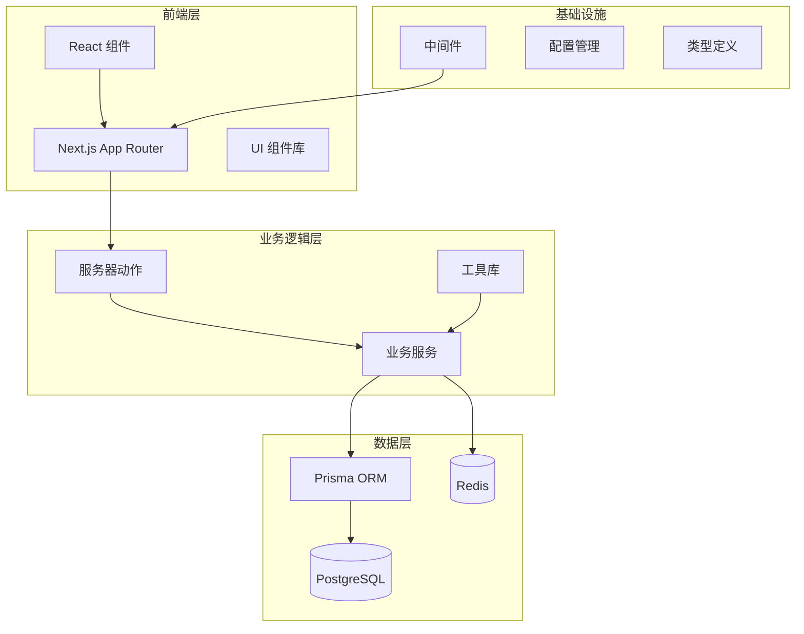
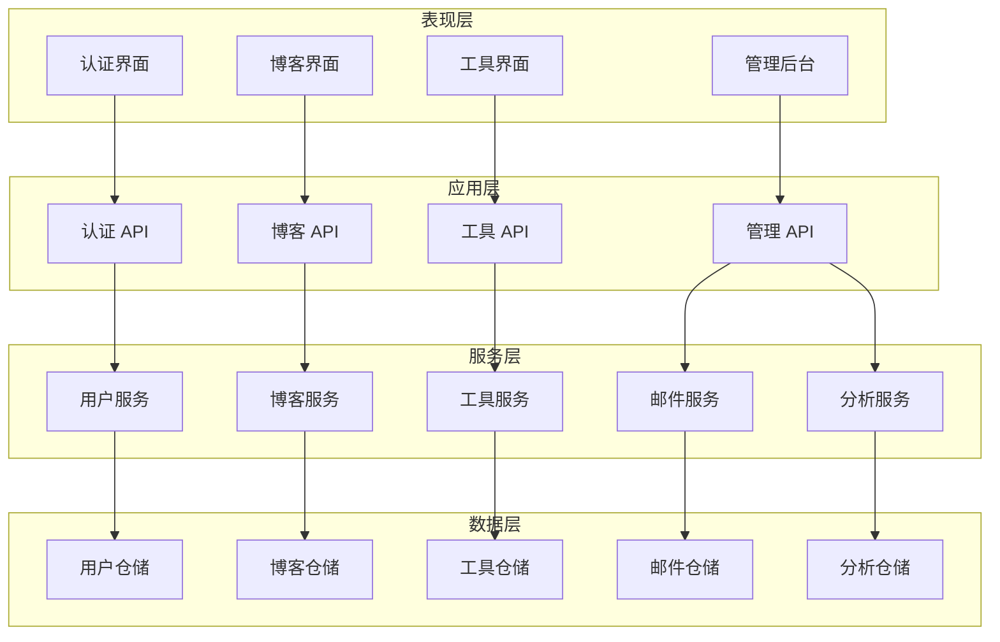
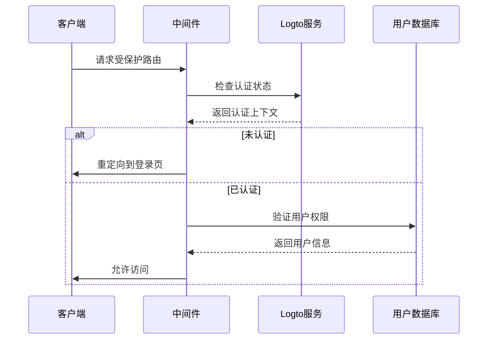
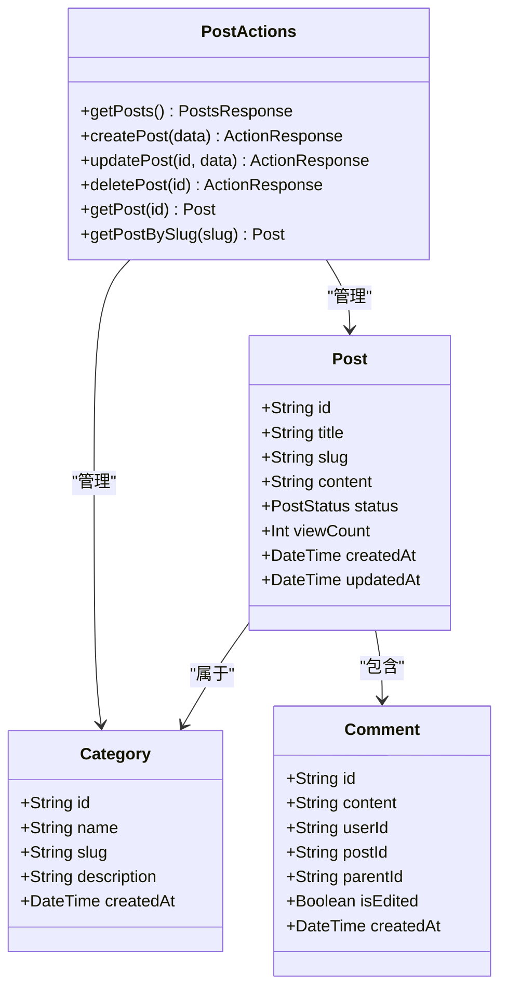
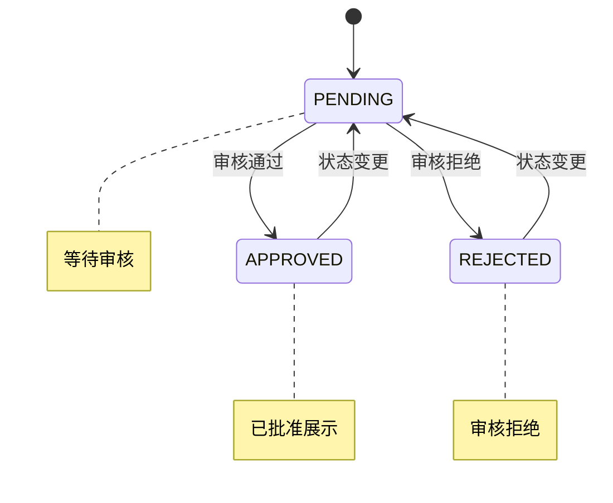
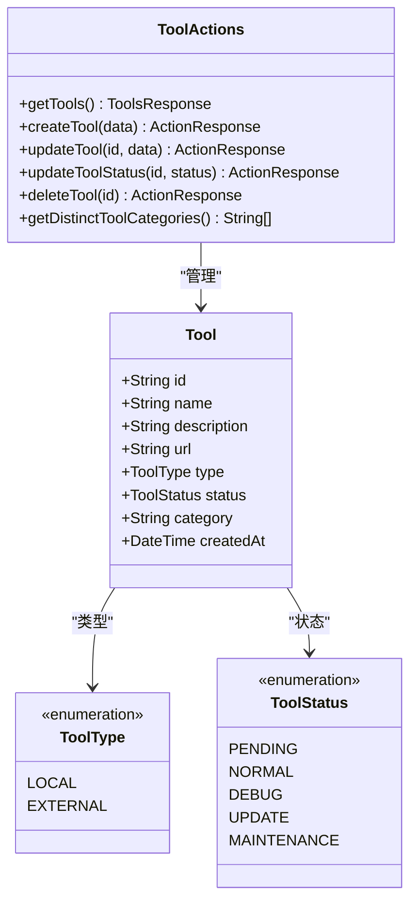
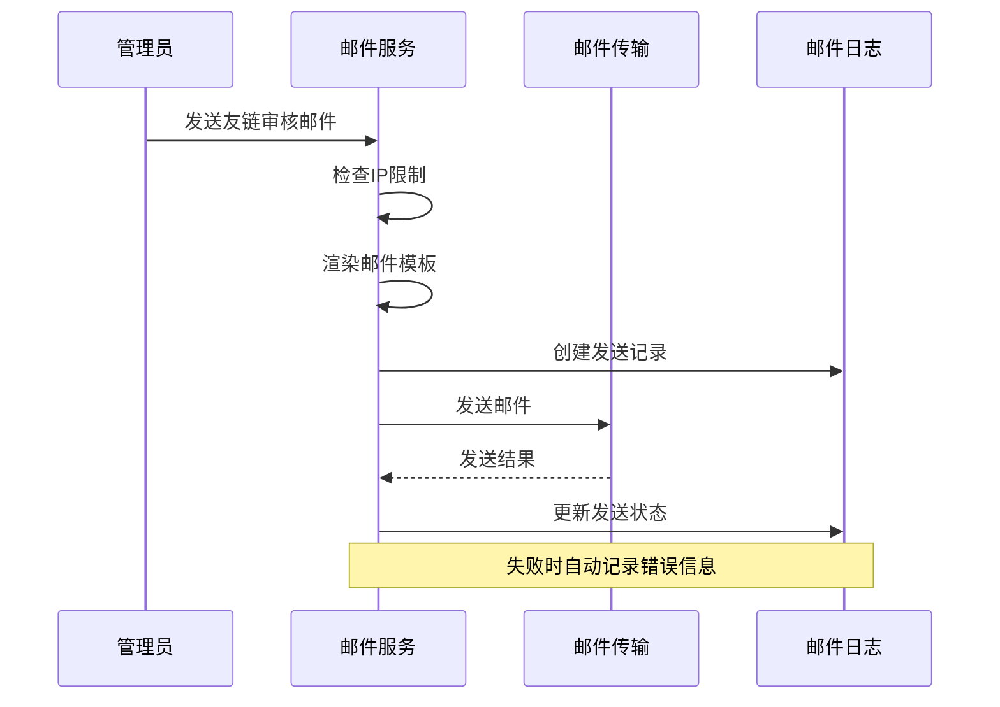
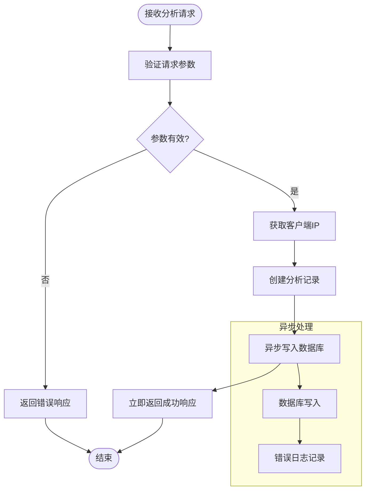
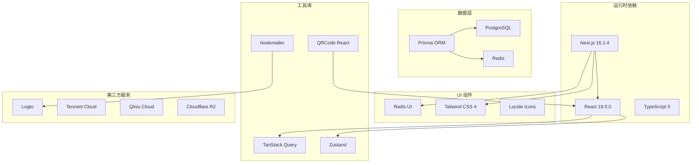

# 核心功能模块

<cite>
**本文档引用的文件**
- [README.md](file://README.md)
- [package.json](file://package.json)
- [schema.prisma](file://prisma/schema.prisma)
- [middleware.ts](file://src/middleware.ts)
- [env.ts](file://src/lib/env.ts)
- [login/page.tsx](file://src/app/(auth)/login/page.tsx)
- [register/page.tsx](file://src/app/(auth)/register/page.tsx)
- [posts/actions.ts](file://src/app/dashboard/posts/actions.ts)
- [categories/actions.ts](file://src/app/dashboard/categories/actions.ts)
- [comments/actions.ts](file://src/app/dashboard/comments/actions.ts)
- [ai-tools/actions.ts](file://src/app/dashboard/ai-tools/actions.ts)
- [tools/actions.ts](file://src/app/dashboard/tools/actions.ts)
- [friend-links/actions.ts](file://src/app/dashboard/friend-links/actions.ts)
- [analytics/track/route.ts](file://src/app/api/analytics/track/route.ts)
- [email-service.ts](file://src/lib/email-service.ts)
</cite>

## 目录
1. [引言](#引言)
2. [项目结构](#项目结构)
3. [核心组件](#核心组件)
4. [架构概览](#架构概览)
5. [详细组件分析](#详细组件分析)
6. [依赖分析](#依赖分析)
7. [性能考虑](#性能考虑)
8. [故障排除指南](#故障排除指南)
9. [结论](#结论)

## 引言

一梦五千年是一个基于 Next.js 16.1.4 的现代化多功能工具平台，集成了用户认证、博客管理、AI 工具库、实用工具箱、友链管理、邮件系统和数据分析等核心功能模块。该项目采用 TypeScript 5 和现代化的技术栈，包括 Radix UI + Tailwind CSS 4、PostgreSQL 数据库、Redis 缓存、Zustand 状态管理和 TanStack Query 数据获取。

## 项目结构

项目采用基于功能的组织方式，主要分为以下层次：

**图表来源**
- [package.json:11-79](file://package.json#L11-L79)
- [middleware.ts:1-36](file://src/middleware.ts#L1-L36)

**章节来源**
- [README.md:54-69](file://README.md#L54-L69)
- [package.json:1-98](file://package.json#L1-L98)

## 核心组件

### 用户系统

用户系统基于 Logto 提供的身份认证服务，支持多种登录方式和权限管理：

- **认证流程**: 通过 `/api/logto/sign-in` 实现统一认证入口
- **权限控制**: 基于角色的访问控制（USER/ADMIN）
- **会话管理**: Edge 环境下的安全会话处理
- **第三方登录**: 支持多种 OAuth 提供商

### 博客管理系统

博客系统提供完整的文章管理功能：

- **内容管理**: 文章的创建、编辑、删除和状态管理
- **分类系统**: 支持多级分类和标签管理
- **评论系统**: 支持嵌套评论和回复功能
- **SEO优化**: 自动生成 URL slug 和元数据

### AI 工具库

AI 工具库模块专注于 AI 工具的收集、审核和展示：

- **工具管理**: 支持工具的添加、编辑、删除和状态控制
- **审核流程**: PENDING/APPROVED/REJECTED 三状态审核机制
- **分类标签**: 基于标签和类别的工具分类
- **实时更新**: 支持工具状态的实时变更

### 实用工具箱

提供多种在线实用工具：

- **Base64 转换**: 文本与 Base64 互转功能
- **二维码生成**: 动态二维码生成功能
- **抽奖系统**: 基于 Web Workers 的高性能抽奖算法
- **文本工具**: JSON 格式化、文本差异比较等

### 友链管理

友链管理系统包含完整的审核流程：

- **申请管理**: 友链申请的提交和审核
- **状态控制**: PENDING/APPROVED/REJECTED 状态管理
- **自动通知**: 审核通过后的邮件自动通知
- **批量操作**: 支持批量审批和拒绝

### 邮件系统

基于 Nodemailer 的邮件发送系统：

- **Gmail 集成**: 支持 Gmail SMTP 发送
- **模板系统**: React Email 模板渲染
- **IP 限制**: 同一 IP 每小时最多发送 3 封邮件
- **日志记录**: 完整的邮件发送历史记录

### 数据分析

网站访问统计和用户行为追踪：

- **埋点收集**: 页面访问、设备信息、来源追踪
- **UV 统计**: 独立访客识别和统计
- **性能监控**: 访问时间和路径分析
- **实时更新**: 基于缓存的实时数据展示

**章节来源**
- [middleware.ts:8-28](file://src/middleware.ts#L8-L28)
- [schema.prisma:15-62](file://prisma/schema.prisma#L15-L62)

## 架构概览

系统采用分层架构设计，确保各模块间的松耦合和高内聚：

**图表来源**
- [middleware.ts:15-27](file://src/middleware.ts#L15-L27)
- [email-service.ts:10-55](file://src/lib/email-service.ts#L10-L55)

## 详细组件分析

### 用户认证组件

用户认证系统采用边缘计算架构，确保安全性和性能：

**图表来源**
- [middleware.ts:21-27](file://src/middleware.ts#L21-L27)
- [login/page.tsx:4](file://src/app/(auth)/login/page.tsx#L4)

**章节来源**
- [middleware.ts:1-36](file://src/middleware.ts#L1-L36)
- [login/page.tsx:1-6](file://src/app/(auth)/login/page.tsx#L1-L6)
- [register/page.tsx:1-6](file://src/app/(auth)/register/page.tsx#L1-L6)

### 博客管理组件

博客管理系统采用服务器动作模式，提供完整的 CRUD 操作：

**图表来源**
- [posts/actions.ts:74-121](file://src/app/dashboard/posts/actions.ts#L74-L121)
- [categories/actions.ts:33-77](file://src/app/dashboard/categories/actions.ts#L33-L77)
- [comments/actions.ts:48-56](file://src/app/dashboard/comments/actions.ts#L48-L56)

**章节来源**
- [posts/actions.ts:1-165](file://src/app/dashboard/posts/actions.ts#L1-L165)
- [categories/actions.ts:1-96](file://src/app/dashboard/categories/actions.ts#L1-L96)
- [comments/actions.ts:1-57](file://src/app/dashboard/comments/actions.ts#L1-L57)

### AI 工具库组件

AI 工具库采用状态驱动的设计模式：

**图表来源**
- [ai-tools/actions.ts:121-131](file://src/app/dashboard/ai-tools/actions.ts#L121-L131)
- [schema.prisma:284-288](file://prisma/schema.prisma#L284-L288)

**章节来源**
- [ai-tools/actions.ts:1-144](file://src/app/dashboard/ai-tools/actions.ts#L1-L144)
- [schema.prisma:184-198](file://prisma/schema.prisma#L184-L198)

### 实用工具箱组件

工具箱采用模块化设计，支持多种工具类型：

**图表来源**
- [tools/actions.ts:121-131](file://src/app/dashboard/tools/actions.ts#L121-L131)
- [schema.prisma:290-301](file://prisma/schema.prisma#L290-L301)

**章节来源**
- [tools/actions.ts:1-143](file://src/app/dashboard/tools/actions.ts#L1-L143)
- [schema.prisma:200-214](file://prisma/schema.prisma#L200-L214)

### 邮件系统组件

邮件系统采用异步处理和重试机制：

**图表来源**
- [email-service.ts:57-123](file://src/lib/email-service.ts#L57-L123)
- [email-service.ts:158-214](file://src/lib/email-service.ts#L158-L214)

**章节来源**
- [email-service.ts:1-215](file://src/lib/email-service.ts#L1-L215)

### 数据分析组件

数据分析系统采用无阻塞写入模式：

**图表来源**
- [analytics/track/route.ts:4-45](file://src/app/api/analytics/track/route.ts#L4-L45)

**章节来源**
- [analytics/track/route.ts:1-54](file://src/app/api/analytics/track/route.ts#L1-L54)

## 依赖分析

系统依赖关系呈现清晰的分层结构：

**图表来源**
- [package.json:11-79](file://package.json#L11-L79)
- [env.ts:18-32](file://src/lib/env.ts#L18-L32)

**章节来源**
- [package.json:1-98](file://package.json#L1-L98)
- [env.ts:1-40](file://src/lib/env.ts#L1-L40)

## 性能考虑

系统在多个层面实现了性能优化：

### 缓存策略
- **服务器端缓存**: 使用 Next.js `unstable_cache` 实现智能缓存
- **数据库查询优化**: Prisma 关联查询优化，减少 N+1 查询问题
- **静态资源优化**: Cloudflare CDN 加速静态资源加载

### 数据库优化
- **索引策略**: 为常用查询字段建立复合索引
- **连接池管理**: PostgreSQL 连接池配置优化
- **查询优化**: 使用 `relationJoins` 减少查询往返次数

### 前端性能
- **代码分割**: Next.js 自动代码分割
- **懒加载**: 图片和组件的懒加载实现
- **状态管理**: Zustand 轻量级状态管理

## 故障排除指南

### 常见问题及解决方案

**认证问题**
- 检查 Logto 配置是否正确
- 验证 JWT 密钥设置
- 确认回调 URL 配置

**数据库连接问题**
- 验证 DATABASE_URL 格式
- 检查 PostgreSQL 服务状态
- 确认 Prisma 迁移执行情况

**邮件发送失败**
- 检查 Gmail 配置
- 验证 IP 限制规则
- 查看邮件日志记录

**性能问题**
- 检查 Redis 连接状态
- 监控数据库查询性能
- 分析缓存命中率

**章节来源**
- [README.md:71-89](file://README.md#L71-L89)
- [email-service.ts:10-55](file://src/lib/email-service.ts#L10-L55)

## 结论

一梦五千年项目展现了现代全栈应用的最佳实践，通过合理的架构设计和丰富的功能模块，为用户提供了完整的工具平台体验。系统采用的技术栈成熟稳定，模块间职责清晰，具有良好的可维护性和扩展性。

项目的亮点包括：
- 完整的用户认证和权限管理体系
- 灵活的博客内容管理功能
- 丰富的实用工具集合
- 高效的邮件通知系统
- 实时的数据分析能力

通过持续的优化和迭代，该项目为类似工具平台的开发提供了优秀的参考范例。