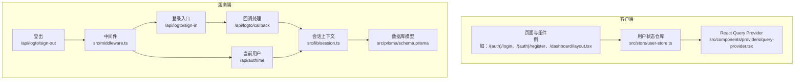
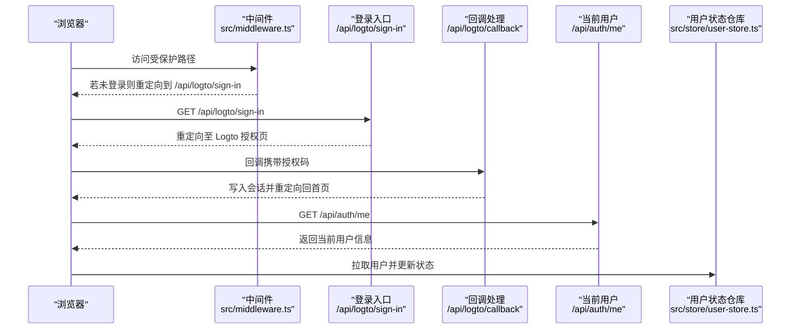
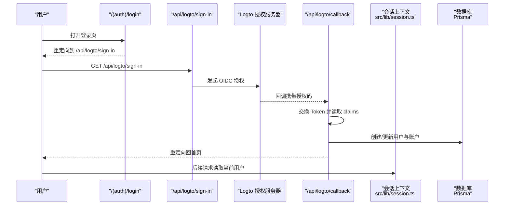
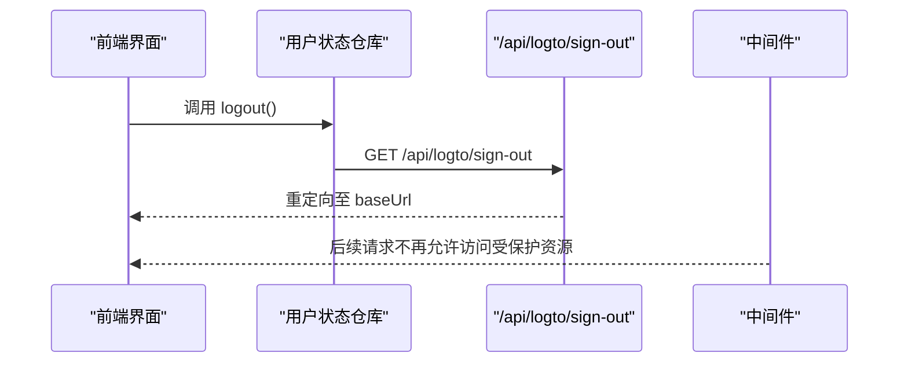
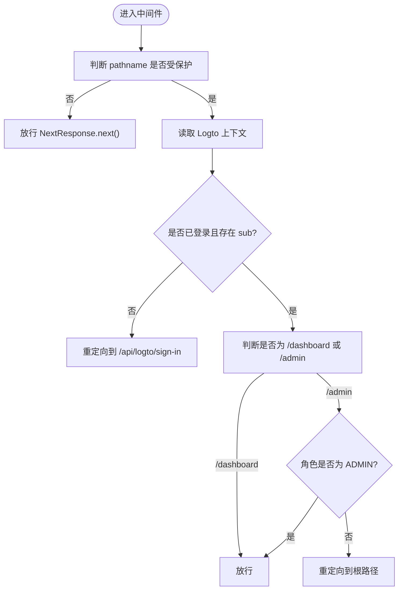
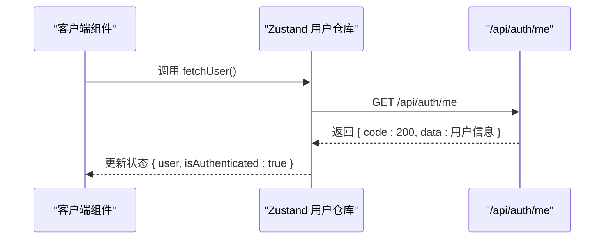
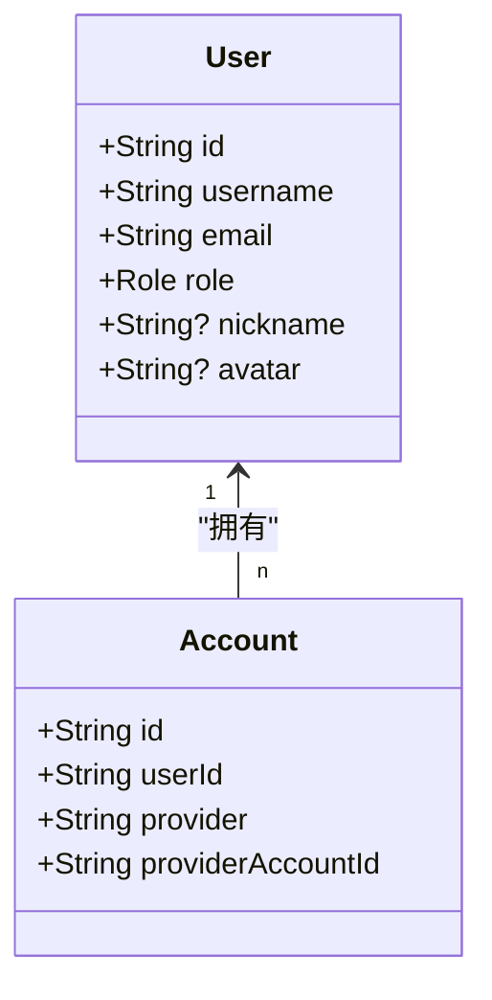
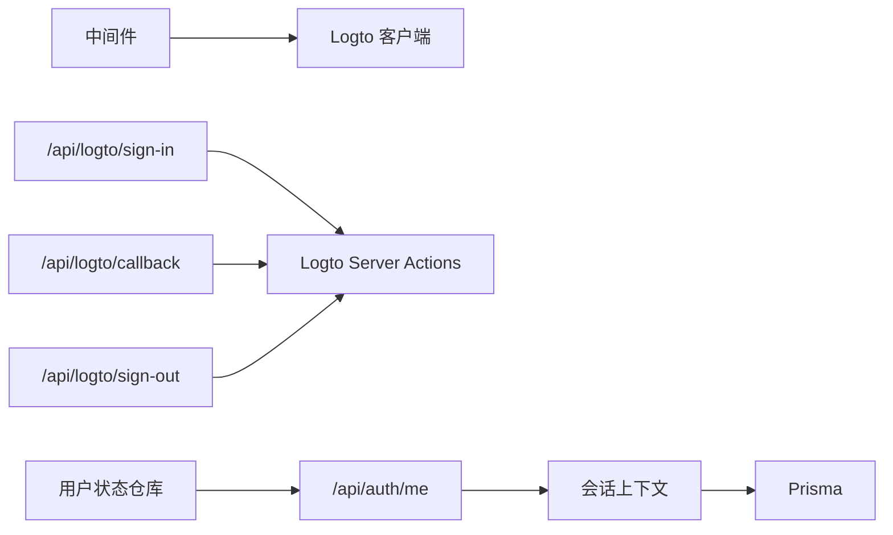

# 用户系统

<cite>
**本文引用的文件**
- [src/lib/logto.ts](file://src/lib/logto.ts)
- [src/middleware.ts](file://src/middleware.ts)
- [src/lib/session.ts](file://src/lib/session.ts)
- [src/store/user-store.ts](file://src/store/user-store.ts)
- [src/app/api/auth/me/route.ts](file://src/app/api/auth/me/route.ts)
- [src/app/api/logto/sign-in/route.ts](file://src/app/api/logto/sign-in/route.ts)
- [src/app/api/logto/callback/route.ts](file://src/app/api/logto/callback/route.ts)
- [src/app/api/logto/sign-out/route.ts](file://src/app/api/logto/sign-out/route.ts)
- [src/app/(auth)/login/page.tsx](file://src/app/(auth)/login/page.tsx)
- [src/app/(auth)/register/page.tsx](file://src/app/(auth)/register/page.tsx)
- [src/app/dashboard/layout.tsx](file://src/app/dashboard/layout.tsx)
- [src/app/admin/login/layout.tsx](file://src/app/admin/login/layout.tsx)
- [src/prisma/schema.prisma](file://src/prisma/schema.prisma)
- [src/components/providers/query-provider.tsx](file://src/components/providers/query-provider.tsx)
- [src/app/api/users/route.ts](file://src/app/api/users/route.ts)
</cite>

## 目录
1. [引言](#引言)
2. [项目结构](#项目结构)
3. [核心组件](#核心组件)
4. [架构总览](#架构总览)
5. [详细组件分析](#详细组件分析)
6. [依赖关系分析](#依赖关系分析)
7. [性能考虑](#性能考虑)
8. [故障排查指南](#故障排查指南)
9. [结论](#结论)
10. [附录](#附录)

## 引言
本文件面向“用户系统”的功能与技术实现，围绕以下目标展开：用户注册、登录、注销流程；基于 Logto 的身份认证与会话管理；权限控制与中间件校验；用户角色与权限体系；安全策略（如 Cookie 安全标志）；Token 管理与持久化；用户状态管理、自动登录与“记住我”相关能力的现状与最佳实践建议。文档同时提供流程图与时序图，帮助读者快速理解端到端的交互。

## 项目结构
用户系统由前端路由、服务端中间件、API 路由、状态管理与数据库模型共同组成。关键路径如下：
- 身份认证入口：/api/logto/sign-in、/api/logto/callback、/api/logto/sign-out
- 当前用户信息：/api/auth/me
- 登录/注册页面：/(auth)/login、/(auth)/register
- 中间件保护：/dashboard、/admin
- 状态管理：Zustand 用户仓库
- 数据模型：Prisma User、Account

图表来源
- [src/middleware.ts:1-36](file://src/middleware.ts#L1-L36)
- [src/app/api/logto/sign-in/route.ts:1-9](file://src/app/api/logto/sign-in/route.ts#L1-L9)
- [src/app/api/logto/callback/route.ts:1-66](file://src/app/api/logto/callback/route.ts#L1-L66)
- [src/app/api/logto/sign-out/route.ts:1-7](file://src/app/api/logto/sign-out/route.ts#L1-L7)
- [src/app/api/auth/me/route.ts:1-13](file://src/app/api/auth/me/route.ts#L1-L13)
- [src/lib/session.ts:1-42](file://src/lib/session.ts#L1-L42)
- [src/store/user-store.ts:1-49](file://src/store/user-store.ts#L1-L49)
- [src/prisma/schema.prisma:15-82](file://src/prisma/schema.prisma#L15-L82)

章节来源
- [src/middleware.ts:1-36](file://src/middleware.ts#L1-L36)
- [src/app/api/logto/sign-in/route.ts:1-9](file://src/app/api/logto/sign-in/route.ts#L1-L9)
- [src/app/api/logto/callback/route.ts:1-66](file://src/app/api/logto/callback/route.ts#L1-L66)
- [src/app/api/logto/sign-out/route.ts:1-7](file://src/app/api/logto/sign-out/route.ts#L1-L7)
- [src/app/api/auth/me/route.ts:1-13](file://src/app/api/auth/me/route.ts#L1-L13)
- [src/lib/session.ts:1-42](file://src/lib/session.ts#L1-L42)
- [src/store/user-store.ts:1-49](file://src/store/user-store.ts#L1-L49)
- [src/prisma/schema.prisma:15-82](file://src/prisma/schema.prisma#L15-L82)

## 核心组件
- Logto 配置与环境变量：负责 endpoint、appId、scopes、baseUrl、cookieSecret、cookieSecure 等参数注入。
- 中间件：统一拦截受保护路径，校验登录态并进行重定向。
- 会话上下文：封装当前用户读取逻辑，结合 Prisma 查询用户信息。
- 用户状态仓库：前端 Zustand 状态，支持拉取当前用户、更新用户信息、触发登出。
- 登录/注册页面：重定向至 /api/logto/sign-in，交由 Logto 处理 OIDC 流程。
- 回调与用户建模：在回调完成后，根据 claims 创建或更新本地用户与账户记录。
- 权限控制：后台管理路由在服务端校验角色是否为 ADMIN。

章节来源
- [src/lib/logto.ts:1-13](file://src/lib/logto.ts#L1-L13)
- [src/middleware.ts:1-36](file://src/middleware.ts#L1-L36)
- [src/lib/session.ts:1-42](file://src/lib/session.ts#L1-L42)
- [src/store/user-store.ts:1-49](file://src/store/user-store.ts#L1-L49)
- [src/app/(auth)/login/page.tsx:1-6](file://src/app/(auth)/login/page.tsx#L1-L6)
- [src/app/(auth)/register/page.tsx:1-6](file://src/app/(auth)/register/page.tsx#L1-L6)
- [src/app/api/logto/callback/route.ts:1-66](file://src/app/api/logto/callback/route.ts#L1-L66)
- [src/app/dashboard/layout.tsx:1-26](file://src/app/dashboard/layout.tsx#L1-L26)

## 架构总览
下图展示从浏览器发起访问到完成登录与会话建立的关键步骤，以及后续的受保护资源访问链路。

图表来源
- [src/middleware.ts:8-28](file://src/middleware.ts#L8-L28)
- [src/app/api/logto/sign-in/route.ts:1-9](file://src/app/api/logto/sign-in/route.ts#L1-L9)
- [src/app/api/logto/callback/route.ts:1-66](file://src/app/api/logto/callback/route.ts#L1-L66)
- [src/app/api/auth/me/route.ts:1-13](file://src/app/api/auth/me/route.ts#L1-L13)
- [src/store/user-store.ts:26-38](file://src/store/user-store.ts#L26-L38)

## 详细组件分析

### 登录流程（OIDC + Logto）
- 入口页面将用户重定向至 /api/logto/sign-in，该路由通过 server-actions 将用户引导至 Logto 授权服务器。
- 回调路由接收授权码并交换 Token，随后读取 claims 并在本地数据库中创建或更新用户与账户记录。
- 成功后重定向回首页，并在后续请求中通过中间件与会话上下文识别登录态。

图表来源
- [src/app/(auth)/login/page.tsx:1-6](file://src/app/(auth)/login/page.tsx#L1-L6)
- [src/app/api/logto/sign-in/route.ts:1-9](file://src/app/api/logto/sign-in/route.ts#L1-L9)
- [src/app/api/logto/callback/route.ts:1-66](file://src/app/api/logto/callback/route.ts#L1-L66)
- [src/lib/session.ts:17-41](file://src/lib/session.ts#L17-L41)

章节来源
- [src/app/(auth)/login/page.tsx:1-6](file://src/app/(auth)/login/page.tsx#L1-L6)
- [src/app/api/logto/sign-in/route.ts:1-9](file://src/app/api/logto/sign-in/route.ts#L1-L9)
- [src/app/api/logto/callback/route.ts:1-66](file://src/app/api/logto/callback/route.ts#L1-L66)
- [src/lib/session.ts:17-41](file://src/lib/session.ts#L17-L41)

### 注销流程
- 登出接口调用 server-actions 清理会话并重定向至 baseUrl。
- 前端可通过用户状态仓库触发登出，内部跳转至 /api/logto/sign-out。

图表来源
- [src/store/user-store.ts:40-42](file://src/store/user-store.ts#L40-L42)
- [src/app/api/logto/sign-out/route.ts:1-7](file://src/app/api/logto/sign-out/route.ts#L1-L7)
- [src/middleware.ts:21-25](file://src/middleware.ts#L21-L25)

章节来源
- [src/store/user-store.ts:40-42](file://src/store/user-store.ts#L40-L42)
- [src/app/api/logto/sign-out/route.ts:1-7](file://src/app/api/logto/sign-out/route.ts#L1-L7)
- [src/middleware.ts:21-25](file://src/middleware.ts#L21-L25)

### 中间件与权限控制
- 中间件拦截 /dashboard 与 /admin 路径，检查登录态与角色。
- 对于 /dashboard，若未登录则重定向至 /api/logto/sign-in；对于 /admin，除登录外还需角色为 ADMIN。
- 匹配器仅作用于受保护路径，减少不必要校验。

图表来源
- [src/middleware.ts:8-28](file://src/middleware.ts#L8-L28)
- [src/app/dashboard/layout.tsx:10-18](file://src/app/dashboard/layout.tsx#L10-L18)

章节来源
- [src/middleware.ts:8-28](file://src/middleware.ts#L8-L28)
- [src/app/dashboard/layout.tsx:10-18](file://src/app/dashboard/layout.tsx#L10-L18)

### 用户状态管理与自动登录
- 前端通过用户状态仓库拉取当前用户：GET /api/auth/me，成功后设置 isAuthenticated 与用户信息。
- 仓库提供更新用户信息的方法，便于在前端即时反映头像、昵称等变更。
- 自动登录：由于中间件与回调均基于会话上下文，只要浏览器持有有效会话 Cookie，即可实现自动登录。

图表来源
- [src/store/user-store.ts:26-38](file://src/store/user-store.ts#L26-L38)
- [src/app/api/auth/me/route.ts:4-12](file://src/app/api/auth/me/route.ts#L4-L12)

章节来源
- [src/store/user-store.ts:26-38](file://src/store/user-store.ts#L26-L38)
- [src/app/api/auth/me/route.ts:4-12](file://src/app/api/auth/me/route.ts#L4-L12)

### 角色权限体系与安全策略
- 角色枚举：USER、ADMIN。
- 权限控制：后台管理路由在服务端校验角色；前台组件也可基于用户角色渲染不同菜单与操作。
- 安全策略：Cookie 安全标志由 NODE_ENV 控制，生产环境启用 secure；同时配置了 email scope 以获取邮箱信息。

图表来源
- [src/prisma/schema.prisma:15-82](file://src/prisma/schema.prisma#L15-L82)

章节来源
- [src/prisma/schema.prisma:262-265](file://src/prisma/schema.prisma#L262-L265)
- [src/app/api/logto/callback/route.ts:40-43](file://src/app/api/logto/callback/route.ts#L40-L43)
- [src/lib/logto.ts:6-12](file://src/lib/logto.ts#L6-L12)

### 密码加密存储与第三方登录
- 数据模型中 password 字段为可选，表明系统支持第三方登录（如 Logto）直接创建用户，无需本地密码。
- 若未来引入本地密码登录，应在此处补充密码哈希策略与验证流程。

章节来源
- [src/prisma/schema.prisma:22-23](file://src/prisma/schema.prisma#L22-L23)

### Token 管理
- 回调路由在成功换取 Token 后，会写入会话上下文，后续请求通过 getLogtoContext 读取 claims 与认证状态。
- 会话 Cookie 的 secure 属性由环境变量控制，确保 HTTPS 下的安全传输。

章节来源
- [src/app/api/logto/callback/route.ts:10-16](file://src/app/api/logto/callback/route.ts#L10-L16)
- [src/lib/logto.ts:11-12](file://src/lib/logto.ts#L11-L12)

### “记住我”与会话持久化
- 当前实现依赖浏览器会话 Cookie 与 Logto 会话保持，未见显式的“记住我”长周期 Token 存储。
- 如需“记住我”，可在回调后生成并持久化刷新 Token，或调整 Cookie 过期策略与刷新机制。

章节来源
- [src/app/api/logto/callback/route.ts:10-16](file://src/app/api/logto/callback/route.ts#L10-L16)
- [src/lib/logto.ts:11-12](file://src/lib/logto.ts#L11-L12)

## 依赖关系分析
- 中间件依赖 Logto Edge 客户端与配置。
- 登录/回调/登出 API 依赖 @logto/next server-actions。
- 会话上下文依赖 Prisma 查询用户与账户。
- 前端用户仓库依赖 /api/auth/me 获取当前用户。

图表来源
- [src/middleware.ts:3-6](file://src/middleware.ts#L3-L6)
- [src/app/api/logto/sign-in/route.ts:1-8](file://src/app/api/logto/sign-in/route.ts#L1-L8)
- [src/app/api/logto/callback/route.ts:2-10](file://src/app/api/logto/callback/route.ts#L2-L10)
- [src/app/api/logto/sign-out/route.ts:1-6](file://src/app/api/logto/sign-out/route.ts#L1-L6)
- [src/app/api/auth/me/route.ts:2](file://src/app/api/auth/me/route.ts#L2)
- [src/lib/session.ts:2-4](file://src/lib/session.ts#L2-L4)
- [src/store/user-store.ts:28](file://src/store/user-store.ts#L28)

章节来源
- [src/middleware.ts:3-6](file://src/middleware.ts#L3-L6)
- [src/app/api/logto/sign-in/route.ts:1-8](file://src/app/api/logto/sign-in/route.ts#L1-L8)
- [src/app/api/logto/callback/route.ts:2-10](file://src/app/api/logto/callback/route.ts#L2-L10)
- [src/app/api/logto/sign-out/route.ts:1-6](file://src/app/api/logto/sign-out/route.ts#L1-L6)
- [src/app/api/auth/me/route.ts:2](file://src/app/api/auth/me/route.ts#L2)
- [src/lib/session.ts:2-4](file://src/lib/session.ts#L2-L4)
- [src/store/user-store.ts:28](file://src/store/user-store.ts#L28)

## 性能考虑
- 请求级缓存：getCurrentUser 使用 React cache 对同一请求内的多次调用进行去重，降低重复校验与数据库查询成本。
- 查询优化：Prisma schema 开启 relationJoins 预览特性，减少关联查询往返次数。
- 缓存策略：QueryClient 默认 staleTime 为 60 秒，有助于减少不必要的重复请求。

章节来源
- [src/lib/session.ts:17-17](file://src/lib/session.ts#L17-L17)
- [src/prisma/schema.prisma:3-5](file://src/prisma/schema.prisma#L3-L5)
- [src/components/providers/query-provider.tsx:11-14](file://src/components/providers/query-provider.tsx#L11-L14)

## 故障排查指南
- 无法访问受保护资源
  - 检查中间件匹配器与受保护路径是否正确。
  - 确认 /api/logto/sign-in 是否被正确重定向。
- 登录后仍提示未登录
  - 核对 /api/auth/me 返回状态与响应体。
  - 确保前端用户仓库 fetchUser() 已执行且无异常。
- 回调未创建用户
  - 检查回调路由是否成功读取 claims 并写入数据库。
  - 确认 unique 约束冲突处理逻辑（用户名去重）。
- 登出无效
  - 确认 /api/logto/sign-out 是否返回重定向。
  - 检查浏览器 Cookie 是否被清除或跨域限制导致失效。

章节来源
- [src/middleware.ts:15-25](file://src/middleware.ts#L15-L25)
- [src/app/api/auth/me/route.ts:7-9](file://src/app/api/auth/me/route.ts#L7-L9)
- [src/store/user-store.ts:26-38](file://src/store/user-store.ts#L26-L38)
- [src/app/api/logto/callback/route.ts:21-62](file://src/app/api/logto/callback/route.ts#L21-L62)
- [src/app/api/logto/sign-out/route.ts:4-6](file://src/app/api/logto/sign-out/route.ts#L4-L6)

## 结论
本用户系统以 Logto 作为 OIDC 提供方，结合中间件与会话上下文实现了受保护资源的访问控制与用户状态管理。回调阶段完成用户与账户的本地落库，配合前端 Zustand 实现自动登录与状态同步。当前实现具备良好的可扩展性：可按需引入本地密码登录、增强 Token 刷新与“记住我”能力，并进一步细化权限粒度与审计日志。

## 附录
- 管理端用户列表接口：支持分页与排序，便于后台管理。
- 管理端登录页布局：提供独立的视觉风格与背景装饰。

章节来源
- [src/app/api/users/route.ts:4-44](file://src/app/api/users/route.ts#L4-L44)
- [src/app/admin/login/layout.tsx:1-23](file://src/app/admin/login/layout.tsx#L1-L23)