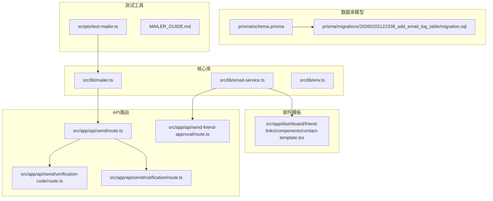
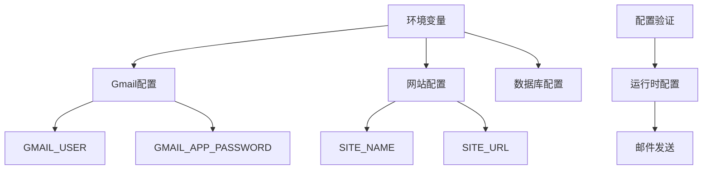
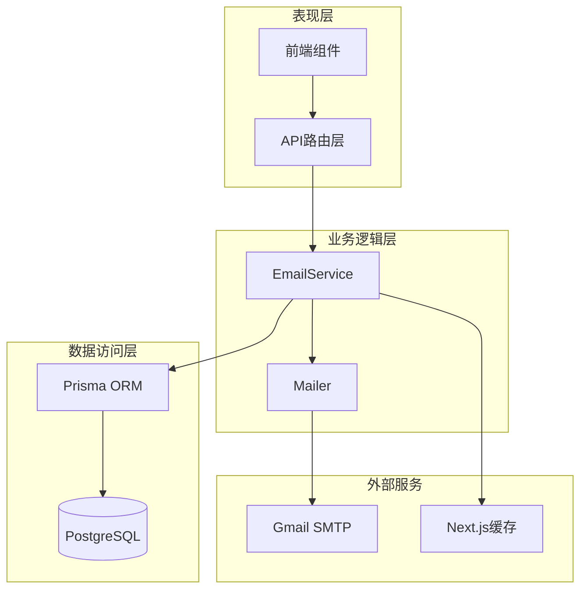
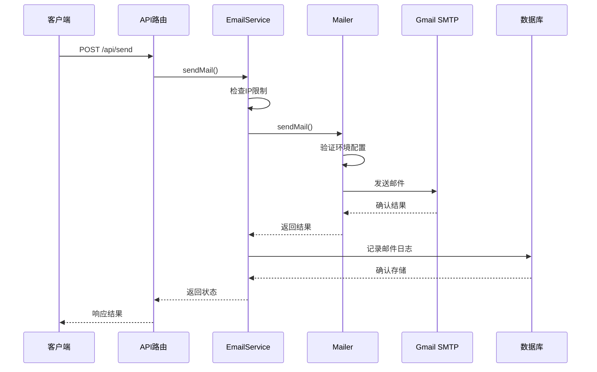
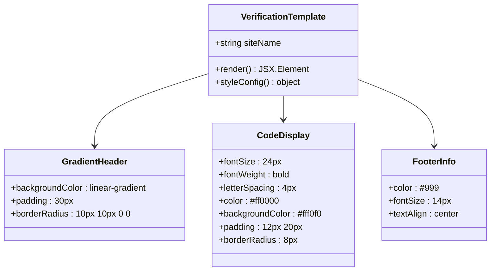
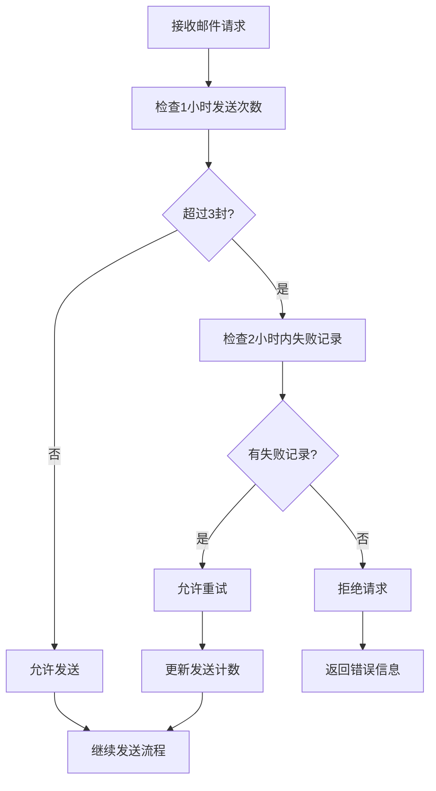
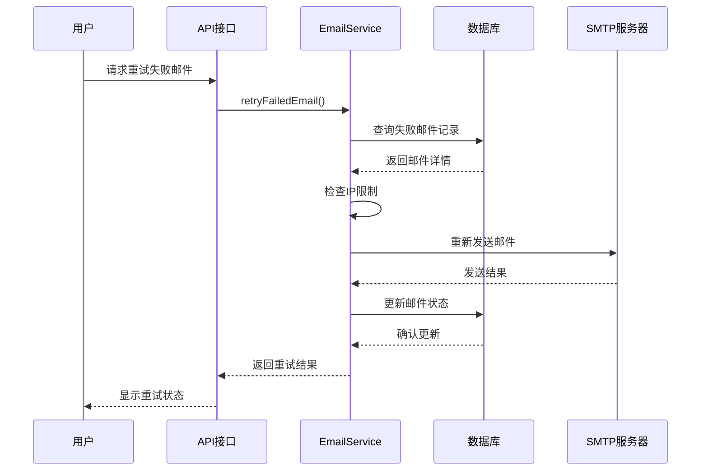
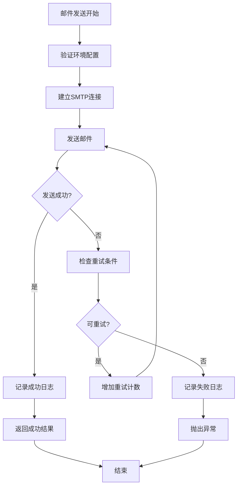

# 邮件通知系统

<cite>
**本文档引用的文件**
- [email-service.ts](file://src/lib/email-service.ts)
- [mailer.ts](file://src/lib/mailer.ts)
- [MAILER_GUIDE.md](file://MAILER_GUIDE.md)
- [schema.prisma](file://prisma/schema.prisma)
- [route.ts](file://src/app/api/send/route.ts)
- [verification-code/route.ts](file://src/app/api/send/verification-code/route.ts)
- [notification/route.ts](file://src/app/api/send/notification/route.ts)
- [send-friend-approval/route.ts](file://src/app/api/send-friend-approval/route.ts)
- [contact-template.tsx](file://src/app/dashboard/friend-links/components/contact-template.tsx)
- [env.ts](file://src/lib/env.ts)
- [test-mailer.ts](file://scripts/test-mailer.ts)
- [package.json](file://package.json)
</cite>

## 目录
1. [引言](#引言)
2. [项目结构](#项目结构)
3. [核心组件](#核心组件)
4. [架构概览](#架构概览)
5. [详细组件分析](#详细组件分析)
6. [依赖分析](#依赖分析)
7. [性能考虑](#性能考虑)
8. [故障排除指南](#故障排除指南)
9. [结论](#结论)
10. [附录](#附录)

## 引言

邮件通知系统是一个基于Next.js构建的现代化邮件发送解决方案，集成了Gmail SMTP服务，提供了完整的邮件发送、模板管理和监控功能。该系统支持多种邮件类型，包括验证码邮件、友链审核通知和系统通知，并具备完善的错误处理、重试机制和邮件统计功能。

## 项目结构

邮件通知系统采用模块化架构设计，主要包含以下核心目录和文件：



**图表来源**
- [mailer.ts:1-156](file://src/lib/mailer.ts#L1-L156)
- [email-service.ts:1-215](file://src/lib/email-service.ts#L1-L215)
- [route.ts:1-150](file://src/app/api/send/route.ts#L1-L150)

**章节来源**
- [package.json:1-98](file://package.json#L1-L98)
- [MAILER_GUIDE.md:1-189](file://MAILER_GUIDE.md#L1-L189)

## 核心组件

### 邮件服务核心架构

系统的核心由三个主要组件构成：

1. **Mailer模块** - 负责Gmail SMTP配置和基础邮件发送
2. **EmailService模块** - 提供业务逻辑封装和IP限制管理
3. **API路由层** - 处理HTTP请求和参数验证

### 配置管理系统

系统采用分层配置策略，确保安全性与灵活性：



**图表来源**
- [env.ts:1-40](file://src/lib/env.ts#L1-L40)
- [mailer.ts:17-28](file://src/lib/mailer.ts#L17-L28)

**章节来源**
- [env.ts:1-40](file://src/lib/env.ts#L1-L40)
- [mailer.ts:17-64](file://src/lib/mailer.ts#L17-L64)

## 架构概览

邮件通知系统采用分层架构设计，实现了清晰的关注点分离：



**图表来源**
- [email-service.ts:10-55](file://src/lib/email-service.ts#L10-L55)
- [mailer.ts:31-64](file://src/lib/mailer.ts#L31-L64)
- [schema.prisma:243-260](file://prisma/schema.prisma#L243-L260)

## 详细组件分析

### Gmail SMTP配置与集成

系统使用Nodemailer作为邮件传输代理，配置为Gmail SMTP服务：

#### SMTP配置详情

| 配置项 | 值 | 说明 |
|--------|-----|------|
| 主机 | smtp.gmail.com | Gmail SMTP服务器 |
| 端口 | 465 | 安全SSL端口 |
| 安全性 | true | 启用SSL加密 |
| 认证方式 | 应用专用密码 | 更安全的认证方案 |

#### 邮件发送流程



**图表来源**
- [route.ts:38-74](file://src/app/api/send/route.ts#L38-L74)
- [email-service.ts:74-123](file://src/lib/email-service.ts#L74-L123)
- [mailer.ts:31-64](file://src/lib/mailer.ts#L31-L64)

**章节来源**
- [mailer.ts:17-64](file://src/lib/mailer.ts#L17-L64)
- [route.ts:38-74](file://src/app/api/send/route.ts#L38-L74)

### 邮件模板引擎与设计

系统采用React Email组件库实现响应式邮件模板设计：

#### 验证码邮件模板

验证码邮件模板采用现代化设计，突出显示6位验证码：



**图表来源**
- [mailer.ts:66-120](file://src/lib/mailer.ts#L66-L120)

#### 友链审核通知模板

友链审核通知使用专业的博客模板设计：

| 设计元素 | 样式属性 | 说明 |
|----------|----------|------|
| 主容器 | backgroundColor: #f9fafb | 浅灰色背景 |
| 标题区域 | textAlign: center | 居中对齐 |
| 内容区域 | backgroundColor: #ffffff | 白色背景 |
| 按钮样式 | backgroundColor: #4F46E5 | 靛蓝色按钮 |
| 分割线 | borderColor: #f3f4f6 | 浅灰色分割线 |

**章节来源**
- [contact-template.tsx:6-58](file://src/app/dashboard/friend-links/components/contact-template.tsx#L6-L58)
- [mailer.ts:122-156](file://src/lib/mailer.ts#L122-L156)

### 邮件队列管理与IP限制

系统实现了智能的邮件队列管理和IP频率限制机制：

#### IP限制算法



**图表来源**
- [email-service.ts:11-55](file://src/lib/email-service.ts#L11-L55)

#### 邮件日志管理

系统使用专门的数据库表记录所有邮件发送活动：

| 字段名 | 类型 | 约束 | 说明 |
|--------|------|------|------|
| id | TEXT | 主键 | 唯一标识符 |
| from_email | TEXT | NOT NULL | 发送者邮箱 |
| to_email | TEXT | NOT NULL | 接收者邮箱 |
| subject | TEXT | NOT NULL | 邮件主题 |
| status | ENUM | DEFAULT PENDING | 邮件状态 |
| error_message | TEXT | | 错误信息 |
| ip | TEXT | NOT NULL | 发送IP地址 |
| send_count | INTEGER | DEFAULT 1 | 发送次数 |
| created_at | TIMESTAMPTZ | DEFAULT CURRENT_TIMESTAMP | 创建时间 |
| sent_at | TIMESTAMPTZ | | 发送时间 |

**章节来源**
- [email-service.ts:16-55](file://src/lib/email-service.ts#L16-L55)
- [schema.prisma:243-260](file://prisma/schema.prisma#L243-L260)

### 批量发送与并发控制

系统支持批量邮件发送和智能并发控制：

#### 并发限制策略

| 时间范围 | 发送限制 | 重试规则 |
|----------|----------|----------|
| 1小时 | 3封邮件 | 允许重试失败邮件 |
| 2小时 | 无限制 | 可重试失败记录 |
| 24小时 | 无限制 | 可重试失败记录 |

#### 重试机制



**图表来源**
- [email-service.ts:158-214](file://src/lib/email-service.ts#L158-L214)

**章节来源**
- [email-service.ts:158-214](file://src/lib/email-service.ts#L158-L214)

## 依赖分析

### 核心依赖关系

系统的关键依赖包括：

```mermaid
graph TB
subgraph "邮件相关依赖"
A[nodemailer] --> B[Gmail SMTP]
C[@react-email/components] --> D[邮件模板渲染]
E[@react-email/render] --> F[HTML生成]
end
subgraph "验证与类型"
G[zod] --> H[请求参数验证]
I[typescript] --> J[类型安全]
end
subgraph "数据库与缓存"
K[prisma] --> L[数据库ORM]
M[next/cache] --> N[缓存管理]
end
subgraph "Web框架"
O[next] --> P[API路由]
Q[react] --> R[模板组件]
end
```

**图表来源**
- [package.json:54-33](file://package.json#L54-L33)
- [route.ts:2-3](file://src/app/api/send/route.ts#L2-L3)

### 外部服务集成

系统与多个外部服务进行集成：

| 服务名称 | 用途 | 配置要求 |
|----------|------|----------|
| Gmail SMTP | 邮件发送 | 应用专用密码 |
| Prisma | 数据库访问 | PostgreSQL连接 |
| Next.js Cache | 缓存管理 | 内置缓存API |
| React Email | 模板渲染 | 组件库依赖 |

**章节来源**
- [package.json:54-78](file://package.json#L54-L78)
- [mailer.ts:17-28](file://src/lib/mailer.ts#L17-L28)

## 性能考虑

### 缓存策略

系统采用多层缓存优化：

1. **数据库查询缓存** - 使用Next.js的unstable_cache API缓存邮件日志查询
2. **响应时间优化** - 缓存标签和重新验证机制
3. **内存效率** - 合理的缓存失效策略

### 错误处理与重试



**图表来源**
- [email-service.ts:109-122](file://src/lib/email-service.ts#L109-L122)
- [mailer.ts:60-64](file://src/lib/mailer.ts#L60-L64)

## 故障排除指南

### 常见问题诊断

#### Gmail配置问题

| 问题症状 | 可能原因 | 解决方案 |
|----------|----------|----------|
| 认证失败 | 应用专用密码错误 | 重新生成应用专用密码 |
| 连接超时 | 网络连接问题 | 检查网络和防火墙设置 |
| 频率限制 | 超过Gmail发送限制 | 等待限制期结束或降低发送频率 |

#### 邮件模板问题

| 问题类型 | 诊断步骤 | 解决方法 |
|----------|----------|----------|
| 模板渲染错误 | 检查React组件语法 | 修复组件代码 |
| 样式不兼容 | 测试不同邮件客户端 | 使用兼容性更好的CSS |
| 内容显示异常 | 验证HTML结构 | 简化模板结构 |

#### 数据库连接问题

| 问题现象 | 检查要点 | 修复措施 |
|----------|----------|----------|
| 连接超时 | 检查DATABASE_URL格式 | 验证连接字符串 |
| 权限不足 | 确认数据库用户权限 | 授权相应权限 |
| 表结构缺失 | 验证迁移执行情况 | 运行数据库迁移 |

**章节来源**
- [MAILER_GUIDE.md:174-189](file://MAILER_GUIDE.md#L174-L189)
- [test-mailer.ts:8-44](file://scripts/test-mailer.ts#L8-L44)

### 监控与调试

系统提供完整的监控功能：

1. **邮件发送状态监控** - 实时跟踪邮件发送状态
2. **错误日志记录** - 详细的错误信息记录
3. **性能指标收集** - 发送时间和成功率统计
4. **IP使用情况跟踪** - 发送频率和限制监控

## 结论

邮件通知系统是一个功能完整、架构清晰的现代化邮件解决方案。系统通过合理的模块化设计、完善的错误处理机制和智能的缓存策略，为用户提供可靠的邮件发送服务。

### 主要优势

1. **安全性** - 使用应用专用密码和SSL加密
2. **可靠性** - 完善的错误处理和重试机制
3. **可维护性** - 清晰的代码结构和文档
4. **可扩展性** - 模块化设计支持功能扩展

### 改进建议

1. **异步队列处理** - 考虑引入消息队列处理大量邮件发送
2. **发送统计仪表板** - 添加邮件发送统计和分析功能
3. **模板版本管理** - 实现邮件模板的版本控制和回滚机制
4. **多SMTP支持** - 支持其他邮件服务商如SendGrid、Mailgun等

## 附录

### API接口规范

#### 邮件发送接口

| 接口路径 | 方法 | 描述 | 请求参数 |
|----------|------|------|----------|
| /api/send | POST | 发送普通邮件 | to, subject, html, text |
| /api/send/verification-code | POST | 发送验证码邮件 | email, code |
| /api/send/notification | POST | 发送通知邮件 | email, title, content |
| /api/send-friend-approval | POST | 发送友链审核邮件 | email, siteName |

#### 环境变量配置

| 变量名 | 必需 | 默认值 | 说明 |
|--------|------|--------|------|
| GMAIL_USER | 是 | 空字符串 | Gmail账户邮箱 |
| GMAIL_APP_PASSWORD | 是 | 空字符串 | Gmail应用专用密码 |
| SITE_NAME | 否 | 一梦五千年 | 网站名称 |
| DATABASE_URL | 否 | 空字符串 | 数据库连接字符串 |

### 测试与部署

#### 开发环境设置

1. 复制环境变量文件：`cp .env.example .env`
2. 配置Gmail凭据
3. 安装依赖：`pnpm install`
4. 运行开发服务器：`pnpm dev`

#### 生产环境部署

1. 配置环境变量
2. 运行数据库迁移
3. 构建应用：`pnpm build`
4. 启动服务器：`pnpm start`