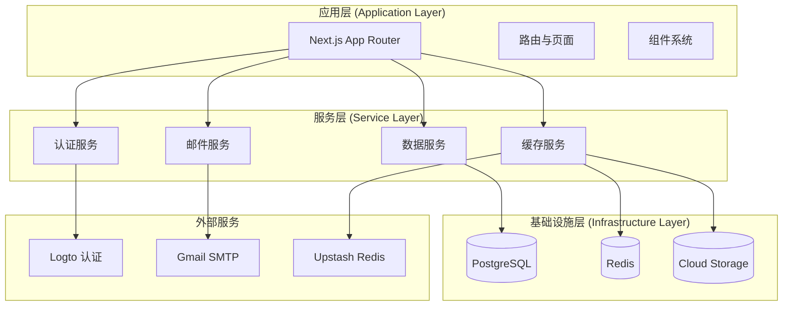
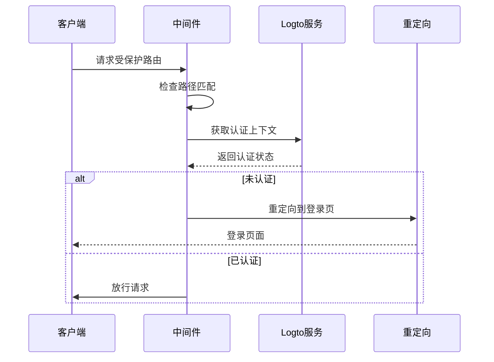
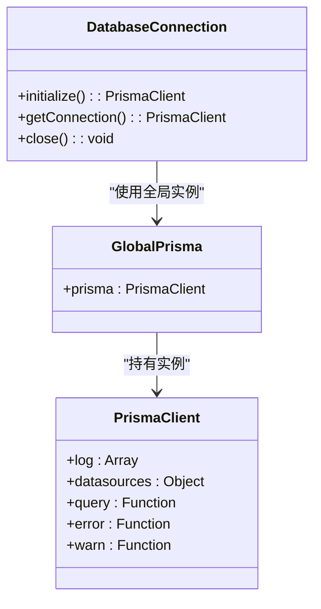
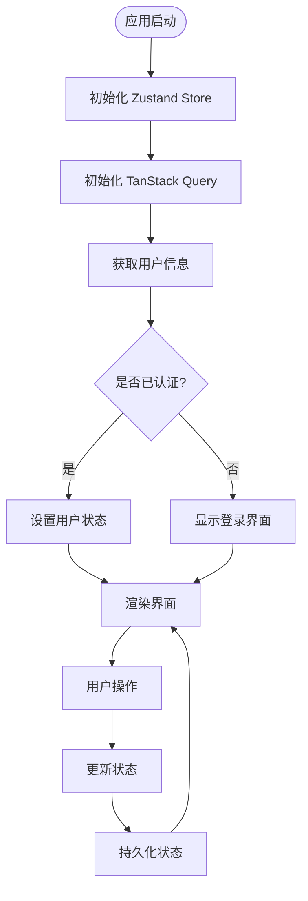
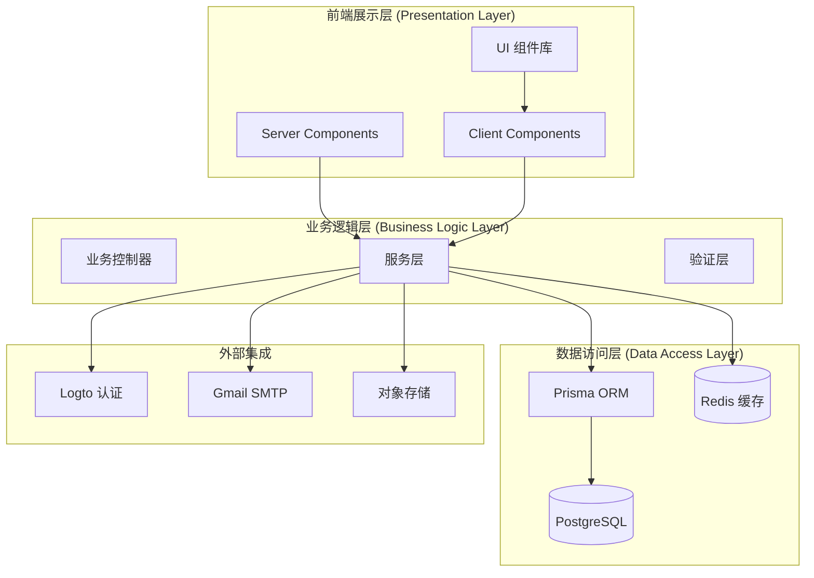
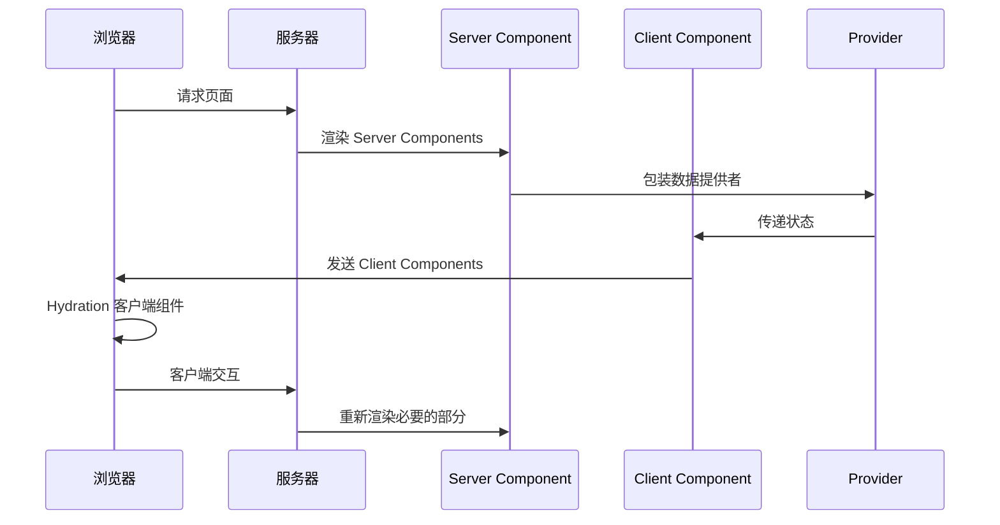
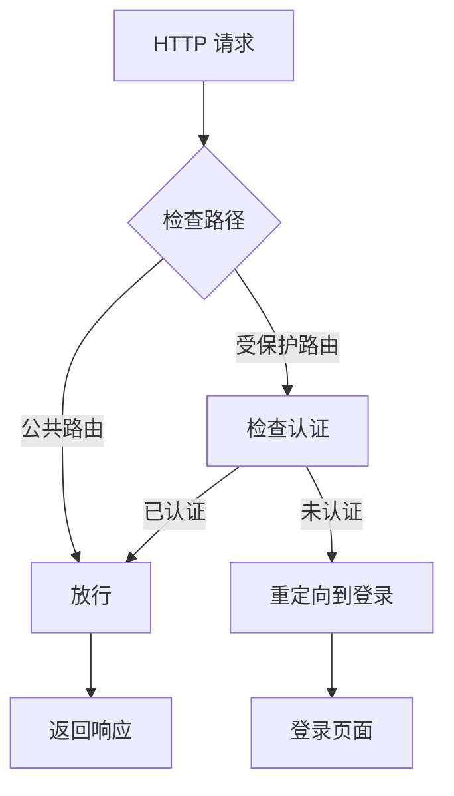
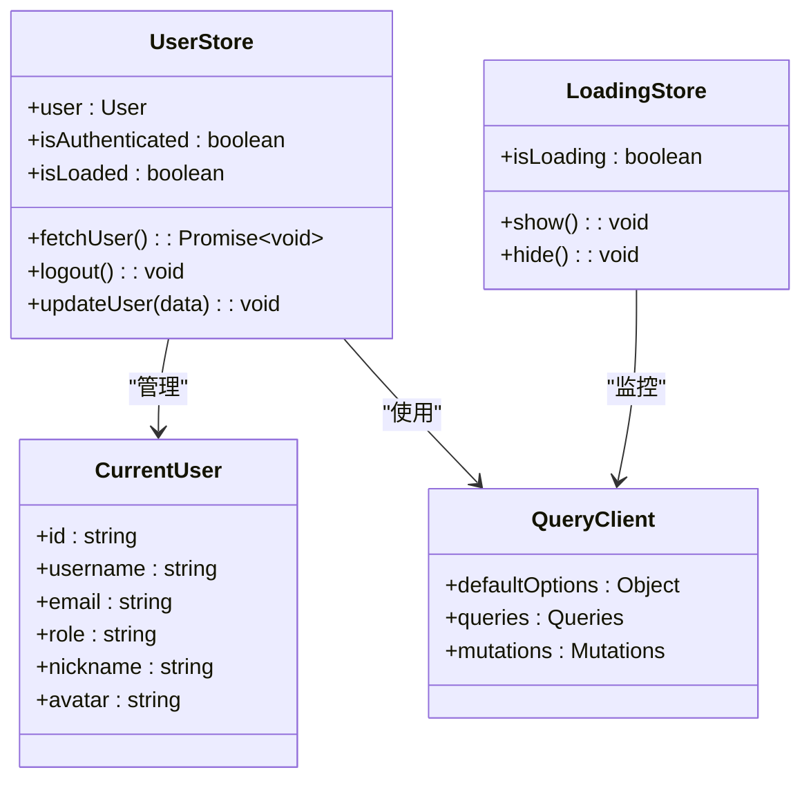
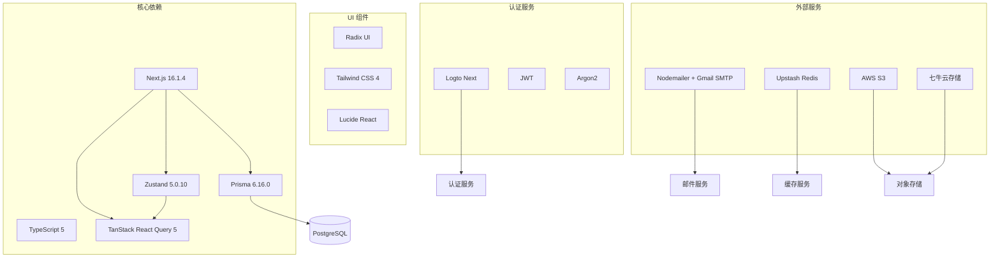

# 项目架构设计

<cite>
**本文档引用的文件**
- [README.md](file://README.md)
- [package.json](file://package.json)
- [next.config.ts](file://next.config.ts)
- [src/middleware.ts](file://src/middleware.ts)
- [src/lib/db.ts](file://src/lib/db.ts)
- [prisma/schema.prisma](file://prisma/schema.prisma)
- [src/app/layout.tsx](file://src/app/layout.tsx)
- [src/lib/logto.ts](file://src/lib/logto.ts)
- [src/store/user-store.ts](file://src/store/user-store.ts)
- [src/lib/session.ts](file://src/lib/session.ts)
- [src/lib/env.ts](file://src/lib/env.ts)
- [src/lib/upstash-redis.ts](file://src/lib/upstash-redis.ts)
- [src/app/api/auth/me/route.ts](file://src/app/api/auth/me/route.ts)
- [src/app/dashboard/layout.tsx](file://src/app/dashboard/layout.tsx)
- [src/components/providers/query-provider.tsx](file://src/components/providers/query-provider.tsx)
- [src/components/providers/loading-provider.tsx](file://src/components/providers/loading-provider.tsx)
- [src/app/(site)/page.tsx](file://src/app/(site)/page.tsx)
- [src/app/admin/login/layout.tsx](file://src/app/admin/login/layout.tsx)
</cite>

## 目录
1. [引言](#引言)
2. [项目结构](#项目结构)
3. [核心组件](#核心组件)
4. [架构总览](#架构总览)
5. [详细组件分析](#详细组件分析)
6. [依赖关系分析](#依赖关系分析)
7. [性能考虑](#性能考虑)
8. [故障排除指南](#故障排除指南)
9. [结论](#结论)

## 引言
本项目是一梦五千年多功能工具平台，基于 Next.js App Router 构建，采用前后端分离的分层架构设计。系统集成了用户认证、博客管理、AI 工具库、实用工具箱、友链管理、邮件系统、数据分析等核心功能模块。项目采用 TypeScript 进行强类型开发，使用 Prisma ORM 进行数据库抽象，Zustand 进行客户端状态管理，TanStack Query 进行数据获取与缓存，Radix UI + Tailwind CSS 实现 UI 组件体系。

## 项目结构
项目采用标准的 Next.js App Router 结构，主要分为以下层次：



**图表来源**
- [src/app/layout.tsx:26-51](file://src/app/layout.tsx#L26-L51)
- [src/middleware.ts:8-28](file://src/middleware.ts#L8-L28)

**章节来源**
- [README.md:54-69](file://README.md#L54-L69)
- [package.json:11-79](file://package.json#L11-L79)

## 核心组件
系统的核心组件包括认证中间件、数据库连接管理、状态管理、数据获取层和提供者组件。

### 认证中间件
认证中间件负责保护受保护路由，使用 Logto 进行身份验证：



**图表来源**
- [src/middleware.ts:8-28](file://src/middleware.ts#L8-L28)
- [src/lib/logto.ts:3-12](file://src/lib/logto.ts#L3-L12)

### 数据库连接管理
使用 Prisma Client 进行数据库操作，支持开发环境的日志输出：



**图表来源**
- [src/lib/db.ts:5-14](file://src/lib/db.ts#L5-L14)

### 状态管理模式
采用 Zustand 进行客户端状态管理，结合 TanStack Query 进行数据缓存：



**图表来源**
- [src/store/user-store.ts:21-48](file://src/store/user-store.ts#L21-L48)
- [src/components/providers/query-provider.tsx:6-16](file://src/components/providers/query-provider.tsx#L6-L16)

**章节来源**
- [src/middleware.ts:1-36](file://src/middleware.ts#L1-L36)
- [src/lib/db.ts:1-16](file://src/lib/db.ts#L1-L16)
- [src/store/user-store.ts:1-49](file://src/store/user-store.ts#L1-L49)

## 架构总览
系统采用分层架构设计，明确划分了前端展示层、业务逻辑层和数据访问层：



**图表来源**
- [src/app/layout.tsx:38-46](file://src/app/layout.tsx#L38-L46)
- [src/lib/session.ts:17-41](file://src/lib/session.ts#L17-L41)

## 详细组件分析

### 混合渲染模式
项目采用 Server Components 与 Client Components 混合渲染模式：



**图表来源**
- [src/app/layout.tsx:38-46](file://src/app/layout.tsx#L38-L46)
- [src/app/(site)/page.tsx](file://src/app/(site)/page.tsx#L4-L22)

### 中间件认证机制
中间件负责路由级别的认证控制：



**图表来源**
- [src/middleware.ts:15-25](file://src/middleware.ts#L15-L25)

### API 路由设计
系统采用 App Router 的 API 路由设计，支持多种业务场景：

```mermaid
graph LR
subgraph "认证 API"
ME[/api/auth/me]
LOGIN[/api/logto/sign-in]
LOGOUT[/api/logto/sign-out]
CALLBACK[/api/logto/callback]
end
subgraph "内容 API"
POSTS[/api/open/posts]
CATEGORIES[/api/open/categories]
COMMENTS[/api/comments]
end
subgraph "管理 API"
USERS[/api/users]
EMAILLOGS[/api/email-logs]
ANALYTICS[/api/analytics]
end
ME --> AUTH[认证服务]
LOGIN --> AUTH
LOGOUT --> AUTH
CALLBACK --> AUTH
POSTS --> CONTENT[内容服务]
CATEGORIES --> CONTENT
COMMENTS --> CONTENT
USERS --> ADMIN[管理服务]
EMAILLOGS --> ADMIN
ANALYTICS --> ANALYTICS[分析服务]
```

**图表来源**
- [src/app/api/auth/me/route.ts:4-12](file://src/app/api/auth/me/route.ts#L4-L12)

### 状态管理模式
客户端状态管理采用 Zustand，结合 React Query 进行数据缓存：



**图表来源**
- [src/store/user-store.ts:21-48](file://src/store/user-store.ts#L21-L48)
- [src/components/providers/query-provider.tsx:6-16](file://src/components/providers/query-provider.tsx#L6-L16)

**章节来源**
- [src/app/layout.tsx:1-52](file://src/app/layout.tsx#L1-L52)
- [src/lib/session.ts:1-42](file://src/lib/session.ts#L1-L42)
- [src/components/providers/loading-provider.tsx:1-49](file://src/components/providers/loading-provider.tsx#L1-L49)

## 依赖关系分析
系统的关键依赖关系如下：



**图表来源**
- [package.json:11-79](file://package.json#L11-L79)
- [next.config.ts:3-13](file://next.config.ts#L3-L13)

**章节来源**
- [package.json:1-98](file://package.json#L1-L98)
- [prisma/schema.prisma:1-308](file://prisma/schema.prisma#L1-L308)

## 性能考虑
系统在多个层面进行了性能优化：

### 数据库优化
- 使用 Prisma 的 relationJoins 预览特性，通过单条 LATERAL JOIN 获取关联数据
- 为常用查询字段建立索引，包括用户邮箱、文章分类等
- 使用连接池配置，开发环境启用详细日志

### 缓存策略
- Redis 缓存用于热点数据访问
- Upstash Redis 提供云端缓存服务
- React Query 缓存策略设置 60 秒过期时间

### 前端性能
- 动态导入关键组件，减少首屏加载时间
- 使用骨架屏提升用户体验
- React.memo 和 React.lazy 优化组件渲染

## 故障排除指南
常见问题及解决方案：

### 认证相关问题
1. **登录后重定向循环**
   - 检查 Logto 配置是否正确
   - 验证回调 URL 设置
   - 确认 Cookie 配置

2. **用户信息获取失败**
   - 检查数据库连接
   - 验证账户关联表数据完整性
   - 查看 Prisma 日志

### 数据库连接问题
1. **连接超时**
   - 检查 DATABASE_URL 配置
   - 验证数据库服务状态
   - 检查网络连接

2. **查询性能问题**
   - 分析慢查询日志
   - 检查索引使用情况
   - 优化复杂查询

### 缓存问题
1. **缓存不一致**
   - 检查缓存失效策略
   - 验证数据同步机制
   - 清理异常缓存数据

**章节来源**
- [src/lib/logto.ts:3-12](file://src/lib/logto.ts#L3-L12)
- [src/lib/db.ts:7-14](file://src/lib/db.ts#L7-L14)
- [src/lib/upstash-redis.ts:5-14](file://src/lib/upstash-redis.ts#L5-L14)

## 结论
一梦五千年项目采用了现代化的全栈架构设计，通过 Next.js App Router 的分层架构实现了清晰的职责分离。系统在认证、数据访问、状态管理等方面都采用了最佳实践，确保了良好的可维护性和扩展性。混合渲染模式的使用提升了用户体验，而完善的缓存策略保证了系统的高性能表现。未来可以在微服务拆分、容器化部署、监控告警等方面进一步完善架构设计。