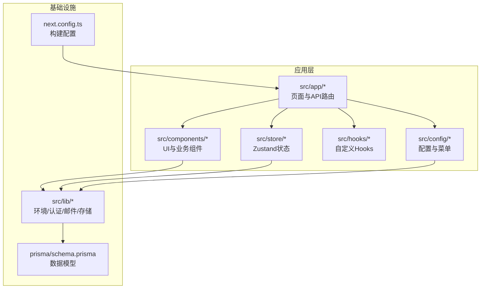
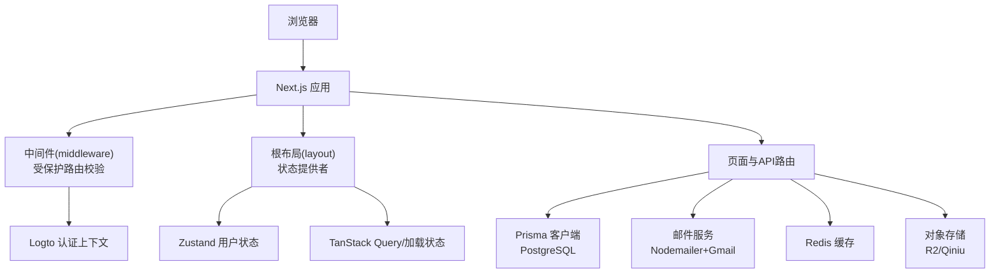
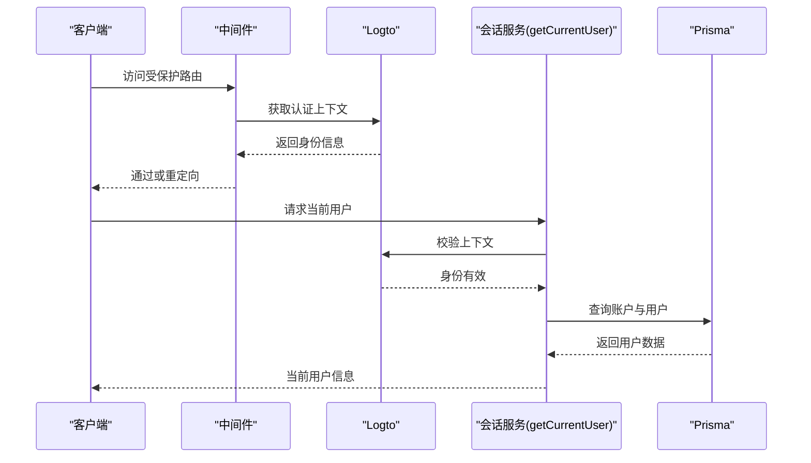
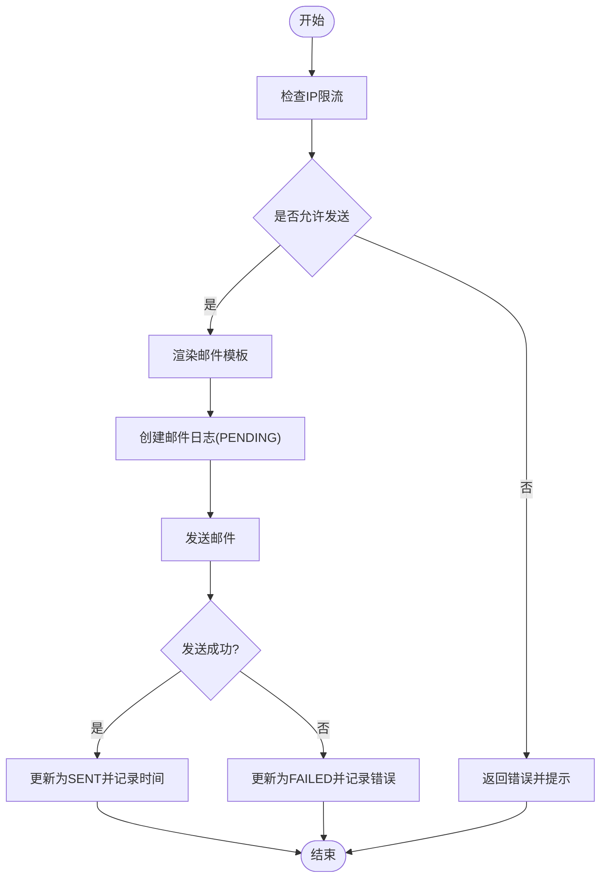
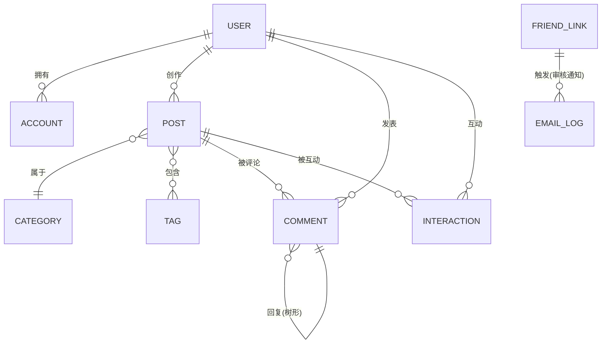
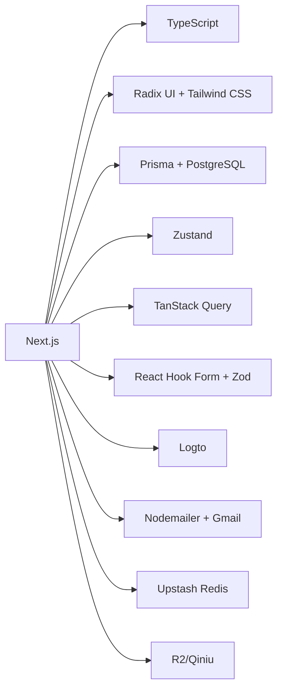

# 项目概述

<cite>
**本文档引用的文件**
- [README.md](file://README.md)
- [package.json](file://package.json)
- [next.config.ts](file://next.config.ts)
- [src/lib/env.ts](file://src/lib/env.ts)
- [prisma/schema.prisma](file://prisma/schema.prisma)
- [src/app/layout.tsx](file://src/app/layout.tsx)
- [src/middleware.ts](file://src/middleware.ts)
- [src/lib/logto.ts](file://src/lib/logto.ts)
- [src/lib/session.ts](file://src/lib/session.ts)
- [src/lib/email-service.ts](file://src/lib/email-service.ts)
- [src/components/admin/app-sidebar.tsx](file://src/components/admin/app-sidebar.tsx)
- [src/store/user-store.ts](file://src/store/user-store.ts)
- [src/hooks/use-mobile.ts](file://src/hooks/use-mobile.ts)
- [src/lib/utils.ts](file://src/lib/utils.ts)
- [src/config/admin-menu.ts](file://src/config/admin-menu.ts)
</cite>

## 目录
1. [引言](#引言)
2. [项目结构](#项目结构)
3. [核心组件](#核心组件)
4. [架构总览](#架构总览)
5. [详细组件分析](#详细组件分析)
6. [依赖分析](#依赖分析)
7. [性能考虑](#性能考虑)
8. [故障排除指南](#故障排除指南)
9. [结论](#结论)
10. [附录](#附录)

## 引言
“一梦五千年”是一个基于 Next.js 的现代化工具平台与博客系统，旨在为用户提供统一的后台管理与前台展示能力。项目围绕以下核心目标展开：
- 构建一个功能完备的博客系统，支持文章发布、分类、标签、评论与互动。
- 提供丰富的实用工具箱，覆盖日常开发与办公场景。
- 整合 AI 工具库，集中展示与审核第三方 AI 能力。
- 实现友链管理与邮件系统，完善社区生态与自动化通知。
- 建立数据分析体系，跟踪网站访问与用户行为。
- 以现代化技术栈实现响应式设计与深色主题体验。

这些目标通过模块化的 App Router 页面、服务端中间件、数据库模型与前端状态管理共同实现，形成从用户认证到内容管理、从工具服务到数据分析的完整闭环。

**章节来源**
- [README.md:1-125](file://README.md#L1-L125)

## 项目结构
项目采用 Next.js App Router 的分层组织方式，结合 Prisma 数据模型与自研工具库，形成清晰的职责边界：
- 根目录包含文档、迁移脚本与环境配置模板。
- src/app 下按路由域划分功能页面与 API 路由，如 (auth)、(site)、dashboard、editor 等。
- src/components 提供可复用 UI 组件与业务组件。
- src/lib 封装环境变量、认证、邮件、存储等通用能力。
- prisma/schema 定义数据模型与枚举，支撑博客、用户、工具、邮件等业务实体。
- public/static 存放静态资源与品牌素材。



**图表来源**
- [src/app/layout.tsx:26-51](file://src/app/layout.tsx#L26-L51)
- [prisma/schema.prisma:1-308](file://prisma/schema.prisma#L1-L308)
- [src/lib/env.ts:1-40](file://src/lib/env.ts#L1-L40)

**章节来源**
- [README.md:54-69](file://README.md#L54-L69)
- [src/app/layout.tsx:1-52](file://src/app/layout.tsx#L1-L52)
- [prisma/schema.prisma:1-308](file://prisma/schema.prisma#L1-L308)

## 核心组件
- 用户认证与会话
  - 基于 Logto 的 Edge 中间件与服务端上下文，统一处理受保护路由与登录态校验。
  - 通过自定义 getCurrentUser 在请求级缓存中完成一次校验与数据库查询，降低重复开销。
- 博客与内容管理
  - 使用 Prisma 模型定义用户、文章、分类、标签、评论与互动，支持草稿、发布、归档等状态流转。
  - 提供编辑器页面与开放 API，便于内容创作与外部集成。
- AI 工具库与实用工具箱
  - 支持本地与外部工具两类，具备状态管理与分类标签，便于运营与展示。
- 友链管理与邮件系统
  - 友链申请审核流程与自动邮件通知，结合 IP 限流与失败重试机制，保障稳定性与合规性。
- 数据分析与访问统计
  - SiteVisit 模型记录 UV、设备、来源与时间，配合前端埋点组件实现行为追踪。
- 响应式与主题
  - 使用 Radix UI + Tailwind CSS，提供深色主题与移动端适配，提升可用性。

**章节来源**
- [src/middleware.ts:1-36](file://src/middleware.ts#L1-L36)
- [src/lib/session.ts:1-42](file://src/lib/session.ts#L1-L42)
- [prisma/schema.prisma:15-308](file://prisma/schema.prisma#L15-L308)
- [src/lib/email-service.ts:1-215](file://src/lib/email-service.ts#L1-L215)
- [src/app/layout.tsx:1-52](file://src/app/layout.tsx#L1-L52)

## 架构总览
下图展示了从前端页面到服务端中间件、认证、数据库与邮件服务的整体交互路径：



**图表来源**
- [src/middleware.ts:8-28](file://src/middleware.ts#L8-L28)
- [src/lib/logto.ts:1-13](file://src/lib/logto.ts#L1-L13)
- [src/app/layout.tsx:34-47](file://src/app/layout.tsx#L34-L47)
- [src/store/user-store.ts:21-49](file://src/store/user-store.ts#L21-L49)
- [prisma/schema.prisma:1-13](file://prisma/schema.prisma#L1-L13)
- [src/lib/email-service.ts:87-101](file://src/lib/email-service.ts#L87-L101)
- [src/lib/env.ts:14-32](file://src/lib/env.ts#L14-L32)

## 详细组件分析

### 认证与会话组件
- 中间件保护
  - 对 /dashboard 与 /admin 路由进行保护，未登录或无效身份将重定向至登录回调。
- Logto 配置
  - 通过环境变量注入 endpoint、appId、baseUrl、cookieSecret，并启用 email scope。
- 请求级会话
  - getCurrentUser 使用 React cache() 去重，先校验 Logto 上下文，再查询账户与用户信息，返回标准化 CurrentUser。



**图表来源**
- [src/middleware.ts:8-28](file://src/middleware.ts#L8-L28)
- [src/lib/logto.ts:3-12](file://src/lib/logto.ts#L3-L12)
- [src/lib/session.ts:17-41](file://src/lib/session.ts#L17-L41)

**章节来源**
- [src/middleware.ts:1-36](file://src/middleware.ts#L1-L36)
- [src/lib/logto.ts:1-13](file://src/lib/logto.ts#L1-L13)
- [src/lib/session.ts:1-42](file://src/lib/session.ts#L1-L42)

### 邮件系统组件
- IP 限流策略
  - 同一 IP 每小时最多发送 3 封邮件；若存在 2 小时内可重试的失败记录，则允许重试。
- 友链审核通知
  - 渲染 React Email 模板，写入 EmailLog 并尝试发送；成功更新为 SENT，失败记录错误信息。
- 邮件日志与重试
  - 提供分页查询与失败重试接口，支持增加发送计数与错误追踪。



**图表来源**
- [src/lib/email-service.ts:11-55](file://src/lib/email-service.ts#L11-L55)
- [src/lib/email-service.ts:58-123](file://src/lib/email-service.ts#L58-L123)
- [src/lib/email-service.ts:159-214](file://src/lib/email-service.ts#L159-L214)

**章节来源**
- [src/lib/email-service.ts:1-215](file://src/lib/email-service.ts#L1-L215)
- [prisma/schema.prisma:243-260](file://prisma/schema.prisma#L243-L260)

### 管理后台组件
- 侧边栏导航
  - 基于 admin-menu 配置生成目录与菜单项，支持折叠、子菜单与当前路由高亮。
- 用户状态管理
  - 使用 Zustand 管理登录态、用户信息与登出跳转，结合 /api/auth/me 获取当前用户。

```mermaid
classDiagram
class AppSidebar {
+渲染目录与菜单
+折叠控制
+当前路由高亮
}
class AdminRoute {
+name : string
+path : string
+icon : LucideIcon
+type : "CATALOG"|"MENU"|"BUTTON"
+sort : number
+visible : boolean
+status : "NORMAL"|"DISABLED"
+isExternal : boolean
+children : AdminRoute[]
}
class UserStore {
+user : User|null
+isAuthenticated : boolean
+isLoaded : boolean
+fetchUser() : Promise<void>
+logout() : void
+updateUser(data) : void
}
AppSidebar --> AdminRoute : "使用配置"
UserStore --> "API" : "/api/auth/me"
```

**图表来源**
- [src/components/admin/app-sidebar.tsx:31-69](file://src/components/admin/app-sidebar.tsx#L31-L69)
- [src/config/admin-menu.ts:6-16](file://src/config/admin-menu.ts#L6-L16)
- [src/store/user-store.ts:21-49](file://src/store/user-store.ts#L21-L49)

**章节来源**
- [src/components/admin/app-sidebar.tsx:1-145](file://src/components/admin/app-sidebar.tsx#L1-L145)
- [src/config/admin-menu.ts:1-189](file://src/config/admin-menu.ts#L1-L189)
- [src/store/user-store.ts:1-49](file://src/store/user-store.ts#L1-L49)

### 数据模型与业务实体
- 用户(User)：用户名、邮箱唯一，角色、激活状态、第三方账户关联。
- 账户(Account)：第三方提供商与令牌信息，与用户一对一。
- 分类(Category)/标签(Tag)：内容组织与检索。
- 文章(Post)：标题、摘要、封面、状态、浏览量、作者与分类。
- 评论(Comment)：树形回复结构，支持编辑标记。
- 互动(Interaction)：点赞、收藏等用户行为。
- 友链(FriendLink)：站点信息与审核状态。
- AI 工具(AiTool)：名称、描述、URL、分类与状态。
- 工具(Tool)：本地/外部工具，版本与状态。
- 访问统计(SiteVisit)：UV、页面、设备、来源、IP、时间。
- 验证码(VerificationCode)：邮箱验证码与过期时间。
- 邮件日志(EmailLog)：发送状态、错误信息、IP、计数与时间。



**图表来源**
- [prisma/schema.prisma:15-167](file://prisma/schema.prisma#L15-L167)
- [prisma/schema.prisma:169-198](file://prisma/schema.prisma#L169-L198)
- [prisma/schema.prisma:200-214](file://prisma/schema.prisma#L200-L214)
- [prisma/schema.prisma:216-260](file://prisma/schema.prisma#L216-L260)

**章节来源**
- [prisma/schema.prisma:1-308](file://prisma/schema.prisma#L1-L308)

### 前端基础与工具
- 布局与主题
  - 根布局启用 QueryProvider、LoadingProvider、Toaster 与 AnalyticsTracker，统一提供状态与通知。
- 移动端适配
  - useIsMobile 基于媒体查询判断断点，便于条件渲染与样式调整。
- 工具函数
  - cn 结合 clsx 与 tailwind-merge，简化类名合并与冲突处理。

**章节来源**
- [src/app/layout.tsx:1-52](file://src/app/layout.tsx#L1-L52)
- [src/hooks/use-mobile.ts:1-20](file://src/hooks/use-mobile.ts#L1-L20)
- [src/lib/utils.ts:1-7](file://src/lib/utils.ts#L1-L7)

## 依赖分析
- 框架与运行时
  - Next.js 16.1.4(App Router)，TypeScript 5，ESLint 与构建忽略类型错误以适配生产部署。
- UI 与样式
  - Radix UI + Tailwind CSS 4，Tailwind 4，提供一致的视觉与交互语义。
- 数据与状态
  - Prisma ORM + PostgreSQL，Zustand 管理前端状态，TanStack Query 管理服务端数据获取。
- 表单与验证
  - React Hook Form + Zod，确保表单输入的强类型与校验一致性。
- 认证与安全
  - Logto Edge 中间件，JWT 与 Argon2 密码哈希（环境变量配置）。
- 邮件与通知
  - Nodemailer + Gmail SMTP，React Email 渲染模板，支持验证码、通知与友链审核邮件。
- 存储与缓存
  - Upstash Redis，Cloudflare R2 或七牛云对象存储，支持图片与静态资源托管。
- 其他
  - Recharts 图表、TSParticles 动画、QRCode 生成、Base64 转换、文本差异对比等工具集成。



**图表来源**
- [package.json:11-97](file://package.json#L11-L97)
- [next.config.ts:3-13](file://next.config.ts#L3-L13)

**章节来源**
- [package.json:1-98](file://package.json#L1-L98)
- [next.config.ts:1-16](file://next.config.ts#L1-L16)

## 性能考虑
- 构建与类型检查
  - 生产构建忽略 ESLint 与 TypeScript 错误，减少部署阻塞风险。
- 请求级缓存
  - 使用 React cache() 在一次请求内去重认证与用户查询，降低数据库压力。
- 数据查询优化
  - Prisma previewFeatures 启用 relationJoins，减少多次往返的关联查询成本。
- 前端状态与数据获取
  - Zustand 与 TanStack Query 组合，避免不必要的重渲染与重复请求。
- 移动端体验
  - 断点监听与 Tailwind 原子类，减少运行时样式计算开销。

**章节来源**
- [next.config.ts:5-12](file://next.config.ts#L5-L12)
- [src/lib/session.ts:15-16](file://src/lib/session.ts#L15-L16)
- [prisma/schema.prisma:3-5](file://prisma/schema.prisma#L3-L5)

## 故障排除指南
- 认证问题
  - 确认 Logto 环境变量配置正确，Edge 中间件是否拦截未登录访问。
  - 检查 /api/auth/me 接口返回与 Cookie 设置。
- 邮件发送失败
  - 查看 EmailLog 状态与错误信息，确认 IP 限流是否触发。
  - 使用失败重试接口对特定日志进行重试，并观察发送计数与错误累积。
- 数据库连接
  - 核对 DATABASE_URL 与 DIRECT_URL，确保 Prisma 生成与迁移执行正常。
- 构建与部署
  - 若出现类型或 ESLint 错误导致构建失败，可临时开启忽略选项以验证部署。

**章节来源**
- [src/middleware.ts:15-25](file://src/middleware.ts#L15-L25)
- [src/lib/email-service.ts:159-214](file://src/lib/email-service.ts#L159-L214)
- [prisma/schema.prisma:7-13](file://prisma/schema.prisma#L7-L13)
- [next.config.ts:5-12](file://next.config.ts#L5-L12)

## 结论
“一梦五千年”通过现代全栈技术栈，将博客系统、工具平台与后台管理有机整合，既满足初学者快速上手的需求，也为有经验的开发者提供了清晰的架构与扩展空间。其核心优势体现在：
- 明确的模块边界与职责分离，便于维护与演进。
- 完善的认证与数据模型，支撑复杂业务场景。
- 高可用的邮件系统与访问统计，增强运营能力。
- 响应式设计与主题体系，提升用户体验。

## 附录
- 快速开始
  - 安装依赖、复制环境变量模板、配置数据库与邮件参数后启动开发服务器。
- 环境变量
  - 包含 Gmail、数据库、Redis、上传提供商、Open API 等关键配置项。
- 技术选型说明
  - Next.js App Router 提供现代路由与数据获取能力；Prisma 简化数据库操作；Zustand/TanStack Query 优化状态与数据流；Radix UI + Tailwind CSS 提升开发效率与一致性。

**章节来源**
- [README.md:71-125](file://README.md#L71-L125)
- [src/lib/env.ts:1-40](file://src/lib/env.ts#L1-L40)